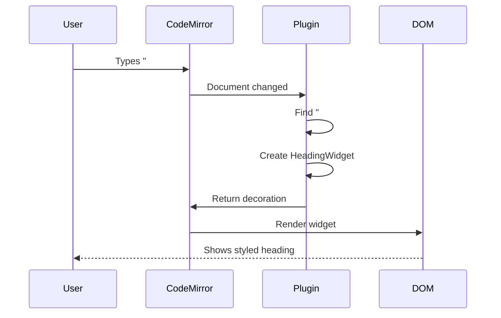

# Getting Started with MDNotes Viewer

**A Beginner-Friendly Guide to Understanding and Contributing**

Welcome! This guide is designed for developers who are new to React and CodeMirror. We'll walk through the application step by step.

## Prerequisites

Before you start, make sure you have:
- **Node.js** 18 or higher ([Download here](https://nodejs.org/))
- **Yarn** package manager (`npm install -g yarn`)
- **Basic JavaScript/TypeScript knowledge**
- **A code editor** (VSCode recommended)

## Quick Start

```bash
# 1. Clone and install
git clone <repository-url>
cd mdnotes-viewer
yarn install

# 2. Start the development server
yarn dev

# 3. Open in browser
open http://localhost:3000
```

## Understanding the Application

### What Does It Do?

MDN otes Viewer is a markdown editor similar to Obsidian or Typora:
1. You can browse markdown files in a file explorer
2. Edit them with live preview (see formatting as you type)
3. View rendered markdown with table of contents

### Architecture Overview

```
┌─────────────────────────────────────────────────────┐
│                   Browser Window                     │
├──────────┬────────────────────────┬──────────────────┤
│   File   │     Editor/Preview     │  Table of        │
│  Explorer│      (Main Area)       │   Contents       │
│          │                        │                  │
│  - docs/ │  # My Document         │  • Heading 1     │
│  - guide/│                        │    - Sub-heading │
│  - api/  │  Content here...       │  • Heading 2     │
│          │                        │                  │
└──────────┴────────────────────────┴──────────────────┘
```

## Core Concepts

### 1. React Basics

#### Components

Components are reusable pieces of UI:

```typescript
// A simple component
export function Welcome() {
  return <div>Hello, World!</div>;
}

// Using it
<Welcome />
```

#### State

State is data that can change:

```typescript
// Local state with useState
const [count, setCount] = useState(0);

// Update state
setCount(count + 1);
```

#### Effects

Effects run after rendering:

```typescript
useEffect(() => {
  // This runs after component renders
  console.log('Component mounted!');
  
  // Cleanup function
  return () => {
    console.log('Component unmounting!');
  };
}, []); // Empty array = run once
```

### 2. CodeMirror Basics

CodeMirror is the text editor that powers our markdown editor.

#### Key Concepts

**EditorState** - The document content:
```typescript
const state = EditorState.create({
  doc: "# Hello\n\nThis is markdown",
  extensions: [/* plugins */]
});
```

**EditorView** - The visual editor:
```typescript
const view = new EditorView({
  state,
  parent: document.body
});
```

**Decorations** - Visual modifications:
```typescript
// Turn "# Heading" into a big styled heading
Decoration.replace({
  widget: new HeadingWidget()
}).range(from, to)
```

**Plugins** - Extend functionality:
```typescript
const myPlugin = StateField.define({
  create: (state) => buildDecorations(state),
  update: (deco, tr) => {
    if (tr.docChanged) {
      return buildDecorations(tr.state);
    }
    return deco;
  }
});
```

### 3. How Our Live Editor Works



## Project Structure Explained

```
mdnotes-viewer/
│
├── app/                        # Next.js application
│   ├── page.tsx               # Main page (START HERE)
│   ├── layout.tsx             # Wraps entire app
│   └── api/files/             # File operations API
│
├── features/                   # Feature modules
│   │
│   ├── file-explorer/         # Left sidebar
│   │   ├── components/
│   │   │   └── FileExplorer.tsx    # Tree view
│   │   └── store/
│   │       └── file-explorer-store.ts
│   │
│   ├── editor/            # Main editor & preview (CORE FEATURE)
│   │   ├── components/
│   │   │   ├── LiveMarkdownEditor.tsx  # Editor component
│   │   │   ├── MarkdownPreview.tsx     # Preview component
│   │   │   └── TableOfContents.tsx     # TOC sidebar
│   │   │
│   │   ├── plugins/       # CodeMirror plugins
│   │   │   ├── plugin-utils.ts        # Shared code
│   │   │   ├── list-plugin.tsx        # Bullet points
│   │   │   ├── code-block-plugin.tsx  # Code highlighting
│   │   │   ├── mermaid-plugin.tsx     # Diagrams
│   │   │   └── ...
│   │   │
│   │   ├── hooks/         # Composition hooks
│   │   │   ├── use-table-of-contents.ts
│   │   │   └── use-active-heading.ts
│   │   │
│   │   └── store/
│   │       ├── editor-store.ts
│   │       └── toc-store.ts
│
├── shared/                     # Shared code
│   ├── components/
│   │   ├── app-shell.tsx      # Layout container
│   │   ├── app-toolbar.tsx    # Top toolbar
│   │   └── ui/                # Reusable UI components
│   ├── types/                 # TypeScript types
│   └── utils/                 # Helper functions
│
└── core/                       # Core systems
    ├── config/                # Configuration
    ├── file-manager/          # File operations
    └── store/                 # Global state
```

## Your First Contribution

Let's make a simple change to understand how everything works.

### Task: Change the Bullet Style

We'll modify how bullet points look in the editor.

**Step 1: Find the plugin**

Open `features/editor/plugins/list-plugin.tsx`

**Step 2: Find the bullet rendering code**

Look for this section:

```typescript
class BulletWidget extends WidgetType {
  toDOM() {
    const span = document.createElement("span");
    span.className = "cm-list-bullet";
    
    const bullets = ["•", "◦", "▪"];  // <-- These are the bullets
    span.textContent = bullets[this.level - 1];
    
    return span;
  }
}
```

**Step 3: Change the bullets**

```typescript
const bullets = ["★", "✦", "◆"];  // Stars instead of dots!
```

**Step 4: See the result**

Save the file and check your editor - bullets should now be stars!

### Task: Add a Custom Plugin

Let's create a plugin that makes `==highlighted text==` stand out.

**Step 1: Create the plugin file**

Create `features/editor/plugins/highlight-plugin.tsx`

**Step 2: Write the plugin**

```typescript
import { syntaxTree } from '@codemirror/language';
import { EditorState, Range, StateField } from '@codemirror/state';
import { Decoration, DecorationSet } from '@codemirror/view';

// Build decorations function
function buildHighlightDecorations(state: EditorState): DecorationSet {
  const decorations: Range<Decoration>[] = [];

  // Find ==text== patterns
  const text = state.doc.toString();
  const regex = /==(.*?)==/g;
  let match;

  while ((match = regex.exec(text)) !== null) {
    const from = match.index;
    const to = from + match[0].length;

    // Add yellow background
    decorations.push(
      Decoration.mark({
        class: 'cm-highlight'
      }).range(from, to)
    );
  }

  return Decoration.set(decorations);
}

// Create the plugin
export const highlightPlugin = StateField.define<DecorationSet>({
  create(state) {
    return buildHighlightDecorations(state);
  },

  update(decorations, tr) {
    if (tr.docChanged) {
      return buildHighlightDecorations(tr.state);
    }
    return decorations;
  },

  provide: (f) => EditorView.decorations.from(f),
});
```

**Step 3: Add CSS**

In `app/globals.css`, add:

```css
.cm-highlight {
  background-color: #ffeb3b;
  padding: 2px 4px;
  border-radius: 2px;
}
```

**Step 4: Register the plugin**

In `features/editor/components/LiveMarkdownEditor.tsx`:

```typescript
import { highlightPlugin } from '../plugins/highlight-plugin';

// Add to extensions array:
const extensions = [
  // ... other plugins
  highlightPlugin,  // Add this
];
```

**Step 5: Test it**

Type `==important text==` in the editor - it should be highlighted!

## Common Patterns

### Reading State

```typescript
// In a component
const currentFile = useEditorStore(state => state.currentFile);
```

### Updating State

```typescript
// In a component
const setFile = useEditorStore(state => state.setFile);

// Call it
setFile(newFile);
```

### Finding Markdown Nodes

```typescript
syntaxTree(state).iterate({
  enter: (node) => {
    if (node.name === 'Heading') {
      // Found a heading!
      const text = state.doc.sliceString(node.from, node.to);
      console.log('Heading:', text);
    }
  }
});
```

### Creating Decorations

```typescript
// Replace text with a widget
Decoration.replace({
  widget: new MyWidget()
}).range(from, to)

// Add a CSS class
Decoration.mark({
  class: 'my-class'
}).range(from, to)

// Add line decoration
Decoration.line({
  class: 'my-line-class'
}).range(from, to)
```

## Debugging Tips

### 1. Console Logging

```typescript
console.log('Current state:', state.doc.toString());
console.log('Selection:', state.selection.main);
```

### 2. React DevTools

Install [React DevTools](https://react.dev/learn/react-developer-tools) to inspect component state

### 3. Check the Syntax Tree

```typescript
console.log(syntaxTree(state).toString());
```

### 4. Common Issues

**Problem**: Plugins not working
- Check if plugin is registered in the extensions array
- Verify the plugin file is imported
- Check browser console for errors

**Problem**: Decorations not showing
- Make sure `create()` and `update()` both return decorations
- Check if CSS classes exist
- Verify the range (from, to) is correct

**Problem**: Performance issues
- Don't rebuild decorations on every update
- Only rebuild when document or selection changes
- Use memoization for expensive computations

## Next Steps

Now that you understand the basics:

1. **Read** [docs/ARCHITECTURE.md](./docs/ARCHITECTURE.md) - Deeper dive into architecture
2. **Study** existing plugins like `list-plugin.tsx` or `horizontal-rule-plugin.tsx`
3. **Experiment** - Modify plugins to understand how they work
4. **Create** - Build your own plugin for custom markdown syntax
5. **Contribute** - Submit a pull request with your improvements!

## Resources

### Documentation
- [CodeMirror 6 Docs](https://codemirror.net/docs/)
- [React Docs](https://react.dev/)
- [TypeScript Handbook](https://www.typescriptlang.org/docs/)
- [Zustand Docs](https://github.com/pmndrs/zustand)

### Videos & Tutorials
- [CodeMirror 6 Tutorial](https://www.youtube.com/results?search_query=codemirror+6+tutorial)
- [React Hooks Tutorial](https://react.dev/reference/react)

### Community
- Ask questions in GitHub Issues
- Read existing code and comments
- Check the commit history to understand changes

## Need Help?

- **General questions**: Open a GitHub Discussion
- **Bug reports**: Create a GitHub Issue
- **Feature requests**: Open a GitHub Issue with "Feature Request" label
- **Code questions**: Comment on specific files/lines in PRs

Happy coding! 🚀
