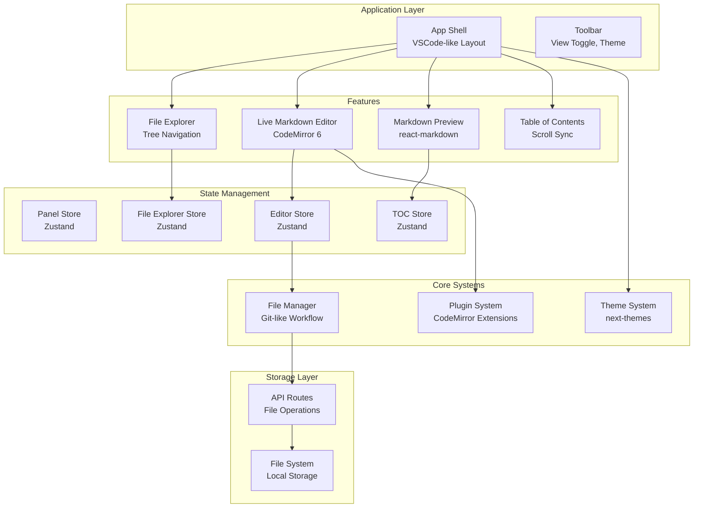
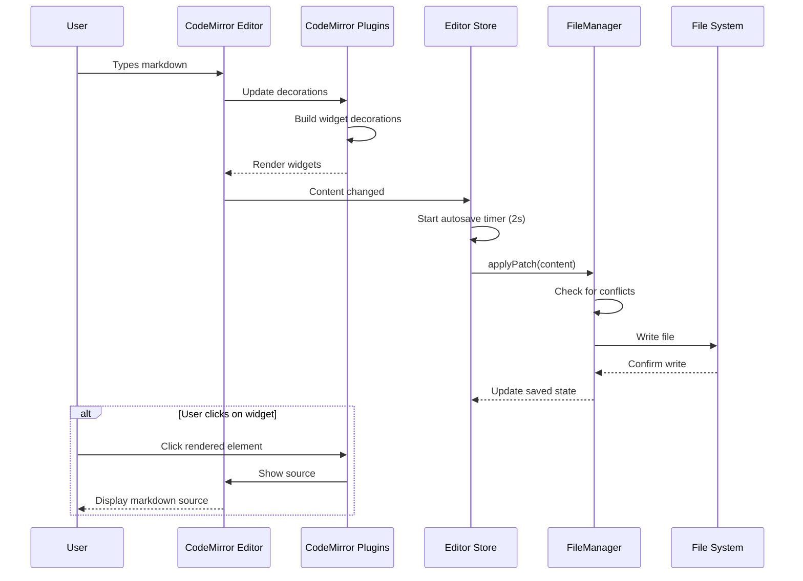
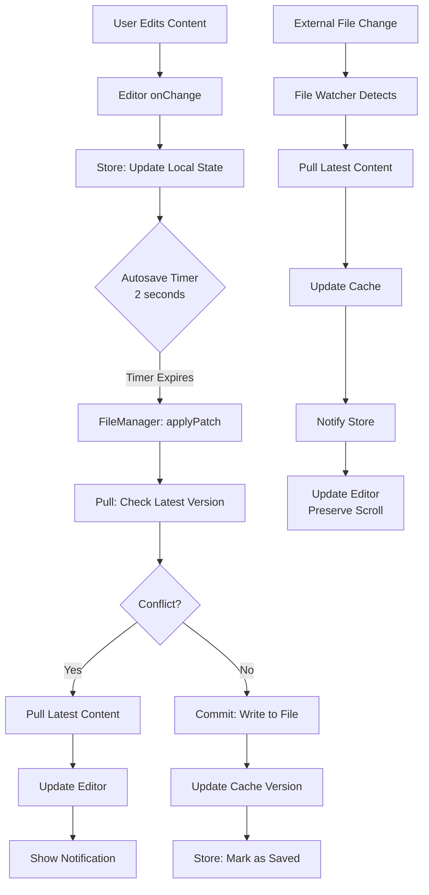

# MDNotes Viewer

A modern, VSCode-inspired markdown documentation viewer built with Next.js 16, featuring a powerful **Live Markdown Editor** powered by **CodeMirror 6** with real-time preview capabilities.

[](https://nextjs.org/)
[](https://reactjs.org/)
[](https://www.typescriptlang.org/)
[](https://codemirror.net/)

## ✨ Features

### 🎨 Professional UI
- **VSCode-like interface** with three-panel layout (Explorer, Editor, TOC)
- **Resizable panels** with persistent sizing
- **Dark/Light theme** with smooth transitions
- **File tabs** with close functionality and active indicators
- **Status bar** with save status and file information

### 📝 Live Markdown Editor (CodeMirror 6)
Our custom-built live markdown editor provides a seamless WYSIWYG-like experience:

#### Core Editor Features
- ✅ **Live Preview** - See formatting as you type (Obsidian-style)
- ✅ **Syntax Highlighting** - Color-coded markdown syntax
- ✅ **Auto-save** - Changes saved automatically (2-second debounce)
- ✅ **Split View** - Edit and preview side-by-side
- ✅ **Vim Mode Support** - Vi/Vim keybindings available

#### Live Rendering Plugins
- ✅ **Smart Links** - Cmd/Ctrl+Click to open in new tab with tooltips
- ✅ **Code Blocks** - Syntax highlighting with copy button and line numbers
- ✅ **Mermaid Diagrams** - Live diagram rendering
- ✅ **Math Equations** - KaTeX rendering (inline and block)
- ✅ **Task Lists** - Interactive checkboxes
- ✅ **Lists** - Styled bullets and numbering
- ✅ **Images** - Inline image rendering
- ✅ **Tables** - GitHub Flavored Markdown tables
- ✅ **Horizontal Rules** - Visual separators
- ✅ **Blockquotes** - Styled quote blocks
- ✅ **HTML Blocks** - Render custom HTML and details/summary

#### Selection & Interaction
- 🎯 **Click to Edit** - Click on rendered elements to see source
- 🎯 **Selection-Aware** - Shows source when text is selected
- 🎯 **Smooth Transitions** - No jarring re-renders when moving cursor

### 📂 File Management
- **Tree-based file explorer** with `react-complex-tree`
- **Context menu** operations (rename, delete, create file/folder)
- **Inline editing** for file and folder names
- **Multiple file support** with tabs
- **Git-like workflow** - Pull before push, conflict detection
- **External change detection** - Auto-refreshes when files change externally
- **Seamless updates** - Preserves scroll position during saves

### 📚 Markdown Support
- **GitHub Flavored Markdown** (GFM)
- **Code blocks** with 15+ languages
- **Tables** with alignment
- **Lists** (bullet, ordered, task)
- **Images** with drag-and-drop support
- **Links** with auto-linking
- **Math equations** with KaTeX
- **Mermaid diagrams** for flowcharts and diagrams
- **HTML embedding** for custom layouts

### 📑 Table of Contents
- **Auto-generated** from document headings
- **Active section** highlighting on scroll
- **Smooth scrolling** to sections
- **Collapsible** sidebar
- **Nested headings** (H1-H6 support)

## 🏗️ Architecture



## 🚀 Getting Started

### Prerequisites
- Node.js 18+ (recommended: 20+)
- Yarn package manager

### Installation

```bash
# Clone the repository
git clone <repository-url>
cd mdnotes-viewer

# Install dependencies
yarn install

# Start development server
yarn dev
```

Open [http://localhost:3000](http://localhost:3000) to see the application.

### Project Structure

```
mdnotes-viewer/
├── app/                              # Next.js app router
│   ├── api/files/[...path]/         # File system API endpoints
│   ├── globals.css                  # Global styles & editor themes
│   ├── layout.tsx                   # Root layout with providers
│   └── page.tsx                     # Main application page
│
├── features/                         # Feature-based modules
│   ├── file-explorer/               # File tree navigation
│   │   ├── components/              # FileExplorer component
│   │   └── store/                   # File tree state
│   │
│   ├── editor/                      # Live markdown editor with preview
│   │   ├── components/              # LiveMarkdownEditor, MarkdownPreview, TOC
│   │   ├── plugins/                 # CodeMirror plugins
│   │   │   ├── plugin-utils.ts     # Shared plugin utilities
│   │   │   ├── custom-link-plugin.tsx
│   │   │   ├── code-block-plugin.tsx
│   │   │   ├── mermaid-plugin.tsx
│   │   │   ├── html-plugin.tsx
│   │   │   └── ...                 # More plugins
│   │   ├── hooks/                   # useTableOfContents, useActiveHeading
│   │   └── store/                   # Editor & TOC state
│
├── shared/                           # Shared resources
│   ├── components/                  # Reusable UI components
│   │   ├── app-shell.tsx           # Main layout
│   │   ├── app-toolbar.tsx         # Top toolbar
│   │   └── ui/                     # UI primitives
│   ├── types/                       # TypeScript types
│   └── utils/                       # Utility functions
│
├── core/                             # Core systems
│   ├── config/                      # Configuration
│   │   └── features.ts             # Feature flags
│   ├── file-manager/               # File management system
│   │   ├── file-manager.ts         # Core file manager
│   │   ├── adapters/               # Storage adapters
│   │   └── README.md               # Architecture docs
│   └── store/                       # Global state
│
└── content/                          # Markdown content
    ├── get-started.md
    ├── mermaid-examples.md
    └── ...
```

## 📖 How It Works

### Live Markdown Editing

The Live Markdown Editor uses CodeMirror 6 with custom plugins to provide a WYSIWYG-like experience:



### Plugin System

Each plugin follows a common pattern:

```typescript
// 1. Define widget for rendering
class CustomWidget extends WidgetType {
  toDOM() {
    // Create DOM element
    const element = document.createElement('div');
    element.innerHTML = this.renderContent();
    return element;
  }

  ignoreEvent() {
    // Control how CodeMirror handles events
    return false; // Let CodeMirror handle for editing
  }
}

// 2. Build decorations
function buildDecorations(state: EditorState): DecorationSet {
  const decorations = [];

  syntaxTree(state).iterate({
    enter: (node) => {
      // Find markdown nodes to replace
      if (node.name === 'TargetNode') {
        // Check if we should show source or rendered
        if (!shouldShowWidgetSourceState(state, node.from, node.to)) {
          const widget = new CustomWidget(data);
          decorations.push(
            Decoration.replace({ widget }).range(node.from, node.to)
          );
        }
      }
    }
  });

  return Decoration.set(decorations);
}

// 3. Create StateField
const customPlugin = StateField.define<DecorationSet>({
  create(state) {
    return buildDecorations(state);
  },

  update(deco, tr) {
    // Rebuild on document or selection change
    if (tr.docChanged || tr.selection) {
      return buildDecorations(tr.state);
    }
    return deco;
  },

  provide: (f) => EditorView.decorations.from(f),
});
```

### File Management Workflow



## 🛠️ Technology Stack

### Core Framework
- **Next.js** 16.1.4 (App Router with Turbopack)
- **React** 19.2.3 (Server & Client Components)
- **TypeScript** 5 (Strict mode)

### Editor & Rendering
- **CodeMirror** 6.x (Extensible code editor)
- **codemirror-live-markdown** (Live preview base)
- **react-markdown** 10.1.0 (Markdown rendering)
- **remark-gfm** 4.0.1 (GitHub Flavored Markdown)
- **rehype-prism-plus** 2.0.1 (Syntax highlighting)
- **KaTeX** (Math rendering)
- **Mermaid** 11.x (Diagram rendering)

### UI & Styling
- **Tailwind CSS** 4 (Utility-first CSS)
- **Radix UI** (Accessible components)
- **lucide-react** (Icon system)
- **next-themes** (Theme management)
- **class-variance-authority** (CVA for variants)

### State & Data
- **Zustand** 5.0.10 (State management)
- **react-complex-tree** 2.6.1 (File tree component)
- **react-resizable-panels** 2.0.0 (Resizable layout)

### Development
- **Yarn** 1.22.x (Package manager)
- **ESLint** (Code linting)
- **Prettier** (Code formatting)

## 📋 Documentation

- [Architecture Guide](./docs/ARCHITECTURE.md) - System architecture and design patterns
- [Plugin Development](./docs/PLUGIN_DEVELOPMENT.md) - Creating CodeMirror plugins
- [File Manager](./core/file-manager/README.md) - File management system
- [Copilot Instructions](./.github/copilot-instructions.md) - Development guidelines

## 🎯 Roadmap

### ✅ Completed
- Live markdown editor with CodeMirror 6
- Custom plugin system (links, code blocks, mermaid, HTML, etc.)
- File management with git-like workflow
- VSCode-like three-panel layout
- Dark/light theme support
- Auto-save with conflict detection
- External file change detection
- Table of contents with scroll sync

### 🚧 In Progress
- [ ] Full-text search across files
- [ ] Split view mode (side-by-side editor and preview)
- [ ] Vim mode enhancements

### 📅 Planned
- [ ] Collaborative editing (WebSocket)
- [ ] Export to PDF/HTML
- [ ] Git integration
- [ ] Plugin marketplace
- [ ] Mobile responsive design
- [ ] Offline mode with sync queue

## 🤝 Contributing

Contributions are welcome! Please see our [Contributing Guide](./CONTRIBUTING.md) for details.

### Development Workflow

```bash
# Create a new branch
git checkout -b feature/my-feature

# Make changes and test
yarn dev

# Build and verify
yarn build

# Commit with conventional commits
git commit -m "feat: add new feature"

# Push and create PR
git push origin feature/my-feature
```

## 📄 License

This project is MIT licensed. See [LICENSE](./LICENSE) for details.

## 🙏 Acknowledgments

- [CodeMirror](https://codemirror.net/) - Extensible code editor
- [codemirror-live-markdown](https://github.com/Milkdown/codemirror-live-markdown) - Live markdown base
- [Next.js](https://nextjs.org/) - React framework
- [Tailwind CSS](https://tailwindcss.com/) - CSS framework
- [Zustand](https://github.com/pmndrs/zustand) - State management
- [Mermaid](https://mermaid.js.org/) - Diagram rendering
- [KaTeX](https://katex.org/) - Math rendering

---

**Version**: 2.0.0
**Last Updated**: February 7, 2026
**Maintainer**: Development Team

Made with ❤️ using React and CodeMirror
