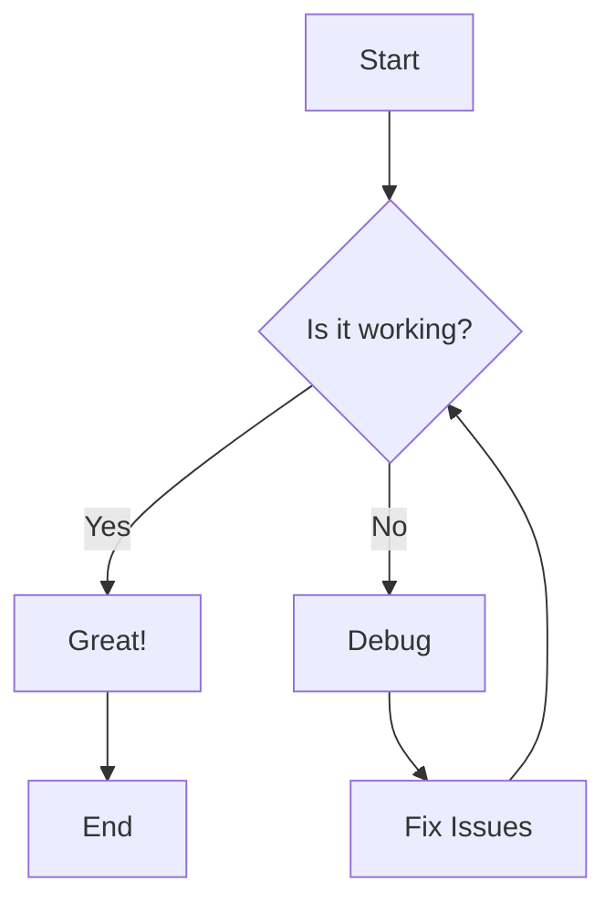
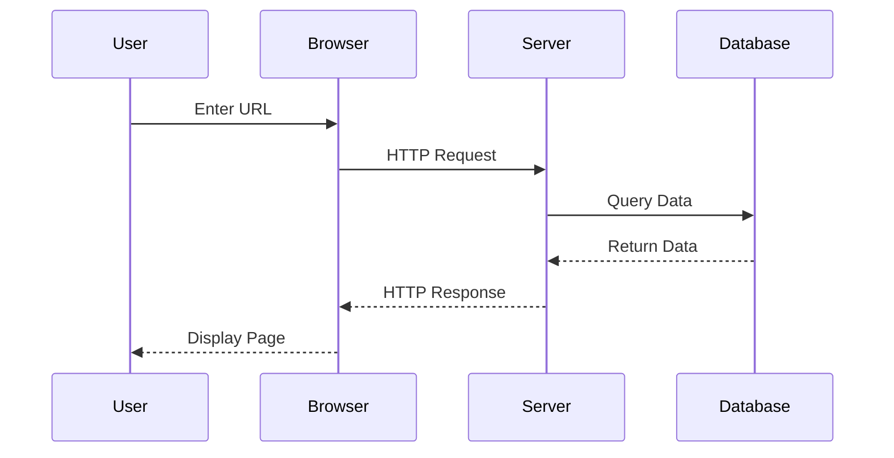
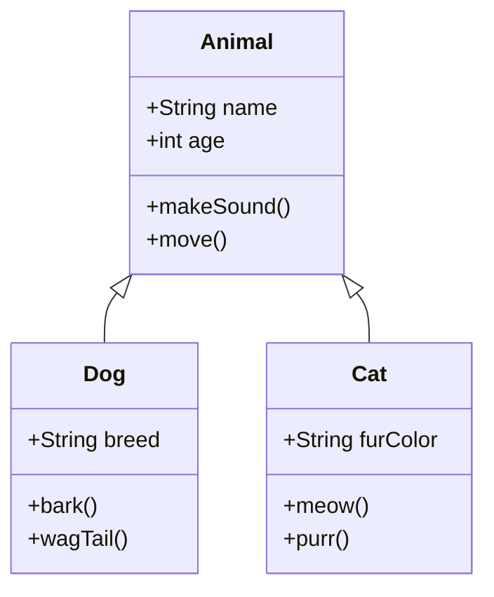

# Link Navigation Testing

This document is a comprehensive test page for verifying link navigation features in the MDNotes viewer.

## Features Being Tested

- ✅ **Same-file anchor links** (`#heading`) - Scroll to headings within the current document
- ✅ **Cross-file links** (`file.md`) - Navigate to other markdown files  
- ✅ **Cross-file with anchors** (`file.md#heading`) - Open file and scroll to specific heading
- ✅ **Modifier key detection** - Cmd/Ctrl+Click for navigation vs regular click for editing
- ✅ **Smooth scrolling** - Visual feedback when jumping to sections
- ✅ **Tooltip hints** - Hover tooltips showing modifier key instructions

All links in this document use the updated anchor format that matches GitHub's heading slugs (lowercase, hyphenated, no special prefix).

## Quick Links (Navigation Tests)

### Same-File Anchor Links
Test navigation within this document:
- [Flowchart section (anchor within this file)](#flowchart)
- [Sequence Diagram (anchor within this file)](#sequence-diagram)
- [Class Diagram (anchor within this file)](#class-diagram)
- [Math Expressions section](#math-expressions-if-supported)
- [Summary section](#summary)

### Cross-File Navigation (File Only)
Test navigation to other files without anchors:
- [Basic Formatting](./01-basic-formatting.md)
- [Lists and Tasks](./02-lists-and-tasks.md)
- [Code Blocks](./03-code-blocks.md)
- [Tables and Quotes](./04-tables-and-quotes.md)

### Cross-File Navigation with Heading Anchors
Test navigation to specific sections in other files (Cmd/Ctrl+Click):
- [Basic Formatting → Headers section](./01-basic-formatting.md#headers)
- [Basic Formatting → Text Formatting section](./01-basic-formatting.md#text-formatting)
- [Basic Formatting → Horizontal Rules](./01-basic-formatting.md#horizontal-rules)
- [Lists and Tasks → Unordered Lists](./02-lists-and-tasks.md#unordered-lists)
- [Lists and Tasks → Ordered Lists](./02-lists-and-tasks.md#ordered-lists)
- [Lists and Tasks → Task Lists](./02-lists-and-tasks.md#task-lists)
- [Code Blocks → Paragraphs and Line Breaks](./03-code-blocks.md#paragraphs-and-line-breaks)
- [Code Blocks → Horizontal Rules](./03-code-blocks.md#horizontal-rules)
- [Tables and Quotes → Basic Tables](./04-tables-and-quotes.md#basic-tables)
- [Tables and Quotes → Tables with Alignment](./04-tables-and-quotes.md#tables-with-alignment)

### Navigation Instructions
- **Same-file anchors**: Cmd/Ctrl+Click to scroll to section
- **Cross-file links**: Cmd/Ctrl+Click to open in new tab
- **Cross-file anchors**: Cmd/Ctrl+Click to open file and scroll to section

---

## Links and Images

### Links
[External link](https://github.com)
[Link with title](https://github.com "GitHub Homepage")

### Relative Links (Test Navigation)
- [Back to Test Links](../test-links.md) — should open the Test Links page
- [Basic Formatting (file)](../01-basic-formatting.md) — should open the Basic Formatting doc
- [Topics Overview](../topics/topics.md) — should open the Topics overview

### Intra-file Anchor Links
- [Jump to Flowchart](#flowchart)
- [Jump to Sequence Diagram](#sequence-diagram)
- [Jump to Class Diagram](#class-diagram)

### Images


## Code Blocks

### Inline Code
Use `console.log()` to print output.

### Fenced Code Blocks

```javascript
function greetUser(name) {
    return `Hello, ${name}!`;
}

const message = greetUser("World");
console.log(message);
```

```python
def fibonacci(n):
    if n <= 1:
        return n
    return fibonacci(n-1) + fibonacci(n-2)

# Generate first 10 fibonacci numbers
for i in range(10):
    print(f"F({i}) = {fibonacci(i)}")
```

## Tables

| Feature | Markdown | HTML | LaTeX |
|---------|----------|------|-------|
| Headers | ✅ | ✅ | ✅ |
| Tables | ✅ | ✅ | ✅ |
| Math | ❌ | ❌ | ✅ |
| Diagrams | ❌ | ❌ | ❌ |

## Blockquotes

> This is a simple blockquote.

## Horizontal Rules

---

## Mermaid Diagrams

### Flowchart



### Sequence Diagram



### Class Diagram



## Math Expressions (if supported)

Inline math: $E = mc^2$

Block math:
$$
\frac{d}{dx}\int_{a}^{x} f(t) dt = f(x)
$$

## Summary

This page is specifically tuned for verifying link navigation behavior in the viewer. Use the Quick Links section and anchor links to validate that both file-level navigation and intra-file scrolling work as expected.

## Testing Checklist

### ✅ Same-File Anchor Navigation
- [ ] Click [Headers section above](#headers) - should scroll smoothly
- [ ] Click [Lists section](#lists) - should scroll to lists
- [ ] Click [Text Formatting](#text-formatting) - should jump to that section

### ✅ Cross-File Navigation (No Anchor)
- [ ] Cmd/Ctrl+Click on [Basic Formatting](./01-basic-formatting.md) - should open in new tab
- [ ] Cmd/Ctrl+Click on [Lists and Tasks](./02-lists-and-tasks.md) - should open file

### ✅ Cross-File with Anchor Navigation  
- [ ] Cmd/Ctrl+Click on [Basic Formatting → Headers](./01-basic-formatting.md#headers) - should open and scroll
- [ ] Cmd/Ctrl+Click on [Lists → Task Lists](./02-lists-and-tasks.md#task-lists) - should open and scroll
- [ ] Cmd/Ctrl+Click on [Tables → Alignment](./04-tables-and-quotes.md#tables-with-alignment) - should open and scroll

### Expected Behaviors

| Link Type | Action | Expected Result |
|-----------|--------|-----------------|
| `#heading` | Cmd/Ctrl+Click | Scroll to heading in current file |
| `file.md` | Cmd/Ctrl+Click | Open file in new tab |
| `file.md#heading` | Cmd/Ctrl+Click | Open file and scroll to heading |
| Any link | Regular Click | Edit mode (no navigation) |

### Additional Test Examples

Here are more examples to test edge cases:

1. **Same file, various headings**:
   - [Go to Flowchart](#flowchart)
   - [Go to Sequence Diagram](#sequence-diagram)  
   - [Go to Class Diagram](#class-diagram)

2. **Cross file with deeply nested headings**:
   - [Lists → Project Tasks (nested)](./02-lists-and-tasks.md#project-tasks)
   - [Code Blocks → Special Characters](./03-code-blocks.md#special-characters)

3. **Headings with special characters** (if any exist in linked files):
   - [Tables → Basic Tables](./04-tables-and-quotes.md#basic-tables)

---

**Note**: All cross-file navigation requires Cmd (Mac) or Ctrl (Windows/Linux) + Click to activate. Regular clicks allow you to edit the link text.