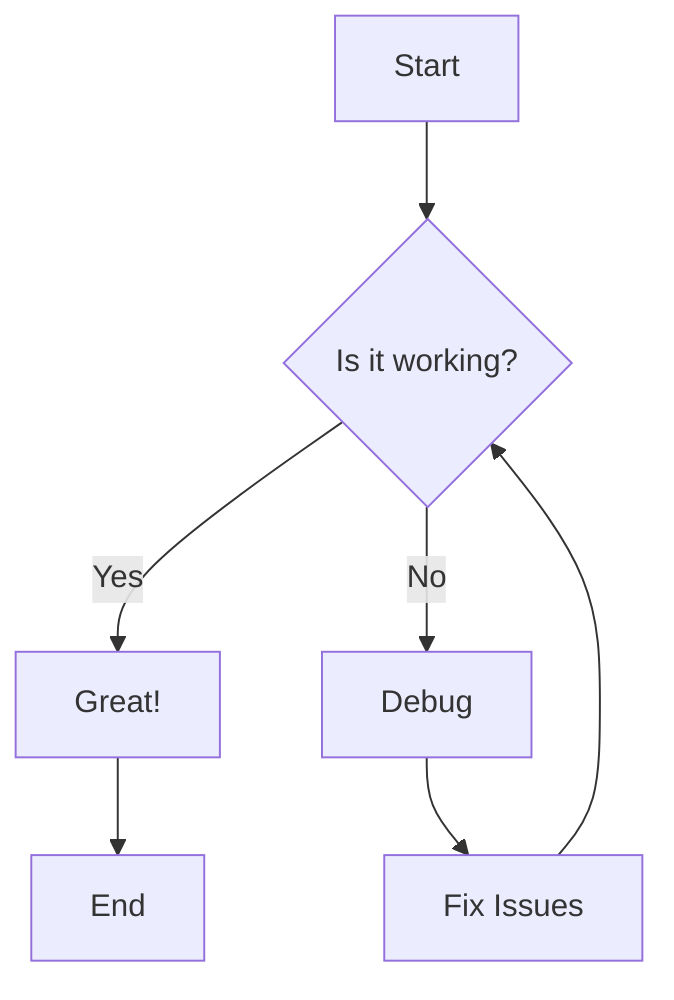
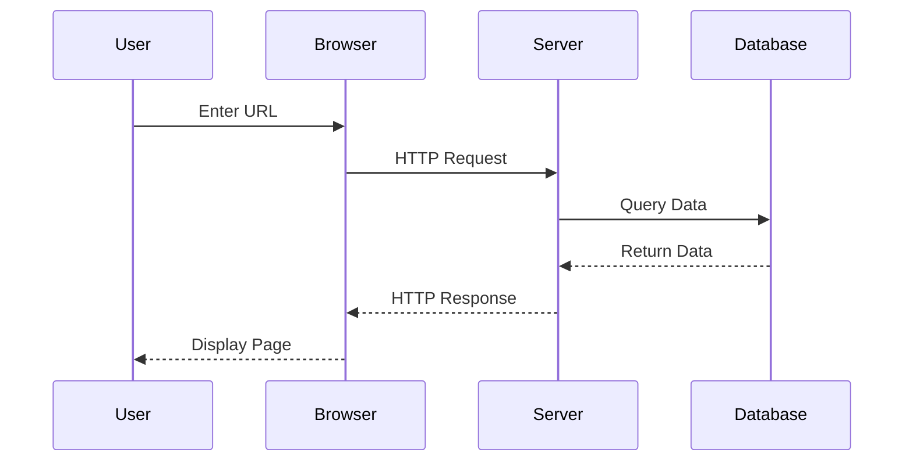
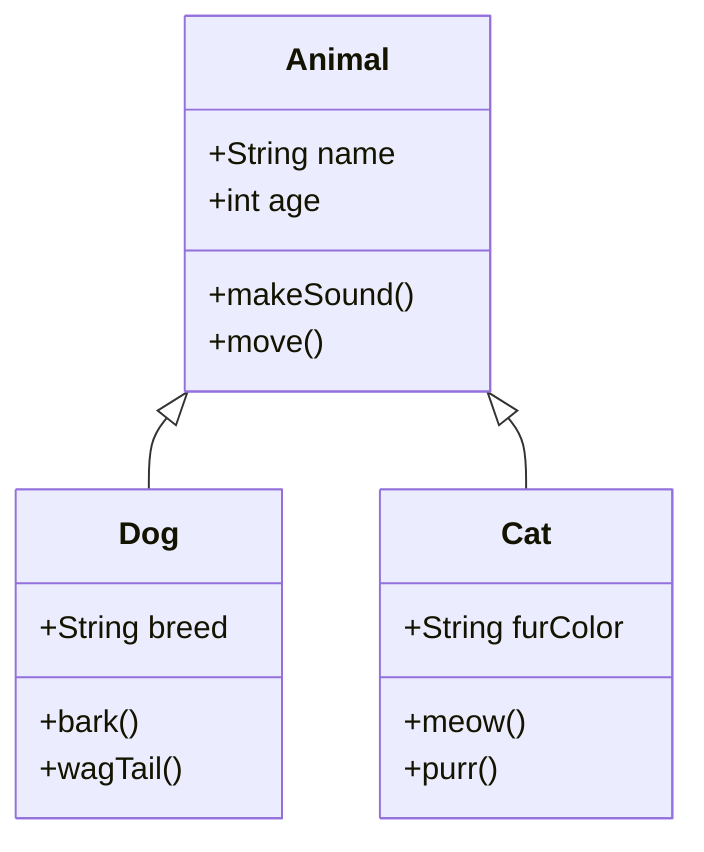

# Test Feature Link Navigation

This document is a focused test page for verifying various link navigation features in the viewer.
It contains relative file links, intra-file anchor links, external links, and examples for Mermaid/Math sections so you can confirm the editor's link navigation works correctly.

## Quick Links (Navigation Tests)

- [Back to Test Links](../test-links.md)
- [Basic Formatting](../01-basic-formatting.md)
- [Topics Overview](../topics/topics.md)
- [Mermaid Diagrams (file)](../06-mermaid-diagrams.md)
- [Flowchart (anchor within this file)](#flowchart)
- [Sequence Diagram (anchor within this file)](#sequence-diagram)
- [Class Diagram (anchor within this file)](#class-diagram)

---

## Headers

# H1 - Main Title
## H2 - Section Title  
### H3 - Subsection Title
#### H4 - Sub-subsection Title
##### H5 - Minor Heading
###### H6 - Smallest Heading

## Text Formatting

**Bold text** or __bold text__

*Italic text* or _italic text_

***Bold and italic*** or ___bold and italic___

~~Strikethrough text~~

`Inline code`

## Lists

### Unordered Lists
- Item 1
- Item 2
  - Nested item 2.1
  - Nested item 2.2
    - Double nested item
- Item 3

### Ordered Lists
1. First item
2. Second item
   1. Nested numbered item
   2. Another nested item
3. Third item

### Task Lists
- [x] Completed task
- [x] Incomplete task
- [x] Another completed task

## Links and Images

### Links
[External link](https://github.com)
[Link with title](https://github.com "GitHub Homepage")

### Relative Links (Test Navigation)
- [Back to Test Links](../test-links.md) — should open the Test Links page
- [Basic Formatting (file)](../01-basic-formatting.md) — should open the Basic Formatting doc
- [Topics Overview](../topics/topics.md) — should open the Topics overview

### Intra-file Anchor Links
- [Jump to Flowchart](#flowchart)
- [Jump to Sequence Diagram](#sequence-diagram)
- [Jump to Class Diagram](#class-diagram)

### Images


## Code Blocks

### Inline Code
Use `console.log()` to print output.

### Fenced Code Blocks

```javascript
function greetUser(name) {
    return `Hello, ${name}!`;
}

const message = greetUser("World");
console.log(message);
```

```python
def fibonacci(n):
    if n <= 1:
        return n
    return fibonacci(n-1) + fibonacci(n-2)

# Generate first 10 fibonacci numbers
for i in range(10):
    print(f"F({i}) = {fibonacci(i)}")
```

## Tables

| Feature | Markdown | HTML | LaTeX |
|---------|----------|------|-------|
| Headers | ✅ | ✅ | ✅ |
| Tables | ✅ | ✅ | ✅ |
| Math | ❌ | ❌ | ✅ |
| Diagrams | ❌ | ❌ | ❌ |

## Blockquotes

> This is a simple blockquote.

## Horizontal Rules

---

## Mermaid Diagrams

### Flowchart



### Sequence Diagram



### Class Diagram



## Math Expressions (if supported)

Inline math: $E = mc^2$

Block math:
$$
\frac{d}{dx}\int_{a}^{x} f(t) dt = f(x)
$$

## Summary

This page is specifically tuned for verifying link navigation behavior in the viewer. Use the Quick Links section and anchor links to validate that both file-level navigation and intra-file scrolling work as expected.