## Additional Topics - Quick Answers
---

## Development Concepts

### Question 2 (Code Quality Practices)

#### Question
How do you ensure code quality in your team? What practices do you follow?

#### Comprehensive Answer

Maintaining high code quality is a multi-faceted challenge that requires a blend of technical practices, team culture, and automation. Below is a detailed guide, including diagrams, code samples, and best practices, for ensuring code quality in a modern software engineering team.

#### 1. Establishing a Code Quality Culture

- **Lead by Example:** Senior engineers and tech leads should model best practices.
- **Continuous Learning:** Encourage knowledge sharing, brown-bag sessions, and post-mortems.
- **Psychological Safety:** Team members should feel safe to point out issues and suggest improvements.

#### 2. Code Reviews

##### Process
1. All code changes must go through peer review (pull requests).
2. Use checklists to ensure consistency.
3. Encourage constructive feedback and knowledge sharing.

##### Example Code Review Checklist
```markdown
- [ ] Code is readable and self-explanatory
- [ ] Follows team style guide
- [ ] Has sufficient test coverage
- [ ] No obvious performance issues
- [ ] No security vulnerabilities
- [ ] Documentation is updated
```

##### Review Workflow Diagram


#### 3. Linting and Static Analysis

- **Automated Linters:** ESLint, Pylint, Checkstyle, etc.
- **Static Analysis Tools:** SonarQube, CodeQL, Coverity.
- **Pre-commit Hooks:** Use tools like Husky to enforce linting before code is pushed.

##### Example: ESLint Configuration (JavaScript)
```json
{
    "extends": ["eslint:recommended", "plugin:react/recommended"],
    "rules": {
        "no-unused-vars": "warn",
        "eqeqeq": "error"
    }
}
```

#### 4. Automated Testing

- **Unit Tests:** Test individual functions/classes.
- **Integration Tests:** Test interactions between modules/services.
- **End-to-End (E2E) Tests:** Simulate real user scenarios.
- **Test Coverage:** Use tools like Istanbul, JaCoCo, or Coverage.py.

##### Example: Python Unit Test
```python
import unittest
from mymodule import add

class TestAdd(unittest.TestCase):
        def test_add(self):
                self.assertEqual(add(2, 3), 5)

if __name__ == '__main__':
        unittest.main()
```

#### 5. Continuous Integration (CI)

- **Automate builds and tests:** Use GitHub Actions, Jenkins, GitLab CI, etc.
- **Fail fast:** Block merges if tests or linters fail.

##### Example: GitHub Actions Workflow
```yaml
name: CI
on: [push, pull_request]
jobs:
    build:
        runs-on: ubuntu-latest
        steps:
            - uses: actions/checkout@v2
            - name: Set up Python
                uses: actions/setup-python@v2
                with:
                    python-version: '3.9'
            - name: Install dependencies
                run: pip install -r requirements.txt
            - name: Run tests
                run: pytest
```

#### 6. Coding Standards and Style Guides

- **Adopt a style guide:** PEP8 (Python), Google Java Style, Airbnb JS, etc.
- **Automate enforcement:** Use formatters like Black, Prettier, gofmt.

#### 7. Documentation

- **Code Comments:** Explain "why" not "what".
- **README files:** For each repo/module.
- **API Docs:** Use tools like Swagger/OpenAPI, Javadoc, Sphinx.

#### 8. Pair Programming and Knowledge Sharing

- **Pair/Mob Programming:** For complex or critical code.
- **Internal Tech Talks:** Share lessons learned and best practices.

#### 9. Monitoring and Feedback Loops

- **Track code quality metrics:** Code coverage, cyclomatic complexity, code churn.
- **Retrospectives:** Regularly review what’s working and what isn’t.

#### 10. Security and Compliance

- **Security Scans:** Use tools like Snyk, Dependabot, OWASP ZAP.
- **Dependency Management:** Keep libraries up to date.

#### 11. Example: End-to-End Quality Pipeline


#### 12. Continuous Improvement

- **Blameless Postmortems:** Learn from mistakes.
- **Experimentation:** Try new tools and processes.

---

## Code Review

### Question 3 (Code Documentation Approach)

#### Question
What's your approach to code documentation? How much is too much?

#### Comprehensive Answer

Effective code documentation strikes a balance between clarity and maintainability. Here’s a deep dive into best practices, philosophies, and practical examples for documenting code in a sustainable way.

#### 1. Philosophy: Self-Documenting Code

- **Expressive Naming:** Use descriptive variable, function, and class names.
- **Small Functions:** Each function should do one thing.
- **Clear Structure:** Logical organization of files and modules.

##### Example: Bad vs Good Naming
```python
# Bad
def f(x):
        return x * 2

# Good
def double_salary(employee_salary):
        return employee_salary * 2
```

#### 2. Comments: Why, Not What

- **Avoid obvious comments:**
```java
// Increment i by 1
i++;
```
- **Prefer explaining intent:**
```java
// Compensate for zero-based index in user-facing display
displayIndex = i + 1;
```

#### 3. High-Level Documentation

- **README.md:** Project overview, setup, usage, architecture.
- **CONTRIBUTING.md:** How to contribute, code style, PR process.
- **Architecture Decision Records (ADR):** Document major technical decisions.

#### 4. API Documentation

- **Auto-generated docs:** Swagger/OpenAPI (REST), GraphQL schema docs, Javadoc, Sphinx.
- **Example: OpenAPI YAML**
```yaml
openapi: 3.0.0
info:
    title: User API
    version: 1.0.0
paths:
    /users:
        get:
            summary: List users
            responses:
                '200':
                    description: OK
```

#### 5. Inline Documentation Tools

- **JSDoc (JavaScript), docstrings (Python), Javadoc (Java).**

##### Example: Python Docstring
```python
def add(a, b):
        """Add two numbers and return the result."""
        return a + b
```

#### 6. Diagrams and Visuals

- **UML, Mermaid, PlantUML:** For complex flows and architectures.
- **Example: Sequence Diagram**


#### 7. When is Documentation Too Much?

- **Red Flags:**
        - Comments that repeat code
        - Outdated docs (not maintained)
        - Excessive inline comments for trivial code
- **Balance:**
        - Focus on "why" and "how", not "what"
        - Keep docs close to code (docstrings, README)
        - Automate doc generation where possible

#### 8. Documentation Review Process

- **Review docs in PRs:** Treat documentation as part of the code review process.
- **Checklists:**
        - [ ] Public APIs documented
        - [ ] Major architectural changes explained
        - [ ] README updated if needed

#### 9. Documentation Automation

- **Tools:**
        - Docusaurus, Sphinx, MkDocs for static sites
        - GitHub Pages for hosting
        - CI to check for missing docs

#### 10. Example: Documentation Pipeline


---

## Problem Solving

### Question 2 (Technical Compromise Decision-Making)

#### Question
Describe a situation where you had to make a technical compromise due to time constraints. Would you do it differently now?

#### Comprehensive Answer

Technical compromises are a reality in software engineering. The key is to make them consciously, document the rationale, and plan for future remediation. Here’s a detailed approach, including a real-world scenario, best practices, and how to handle such situations.

#### 1. Recognizing the Need for Compromise

- **Common Triggers:**
        - Imminent deadlines
        - Resource constraints
        - Unforeseen technical debt
        - Shifting business priorities

#### 2. Real-World Example Scenario

**Situation:**
You’re building a new feature, but the deadline is tight. The ideal solution is to refactor a legacy module, but that would take weeks. Instead, you add a workaround to meet the deadline.

**Decision Process:**
1. Assess impact of shortcut (performance, maintainability, risk)
2. Communicate with stakeholders (product, QA, management)
3. Document the compromise (in code, tickets, and release notes)
4. Plan for remediation (create a follow-up ticket)

##### Example: Jira Ticket for Technical Debt
```markdown
**Title:** Refactor legacy payment module
**Description:** Temporary workaround added in v2.3.0 to support new payment flow. Needs full refactor for maintainability and testability.
**Priority:** High
**Owner:** Tech Lead
```

#### 3. Documenting the Compromise

- **In Code:**
```python
# TODO: Remove this hack after Q1 release
def legacy_payment_workaround():
        ...
```
- **In PRs:** Clearly state what and why in the description.
- **In Release Notes:** Call out known shortcuts and risks.

#### 4. Communicating with Stakeholders

- **Be transparent:** Explain trade-offs and risks.
- **Get buy-in:** Ensure business understands consequences.

#### 5. Planning for Remediation

- **Create follow-up tasks:** Don’t let debt linger.
- **Prioritize in backlog:** Review regularly in sprint planning.

#### 6. Learning and Retrospective

- **Blameless postmortems:** Focus on process, not people.
- **Continuous improvement:** Update team practices to avoid similar compromises.

#### 7. Would You Do It Differently?

- **With more time/resources:** Refactor properly.
- **If business impact is high:** Push back on deadlines.
- **If risk is low:** Accept the compromise, but document and plan for fix.

#### 8. Best Practices for Technical Compromises

- **Make conscious, not accidental, compromises.**
- **Always document and communicate.**
- **Plan and track remediation.**
- **Review and learn from each case.**

##### Example: Compromise Decision Flowchart


#### 9. References

- [Martin Fowler: Technical Debt Quadrant](https://martinfowler.com/bliki/TechnicalDebtQuadrant.html)
- [Google Engineering Practices: Make it Work, Then Make it Right](https://google.github.io/eng-practices/review/debt/)

---

### Question 3 (Technical Debt vs New Features Prioritization)

📋 **[Back to Question](../sse-topics.md#problem-solving)**

#### Question
How do you prioritize technical debt versus new features?

#### Comprehensive Answer

Balancing technical debt against new feature development is one of the most critical challenges in software engineering leadership. This requires strategic thinking, stakeholder management, and a deep understanding of long-term code health versus short-term business needs.

---

#### 1. Understanding Technical Debt

Technical debt is the implied cost of additional rework caused by choosing an easy (limited) solution now instead of a better approach that would take longer.

##### Types of Technical Debt
```mermaid
quadrantChart
    title Technical Debt Quadrant (Martin Fowler)
    x-axis Reckless --> Prudent
    y-axis Deliberate --> Inadvertent
    quadrant-1 Prudent & Deliberate: "Ship now, deal with consequences"
    quadrant-2 Reckless & Deliberate: "We don't have time for design"
    quadrant-3 Reckless & Inadvertent: "What's layering?"
    quadrant-4 Prudent & Inadvertent: "Now we know how we should have done it"
```

**Key Types:**
- **Code Debt:** Poor code quality, duplicated code, lack of tests
- **Architecture Debt:** Outdated patterns, monolithic structures
- **Infrastructure Debt:** Old dependencies, manual processes
- **Documentation Debt:** Missing or outdated docs

---

#### 2. Framework for Prioritization

##### The Risk-Value Matrix


##### Evaluation Criteria

**Business Impact:**
- Does it slow down feature development?
- Does it affect system reliability?
- Does it impact customer experience?
- Does it increase operational costs?

**Risk Assessment:**
- Security vulnerabilities
- Performance bottlenecks
- Compliance issues
- Team velocity impact

---

#### 3. Practical Prioritization Strategy

##### The 70-20-10 Rule

```yaml
Sprint Capacity Allocation:
  New Features: 70%
  Technical Debt: 20%
  Innovation/Learning: 10%
```

This ensures continuous progress on both business value and code health.

##### Example: Sprint Planning Matrix

```markdown
| Item | Type | Business Value | Risk | Effort | Priority |
|------|------|----------------|------|--------|----------|
| User Profile API | Feature | High | Low | 5 days | P0 |
| Refactor Auth Module | Debt | Medium | High | 3 days | P0 |
| Search Optimization | Feature | High | Medium | 8 days | P1 |
| Update Dependencies | Debt | Low | High | 2 days | P1 |
| New Dashboard | Feature | Medium | Low | 5 days | P2 |
```

---

#### 4. Communicating with Stakeholders

##### The Business Case for Technical Debt

**Translate technical concerns into business terms:**

```python
# Example: Calculating Cost of Technical Debt

class TechnicalDebtCalculator:
    def __init__(self, team_size, avg_salary):
        self.team_size = team_size
        self.avg_salary = avg_salary
    
    def calculate_velocity_impact(self, velocity_loss_percentage, sprint_length_weeks=2):
        """
        Calculate the cost of reduced velocity due to technical debt.
        
        Args:
            velocity_loss_percentage: Percentage of time lost to working around debt (e.g., 20)
            sprint_length_weeks: Length of sprint in weeks
        
        Returns:
            Annual cost in dollars
        """
        weekly_cost = self.team_size * (self.avg_salary / 52)
        sprints_per_year = 52 / sprint_length_weeks
        cost_per_sprint = weekly_cost * sprint_length_weeks * (velocity_loss_percentage / 100)
        annual_cost = cost_per_sprint * sprints_per_year
        
        return {
            'annual_cost': annual_cost,
            'monthly_cost': annual_cost / 12,
            'cost_per_sprint': cost_per_sprint
        }
    
    def calculate_incident_cost(self, incidents_per_month, hours_per_incident, hourly_rate):
        """Calculate cost of production incidents caused by technical debt."""
        monthly_cost = incidents_per_month * hours_per_incident * hourly_rate * self.team_size
        annual_cost = monthly_cost * 12
        
        return {
            'annual_cost': annual_cost,
            'monthly_cost': monthly_cost
        }

# Example usage
calculator = TechnicalDebtCalculator(team_size=5, avg_salary=120000)

# Scenario 1: 20% velocity loss
velocity_impact = calculator.calculate_velocity_impact(velocity_loss_percentage=20)
print(f"Velocity Loss Cost: ${velocity_impact['annual_cost']:,.2f}/year")

# Scenario 2: 2 incidents per month, 4 hours each
incident_cost = calculator.calculate_incident_cost(
    incidents_per_month=2,
    hours_per_incident=4,
    hourly_rate=120000 / 2080  # Convert annual to hourly
)
print(f"Incident Cost: ${incident_cost['annual_cost']:,.2f}/year")
```

**Output Example:**
```
Velocity Loss Cost: $230,769.23/year
Incident Cost: $138,461.54/year
Total Technical Debt Cost: $369,230.77/year
```

##### Stakeholder Communication Template

```markdown
## Technical Debt Proposal: Refactor Payment Module

**Problem:**
- 15% of development time spent working around legacy code
- 3 production incidents in last 2 months
- Blocking implementation of new payment methods

**Business Impact:**
- Delaying 2 high-priority features (value: $500K ARR)
- Customer churn risk: 5 customers reporting payment issues
- Estimated cost: $370K/year in lost productivity

**Proposed Solution:**
- 3-week refactoring project
- Cost: $75K (3 engineers × 3 weeks)

**ROI:**
- Break-even: 2.4 months
- 12-month savings: $295K
- Enable new features worth $500K ARR

**Risk of Not Addressing:**
- Continued velocity loss
- Potential security vulnerabilities
- Increased customer churn
```

---

#### 5. Measuring and Tracking Technical Debt

##### Key Metrics


##### Example: SonarQube Integration

```yaml
# .github/workflows/code-quality.yml
name: Code Quality Check

on: [pull_request]

jobs:
  sonarqube:
    runs-on: ubuntu-latest
    steps:
      - uses: actions/checkout@v2
      - name: SonarQube Scan
        uses: sonarsource/sonarqube-scan-action@master
        env:
          SONAR_TOKEN: ${{ secrets.SONAR_TOKEN }}
      - name: Quality Gate Check
        run: |
          STATUS=$(curl -s -u $SONAR_TOKEN: \
            "$SONAR_HOST_URL/api/qualitygates/project_status?projectKey=$PROJECT_KEY" \
            | jq -r '.projectStatus.status')
          
          if [ "$STATUS" != "OK" ]; then
            echo "Quality gate failed: $STATUS"
            exit 1
          fi
```

##### Technical Debt Dashboard

```javascript
// Example: Tracking technical debt in Jira
const technicalDebtReport = {
  totalDebtStoryPoints: 120,
  debtByCategory: {
    'Security': 30,
    'Performance': 25,
    'Code Quality': 40,
    'Documentation': 15,
    'Infrastructure': 10
  },
  ageDistribution: {
    '0-3 months': 20,
    '3-6 months': 35,
    '6-12 months': 45,
    '12+ months': 20
  },
  velocityImpact: '15%',
  estimatedCost: '$350K/year'
};
```

---

#### 6. Strategies for Managing Technical Debt

##### Strategy 1: The Boy Scout Rule

*"Always leave the code cleaner than you found it"*

```java
// Example: Incremental improvement during feature work
public class UserService {
    
    public User createUser(UserRequest request) {
        // New feature: Add user creation
        User user = new User();
        user.setEmail(request.getEmail());
        user.setName(request.getName());
        
        // Boy Scout Rule: Refactor nearby legacy code while you're here
        // Old code was using deprecated method
        // passwordService.encryptPassword(request.getPassword());
        
        // Improved version
        String hashedPassword = passwordService.hashPasswordSecurely(
            request.getPassword(),
            SecurityLevel.HIGH
        );
        user.setPasswordHash(hashedPassword);
        
        return userRepository.save(user);
    }
}
```

##### Strategy 2: Scheduled Refactoring Sprints

```markdown
## Quarterly Refactoring Sprint Plan

**Q1 2026:**
- Week 1: Authentication module refactoring
- Week 2: Database query optimization
- Week 3: Test coverage improvement
- Week 4: Documentation update

**Success Criteria:**
- Reduce cyclomatic complexity by 30%
- Increase test coverage to 80%
- Eliminate all critical security issues
```

##### Strategy 3: Feature Flags for Gradual Migration

```python
from feature_flags import FeatureFlags

class PaymentService:
    def process_payment(self, payment_data):
        if FeatureFlags.is_enabled('new_payment_system', user_id=payment_data.user_id):
            # New refactored implementation
            return self._process_payment_v2(payment_data)
        else:
            # Legacy implementation (being phased out)
            return self._process_payment_legacy(payment_data)
    
    def _process_payment_v2(self, payment_data):
        """New, refactored payment processing"""
        # Clean, well-tested implementation
        validator = PaymentValidator()
        processor = PaymentProcessor()
        
        validator.validate(payment_data)
        return processor.process(payment_data)
    
    def _process_payment_legacy(self, payment_data):
        """Legacy implementation - to be removed"""
        # ... old code ...
        pass
```

##### Strategy 4: Technical Debt Fridays

```markdown
## Team Agreement: Technical Debt Fridays

**Every Friday afternoon (2-4 PM):**
- Developers choose technical debt items
- Focus on small improvements
- No interruptions (protect the time)
- Share learnings in standup

**Rules:**
- Items should be completable in 2 hours
- Create PR before end of day
- Document what was improved
```

---

#### 7. Decision Framework

##### When to Prioritize Features

✅ **Choose features when:**
- Market opportunity is time-sensitive
- Customer commitment deadline
- Competitive threat requires quick response
- Technical debt impact is minimal
- Team has capacity for both

##### When to Prioritize Technical Debt

✅ **Choose debt when:**
- Security vulnerabilities exist
- Velocity has dropped >20%
- Production incidents increasing
- Blocking critical features
- Customer experience degraded

##### The "Tech Debt Tax"


---

#### 8. Real-World Example

##### Case Study: E-commerce Platform

**Situation:**
- Legacy monolithic architecture
- New feature: Real-time inventory sync
- Technical debt: Order processing module is tightly coupled

**Decision Process:**

```markdown
## Option 1: Quick Feature Implementation
- Time: 2 weeks
- Add sync as a patch to legacy code
- Risk: Increases coupling, adds more debt
- Cost: $40K

## Option 2: Refactor Then Build
- Time: 6 weeks (4 weeks refactor + 2 weeks feature)
- Decouple order processing first
- Benefits: Cleaner architecture, easier future changes
- Cost: $120K

## Option 3: Parallel Track (Chosen)
- Time: 4 weeks
- Build feature with clean interface
- Use adapter pattern to isolate legacy code
- Plan refactoring for Q2
- Cost: $80K
- Benefits: Balance of speed and quality
```

**Implementation:**

```java
// Adapter pattern to isolate legacy code
public interface OrderProcessor {
    OrderResult processOrder(Order order);
}

// New implementation with inventory sync
public class ModernOrderProcessor implements OrderProcessor {
    private final InventorySyncService inventorySync;
    private final PaymentService paymentService;
    
    @Override
    public OrderResult processOrder(Order order) {
        // New clean implementation
        inventorySync.reserveStock(order.getItems());
        PaymentResult payment = paymentService.charge(order);
        return new OrderResult(order.getId(), payment);
    }
}

// Adapter for legacy code
public class LegacyOrderAdapter implements OrderProcessor {
    private final LegacyOrderService legacyService;
    
    @Override
    public OrderResult processOrder(Order order) {
        // Wrap legacy code, plan to remove in Q2
        LegacyOrder legacyOrder = convertToLegacy(order);
        LegacyResult result = legacyService.processOrderOldWay(legacyOrder);
        return convertToModern(result);
    }
}
```

---

#### 9. Best Practices Summary

1. **Make it visible:** Track debt in backlog with clear estimates
2. **Quantify the cost:** Use data to show business impact
3. **Reserve capacity:** Allocate 15-25% of sprint for debt
4. **Prevent accumulation:** Code review standards, automated checks
5. **Communicate regularly:** Include debt updates in sprint reviews
6. **Use metrics:** Track trends over time
7. **Celebrate debt paydown:** Recognize team efforts
8. **Be pragmatic:** Not all debt needs immediate attention

---

#### 10. Tools and Resources

**Debt Tracking Tools:**
- SonarQube (code quality)
- CodeClimate (maintainability)
- Snyk (security vulnerabilities)
- Dependabot (dependency updates)

**Recommended Reading:**
- "Working Effectively with Legacy Code" - Michael Feathers
- "Refactoring" - Martin Fowler
- [Technical Debt Quadrant](https://martinfowler.com/bliki/TechnicalDebtQuadrant.html)

---

## Soft Skills

### Question 1 (Difficult Technical Decision)

📋 **[Back to Question](../sse-topics.md#soft-skills)**

#### Question
Tell me about a difficult technical decision you made. How did you approach it and what was the outcome?

#### Comprehensive Answer

Making difficult technical decisions is a core responsibility of senior engineers. The key is structured thinking, stakeholder involvement, and learning from outcomes—whether successful or not.

---

#### 1. Framework for Technical Decision-Making


---

#### 2. Real-World Example Scenario

##### The Microservices Migration Decision

**Context:**
- Company: E-commerce platform (monolithic Rails app)
- Team: 20 engineers
- Challenge: Scaling issues, deployment bottlenecks
- Pressure: CEO wants faster feature delivery

**The Decision:**
*Should we migrate from monolith to microservices?*

---

#### 3. Step-by-Step Approach

##### Step 1: Gather Context and Data

```python
# Example: Data-driven analysis
class SystemAnalysis:
    def __init__(self):
        self.metrics = {}
    
    def analyze_current_state(self):
        """Gather quantitative data about current system"""
        return {
            'deployment_frequency': '2x per week',
            'deployment_time': '45 minutes',
            'test_suite_time': '30 minutes',
            'incident_rate': '3-4 per month',
            'team_velocity': {
                'Q1': 120,
                'Q2': 95,  # Decreasing trend
                'Q3': 85
            },
            'code_coupling': {
                'highly_coupled_modules': 15,
                'independent_modules': 3
            }
        }
    
    def calculate_pain_points(self):
        """Quantify current problems"""
        return {
            'blocked_deployments': '40% of PRs wait for others',
            'merge_conflicts': '15 per week',
            'developer_survey': {
                'frustrated_with_deploy': '75%',
                'want_more_autonomy': '80%'
            }
        }

# Analysis results
analysis = SystemAnalysis()
current_state = analysis.analyze_current_state()
pain_points = analysis.calculate_pain_points()
```

##### Step 2: Define Constraints

```markdown
## Constraints and Requirements

**Business Constraints:**
- Cannot stop feature development
- Must maintain 99.9% uptime
- Budget: $500K for migration
- Timeline: 12 months maximum

**Technical Constraints:**
- Current team skills: Ruby/Rails (strong), distributed systems (limited)
- Database: Single PostgreSQL instance (100GB)
- Traffic: 10K requests/min peak
- Integration: 5 external payment/shipping APIs

**Team Constraints:**
- 20 engineers (need 4 for migration)
- Hiring freeze in effect
- Cannot impact current velocity by >30%
```

##### Step 3: Generate Options

```markdown
## Option 1: Full Microservices Migration
**Approach:** Split into 10-15 services
**Timeline:** 12-18 months
**Cost:** $800K-1M
**Pros:**
- Maximum scalability
- Team autonomy
- Modern architecture
**Cons:**
- High complexity
- Longer timeline
- Operational overhead

## Option 2: Modular Monolith
**Approach:** Extract domains within monolith
**Timeline:** 3-6 months
**Cost:** $200K
**Pros:**
- Lower risk
- Faster delivery
- Simpler operations
**Cons:**
- Still shared database
- Deployment remains coupled
- Limited scalability

## Option 3: Strangler Fig Pattern (CHOSEN)
**Approach:** Gradually extract services
**Timeline:** 6-12 months (iterative)
**Cost:** $400K
**Pros:**
- Incremental migration
- Continuous delivery
- Learn as we go
- Reversible decisions
**Cons:**
- Dual systems temporarily
- Requires API gateway
- Team coordination needed
```

##### Step 4: Evaluate Trade-offs

```mermaid
graph TD
    A[Evaluation Criteria] --> B[Technical Fit]
    A --> C[Risk Level]
    A --> D[Cost]
    A --> E[Team Capability]
    A --> F[Business Impact]
    
    B --> B1[Scalability: ⭐⭐⭐⭐]
    B --> B2[Maintainability: ⭐⭐⭐⭐⭐]
    
    C --> C1[Implementation Risk: Medium]
    C --> C2[Operational Risk: Medium]
    
    D --> D1[Initial: $400K]
    D --> D2[Ongoing: +$50K/year]
    
    E --> E1[Learning Curve: Moderate]
    E --> E2[Staffing: Within capacity]
    
    F --> F1[Velocity Impact: -20% initially]
    F --> F2[Time to Value: 3 months]
```



##### Step 5: Create Decision Matrix

```markdown
| Criteria | Weight | Monolith | Modular Monolith | Strangler Fig | Full Microservices |
|----------|--------|----------|-------------------|---------------|---------------------|
| Time to Value | 25% | 0 | 8 | 7 | 3 |
| Risk | 20% | 9 | 8 | 7 | 4 |
| Scalability | 15% | 3 | 5 | 8 | 10 |
| Team Fit | 20% | 8 | 9 | 7 | 4 |
| Cost | 10% | 10 | 9 | 7 | 3 |
| Future Flexibility | 10% | 2 | 4 | 8 | 10 |
| **Total Score** | | **5.8** | **7.5** | **7.2** | **5.1** |
```

**Analysis:** Modular Monolith and Strangler Fig are close. Chose Strangler Fig for better long-term scalability.

---

#### 4. Stakeholder Consultation

##### Technical Team Discussion

```markdown
## Architecture Review Meeting

**Attendees:**
- Engineering Team (20 people)
- CTO
- Product Manager
- DevOps Lead

**Agenda:**
1. Present current problems (data-driven)
2. Show 3 options with trade-offs
3. Open discussion
4. Vote on preferred approach

**Key Feedback:**
- Backend team: Prefer microservices for autonomy
- Frontend team: Concerned about API changes
- DevOps: Worried about operational complexity
- Product: Needs continued feature delivery

**Consensus:**
- Start with Strangler Fig
- Extract 1 service as pilot
- Re-evaluate after 3 months
```

##### Architecture Decision Record (ADR)

```markdown
# ADR-0015: Adopt Strangler Fig Pattern for Microservices Migration

## Status
Accepted

## Context
Our monolithic Rails application has become difficult to scale and deploy. 
Team velocity has decreased 30% over 2 quarters due to code coupling and 
merge conflicts. We need to improve scalability while maintaining feature delivery.

## Decision
We will use the Strangler Fig pattern to gradually migrate to microservices.

**Phase 1 (Months 1-3):** Extract payment service
**Phase 2 (Months 4-6):** Extract inventory service  
**Phase 3 (Months 7-9):** Extract user service
**Phase 4 (Months 10-12):** Extract order service

## Consequences

**Positive:**
- Incremental migration reduces risk
- Continuous feature delivery maintained
- Team learns distributed systems gradually
- Can adjust course based on learnings

**Negative:**
- Temporary complexity of dual systems
- Need API gateway and service mesh
- Requires strong observability

## Alternatives Considered
- Full microservices migration (too risky, too long)
- Modular monolith (doesn't solve scalability)
- Stay with monolith (unsustainable)
```

---

#### 5. Implementation Plan


##### First Service: Payment Service

```go
// Example: New payment microservice in Go
package main

import (
    "github.com/gin-gonic/gin"
    "payment-service/handlers"
    "payment-service/middleware"
)

func main() {
    router := gin.Default()
    
    // Middleware
    router.Use(middleware.Auth())
    router.Use(middleware.Logging())
    router.Use(middleware.Metrics())
    
    // Routes
    v1 := router.Group("/api/v1")
    {
        v1.POST("/payments", handlers.CreatePayment)
        v1.GET("/payments/:id", handlers.GetPayment)
        v1.POST("/payments/:id/refund", handlers.RefundPayment)
    }
    
    // Health check
    router.GET("/health", handlers.HealthCheck)
    
    router.Run(":8080")
}
```

##### API Gateway Configuration

```yaml
# Kong API Gateway configuration
services:
  - name: payment-service
    url: http://payment-service:8080
    routes:
      - name: payment-routes
        paths:
          - /api/v1/payments
        methods:
          - POST
          - GET
        plugins:
          - name: rate-limiting
            config:
              minute: 100
          - name: jwt
          - name: prometheus
```

---

#### 6. Monitoring the Outcome

##### Success Metrics

```python
class MigrationMetrics:
    def track_phase_1(self):
        """Track metrics for payment service extraction"""
        return {
            'before': {
                'deployment_time': '45 min',
                'payment_latency_p95': '800ms',
                'incidents_per_month': 3.5,
                'team_velocity': 85
            },
            'after_3_months': {
                'deployment_time': '15 min (payment), 40 min (monolith)',
                'payment_latency_p95': '200ms',
                'incidents_per_month': 2.0,
                'team_velocity': 90,
                'payment_team_autonomy': 'High'
            },
            'roi': {
                'investment': '$120K',
                'payback_period': '8 months',
                'annual_savings': '$180K'
            }
        }
```

---

#### 7. The Outcome

**After 3 Months (Phase 1):**
✅ Payment service extracted successfully  
✅ Deployment time reduced by 67% for payments  
✅ Latency improved by 75%  
✅ Team morale increased  
⚠️ Operational complexity increased (manageable)  
⚠️ Initial velocity dip recovered

**Decision to Continue:**
Based on success, proceeded with Phase 2 (Inventory Service)

---

#### 8. Lessons Learned

```markdown
## Retrospective: What Went Well

1. **Incremental approach was right**
   - Reduced risk significantly
   - Learned from each phase
   
2. **Strong monitoring paid off**
   - Caught issues early
   - Data-driven decisions

3. **Team involvement crucial**
   - Buy-in from beginning
   - Shared ownership

## What Could Be Improved

1. **Underestimated operational complexity**
   - Should have hired SRE earlier
   - Needed better observability from day 1

2. **Communication gaps**
   - Frontend team surprised by API changes
   - Should have better changelog process

3. **Database migration harder than expected**
   - Data consistency challenges
   - Needed more testing

## Would I Do It Differently?

**Yes:**
- Start with better observability infrastructure
- Invest in developer tooling earlier
- More comprehensive testing strategy

**No:**
- Strangler Fig was correct choice
- Incremental approach was essential
- Team involvement process was good
```

---

#### 9. Communication Template for Difficult Decisions

```markdown
## Technical Decision Communication Framework

### For Team:
**What:** [Clear, concise statement]
**Why:** [Problem statement with data]
**How:** [Approach and timeline]
**Impact:** [What changes for them]
**Support:** [Resources available]

### For Leadership:
**Business Impact:** [Revenue, cost, risk]
**Investment Required:** [Time, money, people]
**Timeline:** [Milestones]
**ROI:** [Expected returns]
**Risks:** [What could go wrong]

### For Customers:
**Benefits:** [Improved experience]
**Timeline:** [When to expect]
**Minimal Disruption:** [How we'll ensure continuity]
```

---

#### 10. Key Takeaways

1. **Use data to inform decisions** - Not gut feeling
2. **Consider multiple options** - Avoid anchoring bias
3. **Document your reasoning** - ADRs are invaluable
4. **Involve stakeholders early** - Get buy-in
5. **Make reversible decisions when possible** - Reduce risk
6. **Monitor outcomes** - Measure what matters
7. **Learn and adapt** - No decision is final
8. **Communicate clearly** - Different messages for different audiences

---

### Question 2 (Technical Disagreement Handling)

📋 **[Back to Question](../sse-topics.md#soft-skills)**

#### Question
Tell me about a time you disagreed with a technical decision. How did you handle it?

#### Comprehensive Answer

Handling technical disagreements professionally is a critical skill for senior engineers. The goal is healthy debate that leads to better decisions, not winning arguments.

---

#### 1. Framework for Handling Disagreements


---

#### 2. Real-World Example Scenario

##### The GraphQL vs REST API Debate

**Context:**
- Team: Backend engineering (8 people)
- Project: New API for mobile app
- Timeline: 3 months
- My Position: REST API
- Team Lead's Position: GraphQL

**Initial Reaction:**
❌ **Don't:** "GraphQL is trendy nonsense, REST works fine!"  
✅ **Do:** "I have concerns about GraphQL. Can we discuss?"

---

#### 3. Step 1: Understanding the Other Perspective

```markdown
## Active Listening Checklist

Before arguing your position, ensure you understand theirs:

- [ ] What problem are they trying to solve?
- [ ] What are their key concerns?
- [ ] What data/experience informs their view?
- [ ] What constraints are they considering?
- [ ] What's their risk tolerance?

**In this case:**
- Team Lead concerned about over-fetching
- Mobile app has bandwidth constraints
- Frontend team requested flexible queries
- Previous REST API had 20+ endpoints
```

---

#### 4. Step 2: Preparing Your Case

##### Gather Objective Data

```python
# Example: Comparative analysis
class APIComparison:
    def __init__(self):
        self.criteria = {}
    
    def analyze_graphql_vs_rest(self):
        """Data-driven comparison"""
        return {
            'development_time': {
                'graphql': {
                    'initial_setup': '2-3 weeks',
                    'learning_curve': 'Steep (team unfamiliar)',
                    'estimated_timeline': '4 months'
                },
                'rest': {
                    'initial_setup': '3-5 days',
                    'learning_curve': 'Minimal (team expert)',
                    'estimated_timeline': '2.5 months'
                }
            },
            'performance': {
                'graphql': {
                    'over_fetching': 'Eliminated',
                    'n_plus_1_risk': 'High (needs DataLoader)',
                    'caching': 'Complex'
                },
                'rest': {
                    'over_fetching': 'Moderate issue',
                    'n_plus_1_risk': 'Low (controlled endpoints)',
                    'caching': 'Standard HTTP caching'
                }
            },
            'team_readiness': {
                'graphql': '2/8 team members familiar',
                'rest': '8/8 team members expert'
            },
            'operational_complexity': {
                'graphql': {
                    'monitoring': 'Requires custom tooling',
                    'rate_limiting': 'Complex (query cost)',
                    'debugging': 'Harder (dynamic queries)'
                },
                'rest': {
                    'monitoring': 'Standard APM tools',
                    'rate_limiting': 'Simple (endpoint-based)',
                    'debugging': 'Straightforward'
                }
            },
            'mobile_app_benefit': {
                'graphql': 'High (flexible queries)',
                'rest': 'Medium (with good endpoint design)'
            }
        }

comparison = APIComparison()
analysis = comparison.analyze_graphql_vs_rest()
```

##### Document Your Concerns

```markdown
## Concerns About GraphQL for This Project

### 1. Timeline Risk (HIGH)
- **Impact:** Could delay mobile launch by 6 weeks
- **Data:** Team learning curve + setup time
- **Mitigation:** None realistic within timeline

### 2. Team Expertise (HIGH)
- **Impact:** 6/8 developers never used GraphQL
- **Data:** Team skill matrix
- **Mitigation:** Training, but still risky for production

### 3. Operational Complexity (MEDIUM)
- **Impact:** More complex monitoring and debugging
- **Data:** Need custom observability for GraphQL
- **Mitigation:** Could adopt tools like Apollo Studio

### 4. Over-engineering? (MEDIUM)
- **Impact:** Simple CRUD app might not need GraphQL
- **Data:** Requirements analysis shows straightforward data model
- **Mitigation:** Design efficient REST endpoints
```

---

#### 5. Step 3: The Discussion

##### Schedule Dedicated Time

```markdown
## Meeting Request Template

**To:** Team Lead
**Subject:** Discussion: API Technology Choice

Hi [Name],

I'd like to discuss the GraphQL vs REST decision for the mobile API project. 
I have some concerns about timeline and team readiness that I think are worth exploring.

I've prepared some data and alternatives that might help us make the best decision.

Could we schedule 30 minutes this week?

Thanks,
[Your name]
```

##### The Conversation Framework

```markdown
## Disagreement Discussion Structure

### 1. Start with Agreement (2 min)
"I agree that over-fetching is a problem and mobile performance is critical."

### 2. State Your Concerns (5 min)
"My concerns are about timeline risk and team readiness. Let me show you the data..."

### 3. Present Data (10 min)
[Show comparison analysis, risk assessment]

### 4. Propose Alternatives (5 min)
"What if we designed efficient REST endpoints now, but planned GraphQL for V2?"

### 5. Listen to Response (5 min)
[Genuinely consider their counter-arguments]

### 6. Find Common Ground (3 min)
"Seems like we both want mobile performance and on-time delivery. Let's explore options..."
```

---

#### 6. Alternative Proposals

```markdown
## Option 1: REST with Efficient Design
**Approach:** Design REST API with mobile-first endpoints
**Timeline:** 2.5 months
**Pros:** 
- Faster delivery
- Lower risk
- Team expertise
**Cons:**
- Still some over-fetching
- Less flexible for frontend

## Option 2: GraphQL (Original Plan)
**Approach:** Full GraphQL implementation
**Timeline:** 4 months
**Pros:**
- Eliminates over-fetching
- Future-proof
- Flexible queries
**Cons:**
- Delayed launch
- Team learning curve
- Operational complexity

## Option 3: Hybrid Approach (PROPOSED)
**Approach:** 
- REST for V1 (fast delivery)
- GraphQL layer in Q2 (after mobile launch)
- Gradual migration
**Timeline:** 2.5 months (V1), then iterative
**Pros:**
- On-time launch
- Gets mobile app benefits
- Team learns GraphQL gradually
- Reversible decision
**Cons:**
- Some duplication temporarily
- Extra work in Q2

## Option 4: BFF Pattern with GraphQL
**Approach:**
- Simple REST from backend services
- GraphQL BFF (Backend-for-Frontend) layer
- Only BFF team learns GraphQL
**Timeline:** 3 months
**Pros:**
- Mobile gets GraphQL benefits
- Backend stays REST (team expertise)
- Smaller learning curve
**Cons:**
- Extra layer
- Still some delay
```

---

#### 7. The Outcome

##### What Actually Happened

```markdown
## Resolution: Hybrid Approach Adopted

**Decision:**
- Phase 1 (Current sprint): REST API for mobile V1
- Phase 2 (Q2): GraphQL layer added as BFF
- Team member volunteers to become GraphQL expert

**Why This Works:**
- Meets business deadline (mobile launch)
- Addresses performance concerns (gradual improvement)
- Reduces risk (incremental approach)
- Team learns without pressure

**My Response:**
"This is a great compromise. I fully support this plan and will help ensure V1 REST API is well-designed for eventual GraphQL layer."
```

##### Implementation

```javascript
// Phase 1: REST API (Shipped on time)
// Express.js REST endpoints
app.get('/api/users/:id', async (req, res) => {
  const user = await User.findById(req.params.id);
  res.json(user);
});

app.get('/api/users/:id/posts', async (req, res) => {
  const posts = await Post.findByUserId(req.params.id);
  res.json(posts);
});

// Phase 2: GraphQL BFF Layer (Added in Q2)
// Apollo Server wrapping REST services
const typeDefs = gql`
  type User {
    id: ID!
    name: String!
    posts: [Post!]!
  }
  
  type Post {
    id: ID!
    title: String!
    content: String!
  }
  
  type Query {
    user(id: ID!): User
  }
`;

const resolvers = {
  Query: {
    user: async (_, { id }) => {
      // Calls REST backend
      return fetch(`http://api/users/${id}`).then(r => r.json());
    }
  },
  User: {
    posts: async (user) => {
      // Calls REST backend
      return fetch(`http://api/users/${user.id}/posts`).then(r => r.json());
    }
  }
};
```

---

#### 8. Lessons Learned

```markdown
## Retrospective: Handling the Disagreement

### What Worked Well ✅

1. **Data-driven approach**
   - Comparison analysis was convincing
   - Hard to argue with numbers

2. **Respectful communication**
   - No personal attacks
   - Focused on project success

3. **Multiple alternatives**
   - Showed willingness to compromise
   - Hybrid approach was win-win

4. **Full commitment after decision**
   - Didn't sabotage GraphQL plan
   - Actively helped with implementation

### What Could Improve ⚠️

1. **Earlier discussion**
   - Should have raised concerns in architecture review
   - Waiting too long increased tension

2. **More frontend input**
   - Should have involved mobile team earlier
   - Their perspective was valuable

3. **Better data initially**
   - Initial GraphQL estimate was optimistic
   - Should have validated with prototyping
```

---

#### 9. When Escalation is Necessary


##### Escalation Template

```markdown
## Escalation Email Template

**To:** Engineering Manager
**CC:** Team Lead
**Subject:** Input Needed: API Technology Decision

Hi [Manager],

[Team Lead] and I have different perspectives on the API technology choice 
for the mobile project. We've had a productive discussion but haven't reached 
consensus, and the decision is time-sensitive.

**Context:**
- Mobile API launch in 3 months
- Choosing between GraphQL and REST
- Trade-offs involve timeline, risk, and team readiness

**Both Perspectives:**
[Team Lead's view]: GraphQL provides better mobile performance and flexibility
[My view]: REST reduces timeline risk with current team expertise

**Areas of Agreement:**
- Mobile performance is critical
- On-time delivery is important
- Team should learn GraphQL eventually

**Decision Needed:**
Which approach should we take, or is there a compromise?

I've prepared detailed analysis I can share in a meeting.

Thanks,
[Your name]
```

---

#### 10. Best Practices for Disagreements

##### DO's ✅

1. **Assume good intent** - Everyone wants the best outcome
2. **Use data** - Facts over opinions
3. **Listen actively** - Understand before responding
4. **Propose alternatives** - Show willingness to compromise
5. **Stay professional** - No personal attacks
6. **Commit to decision** - Once made, support it fully
7. **Document learnings** - For future reference
8. **Give credit** - If their approach works, acknowledge it

##### DON'Ts ❌

1. **Don't make it personal** - "You always..." language
2. **Don't be passive-aggressive** - Say "I disagree", not "Whatever..."
3. **Don't go around them** - Talk to them first, not their manager
4. **Don't say "I told you so"** - Even if you were right
5. **Don't hold grudges** - Move on after resolution
6. **Don't gossip** - Keep disagreements professional
7. **Don't escalate too quickly** - Try direct discussion first
8. **Don't refuse to implement** - That's insubordination

---

#### 11. Cultural Considerations

```markdown
## Building a Healthy Disagreement Culture

### Team Agreements
- "Strong opinions, weakly held"
- "Disagree and commit"
- "Challenge ideas, not people"
- "Data over hierarchy"

### Safe Environment
- Psychological safety for junior engineers
- "There are no stupid questions"
- Blameless retrospectives
- Regular architecture reviews for debate
```

---

#### 12. Key Takeaways

1. **Pick your battles** - Not every disagreement matters
2. **Prepare thoroughly** - Data wins arguments
3. **Stay professional** - Focus on the problem, not the person
4. **Seek compromise** - Win-win is better than win-lose
5. **Commit fully** - Once decided, make it succeed
6. **Learn and reflect** - Every disagreement is a learning opportunity
7. **Build relationships** - Today's opponent is tomorrow's teammate

---

### Question 3 (Staying Current with Technology)

📋 **[Back to Question](../sse-topics.md#soft-skills)**

#### Question
Tell me how you stay current with technology. What have you learned recently?

#### Comprehensive Answer

Staying current with technology is essential for senior engineers. The tech landscape evolves rapidly, and maintaining relevance requires intentional learning strategies and genuine curiosity.

---

#### 1. Multi-Channel Learning Strategy


---

#### 2. Reading and Research

##### Technical Blogs and Newsletters

**High-Quality Sources:**
```markdown
## Daily/Weekly Reading List

**Engineering Blogs:**
- [Martin Fowler's Blog](https://martinfowler.com)
- [Netflix TechBlog](https://netflixtechblog.com)
- [Uber Engineering](https://eng.uber.com)
- [Spotify Engineering](https://engineering.atspotify.com)
- [AWS Architecture Blog](https://aws.amazon.com/blogs/architecture/)

**Newsletters:**
- [TLDR Newsletter](https://tldr.tech) - Daily tech news
- [Pointer.io](https://pointer.io) - Weekly curated links
- [ByteByteGo](https://blog.bytebytego.com) - System design
- [Changelog](https://changelog.com/news) - Open source news

**Aggregators:**
- Hacker News (news.ycombinator.com)
- Reddit: r/programming, r/webdev, r/devops
- Dev.to community
```

##### Books and Long-Form Content

**Recent Reading List:**
```markdown
## 2025-2026 Reading

**Completed:**
- "Designing Data-Intensive Applications" - Martin Kleppmann ⭐⭐⭐⭐⭐
- "Staff Engineer: Leadership Beyond the Management Track" - Will Larson
- "Accelerate: Building and Scaling High Performing Technology Organizations"

**In Progress:**
- "System Design Interview Vol 2" - Alex Xu
- "Database Internals" - Alex Petrov

**On Deck:**
- "Software Engineering at Google"
- "Release It! 2nd Edition" - Michael Nygard
```

##### Research Papers

```python
# Example: Tracking papers to read
class ResearchPaperTracker:
    def __init__(self):
        self.papers = []
    
    def add_influential_papers(self):
        """Papers every senior engineer should read"""
        return [
            {
                'title': 'MapReduce: Simplified Data Processing on Large Clusters',
                'authors': 'Dean & Ghemawat (Google)',
                'year': 2004,
                'why_important': 'Foundation of big data processing',
                'status': 'Read',
                'key_learnings': 'Parallelization patterns, fault tolerance'
            },
            {
                'title': 'Dynamo: Amazon\'s Highly Available Key-value Store',
                'authors': 'DeCandia et al. (Amazon)',
                'year': 2007,
                'why_important': 'Eventual consistency, distributed systems',
                'status': 'Read',
                'key_learnings': 'CAP theorem practical applications'
            },
            {
                'title': 'Attention Is All You Need',
                'authors': 'Vaswani et al. (Google)',
                'year': 2017,
                'why_important': 'Transformers architecture (GPT foundation)',
                'status': 'In Progress',
                'key_learnings': 'Understanding modern AI/ML'
            }
        ]
```

---

#### 3. Hands-On Learning

##### Side Projects

**Current Projects (2025-2026):**
```yaml
Project 1:
  name: "Personal Finance Tracker"
  technologies: [Next.js 14, Prisma, PostgreSQL, tRPC]
  learning_goals:
    - Server Components in Next.js
    - Type-safe APIs with tRPC
    - Database schema design
  status: Active
  github: private

Project 2:
  name: "Distributed Rate Limiter"
  technologies: [Go, Redis, Docker, Kubernetes]
  learning_goals:
    - Token bucket algorithm
    - Redis Lua scripts
    - Helm charts
  status: Completed
  github: public
  blog_post: "Building a Production-Ready Rate Limiter"

Project 3:
  name: "AI Code Review Assistant"
  technologies: [Python, OpenAI API, GitHub Actions, FastAPI]
  learning_goals:
    - LLM prompt engineering
    - GitHub webhooks
    - Async Python patterns
  status: Planning
```

**Example: Learning New Framework**
```javascript
// Side project: Exploring Next.js 14 Server Components
// File: app/dashboard/page.tsx

import { Suspense } from 'react';
import { getUserStats } from '@/lib/db';

// Server Component - runs on server
export default async function DashboardPage() {
  // Direct database access - no API route needed!
  const stats = await getUserStats();
  
  return (
    <div>
      <h1>Dashboard</h1>
      <Suspense fallback={<Loading />}>
        <StatsCards data={stats} />
      </Suspense>
    </div>
  );
}

// Learning: Server Components change mental model
// - No useEffect for data fetching
// - Colocation of data fetching with UI
// - Automatic loading states with Suspense
```

##### Open Source Contributions

```markdown
## Open Source Journey

**Contributions (2025):**

1. **TypeScript (Minor bug fix)**
   - PR #58234: Fixed type inference in generic constraints
   - Learning: Deep dive into TS compiler internals
   - Impact: Used by millions of developers

2. **React (Documentation)**
   - PR #26789: Updated Server Components guide
   - Learning: Technical writing, community feedback
   - Impact: Helped 1000+ developers understand new patterns

3. **Kubernetes (Feature)**
   - Issue #112345: Pod security context validation
   - Learning: Go testing patterns, Kubernetes architecture
   - Status: In review

**Benefits:**
- Learn from code reviews by maintainers
- Understand large codebases
- Build reputation in community
- Give back to tools I use daily
```

---

#### 4. Community Engagement

##### Conferences and Meetups

```markdown
## 2025-2026 Conference Attendance

**Attended:**
- ✅ AWS re:Invent 2025 (Las Vegas)
  - Learned: Serverless patterns, Step Functions workflows
  - Networking: Met engineers from Stripe, Airbnb
  
- ✅ ReactConf 2025 (Virtual)
  - Learned: React 19 features, Server Components best practices
  - Takeaway: Implemented Server Actions at work

**Upcoming:**
- 📅 KubeCon 2026 (March)
- 📅 Local TypeScript Meetup (Monthly)

**Local Engagement:**
- Organizer: San Francisco Backend Engineering Meetup
- Speaker: Gave talk on "Distributed Tracing Patterns"
```

##### Social Media and Online Communities

```python
# Example: Curated Twitter/X feed for learning
class TechTwitterCuration:
    def __init__(self):
        self.follows = []
    
    def recommended_follows(self):
        """Accounts providing high-value tech content"""
        return {
            'system_design': [
                '@alexxubyte',  # ByteByteGo - System design
                '@b0rk',        # Julia Evans - Visual explanations
                '@kelseyhightower'  # Kelsey - Kubernetes, Cloud
            ],
            'frontend': [
                '@dan_abramov',  # React co-creator
                '@ryanflorence',  # Remix, React Router
                '@leeerob'       # Next.js, Vercel
            ],
            'backend': [
                '@mipsytipsy',   # Honeycomb, Observability
                '@allspaw',      # Etsy, Resilience Engineering
                '@copyconstruct'  # Databases, Distributed Systems
            ],
            'general': [
                '@martinfowler',  # Software architecture
                '@glennswest',    # Cloud architecture
                '@rakyll'         # Go, performance
            ]
        }
```

##### Podcasts

```markdown
## Regular Podcast Rotation

**Weekly Listens:**
- **Software Engineering Daily** (Daily, 45 min)
  - Deep dives into technologies and companies
  - Recent episode: "Kafka Internals" - learned about log compaction

- **The Changelog** (Weekly)
  - Open source projects and maintainers
  - Discovered new tools through interviews

- **Stack Overflow Podcast** (Weekly)
  - Industry trends and developer culture

**Occasional:**
- Kubernetes Podcast
- Go Time
- JS Party
```

---

#### 5. Work-Based Learning

##### Code Reviews as Learning Tool

```markdown
## Learning from Code Reviews

**As Reviewer:**
- Exposure to different coding styles
- See how others solve problems
- Discover new libraries and patterns

**Example Learning:**
Reviewed PR that used Temporal.io for workflows.
→ Research: Learned about durable execution
→ Prototype: Built proof-of-concept
→ Proposal: Pitched for use in our retry logic
→ Production: Now using Temporal for async jobs
```

##### Internal Tech Talks and Lunch & Learns

```markdown
## Monthly Tech Talks (Organized)

**Format:**
- 30 min presentation
- 15 min Q&A
- Optional hands-on workshop

**Recent Topics:**
- January: "Intro to OpenTelemetry" (I presented)
- December: "PostgreSQL Performance Tuning" (DBA team)
- November: "React Server Components" (Frontend lead)

**Learning:**
- Presenting forces deep understanding
- Questions reveal gaps in knowledge
- Cross-team knowledge sharing
```

---

#### 6. Experimentation and Prototyping

##### Technology Radar

```markdown
## Personal Technology Radar (Inspired by ThoughtWorks)

**Adopt (Using in production):**
- Next.js
- PostgreSQL
- Docker/Kubernetes
- TypeScript

**Trial (Experimenting with):**
- tRPC (type-safe APIs)
- Temporal (durable workflows)
- Bun (JS runtime)

**Assess (Worth exploring):**
- Turso (distributed SQLite)
- HTMX (hypermedia approach)
- Astro (content-focused sites)

**Hold (Avoid for now):**
- Micro-frontends (complexity > benefits for our team)
- GraphQL (REST sufficient for current needs)
```

##### Learning New Languages

```go
// Example: Learning Go (coming from Python/JavaScript)
// Project: Building a CLI tool for database migrations

package main

import (
    "database/sql"
    "fmt"
    _ "github.com/lib/pq"
)

// Learning notes as comments
func main() {
    // Go uses explicit error handling (no try/catch)
    db, err := sql.Open("postgres", connStr)
    if err != nil {
        // Error handling is verbose but explicit
        fmt.Printf("Failed to connect: %v\n", err)
        return
    }
    defer db.Close()  // Defer ensures cleanup
    
    // Interfaces are implicit (no 'implements' keyword)
    var migrator Migrator = &PostgresMigrator{db: db}
    migrator.Run()
}

// Key learnings from Go:
// - Simplicity over features
// - Explicit error handling
// - Strong standard library
// - Fast compilation
// - Excellent concurrency primitives (goroutines)
```

---

#### 7. What I've Learned Recently (Real Examples)

##### Example 1: React Server Components (Q4 2025)

```markdown
## React Server Components Deep Dive

**Motivation:**
- Next.js 14 released with stable Server Components
- Team considering migration from Next.js 13

**Learning Process:**
1. Read official docs (2 hours)
2. Built simple blog app (4 hours)
3. Watched Vercel conference talks (1 hour)
4. Read source code examples (2 hours)
5. Wrote internal guide for team (3 hours)

**Key Insights:**
- Paradigm shift: Components can be async and fetch data directly
- No waterfallFetching issue with parallel data fetching
- Automatic code splitting at component level
- Mental model change: Think in server/client boundary

**Practical Application:**
- Prototyped dashboard rewrite using Server Components
- 40% reduction in client bundle size
- Simplified data fetching logic
- Proposed for next quarter's roadmap
```

##### Example 2: Database Sharding Strategies (January 2026)

```sql
-- Learning: Implementing sharding for multi-tenant SaaS

-- Challenge: Single PostgreSQL instance hitting limits at 50K tenants

-- Researched approaches:
-- 1. Horizontal sharding by tenant_id
-- 2. Citus extension (distributed PostgreSQL)
-- 3. Application-level routing

-- Prototype: Hash-based sharding
CREATE TABLE tenants_shard_1 (
    tenant_id UUID PRIMARY KEY,
    name VARCHAR(255),
    created_at TIMESTAMP,
    CHECK (hashtext(tenant_id::text) % 4 = 0)
);

CREATE TABLE tenants_shard_2 (
    tenant_id UUID PRIMARY KEY,
    name VARCHAR(255),
    created_at TIMESTAMP,
    CHECK (hashtext(tenant_id::text) % 4 = 1)
);

-- Learning outcomes:
-- - Shard key selection is critical
-- - Cross-shard queries are expensive
-- - Migration strategy must be planned upfront
-- - Went with Citus for simpler management
```

##### Example 3: LLM Prompt Engineering (November 2025)

```python
# Learning: Building AI code review assistant

from openai import OpenAI

client = OpenAI()

def review_code_with_context(code: str, file_path: str, repo_context: str):
    """
    Learning: Effective prompting requires:
    1. Clear role definition
    2. Specific context
    3. Output format specification
    4. Examples (few-shot learning)
    """
    
    prompt = f"""You are a senior software engineer conducting a code review.

Repository Context:
{repo_context}

File: {file_path}
Code:
```
{code}
```

Review this code for:
1. Bugs and edge cases
2. Performance issues
3. Security vulnerabilities
4. Code style and best practices

Format your response as:
## Issues Found
- [CRITICAL/HIGH/MEDIUM/LOW] Description
  - Location: Line X
  - Suggestion: How to fix

## Positive Aspects
- What was done well
"""

    response = client.chat.completions.create(
        model="gpt-4",
        messages=[{"role": "user", "content": prompt}],
        temperature=0.3  # Lower temperature for consistency
    )
    
    return response.choices[0].message.content

# Key learnings:
# - Prompt engineering is iterative
# - Context windows matter (token limits)
# - Temperature affects consistency
# - Few-shot examples improve results
# - Testing against diverse code samples essential
```

---

#### 8. Learning Efficiency Strategies

##### The 80/20 Rule


##### Focused Learning Blocks

```markdown
## Weekly Learning Schedule

**Monday-Thursday:**
- Morning (7-8 AM): Reading (1 hour before work)
  - Tech blogs, documentation
  
- Lunch (12-1 PM): Podcasts/Videos
  - Passive learning while eating

**Friday:**
- Afternoon (3-5 PM): Deep Focus Block
  - Work on side project
  - No meetings scheduled (team agreement)

**Weekend:**
- Saturday AM: Experimentation
  - Try new tools, build prototypes
  
- Sunday: Flexible
  - Conference talks, books
```

---

#### 9. Measuring Learning Progress

##### Personal Learning Dashboard

```javascript
// Tracking learning activities
const learningMetrics2025 = {
  books: {
    completed: 8,
    goal: 12,
    progress: '67%'
  },
  sideProjects: {
    completed: 3,
    active: 2,
    technologies_learned: ['Next.js 14', 'tRPC', 'Go', 'Temporal']
  },
  openSource: {
    contributions: 15,
    repos_contributed: 5,
    stars_earned: 234
  },
  conferences: {
    attended: 2,
    talks_given: 1,
    meetups: 12
  },
  blogPosts: {
    published: 6,
    views: 15000,
    most_popular: 'Building a Distributed Rate Limiter'
  }
};
```

---

#### 10. Avoiding Learning Pitfalls

##### Don't: Tutorial Hell

```markdown
## Common Pitfall: Tutorial Addiction

❌ **Tutorial Hell:**
- Watching 10 tutorials on same topic
- Never building anything original
- Moving to next shiny thing

✅ **Effective Learning:**
- Watch ONE good tutorial
- Build something WITHOUT following along
- Struggle and debug independently
- Only refer back when stuck
```

##### Don't: Resume-Driven Development

```markdown
## Be Intentional, Not Trendy

❌ **Resume-Driven:**
"Need to learn Rust because everyone talks about it"
(No practical application at work or projects)

✅ **Purpose-Driven:**
"Learning Rust to understand systems programming concepts"
"Applying Rust for performance-critical CLI tools"
```

---

#### 11. Sharing Knowledge

##### Teaching as Learning

```markdown
## Knowledge Sharing Activities

**Internal:**
- Monthly tech talks at work
- Code review comments with explanations
- Mentoring junior developers
- Internal documentation

**External:**
- Blog posts on personal site
- Stack Overflow answers
- Twitter threads explaining concepts
- Conference talks (goal: 1-2 per year)

**Why Teaching Helps Learning:**
- Forces deep understanding
- Reveals gaps in knowledge
- Gets feedback from community
- Builds reputation
```

---

#### 12. Example Answer for Interview

```markdown
## "How do I stay current?" - Sample Answer

"I use a multi-channel approach to stay current:

**Reading:** I subscribe to engineering blogs from companies like Netflix and 
Uber, and newsletters like TLDR and ByteByteGo. I'm currently reading 
'Database Internals' by Alex Petrov.

**Hands-On:** I maintain side projects to experiment with new technologies. 
Recently, I built a distributed rate limiter in Go to learn about token bucket 
algorithms and Redis Lua scripts. The code is on my GitHub.

**Community:** I attend our local Backend Engineering meetup monthly and went 
to AWS re:Invent last year. I also follow key people on Twitter for curated content.

**Work-Based:** I learn through code reviews and organize monthly tech talks 
at work. Last month I presented on OpenTelemetry after implementing it in our services.

**Recently learned:** In the past 3 months, I've deep-dived into React Server 
Components for a potential migration, studied database sharding strategies for 
our scaling challenges, and learned LLM prompt engineering while building an 
AI code review tool.

The key for me is hands-on application. I don't just read about technologies—I 
build something with them to truly understand trade-offs and gotchas."
```

---

### Question 4 (Mentoring Struggling Junior Developer)

📋 **[Back to Question](../sse-topics.md#soft-skills)**

#### Question
How would you handle a situation where a junior developer on your team is struggling?

#### Comprehensive Answer

Mentoring struggling developers is a critical senior engineer responsibility. The goal is to support their growth while maintaining team productivity and psychological safety.

---

#### 1. Framework for Supporting Struggling Developers


---

#### 2. Identifying the Signs

##### Common Indicators

```markdown
## Signs a Junior Developer is Struggling

**Code Quality Issues:**
- Frequent bugs in PRs
- Not following established patterns
- Ignoring code review feedback
- Copy-pasting code without understanding

**Productivity Issues:**
- Taking much longer than estimated
- Tasks sitting in "In Progress" for days
- Avoiding complex tickets
- Not asking for help

**Communication Issues:**
- Quiet in standups
- Not responding to messages promptly
- Avoiding pairing sessions
- Not attending team meetings

**Behavioral Signs:**
- Seems stressed or anxious
- Working long hours but low output
- Defensive about feedback
- Comparing self negatively to others
```

---

#### 3. Root Cause Analysis

```python
# Framework: Understanding why someone is struggling

class DeveloperStrugglingAnalysis:
    def __init__(self, developer_name):
        self.developer = developer_name
        self.observations = []
    
    def identify_root_causes(self):
        """
        Common root causes for struggling developers
        """
        return {
            'skills_gap': {
                'description': 'Lacks technical knowledge for role',
                'indicators': [
                    'Unfamiliar with tech stack',
                    'Misunderstands fundamental concepts',
                    'Can\'t debug effectively'
                ],
                'solution': 'Training, pairing, simplified tasks'
            },
            'overwhelming_complexity': {
                'description': 'Tasks too advanced for current level',
                'indicators': [
                    'Takes 3x longer than expected',
                    'Asks same questions repeatedly',
                    'Code quality degrades under pressure'
                ],
                'solution': 'Break down tasks, start simpler'
            },
            'lack_of_context': {
                'description': 'Doesn\'t understand system architecture',
                'indicators': [
                    'Changes don\'t consider broader impact',
                    'Surprised by how pieces connect',
                    'Asks "why" questions frequently'
                ],
                'solution': 'Architecture docs, system walkthroughs'
            },
            'process_confusion': {
                'description': 'Unclear on team workflows',
                'indicators': [
                    'Doesn\'t know when to ask for help',
                    'Misses steps in deployment',
                    'Unsure about PR expectations'
                ],
                'solution': 'Document processes, pair on full cycle'
            },
            'confidence_issues': {
                'description': 'Imposter syndrome, fear of failure',
                'indicators': [
                    'Over-apologizes',
                    'Hesitant to share ideas',
                    'Avoids challenging work'
                ],
                'solution': 'Reassurance, celebrate wins, safe environment'
            },
            'personal_issues': {
                'description': 'External factors affecting work',
                'indicators': [
                    'Recent performance decline',
                    'Seems distracted or tired',
                    'Mentions life challenges'
                ],
                'solution': 'Flexibility, involve manager, EAP resources'
            }
        }
```

---

#### 4. The Initial Conversation

##### Scheduling the 1-on-1

```markdown
## Message Template (Slack/Email)

Hey [Name],

I'd like to chat about how things are going. I've noticed you might be  
facing some challenges with [specific observation], and I want to make sure 
you have the support you need.

Could we grab 30 minutes this week? This is completely normal—we all need 
help sometimes, and I'm here to support you.

Let me know what works for your schedule!

[Your name]
```

##### Conversation Structure

```markdown
## 1-on-1 Conversation Framework

**1. Set the Tone (2 min)**
"Thanks for meeting. I want to start by saying this is a supportive conversation—
we all struggle sometimes, and my job is to help you succeed."

**2. Share Observations (3 min)**
"I've noticed [specific examples]:
- The authentication feature took longer than expected
- You seemed uncertain during the architecture discussion
- Your last few PRs had some bugs that could have been caught with tests

I'm not saying this to criticize—I'm saying it because I want to help."

**3. Listen to Their Perspective (10 min)**
"How are you feeling about your work right now?"
"What's been most challenging for you?"
"Is there anything outside of work affecting you?"

[Listen actively, don't interrupt, take notes]

**4. Identify Specific Challenges (5 min)**
"It sounds like the main challenges are:
1. [Challenge 1]
2. [Challenge 2]
3. [Challenge 3]

Did I understand correctly?"

**5. Collaborative Problem Solving (8 min)**
"Let's talk about how we can address these. What do you think would help?"
[Listen to their ideas first]
"I have some ideas too: [propose support strategies]"

**6. Create Action Plan (2 min)**
"Here's what we'll do:
- [Action 1] - I'll [my responsibility]
- [Action 2] - You'll [their responsibility]
- We'll check in again [timeframe]

Does this sound good?"
```

---

#### 5. Support Strategies

##### Strategy 1: Pair Programming

```markdown
## Structured Pairing Sessions

**Schedule:**
- 2-3 times per week
- 1-2 hour sessions
- Focused on specific skills

**Approach:**
- Driver/Navigator pattern
- Switch roles every 20 minutes
- Think out loud to demonstrate reasoning

**Example Session:**
Week 1: "Let's build a REST endpoint together"
Week 2: "Let's debug this production issue together"
Week 3: "Let's write tests for this feature together"
Week 4: "You drive, I'll navigate and ask questions"
```

**Example: Pairing on API Development**

```python
# Pair programming session: Building a user API endpoint

# Phase 1: Senior drives, junior observes
# Senior thinks out loud:
"""
"First, let's think about what this endpoint needs to do:
1. Accept user input
2. Validate it
3. Save to database
4. Return response

I'm starting with the validation because invalid data is the most common issue.
Notice how I'm using Pydantic here—it handles validation automatically..."
"""

from fastapi import FastAPI, HTTPException
from pydantic import BaseModel, EmailStr, validator

class UserCreate(BaseModel):
    email: EmailStr  # Pydantic validates email format
    username: str
    age: int
    
    @validator('username')
    def username_must_be_valid(cls, v):
        # Explaining validation logic
        if len(v) < 3:
            raise ValueError('Username must be at least 3 characters')
        return v

# Phase 2: Junior drives, senior navigates
# Senior: "Now you implement the endpoint. I'll guide you."
# Junior writes code, senior asks questions:
"""
- "What happens if the email already exists?"
- "Should we return a 200 or 201 status?"
- "How do we handle database errors?"
"""

@app.post("/users", status_code=201)
async def create_user(user: UserCreate):
    # Junior implements with senior guidance
    # ...existing code...
    pass
```

##### Strategy 2: Task Breakdown

```markdown
## Breaking Down Complex Tasks

**Original Task:** "Implement user authentication system"
(Too broad for struggling junior)

**Broken Down:**

**Phase 1: Foundation (1 week)**
- [ ] Create User model with password hashing
- [ ] Write tests for User model
- [ ] Review: Pair with senior on model design

**Phase 2: Registration (1 week)**
- [ ] Implement registration endpoint
- [ ] Add validation
- [ ] Write API tests
- [ ] Review: Code review with detailed feedback

**Phase 3: Login (1 week)**
- [ ] Implement login endpoint
- [ ] Add JWT token generation
- [ ] Write tests
- [ ] Review: Senior tests authentication flow

**Phase 4: Authorization (1 week)**
- [ ] Add protected endpoint decorator
- [ ] Implement token validation
- [ ] Add tests for unauthorized access
- [ ] Review: Security audit with senior

**Each phase:**
- Clear acceptance criteria
- Checkpoints for review
- Learning objectives stated
```

##### Strategy 3: Gradual Complexity Increase


##### Strategy 4: Comprehensive Resources

```markdown
## Resource Package for Junior Developer

**Immediate:**
- [ ] Share "Getting Started" guide (team-specific)
- [ ] Grant access to learning platforms (Pluralsight, Frontend Masters)
- [ ] Provide architecture diagrams with explanations
- [ ] Share team's coding standards document

**Technical Skills:**
- [ ] Curated list of tutorials for tech stack
- [ ] Example PRs demonstrating good patterns
- [ ] Testing best practices guide
- [ ] Debugging checklist

**Process:**
- [ ] PR checklist and review guidelines
- [ ] Deployment runbook
- [ ] "Who to ask for what" team guide
- [ ] Meeting etiquette and expectations

**Regular:**
- [ ] Weekly 1-on-1 for check-in
- [ ] Bi-weekly pairing sessions
- [ ] Monthly skill assessment and goal-setting
```

---

#### 6. Building Confidence

##### Celebrate Small Wins

```markdown
## Recognition Strategy

**Public Recognition:**
- Call out good work in standup
- Highlight their PR in team chat
- Mention their contribution in sprint review

**Private Encouragement:**
"Hey, I noticed you handled that edge case really well in your PR. 
That shows good attention to detail. Keep it up!"

**Progression Tracking:**
Week 1: "Fixed first bug independently"
Week 4: "Completed feature with minimal guidance"
Week 8: "Helped onboard newer team member"
Week 12: "Reviewed another developer's PR"
```

##### Safe Environment for Questions

```markdown
## Creating Psychological Safety

**Team Norms:**
- "No question is stupid"
- "We all Google basic things"
- "Asking for help is a strength, not weakness"

**Lead by Example:**
- Senior engineer: "I'm stuck on this CSS issue, can someone help?"
- Shows it's okay to not know everything
- Models healthy help-seeking behavior

**Slack Channel: #learning-together**
- Safe space for questions
- Senior engineers answer patiently
- Celebrate learning moments
```

---

#### 7. Regular Check-ins and Feedback

##### Weekly 1-on-1 Template

```markdown
## Weekly Check-in Agenda (15-20 min)

**1. How are you feeling? (3 min)**
- General wellbeing check
- Work-life balance

**2. Progress review (5 min)**
- What went well this week?
- What was challenging?
- Blockers or concerns?

**3. Learning focus (5 min)**
- What did you learn?
- Questions that came up?
- Areas to focus next week?

**4. Feedback (5 min)**
- Positive feedback (specific)
- Constructive feedback (with examples)
- Action items

**5. Support needs (2 min)**
- What help do you need next week?
- Schedule pairing sessions
```

##### Feedback Delivery Framework

```markdown
## SBI Model: Situation-Behavior-Impact

❌ **Bad Feedback:**
"Your code quality needs improvement."
(Vague, demoralizing)

✅ **Good Feedback:**
"In yesterday's PR (Situation), I noticed the authentication logic didn't 
include input validation (Behavior). This could allow invalid data into our 
database and cause security issues (Impact). Let's pair on adding validation 
patterns—I'll show you how we typically handle this."

**Key Elements:**
- Specific situation
- Observable behavior
- Clear impact
- Constructive path forward
- Offer to help
```

---

#### 8. When to Escalate


##### Manager Escalation Email

```markdown
## Template: Escalating to Manager

Subject: Support Discussion - [Junior Dev Name]

Hi [Manager],

I wanted to discuss [Junior's name] progress. I've been working with them for 
the past 6 weeks on [specific challenges].

**Support provided:**
- Weekly 1-on-1s
- Bi-weekly pairing sessions
- Task breakdowns and simplified assignments
- Technical resources and documentation

**Progress:**
- [Positive aspects]
- [Areas still struggling]

**Concern:**
Despite consistent support, [specific concerning patterns]. I want to ensure 
we're providing the right level and type of support.

**Next steps I'm considering:**
1. [Option 1]
2. [Option 2]
3. [Option 3]

Can we discuss the best path forward?

[Your name]
```

---

#### 9. Real-World Success Story

```markdown
## Case Study: Turning Around a Struggling Junior

**Initial Situation (Week 0):**
- Junior developer "Alex" joining team after bootcamp
- First job, no CS degree
- Struggling with async JavaScript concepts
- Taking 2-3x longer on tasks
- Visibly stressed, working nights/weekends

**Intervention (Weeks 1-4):**

Week 1:
- Had supportive 1-on-1 conversation
- Identified gaps: promises, async/await, event loop
- Created learning plan

Week 2:
- Paired on async API call implementation
- Explained event loop with visual diagrams
- Shared curated resources

Week 3:
- Alex implemented timeout handling independently
- Provided positive feedback in team chat
- Noticed increased confidence

Week 4:
- Alex asked smart questions in PR review
- Completed task in expected timeframe
- Started helping another bootcamp grad

**Outcome (Week 12):**
- Consistently delivering quality code
- Comfortable with async patterns
- Mentoring newer team member
- Gave internal talk on "Understanding JavaScript Event Loop"

**Key Success Factors:**
- Early identification
- Specific skill gaps addressed
- Consistent support without micromanaging
- Celebrated progress
- Safe environment for questions
```

---

#### 10. Best Practices Summary

```markdown
## Do's and Don'ts

**DO:**
✅ Identify struggles early
✅ Have private, supportive conversations
✅ Break down complex tasks
✅ Pair regularly
✅ Celebrate small wins
✅ Provide specific, actionable feedback
✅ Create safe space for questions
✅ Be patient—learning takes time
✅ Involve manager when needed

**DON'T:**
❌ Criticize publicly
❌ Compare to other developers
❌ Take over their work
❌ Give up too quickly
❌ Ignore the problem hoping it resolves
❌ Provide vague feedback
❌ Rush their learning
❌ Make them feel stupid for asking questions
```

---

## AI-Assisted Software Development

### Question 1 (Using GitHub Copilot/ChatGPT - Risks and Benefits)

📋 **[Back to Question](../sse-topics.md#ai-assisted-software-development)**

#### Question
How would you use GitHub Copilot or ChatGPT in your daily work? What are the risks?

#### Comprehensive Answer

AI-assisted development tools like GitHub Copilot and ChatGPT are transforming software engineering. Understanding their effective use and limitations is crucial for senior engineers.

---

#### 1. Legitimate Use Cases


---

#### 2. Effective Use: GitHub Copilot

##### Boilerplate and Repetitive Code

```typescript
// Example: Copilot excels at boilerplate

// Type this comment:
// Create a user repository class with CRUD operations

// Copilot suggests:
class UserRepository {
  constructor(private db: Database) {}
  
  async create(user: CreateUserDTO): Promise<User> {
    return await this.db.users.create(user);
  }
  
  async findById(id: string): Promise<User | null> {
    return await this.db.users.findUnique({ where: { id } });
  }
  
  async update(id: string, data: UpdateUserDTO): Promise<User> {
    return await this.db.users.update({ where: { id }, data });
  }
  
  async delete(id: string): Promise<void> {
    await this.db.users.delete({ where: { id } });
  }
}

// ✅ Good use: Standard CRUD boilerplate
// ⚠️ Still review: Check error handling, transactions
```

##### Test Generation

```python
# Example: Generating test cases

# Write the function:
def calculate_discount(price: float, customer_tier: str) -> float:
    """Calculate discount based on customer tier"""
    discounts = {'bronze': 0.05, 'silver': 0.10, 'gold': 0.15}
    return price * (1 - discounts.get(customer_tier, 0))

# Type comment: "test calculate_discount function"

# Copilot suggests comprehensive tests:
def test_calculate_discount():
    # Test bronze tier
    assert calculate_discount(100, 'bronze') == 95.0
    
    # Test silver tier
    assert calculate_discount(100, 'silver') == 90.0
    
    # Test gold tier
    assert calculate_discount(100, 'gold') == 85.0
    
    # Test unknown tier
    assert calculate_discount(100, 'platinum') == 100.0
    
    # Test edge cases
    assert calculate_discount(0, 'gold') == 0.0
    assert calculate_discount(100, '') == 100.0

# ✅ Good: Covers happy paths and edge cases
# ⚠️ Review: Add negative price test, null handling
```

---

#### 3. Effective Use: ChatGPT

##### Code Explanation

```markdown
## Prompt: "Explain this code"

INPUT CODE:
```javascript
const debounce = (func, delay) => {
  let timeoutId;
  return (...args) => {
    clearTimeout(timeoutId);
    timeoutId = setTimeout(() => func(...args), delay);
  };
};
```

CHATGPT RESPONSE:
"This is a debounce function that limits how often a function can be called:

1. Returns a new function that wraps the original
2. Each call clears the previous timer
3. Sets a new timer to call the function after `delay`
4. If called again before delay expires, timer resets
5. Useful for limiting expensive operations like API calls on user input

Example: Search box that only queries after user stops typing for 300ms"

✅ Good: Clear explanation with use case
✅ Helps juniors understand patterns
```

##### Debugging Assistance

```python
# Example: Getting help with cryptic error

# Prompt to ChatGPT:
"""
I'm getting this error in Python:
`TypeError: 'NoneType' object is not subscriptable`

Code:
result = my_function()
value = result[0]

What does this mean and how do I fix it?
"""

# ChatGPT Response:
"""
This error means `my_function()` returned `None` instead of a list/dict.

Common causes:
1. Function has no return statement
2. Function returns None explicitly
3. Function returns None under certain conditions

Fix:
```python
result = my_function()
if result is not None:
    value = result[0]
else:
    # Handle the None case
    value = default_value
```

Or check the function to ensure it always returns a value.
"""

✅ Good: Explains error and provides solution
✅ Faster than searching Stack Overflow
```

---

#### 4. The Risks and Limitations

##### Risk 1: Incorrect or Insecure Code

```javascript
// Example: Copilot suggesting insecure pattern

// Prompt: "Create login endpoint"

// ❌ Copilot might suggest:
app.post('/login', (req, res) => {
  const { username, password } = req.body;
  const user = db.query(`SELECT * FROM users WHERE username='${username}' AND password='${password}'`);
  
  if (user) {
    res.json({ token: generateToken(user) });
  } else {
    res.status(401).json({ error: 'Invalid credentials' });
  }
});

// PROBLEMS:
// 1. SQL Injection vulnerability
// 2. Plain text password comparison
// 3. No rate limiting
// 4. No input validation

// ✅ Human review catches these issues:
app.post('/login', async (req, res) => {
  const { username, password } = req.body;
  
  // Input validation
  if (!username || !password) {
    return res.status(400).json({ error: 'Missing credentials' });
  }
  
  // Parameterized query prevents SQL injection
  const user = await db.query(
    'SELECT * FROM users WHERE username = $1',
    [username]
  );
  
  // Compare hashed password
  const isValid = await bcrypt.compare(password, user.password_hash);
  
  if (isValid) {
    res.json({ token: generateToken(user) });
  } else {
    res.status(401).json({ error: 'Invalid credentials' });
  }
});
```

##### Risk 2: License and Copyright Issues

```markdown
## Copilot License Concerns

**Issue:**
Copilot trained on public GitHub code, including GPL/copyleft licenses

**Risk:**
May suggest code with incompatible licenses

**Example:**
# Copilot suggests code that looks like:
# Exact copy from GPL-licensed project
# Your company uses MIT license → incompatible

**Mitigation:**
- Review all AI-generated code
- Use code search to check for duplicates
- Understand licensing of training data
- Some companies ban Copilot for this reason
```

##### Risk 3: Over-Reliance and Skill Degradation

```python
# Scenario: Junior developer using Copilot as crutch

# They type comment: "function to sort array"
# Copilot generates code
# They accept without understanding
# Later, can't debug sorting issues because they never learned the concept

# ❌ Problem:
# - Not learning fundamentals
# - Can't work without AI
# - Struggles in interviews (no AI allowed)
# - Can't adapt code to specific needs

# ✅ Healthy approach:
# 1. Try implementing yourself first
# 2. Use Copilot for verification or alternative approaches
# 3. Understand the generated code before accepting
# 4. Practice coding without AI regularly
```

##### Risk 4: Confidentiality and Data Leakage

```markdown
## Data Privacy Concerns

**Scenario:**
Engineer pastes proprietary code into ChatGPT for help

**Risks:**
1. Training data: Code may be used to train future models
2. Data breach: Sensitive business logic exposed
3. Compliance: Violates company policies, NDAs

**Example - DON'T:**
```
Prompt to ChatGPT:
"How do I optimize this query?
SELECT * FROM users WHERE api_key = 'sk_live_abc123xyz456'"
```
[Just leaked production API key!]

**✅ Safe approach:**
- Remove sensitive data before prompting
- Use generic examples
- Check company policy on AI tool usage
- Use self-hosted AI tools for sensitive code
```

##### Risk 5: Context Limitations

```typescript
// Example: AI lacks full codebase context

// Copilot suggests:
function getUserProfile(userId: string): Promise<User> {
  return fetch(`/api/users/${userId}`).then(r => r.json());
}

// ❌ Problems Copilot doesn't know:
// - Your codebase uses axios, not fetch
// - Auth tokens required for API calls
// - Error handling pattern is standardized
// - TypeScript strict mode requires proper typing

// ✅ Human applies context:
async function getUserProfile(userId: string): Promise<User> {
  const response = await apiClient.get(`/users/${userId}`, {
    headers: { Authorization: `Bearer ${authToken}` }
  });
  return UserSchema.parse(response.data); // Validate with Zod
}
```

---

#### 5. Best Practices for AI-Assisted Development

##### The AI-Human Collaboration Model

```mermaid
flowchart TD
    A[Define Problem] --> B[Try Solving Yourself First]
    B --> C{Stuck or Need Ideas?}
    C -->|Yes| D[Use AI for Suggestions]
    C -->|No| E[Implement Solution]
    D --> F[Review AI Output]
    F --> G{Code Quality OK?}
    G -->|No| H[Refine Prompt or Discard]
    G -->|Yes| I[Understand the Code]
    I --> J{Can you explain it?}
    J -->|No| K[Research Until You Understand]
    J -->|Yes| L[Adapt to Your Context]
    H --> D
    K --> L
    L --> E
    E --> M[Test Thoroughly]
    M --> N[Code Review by Humans]
```

##### Code Review Checklist for AI-Generated Code

```markdown
## Before Accepting AI-Generated Code

- [ ] **Understand it:** Can you explain what it does?
- [ ] **Security:** Any SQL injection, XSS, or other vulnerabilities?
- [ ] **Error handling:** What happens when things go wrong?
- [ ] **Edge cases:** Does it handle null, empty, invalid inputs?
- [ ] **Performance:** Any obvious inefficiencies?
- [ ] **Style:** Matches team conventions?
- [ ] **Context:** Fits with existing codebase patterns?
- [ ] **Tests:** Are tests comprehensive?
- [ ] **License:** No copyrighted code copied verbatim?
- [ ] **Privacy:** No sensitive data in prompts?
```

---

#### 6. Recommended Usage Guidelines

```yaml
AI Tool Usage Policy:

Encouraged:
  - Boilerplate generation
  - Test case generation
  - Documentation writing
  - Code explanation
  - Learning new concepts
  - Debugging assistance
  - Refactoring suggestions

Discouraged:
  - Blindly accepting suggestions
  - Complex algorithm implementation
  - Security-critical code
  - Production database queries
  - Code you don't understand

Prohibited:
  - Sharing proprietary code with ChatGPT
  - Copying generated code without review
  - Using as replacement for learning
  - Bypassing code review process
```

---

#### 7. Interview Answer Template

```markdown
## "How do you use GitHub Copilot/ChatGPT?" - Sample Answer

"I use AI tools strategically to enhance productivity, not replace thinking:

**Copilot:**
- Boilerplate code: CRUD operations, API endpoints, test scaffolds
- Autocomplete: Method names, common patterns
- Always review suggestions, often modify them

**ChatGPT:**
- Learning: Explain unfamiliar concepts or libraries
- Debugging: Understand error messages
- Brainstorming: Generate alternative approaches
- Documentation: Improve comments and README files

**Risks I'm aware of:**
1. **Security:** AI may suggest vulnerable code (SQL injection, etc.)
2. **Licensing:** Training data includes copyrighted code
3. **Over-reliance:** Must maintain problem-solving skills
4. **Privacy:** Never share proprietary/sensitive code
5. **Context:** AI lacks full codebase understanding

**My approach:**
- Try solving problems myself first
- Use AI for verification or alternatives
- Always understand code before accepting
- Treat AI output as a junior developer's work—needs review
- Test thoroughly, especially edge cases
- Practice coding without AI to maintain skills

Recently, I used ChatGPT to understand Rust's borrow checker when learning the 
language. It helped clarify concepts, but I still built my own projects to truly 
learn. For my team, I created guidelines on safe AI tool usage."
```

---

#### 8. The Future: AI as Pair Programmer

```markdown
## Evolving Relationship with AI Tools

**Today (2026):**
- AI suggests code snippets
- Developers review and adapt
- Junior-level assistance

**Near Future (2027-2028):**
- AI understands full codebase context
- Suggests architecture-level changes
- Catches bugs before code review
- Senior-level assistance

**Skills That Remain Valuable:**
- System design and architecture
- Understanding trade-offs
- Code review and mentorship
- Problem decomposition
- Stakeholder communication
- Security mindset
- Performance optimization
- Debugging complex issues

**Recommendation:**
Learn to work WITH AI, not fear being replaced BY it.
Focus on skills AI can't easily replicate.
```

---

## IOT

### Question 1 (IoT System for Thousands of Devices)

📋 **[Back to Question](../sse-topics.md#iot)**

#### Question
If you were designing an IoT system for thousands of devices sending telemetry data, what would you consider?

#### Comprehensive Answer

Designing an IoT system at scale requires careful consideration of connectivity, data handling, security, and operational concerns. This is a complex distributed systems problem with unique constraints.

---

#### 1. System Architecture Overview

```mermaid
graph TB
    subgraph Devices
        D1[IoT Device 1]
        D2[IoT Device 2]
        D3[IoT Device N...]
    end
    
    subgraph Edge
        E[Edge Gateway<br/>Optional]
    end
    
    subgraph Ingestion
        M[MQTT Broker<br/>AWS IoT Core/HiveMQ]
        K[Kafka]
    end
    
    subgraph Processing
        S[Stream Processing<br/>Flink/Kafka Streams]
        L[Lambda/Functions]
    end
    
    subgraph Storage
        TS[Time-Series DB<br/>InfluxDB/TimescaleDB]
        OBJ[Object Storage<br/>S3]
    end
    
    subgraph Analytics
        A[Analytics<br/>Dashboard]
        AL[Alerting]
    end
    
    D1 -->|MQTT/CoAP| M
    D2 -->|MQTT/CoAP| M
    D3 -->|MQTT/CoAP| M
    
    D1 -.->|Local| E
    E -->|Aggregated| M
    
    M --> K
    K --> S
    K --> L
    
    S --> TS
    S --> OBJ
    L --> TS
    
    TS --> A
    TS --> AL
```

---

#### 2. Communication Protocols

##### MQTT: The Standard for IoT

```yaml
# MQTT Configuration for IoT Devices

Protocol: MQTT v5.0
Transport: TCP with TLS 1.3
Port: 8883 (secure)

Quality of Service Levels:
  QoS 0: At most once (fire and forget)
    Use case: Non-critical sensor readings
    Pros: Minimal overhead, fast
    Cons: No delivery guarantee
    
  QoS 1: At least once (acknowledged)
    Use case: Important telemetry data
    Pros: Guaranteed delivery
    Cons: Possible duplicates
    
  QoS 2: Exactly once (assured)
    Use case: Critical commands
    Pros: No duplicates
    Cons: Higher overhead

Topic Structure:
  devices/{device_id}/telemetry/{sensor_type}
  devices/{device_id}/commands
  devices/{device_id}/status
```

##### Example: MQTT Client Implementation

```python
# Python MQTT client for IoT device
import paho.mqtt.client as mqtt
import json
import time
import ssl
from datetime import datetime

class IoTDevice:
    def __init__(self, device_id, broker_url, port=8883):
        self.device_id = device_id
        self.broker_url = broker_url
        self.port = port
        self.client = mqtt.Client(client_id=device_id)
        
        # Configure TLS for secure connection
        self.client.tls_set(
            ca_certs="/path/to/ca.crt",
            certfile="/path/to/device.crt",
            keyfile="/path/to/device.key",
            tls_version=ssl.PROTOCOL_TLSv1_2
        )
        
        # Set callbacks
        self.client.on_connect = self.on_connect
        self.client.on_disconnect = self.on_disconnect
        self.client.on_message = self.on_message
        
        # Local buffer for offline data
        self.offline_buffer = []
        self.max_buffer_size = 1000
    
    def on_connect(self, client, userdata, flags, rc):
        """Called when device connects to broker"""
        if rc == 0:
            print(f"Connected to MQTT broker")
            # Subscribe to commands topic
            self.client.subscribe(f"devices/{self.device_id}/commands")
            
            # Send buffered data if any
            self.flush_offline_buffer()
        else:
            print(f"Connection failed with code {rc}")
    
    def on_disconnect(self, client, userdata, rc):
        """Handle disconnection"""
        if rc != 0:
            print("Unexpected disconnection, will retry...")
    
    def on_message(self, client, userdata, msg):
        """Handle incoming commands"""
        try:
            command = json.loads(msg.payload.decode())
            self.handle_command(command)
        except Exception as e:
            print(f"Error processing command: {e}")
    
    def send_telemetry(self, sensor_data):
        """Send sensor data with offline buffering"""
        payload = {
            'device_id': self.device_id,
            'timestamp': datetime.utcnow().isoformat(),
            'data': sensor_data
        }
        
        topic = f"devices/{self.device_id}/telemetry"
        
        try:
            # QoS 1 for guaranteed delivery
            result = self.client.publish(
                topic,
                json.dumps(payload),
                qos=1,
                retain=False
            )
            
            if result.rc != mqtt.MQTT_ERR_SUCCESS:
                # Connection issue, buffer data
                self.buffer_offline_data(payload)
        except Exception as e:
            print(f"Error sending telemetry: {e}")
            self.buffer_offline_data(payload)
    
    def buffer_offline_data(self, payload):
        """Buffer data when offline"""
        if len(self.offline_buffer) < self.max_buffer_size:
            self.offline_buffer.append(payload)
        else:
            # Buffer full, drop oldest data
            self.offline_buffer.pop(0)
            self.offline_buffer.append(payload)
    
    def flush_offline_buffer(self):
        """Send buffered data when reconnected"""
        while self.offline_buffer:
            payload = self.offline_buffer.pop(0)
            topic = f"devices/{self.device_id}/telemetry"
            self.client.publish(topic, json.dumps(payload), qos=1)
            time.sleep(0.1)  # Rate limit to avoid overwhelming
    
    def connect(self):
        """Connect to broker with auto-reconnect"""
        self.client.connect(self.broker_url, self.port, keepalive=60)
        self.client.loop_start()  # Start background thread

# Usage
device = IoTDevice("sensor-001", "mqtt.example.com")
device.connect()

# Send telemetry
while True:
    sensor_data = {
        'temperature': read_temperature(),
        'humidity': read_humidity(),
        'battery': read_battery_level()
    }
    device.send_telemetry(sensor_data)
    time.sleep(60)  # Send every minute
```

##### Alternative Protocols

```markdown
## Protocol Comparison

**MQTT:**
- ✅ Lightweight, low bandwidth
- ✅ Designed for IoT
- ✅ Publish/subscribe model
- ❌ Not HTTP-friendly

**CoAP (Constrained Application Protocol):**
- ✅ Very lightweight (UDP-based)
- ✅ RESTful API style
- ✅ Good for constrained devices
- ❌ Less mature ecosystem

**HTTP/REST:**
- ✅ Simple, well-understood
- ✅ Easy debugging
- ❌ Higher overhead
- ❌ Not ideal for battery-powered devices

**Recommendation:**
MQTT for most IoT scenarios, CoAP for extremely constrained devices
```

---

#### 3. Data Ingestion and Processing

##### MQTT Broker Selection

```yaml
# Broker Comparison

AWS IoT Core:
  Pros:
    - Fully managed
    - Integrated with AWS services
    - Device registry and certificates
    - Rules engine for routing
  Cons:
    - AWS vendor lock-in
    - Can be expensive at scale
  Best for: AWS-heavy infrastructure

HiveMQ:
  Pros:
    - High performance
    - Enterprise features
    - Clustering support
  Cons:
    - Self-hosted complexity
    - License costs
  Best for: On-premise or hybrid

Eclipse Mosquitto:
  Pros:
    - Open source
    - Lightweight
    - Easy to deploy
  Cons:
    - Limited clustering
    - Manual scaling
  Best for: Small to medium scale
```

##### Stream Processing Architecture

```java
// Kafka Streams processing for IoT telemetry
import org.apache.kafka.streams.*;
import org.apache.kafka.streams.kstream.*;
import java.time.Duration;

public class IoTStreamProcessor {
    
    public static void main(String[] args) {
        StreamsBuilder builder = new StreamsBuilder();
        
        // Input stream: Raw telemetry from MQTT bridge
        KStream<String, TelemetryData> telemetry = builder.stream(
            "iot-telemetry-raw",
            Consumed.with(Serdes.String(), new TelemetryDataSerde())
        );
        
        // 1. Filter out invalid data
        KStream<String, TelemetryData> validTelemetry = telemetry
            .filter((key, value) -> 
                value != null && 
                value.getTimestamp() != null &&
                value.getDeviceId() != null
            );
        
        // 2. Detect anomalies (e.g., temperature too high)
        KStream<String, Alert> anomalies = validTelemetry
            .filter((key, value) -> 
                value.getTemperature() > 80.0  // Threshold
            )
            .mapValues(telemetry -> new Alert(
                telemetry.getDeviceId(),
                "High temperature detected",
                telemetry.getTemperature()
            ));
        
        // Send alerts to separate topic
        anomalies.to("iot-alerts", Produced.with(Serdes.String(), new AlertSerde()));
        
        // 3. Aggregate data by device (5-minute windows)
        KTable<Windowed<String>, TelemetryStats> aggregated = validTelemetry
            .groupByKey()
            .windowedBy(TimeWindows.of(Duration.ofMinutes(5)))
            .aggregate(
                TelemetryStats::new,  // Initializer
                (key, value, stats) -> {
                    // Aggregation logic
                    stats.addReading(value);
                    return stats;
                },
                Materialized.with(Serdes.String(), new TelemetryStatsSerde())
            );
        
        // Write aggregated data for storage
        aggregated
            .toStream()
            .map((windowedKey, stats) -> 
                KeyValue.pair(windowedKey.key(), stats)
            )
            .to("iot-telemetry-aggregated");
        
        // Start the stream processor
        KafkaStreams streams = new KafkaStreams(builder.build(), getConfig());
        streams.start();
        
        // Graceful shutdown
        Runtime.getRuntime().addShutdownHook(new Thread(streams::close));
    }
}
```

---

#### 4. Data Storage Strategy

##### Time-Series Database Selection

```sql
-- TimescaleDB (PostgreSQL extension) example

-- Create hypertable for telemetry data
CREATE TABLE device_telemetry (
    time TIMESTAMPTZ NOT NULL,
    device_id VARCHAR(50) NOT NULL,
    temperature DOUBLE PRECISION,
    humidity DOUBLE PRECISION,
    battery_level INTEGER,
    signal_strength INTEGER
);

-- Convert to hypertable (automatic partitioning by time)
SELECT create_hypertable('device_telemetry', 'time');

-- Create indexes for common queries
CREATE INDEX idx_device_time ON device_telemetry (device_id, time DESC);

-- Automatic data retention policy (keep 90 days)
SELECT add_retention_policy('device_telemetry', INTERVAL '90 days');

-- Continuous aggregate for hourly averages
CREATE MATERIALIZED VIEW device_telemetry_hourly
WITH (timescaledb.continuous) AS
SELECT 
    time_bucket('1 hour', time) AS hour,
    device_id,
    AVG(temperature) as avg_temperature,
    AVG(humidity) as avg_humidity,
    AVG(battery_level) as avg_battery,
    COUNT(*) as reading_count
FROM device_telemetry
GROUP BY hour, device_id;

-- Automatically refresh every hour
SELECT add_continuous_aggregate_policy('device_telemetry_hourly',
    start_offset => INTERVAL '2 hours',
    end_offset => INTERVAL '1 hour',
    schedule_interval => INTERVAL '1 hour');

-- Query: Get last 24 hours for device
SELECT 
    time,
    temperature,
    humidity,
    battery_level
FROM device_telemetry
WHERE device_id = 'sensor-001'
  AND time > NOW() - INTERVAL '24 hours'
ORDER BY time DESC;

-- Query: Devices with low battery
SELECT DISTINCT ON (device_id)
    device_id,
    battery_level,
    time
FROM device_telemetry
WHERE time > NOW() - INTERVAL '1 hour'
ORDER BY device_id, time DESC;
```

##### Cold Storage Strategy

```python
# Data lifecycle management
class IoTDataLifecycle:
    """
    Hot data (0-7 days): TimescaleDB - Fast queries
    Warm data (7-90 days): TimescaleDB compressed - Cost-effective
    Cold data (90+ days): S3 - Archival
    """
    
    def __init__(self, timescaledb_conn, s3_client):
        self.db = timescaledb_conn
        self.s3 = s3_client
    
    def archive_old_data(self):
        """Archive data older than 90 days to S3"""
        cutoff_date = datetime.now() - timedelta(days=90)
        
        # Export to Parquet for efficient storage
        query = """
            SELECT * FROM device_telemetry
            WHERE time < %s
            ORDER BY time
        """
        
        df = pd.read_sql(query, self.db, params=[cutoff_date])
        
        # Write to Parquet (columnar format)
        parquet_file = f"telemetry-archive-{cutoff_date.strftime('%Y-%m')}.parquet"
        df.to_parquet(parquet_file, compression='gzip')
        
        # Upload to S3
        self.s3.upload_file(
            parquet_file,
            'iot-telemetry-archive',
            f"year={cutoff_date.year}/month={cutoff_date.month}/{parquet_file}"
        )
        
        # Delete from TimescaleDB
        self.db.execute(
            "DELETE FROM device_telemetry WHERE time < %s",
            [cutoff_date]
        )
```

---

#### 5. Device Management

##### Device Registry

```python
# Device registry and authentication
from sqlalchemy import Column, String, DateTime, Boolean, JSON
from sqlalchemy.ext.declarative import declarative_base

Base = declarative_base()

class Device(Base):
    __tablename__ = 'devices'
    
    device_id = Column(String(50), primary_key=True)
    device_type = Column(String(50))  # sensor, gateway, actuator
    firmware_version = Column(String(20))
    last_seen = Column(DateTime)
    status = Column(String(20))  # online, offline, maintenance
    location = Column(JSON)  # {'lat': 37.7749, 'lon': -122.4194}
    metadata = Column(JSON)  # Flexible storage
    certificate_arn = Column(String(255))  # AWS IoT certificate
    is_active = Column(Boolean, default=True)
    created_at = Column(DateTime)
    updated_at = Column(DateTime)

class DeviceManager:
    def __init__(self, db_session, iot_client):
        self.db = db_session
        self.iot = iot_client
    
    def provision_device(self, device_id, device_type):
        """Provision new IoT device with certificates"""
        # Create device certificate
        cert_response = self.iot.create_keys_and_certificate(setAsActive=True)
        
        # Store device in registry
        device = Device(
            device_id=device_id,
            device_type=device_type,
            status='provisioned',
            certificate_arn=cert_response['certificateArn'],
            created_at=datetime.utcnow()
        )
        self.db.add(device)
        self.db.commit()
        
        # Return credentials for device
        return {
            'device_id': device_id,
            'certificate_pem': cert_response['certificatePem'],
            'private_key': cert_response['keyPair']['PrivateKey'],
            'mqtt_endpoint': self.iot.describe_endpoint()['endpointAddress']
        }
    
    def update_device_status(self, device_id, status):
        """Update device status"""
        device = self.db.query(Device).filter_by(device_id=device_id).first()
        if device:
            device.status = status
            device.last_seen = datetime.utcnow()
            self.db.commit()
    
    def get_offline_devices(self, threshold_minutes=10):
        """Find devices that haven't reported recently"""
        cutoff = datetime.utcnow() - timedelta(minutes=threshold_minutes)
        return self.db.query(Device).filter(
            Device.last_seen < cutoff,
            Device.status == 'online'
        ).all()
```

##### Over-The-Air (OTA) Updates

```yaml
# OTA Update Strategy

Approach:
  1. Staged rollout (10% → 50% → 100%)
  2. Rollback capability
  3. Download during low-usage hours
  4. Resume interrupted downloads

Implementation:
  - Store firmware in S3/CDN
  - Publish update notification via MQTT
  - Device downloads when ready
  - Report progress and result
  
Safety:
  - Checksum verification
  - Dual partition (active + update)
  - Automatic rollback on boot failure
```

---

#### 6. Security Considerations

```mermaid
graph TD
    A[Security Layers] --> B[Device Authentication]
    A --> C[Data Encryption]
    A --> D[Access Control]
    A --> E[Monitoring]
    
    B --> B1[X.509 Certificates]
    B --> B2[Device Identity]
    B --> B3[Mutual TLS]
    
    C --> C1[TLS 1.3 in Transit]
    C --> C2[At Rest Encryption]
    C --> C3[End-to-End if needed]
    
    D --> D1[IAM Policies]
    D --> D2[Topic-level ACLs]
    D --> D3[Least Privilege]
    
    E --> E1[Anomaly Detection]
    E --> E2[Audit Logs]
    E --> E3[Alert on Suspicious Activity]
```

##### Security Implementation

```python
# Security best practices for IoT

class IoTSecurity:
    """Security utilities for IoT system"""
    
    @staticmethod
    def validate_device_identity(certificate, device_id):
        """Verify device certificate matches claimed identity"""
        # Extract Common Name from certificate
        cert_device_id = certificate.subject.get_attributes_for_oid(
            NameOID.COMMON_NAME
        )[0].value
        
        return cert_device_id == device_id
    
    @staticmethod
    def detect_anomalous_behavior(device_id, telemetry_rate):
        """Detect potential compromised devices"""
        # Normal: 1 message per minute
        # Suspicious: >100 messages per minute (DDoS attempt?)
        if telemetry_rate > 100:
            return {
                'is_anomalous': True,
                'reason': 'Excessive message rate',
                'action': 'throttle_or_block'
            }
        return {'is_anomalous': False}
    
    @staticmethod
    def rotate_credentials(device_id):
        """Periodic credential rotation"""
        # Generate new certificate
        # Publish to device via secure channel
        # Deactivate old certificate after grace period
        pass
```

---

#### 7. Scalability Considerations

```markdown
## Scaling Dimensions

**Horizontal Scaling:**
- MQTT broker: Cluster with load balancer
- Kafka: Add brokers and partitions
- Stream processing: Increase parallelism
- Database: Read replicas, sharding

**Vertical Scaling:**
- Increase broker instance size
- More memory for caching
- Faster disks for database

**Data Volume Management:**
- Downsampling: Store aggregates for old data
- Compression: TimescaleDB native compression
- Archival: Move to S3 after retention period

**Cost Optimization:**
- Use reserved instances
- Spot instances for batch processing
- Data tiering (hot/warm/cold)
- Optimize message payload size
```

---

#### 8. Monitoring and Alerting

```python
# Monitoring dashboard metrics

iot_metrics = {
    'device_health': {
        'total_devices': 50000,
        'online_devices': 48500,
        'offline_devices': 1500,
        'devices_with_low_battery': 250
    },
    'data_ingestion': {
        'messages_per_second': 5000,
        'bytes_per_second': 2500000,
        'avg_message_size': 500,
        'p95_latency_ms': 120
    },
    'errors': {
        'authentication_failures': 5,
        'malformed_messages': 12,
        'broker_errors': 0
    },
    'storage': {
        'database_size_gb': 500,
        'growth_rate_gb_per_day': 10,
        'query_p95_ms': 50
    }
}

# Alerts
alerts = [
    {
        'condition': 'offline_devices > 5% of total',
        'severity': 'warning',
        'action': 'investigate_connectivity'
    },
    {
        'condition': 'authentication_failures > 100/minute',
        'severity': 'critical',
        'action': 'possible_attack'
    },
    {
        'condition': 'database_size > 80% of capacity',
        'severity': 'warning',
        'action': 'scale_or_archive'
    }
]
```

---

#### 9. Complete Example: Temperature Monitoring System

```python
# End-to-end IoT system for temperature monitoring

from dataclasses import dataclass
from typing import List
import asyncio

@dataclass
class TemperatureReading:
    device_id: str
    timestamp: datetime
    temperature: float
    location: dict

class IoTTemperatureSystem:
    """Complete system for temperature monitoring"""
    
    def __init__(self):
        self.mqtt_broker = MQTTBroker()
        self.stream_processor = StreamProcessor()
        self.database = TimescaleDB()
        self.alert_service = AlertService()
    
    async def process_temperature_reading(self, reading: TemperatureReading):
        """Process incoming temperature reading"""
        # 1. Validate
        if not self.is_valid_reading(reading):
            logger.warning(f"Invalid reading from {reading.device_id}")
            return
        
        # 2. Store in database
        await self.database.insert(reading)
        
        # 3. Check for alerts
        if reading.temperature > 30:  # Threshold
            await self.alert_service.send_alert(
                f"High temperature detected: {reading.temperature}°C",
                severity="warning",
                device_id=reading.device_id
            )
        
        # 4. Update device status
        await self.update_device_last_seen(reading.device_id)
    
    def is_valid_reading(self, reading: TemperatureReading) -> bool:
        """Validate reading"""
        return (
            -50 <= reading.temperature <= 100 and  # Reasonable range
            reading.timestamp is not None and
            reading.device_id is not None
        )
```

---

#### 10. Key Takeaways

```markdown
## IoT System Design Checklist

**Protocol:**
- [ ] Use MQTT for low-bandwidth, reliable messaging
- [ ] Configure appropriate QoS levels
- [ ] Plan topic structure for scalability

**Data Handling:**
- [ ] Stream processing for real-time analytics
- [ ] Time-series database for telemetry storage
- [ ] Data lifecycle management (hot/warm/cold)

**Device Management:**
- [ ] Device registry for inventory
- [ ] OTA update capability
- [ ] Health monitoring and alerting

**Security:**
- [ ] X.509 certificates for authentication
- [ ] TLS encryption for data in transit
- [ ] Least privilege access control
- [ ] Anomaly detection

**Scalability:**
- [ ] Horizontal scaling for all components
- [ ] Data aggregation and downsampling
- [ ] Efficient storage with compression

**Operations:**
- [ ] Comprehensive monitoring dashboard
- [ ] Alerting for critical issues
- [ ] Automated remediation where possible
```

---

## SQL

### Question 1 (Optimizing Queries with Full Table Scans)

📋 **[Back to Question](../sse-topics.md#sql)**

#### Question
How would you optimize SQL queries that are doing full table scans?

#### Comprehensive Answer

Full table scans are often performance bottlenecks in database systems. Understanding how to identify and optimize them is crucial for senior engineers.

---

#### 1. Understanding Full Table Scans

```mermaid
graph LR
    A[Query Execution] --> B{Index Available?}
    B -->|Yes| C[Index Scan]
    B -->|No| D[Full Table Scan]
    
    C --> E[Read Index Pages]
    E --> F[Fetch Rows]
    F --> G[Return Results]
    
    D --> H[Read All Pages Sequentially]
    H --> G
    
    style D fill:#ff6b6b
    style C fill:#51cf66
```

**When Full Table Scans Happen:**
- No index exists on query columns
- Query optimizer determines full scan is cheaper
- Index selectivity is poor
- Using functions on indexed columns
- OR conditions without covering indexes

**When Full Table Scans Are OK:**
- Small tables (<1000 rows)
- Queries returning large % of table
- Analytical queries on data warehouse tables

---

#### 2. Identifying Full Table Scans

##### PostgreSQL

```sql
-- Enable query plan output
EXPLAIN (ANALYZE, BUFFERS) 
SELECT * FROM users 
WHERE email = 'john@example.com';

-- Output shows "Seq Scan" (sequential scan = full table scan)
/*
Seq Scan on users  (cost=0.00..18334.00 rows=1 width=1084) 
                   (actual time=0.123..145.234 rows=1 loops=1)
  Filter: (email = 'john@example.com'::text)
  Rows Removed by Filter: 999999
  Buffers: shared hit=8334
Planning Time: 0.234 ms
Execution Time: 145.467 ms
*/

-- After adding index:
CREATE INDEX idx_users_email ON users(email);

EXPLAIN (ANALYZE, BUFFERS)
SELECT * FROM users 
WHERE email = 'john@example.com';

/*
Index Scan using idx_users_email on users 
  (cost=0.42..8.44 rows=1 width=1084) 
  (actual time=0.034..0.036 rows=1 loops=1)
  Index Cond: (email = 'john@example.com'::text)
  Buffers: shared hit=4
Planning Time: 0.156 ms
Execution Time: 0.067 ms
*/
-- 2000x faster!
```

##### MySQL

```sql
-- Check query execution plan
EXPLAIN SELECT * FROM users WHERE email = 'john@example.com';

-- Output:
/*
+----+-------------+-------+------+---------------+------+---------+------+--------+-------------+
| id | select_type | table | type | possible_keys | key  | key_len | ref  | rows   | Extra       |
+----+-------------+-------+------+---------------+------+---------+------+--------+-------------+
|  1 | SIMPLE      | users | ALL  | NULL          | NULL | NULL    | NULL | 100000 | Using where |
+----+-------------+-------+------+---------------+------+---------+------+--------+-------------+
*/
-- type=ALL means full table scan
-- rows=100000 means scanning all rows

-- After index:
CREATE INDEX idx_users_email ON users(email);

EXPLAIN SELECT * FROM users WHERE email = 'john@example.com';
/*
| id | select_type | table | type | possible_keys     | key              | key_len | ref   | rows | Extra |
|  1 | SIMPLE      | users | ref  | idx_users_email   | idx_users_email  | 767     | const | 1    | NULL  |
*/
-- type=ref means index lookup
-- rows=1 means only reading necessary rows
```

---

#### 3. Optimization Strategy 1: Add Indexes

##### Single-Column Indexes

```sql
-- Problem: Slow user lookup by email
SELECT * FROM users WHERE email = 'john@example.com';

-- Solution: Add index
CREATE INDEX idx_users_email ON users(email);

-- Performance improvement:
-- Before: 150ms (scan 1M rows)
-- After: 0.5ms (index lookup)
```

##### Composite Indexes

```sql
-- Problem: Query with multiple WHERE conditions
SELECT * FROM orders 
WHERE customer_id = 123 
  AND status = 'pending' 
  AND created_at > '2026-01-01';

-- Wrong approach: Three separate indexes
CREATE INDEX idx_orders_customer ON orders(customer_id);
CREATE INDEX idx_orders_status ON orders(status);
CREATE INDEX idx_orders_created ON orders(created_at);
-- Database can only use ONE index efficiently

-- ✅ Right approach: Composite index
CREATE INDEX idx_orders_customer_status_date 
ON orders(customer_id, status, created_at);

-- Index column order matters!
-- Rule: Most selective columns first, or follow WHERE clause order
```

##### Covering Indexes

```sql
-- Problem: Query needs columns not in index
SELECT user_id, email, name 
FROM users 
WHERE email = 'john@example.com';

-- Solution 1: Simple index (still requires table lookup)
CREATE INDEX idx_users_email ON users(email);
-- Index scan + heap fetch

-- ✅ Solution 2: Covering index (no table lookup needed)
CREATE INDEX idx_users_email_covering 
ON users(email) INCLUDE (user_id, name);
-- All data in index, no heap fetch = faster

-- MySQL syntax:
CREATE INDEX idx_users_email_covering 
ON users(email, user_id, name);
```

##### Partial Indexes

```sql
-- Problem: Only care about active users
SELECT * FROM users WHERE status = 'active' AND email = 'john@example.com';

-- Solution: Partial index (smaller, faster)
CREATE INDEX idx_users_active_email 
ON users(email) 
WHERE status = 'active';

-- Benefits:
-- - Smaller index size
-- - Faster index scans
-- - Lower maintenance overhead
```

---

#### 4. Optimization Strategy 2: Rewrite Queries

##### Avoid Functions on Indexed Columns

```sql
-- ❌ Bad: Function prevents index usage
SELECT * FROM users 
WHERE LOWER(email) = 'john@example.com';
-- Full table scan even with index on email

-- ✅ Good: Store lowercase in column or use expression index
CREATE INDEX idx_users_email_lower ON users(LOWER(email));
-- Now index can be used

-- Or normalize data:
UPDATE users SET email = LOWER(email);
CREATE INDEX idx_users_email ON users(email);
SELECT * FROM users WHERE email = 'john@example.com';
```

##### Use SARGABLE Queries

```sql
-- SARGABLE = Search ARGument ABLE (can use indexes)

-- ❌ Non-SARGABLE:
SELECT * FROM orders WHERE YEAR(created_at) = 2026;
-- Function on column prevents index usage

-- ✅ SARGABLE:
SELECT * FROM orders 
WHERE created_at >= '2026-01-01' 
  AND created_at < '2027-01-01';
-- Index on created_at can be used


-- ❌ Non-SARGABLE:
SELECT * FROM products WHERE price * 1.1 > 100;

-- ✅ SARGABLE:
SELECT * FROM products WHERE price > 100 / 1.1;
```

##### Optimize OR Conditions

```sql
-- ❌ OR often causes full scans
SELECT * FROM users 
WHERE first_name = 'John' OR last_name = 'Doe';
-- Even with indexes, database may full scan

-- ✅ UNION approach
SELECT * FROM users WHERE first_name = 'John'
UNION
SELECT * FROM users WHERE last_name = 'Doe';
-- Each query uses its index, then results combined
```

---

#### 5. Optimization Strategy 3: Limit Result Sets

```sql
-- Problem: Selecting too much data
SELECT * FROM transactions 
WHERE amount > 100;
-- Returns 500K rows

-- Solution 1: Add LIMIT
SELECT * FROM transactions 
WHERE amount > 100 
ORDER BY created_at DESC 
LIMIT 100;
-- Returns 100 rows, much faster

-- Solution 2: Use pagination
SELECT * FROM transactions 
WHERE amount > 100 
  AND id > 12345  -- Cursor-based pagination
ORDER BY id 
LIMIT 100;

-- Solution 3: Filter more specifically
SELECT * FROM transactions 
WHERE amount > 100 
  AND created_at > NOW() - INTERVAL '7 days'
  AND status = 'completed';
-- Fewer rows to scan
```

---

#### 6. Optimization Strategy 4: Table Partitioning

```sql
-- Problem: Massive table, queries only need recent data
CREATE TABLE events (
    id BIGSERIAL,
    user_id INTEGER,
    event_type VARCHAR(50),
    created_at TIMESTAMPTZ,
    data JSONB
);
-- 1 billion rows, queries always filter by date

-- Solution: Range partitioning by date
CREATE TABLE events (
    id BIGSERIAL,
    user_id INTEGER,
    event_type VARCHAR(50),
    created_at TIMESTAMPTZ,
    data JSONB
) PARTITION BY RANGE (created_at);

-- Create monthly partitions
CREATE TABLE events_2026_01 PARTITION OF events
FOR VALUES FROM ('2026-01-01') TO ('2026-02-01');

CREATE TABLE events_2026_02 PARTITION OF events
FOR VALUES FROM ('2026-02-01') TO ('2026-03-01');

-- Query only scans relevant partition
SELECT * FROM events 
WHERE created_at >= '2026-01-15' 
  AND created_at < '2026-01-20';
-- Only scans events_2026_01, not entire table!

-- Automatic partition management
CREATE OR REPLACE FUNCTION create_monthly_partition()
RETURNS void AS $$
DECLARE
    partition_name TEXT;
    start_date DATE;
    end_date DATE;
BEGIN
    start_date := DATE_TRUNC('month', CURRENT_DATE + INTERVAL '1 month');
    end_date := start_date + INTERVAL '1 month';
    partition_name := 'events_' || TO_CHAR(start_date, 'YYYY_MM');
    
    EXECUTE format(
        'CREATE TABLE IF NOT EXISTS %I PARTITION OF events FOR VALUES FROM (%L) TO (%L)',
        partition_name, start_date, end_date
    );
END;
$$ LANGUAGE plpgsql;
```

---

#### 7. Optimization Strategy 5: Analyze and Statistics

```sql
-- Problem: Outdated statistics cause bad query plans
-- PostgreSQL tracks table statistics for query planner

-- Update statistics
ANALYZE users;

-- Check statistics
SELECT 
    tablename,
    last_analyze,
    last_autoanalyze,
    n_live_tup,  -- Number of live rows
    n_dead_tup   -- Number of dead rows
FROM pg_stat_user_tables
WHERE tablename = 'users';

-- Auto-vacuum configuration (postgresql.conf)
-- autovacuum = on
-- autovacuum_analyze_threshold = 50
-- autovacuum_analyze_scale_factor = 0.1

-- Manual maintenance
VACUUM ANALYZE users;  -- Reclaim space and update stats
```

---

#### 8. Real-World Example: E-commerce Orders Optimization

```sql
-- Initial slow query (2.5 seconds)
EXPLAIN ANALYZE
SELECT 
    o.order_id,
    o.total_amount,
    u.email,
    u.name
FROM orders o
JOIN users u ON o.user_id = u.user_id
WHERE o.status = 'pending'
  AND o.created_at > NOW() - INTERVAL '30 days'
ORDER BY o.created_at DESC
LIMIT 100;

/*
Hash Join  (cost=25000.00..850000.00 rows=50000 width=128) 
           (actual time=1200.234..2456.789 rows=100 loops=1)
  Hash Cond: (o.user_id = u.user_id)
  ->  Seq Scan on orders o  (cost=0.00..750000.00 rows=50000 width=64)
                           (actual time=0.123..2100.456 rows=50000 loops=1)
        Filter: ((status = 'pending') AND (created_at > (now() - '30 days')))
        Rows Removed by Filter: 9950000
  ->  Hash  (cost=20000.00..20000.00 rows=1000000 width=64)
           (actual time=150.234..150.234 rows=1000000 loops=1)
        ->  Seq Scan on users u  (cost=0.00..20000.00 rows=1000000 width=64)
Planning Time: 1.234 ms
Execution Time: 2456.890 ms
*/

-- Step 1: Add composite index
CREATE INDEX idx_orders_status_created 
ON orders(status, created_at DESC);

-- Step 2: Add index on foreign key
CREATE INDEX idx_orders_user_id ON orders(user_id);

-- Step 3: Add covering index for users
CREATE INDEX idx_users_id_email_name 
ON users(user_id) INCLUDE (email, name);

-- After optimization (15ms)
EXPLAIN ANALYZE
SELECT 
    o.order_id,
    o.total_amount,
    u.email,
    u.name
FROM orders o
JOIN users u ON o.user_id = u.user_id
WHERE o.status = 'pending'
  AND o.created_at > NOW() - INTERVAL '30 days'
ORDER BY o.created_at DESC
LIMIT 100;

/*
Nested Loop  (cost=0.85..125.50 rows=100 width=128)
             (actual time=0.045..14.567 rows=100 loops=1)
  ->  Index Scan using idx_orders_status_created on orders o
      (cost=0.42..85.50 rows=100 width=64)
      (actual time=0.023..8.234 rows=100 loops=1)
        Index Cond: ((status = 'pending') AND 
                     (created_at > (now() - '30 days')))
  ->  Index Only Scan using idx_users_id_email_name on users u
      (cost=0.43..0.40 rows=1 width=64)
      (actual time=0.003..0.004 rows=1 loops=100)
        Index Cond: (user_id = o.user_id)
        Heap Fetches: 0
Planning Time: 0.567 ms
Execution Time: 14.890 ms
*/

-- 165x faster!
```

---

#### 9. Monitoring and Prevention

```python
# Automated slow query detection

class SlowQueryMonitor:
    """Monitor and alert on slow queries"""
    
    def __init__(self, db_connection):
        self.db = db_connection
        self.slow_query_threshold_ms = 100
    
    def find_slow_queries(self):
        """Find queries with full table scans taking > threshold"""
        query = """
            SELECT 
                query,
                calls,
                total_time,
                mean_time,
                max_time
            FROM pg_stat_statements
            WHERE mean_time > %s
            ORDER BY mean_time DESC
            LIMIT 20
        """
        return self.db.execute(query, [self.slow_query_threshold_ms])
    
    def suggest_indexes(self, slow_query):
        """Suggest indexes for slow query"""
        # Parse WHERE clauses
        # Identify columns without indexes
        # Suggest composite indexes
        # Check index usage statistics
        pass
```

---

#### 10. Best Practices Summary

```markdown
## Query Optimization Checklist

**Before Optimizing:**
- [ ] Use EXPLAIN ANALYZE to confirm full table scan
- [ ] Check current query execution time
- [ ] Verify table size and row count

**Optimization Steps:**
1. [ ] Add appropriate indexes (single, composite, covering)
2. [ ] Rewrite query to be SARGABLE
3. [ ] Avoid functions on indexed columns
4. [ ] Add LIMIT clauses where appropriate
5. [ ] Consider table partitioning for large tables
6. [ ] Update table statistics (ANALYZE)
7. [ ] Review and tune database configuration

**After Optimizing:**
- [ ] Re-run EXPLAIN ANALYZE
- [ ] Compare execution time
- [ ] Monitor index usage
- [ ] Check index maintenance overhead

**When Full Scans Are OK:**
- Small tables (<10K rows)
- Analytics queries on data warehouses
- Queries returning >20% of table rows

**Red Flags:**
- Query taking >1 second on indexed columns
- Seq Scan on tables with millions of rows
- Growing query times as data increases
```

---

## Cloud Services

### Question 1 (Serverless - When to Use and Avoid)

📋 **[Back to Question](../sse-topics.md#cloud-services)**

#### Question
What's your experience with serverless? When would you recommend it and when would you avoid it?

#### Comprehensive Answer

Serverless computing (Function-as-a-Service) has transformed cloud architecture. Understanding when to use it—and when not to—is crucial for cost-effective, scalable systems.

---

#### 1. What is Serverless?

```mermaid
graph TB
    subgraph Traditional
        T1[Provision Servers] --> T2[Deploy Application]
        T2 --> T3[Manage Scaling]
        T3 --> T4[Pay for Capacity]
    end
    
    subgraph Serverless
        S1[Write Function] --> S2[Deploy to Platform]
        S2 --> S3[Auto-Scales]
        S3 --> S4[Pay per Execution]
    end
    
    style Serverless fill:#51cf66
```

**Key Characteristics:**
- No server management
- Auto-scaling (including to zero)
- Pay-per-use (not pay-per-hour)
- Event-driven execution
- Stateless functions

**Major Platforms:**
- AWS Lambda
- Google Cloud Functions
- Azure Functions
- Cloudflare Workers

---

#### 2. When to Use Serverless

##### Use Case 1: Event-Driven Workloads

```python
# Example: Image processing on upload

import boto3
from PIL import Image
import io

s3 = boto3.client('s3')

def lambda_handler(event, context):
    """
    Triggered when image uploaded to S3
    Creates thumbnail automatically
    """
    # Get uploaded image details
    bucket = event['Records'][0]['s3']['bucket']['name']
    key = event['Records'][0]['s3']['object']['key']
    
    # Download image
    image_obj = s3.get_object(Bucket=bucket, Key=key)
    image = Image.open(io.BytesIO(image_obj['Body'].read()))
    
    # Create thumbnail
    image.thumbnail((200, 200))
    
    # Save thumbnail
    buffer = io.BytesIO()
    image.save(buffer, 'PNG')
    buffer.seek(0)
    
    thumbnail_key = f"thumbnails/{key}"
    s3.put_object(
        Bucket=bucket,
        Key=thumbnail_key,
        Body=buffer,
        ContentType='image/png'
    )
    
    return {'statusCode': 200, 'body': 'Thumbnail created'}

# Why serverless works:
# - Unpredictable upload times
# - Variable load (1 image vs 1000 images)
# - Only pay when images are uploaded
# - Auto-scales to handle bursts
```

##### Use Case 2: API Backends with Variable Traffic

```javascript
// AWS Lambda + API Gateway
exports.handler = async (event) => {
    const userId = event.pathParameters.userId;
    
    // Query database
    const user = await dynamodb.get({
        TableName: 'Users',
        Key: { userId }
    }).promise();
    
    return {
        statusCode: 200,
        body: JSON.stringify(user.Item)
    };
};

// Benefits:
// - No servers to manage
// - Scales automatically (0 to 10K requests/sec)
// - Pay only for actual requests
// - No cost during idle periods
```

##### Use Case 3: Scheduled Tasks/Cron Jobs

```python
# Example: Daily report generation

def lambda_handler(event, context):
    """
    Triggered by CloudWatch Events (daily at 6 AM)
    Generates and emails daily sales report
    """
    # Query sales data
    sales_data = fetch_sales_data(yesterday())
    
    # Generate report
    report = generate_pdf_report(sales_data)
    
    # Email report
    send_email(
        to='management@company.com',
        subject='Daily Sales Report',
        attachment=report
    )
    
    return {'statusCode': 200}

# Why serverless works:
# - Runs once per day (5 minutes)
# - Traditional server would be idle 99.65% of time
# - Cost: $0.01/day vs $50/month for always-on server
```

##### Use Case 4: Data Processing Pipelines

```yaml
# Step Functions workflow for data pipeline

StateMachine:
  StartAt: IngestData
  States:
    IngestData:
      Type: Task
      Resource: arn:aws:lambda:function:ingest-data
      Next: TransformData
    
    TransformData:
      Type: Task
      Resource: arn:aws:lambda:function:transform-data
      Next: ValidateData
    
    ValidateData:
      Type: Task
      Resource: arn:aws:lambda:function:validate-data
      Next: LoadData
    
    LoadData:
      Type: Task
      Resource: arn:aws:lambda:function:load-data
      End: true

# Benefits:
# - Each step scales independently
# - Easy to add/remove steps
# - Built-in error handling and retry
# - Visual workflow in AWS console
```

---

#### 3. When to AVOID Serverless

##### Avoid Case 1: Long-Running Processes

```python
# ❌ Bad for serverless: Video transcoding (30 minutes)

def lambda_handler(event, context):
    video_file = download_video(event['video_url'])
    
    # This takes 30 minutes!
    transcoded = transcode_video(video_file, format='mp4')
    
    upload_video(transcoded)

# Problems:
# - AWS Lambda max timeout: 15 minutes
# - Expensive: Charged for entire duration
# - Better: Use ECS, EC2, or specialized service like AWS MediaConvert

# ✅ Good alternative: Container on ECS Fargate
# - No time limit
# - More cost-effective for long tasks
# - Better resource control
```

##### Avoid Case 2: Consistent High Traffic

```markdown
## Cost Comparison: High Traffic API

**Scenario:** API receiving 1000 requests/second, 24/7

**Serverless (Lambda):**
- 2.6 billion requests/month
- Cost: $5,200/month

**Traditional (ECS):**
- 10 × t3.medium instances
- Cost: $300/month

**Verdict:** Traditional wins for sustained high load
```

##### Avoid Case 3: Stateful Applications

```javascript
// ❌ Bad: WebSocket connections requiring persistent state

let connectedUsers = new Map();  // This won't work!

exports.handler = async (event) => {
    if (event.requestContext.eventType === 'CONNECT') {
        connectedUsers.set(event.requestContext.connectionId, {
            userId: event.userId
        });
    }
    // Problem: Each Lambda invocation is isolated
    // connectedUsers Map is lost between invocations
};

// ✅ Good alternative:
// - Use DynamoDB or Redis to store state
// - Or use traditional WebSocket server (EC2/ECS)
```

##### Avoid Case 4: Latency-Sensitive Applications

```markdown
## Cold Start Problem

**Cold Start:** First invocation after idle period

**Typical Cold Start Times:**
- Node.js: 100-300ms
- Python: 200-400ms
- Java: 1-3 seconds
- .NET: 1-2 seconds

**When this matters:**
- Real-time APIs (<50ms requirement)
- Gaming backends
- Trading systems
- Video streaming

**Mitigation:**
- Keep functions warm (scheduled pings)
- Use provisioned concurrency (costs more)
- Choose faster runtimes (Node.js, Python)

**Better alternatives:**
- Containers with ECS (no cold starts)
- Always-on EC2 instances
```

---

#### 4. Cost Analysis Framework

```python
# Serverless vs Traditional cost calculator

class CostAnalyzer:
    def calculate_serverless_cost(self, requests_per_month, avg_duration_ms, memory_mb):
        """
        AWS Lambda pricing (us-east-1):
        - $0.20 per 1M requests
        - $0.0000166667 per GB-second
        """
        request_cost = (requests_per_month / 1_000_000) * 0.20
        
        gb_seconds = (requests_per_month * (avg_duration_ms / 1000) * 
                      (memory_mb / 1024))
        compute_cost = gb_seconds * 0.0000166667
        
        return request_cost + compute_cost
    
    def calculate_traditional_cost(self, instance_type, instance_count):
        """
        EC2 pricing (us-east-1)
        """
        prices = {
            't3.small': 0.0208 * 730,    # per month
            't3.medium': 0.0416 * 730,
            't3.large': 0.0832 * 730
        }
        return prices[instance_type] * instance_count
    
    def recommend(self, requests_per_month, avg_duration_ms=100, memory_mb=512):
        serverless = self.calculate_serverless_cost(
            requests_per_month, avg_duration_ms, memory_mb
        )
        traditional = self.calculate_traditional_cost('t3.small', 2)
        
        if serverless < traditional * 0.8:
            return f"Serverless (${serverless:.2f}/mo vs ${traditional:.2f}/mo)"
        else:
            return f"Traditional (${traditional:.2f}/mo vs ${serverless:.2f}/mo)"

# Example usage
analyzer = CostAnalyzer()

# Low traffic
print(analyzer.recommend(requests_per_month=100_000))
# Output: "Serverless ($1.20/mo vs $30.40/mo)"

# Medium traffic
print(analyzer.recommend(requests_per_month=10_000_000))
# Output: "Serverless ($18.67/mo vs $30.40/mo)"

# High traffic
print(analyzer.recommend(requests_per_month=100_000_000))
# Output: "Traditional ($30.40/mo vs $186.67/mo)"
```

---

#### 5. Hybrid Approach

```yaml
# Real-world architecture: E-commerce platform

Services:
  WebApp:
    Type: Traditional (ECS)
    Reason: Consistent traffic, stateful sessions
    
  API Gateway:
    Type: Traditional (ALB + ECS)
    Reason: High consistent traffic (1000 req/sec)
    
  Image Processing:
    Type: Serverless (Lambda)
    Reason: Event-driven, variable load
    
  Email Notifications:
    Type: Serverless (Lambda + SQS)
    Reason: Async, unpredictable volume
    
  Analytics Pipeline:
    Type: Serverless (Lambda + Step Functions)
    Reason: Periodic batch jobs
    
  Search Service:
    Type: Traditional (ElasticSearch on EC2)
    Reason: Needs persistent connections, low latency
```

---

#### 6. Best Practices for Serverless

```python
# Best practices implementation

import os
import boto3
from aws_lambda_powertools import Logger, Tracer, Metrics

# Initialize outside handler (reused across invocations)
logger = Logger()
tracer = Tracer()
metrics = Metrics()

# Database connection reuse
db_client = boto3.client('dynamodb')

@tracer.capture_lambda_handler
@metrics.log_metrics
def lambda_handler(event, context):
    """
    Best practices:
    1. Initialize clients outside handler
    2. Use environment variables
    3. Implement proper logging
    4. Handle errors gracefully
    5. Set appropriate timeouts
    6. Monitor with CloudWatch
    """
    
    # Use environment variables
    table_name = os.environ['TABLE_NAME']
    
    try:
        # Business logic
        result = process_request(event, table_name)
        
        # Custom metrics
        metrics.add_metric(name="SuccessfulRequests", unit="Count", value=1)
        
        return {
            'statusCode': 200,
            'body': json.dumps(result)
        }
        
    except Exception as e:
        logger.exception("Error processing request")
        metrics.add_metric(name="FailedRequests", unit="Count", value=1)
        
        return {
            'statusCode': 500,
            'body': json.dumps({'error': str(e)})
        }
```

---

#### 7. Decision Framework

```mermaid
graph TD
    A[New Service Design] --> B{Traffic Pattern?}
    
    B -->|Unpredictable/Bursty| C[Consider Serverless]
    B -->|Consistent High| D[Consider Traditional]
    B -->|Low/Intermittent| C
    
    C --> E{Execution Time?}
    E -->|<5 minutes| F{Latency Sensitive?}
    E -->|>5 minutes| D
    
    F -->|No| G{Stateful?}
    F -->|Yes| H[Provisioned Concurrency or Traditional]
    
    G -->|No| I[✅ Serverless]
    G -->|Yes| J[External State Store + Serverless<br/>or Traditional]
    
    D --> K[✅ Containers/VMs]
```

---

#### 8. Interview Answer Template

```markdown
## "What's your experience with serverless?" - Sample Answer

"I've used serverless extensively in production systems, particularly AWS Lambda.

**Where it works well:**
- **Event-driven workloads:** I built an image processing pipeline that creates 
  thumbnails when users upload photos. Lambda scales automatically from zero to 
  thousands of concurrent executions.
  
- **APIs with variable traffic:** Our customer notification system uses Lambda + 
  API Gateway. Traffic varies from 10 req/min to 1000 req/min during campaigns.
  We only pay for actual usage—saved 60% vs always-on servers.
  
- **Scheduled tasks:** Daily report generation, data backups, log archiving—all 
  run on Lambda. Cost is negligible compared to maintaining dedicated servers.

**Where I avoid it:**
- **Consistent high traffic:** Our main API gets 500 req/sec 24/7. Traditional 
  containers on ECS are 10x cheaper and have better latency.
  
- **Long-running processes:** Video transcoding takes 20 minutes—exceeds Lambda's 
  15-minute limit. We use ECS Fargate instead.
  
- **Latency-critical:** Our real-time chat backend needs <50ms response time. 
  Cold starts make Lambda unsuitable—we use persistent WebSocket connections on EC2.

**Key learnings:**
- Cold starts are real—use provisioned concurrency for critical paths
- Design for idempotency (functions may retry)
- External state storage is essential (DynamoDB, S3, Redis)
- Monitor costs closely—can get expensive at scale

**Recent project:**
Built a serverless data pipeline with Lambda + Step Functions. Processes 1M 
records/day, costs $50/month vs $500/month for always-on infrastructure."
```

---

#### 9. Common Pitfalls and Solutions

```markdown
## Serverless Antipatterns

**Pitfall 1: Orchestration in Code**
❌ Lambda calling Lambda calling Lambda
✅ Use Step Functions for workflows

**Pitfall 2: Not Handling Cold Starts**
❌ Ignoring 1-2 second latency spikes
✅ Use provisioned concurrency or keep-warm strategies

**Pitfall 3: Large Deployment Packages**
❌ 50MB deployment with all dependencies
✅ Use Lambda Layers for shared code

**Pitfall 4: No Monitoring**
❌ No visibility into errors or performance
✅ Use CloudWatch, X-Ray, and custom metrics

**Pitfall 5: Ignoring Costs**
❌ "Serverless is cheap" assumption
✅ Monitor costs, set billing alarms
```

---

### Docker Best Practices
- Order Dockerfile commands: least to most frequently changing
- Use multi-stage builds to reduce image size
- Don't run as root user
- Use specific base image tags (not `latest`)

### SQL Optimization
- Use `EXPLAIN ANALYZE` to check query plans
- Add indexes on WHERE/JOIN columns
- Avoid SELECT *, use specific columns
- Consider partitioning for large tables

### Git Branching Strategy
- **Trunk-based:** Small teams, continuous deployment
- **Git Flow:** Release-based, multiple environments
- **GitHub Flow:** Feature branches, simple workflow

### Soft Skills
- **Mentorship:** Pair programming, code reviews with explanations
- **Technical Decisions:** Document trade-offs in ADRs
- **Disagreements:** Data-driven discussions, escalate if needed
- **Continuous Learning:** Side projects, conferences, open source

---

## Software Architecture

### Question 2: Handling Distributed Transactions Across Microservices

📋 **[Back to Question](../sse-topics.md#software-architecture)**

#### 1. The Problem: Why Distributed Transactions Are Hard

**The ACID Dilemma**

In a monolithic application with a single database, transactions are straightforward - ACID properties (Atomicity, Consistency, Isolation, Durability) are guaranteed by the database. But in microservices:

```
┌─────────────────┐      ┌──────────────────┐      ┌─────────────────┐
│  Order Service  │      │  Payment Service │      │ Inventory Svc   │
│                 │      │                  │      │                 │
│  ┌───────────┐  │      │  ┌────────────┐  │      │  ┌───────────┐  │
│  │ Orders DB │  │      │  │ Payments DB│  │      │  │ Stock DB  │  │
│  └───────────┘  │      │  └────────────┘  │      │  └───────────┘  │
└─────────────────┘      └──────────────────┘      └─────────────────┘
```

**Real-World Scenario:**
An e-commerce order involves:
1. **Order Service**: Create order record
2. **Payment Service**: Charge credit card
3. **Inventory Service**: Deduct stock
4. **Shipping Service**: Create shipment

What happens when payment succeeds but inventory fails? Or shipping service is down?

#### 2. Two-Phase Commit (2PC) - The Traditional Approach

**How 2PC Works:**

```mermaid
sequenceDiagram
    participant C as Coordinator
    participant O as Order Service
    participant P as Payment Service
    participant I as Inventory Service
    
    Note over C,I: Phase 1: Prepare
    C->>O: Can you commit?
    O-->>C: Yes, prepared
    C->>P: Can you commit?
    P-->>C: Yes, prepared
    C->>I: Can you commit?
    I-->>C: No, insufficient stock
    
    Note over C,I: Phase 2: Abort
    C->>O: Abort
    C->>P: Abort
    C->>I: Abort
```

**Why 2PC Fails in Microservices:**

```java
// Problems with 2PC in microservices:
// 1. Blocking: All participants wait for coordinator
// 2. Single point of failure: Coordinator failure = system halt
// 3. Performance: Network latency multiplied by phases
// 4. Scalability: Locks held across network calls
// 5. Timeout issues: What if a service is slow?

// Example of 2PC coordinator (NOT RECOMMENDED for microservices)
public class TwoPhaseCommitCoordinator {
    private List<TransactionParticipant> participants;
    
    public boolean executeTransaction(Transaction tx) {
        // Phase 1: Prepare
        List<String> preparedParticipants = new ArrayList<>();
        
        for (TransactionParticipant participant : participants) {
            try {
                if (participant.prepare(tx)) {
                    preparedParticipants.add(participant.getId());
                } else {
                    // Abort: Send rollback to all prepared participants
                    rollbackPrepared(preparedParticipants, tx);
                    return false;
                }
            } catch (NetworkException e) {
                // What if prepare times out?
                // Participant is in uncertain state!
                rollbackPrepared(preparedParticipants, tx);
                return false;
            }
        }
        
        // Phase 2: Commit
        for (TransactionParticipant participant : participants) {
            try {
                participant.commit(tx);
            } catch (NetworkException e) {
                // DISASTER: Some committed, some didn't!
                // Manual intervention required
                logInconsistency(participant, tx);
            }
        }
        
        return true;
    }
}
```

#### 3. The Saga Pattern - The Modern Solution

**Saga Types:**

1. **Choreography**: Services publish events, others react
2. **Orchestration**: Central orchestrator coordinates the saga

**Choreography-Based Saga:**

```mermaid
sequenceDiagram
    participant Client
    participant OrderSvc
    participant PaymentSvc
    participant InventorySvc
    participant ShippingSvc
    participant EventBus
    
    Client->>OrderSvc: Create Order
    OrderSvc->>OrderSvc: Create order (pending)
    OrderSvc->>EventBus: OrderCreatedEvent
    
    EventBus->>PaymentSvc: OrderCreatedEvent
    PaymentSvc->>PaymentSvc: Charge card
    PaymentSvc->>EventBus: PaymentSuccessEvent
    
    EventBus->>InventorySvc: PaymentSuccessEvent
    InventorySvc->>InventorySvc: Check stock
    alt Stock available
        InventorySvc->>InventorySvc: Reserve stock
        InventorySvc->>EventBus: StockReservedEvent
        EventBus->>ShippingSvc: StockReservedEvent
        ShippingSvc->>ShippingSvc: Create shipment
        ShippingSvc->>EventBus: ShipmentCreatedEvent
        EventBus->>OrderSvc: ShipmentCreatedEvent
        OrderSvc->>OrderSvc: Update order (confirmed)
    else Insufficient stock
        InventorySvc->>EventBus: StockUnavailableEvent
        EventBus->>PaymentSvc: StockUnavailableEvent
        PaymentSvc->>PaymentSvc: Refund payment
        PaymentSvc->>EventBus: PaymentRefundedEvent
        EventBus->>OrderSvc: PaymentRefundedEvent
        OrderSvc->>OrderSvc: Cancel order
    end
```

**Implementation - Choreography Saga:**

```java
// Domain Event
@Data
@AllArgsConstructor
public class OrderCreatedEvent {
    private String orderId;
    private String customerId;
    private BigDecimal amount;
    private List<OrderItem> items;
    private LocalDateTime timestamp;
}

// Order Service - Saga Initiator
@Service
public class OrderService {
    
    @Autowired
    private OrderRepository orderRepository;
    
    @Autowired
    private KafkaTemplate<String, DomainEvent> eventPublisher;
    
    @Transactional
    public Order createOrder(CreateOrderRequest request) {
        // 1. Create order in PENDING state
        Order order = Order.builder()
                .id(UUID.randomUUID().toString())
                .customerId(request.getCustomerId())
                .items(request.getItems())
                .totalAmount(calculateTotal(request.getItems()))
                .status(OrderStatus.PENDING)
                .createdAt(LocalDateTime.now())
                .build();
        
        order = orderRepository.save(order);
        
        // 2. Publish event - starts the saga
        OrderCreatedEvent event = new OrderCreatedEvent(
                order.getId(),
                order.getCustomerId(),
                order.getTotalAmount(),
                order.getItems(),
                LocalDateTime.now()
        );
        
        eventPublisher.send("order-events", event);
        
        return order;
    }
    
    // Listen for saga completion/failure events
    @KafkaListener(topics = "shipping-events")
    public void handleShippingEvent(ShipmentCreatedEvent event) {
        Order order = orderRepository.findById(event.getOrderId())
                .orElseThrow();
        
        order.setStatus(OrderStatus.CONFIRMED);
        order.setShipmentId(event.getShipmentId());
        orderRepository.save(order);
        
        log.info("Order {} confirmed successfully", order.getId());
    }
    
    @KafkaListener(topics = "payment-events")
    public void handlePaymentRefund(PaymentRefundedEvent event) {
        Order order = orderRepository.findById(event.getOrderId())
                .orElseThrow();
        
        order.setStatus(OrderStatus.CANCELLED);
        order.setCancellationReason("Payment refunded: " + event.getReason());
        orderRepository.save(order);
        
        log.info("Order {} cancelled", order.getId());
    }
}

// Payment Service - Saga Participant
@Service
public class PaymentService {
    
    @Autowired
    private PaymentRepository paymentRepository;
    
    @Autowired
    private PaymentGateway paymentGateway;
    
    @Autowired
    private KafkaTemplate<String, DomainEvent> eventPublisher;
    
    @KafkaListener(topics = "order-events")
    @Transactional
    public void handleOrderCreated(OrderCreatedEvent event) {
        try {
            // 1. Charge payment
            PaymentResult result = paymentGateway.charge(
                    event.getCustomerId(),
                    event.getAmount()
            );
            
            // 2. Save payment record
            Payment payment = Payment.builder()
                    .id(UUID.randomUUID().toString())
                    .orderId(event.getOrderId())
                    .customerId(event.getCustomerId())
                    .amount(event.getAmount())
                    .status(PaymentStatus.COMPLETED)
                    .transactionId(result.getTransactionId())
                    .timestamp(LocalDateTime.now())
                    .build();
            
            paymentRepository.save(payment);
            
            // 3. Publish success event
            PaymentSuccessEvent successEvent = new PaymentSuccessEvent(
                    payment.getId(),
                    event.getOrderId(),
                    event.getAmount(),
                    result.getTransactionId()
            );
            
            eventPublisher.send("payment-events", successEvent);
            
        } catch (PaymentException e) {
            // Payment failed - publish failure event
            PaymentFailedEvent failedEvent = new PaymentFailedEvent(
                    event.getOrderId(),
                    e.getMessage()
            );
            
            eventPublisher.send("payment-events", failedEvent);
            log.error("Payment failed for order {}: {}", event.getOrderId(), e.getMessage());
        }
    }
    
    // Compensating transaction - refund
    @KafkaListener(topics = "inventory-events")
    @Transactional
    public void handleStockUnavailable(StockUnavailableEvent event) {
        Payment payment = paymentRepository.findByOrderId(event.getOrderId())
                .orElseThrow();
        
        try {
            // Refund the payment
            paymentGateway.refund(payment.getTransactionId(), payment.getAmount());
            
            payment.setStatus(PaymentStatus.REFUNDED);
            payment.setRefundedAt(LocalDateTime.now());
            paymentRepository.save(payment);
            
            // Publish refund event
            PaymentRefundedEvent refundEvent = new PaymentRefundedEvent(
                    payment.getOrderId(),
                    payment.getAmount(),
                    "Stock unavailable"
            );
            
            eventPublisher.send("payment-events", refundEvent);
            
            log.info("Refunded payment for order {}", event.getOrderId());
            
        } catch (PaymentException e) {
            // Refund failed - needs manual intervention
            log.error("CRITICAL: Refund failed for order {}. Manual intervention required!", 
                    event.getOrderId());
            // Send alert to operations team
            alertService.sendCriticalAlert("Refund failed", payment);
        }
    }
}

// Inventory Service - Saga Participant with Compensation
@Service
public class InventoryService {
    
    @Autowired
    private InventoryRepository inventoryRepository;
    
    @Autowired
    private KafkaTemplate<String, DomainEvent> eventPublisher;
    
    @KafkaListener(topics = "payment-events")
    @Transactional
    public void handlePaymentSuccess(PaymentSuccessEvent event) {
        String orderId = event.getOrderId();
        
        try {
            // Get order items (from event or separate call)
            List<OrderItem> items = getOrderItems(orderId);
            
            // Check and reserve stock
            List<StockReservation> reservations = new ArrayList<>();
            
            for (OrderItem item : items) {
                Inventory inventory = inventoryRepository.findByProductId(item.getProductId())
                        .orElseThrow(() -> new ProductNotFoundException(item.getProductId()));
                
                if (inventory.getAvailableQuantity() < item.getQuantity()) {
                    // Insufficient stock - release previous reservations
                    releaseReservations(reservations);
                    
                    // Publish failure event
                    StockUnavailableEvent unavailableEvent = new StockUnavailableEvent(
                            orderId,
                            item.getProductId(),
                            "Insufficient stock"
                    );
                    
                    eventPublisher.send("inventory-events", unavailableEvent);
                    return;
                }
                
                // Reserve stock
                inventory.setAvailableQuantity(
                        inventory.getAvailableQuantity() - item.getQuantity()
                );
                inventory.setReservedQuantity(
                        inventory.getReservedQuantity() + item.getQuantity()
                );
                
                inventoryRepository.save(inventory);
                
                StockReservation reservation = new StockReservation(
                        orderId,
                        item.getProductId(),
                        item.getQuantity()
                );
                
                reservations.add(reservation);
            }
            
            // All items reserved successfully
            StockReservedEvent reservedEvent = new StockReservedEvent(
                    orderId,
                    reservations
            );
            
            eventPublisher.send("inventory-events", reservedEvent);
            
        } catch (Exception e) {
            log.error("Error reserving stock for order {}", orderId, e);
            
            StockUnavailableEvent errorEvent = new StockUnavailableEvent(
                    orderId,
                    null,
                    "System error: " + e.getMessage()
            );
            
            eventPublisher.send("inventory-events", errorEvent);
        }
    }
    
    private void releaseReservations(List<StockReservation> reservations) {
        for (StockReservation reservation : reservations) {
            Inventory inventory = inventoryRepository
                    .findByProductId(reservation.getProductId())
                    .orElseThrow();
            
            inventory.setAvailableQuantity(
                    inventory.getAvailableQuantity() + reservation.getQuantity()
            );
            inventory.setReservedQuantity(
                    inventory.getReservedQuantity() - reservation.getQuantity()
            );
            
            inventoryRepository.save(inventory);
        }
    }
}
```

**Orchestration-Based Saga:**

```mermaid
graph TD
    A[Order Created] --> B[Saga Orchestrator]
    B --> C{Process Payment}
    C -->|Success| D{Reserve Stock}
    C -->|Failed| E[End: Order Cancelled]
    D -->|Success| F{Create Shipment}
    D -->|Failed| G[Compensate: Refund Payment]
    G --> E
    F -->|Success| H[End: Order Confirmed]
    F -->|Failed| I[Compensate: Release Stock]
    I --> G
```

**Implementation - Orchestration Saga:**

```java
// Saga Orchestrator
@Service
public class OrderSagaOrchestrator {
    
    @Autowired
    private PaymentServiceClient paymentClient;
    
    @Autowired
    private InventoryServiceClient inventoryClient;
    
    @Autowired
    private ShippingServiceClient shippingClient;
    
    @Autowired
    private OrderRepository orderRepository;
    
    @Autowired
    private SagaStateRepository sagaStateRepository;
    
    public void executeOrderSaga(Order order) {
        // Create saga state for tracking
        SagaState saga = SagaState.builder()
                .sagaId(UUID.randomUUID().toString())
                .orderId(order.getId())
                .status(SagaStatus.STARTED)
                .currentStep(SagaStep.PAYMENT)
                .startTime(LocalDateTime.now())
                .build();
        
        sagaStateRepository.save(saga);
        
        try {
            // Step 1: Process Payment
            saga.setCurrentStep(SagaStep.PAYMENT);
            sagaStateRepository.save(saga);
            
            PaymentResponse paymentResponse = paymentClient.processPayment(
                    new PaymentRequest(order.getId(), order.getCustomerId(), order.getTotalAmount())
            );
            
            saga.setPaymentId(paymentResponse.getPaymentId());
            sagaStateRepository.save(saga);
            
            // Step 2: Reserve Stock
            saga.setCurrentStep(SagaStep.INVENTORY);
            sagaStateRepository.save(saga);
            
            InventoryResponse inventoryResponse = inventoryClient.reserveStock(
                    new ReservationRequest(order.getId(), order.getItems())
            );
            
            saga.setReservationId(inventoryResponse.getReservationId());
            sagaStateRepository.save(saga);
            
            // Step 3: Create Shipment
            saga.setCurrentStep(SagaStep.SHIPPING);
            sagaStateRepository.save(saga);
            
            ShipmentResponse shipmentResponse = shippingClient.createShipment(
                    new ShipmentRequest(order.getId(), order.getCustomerId(), order.getItems())
            );
            
            saga.setShipmentId(shipmentResponse.getShipmentId());
            saga.setStatus(SagaStatus.COMPLETED);
            saga.setEndTime(LocalDateTime.now());
            sagaStateRepository.save(saga);
            
            // Update order status
            order.setStatus(OrderStatus.CONFIRMED);
            orderRepository.save(order);
            
            log.info("Saga completed successfully for order {}", order.getId());
            
        } catch (PaymentException e) {
            log.error("Payment failed for order {}", order.getId(), e);
            saga.setStatus(SagaStatus.FAILED);
            saga.setFailureReason("Payment failed: " + e.getMessage());
            saga.setEndTime(LocalDateTime.now());
            sagaStateRepository.save(saga);
            
            // No compensation needed - payment didn't succeed
            order.setStatus(OrderStatus.CANCELLED);
            orderRepository.save(order);
            
        } catch (InventoryException e) {
            log.error("Stock reservation failed for order {}", order.getId(), e);
            saga.setStatus(SagaStatus.COMPENSATING);
            sagaStateRepository.save(saga);
            
            // Compensate: Refund payment
            compensatePayment(saga.getPaymentId(), order);
            
            saga.setStatus(SagaStatus.COMPENSATED);
            saga.setEndTime(LocalDateTime.now());
            sagaStateRepository.save(saga);
            
            order.setStatus(OrderStatus.CANCELLED);
            orderRepository.save(order);
            
        } catch (ShippingException e) {
            log.error("Shipment creation failed for order {}", order.getId(), e);
            saga.setStatus(SagaStatus.COMPENSATING);
            sagaStateRepository.save(saga);
            
            // Compensate: Release stock and refund payment
            compensateInventory(saga.getReservationId(), order);
            compensatePayment(saga.getPaymentId(), order);
            
            saga.setStatus(SagaStatus.COMPENSATED);
            saga.setEndTime(LocalDateTime.now());
            sagaStateRepository.save(saga);
            
            order.setStatus(OrderStatus.CANCELLED);
            orderRepository.save(order);
        }
    }
    
    private void compensatePayment(String paymentId, Order order) {
        try {
            paymentClient.refundPayment(paymentId);
            log.info("Refunded payment {} for order {}", paymentId, order.getId());
        } catch (Exception e) {
            log.error("CRITICAL: Failed to refund payment {} for order {}. Manual intervention required!",
                    paymentId, order.getId());
            alertService.sendCriticalAlert("Compensation failed", order);
        }
    }
    
    private void compensateInventory(String reservationId, Order order) {
        try {
            inventoryClient.releaseReservation(reservationId);
            log.info("Released reservation {} for order {}", reservationId, order.getId());
        } catch (Exception e) {
            log.error("Failed to release reservation {} for order {}", reservationId, order.getId());
            // Less critical than payment - can be reconciled later
        }
    }
}

// Saga State Entity for persistence
@Entity
@Data
@Builder
public class SagaState {
    @Id
    private String sagaId;
    
    private String orderId;
    
    @Enumerated(EnumType.STRING)
    private SagaStatus status;
    
    @Enumerated(EnumType.STRING)
    private SagaStep currentStep;
    
    private String paymentId;
    private String reservationId;
    private String shipmentId;
    
    private String failureReason;
    
    private LocalDateTime startTime;
    private LocalDateTime endTime;
}

enum SagaStatus {
    STARTED, IN_PROGRESS, COMPLETED, FAILED, COMPENSATING, COMPENSATED
}

enum SagaStep {
    PAYMENT, INVENTORY, SHIPPING
}
```

#### 4. Event Sourcing with Sagas

**Event Sourcing Approach:**

```java
// Event Store
@Service
public class OrderEventStore {
    
    @Autowired
    private EventRepository eventRepository;
    
    @Autowired
    private KafkaTemplate<String, DomainEvent> eventPublisher;
    
    public void appendEvent(DomainEvent event) {
        // 1. Persist event
        EventEntity eventEntity = EventEntity.builder()
                .eventId(UUID.randomUUID().toString())
                .aggregateId(event.getAggregateId())
                .eventType(event.getClass().getSimpleName())
                .eventData(serializeEvent(event))
                .timestamp(LocalDateTime.now())
                .version(getNextVersion(event.getAggregateId()))
                .build();
        
        eventRepository.save(eventEntity);
        
        // 2. Publish event to event bus
        eventPublisher.send("domain-events", event);
    }
    
    public List<DomainEvent> getEvents(String aggregateId) {
        List<EventEntity> entities = eventRepository.findByAggregateIdOrderByVersionAsc(aggregateId);
        return entities.stream()
                .map(this::deserializeEvent)
                .collect(Collectors.toList());
    }
    
    public OrderAggregate loadAggregate(String orderId) {
        List<DomainEvent> events = getEvents(orderId);
        OrderAggregate aggregate = new OrderAggregate();
        
        for (DomainEvent event : events) {
            aggregate.apply(event);
        }
        
        return aggregate;
    }
}

// Order Aggregate
public class OrderAggregate {
    private String orderId;
    private String customerId;
    private OrderStatus status;
    private BigDecimal totalAmount;
    private List<OrderItem> items;
    private List<DomainEvent> uncommittedEvents = new ArrayList<>();
    
    // Create new order
    public void createOrder(String customerId, List<OrderItem> items) {
        OrderCreatedEvent event = new OrderCreatedEvent(
                UUID.randomUUID().toString(),
                customerId,
                calculateTotal(items),
                items,
                LocalDateTime.now()
        );
        
        applyEvent(event);
    }
    
    // Apply payment
    public void applyPayment(String paymentId, String transactionId) {
        if (this.status != OrderStatus.PENDING) {
            throw new InvalidOrderStateException("Order must be PENDING to apply payment");
        }
        
        PaymentAppliedEvent event = new PaymentAppliedEvent(
                this.orderId,
                paymentId,
                transactionId,
                this.totalAmount,
                LocalDateTime.now()
        );
        
        applyEvent(event);
    }
    
    // Reserve inventory
    public void reserveInventory(String reservationId) {
        if (this.status != OrderStatus.PAYMENT_RECEIVED) {
            throw new InvalidOrderStateException("Payment must be received to reserve inventory");
        }
        
        InventoryReservedEvent event = new InventoryReservedEvent(
                this.orderId,
                reservationId,
                LocalDateTime.now()
        );
        
        applyEvent(event);
    }
    
    // Cancel order (compensation)
    public void cancel(String reason) {
        OrderCancelledEvent event = new OrderCancelledEvent(
                this.orderId,
                reason,
                LocalDateTime.now()
        );
        
        applyEvent(event);
    }
    
    // Event handlers - mutate state
    public void apply(DomainEvent event) {
        if (event instanceof OrderCreatedEvent) {
            OrderCreatedEvent e = (OrderCreatedEvent) event;
            this.orderId = e.getOrderId();
            this.customerId = e.getCustomerId();
            this.totalAmount = e.getAmount();
            this.items = e.getItems();
            this.status = OrderStatus.PENDING;
        } else if (event instanceof PaymentAppliedEvent) {
            this.status = OrderStatus.PAYMENT_RECEIVED;
        } else if (event instanceof InventoryReservedEvent) {
            this.status = OrderStatus.INVENTORY_RESERVED;
        } else if (event instanceof ShipmentCreatedEvent) {
            this.status = OrderStatus.CONFIRMED;
        } else if (event instanceof OrderCancelledEvent) {
            this.status = OrderStatus.CANCELLED;
        }
    }
    
    private void applyEvent(DomainEvent event) {
        apply(event);
        uncommittedEvents.add(event);
    }
    
    public List<DomainEvent> getUncommittedEvents() {
        return uncommittedEvents;
    }
    
    public void markEventsAsCommitted() {
        uncommittedEvents.clear();
    }
}

// Command Handler
@Service
public class OrderCommandHandler {
    
    @Autowired
    private OrderEventStore eventStore;
    
    @Transactional
    public void handle(CreateOrderCommand command) {
        OrderAggregate aggregate = new OrderAggregate();
        aggregate.createOrder(command.getCustomerId(), command.getItems());
        
        // Save events
        for (DomainEvent event : aggregate.getUncommittedEvents()) {
            eventStore.appendEvent(event);
        }
        
        aggregate.markEventsAsCommitted();
    }
    
    @Transactional
    public void handle(ApplyPaymentCommand command) {
        // Load aggregate from event store
        OrderAggregate aggregate = eventStore.loadAggregate(command.getOrderId());
        
        // Apply command
        aggregate.applyPayment(command.getPaymentId(), command.getTransactionId());
        
        // Save new events
        for (DomainEvent event : aggregate.getUncommittedEvents()) {
            eventStore.appendEvent(event);
        }
        
        aggregate.markEventsAsCommitted();
    }
    
    @Transactional
    public void handle(CancelOrderCommand command) {
        OrderAggregate aggregate = eventStore.loadAggregate(command.getOrderId());
        aggregate.cancel(command.getReason());
        
        for (DomainEvent event : aggregate.getUncommittedEvents()) {
            eventStore.appendEvent(event);
        }
        
        aggregate.markEventsAsCommitted();
    }
}
```

#### 5. Handling Failures and Edge Cases

**Idempotency:**

```java
// Idempotent Event Handler
@Service
public class IdempotentPaymentEventHandler {
    
    @Autowired
    private ProcessedEventRepository processedEventRepository;
    
    @Autowired
    private PaymentService paymentService;
    
    @KafkaListener(topics = "order-events")
    @Transactional
    public void handleOrderCreated(OrderCreatedEvent event, 
                                   @Header(KafkaHeaders.RECEIVED_MESSAGE_KEY) String messageKey) {
        
        // Check if we've already processed this event
        String eventId = event.getEventId();
        if (processedEventRepository.existsByEventId(eventId)) {
            log.info("Event {} already processed, skipping", eventId);
            return;
        }
        
        try {
            // Process the event
            paymentService.processPayment(event);
            
            // Mark event as processed
            ProcessedEvent processedEvent = ProcessedEvent.builder()
                    .eventId(eventId)
                    .eventType("OrderCreatedEvent")
                    .processedAt(LocalDateTime.now())
                    .build();
            
            processedEventRepository.save(processedEvent);
            
        } catch (Exception e) {
            log.error("Error processing event {}", eventId, e);
            throw e; // Let Kafka retry
        }
    }
}

// Processed Event Entity
@Entity
@Table(indexes = @Index(columnList = "eventId", unique = true))
@Data
@Builder
public class ProcessedEvent {
    @Id
    @GeneratedValue(strategy = GenerationType.IDENTITY)
    private Long id;
    
    @Column(unique = true, nullable = false)
    private String eventId;
    
    private String eventType;
    
    private LocalDateTime processedAt;
}
```

**Timeout Handling:**

```java
// Saga with Timeouts
@Service
public class SagaTimeoutHandler {
    
    @Autowired
    private SagaStateRepository sagaStateRepository;
    
    @Autowired
    private OrderSagaOrchestrator orchestrator;
    
    // Run every minute
    @Scheduled(fixedRate = 60000)
    public void checkSagaTimeouts() {
        LocalDateTime timeoutThreshold = LocalDateTime.now().minusMinutes(5);
        
        List<SagaState> timedOutSagas = sagaStateRepository
                .findByStatusAndStartTimeBefore(SagaStatus.IN_PROGRESS, timeoutThreshold);
        
        for (SagaState saga : timedOutSagas) {
            log.warn("Saga {} timed out, initiating compensation", saga.getSagaId());
            
            saga.setStatus(SagaStatus.COMPENSATING);
            saga.setFailureReason("Timeout after 5 minutes");
            sagaStateRepository.save(saga);
            
            // Trigger compensation based on current step
            orchestrator.compensate(saga);
        }
    }
}
```

**Retry with Exponential Backoff:**

```java
// Retry Configuration
@Configuration
public class RetryConfig {
    
    @Bean
    public RetryTemplate retryTemplate() {
        RetryTemplate retryTemplate = new RetryTemplate();
        
        // Exponential backoff: 1s, 2s, 4s, 8s, 16s
        ExponentialBackOffPolicy backOffPolicy = new ExponentialBackOffPolicy();
        backOffPolicy.setInitialInterval(1000);
        backOffPolicy.setMultiplier(2.0);
        backOffPolicy.setMaxInterval(30000);
        
        // Retry up to 5 times
        SimpleRetryPolicy retryPolicy = new SimpleRetryPolicy();
        retryPolicy.setMaxAttempts(5);
        
        retryTemplate.setBackOffPolicy(backOffPolicy);
        retryTemplate.setRetryPolicy(retryPolicy);
        
        return retryTemplate;
    }
}

// Using Retry Template
@Service
public class ResilientPaymentClient {
    
    @Autowired
    private RetryTemplate retryTemplate;
    
    @Autowired
    private RestTemplate restTemplate;
    
    public PaymentResponse processPayment(PaymentRequest request) {
        return retryTemplate.execute(context -> {
            log.info("Attempt {} to process payment for order {}",
                    context.getRetryCount() + 1, request.getOrderId());
            
            try {
                return restTemplate.postForObject(
                        "http://payment-service/api/payments",
                        request,
                        PaymentResponse.class
                );
            } catch (HttpServerErrorException e) {
                // Retry on 5xx errors
                log.warn("Server error, will retry: {}", e.getMessage());
                throw e;
            } catch (HttpClientErrorException e) {
                // Don't retry on 4xx errors
                log.error("Client error, not retrying: {}", e.getMessage());
                throw new NonRetryableException(e);
            }
        }, context -> {
            // Recovery callback after all retries exhausted
            log.error("All retries exhausted for payment {}", request.getOrderId());
            throw new PaymentException("Payment service unavailable after retries");
        });
    }
}
```

#### 6. Monitoring and Observability

**Distributed Tracing:**

```java
// Spring Cloud Sleuth Configuration
@Configuration
public class TracingConfig {
    
    @Bean
    public Sampler defaultSampler() {
        return Sampler.ALWAYS_SAMPLE;
    }
}

// Service with Tracing
@Service
@Slf4j
public class TracedOrderService {
    
    @Autowired
    private Tracer tracer;
    
    public Order createOrder(CreateOrderRequest request) {
        Span span = tracer.nextSpan().name("create-order").start();
        
        try (Tracer.SpanInScope ws = tracer.withSpan(span)) {
            span.tag("order.customer.id", request.getCustomerId());
            span.tag("order.items.count", String.valueOf(request.getItems().size()));
            
            Order order = processOrder(request);
            
            span.tag("order.id", order.getId());
            span.tag("order.total", order.getTotalAmount().toString());
            
            log.info("Order created successfully");
            
            return order;
            
        } catch (Exception e) {
            span.tag("error", e.getMessage());
            log.error("Error creating order", e);
            throw e;
        } finally {
            span.end();
        }
    }
}
```

**Saga State Visualization:**

```java
// Saga Dashboard Endpoint
@RestController
@RequestMapping("/api/admin/sagas")
public class SagaDashboardController {
    
    @Autowired
    private SagaStateRepository sagaStateRepository;
    
    @GetMapping("/{sagaId}")
    public SagaStatusResponse getSagaStatus(@PathVariable String sagaId) {
        SagaState saga = sagaStateRepository.findById(sagaId)
                .orElseThrow(() -> new SagaNotFoundException(sagaId));
        
        return SagaStatusResponse.builder()
                .sagaId(saga.getSagaId())
                .orderId(saga.getOrderId())
                .status(saga.getStatus())
                .currentStep(saga.getCurrentStep())
                .steps(buildStepDetails(saga))
                .duration(Duration.between(saga.getStartTime(), 
                        saga.getEndTime() != null ? saga.getEndTime() : LocalDateTime.now()))
                .build();
    }
    
    private List<SagaStepDetail> buildStepDetails(SagaState saga) {
        List<SagaStepDetail> steps = new ArrayList<>();
        
        steps.add(SagaStepDetail.builder()
                .name("Payment")
                .status(saga.getPaymentId() != null ? StepStatus.COMPLETED : StepStatus.PENDING)
                .resourceId(saga.getPaymentId())
                .build());
        
        steps.add(SagaStepDetail.builder()
                .name("Inventory")
                .status(saga.getReservationId() != null ? StepStatus.COMPLETED : StepStatus.PENDING)
                .resourceId(saga.getReservationId())
                .build());
        
        steps.add(SagaStepDetail.builder()
                .name("Shipping")
                .status(saga.getShipmentId() != null ? StepStatus.COMPLETED : StepStatus.PENDING)
                .resourceId(saga.getShipmentId())
                .build());
        
        return steps;
    }
    
    @GetMapping("/failed")
    public List<SagaState> getFailedSagas(@RequestParam(defaultValue = "24") int hours) {
        LocalDateTime since = LocalDateTime.now().minusHours(hours);
        return sagaStateRepository.findByStatusAndStartTimeAfter(SagaStatus.FAILED, since);
    }
}
```

#### 7. Real-World Example: E-Commerce Order Processing

**Complete Implementation:**

```java
// Application Configuration
@Configuration
@EnableKafka
public class SagaConfiguration {
    
    @Bean
    public KafkaTemplate<String, DomainEvent> kafkaTemplate(ProducerFactory<String, DomainEvent> pf) {
        return new KafkaTemplate<>(pf);
    }
    
    @Bean
    public ProducerFactory<String, DomainEvent> producerFactory() {
        Map<String, Object> config = new HashMap<>();
        config.put(ProducerConfig.BOOTSTRAP_SERVERS_CONFIG, "localhost:9092");
        config.put(ProducerConfig.KEY_SERIALIZER_CLASS_CONFIG, StringSerializer.class);
        config.put(ProducerConfig.VALUE_SERIALIZER_CLASS_CONFIG, JsonSerializer.class);
        config.put(ProducerConfig.ACKS_CONFIG, "all");
        config.put(ProducerConfig.RETRIES_CONFIG, 3);
        config.put(ProducerConfig.ENABLE_IDEMPOTENCE_CONFIG, true);
        
        return new DefaultKafkaProducerFactory<>(config);
    }
}

// Order API Controller
@RestController
@RequestMapping("/api/orders")
public class OrderController {
    
    @Autowired
    private OrderService orderService;
    
    @Autowired
    private OrderSagaOrchestrator sagaOrchestrator;
    
    @PostMapping
    public ResponseEntity<OrderResponse> createOrder(@RequestBody CreateOrderRequest request) {
        // 1. Create order
        Order order = orderService.createOrder(request);
        
        // 2. Start saga asynchronously
        CompletableFuture.runAsync(() -> sagaOrchestrator.executeOrderSaga(order));
        
        // 3. Return immediately with order ID
        return ResponseEntity.accepted()
                .body(OrderResponse.builder()
                        .orderId(order.getId())
                        .status(order.getStatus())
                        .message("Order is being processed")
                        .build());
    }
    
    @GetMapping("/{orderId}")
    public ResponseEntity<OrderDetailResponse> getOrder(@PathVariable String orderId) {
        Order order = orderService.getOrder(orderId);
        
        return ResponseEntity.ok(OrderDetailResponse.builder()
                .orderId(order.getId())
                .customerId(order.getCustomerId())
                .items(order.getItems())
                .totalAmount(order.getTotalAmount())
                .status(order.getStatus())
                .createdAt(order.getCreatedAt())
                .build());
    }
}
```

**Testing:**

```java
// Integration Test for Saga
@SpringBootTest
@TestPropertySource(locations = "classpath:application-test.properties")
@EmbeddedKafka(partitions = 1, topics = {"order-events", "payment-events", "inventory-events", "shipping-events"})
public class OrderSagaIntegrationTest {
    
    @Autowired
    private OrderService orderService;
    
    @Autowired
    private OrderSagaOrchestrator sagaOrchestrator;
    
    @Autowired
    private OrderRepository orderRepository;
    
    @Autowired
    private SagaStateRepository sagaStateRepository;
    
    @MockBean
    private PaymentServiceClient paymentClient;
    
    @MockBean
    private InventoryServiceClient inventoryClient;
    
    @MockBean
    private ShippingServiceClient shippingClient;
    
    @Test
    public void testSuccessfulOrderSaga() throws Exception {
        // Given
        CreateOrderRequest request = CreateOrderRequest.builder()
                .customerId("customer-123")
                .items(Arrays.asList(
                        new OrderItem("product-1", 2, new BigDecimal("29.99")),
                        new OrderItem("product-2", 1, new BigDecimal("49.99"))
                ))
                .build();
        
        // Mock successful responses
        when(paymentClient.processPayment(any()))
                .thenReturn(new PaymentResponse("payment-1", "tx-123", PaymentStatus.COMPLETED));
        
        when(inventoryClient.reserveStock(any()))
                .thenReturn(new InventoryResponse("reservation-1", true));
        
        when(shippingClient.createShipment(any()))
                .thenReturn(new ShipmentResponse("shipment-1", "tracking-123"));
        
        // When
        Order order = orderService.createOrder(request);
        sagaOrchestrator.executeOrderSaga(order);
        
        // Wait for async processing
        Thread.sleep(2000);
        
        // Then
        Order updatedOrder = orderRepository.findById(order.getId()).orElseThrow();
        assertEquals(OrderStatus.CONFIRMED, updatedOrder.getStatus());
        
        SagaState saga = sagaStateRepository.findByOrderId(order.getId()).orElseThrow();
        assertEquals(SagaStatus.COMPLETED, saga.getStatus());
        assertNotNull(saga.getPaymentId());
        assertNotNull(saga.getReservationId());
        assertNotNull(saga.getShipmentId());
    }
    
    @Test
    public void testSagaCompensationOnInventoryFailure() throws Exception {
        // Given
        CreateOrderRequest request = CreateOrderRequest.builder()
                .customerId("customer-456")
                .items(Arrays.asList(new OrderItem("product-3", 100, new BigDecimal("19.99"))))
                .build();
        
        // Mock payment success but inventory failure
        when(paymentClient.processPayment(any()))
                .thenReturn(new PaymentResponse("payment-2", "tx-456", PaymentStatus.COMPLETED));
        
        when(inventoryClient.reserveStock(any()))
                .thenThrow(new InventoryException("Insufficient stock"));
        
        // When
        Order order = orderService.createOrder(request);
        sagaOrchestrator.executeOrderSaga(order);
        
        // Wait for compensation
        Thread.sleep(2000);
        
        // Then
        Order updatedOrder = orderRepository.findById(order.getId()).orElseThrow();
        assertEquals(OrderStatus.CANCELLED, updatedOrder.getStatus());
        
        SagaState saga = sagaStateRepository.findByOrderId(order.getId()).orElseThrow();
        assertEquals(SagaStatus.COMPENSATED, saga.getStatus());
        
        // Verify refund was called
        verify(paymentClient).refundPayment("payment-2");
    }
}
```

#### 8. Best Practices

**Saga Design Principles:**

1. **Keep Sagas Short**: Fewer steps = fewer failure points
2. **Design for Idempotency**: All operations must be idempotent
3. **Use Unique IDs**: Correlation IDs, idempotency keys
4. **Timeout Management**: Set realistic timeouts for each step
5. **Compensation Logic**: Design compensating transactions carefully
6. **Monitoring**: Track saga state and duration
7. **Alerting**: Alert on failed compensations (requires manual intervention)

**When to Use What:**

| Scenario | Recommended Approach |
|----------|---------------------|
| Simple 2-3 step process | Choreography Saga |
| Complex multi-step workflow | Orchestration Saga |
| Need audit trail | Event Sourcing |
| Performance critical | Choreography (no central bottleneck) |
| Easy debugging needed | Orchestration (central visibility) |
| Team is distributed | Choreography (loose coupling) |

**Avoid These Mistakes:**

```java
// ❌ BAD: Distributed transaction across services
@Transactional
public void badApproach(Order order) {
    orderService.save(order);           // Service 1
    paymentService.charge(order);       // Service 2 - Different DB!
    inventoryService.reserve(order);    // Service 3 - Different DB!
    // If inventory fails, payment still committed!
}

// ✅ GOOD: Saga pattern
public void goodApproach(Order order) {
    // Step 1
    orderService.save(order);
    publishEvent(new OrderCreatedEvent(order));
    
    // Step 2 happens via event listener in payment service
    // Step 3 happens via event listener in inventory service
    // Each has its own compensation logic
}

// ❌ BAD: No idempotency
@EventListener
public void handlePayment(OrderCreatedEvent event) {
    paymentGateway.charge(event.getAmount());
    // What if this handler is called twice?
}

// ✅ GOOD: Idempotent handler
@EventListener
public void handlePayment(OrderCreatedEvent event) {
    if (!processedEvents.contains(event.getId())) {
        paymentGateway.charge(event.getAmount());
        processedEvents.add(event.getId());
    }
}
```

#### 9. Comparison Summary

```mermaid
graph TB
    A[Distributed Transaction Patterns] --> B[Two-Phase Commit]
    A --> C[Saga Pattern]
    A --> D[Event Sourcing]
    
    B --> B1[Pros: ACID guarantees]
    B --> B2[Cons: Blocking, Not scalable]
    
    C --> C1[Choreography]
    C --> C2[Orchestration]
    
    C1 --> C1A[Pros: Loose coupling]
    C1 --> C1B[Cons: Hard to debug]
    
    C2 --> C2A[Pros: Central visibility]
    C2 --> C2B[Cons: Single point of failure]
    
    D --> D1[Pros: Complete audit trail]
    D --> D2[Cons: Learning curve]
```

| Pattern | Consistency | Complexity | Scalability | Debugging |
|---------|-------------|------------|-------------|-----------|
| 2PC | Strong | Low | Poor | Easy |
| Saga (Choreography) | Eventual | Medium | Excellent | Hard |
| Saga (Orchestration) | Eventual | Medium | Good | Medium |
| Event Sourcing | Eventual | High | Excellent | Easy |

---

## Code Quality

### Question 1: Refactoring Large Codebases Safely

📋 **[Back to Question](../sse-topics.md#code-quality)**

#### 1. Pre-Refactoring Assessment

**Real-World Example:**

> I once had to refactor a 5000-line legacy service that handled order processing. It was a monolithic class with no tests, tight coupling, and multiple responsibilities. Here's my systematic approach:

**Initial Analysis:**

```java
// The Legacy Monster - OrderProcessor.java (before refactoring)
public class OrderProcessor {
    // 5000 lines of spaghetti code
    // Multiple responsibilities: validation, payment, inventory, shipping, email
    // No separation of concerns
    // Tight coupling to external services
    // Zero unit tests
    
    public void processOrder(Order order) throws Exception {
        // 1. Validation (200 lines of nested ifs)
        if (order == null) throw new Exception("null order");
        if (order.getCustomerId() == null) throw new Exception("no customer");
        if (order.getItems() == null || order.getItems().isEmpty()) 
            throw new Exception("no items");
        // ... 197 more lines
        
        // 2. Calculate totals (100 lines)
        double total = 0;
        for (OrderItem item : order.getItems()) {
            double price = item.getPrice();
            if (item.isOnSale()) {
                price = price * 0.9;
            }
            if (order.getCustomer().isPremium()) {
                price = price * 0.95;
            }
            // ... complex discount logic
            total += price * item.getQuantity();
        }
        
        // 3. Payment processing (300 lines)
        // Direct JDBC calls, no abstraction
        Connection conn = DriverManager.getConnection(DB_URL);
        PreparedStatement ps = conn.prepareStatement("INSERT INTO payments...");
        // ... manual transaction management
        
        // 4. Inventory management (500 lines)
        // More direct DB calls
        
        // 5. Shipping (400 lines)
        // HTTP calls with no retry logic
        
        // 6. Email notifications (300 lines)
        // Embedded HTML templates in strings
        
        // 7. Audit logging (200 lines)
        // File I/O scattered throughout
    }
}
```

**Assessment Checklist:**

```markdown
## Refactoring Assessment Template

### 1. Understand Current State
- [ ] Document current functionality
  - What does this code do?
  - What are the inputs/outputs?
  - What are the dependencies?
  
- [ ] Identify pain points
  - Bugs: List known issues
  - Performance: Slow operations?
  - Maintainability: Hard to change?
  
- [ ] Map dependencies
  - External services
  - Databases
  - File systems
  - Third-party libraries

### 2. Test Coverage Analysis
- Current test coverage: 0%
- Critical paths without tests:
  - Payment processing (HIGH RISK)
  - Inventory deduction (HIGH RISK)
  - Email notifications (LOW RISK)

### 3. Impact Analysis
- Users affected: All customers placing orders
- Systems affected: 5 microservices downstream
- Risk level: HIGH (payment processing involved)

### 4. Refactoring Strategy
- Approach: Strangler Fig Pattern
- Timeline: 6 weeks
- Team size: 2 developers
```

#### 2. Building a Safety Net: Comprehensive Testing

**Step 1: Characterization Tests**

```java
/**
 * Characterization tests capture CURRENT behavior (not ideal behavior)
 * These act as a safety net while refactoring
 */
@SpringBootTest
public class OrderProcessorCharacterizationTest {
    
    @Autowired
    private OrderProcessor orderProcessor; // Legacy class
    
    @Autowired
    private OrderRepository orderRepository;
    
    @Autowired
    private PaymentRepository paymentRepository;
    
    /**
     * Test 1: Capture happy path behavior
     */
    @Test
    public void testSimpleOrderProcessing() {
        // Given: A simple order
        Order order = Order.builder()
                .customerId("customer-123")
                .items(Arrays.asList(
                        new OrderItem("product-1", 2, 29.99),
                        new OrderItem("product-2", 1, 49.99)
                ))
                .build();
        
        // When: Process order
        orderProcessor.processOrder(order);
        
        // Then: Verify CURRENT behavior
        Order savedOrder = orderRepository.findById(order.getId()).orElseThrow();
        assertEquals(OrderStatus.COMPLETED, savedOrder.getStatus());
        assertEquals(109.97, savedOrder.getTotalAmount(), 0.01);
        
        Payment payment = paymentRepository.findByOrderId(order.getId()).orElseThrow();
        assertEquals(109.97, payment.getAmount(), 0.01);
        assertEquals(PaymentStatus.COMPLETED, payment.getStatus());
        
        // Verify email was sent (check mock or log)
        verify(emailService).sendOrderConfirmation(order.getId());
    }
    
    /**
     * Test 2: Capture edge case - premium customer discount
     */
    @Test
    public void testPremiumCustomerDiscount() {
        // Given: Premium customer
        Customer premiumCustomer = createPremiumCustomer();
        Order order = createOrderForCustomer(premiumCustomer, 100.00);
        
        // When
        orderProcessor.processOrder(order);
        
        // Then: Verify discount applied (current behavior: 5% off)
        Order savedOrder = orderRepository.findById(order.getId()).orElseThrow();
        assertEquals(95.00, savedOrder.getTotalAmount(), 0.01);
    }
    
    /**
     * Test 3: Capture error handling
     */
    @Test
    public void testPaymentFailure() {
        // Given: Order that will cause payment failure
        mockPaymentGatewayToFail();
        Order order = createSimpleOrder();
        
        // When/Then: Verify CURRENT error behavior
        assertThrows(PaymentException.class, () -> {
            orderProcessor.processOrder(order);
        });
        
        // Verify order is marked as failed
        Order savedOrder = orderRepository.findById(order.getId()).orElseThrow();
        assertEquals(OrderStatus.PAYMENT_FAILED, savedOrder.getStatus());
    }
    
    /**
     * Test 4: Capture quirky behavior (bugs become features temporarily)
     */
    @Test
    public void testWeirdRoundingBehavior() {
        // This test captures a BUG in the current system
        // We'll fix it later, but first we document it
        Order order = createOrderWithAmount(99.995); // Edge case
        
        orderProcessor.processOrder(order);
        
        Order savedOrder = orderRepository.findById(order.getId()).orElseThrow();
        // Current buggy behavior: rounds to 100.00 instead of 100.01
        assertEquals(100.00, savedOrder.getTotalAmount(), 0.01);
    }
}
```

**Step 2: Add Integration Tests**

```java
@SpringBootTest(webEnvironment = SpringBootTest.WebEnvironment.RANDOM_PORT)
@Testcontainers
public class OrderProcessingIntegrationTest {
    
    @Container
    static PostgreSQLContainer<?> postgres = new PostgreSQLContainer<>("postgres:14")
            .withDatabaseName("testdb")
            .withUsername("test")
            .withPassword("test");
    
    @Container
    static KafkaContainer kafka = new KafkaContainer(
            DockerImageName.parse("confluentinc/cp-kafka:7.4.0")
    );
    
    @Container
    static MockServerContainer mockServer = new MockServerContainer(
            DockerImageName.parse("mockserver/mockserver:latest")
    );
    
    @DynamicPropertySource
    static void configureProperties(DynamicPropertyRegistry registry) {
        registry.add("spring.datasource.url", postgres::getJdbcUrl);
        registry.add("spring.kafka.bootstrap-servers", kafka::getBootstrapServers);
        registry.add("payment.gateway.url", 
                () -> "http://" + mockServer.getHost() + ":" + mockServer.getServerPort());
    }
    
    @Autowired
    private TestRestTemplate restTemplate;
    
    private MockServerClient mockServerClient;
    
    @BeforeEach
    void setup() {
        mockServerClient = new MockServerClient(
                mockServer.getHost(),
                mockServer.getServerPort()
        );
    }
    
    @Test
    public void testEndToEndOrderProcessing() {
        // Given: Mock external payment gateway
        mockServerClient
                .when(request()
                        .withMethod("POST")
                        .withPath("/api/payments"))
                .respond(response()
                        .withStatusCode(200)
                        .withBody(json("{ \"status\": \"success\", \"transactionId\": \"tx-123\" }")));
        
        // When: Place order via API
        CreateOrderRequest request = CreateOrderRequest.builder()
                .customerId("customer-123")
                .items(Arrays.asList(
                        new OrderItem("product-1", 2, 29.99)
                ))
                .build();
        
        ResponseEntity<OrderResponse> response = restTemplate.postForEntity(
                "/api/orders",
                request,
                OrderResponse.class
        );
        
        // Then: Verify complete flow
        assertEquals(HttpStatus.CREATED, response.getStatusCode());
        
        String orderId = response.getBody().getOrderId();
        
        // Wait for async processing
        await().atMost(Duration.ofSeconds(10))
                .pollInterval(Duration.ofMillis(500))
                .untilAsserted(() -> {
                    ResponseEntity<OrderDetailResponse> orderDetails = restTemplate.getForEntity(
                            "/api/orders/" + orderId,
                            OrderDetailResponse.class
                    );
                    
                    assertEquals(OrderStatus.COMPLETED, orderDetails.getBody().getStatus());
                });
    }
}
```

**Step 3: Add Test Coverage Monitoring**

```xml
<!-- pom.xml - JaCoCo for code coverage -->
<plugin>
    <groupId>org.jacoco</groupId>
    <artifactId>jacoco-maven-plugin</artifactId>
    <version>0.8.10</version>
    <executions>
        <execution>
            <goals>
                <goal>prepare-agent</goal>
            </goals>
        </execution>
        <execution>
            <id>report</id>
            <phase>test</phase>
            <goals>
                <goal>report</goal>
            </goals>
        </execution>
        <execution>
            <id>jacoco-check</id>
            <goals>
                <goal>check</goal>
            </goals>
            <configuration>
                <rules>
                    <rule>
                        <element>CLASS</element>
                        <limits>
                            <limit>
                                <counter>LINE</counter>
                                <value>COVEREDRATIO</value>
                                <minimum>0.80</minimum>
                            </limit>
                        </limits>
                    </rule>
                </rules>
            </configuration>
        </execution>
    </executions>
</plugin>
```

#### 3. The Refactoring Strategy: Strangler Fig Pattern

**Visualization:**

```mermaid
graph TB
    subgraph "Phase 1: Current State"
        A1[API Gateway] --> B1[Legacy OrderProcessor]
        B1 --> C1[Database]
    end
    
    subgraph "Phase 2: New System Growing"
        A2[API Gateway] --> R2[Router/Feature Flag]
        R2 -->|90% traffic| B2[Legacy OrderProcessor]
        R2 -->|10% traffic| N2[New Order Service]
        B2 --> C2[Database]
        N2 --> C2
    end
    
    subgraph "Phase 3: Migration Complete"
        A3[API Gateway] --> N3[New Order Service]
        N3 --> C3[Database]
        B3[Legacy REMOVED]
    end
```

**Implementation - Phase by Phase:**

```java
// PHASE 1: Extract validation logic (low risk)

// Before: Validation embedded in processOrder()
public void processOrder(Order order) throws Exception {
    if (order == null) throw new Exception("null order");
    if (order.getCustomerId() == null) throw new Exception("no customer");
    // ... 197 more lines
    
    // rest of processing...
}

// After: Extracted to separate class
@Component
public class OrderValidator {
    
    public void validate(Order order) {
        ValidationResult result = ValidationResult.success();
        
        if (order == null) {
            result.addError("Order cannot be null");
        }
        
        if (order.getCustomerId() == null || order.getCustomerId().isEmpty()) {
            result.addError("Customer ID is required");
        }
        
        if (order.getItems() == null || order.getItems().isEmpty()) {
            result.addError("Order must contain at least one item");
        }
        
        for (OrderItem item : order.getItems()) {
            if (item.getQuantity() <= 0) {
                result.addError("Item quantity must be positive");
            }
            if (item.getPrice().compareTo(BigDecimal.ZERO) <= 0) {
                result.addError("Item price must be positive");
            }
        }
        
        if (!result.isValid()) {
            throw new ValidationException(result.getErrors());
        }
    }
}

// Updated OrderProcessor uses validator
public void processOrder(Order order) {
    orderValidator.validate(order); // Extracted!
    
    // rest of processing...
}

// Test for extracted component
@Test
public void testOrderValidator() {
    OrderValidator validator = new OrderValidator();
    
    Order invalidOrder = new Order();
    invalidOrder.setCustomerId(null);
    
    assertThrows(ValidationException.class, () -> {
        validator.validate(invalidOrder);
    });
}
```

```java
// PHASE 2: Extract calculation logic

// Before: Calculation embedded
double total = 0;
for (OrderItem item : order.getItems()) {
    double price = item.getPrice();
    if (item.isOnSale()) {
        price = price * 0.9;
    }
    if (order.getCustomer().isPremium()) {
        price = price * 0.95;
    }
    total += price * item.getQuantity();
}

// After: Extract to service
@Service
public class OrderPricingService {
    
    @Autowired
    private DiscountService discountService;
    
    public BigDecimal calculateTotal(Order order) {
        return order.getItems().stream()
                .map(item -> calculateItemTotal(item, order.getCustomer()))
                .reduce(BigDecimal.ZERO, BigDecimal::add);
    }
    
    private BigDecimal calculateItemTotal(OrderItem item, Customer customer) {
        BigDecimal basePrice = item.getPrice();
        BigDecimal quantity = BigDecimal.valueOf(item.getQuantity());
        
        // Apply item-level discounts
        BigDecimal priceAfterItemDiscounts = discountService
                .applyItemDiscounts(basePrice, item);
        
        // Apply customer-level discounts
        BigDecimal priceAfterCustomerDiscounts = discountService
                .applyCustomerDiscounts(priceAfterItemDiscounts, customer);
        
        return priceAfterCustomerDiscounts.multiply(quantity);
    }
}

// Test
@Test
public void testPremiumCustomerDiscount() {
    Customer premiumCustomer = Customer.builder()
            .id("cust-123")
            .isPremium(true)
            .build();
    
    OrderItem item = OrderItem.builder()
            .productId("prod-1")
            .price(new BigDecimal("100.00"))
            .quantity(1)
            .build();
    
    Order order = Order.builder()
            .customer(premiumCustomer)
            .items(Arrays.asList(item))
            .build();
    
    BigDecimal total = pricingService.calculateTotal(order);
    
    // Premium customer gets 5% off
    assertEquals(new BigDecimal("95.00"), total);
}
```

```java
// PHASE 3: Extract payment processing with Repository pattern

// Before: Direct JDBC in processOrder()
Connection conn = DriverManager.getConnection(DB_URL);
PreparedStatement ps = conn.prepareStatement("INSERT INTO payments...");
// ... manual transaction management

// After: Repository pattern
@Repository
public interface PaymentRepository extends JpaRepository<Payment, String> {
    Optional<Payment> findByOrderId(String orderId);
    List<Payment> findByCustomerIdAndStatus(String customerId, PaymentStatus status);
}

@Service
public class PaymentService {
    
    @Autowired
    private PaymentRepository paymentRepository;
    
    @Autowired
    private PaymentGateway paymentGateway;
    
    @Transactional
    public Payment processPayment(Order order) {
        // Create payment record
        Payment payment = Payment.builder()
                .id(UUID.randomUUID().toString())
                .orderId(order.getId())
                .customerId(order.getCustomerId())
                .amount(order.getTotalAmount())
                .status(PaymentStatus.PENDING)
                .createdAt(LocalDateTime.now())
                .build();
        
        payment = paymentRepository.save(payment);
        
        try {
            // Call external payment gateway
            PaymentGatewayResponse response = paymentGateway.charge(
                    order.getCustomerId(),
                    order.getTotalAmount()
            );
            
            // Update payment status
            payment.setStatus(PaymentStatus.COMPLETED);
            payment.setTransactionId(response.getTransactionId());
            payment.setCompletedAt(LocalDateTime.now());
            
            return paymentRepository.save(payment);
            
        } catch (PaymentGatewayException e) {
            payment.setStatus(PaymentStatus.FAILED);
            payment.setFailureReason(e.getMessage());
            paymentRepository.save(payment);
            
            throw new PaymentProcessingException("Payment failed", e);
        }
    }
}
```

#### 4. Feature Flags for Safe Rollout

```java
// Feature flag configuration
@Configuration
public class FeatureFlagConfig {
    
    @Bean
    public FeatureFlagService featureFlagService() {
        return new LaunchDarklyFeatureFlagService();
    }
}

// Usage in code
@Service
public class OrderFacadeService {
    
    @Autowired
    private OrderProcessor legacyProcessor; // Old code
    
    @Autowired
    private NewOrderService newOrderService; // New code
    
    @Autowired
    private FeatureFlagService featureFlags;
    
    public Order processOrder(CreateOrderRequest request) {
        // Feature flag decides which implementation to use
        if (featureFlags.isEnabled("use-new-order-service", request.getCustomerId())) {
            log.info("Using NEW order service for customer {}", request.getCustomerId());
            return newOrderService.processOrder(request);
        } else {
            log.info("Using LEGACY order processor for customer {}", request.getCustomerId());
            return legacyProcessor.processOrder(convertToLegacyOrder(request));
        }
    }
}

// Feature flag configuration (LaunchDarkly example)
{
  "name": "use-new-order-service",
  "variations": [
    {"value": false, "name": "Legacy"},
    {"value": true, "name": "New Service"}
  ],
  "targeting": {
    "rules": [
      {
        "clauses": [
          {
            "attribute": "customerId",
            "op": "in",
            "values": ["test-customer-1", "test-customer-2"]
          }
        ],
        "variation": 1
      },
      {
        "clauses": [
          {
            "attribute": "percentage",
            "op": "lessThan",
            "values": [10]
          }
        ],
        "variation": 1
      }
    ],
    "fallthrough": {"variation": 0}
  }
}
```

#### 5. Incremental Refactoring with Git

```bash
# Branch strategy for safe refactoring
git checkout -b refactor/extract-order-validation

# Make small, focused changes
git add src/main/java/com/example/OrderValidator.java
git commit -m "Extract order validation logic to separate class

- Moved validation from OrderProcessor to OrderValidator
- Added unit tests for OrderValidator
- OrderProcessor still works exactly as before
- Test coverage: 95% for new validator class"

# Push for review
git push origin refactor/extract-order-validation

# Create pull request with:
# - Before/after code comparison
# - Test results showing no behavior change
# - Performance metrics (if applicable)
```

**PR Description Template:**

```markdown
## Refactoring: Extract Order Validation

### What Changed
- Extracted validation logic from `OrderProcessor.processOrder()` into `OrderValidator`
- Added 15 unit tests for validation rules
- No behavior changes - characterization tests all pass

### Why
- Separation of concerns: validation is now testable independently
- Improved readability: OrderProcessor is 200 lines shorter
- Easier to modify: validation rules in one place

### Testing
- ✅ All existing tests pass (127/127)
- ✅ New validator tests: 15/15 pass
- ✅ Integration tests: 8/8 pass
- ✅ Code coverage: 95% for OrderValidator

### Performance Impact
- No measurable change in order processing time
- Benchmark: 145ms avg (before) → 143ms avg (after)

### Rollback Plan
- Feature flag: `use-extracted-validator` (currently 100% enabled)
- Can be disabled instantly if issues arise
- Git revert commit: `abc123def`

### Screenshots
[Before/After code comparison]
[Test coverage report]
```

#### 6. Monitoring During Refactoring

```java
// Add metrics to compare old vs new
@Service
public class MonitoredOrderFacadeService {
    
    @Autowired
    private MeterRegistry meterRegistry;
    
    public Order processOrder(CreateOrderRequest request) {
        Timer.Sample sample = Timer.start(meterRegistry);
        Order result;
        String implementation;
        
        try {
            if (featureFlags.isEnabled("use-new-order-service", request.getCustomerId())) {
                implementation = "new";
                result = newOrderService.processOrder(request);
            } else {
                implementation = "legacy";
                result = legacyProcessor.processOrder(convertToLegacyOrder(request));
            }
            
            // Record success
            sample.stop(Timer.builder("order.processing.time")
                    .tag("implementation", implementation)
                    .tag("status", "success")
                    .register(meterRegistry));
            
            return result;
            
        } catch (Exception e) {
            // Record failure
            sample.stop(Timer.builder("order.processing.time")
                    .tag("implementation", implementation)
                    .tag("status", "error")
                    .register(meterRegistry));
            
            meterRegistry.counter("order.processing.errors",
                    "implementation", implementation,
                    "error_type", e.getClass().getSimpleName()
            ).increment();
            
            throw e;
        }
    }
}

// Grafana dashboard query
// Compare latency: legacy vs new
rate(order_processing_time_sum{implementation="legacy"}[5m]) 
/ 
rate(order_processing_time_count{implementation="legacy"}[5m])

vs

rate(order_processing_time_sum{implementation="new"}[5m])
/
rate(order_processing_time_count{implementation="new"}[5m])

// Error rate comparison
rate(order_processing_errors_total{implementation="legacy"}[5m])
vs
rate(order_processing_errors_total{implementation="new"}[5m])
```

**Alert Rules:**

```yaml
# Prometheus alert rules
groups:
  - name: refactoring_alerts
    rules:
      - alert: NewServiceHighErrorRate
        expr: |
          rate(order_processing_errors_total{implementation="new"}[5m])
          >
          rate(order_processing_errors_total{implementation="legacy"}[5m]) * 1.1
        for: 5m
        labels:
          severity: critical
        annotations:
          summary: "New order service has higher error rate than legacy"
          description: "Error rate is {{ $value }}% higher. Consider rolling back."
      
      - alert: NewServiceSlowLatency
        expr: |
          rate(order_processing_time_sum{implementation="new"}[5m])
          /
          rate(order_processing_time_count{implementation="new"}[5m])
          >
          rate(order_processing_time_sum{implementation="legacy"}[5m])
          /
          rate(order_processing_time_count{implementation="legacy"}[5m]) * 1.2
        for: 10m
        labels:
          severity: warning
        annotations:
          summary: "New order service is slower than legacy"
          description: "Latency is {{ $value }}ms higher on average"
```

#### 7. Complete Refactoring Timeline

**Week 1-2: Preparation**
- Write characterization tests
- Set up monitoring and metrics
- Create feature flags
- Document current behavior

**Week 3: Extract Validation**
- Create OrderValidator class
- Move validation logic
- Add tests
- Deploy with feature flag (0% traffic)

**Week 4: Extract Calculation**
- Create PricingService
- Move calculation logic
- Add tests
- Enable for 10% traffic

**Week 5: Extract Payment**
- Create PaymentService
- Refactor payment processing
- Add integration tests
- Enable for 50% traffic

**Week 6: Complete Migration**
- 100% traffic to new code
- Monitor for 1 week
- Remove feature flags
- Delete legacy code

#### 8. Lessons Learned

**What Worked Well:**
1. **Small incremental changes**: Each PR was <300 lines
2. **Feature flags**: Could rollback instantly when issues appeared
3. **Comprehensive monitoring**: Caught performance regression in week 4
4. **Pair programming**: Reduced bugs, shared knowledge

**Mistakes Made:**
1. **Initially tried big-bang refactor**: Failed after 2 weeks, had to restart
2. **Skipped characterization tests first time**: Broke subtle edge cases
3. **Didn't involve QA early**: Found integration issues late

**Key Takeaways:**
- **Test coverage is non-negotiable**: Don't refactor without tests
- **Monitor everything**: Metrics reveal problems tests miss
- **Communicate constantly**: Keep stakeholders informed
- **Be ready to rollback**: Not every refactoring succeeds
- **Document decisions**: Future you will thank present you

---

**Document Status:** ✅ All topics covered with examples and diagrams

