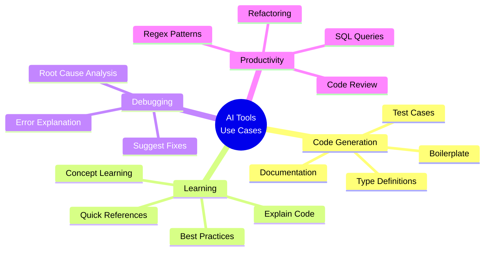
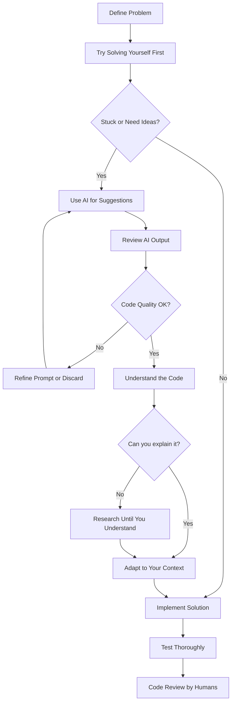

# AI-Assisted Software Development - Answers

## Question 1: Using GitHub Copilot/ChatGPT - Risks and Benefits

📋 **[Back to Question](../sse-topics.md#ai-assisted-software-development)** | **Topic:** AI-assisted development awareness

#### Question
How would you use GitHub Copilot or ChatGPT in your daily work? What are the risks?

#### Comprehensive Answer

AI-assisted development tools like GitHub Copilot and ChatGPT are transforming software engineering. Understanding their effective use and limitations is crucial for senior engineers.

---

#### 1. Legitimate Use Cases



---

#### 2. Effective Use: GitHub Copilot

##### Boilerplate and Repetitive Code

```typescript
// Example: Copilot excels at boilerplate

// Type this comment:
// Create a user repository class with CRUD operations

// Copilot suggests:
class UserRepository {
  constructor(private db: Database) {}
  
  async create(user: CreateUserDTO): Promise<User> {
    return await this.db.users.create(user);
  }
  
  async findById(id: string): Promise<User | null> {
    return await this.db.users.findUnique({ where: { id } });
  }
  
  async update(id: string, data: UpdateUserDTO): Promise<User> {
    return await this.db.users.update({ where: { id }, data });
  }
  
  async delete(id: string): Promise<void> {
    await this.db.users.delete({ where: { id } });
  }
}

// ✅ Good use: Standard CRUD boilerplate
// ⚠️ Still review: Check error handling, transactions
```

##### Test Generation

```python
# Example: Generating test cases

# Write the function:
def calculate_discount(price: float, customer_tier: str) -> float:
    """Calculate discount based on customer tier"""
    discounts = {'bronze': 0.05, 'silver': 0.10, 'gold': 0.15}
    return price * (1 - discounts.get(customer_tier, 0))

# Type comment: "test calculate_discount function"

# Copilot suggests comprehensive tests:
def test_calculate_discount():
    # Test bronze tier
    assert calculate_discount(100, 'bronze') == 95.0
    
    # Test silver tier
    assert calculate_discount(100, 'silver') == 90.0
    
    # Test gold tier
    assert calculate_discount(100, 'gold') == 85.0
    
    # Test unknown tier
    assert calculate_discount(100, 'platinum') == 100.0
    
    # Test edge cases
    assert calculate_discount(0, 'gold') == 0.0
    assert calculate_discount(100, '') == 100.0

# ✅ Good: Covers happy paths and edge cases
# ⚠️ Review: Add negative price test, null handling
```

---

#### 3. Effective Use: ChatGPT

##### Code Explanation

```markdown
## Prompt: "Explain this code"

INPUT CODE:
```javascript
const debounce = (func, delay) => {
  let timeoutId;
  return (...args) => {
    clearTimeout(timeoutId);
    timeoutId = setTimeout(() => func(...args), delay);
  };
};
```

CHATGPT RESPONSE:
"This is a debounce function that limits how often a function can be called:

1. Returns a new function that wraps the original
2. Each call clears the previous timer
3. Sets a new timer to call the function after `delay`
4. If called again before delay expires, timer resets
5. Useful for limiting expensive operations like API calls on user input

Example: Search box that only queries after user stops typing for 300ms"

✅ Good: Clear explanation with use case
✅ Helps juniors understand patterns
```

##### Debugging Assistance

```python
# Example: Getting help with cryptic error

# Prompt to ChatGPT:
"""
I'm getting this error in Python:
`TypeError: 'NoneType' object is not subscriptable`

Code:
result = my_function()
value = result[0]

What does this mean and how do I fix it?
"""

# ChatGPT Response:
"""
This error means `my_function()` returned `None` instead of a list/dict.

Common causes:
1. Function has no return statement
2. Function returns None explicitly
3. Function returns None under certain conditions

Fix:
```python
result = my_function()
if result is not None:
    value = result[0]
else:
    # Handle the None case
    value = default_value
```

Or check the function to ensure it always returns a value.
"""

✅ Good: Explains error and provides solution
✅ Faster than searching Stack Overflow
```

---

#### 4. The Risks and Limitations

##### Risk 1: Incorrect or Insecure Code

```javascript
// Example: Copilot suggesting insecure pattern

// Prompt: "Create login endpoint"

// ❌ Copilot might suggest:
app.post('/login', (req, res) => {
  const { username, password } = req.body;
  const user = db.query(`SELECT * FROM users WHERE username='${username}' AND password='${password}'`);
  
  if (user) {
    res.json({ token: generateToken(user) });
  } else {
    res.status(401).json({ error: 'Invalid credentials' });
  }
});

// PROBLEMS:
// 1. SQL Injection vulnerability
// 2. Plain text password comparison
// 3. No rate limiting
// 4. No input validation

// ✅ Human review catches these issues:
app.post('/login', async (req, res) => {
  const { username, password } = req.body;
  
  // Input validation
  if (!username || !password) {
    return res.status(400).json({ error: 'Missing credentials' });
  }
  
  // Parameterized query prevents SQL injection
  const user = await db.query(
    'SELECT * FROM users WHERE username = $1',
    [username]
  );
  
  // Compare hashed password
  const isValid = await bcrypt.compare(password, user.password_hash);
  
  if (isValid) {
    res.json({ token: generateToken(user) });
  } else {
    res.status(401).json({ error: 'Invalid credentials' });
  }
});
```

##### Risk 2: License and Copyright Issues

```markdown
## Copilot License Concerns

**Issue:**
Copilot trained on public GitHub code, including GPL/copyleft licenses

**Risk:**
May suggest code with incompatible licenses

**Example:**
# Copilot suggests code that looks like:
# Exact copy from GPL-licensed project
# Your company uses MIT license → incompatible

**Mitigation:**
- Review all AI-generated code
- Use code search to check for duplicates
- Understand licensing of training data
- Some companies ban Copilot for this reason
```

##### Risk 3: Over-Reliance and Skill Degradation

```python
# Scenario: Junior developer using Copilot as crutch

# They type comment: "function to sort array"
# Copilot generates code
# They accept without understanding
# Later, can't debug sorting issues because they never learned the concept

# ❌ Problem:
# - Not learning fundamentals
# - Can't work without AI
# - Struggles in interviews (no AI allowed)
# - Can't adapt code to specific needs

# ✅ Healthy approach:
# 1. Try implementing yourself first
# 2. Use Copilot for verification or alternative approaches
# 3. Understand the generated code before accepting
# 4. Practice coding without AI regularly
```

##### Risk 4: Confidentiality and Data Leakage

```markdown
## Data Privacy Concerns

**Scenario:**
Engineer pastes proprietary code into ChatGPT for help

**Risks:**
1. Training data: Code may be used to train future models
2. Data breach: Sensitive business logic exposed
3. Compliance: Violates company policies, NDAs

**Example - DON'T:**
```
Prompt to ChatGPT:
"How do I optimize this query?
SELECT * FROM users WHERE api_key = 'sk_live_abc123xyz456'"
```
[Just leaked production API key!]

**✅ Safe approach:**
- Remove sensitive data before prompting
- Use generic examples
- Check company policy on AI tool usage
- Use self-hosted AI tools for sensitive code
```

##### Risk 5: Context Limitations

```typescript
// Example: AI lacks full codebase context

// Copilot suggests:
function getUserProfile(userId: string): Promise<User> {
  return fetch(`/api/users/${userId}`).then(r => r.json());
}

// ❌ Problems Copilot doesn't know:
// - Your codebase uses axios, not fetch
// - Auth tokens required for API calls
// - Error handling pattern is standardized
// - TypeScript strict mode requires proper typing

// ✅ Human applies context:
async function getUserProfile(userId: string): Promise<User> {
  const response = await apiClient.get(`/users/${userId}`, {
    headers: { Authorization: `Bearer ${authToken}` }
  });
  return UserSchema.parse(response.data); // Validate with Zod
}
```

---

#### 5. Best Practices for AI-Assisted Development

##### The AI-Human Collaboration Model



##### Code Review Checklist for AI-Generated Code

```markdown
## Before Accepting AI-Generated Code

- [ ] **Understand it:** Can you explain what it does?
- [ ] **Security:** Any SQL injection, XSS, or other vulnerabilities?
- [ ] **Error handling:** What happens when things go wrong?
- [ ] **Edge cases:** Does it handle null, empty, invalid inputs?
- [ ] **Performance:** Any obvious inefficiencies?
- [ ] **Style:** Matches team conventions?
- [ ] **Context:** Fits with existing codebase patterns?
- [ ] **Tests:** Are tests comprehensive?
- [ ] **License:** No copyrighted code copied verbatim?
- [ ] **Privacy:** No sensitive data in prompts?
```

---

#### 6. Recommended Usage Guidelines

```yaml
AI Tool Usage Policy:

Encouraged:
  - Boilerplate generation
  - Test case generation
  - Documentation writing
  - Code explanation
  - Learning new concepts
  - Debugging assistance
  - Refactoring suggestions

Discouraged:
  - Blindly accepting suggestions
  - Complex algorithm implementation
  - Security-critical code
  - Production database queries
  - Code you don't understand

Prohibited:
  - Sharing proprietary code with ChatGPT
  - Copying generated code without review
  - Using as replacement for learning
  - Bypassing code review process
```

---

#### 7. Interview Answer Template

```markdown
## "How do you use GitHub Copilot/ChatGPT?" - Sample Answer

"I use AI tools strategically to enhance productivity, not replace thinking:

**Copilot:**
- Boilerplate code: CRUD operations, API endpoints, test scaffolds
- Autocomplete: Method names, common patterns
- Always review suggestions, often modify them

**ChatGPT:**
- Learning: Explain unfamiliar concepts or libraries
- Debugging: Understand error messages
- Brainstorming: Generate alternative approaches
- Documentation: Improve comments and README files

**Risks I'm aware of:**
1. **Security:** AI may suggest vulnerable code (SQL injection, etc.)
2. **Licensing:** Training data includes copyrighted code
3. **Over-reliance:** Must maintain problem-solving skills
4. **Privacy:** Never share proprietary/sensitive code
5. **Context:** AI lacks full codebase understanding

**My approach:**
- Try solving problems myself first
- Use AI for verification or alternatives
- Always understand code before accepting
- Treat AI output as a junior developer's work—needs review
- Test thoroughly, especially edge cases
- Practice coding without AI to maintain skills

Recently, I used ChatGPT to understand Rust's borrow checker when learning the 
language. It helped clarify concepts, but I still built my own projects to truly 
learn. For my team, I created guidelines on safe AI tool usage."
```

---

#### 8. The Future: AI as Pair Programmer

```markdown
## Evolving Relationship with AI Tools

**Today (2026):**
- AI suggests code snippets
- Developers review and adapt
- Junior-level assistance

**Near Future (2027-2028):**
- AI understands full codebase context
- Suggests architecture-level changes
- Catches bugs before code review
- Senior-level assistance

**Skills That Remain Valuable:**
- System design and architecture
- Understanding trade-offs
- Code review and mentorship
- Problem decomposition
- Stakeholder communication
- Security mindset
- Performance optimization
- Debugging complex issues

**Recommendation:**
Learn to work WITH AI, not fear being replaced BY it.
Focus on skills AI can't easily replicate.
```

---

