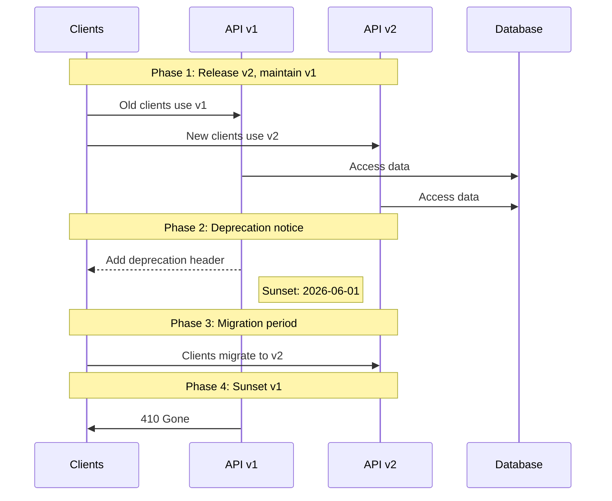

# API Documentation & Management - Answers

## Question 1: API Versioning in Production

📋 **[Back to Question](../sse-topics.md#api-documentation--management)**

**Detailed Answer:**

### API Versioning Strategies

```mermaid
graph TD
    A[API Versioning Strategies] --> B[URI Versioning]
    A --> C[Header Versioning]
    A --> D[Query Parameter]
    A --> E[Content Negotiation]
    
    B --> B1[/api/v1/users<br>/api/v2/users]
    C --> C1[Accept: application/vnd.api.v2+json]
    D --> D1[/api/users?version=2]
    E --> E1[Accept: application/json; version=2]
```

### 1. URI Versioning (Most Common)

```java
// Version 1
@RestController
@RequestMapping("/api/v1/users")
public class UserControllerV1 {
    
    @GetMapping("/{id}")
    public UserV1Response getUser(@PathVariable Long id) {
        return new UserV1Response(
            user.getId(),
            user.getName(),
            user.getEmail()
        );
    }
}

// Version 2 - Added phone field
@RestController
@RequestMapping("/api/v2/users")
public class UserControllerV2 {
    
    @GetMapping("/{id}")
    public UserV2Response getUser(@PathVariable Long id) {
        return new UserV2Response(
            user.getId(),
            user.getName(),
            user.getEmail(),
            user.getPhone() // New field
        );
    }
}
```

**Pros:**
- Clear and explicit
- Easy to route
- Simple for clients to understand

**Cons:**
- URLs change
- Multiple codebases to maintain
- Can lead to version sprawl

### 2. Header-Based Versioning

```java
@RestController
@RequestMapping("/api/users")
public class UserController {
    
    @GetMapping("/{id}")
    public ResponseEntity<?> getUser(
            @PathVariable Long id,
            @RequestHeader(value = "API-Version", defaultValue = "1") int version) {
        
        if (version == 2) {
            return ResponseEntity.ok(userServiceV2.getUser(id));
        }
        return ResponseEntity.ok(userServiceV1.getUser(id));
    }
}
```

**Pros:**
- Clean URLs
- Flexible versioning
- RESTful approach

**Cons:**
- Not immediately visible
- Harder to test in browser
- Requires documentation

### 3. Content Negotiation

```java
@RestController
@RequestMapping("/api/users")
public class UserController {
    
    @GetMapping(value = "/{id}", 
        produces = "application/vnd.myapp.v1+json")
    public UserV1Response getUserV1(@PathVariable Long id) {
        return userServiceV1.getUser(id);
    }
    
    @GetMapping(value = "/{id}", 
        produces = "application/vnd.myapp.v2+json")
    public UserV2Response getUserV2(@PathVariable Long id) {
        return userServiceV2.getUser(id);
    }
}
```

### Migration Strategy



### Deprecation Strategy

**Step 1: Announce Deprecation**
```java
@GetMapping("/{id}")
public ResponseEntity<User> getUser(@PathVariable Long id) {
    User user = userService.getUser(id);
    
    return ResponseEntity.ok()
        .header("Deprecation", "true")
        .header("Sunset", "Sat, 01 Jun 2026 00:00:00 GMT")
        .header("Link", "</api/v2/users>; rel=\"successor-version\"")
        .body(user);
}
```

**Step 2: Track API Usage**
```java
@Component
@Aspect
public class ApiVersionTracker {
    
    @Around("@annotation(apiVersion)")
    public Object trackVersion(ProceedingJoinPoint pjp, 
                              ApiVersion apiVersion) throws Throwable {
        String version = apiVersion.value();
        String endpoint = pjp.getSignature().toString();
        
        // Log usage metrics
        metricsService.incrementCounter(
            "api.version.usage", 
            Tags.of("version", version, "endpoint", endpoint)
        );
        
        return pjp.proceed();
    }
}
```

**Step 3: Communication Plan**
- Email notifications to API consumers
- Update documentation
- Add warning banners to developer portal
- Provide migration guides

### Breaking vs Non-Breaking Changes

**Non-Breaking Changes (Can add to existing version):**
- Adding new endpoints
- Adding new optional fields
- Adding new query parameters
- Expanding enum values

**Breaking Changes (Require new version):**
- Removing endpoints
- Removing fields from responses
- Changing field types
- Renaming fields
- Changing authentication methods
- Modifying error response formats

```java
// Example: Maintaining backward compatibility
public class UserResponse {
    private Long id;
    private String name;
    private String email;
    
    @JsonInclude(JsonInclude.Include.NON_NULL)
    private String phone; // New optional field - non-breaking
    
    // Don't remove or rename existing fields!
}
```

### Version Support Policy Example

```yaml
api_versions:
  v3:
    status: current
    released: 2026-01-01
    deprecated: null
    sunset: null
    
  v2:
    status: deprecated
    released: 2025-01-01
    deprecated: 2026-01-01
    sunset: 2026-07-01
    migration_guide: https://docs.example.com/v2-to-v3
    
  v1:
    status: sunset
    released: 2024-01-01
    deprecated: 2025-01-01
    sunset: 2025-07-01
    response: 410 Gone
```
