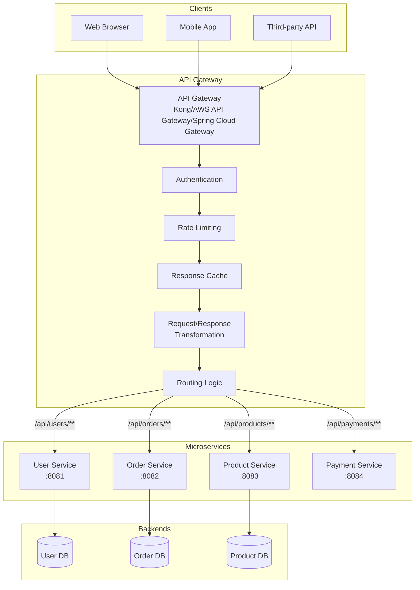

# API Gateway - Answers

## Question 1: API Gateway in Microservices

📋 **[Back to Question](../sse-topics.md#api-gateway)** | **Topic:** API Gateway and microservices

**Detailed Answer:**

#### API Gateway Pattern



#### Problems API Gateway Solves

**1. Single Entry Point**

**Without API Gateway:**
```
Client needs to know:
- User Service: https://user-service.example.com:8081
- Order Service: https://order-service.example.com:8082
- Product Service: https://product-service.example.com:8083
- Payment Service: https://payment-service.example.com:8084

// Client code becomes complex
const userResponse = await fetch('https://user-service.example.com:8081/api/user/123');
const orderResponse = await fetch('https://order-service.example.com:8082/api/orders/456');
```

**With API Gateway:**
```
Client only knows:
- API Gateway: https://api.example.com

// Simplified client code
const userResponse = await fetch('https://api.example.com/api/users/123');
const orderResponse = await fetch('https://api.example.com/api/orders/456');
```

**2. Authentication & Authorization**

```java
// Spring Cloud Gateway - Global Authentication Filter
@Component
public class AuthenticationFilter implements GlobalFilter, Ordered {
    
    @Autowired
    private JwtService jwtService;
    
    @Override
    public Mono<Void> filter(ServerWebExchange exchange, GatewayFilterChain chain) {
        ServerHttpRequest request = exchange.getRequest();
        
        // Skip auth for public endpoints
        if (isPublicPath(request.getPath().value())) {
            return chain.filter(exchange);
        }
        
        // Extract and validate JWT
        String token = extractToken(request);
        if (token == null || !jwtService.validateToken(token)) {
            exchange.getResponse().setStatusCode(HttpStatus.UNAUTHORIZED);
            return exchange.getResponse().setComplete();
        }
        
        // Add user info to headers for downstream services
        String username = jwtService.extractUsername(token);
        ServerHttpRequest modifiedRequest = request.mutate()
            .header("X-User-Id", username)
            .header("X-User-Roles", jwtService.extractRoles(token))
            .build();
        
        return chain.filter(exchange.mutate().request(modifiedRequest).build());
    }
    
    @Override
    public int getOrder() {
        return -100; // High priority
    }
    
    private boolean isPublicPath(String path) {
        return path.startsWith("/public/") || 
               path.equals("/auth/login") || 
               path.equals("/auth/register");
    }
    
    private String extractToken(ServerHttpRequest request) {
        List<String> headers = request.getHeaders().get(HttpHeaders.AUTHORIZATION);
        if (headers != null && !headers.isEmpty()) {
            String authHeader = headers.get(0);
            if (authHeader.startsWith("Bearer ")) {
                return authHeader.substring(7);
            }
        }
        return null;
    }
}
```

**3. Rate Limiting**

```java
// Spring Cloud Gateway - Rate Limiting
@Configuration
public class GatewayConfig {
    
    @Bean
    public RouteLocator customRouteLocator(RouteLocatorBuilder builder) {
        return builder.routes()
            .route("user_service", r -> r
                .path("/api/users/**")
                .filters(f -> f
                    .requestRateLimiter(config -> config
                        .setRateLimiter(redisRateLimiter())
                        .setKeyResolver(userKeyResolver())
                    )
                    .circuitBreaker(config -> config
                        .setName("userServiceCircuitBreaker")
                        .setFallbackUri("forward:/fallback/user")
                    )
                )
                .uri("lb://USER-SERVICE")
            )
            .route("public_api", r -> r
                .path("/api/public/**")
                .filters(f -> f
                    .requestRateLimiter(config -> config
                        .setRateLimiter(redisRateLimiter())
                        .setKeyResolver(ipKeyResolver())
                    )
                )
                .uri("lb://PUBLIC-SERVICE")
            )
            .build();
    }
    
    @Bean
    public RedisRateLimiter redisRateLimiter() {
        return new RedisRateLimiter(
            10,  // replenishRate: tokens per second
            20   // burstCapacity: max tokens
        );
    }
    
    @Bean
    public KeyResolver userKeyResolver() {
        return exchange -> {
            // Rate limit by user ID
            String userId = exchange.getRequest().getHeaders().getFirst("X-User-Id");
            return Mono.just(userId != null ? userId : "anonymous");
        };
    }
    
    @Bean
    public KeyResolver ipKeyResolver() {
        return exchange -> {
            // Rate limit by IP address
            String ip = exchange.getRequest().getRemoteAddress().getAddress().getHostAddress();
            return Mono.just(ip);
        };
    }
}
```

**4. Request Routing**

```yaml
# application.yml - Spring Cloud Gateway
spring:
  cloud:
    gateway:
      routes:
        # User Service
        - id: user_service
          uri: lb://USER-SERVICE  # Load balanced
          predicates:
            - Path=/api/users/**
          filters:
            - StripPrefix=2  # Remove /api/users
            - AddRequestHeader=X-Gateway, true
        
        # Order Service with versioning
        - id: order_service_v1
          uri: lb://ORDER-SERVICE-V1
          predicates:
            - Path=/api/v1/orders/**
            - Header=Accept-Version, v1
        
        - id: order_service_v2
          uri: lb://ORDER-SERVICE-V2
          predicates:
            - Path=/api/v2/orders/**
            - Header=Accept-Version, v2
        
        # Product Service with query param routing
        - id: product_search
          uri: lb://PRODUCT-SERVICE
          predicates:
            - Path=/api/products/**
            - Query=search  # Only if search param exists
          filters:
            - RewritePath=/api/products/(?<segment>.*), /search/${segment}
        
        # Payment Service (high priority)
        - id: payment_service
          uri: lb://PAYMENT-SERVICE
          predicates:
            - Path=/api/payments/**
          filters:
            - name: Retry
              args:
                retries: 3
                statuses: BAD_GATEWAY, SERVICE_UNAVAILABLE
                methods: GET, POST
                backoff:
                  firstBackoff: 50ms
                  maxBackoff: 500ms
```

**5. Protocol Translation**

```java
// REST to gRPC translation
@Component
public class GrpcTranslationFilter implements GlobalFilter {
    
    @Autowired
    private UserServiceGrpcClient grpcClient;
    
    @Override
    public Mono<Void> filter(ServerWebExchange exchange, GatewayFilterChain chain) {
        ServerHttpRequest request = exchange.getRequest();
        
        // If request is for gRPC service
        if (request.getPath().value().startsWith("/api/grpc/users")) {
            String userId = extractUserId(request.getPath().value());
            
            // Call gRPC service
            return Mono.fromCallable(() -> grpcClient.getUser(userId))
                .flatMap(grpcResponse -> {
                    // Convert gRPC response to JSON
                    String json = convertToJson(grpcResponse);
                    
                    // Write JSON response
                    ServerHttpResponse response = exchange.getResponse();
                    response.getHeaders().setContentType(MediaType.APPLICATION_JSON);
                    DataBuffer buffer = response.bufferFactory().wrap(json.getBytes());
                    return response.writeWith(Mono.just(buffer));
                });
        }
        
        return chain.filter(exchange);
    }
}
```

**6. Response Aggregation**

```java
// Aggregate data from multiple services
@RestController
@RequestMapping("/api/aggregated")
public class AggregationController {
    
    @Autowired
    private WebClient.Builder webClientBuilder;
    
    @GetMapping("/user-dashboard/{userId}")
    public Mono<UserDashboard> getUserDashboard(@PathVariable String userId) {
        // Call multiple services in parallel
        Mono<User> userMono = webClientBuilder.build()
            .get()
            .uri("lb://USER-SERVICE/users/" + userId)
            .retrieve()
            .bodyToMono(User.class);
        
        Mono<List<Order>> ordersMono = webClientBuilder.build()
            .get()
            .uri("lb://ORDER-SERVICE/orders?userId=" + userId)
            .retrieve()
            .bodyToFlux(Order.class)
            .collectList();
        
        Mono<List<Review>> reviewsMono = webClientBuilder.build()
            .get()
            .uri("lb://REVIEW-SERVICE/reviews?userId=" + userId)
            .retrieve()
            .bodyToFlux(Review.class)
            .collectList();
        
        // Combine responses
        return Mono.zip(userMono, ordersMono, reviewsMono)
            .map(tuple -> UserDashboard.builder()
                .user(tuple.getT1())
                .recentOrders(tuple.getT2())
                .recentReviews(tuple.getT3())
                .build()
            );
    }
}
```

**7. Caching**

```java
// Response caching filter
@Component
public class CachingFilter implements GlobalFilter {
    
    @Autowired
    private RedisTemplate<String, String> redisTemplate;
    
    @Override
    public Mono<Void> filter(ServerWebExchange exchange, GatewayFilterChain chain) {
        ServerHttpRequest request = exchange.getRequest();
        
        // Only cache GET requests
        if (!request.getMethod().equals(HttpMethod.GET)) {
            return chain.filter(exchange);
        }
        
        String cacheKey = generateCacheKey(request);
        
        // Check cache
        return Mono.fromCallable(() -> redisTemplate.opsForValue().get(cacheKey))
            .flatMap(cachedResponse -> {
                if (cachedResponse != null) {
                    // Return cached response
                    return writeResponse(exchange, cachedResponse);
                }
                
                // Cache miss - proceed with request
                return cacheResponse(exchange, chain, cacheKey);
            });
    }
    
    private Mono<Void> cacheResponse(ServerWebExchange exchange, GatewayFilterChain chain, String cacheKey) {
        ServerHttpResponseDecorator decoratedResponse = new ServerHttpResponseDecorator(exchange.getResponse()) {
            @Override
            public Mono<Void> writeWith(Publisher<? extends DataBuffer> body) {
                // Cache the response
                return super.writeWith(Flux.from(body).map(dataBuffer -> {
                    byte[] content = new byte[dataBuffer.readableByteCount()];
                    dataBuffer.read(content);
                    
                    // Store in Redis with TTL
                    redisTemplate.opsForValue().set(cacheKey, new String(content), Duration.ofMinutes(5));
                    
                    return dataBuffer;
                }));
            }
        };
        
        return chain.filter(exchange.mutate().response(decoratedResponse).build());
    }
}
```

#### When API Gateway Adds Value

**✅ Use API Gateway when:**

1. **Multiple client types** - Web, mobile, IoT need different data formats
2. **Many microservices** - Clients shouldn't know about all services
3. **Cross-cutting concerns** - Auth, logging, rate limiting needed everywhere
4. **Backend aggregation** - Reduce client-side complexity
5. **Protocol translation** - REST to gRPC, SOAP to REST
6. **Legacy system integration** - Gradual migration to microservices

#### When API Gateway Adds Complexity

**❌ Avoid API Gateway when:**

1. **Monolithic application** - Single service doesn't need gateway
2. **Internal services only** - Service-to-service communication
3. **Simple architecture** - 2-3 microservices with simple routing
4. **Performance critical** - Extra hop adds latency
5. **Team expertise** - Team not familiar with gateway patterns

**Alternative: Service Mesh (Istio, Linkerd)**

```yaml
# Service mesh handles traffic at sidecar proxy level
apiVersion: networking.istio.io/v1alpha3
kind: VirtualService
metadata:
  name: user-service
spec:
  hosts:
  - user-service
  http:
  - match:
    - headers:
        version:
          exact: v2
    route:
    - destination:
        host: user-service
        subset: v2
  - route:
    - destination:
        host: user-service
        subset: v1
```

#### Popular API Gateway Solutions

| Gateway | Best For | Pros | Cons |
|---------|----------|------|------|
| **Kong** | Enterprise, plugin ecosystem | Plugins, performance, scalability | Complex setup |
| **AWS API Gateway** | AWS ecosystem | Managed, serverless integration | AWS lock-in |
| **Spring Cloud Gateway** | Java/Spring microservices | Spring Boot integration, reactive | Java only |
| **Nginx** | Simple routing, reverse proxy | Fast, lightweight | Limited features |
| **Traefik** | Kubernetes, Docker | Auto-discovery, simple config | Less mature |
| **Apigee** | Enterprise API management | Full API lifecycle, analytics | Expensive |

#### Best Practices

1. **Keep gateway stateless** - no session storage
2. **Implement circuit breakers** - prevent cascade failures
3. **Use timeouts** - don't wait forever for downstream services
4. **Monitor gateway metrics** - latency, error rates, throughput
5. **Implement fallbacks** - graceful degradation
6. **Version APIs** - support multiple API versions
7. **Secure gateway** - rate limiting, DDoS protection
8. **Document APIs** - OpenAPI/Swagger integration

---

