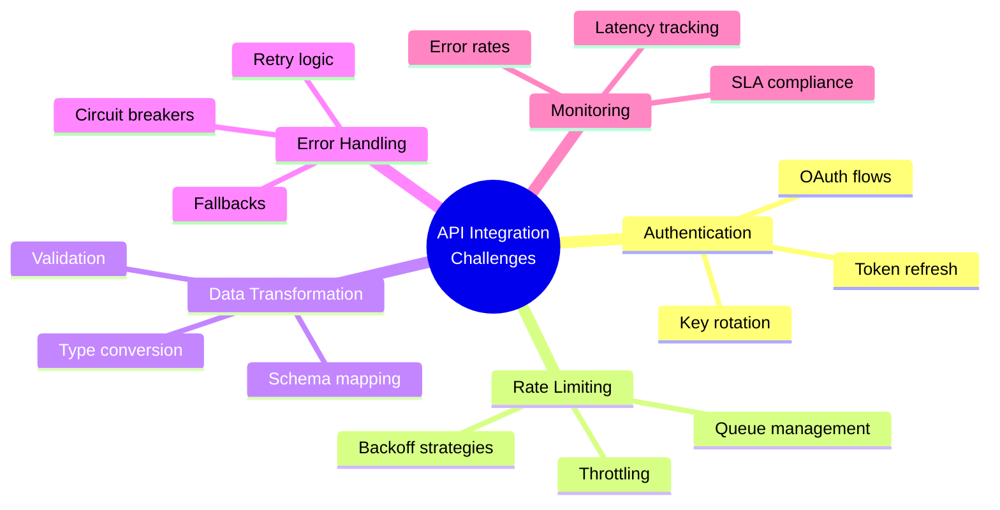
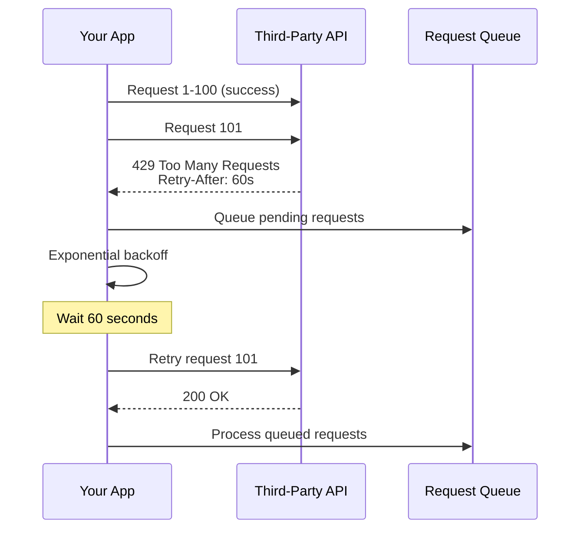
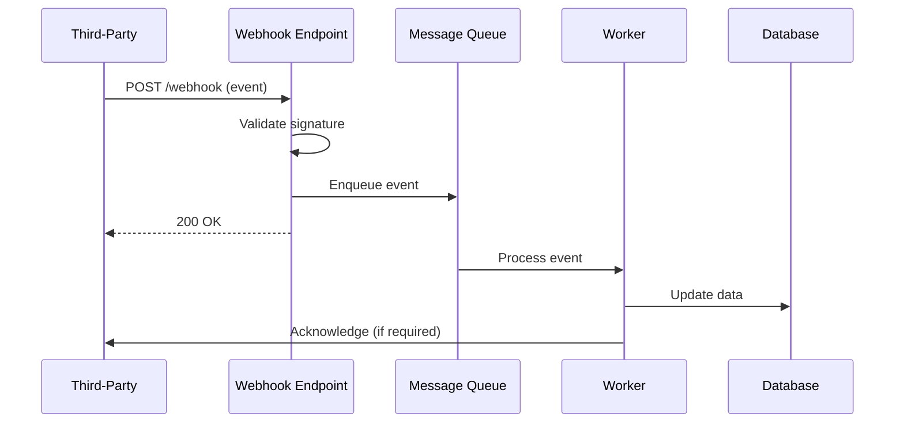

# API Integration - Answers

## Question 1: Complex API Integration Challenges

📋 **[Back to Question](../sse-topics.md#api-integration)**

**Detailed Answer:**

### Common API Integration Challenges



### Challenge 1: Complex OAuth 2.0 Flow

**Scenario:** Integrating with a third-party API requiring OAuth 2.0 with refresh tokens

```java
@Service
public class ThirdPartyApiClient {
    
    private String accessToken;
    private String refreshToken;
    private Instant tokenExpiry;
    
    @Autowired
    private RestTemplate restTemplate;
    
    public ApiResponse callApi(ApiRequest request) {
        ensureValidToken();
        
        try {
            HttpHeaders headers = new HttpHeaders();
            headers.setBearerAuth(accessToken);
            
            HttpEntity<ApiRequest> entity = 
                new HttpEntity<>(request, headers);
            
            ResponseEntity<ApiResponse> response = restTemplate.exchange(
                apiUrl, 
                HttpMethod.POST, 
                entity, 
                ApiResponse.class
            );
            
            return response.getBody();
            
        } catch (HttpClientErrorException.Unauthorized e) {
            // Token might be invalid, refresh and retry
            refreshAccessToken();
            return callApi(request); // Retry once
        }
    }
    
    private void ensureValidToken() {
        if (accessToken == null || 
            Instant.now().isAfter(tokenExpiry.minus(Duration.ofMinutes(5)))) {
            refreshAccessToken();
        }
    }
    
    private void refreshAccessToken() {
        MultiValueMap<String, String> params = new LinkedMultiValueMap<>();
        params.add("grant_type", "refresh_token");
        params.add("refresh_token", refreshToken);
        params.add("client_id", clientId);
        params.add("client_secret", clientSecret);
        
        TokenResponse response = restTemplate.postForObject(
            tokenUrl, 
            params, 
            TokenResponse.class
        );
        
        this.accessToken = response.getAccessToken();
        this.refreshToken = response.getRefreshToken();
        this.tokenExpiry = Instant.now()
            .plusSeconds(response.getExpiresIn());
    }
}
```

### Challenge 2: Rate Limiting & Backoff



**Implementation:**
```java
@Service
public class RateLimitedApiClient {
    
    private final Queue<ApiRequest> requestQueue = new ConcurrentLinkedQueue<>();
    private final Semaphore rateLimiter = new Semaphore(100); // 100 req/min
    
    @Scheduled(fixedRate = 60000) // Reset every minute
    public void resetRateLimit() {
        int permits = 100 - rateLimiter.availablePermits();
        rateLimiter.release(permits);
    }
    
    public CompletableFuture<ApiResponse> callApi(ApiRequest request) {
        return CompletableFuture.supplyAsync(() -> {
            try {
                rateLimiter.acquire();
                return executeWithRetry(request, 3);
            } catch (InterruptedException e) {
                Thread.currentThread().interrupt();
                throw new RuntimeException(e);
            }
        });
    }
    
    private ApiResponse executeWithRetry(ApiRequest request, int maxRetries) {
        int attempt = 0;
        while (attempt < maxRetries) {
            try {
                return restTemplate.postForObject(apiUrl, request, ApiResponse.class);
                
            } catch (HttpClientErrorException e) {
                if (e.getStatusCode() == HttpStatus.TOO_MANY_REQUESTS) {
                    String retryAfter = e.getResponseHeaders()
                        .getFirst("Retry-After");
                    int waitSeconds = Integer.parseInt(retryAfter);
                    
                    log.warn("Rate limited, waiting {} seconds", waitSeconds);
                    Thread.sleep(waitSeconds * 1000);
                    attempt++;
                } else {
                    throw e;
                }
            }
        }
        throw new RuntimeException("Max retries exceeded");
    }
}
```

### Challenge 3: Data Transformation

**Scenario:** Third-party API returns data in different format/structure

```java
// Third-party API response
{
  "usr_id": "12345",
  "usr_nm": "John Doe",
  "addr": {
    "str": "123 Main St",
    "cty": "NYC",
    "st": "NY"
  }
}

// Your internal model
{
  "id": 12345,
  "name": "John Doe",
  "address": {
    "street": "123 Main St",
    "city": "NYC",
    "state": "NY"
  }
}

// Mapper implementation
@Component
public class ThirdPartyResponseMapper {
    
    public User mapToInternalUser(ThirdPartyUser externalUser) {
        return User.builder()
            .id(Long.parseLong(externalUser.getUsrId()))
            .name(externalUser.getUsrNm())
            .address(Address.builder()
                .street(externalUser.getAddr().getStr())
                .city(externalUser.getAddr().getCty())
                .state(externalUser.getAddr().getSt())
                .build())
            .build();
    }
}
```

### Challenge 4: Webhook Handling



**Implementation:**
```java
@RestController
@RequestMapping("/api/webhooks")
public class WebhookController {
    
    @Autowired
    private MessageQueue messageQueue;
    
    @PostMapping("/third-party")
    public ResponseEntity<Void> handleWebhook(
            @RequestBody String payload,
            @RequestHeader("X-Signature") String signature) {
        
        // Validate signature
        if (!validateSignature(payload, signature)) {
            return ResponseEntity.status(HttpStatus.UNAUTHORIZED).build();
        }
        
        // Parse event
        WebhookEvent event = parseEvent(payload);
        
        // Enqueue for async processing
        messageQueue.send(event);
        
        // Return quickly to avoid timeout
        return ResponseEntity.ok().build();
    }
    
    private boolean validateSignature(String payload, String signature) {
        String computed = HmacUtils.hmacSha256Hex(webhookSecret, payload);
        return MessageDigest.isEqual(
            computed.getBytes(), 
            signature.getBytes()
        );
    }
}
```

### Testing Strategy

```java
@SpringBootTest
public class ThirdPartyApiClientTest {
    
    @Autowired
    private ThirdPartyApiClient apiClient;
    
    private MockWebServer mockWebServer;
    
    @BeforeEach
    void setUp() throws IOException {
        mockWebServer = new MockWebServer();
        mockWebServer.start();
    }
    
    @Test
    void testRateLimitHandling() throws Exception {
        // First request succeeds
        mockWebServer.enqueue(new MockResponse()
            .setResponseCode(200)
            .setBody("{\"status\": \"success\"}"));
        
        // Second request rate limited
        mockWebServer.enqueue(new MockResponse()
            .setResponseCode(429)
            .setHeader("Retry-After", "1")
            .setBody("{\"error\": \"rate_limit_exceeded\"}"));
        
        // Third request succeeds after retry
        mockWebServer.enqueue(new MockResponse()
            .setResponseCode(200)
            .setBody("{\"status\": \"success\"}"));
        
        ApiResponse response = apiClient.callApi(new ApiRequest());
        
        assertEquals("success", response.getStatus());
        assertEquals(3, mockWebServer.getRequestCount());
    }
}
```
