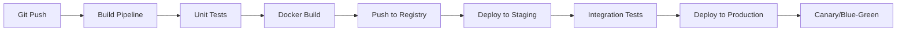
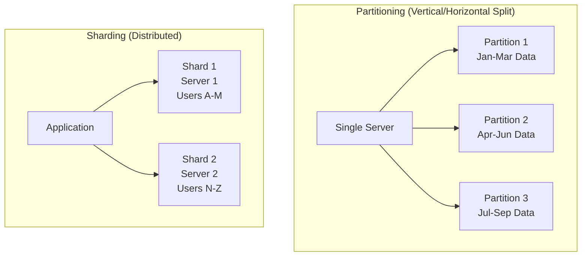

## Cloud Services & DevOps - Answers

### Question 1: CI/CD for Microservices



**Best Practices:**
- Monorepo or polyrepo with shared pipeline templates
- Service-specific vs shared integration tests
- Automated rollback on failure
- Feature flags for gradual rollout

---

### Question 2: Kubernetes Secrets Management

**Options:**
```yaml
# 1. Native Kubernetes Secrets (Base64 encoded - not secure!)
apiVersion: v1
kind: Secret
metadata:
  name: db-secret
data:
  password: cGFzc3dvcmQxMjM= # base64 encoded

# 2. External Secrets Operator + Vault
apiVersion: external-secrets.io/v1beta1
kind: ExternalSecret
metadata:
  name: db-secret
spec:
  secretStoreRef:
    name: vault-backend
  target:
    name: db-secret
  data:
  - secretKey: password
    remoteRef:
      key: database/password
```

**Best Practice:** Use external secret managers (Vault, AWS Secrets Manager) + RBAC + encryption at rest.

---

## Question 5: Sharding vs Partitioning in PostgreSQL

📋 **[Back to Question](../sse-topics.md#database-knowledge)** | **Topic:** Database scaling strategies

**Detailed Answer:**

#### Key Difference



**Partitioning:**
- Logical division of data within a single database server
- Improves query performance and maintenance
- Data still on one server

**Sharding:**
- Physical distribution of data across multiple database servers
- Horizontal scaling for throughput and storage
- More complex to manage

#### PostgreSQL Partitioning

**Declarative Partitioning (PostgreSQL 10+):**

```sql
-- Create partitioned table
CREATE TABLE orders (
    id BIGSERIAL,
    user_id BIGINT NOT NULL,
    order_date DATE NOT NULL,
    amount DECIMAL(10,2),
    status VARCHAR(20)
) PARTITION BY RANGE (order_date);

-- Create partitions
CREATE TABLE orders_2024_q1 PARTITION OF orders
    FOR VALUES FROM ('2024-01-01') TO ('2024-04-01');

CREATE TABLE orders_2024_q2 PARTITION OF orders
    FOR VALUES FROM ('2024-04-01') TO ('2024-07-01');

CREATE TABLE orders_2024_q3 PARTITION OF orders
    FOR VALUES FROM ('2024-07-01') TO ('2024-10-01');

CREATE TABLE orders_2024_q4 PARTITION OF orders
    FOR VALUES FROM ('2024-10-01') TO ('2025-01-01');

-- Create indexes on each partition
CREATE INDEX ON orders_2024_q1(user_id);
CREATE INDEX ON orders_2024_q2(user_id);
CREATE INDEX ON orders_2024_q3(user_id);
CREATE INDEX ON orders_2024_q4(user_id);

-- Query automatically routes to correct partition
SELECT * FROM orders 
WHERE order_date BETWEEN '2024-04-01' AND '2024-06-30';
-- Only scans orders_2024_q2

-- Insert automatically goes to correct partition
INSERT INTO orders (user_id, order_date, amount, status)
VALUES (123, '2024-05-15', 99.99, 'pending');
-- Goes to orders_2024_q2
```

**List Partitioning (by status):**

```sql
CREATE TABLE logs (
    id BIGSERIAL,
    level VARCHAR(20),
    message TEXT,
    created_at TIMESTAMP
) PARTITION BY LIST (level);

CREATE TABLE logs_error PARTITION OF logs
    FOR VALUES IN ('ERROR', 'CRITICAL');

CREATE TABLE logs_info PARTITION OF logs
    FOR VALUES IN ('INFO', 'DEBUG');

CREATE TABLE logs_warning PARTITION OF logs
    FOR VALUES IN ('WARNING');
```

**Hash Partitioning (distribute evenly):**

```sql
CREATE TABLE users (
    id BIGSERIAL,
    email VARCHAR(255),
    name VARCHAR(100)
) PARTITION BY HASH (id);

-- Create 4 hash partitions
CREATE TABLE users_p0 PARTITION OF users
    FOR VALUES WITH (MODULUS 4, REMAINDER 0);

CREATE TABLE users_p1 PARTITION OF users
    FOR VALUES WITH (MODULUS 4, REMAINDER 1);

CREATE TABLE users_p2 PARTITION OF users
    FOR VALUES WITH (MODULUS 4, REMAINDER 2);

CREATE TABLE users_p3 PARTITION OF users
    FOR VALUES WITH (MODULUS 4, REMAINDER 3);
```

#### PostgreSQL Sharding Implementation

**Option 1: Foreign Data Wrappers (postgres_fdw)**

```sql
-- On Shard Coordinator (Main Server)
CREATE EXTENSION postgres_fdw;

-- Define remote servers
CREATE SERVER shard1
    FOREIGN DATA WRAPPER postgres_fdw
    OPTIONS (host 'shard1.example.com', port '5432', dbname 'shard1_db');

CREATE SERVER shard2
    FOREIGN DATA WRAPPER postgres_fdw
    OPTIONS (host 'shard2.example.com', port '5432', dbname 'shard2_db');

-- Create user mappings
CREATE USER MAPPING FOR current_user
    SERVER shard1
    OPTIONS (user 'postgres', password 'secret');

CREATE USER MAPPING FOR current_user
    SERVER shard2
    OPTIONS (user 'postgres', password 'secret');

-- Import foreign schemas
IMPORT FOREIGN SCHEMA public
    FROM SERVER shard1 INTO shard1_schema;

IMPORT FOREIGN SCHEMA public
    FROM SERVER shard2 INTO shard2_schema;

-- Create partitioned table with foreign table partitions
CREATE TABLE users (
    id BIGINT,
    email VARCHAR(255),
    name VARCHAR(100)
) PARTITION BY RANGE (id);

-- Partition 1: Local users (id 1-1M)
CREATE TABLE users_local PARTITION OF users
    FOR VALUES FROM (1) TO (1000000);

-- Partition 2: Foreign shard 1 (id 1M-2M)
CREATE FOREIGN TABLE users_shard1 PARTITION OF users
    FOR VALUES FROM (1000000) TO (2000000)
    SERVER shard1;

-- Partition 3: Foreign shard 2 (id 2M-3M)
CREATE FOREIGN TABLE users_shard2 PARTITION OF users
    FOR VALUES FROM (2000000) TO (3000000)
    SERVER shard2;

-- Query works transparently across shards
SELECT * FROM users WHERE id = 1500000;
-- Automatically queries shard1
```

**Option 2: Application-Level Sharding**

```java
@Service
public class ShardingService {
    
    private final Map<Integer, DataSource> shards;
    
    public ShardingService() {
        shards = Map.of(
            0, createDataSource("jdbc:postgresql://shard0:5432/db"),
            1, createDataSource("jdbc:postgresql://shard1:5432/db"),
            2, createDataSource("jdbc:postgresql://shard2:5432/db")
        );
    }
    
    // Shard by user_id
    private int getShardId(long userId) {
        return (int) (userId % shards.size());
    }
    
    public User getUserById(long userId) {
        int shardId = getShardId(userId);
        DataSource ds = shards.get(shardId);
        
        try (Connection conn = ds.getConnection()) {
            PreparedStatement stmt = conn.prepareStatement(
                "SELECT * FROM users WHERE id = ?"
            );
            stmt.setLong(1, userId);
            ResultSet rs = stmt.executeQuery();
            
            if (rs.next()) {
                return mapToUser(rs);
            }
        }
        return null;
    }
    
    // Cross-shard query (expensive!)
    public List<User> getAllActiveUsers() {
        List<User> allUsers = new ArrayList<>();
        
        // Query all shards in parallel
        List<CompletableFuture<List<User>>> futures = 
            shards.values().stream()
                .map(ds -> CompletableFuture.supplyAsync(() -> 
                    queryActiveUsers(ds)))
                .collect(Collectors.toList());
        
        // Merge results
        for (CompletableFuture<List<User>> future : futures) {
            allUsers.addAll(future.join());
        }
        
        return allUsers;
    }
}
```

**Option 3: Citus Extension (Distributed PostgreSQL)**

```sql
-- Install Citus extension
CREATE EXTENSION citus;

-- Designate coordinator and workers
SELECT citus_set_coordinator_host('coordinator.example.com', 5432);
SELECT citus_add_node('worker1.example.com', 5432);
SELECT citus_add_node('worker2.example.com', 5432);

-- Create distributed table
CREATE TABLE events (
    id BIGSERIAL,
    user_id BIGINT,
    event_type VARCHAR(50),
    created_at TIMESTAMP,
    data JSONB
);

-- Distribute by user_id (colocation key)
SELECT create_distributed_table('events', 'user_id');

-- Queries are automatically distributed
SELECT COUNT(*) FROM events WHERE user_id = 12345;
-- Runs on single shard

SELECT event_type, COUNT(*) 
FROM events 
WHERE created_at > NOW() - INTERVAL '7 days'
GROUP BY event_type;
-- Runs on all shards, results aggregated
```

#### Comparison Table

| Feature | Partitioning | Sharding |
|---------|-------------|----------|
| **Scope** | Single server | Multiple servers |
| **Purpose** | Query performance, maintenance | Horizontal scaling, throughput |
| **Complexity** | Low | High |
| **Automatic routing** | Yes (PostgreSQL) | Application or tool |
| **Cross-partition queries** | Fast | Slow (network) |
| **Scaling** | Limited by single server | Nearly unlimited |
| **Backup** | Single backup | Per-shard backups |
| **Consistency** | ACID guaranteed | Eventual consistency |

#### When to Use Each

**Use Partitioning When:**
- Data growth manageable on single server
- Need to improve query performance
- Want to archive old data easily
- Maintain ACID guarantees
- Example: Time-series data, logs

**Use Sharding When:**
- Data exceeds single server capacity (>1TB)
- Need to scale write throughput
- User base is globally distributed
- Can tolerate eventual consistency
- Example: Social media, large SaaS platforms

#### Best Practices

**Partitioning:**
```sql
-- Regular maintenance
VACUUM ANALYZE orders_2024_q1;

-- Drop old partitions
DROP TABLE orders_2020_q1;

-- Create future partitions in advance
CREATE TABLE orders_2025_q1 PARTITION OF orders
    FOR VALUES FROM ('2025-01-01') TO ('2025-04-01');
```

**Sharding:**
```java
// Choose shard key carefully (immutable, evenly distributed)
// ✅ Good: user_id, customer_id
// ❌ Bad: created_at (uneven), status (low cardinality)

// Avoid cross-shard queries when possible
// Design schema to keep related data on same shard

// Monitor shard balance
SELECT shard_id, COUNT(*) 
FROM users_shard_metadata 
GROUP BY shard_id;
```

---

