# Cloud Services - Answers

## Question 1: Serverless - When to Use and Avoid

📋 **[Back to Question](../sse-topics.md#cloud-services)** | **Topic:** Serverless and cloud architecture

#### Question
What's your experience with serverless? When would you recommend it and when would you avoid it?

#### Comprehensive Answer

Serverless computing (Function-as-a-Service) has transformed cloud architecture. Understanding when to use it—and when not to—is crucial for cost-effective, scalable systems.

---

#### 1. What is Serverless?


**Key Characteristics:**
- No server management
- Auto-scaling (including to zero)
- Pay-per-use (not pay-per-hour)
- Event-driven execution
- Stateless functions

**Major Platforms:**
- AWS Lambda
- Google Cloud Functions
- Azure Functions
- Cloudflare Workers

---

#### 2. When to Use Serverless

##### Use Case 1: Event-Driven Workloads

```python
# Example: Image processing on upload

import boto3
from PIL import Image
import io

s3 = boto3.client('s3')

def lambda_handler(event, context):
    """
    Triggered when image uploaded to S3
    Creates thumbnail automatically
    """
    # Get uploaded image details
    bucket = event['Records'][0]['s3']['bucket']['name']
    key = event['Records'][0]['s3']['object']['key']
    
    # Download image
    image_obj = s3.get_object(Bucket=bucket, Key=key)
    image = Image.open(io.BytesIO(image_obj['Body'].read()))
    
    # Create thumbnail
    image.thumbnail((200, 200))
    
    # Save thumbnail
    buffer = io.BytesIO()
    image.save(buffer, 'PNG')
    buffer.seek(0)
    
    thumbnail_key = f"thumbnails/{key}"
    s3.put_object(
        Bucket=bucket,
        Key=thumbnail_key,
        Body=buffer,
        ContentType='image/png'
    )
    
    return {'statusCode': 200, 'body': 'Thumbnail created'}

# Why serverless works:
# - Unpredictable upload times
# - Variable load (1 image vs 1000 images)
# - Only pay when images are uploaded
# - Auto-scales to handle bursts
```

##### Use Case 2: API Backends with Variable Traffic

```javascript
// AWS Lambda + API Gateway
exports.handler = async (event) => {
    const userId = event.pathParameters.userId;
    
    // Query database
    const user = await dynamodb.get({
        TableName: 'Users',
        Key: { userId }
    }).promise();
    
    return {
        statusCode: 200,
        body: JSON.stringify(user.Item)
    };
};

// Benefits:
// - No servers to manage
// - Scales automatically (0 to 10K requests/sec)
// - Pay only for actual requests
// - No cost during idle periods
```

##### Use Case 3: Scheduled Tasks/Cron Jobs

```python
# Example: Daily report generation

def lambda_handler(event, context):
    """
    Triggered by CloudWatch Events (daily at 6 AM)
    Generates and emails daily sales report
    """
    # Query sales data
    sales_data = fetch_sales_data(yesterday())
    
    # Generate report
    report = generate_pdf_report(sales_data)
    
    # Email report
    send_email(
        to='management@company.com',
        subject='Daily Sales Report',
        attachment=report
    )
    
    return {'statusCode': 200}

# Why serverless works:
# - Runs once per day (5 minutes)
# - Traditional server would be idle 99.65% of time
# - Cost: $0.01/day vs $50/month for always-on server
```

##### Use Case 4: Data Processing Pipelines

```yaml
# Step Functions workflow for data pipeline

StateMachine:
  StartAt: IngestData
  States:
    IngestData:
      Type: Task
      Resource: arn:aws:lambda:function:ingest-data
      Next: TransformData
    
    TransformData:
      Type: Task
      Resource: arn:aws:lambda:function:transform-data
      Next: ValidateData
    
    ValidateData:
      Type: Task
      Resource: arn:aws:lambda:function:validate-data
      Next: LoadData
    
    LoadData:
      Type: Task
      Resource: arn:aws:lambda:function:load-data
      End: true

# Benefits:
# - Each step scales independently
# - Easy to add/remove steps
# - Built-in error handling and retry
# - Visual workflow in AWS console
```

---

#### 3. When to AVOID Serverless

##### Avoid Case 1: Long-Running Processes

```python
# ❌ Bad for serverless: Video transcoding (30 minutes)

def lambda_handler(event, context):
    video_file = download_video(event['video_url'])
    
    # This takes 30 minutes!
    transcoded = transcode_video(video_file, format='mp4')
    
    upload_video(transcoded)

# Problems:
# - AWS Lambda max timeout: 15 minutes
# - Expensive: Charged for entire duration
# - Better: Use ECS, EC2, or specialized service like AWS MediaConvert

# ✅ Good alternative: Container on ECS Fargate
# - No time limit
# - More cost-effective for long tasks
# - Better resource control
```

##### Avoid Case 2: Consistent High Traffic

```markdown
## Cost Comparison: High Traffic API

**Scenario:** API receiving 1000 requests/second, 24/7

**Serverless (Lambda):**
- 2.6 billion requests/month
- Cost: $5,200/month

**Traditional (ECS):**
- 10 × t3.medium instances
- Cost: $300/month

**Verdict:** Traditional wins for sustained high load
```

##### Avoid Case 3: Stateful Applications

```javascript
// ❌ Bad: WebSocket connections requiring persistent state

let connectedUsers = new Map();  // This won't work!

exports.handler = async (event) => {
    if (event.requestContext.eventType === 'CONNECT') {
        connectedUsers.set(event.requestContext.connectionId, {
            userId: event.userId
        });
    }
    // Problem: Each Lambda invocation is isolated
    // connectedUsers Map is lost between invocations
};

// ✅ Good alternative:
// - Use DynamoDB or Redis to store state
// - Or use traditional WebSocket server (EC2/ECS)
```

##### Avoid Case 4: Latency-Sensitive Applications

```markdown
## Cold Start Problem

**Cold Start:** First invocation after idle period

**Typical Cold Start Times:**
- Node.js: 100-300ms
- Python: 200-400ms
- Java: 1-3 seconds
- .NET: 1-2 seconds

**When this matters:**
- Real-time APIs (<50ms requirement)
- Gaming backends
- Trading systems
- Video streaming

**Mitigation:**
- Keep functions warm (scheduled pings)
- Use provisioned concurrency (costs more)
- Choose faster runtimes (Node.js, Python)

**Better alternatives:**
- Containers with ECS (no cold starts)
- Always-on EC2 instances
```

---

#### 4. Cost Analysis Framework

```python
# Serverless vs Traditional cost calculator

class CostAnalyzer:
    def calculate_serverless_cost(self, requests_per_month, avg_duration_ms, memory_mb):
        """
        AWS Lambda pricing (us-east-1):
        - $0.20 per 1M requests
        - $0.0000166667 per GB-second
        """
        request_cost = (requests_per_month / 1_000_000) * 0.20
        
        gb_seconds = (requests_per_month * (avg_duration_ms / 1000) * 
                      (memory_mb / 1024))
        compute_cost = gb_seconds * 0.0000166667
        
        return request_cost + compute_cost
    
    def calculate_traditional_cost(self, instance_type, instance_count):
        """
        EC2 pricing (us-east-1)
        """
        prices = {
            't3.small': 0.0208 * 730,    # per month
            't3.medium': 0.0416 * 730,
            't3.large': 0.0832 * 730
        }
        return prices[instance_type] * instance_count
    
    def recommend(self, requests_per_month, avg_duration_ms=100, memory_mb=512):
        serverless = self.calculate_serverless_cost(
            requests_per_month, avg_duration_ms, memory_mb
        )
        traditional = self.calculate_traditional_cost('t3.small', 2)
        
        if serverless < traditional * 0.8:
            return f"Serverless (${serverless:.2f}/mo vs ${traditional:.2f}/mo)"
        else:
            return f"Traditional (${traditional:.2f}/mo vs ${serverless:.2f}/mo)"

# Example usage
analyzer = CostAnalyzer()

# Low traffic
print(analyzer.recommend(requests_per_month=100_000))
# Output: "Serverless ($1.20/mo vs $30.40/mo)"

# Medium traffic
print(analyzer.recommend(requests_per_month=10_000_000))
# Output: "Serverless ($18.67/mo vs $30.40/mo)"

# High traffic
print(analyzer.recommend(requests_per_month=100_000_000))
# Output: "Traditional ($30.40/mo vs $186.67/mo)"
```

---

#### 5. Hybrid Approach

```yaml
# Real-world architecture: E-commerce platform

Services:
  WebApp:
    Type: Traditional (ECS)
    Reason: Consistent traffic, stateful sessions
    
  API Gateway:
    Type: Traditional (ALB + ECS)
    Reason: High consistent traffic (1000 req/sec)
    
  Image Processing:
    Type: Serverless (Lambda)
    Reason: Event-driven, variable load
    
  Email Notifications:
    Type: Serverless (Lambda + SQS)
    Reason: Async, unpredictable volume
    
  Analytics Pipeline:
    Type: Serverless (Lambda + Step Functions)
    Reason: Periodic batch jobs
    
  Search Service:
    Type: Traditional (ElasticSearch on EC2)
    Reason: Needs persistent connections, low latency
```

---

#### 6. Best Practices for Serverless

```python
# Best practices implementation

import os
import boto3
from aws_lambda_powertools import Logger, Tracer, Metrics

# Initialize outside handler (reused across invocations)
logger = Logger()
tracer = Tracer()
metrics = Metrics()

# Database connection reuse
db_client = boto3.client('dynamodb')

@tracer.capture_lambda_handler
@metrics.log_metrics
def lambda_handler(event, context):
    """
    Best practices:
    1. Initialize clients outside handler
    2. Use environment variables
    3. Implement proper logging
    4. Handle errors gracefully
    5. Set appropriate timeouts
    6. Monitor with CloudWatch
    """
    
    # Use environment variables
    table_name = os.environ['TABLE_NAME']
    
    try:
        # Business logic
        result = process_request(event, table_name)
        
        # Custom metrics
        metrics.add_metric(name="SuccessfulRequests", unit="Count", value=1)
        
        return {
            'statusCode': 200,
            'body': json.dumps(result)
        }
        
    except Exception as e:
        logger.exception("Error processing request")
        metrics.add_metric(name="FailedRequests", unit="Count", value=1)
        
        return {
            'statusCode': 500,
            'body': json.dumps({'error': str(e)})
        }
```

---

#### 7. Decision Framework

```mermaid
graph TD
    A[New Service Design] --> B{Traffic Pattern?}
    
    B -->|Unpredictable/Bursty| C[Consider Serverless]
    B -->|Consistent High| D[Consider Traditional]
    B -->|Low/Intermittent| C
    
    C --> E{Execution Time?}
    E -->|<5 minutes| F{Latency Sensitive?}
    E -->|>5 minutes| D
    
    F -->|No| G{Stateful?}
    F -->|Yes| H[Provisioned Concurrency or Traditional]
    
    G -->|No| I[✅ Serverless]
    G -->|Yes| J[External State Store + Serverless<br/>or Traditional]
    
    D --> K[✅ Containers/VMs]
```



---

#### 8. Interview Answer Template

```markdown
## "What's your experience with serverless?" - Sample Answer

"I've used serverless extensively in production systems, particularly AWS Lambda.

**Where it works well:**
- **Event-driven workloads:** I built an image processing pipeline that creates 
  thumbnails when users upload photos. Lambda scales automatically from zero to 
  thousands of concurrent executions.
  
- **APIs with variable traffic:** Our customer notification system uses Lambda + 
  API Gateway. Traffic varies from 10 req/min to 1000 req/min during campaigns.
  We only pay for actual usage—saved 60% vs always-on servers.
  
- **Scheduled tasks:** Daily report generation, data backups, log archiving—all 
  run on Lambda. Cost is negligible compared to maintaining dedicated servers.

**Where I avoid it:**
- **Consistent high traffic:** Our main API gets 500 req/sec 24/7. Traditional 
  containers on ECS are 10x cheaper and have better latency.
  
- **Long-running processes:** Video transcoding takes 20 minutes—exceeds Lambda's 
  15-minute limit. We use ECS Fargate instead.
  
- **Latency-critical:** Our real-time chat backend needs <50ms response time. 
  Cold starts make Lambda unsuitable—we use persistent WebSocket connections on EC2.

**Key learnings:**
- Cold starts are real—use provisioned concurrency for critical paths
- Design for idempotency (functions may retry)
- External state storage is essential (DynamoDB, S3, Redis)
- Monitor costs closely—can get expensive at scale

**Recent project:**
Built a serverless data pipeline with Lambda + Step Functions. Processes 1M 
records/day, costs $50/month vs $500/month for always-on infrastructure."
```

---

#### 9. Common Pitfalls and Solutions

```markdown
## Serverless Antipatterns

**Pitfall 1: Orchestration in Code**
❌ Lambda calling Lambda calling Lambda
✅ Use Step Functions for workflows

**Pitfall 2: Not Handling Cold Starts**
❌ Ignoring 1-2 second latency spikes
✅ Use provisioned concurrency or keep-warm strategies

**Pitfall 3: Large Deployment Packages**
❌ 50MB deployment with all dependencies
✅ Use Lambda Layers for shared code

**Pitfall 4: No Monitoring**
❌ No visibility into errors or performance
✅ Use CloudWatch, X-Ray, and custom metrics

**Pitfall 5: Ignoring Costs**
❌ "Serverless is cheap" assumption
✅ Monitor costs, set billing alarms
```

---

### Docker Best Practices
- Order Dockerfile commands: least to most frequently changing
- Use multi-stage builds to reduce image size
- Don't run as root user
- Use specific base image tags (not `latest`)

### SQL Optimization
- Use `EXPLAIN ANALYZE` to check query plans
- Add indexes on WHERE/JOIN columns
- Avoid SELECT *, use specific columns
- Consider partitioning for large tables

### Git Branching Strategy
- **Trunk-based:** Small teams, continuous deployment
- **Git Flow:** Release-based, multiple environments
- **GitHub Flow:** Feature branches, simple workflow

### Soft Skills
- **Mentorship:** Pair programming, code reviews with explanations
- **Technical Decisions:** Document trade-offs in ADRs
- **Disagreements:** Data-driven discussions, escalate if needed
- **Continuous Learning:** Side projects, conferences, open source

---

## Software Architecture

### Question 2: Handling Distributed Transactions Across Microservices

📋 **[Back to Question](../sse-topics.md#cloud-services)** | **Topic:** Event-driven architecture knowledge

#### 1. The Problem: Why Distributed Transactions Are Hard

**The ACID Dilemma**

In a monolithic application with a single database, transactions are straightforward - ACID properties (Atomicity, Consistency, Isolation, Durability) are guaranteed by the database. But in microservices:

```
┌─────────────────┐      ┌──────────────────┐      ┌─────────────────┐
│  Order Service  │      │  Payment Service │      │ Inventory Svc   │
│                 │      │                  │      │                 │
│  ┌───────────┐  │      │  ┌────────────┐  │      │  ┌───────────┐  │
│  │ Orders DB │  │      │  │ Payments DB│  │      │  │ Stock DB  │  │
│  └───────────┘  │      │  └────────────┘  │      │  └───────────┘  │
└─────────────────┘      └──────────────────┘      └─────────────────┘
```

**Real-World Scenario:**
An e-commerce order involves:
1. **Order Service**: Create order record
2. **Payment Service**: Charge credit card
3. **Inventory Service**: Deduct stock
4. **Shipping Service**: Create shipment

What happens when payment succeeds but inventory fails? Or shipping service is down?

#### 2. Two-Phase Commit (2PC) - The Traditional Approach

**How 2PC Works:**


**Why 2PC Fails in Microservices:**

```java
// Problems with 2PC in microservices:
// 1. Blocking: All participants wait for coordinator
// 2. Single point of failure: Coordinator failure = system halt
// 3. Performance: Network latency multiplied by phases
// 4. Scalability: Locks held across network calls
// 5. Timeout issues: What if a service is slow?

// Example of 2PC coordinator (NOT RECOMMENDED for microservices)
public class TwoPhaseCommitCoordinator {
    private List<TransactionParticipant> participants;
    
    public boolean executeTransaction(Transaction tx) {
        // Phase 1: Prepare
        List<String> preparedParticipants = new ArrayList<>();
        
        for (TransactionParticipant participant : participants) {
            try {
                if (participant.prepare(tx)) {
                    preparedParticipants.add(participant.getId());
                } else {
                    // Abort: Send rollback to all prepared participants
                    rollbackPrepared(preparedParticipants, tx);
                    return false;
                }
            } catch (NetworkException e) {
                // What if prepare times out?
                // Participant is in uncertain state!
                rollbackPrepared(preparedParticipants, tx);
                return false;
            }
        }
        
        // Phase 2: Commit
        for (TransactionParticipant participant : participants) {
            try {
                participant.commit(tx);
            } catch (NetworkException e) {
                // DISASTER: Some committed, some didn't!
                // Manual intervention required
                logInconsistency(participant, tx);
            }
        }
        
        return true;
    }
}
```

#### 3. The Saga Pattern - The Modern Solution

**Saga Types:**

1. **Choreography**: Services publish events, others react
2. **Orchestration**: Central orchestrator coordinates the saga

**Choreography-Based Saga:**


**Implementation - Choreography Saga:**

```java
// Domain Event
@Data
@AllArgsConstructor
public class OrderCreatedEvent {
    private String orderId;
    private String customerId;
    private BigDecimal amount;
    private List<OrderItem> items;
    private LocalDateTime timestamp;
}

// Order Service - Saga Initiator
@Service
public class OrderService {
    
    @Autowired
    private OrderRepository orderRepository;
    
    @Autowired
    private KafkaTemplate<String, DomainEvent> eventPublisher;
    
    @Transactional
    public Order createOrder(CreateOrderRequest request) {
        // 1. Create order in PENDING state
        Order order = Order.builder()
                .id(UUID.randomUUID().toString())
                .customerId(request.getCustomerId())
                .items(request.getItems())
                .totalAmount(calculateTotal(request.getItems()))
                .status(OrderStatus.PENDING)
                .createdAt(LocalDateTime.now())
                .build();
        
        order = orderRepository.save(order);
        
        // 2. Publish event - starts the saga
        OrderCreatedEvent event = new OrderCreatedEvent(
                order.getId(),
                order.getCustomerId(),
                order.getTotalAmount(),
                order.getItems(),
                LocalDateTime.now()
        );
        
        eventPublisher.send("order-events", event);
        
        return order;
    }
    
    // Listen for saga completion/failure events
    @KafkaListener(topics = "shipping-events")
    public void handleShippingEvent(ShipmentCreatedEvent event) {
        Order order = orderRepository.findById(event.getOrderId())
                .orElseThrow();
        
        order.setStatus(OrderStatus.CONFIRMED);
        order.setShipmentId(event.getShipmentId());
        orderRepository.save(order);
        
        log.info("Order {} confirmed successfully", order.getId());
    }
    
    @KafkaListener(topics = "payment-events")
    public void handlePaymentRefund(PaymentRefundedEvent event) {
        Order order = orderRepository.findById(event.getOrderId())
                .orElseThrow();
        
        order.setStatus(OrderStatus.CANCELLED);
        order.setCancellationReason("Payment refunded: " + event.getReason());
        orderRepository.save(order);
        
        log.info("Order {} cancelled", order.getId());
    }
}

// Payment Service - Saga Participant
@Service
public class PaymentService {
    
    @Autowired
    private PaymentRepository paymentRepository;
    
    @Autowired
    private PaymentGateway paymentGateway;
    
    @Autowired
    private KafkaTemplate<String, DomainEvent> eventPublisher;
    
    @KafkaListener(topics = "order-events")
    @Transactional
    public void handleOrderCreated(OrderCreatedEvent event) {
        try {
            // 1. Charge payment
            PaymentResult result = paymentGateway.charge(
                    event.getCustomerId(),
                    event.getAmount()
            );
            
            // 2. Save payment record
            Payment payment = Payment.builder()
                    .id(UUID.randomUUID().toString())
                    .orderId(event.getOrderId())
                    .customerId(event.getCustomerId())
                    .amount(event.getAmount())
                    .status(PaymentStatus.COMPLETED)
                    .transactionId(result.getTransactionId())
                    .timestamp(LocalDateTime.now())
                    .build();
            
            paymentRepository.save(payment);
            
            // 3. Publish success event
            PaymentSuccessEvent successEvent = new PaymentSuccessEvent(
                    payment.getId(),
                    event.getOrderId(),
                    event.getAmount(),
                    result.getTransactionId()
            );
            
            eventPublisher.send("payment-events", successEvent);
            
        } catch (PaymentException e) {
            // Payment failed - publish failure event
            PaymentFailedEvent failedEvent = new PaymentFailedEvent(
                    event.getOrderId(),
                    e.getMessage()
            );
            
            eventPublisher.send("payment-events", failedEvent);
            log.error("Payment failed for order {}: {}", event.getOrderId(), e.getMessage());
        }
    }
    
    // Compensating transaction - refund
    @KafkaListener(topics = "inventory-events")
    @Transactional
    public void handleStockUnavailable(StockUnavailableEvent event) {
        Payment payment = paymentRepository.findByOrderId(event.getOrderId())
                .orElseThrow();
        
        try {
            // Refund the payment
            paymentGateway.refund(payment.getTransactionId(), payment.getAmount());
            
            payment.setStatus(PaymentStatus.REFUNDED);
            payment.setRefundedAt(LocalDateTime.now());
            paymentRepository.save(payment);
            
            // Publish refund event
            PaymentRefundedEvent refundEvent = new PaymentRefundedEvent(
                    payment.getOrderId(),
                    payment.getAmount(),
                    "Stock unavailable"
            );
            
            eventPublisher.send("payment-events", refundEvent);
            
            log.info("Refunded payment for order {}", event.getOrderId());
            
        } catch (PaymentException e) {
            // Refund failed - needs manual intervention
            log.error("CRITICAL: Refund failed for order {}. Manual intervention required!", 
                    event.getOrderId());
            // Send alert to operations team
            alertService.sendCriticalAlert("Refund failed", payment);
        }
    }
}

// Inventory Service - Saga Participant with Compensation
@Service
public class InventoryService {
    
    @Autowired
    private InventoryRepository inventoryRepository;
    
    @Autowired
    private KafkaTemplate<String, DomainEvent> eventPublisher;
    
    @KafkaListener(topics = "payment-events")
    @Transactional
    public void handlePaymentSuccess(PaymentSuccessEvent event) {
        String orderId = event.getOrderId();
        
        try {
            // Get order items (from event or separate call)
            List<OrderItem> items = getOrderItems(orderId);
            
            // Check and reserve stock
            List<StockReservation> reservations = new ArrayList<>();
            
            for (OrderItem item : items) {
                Inventory inventory = inventoryRepository.findByProductId(item.getProductId())
                        .orElseThrow(() -> new ProductNotFoundException(item.getProductId()));
                
                if (inventory.getAvailableQuantity() < item.getQuantity()) {
                    // Insufficient stock - release previous reservations
                    releaseReservations(reservations);
                    
                    // Publish failure event
                    StockUnavailableEvent unavailableEvent = new StockUnavailableEvent(
                            orderId,
                            item.getProductId(),
                            "Insufficient stock"
                    );
                    
                    eventPublisher.send("inventory-events", unavailableEvent);
                    return;
                }
                
                // Reserve stock
                inventory.setAvailableQuantity(
                        inventory.getAvailableQuantity() - item.getQuantity()
                );
                inventory.setReservedQuantity(
                        inventory.getReservedQuantity() + item.getQuantity()
                );
                
                inventoryRepository.save(inventory);
                
                StockReservation reservation = new StockReservation(
                        orderId,
                        item.getProductId(),
                        item.getQuantity()
                );
                
                reservations.add(reservation);
            }
            
            // All items reserved successfully
            StockReservedEvent reservedEvent = new StockReservedEvent(
                    orderId,
                    reservations
            );
            
            eventPublisher.send("inventory-events", reservedEvent);
            
        } catch (Exception e) {
            log.error("Error reserving stock for order {}", orderId, e);
            
            StockUnavailableEvent errorEvent = new StockUnavailableEvent(
                    orderId,
                    null,
                    "System error: " + e.getMessage()
            );
            
            eventPublisher.send("inventory-events", errorEvent);
        }
    }
    
    private void releaseReservations(List<StockReservation> reservations) {
        for (StockReservation reservation : reservations) {
            Inventory inventory = inventoryRepository
                    .findByProductId(reservation.getProductId())
                    .orElseThrow();
            
            inventory.setAvailableQuantity(
                    inventory.getAvailableQuantity() + reservation.getQuantity()
            );
            inventory.setReservedQuantity(
                    inventory.getReservedQuantity() - reservation.getQuantity()
            );
            
            inventoryRepository.save(inventory);
        }
    }
}
```

**Orchestration-Based Saga:**


**Implementation - Orchestration Saga:**

```java
// Saga Orchestrator
@Service
public class OrderSagaOrchestrator {
    
    @Autowired
    private PaymentServiceClient paymentClient;
    
    @Autowired
    private InventoryServiceClient inventoryClient;
    
    @Autowired
    private ShippingServiceClient shippingClient;
    
    @Autowired
    private OrderRepository orderRepository;
    
    @Autowired
    private SagaStateRepository sagaStateRepository;
    
    public void executeOrderSaga(Order order) {
        // Create saga state for tracking
        SagaState saga = SagaState.builder()
                .sagaId(UUID.randomUUID().toString())
                .orderId(order.getId())
                .status(SagaStatus.STARTED)
                .currentStep(SagaStep.PAYMENT)
                .startTime(LocalDateTime.now())
                .build();
        
        sagaStateRepository.save(saga);
        
        try {
            // Step 1: Process Payment
            saga.setCurrentStep(SagaStep.PAYMENT);
            sagaStateRepository.save(saga);
            
            PaymentResponse paymentResponse = paymentClient.processPayment(
                    new PaymentRequest(order.getId(), order.getCustomerId(), order.getTotalAmount())
            );
            
            saga.setPaymentId(paymentResponse.getPaymentId());
            sagaStateRepository.save(saga);
            
            // Step 2: Reserve Stock
            saga.setCurrentStep(SagaStep.INVENTORY);
            sagaStateRepository.save(saga);
            
            InventoryResponse inventoryResponse = inventoryClient.reserveStock(
                    new ReservationRequest(order.getId(), order.getItems())
            );
            
            saga.setReservationId(inventoryResponse.getReservationId());
            sagaStateRepository.save(saga);
            
            // Step 3: Create Shipment
            saga.setCurrentStep(SagaStep.SHIPPING);
            sagaStateRepository.save(saga);
            
            ShipmentResponse shipmentResponse = shippingClient.createShipment(
                    new ShipmentRequest(order.getId(), order.getCustomerId(), order.getItems())
            );
            
            saga.setShipmentId(shipmentResponse.getShipmentId());
            saga.setStatus(SagaStatus.COMPLETED);
            saga.setEndTime(LocalDateTime.now());
            sagaStateRepository.save(saga);
            
            // Update order status
            order.setStatus(OrderStatus.CONFIRMED);
            orderRepository.save(order);
            
            log.info("Saga completed successfully for order {}", order.getId());
            
        } catch (PaymentException e) {
            log.error("Payment failed for order {}", order.getId(), e);
            saga.setStatus(SagaStatus.FAILED);
            saga.setFailureReason("Payment failed: " + e.getMessage());
            saga.setEndTime(LocalDateTime.now());
            sagaStateRepository.save(saga);
            
            // No compensation needed - payment didn't succeed
            order.setStatus(OrderStatus.CANCELLED);
            orderRepository.save(order);
            
        } catch (InventoryException e) {
            log.error("Stock reservation failed for order {}", order.getId(), e);
            saga.setStatus(SagaStatus.COMPENSATING);
            sagaStateRepository.save(saga);
            
            // Compensate: Refund payment
            compensatePayment(saga.getPaymentId(), order);
            
            saga.setStatus(SagaStatus.COMPENSATED);
            saga.setEndTime(LocalDateTime.now());
            sagaStateRepository.save(saga);
            
            order.setStatus(OrderStatus.CANCELLED);
            orderRepository.save(order);
            
        } catch (ShippingException e) {
            log.error("Shipment creation failed for order {}", order.getId(), e);
            saga.setStatus(SagaStatus.COMPENSATING);
            sagaStateRepository.save(saga);
            
            // Compensate: Release stock and refund payment
            compensateInventory(saga.getReservationId(), order);
            compensatePayment(saga.getPaymentId(), order);
            
            saga.setStatus(SagaStatus.COMPENSATED);
            saga.setEndTime(LocalDateTime.now());
            sagaStateRepository.save(saga);
            
            order.setStatus(OrderStatus.CANCELLED);
            orderRepository.save(order);
        }
    }
    
    private void compensatePayment(String paymentId, Order order) {
        try {
            paymentClient.refundPayment(paymentId);
            log.info("Refunded payment {} for order {}", paymentId, order.getId());
        } catch (Exception e) {
            log.error("CRITICAL: Failed to refund payment {} for order {}. Manual intervention required!",
                    paymentId, order.getId());
            alertService.sendCriticalAlert("Compensation failed", order);
        }
    }
    
    private void compensateInventory(String reservationId, Order order) {
        try {
            inventoryClient.releaseReservation(reservationId);
            log.info("Released reservation {} for order {}", reservationId, order.getId());
        } catch (Exception e) {
            log.error("Failed to release reservation {} for order {}", reservationId, order.getId());
            // Less critical than payment - can be reconciled later
        }
    }
}

// Saga State Entity for persistence
@Entity
@Data
@Builder
public class SagaState {
    @Id
    private String sagaId;
    
    private String orderId;
    
    @Enumerated(EnumType.STRING)
    private SagaStatus status;
    
    @Enumerated(EnumType.STRING)
    private SagaStep currentStep;
    
    private String paymentId;
    private String reservationId;
    private String shipmentId;
    
    private String failureReason;
    
    private LocalDateTime startTime;
    private LocalDateTime endTime;
}

enum SagaStatus {
    STARTED, IN_PROGRESS, COMPLETED, FAILED, COMPENSATING, COMPENSATED
}

enum SagaStep {
    PAYMENT, INVENTORY, SHIPPING
}
```

#### 4. Event Sourcing with Sagas

**Event Sourcing Approach:**

```java
// Event Store
@Service
public class OrderEventStore {
    
    @Autowired
    private EventRepository eventRepository;
    
    @Autowired
    private KafkaTemplate<String, DomainEvent> eventPublisher;
    
    public void appendEvent(DomainEvent event) {
        // 1. Persist event
        EventEntity eventEntity = EventEntity.builder()
                .eventId(UUID.randomUUID().toString())
                .aggregateId(event.getAggregateId())
                .eventType(event.getClass().getSimpleName())
                .eventData(serializeEvent(event))
                .timestamp(LocalDateTime.now())
                .version(getNextVersion(event.getAggregateId()))
                .build();
        
        eventRepository.save(eventEntity);
        
        // 2. Publish event to event bus
        eventPublisher.send("domain-events", event);
    }
    
    public List<DomainEvent> getEvents(String aggregateId) {
        List<EventEntity> entities = eventRepository.findByAggregateIdOrderByVersionAsc(aggregateId);
        return entities.stream()
                .map(this::deserializeEvent)
                .collect(Collectors.toList());
    }
    
    public OrderAggregate loadAggregate(String orderId) {
        List<DomainEvent> events = getEvents(orderId);
        OrderAggregate aggregate = new OrderAggregate();
        
        for (DomainEvent event : events) {
            aggregate.apply(event);
        }
        
        return aggregate;
    }
}

// Order Aggregate
public class OrderAggregate {
    private String orderId;
    private String customerId;
    private OrderStatus status;
    private BigDecimal totalAmount;
    private List<OrderItem> items;
    private List<DomainEvent> uncommittedEvents = new ArrayList<>();
    
    // Create new order
    public void createOrder(String customerId, List<OrderItem> items) {
        OrderCreatedEvent event = new OrderCreatedEvent(
                UUID.randomUUID().toString(),
                customerId,
                calculateTotal(items),
                items,
                LocalDateTime.now()
        );
        
        applyEvent(event);
    }
    
    // Apply payment
    public void applyPayment(String paymentId, String transactionId) {
        if (this.status != OrderStatus.PENDING) {
            throw new InvalidOrderStateException("Order must be PENDING to apply payment");
        }
        
        PaymentAppliedEvent event = new PaymentAppliedEvent(
                this.orderId,
                paymentId,
                transactionId,
                this.totalAmount,
                LocalDateTime.now()
        );
        
        applyEvent(event);
    }
    
    // Reserve inventory
    public void reserveInventory(String reservationId) {
        if (this.status != OrderStatus.PAYMENT_RECEIVED) {
            throw new InvalidOrderStateException("Payment must be received to reserve inventory");
        }
        
        InventoryReservedEvent event = new InventoryReservedEvent(
                this.orderId,
                reservationId,
                LocalDateTime.now()
        );
        
        applyEvent(event);
    }
    
    // Cancel order (compensation)
    public void cancel(String reason) {
        OrderCancelledEvent event = new OrderCancelledEvent(
                this.orderId,
                reason,
                LocalDateTime.now()
        );
        
        applyEvent(event);
    }
    
    // Event handlers - mutate state
    public void apply(DomainEvent event) {
        if (event instanceof OrderCreatedEvent) {
            OrderCreatedEvent e = (OrderCreatedEvent) event;
            this.orderId = e.getOrderId();
            this.customerId = e.getCustomerId();
            this.totalAmount = e.getAmount();
            this.items = e.getItems();
            this.status = OrderStatus.PENDING;
        } else if (event instanceof PaymentAppliedEvent) {
            this.status = OrderStatus.PAYMENT_RECEIVED;
        } else if (event instanceof InventoryReservedEvent) {
            this.status = OrderStatus.INVENTORY_RESERVED;
        } else if (event instanceof ShipmentCreatedEvent) {
            this.status = OrderStatus.CONFIRMED;
        } else if (event instanceof OrderCancelledEvent) {
            this.status = OrderStatus.CANCELLED;
        }
    }
    
    private void applyEvent(DomainEvent event) {
        apply(event);
        uncommittedEvents.add(event);
    }
    
    public List<DomainEvent> getUncommittedEvents() {
        return uncommittedEvents;
    }
    
    public void markEventsAsCommitted() {
        uncommittedEvents.clear();
    }
}

// Command Handler
@Service
public class OrderCommandHandler {
    
    @Autowired
    private OrderEventStore eventStore;
    
    @Transactional
    public void handle(CreateOrderCommand command) {
        OrderAggregate aggregate = new OrderAggregate();
        aggregate.createOrder(command.getCustomerId(), command.getItems());
        
        // Save events
        for (DomainEvent event : aggregate.getUncommittedEvents()) {
            eventStore.appendEvent(event);
        }
        
        aggregate.markEventsAsCommitted();
    }
    
    @Transactional
    public void handle(ApplyPaymentCommand command) {
        // Load aggregate from event store
        OrderAggregate aggregate = eventStore.loadAggregate(command.getOrderId());
        
        // Apply command
        aggregate.applyPayment(command.getPaymentId(), command.getTransactionId());
        
        // Save new events
        for (DomainEvent event : aggregate.getUncommittedEvents()) {
            eventStore.appendEvent(event);
        }
        
        aggregate.markEventsAsCommitted();
    }
    
    @Transactional
    public void handle(CancelOrderCommand command) {
        OrderAggregate aggregate = eventStore.loadAggregate(command.getOrderId());
        aggregate.cancel(command.getReason());
        
        for (DomainEvent event : aggregate.getUncommittedEvents()) {
            eventStore.appendEvent(event);
        }
        
        aggregate.markEventsAsCommitted();
    }
}
```

#### 5. Handling Failures and Edge Cases

**Idempotency:**

```java
// Idempotent Event Handler
@Service
public class IdempotentPaymentEventHandler {
    
    @Autowired
    private ProcessedEventRepository processedEventRepository;
    
    @Autowired
    private PaymentService paymentService;
    
    @KafkaListener(topics = "order-events")
    @Transactional
    public void handleOrderCreated(OrderCreatedEvent event, 
                                   @Header(KafkaHeaders.RECEIVED_MESSAGE_KEY) String messageKey) {
        
        // Check if we've already processed this event
        String eventId = event.getEventId();
        if (processedEventRepository.existsByEventId(eventId)) {
            log.info("Event {} already processed, skipping", eventId);
            return;
        }
        
        try {
            // Process the event
            paymentService.processPayment(event);
            
            // Mark event as processed
            ProcessedEvent processedEvent = ProcessedEvent.builder()
                    .eventId(eventId)
                    .eventType("OrderCreatedEvent")
                    .processedAt(LocalDateTime.now())
                    .build();
            
            processedEventRepository.save(processedEvent);
            
        } catch (Exception e) {
            log.error("Error processing event {}", eventId, e);
            throw e; // Let Kafka retry
        }
    }
}

// Processed Event Entity
@Entity
@Table(indexes = @Index(columnList = "eventId", unique = true))
@Data
@Builder
public class ProcessedEvent {
    @Id
    @GeneratedValue(strategy = GenerationType.IDENTITY)
    private Long id;
    
    @Column(unique = true, nullable = false)
    private String eventId;
    
    private String eventType;
    
    private LocalDateTime processedAt;
}
```

**Timeout Handling:**

```java
// Saga with Timeouts
@Service
public class SagaTimeoutHandler {
    
    @Autowired
    private SagaStateRepository sagaStateRepository;
    
    @Autowired
    private OrderSagaOrchestrator orchestrator;
    
    // Run every minute
    @Scheduled(fixedRate = 60000)
    public void checkSagaTimeouts() {
        LocalDateTime timeoutThreshold = LocalDateTime.now().minusMinutes(5);
        
        List<SagaState> timedOutSagas = sagaStateRepository
                .findByStatusAndStartTimeBefore(SagaStatus.IN_PROGRESS, timeoutThreshold);
        
        for (SagaState saga : timedOutSagas) {
            log.warn("Saga {} timed out, initiating compensation", saga.getSagaId());
            
            saga.setStatus(SagaStatus.COMPENSATING);
            saga.setFailureReason("Timeout after 5 minutes");
            sagaStateRepository.save(saga);
            
            // Trigger compensation based on current step
            orchestrator.compensate(saga);
        }
    }
}
```

**Retry with Exponential Backoff:**

```java
// Retry Configuration
@Configuration
public class RetryConfig {
    
    @Bean
    public RetryTemplate retryTemplate() {
        RetryTemplate retryTemplate = new RetryTemplate();
        
        // Exponential backoff: 1s, 2s, 4s, 8s, 16s
        ExponentialBackOffPolicy backOffPolicy = new ExponentialBackOffPolicy();
        backOffPolicy.setInitialInterval(1000);
        backOffPolicy.setMultiplier(2.0);
        backOffPolicy.setMaxInterval(30000);
        
        // Retry up to 5 times
        SimpleRetryPolicy retryPolicy = new SimpleRetryPolicy();
        retryPolicy.setMaxAttempts(5);
        
        retryTemplate.setBackOffPolicy(backOffPolicy);
        retryTemplate.setRetryPolicy(retryPolicy);
        
        return retryTemplate;
    }
}

// Using Retry Template
@Service
public class ResilientPaymentClient {
    
    @Autowired
    private RetryTemplate retryTemplate;
    
    @Autowired
    private RestTemplate restTemplate;
    
    public PaymentResponse processPayment(PaymentRequest request) {
        return retryTemplate.execute(context -> {
            log.info("Attempt {} to process payment for order {}",
                    context.getRetryCount() + 1, request.getOrderId());
            
            try {
                return restTemplate.postForObject(
                        "http://payment-service/api/payments",
                        request,
                        PaymentResponse.class
                );
            } catch (HttpServerErrorException e) {
                // Retry on 5xx errors
                log.warn("Server error, will retry: {}", e.getMessage());
                throw e;
            } catch (HttpClientErrorException e) {
                // Don't retry on 4xx errors
                log.error("Client error, not retrying: {}", e.getMessage());
                throw new NonRetryableException(e);
            }
        }, context -> {
            // Recovery callback after all retries exhausted
            log.error("All retries exhausted for payment {}", request.getOrderId());
            throw new PaymentException("Payment service unavailable after retries");
        });
    }
}
```

#### 6. Monitoring and Observability

**Distributed Tracing:**

```java
// Spring Cloud Sleuth Configuration
@Configuration
public class TracingConfig {
    
    @Bean
    public Sampler defaultSampler() {
        return Sampler.ALWAYS_SAMPLE;
    }
}

// Service with Tracing
@Service
@Slf4j
public class TracedOrderService {
    
    @Autowired
    private Tracer tracer;
    
    public Order createOrder(CreateOrderRequest request) {
        Span span = tracer.nextSpan().name("create-order").start();
        
        try (Tracer.SpanInScope ws = tracer.withSpan(span)) {
            span.tag("order.customer.id", request.getCustomerId());
            span.tag("order.items.count", String.valueOf(request.getItems().size()));
            
            Order order = processOrder(request);
            
            span.tag("order.id", order.getId());
            span.tag("order.total", order.getTotalAmount().toString());
            
            log.info("Order created successfully");
            
            return order;
            
        } catch (Exception e) {
            span.tag("error", e.getMessage());
            log.error("Error creating order", e);
            throw e;
        } finally {
            span.end();
        }
    }
}
```

**Saga State Visualization:**

```java
// Saga Dashboard Endpoint
@RestController
@RequestMapping("/api/admin/sagas")
public class SagaDashboardController {
    
    @Autowired
    private SagaStateRepository sagaStateRepository;
    
    @GetMapping("/{sagaId}")
    public SagaStatusResponse getSagaStatus(@PathVariable String sagaId) {
        SagaState saga = sagaStateRepository.findById(sagaId)
                .orElseThrow(() -> new SagaNotFoundException(sagaId));
        
        return SagaStatusResponse.builder()
                .sagaId(saga.getSagaId())
                .orderId(saga.getOrderId())
                .status(saga.getStatus())
                .currentStep(saga.getCurrentStep())
                .steps(buildStepDetails(saga))
                .duration(Duration.between(saga.getStartTime(), 
                        saga.getEndTime() != null ? saga.getEndTime() : LocalDateTime.now()))
                .build();
    }
    
    private List<SagaStepDetail> buildStepDetails(SagaState saga) {
        List<SagaStepDetail> steps = new ArrayList<>();
        
        steps.add(SagaStepDetail.builder()
                .name("Payment")
                .status(saga.getPaymentId() != null ? StepStatus.COMPLETED : StepStatus.PENDING)
                .resourceId(saga.getPaymentId())
                .build());
        
        steps.add(SagaStepDetail.builder()
                .name("Inventory")
                .status(saga.getReservationId() != null ? StepStatus.COMPLETED : StepStatus.PENDING)
                .resourceId(saga.getReservationId())
                .build());
        
        steps.add(SagaStepDetail.builder()
                .name("Shipping")
                .status(saga.getShipmentId() != null ? StepStatus.COMPLETED : StepStatus.PENDING)
                .resourceId(saga.getShipmentId())
                .build());
        
        return steps;
    }
    
    @GetMapping("/failed")
    public List<SagaState> getFailedSagas(@RequestParam(defaultValue = "24") int hours) {
        LocalDateTime since = LocalDateTime.now().minusHours(hours);
        return sagaStateRepository.findByStatusAndStartTimeAfter(SagaStatus.FAILED, since);
    }
}
```

#### 7. Real-World Example: E-Commerce Order Processing

**Complete Implementation:**

```java
// Application Configuration
@Configuration
@EnableKafka
public class SagaConfiguration {
    
    @Bean
    public KafkaTemplate<String, DomainEvent> kafkaTemplate(ProducerFactory<String, DomainEvent> pf) {
        return new KafkaTemplate<>(pf);
    }
    
    @Bean
    public ProducerFactory<String, DomainEvent> producerFactory() {
        Map<String, Object> config = new HashMap<>();
        config.put(ProducerConfig.BOOTSTRAP_SERVERS_CONFIG, "localhost:9092");
        config.put(ProducerConfig.KEY_SERIALIZER_CLASS_CONFIG, StringSerializer.class);
        config.put(ProducerConfig.VALUE_SERIALIZER_CLASS_CONFIG, JsonSerializer.class);
        config.put(ProducerConfig.ACKS_CONFIG, "all");
        config.put(ProducerConfig.RETRIES_CONFIG, 3);
        config.put(ProducerConfig.ENABLE_IDEMPOTENCE_CONFIG, true);
        
        return new DefaultKafkaProducerFactory<>(config);
    }
}

// Order API Controller
@RestController
@RequestMapping("/api/orders")
public class OrderController {
    
    @Autowired
    private OrderService orderService;
    
    @Autowired
    private OrderSagaOrchestrator sagaOrchestrator;
    
    @PostMapping
    public ResponseEntity<OrderResponse> createOrder(@RequestBody CreateOrderRequest request) {
        // 1. Create order
        Order order = orderService.createOrder(request);
        
        // 2. Start saga asynchronously
        CompletableFuture.runAsync(() -> sagaOrchestrator.executeOrderSaga(order));
        
        // 3. Return immediately with order ID
        return ResponseEntity.accepted()
                .body(OrderResponse.builder()
                        .orderId(order.getId())
                        .status(order.getStatus())
                        .message("Order is being processed")
                        .build());
    }
    
    @GetMapping("/{orderId}")
    public ResponseEntity<OrderDetailResponse> getOrder(@PathVariable String orderId) {
        Order order = orderService.getOrder(orderId);
        
        return ResponseEntity.ok(OrderDetailResponse.builder()
                .orderId(order.getId())
                .customerId(order.getCustomerId())
                .items(order.getItems())
                .totalAmount(order.getTotalAmount())
                .status(order.getStatus())
                .createdAt(order.getCreatedAt())
                .build());
    }
}
```

**Testing:**

```java
// Integration Test for Saga
@SpringBootTest
@TestPropertySource(locations = "classpath:application-test.properties")
@EmbeddedKafka(partitions = 1, topics = {"order-events", "payment-events", "inventory-events", "shipping-events"})
public class OrderSagaIntegrationTest {
    
    @Autowired
    private OrderService orderService;
    
    @Autowired
    private OrderSagaOrchestrator sagaOrchestrator;
    
    @Autowired
    private OrderRepository orderRepository;
    
    @Autowired
    private SagaStateRepository sagaStateRepository;
    
    @MockBean
    private PaymentServiceClient paymentClient;
    
    @MockBean
    private InventoryServiceClient inventoryClient;
    
    @MockBean
    private ShippingServiceClient shippingClient;
    
    @Test
    public void testSuccessfulOrderSaga() throws Exception {
        // Given
        CreateOrderRequest request = CreateOrderRequest.builder()
                .customerId("customer-123")
                .items(Arrays.asList(
                        new OrderItem("product-1", 2, new BigDecimal("29.99")),
                        new OrderItem("product-2", 1, new BigDecimal("49.99"))
                ))
                .build();
        
        // Mock successful responses
        when(paymentClient.processPayment(any()))
                .thenReturn(new PaymentResponse("payment-1", "tx-123", PaymentStatus.COMPLETED));
        
        when(inventoryClient.reserveStock(any()))
                .thenReturn(new InventoryResponse("reservation-1", true));
        
        when(shippingClient.createShipment(any()))
                .thenReturn(new ShipmentResponse("shipment-1", "tracking-123"));
        
        // When
        Order order = orderService.createOrder(request);
        sagaOrchestrator.executeOrderSaga(order);
        
        // Wait for async processing
        Thread.sleep(2000);
        
        // Then
        Order updatedOrder = orderRepository.findById(order.getId()).orElseThrow();
        assertEquals(OrderStatus.CONFIRMED, updatedOrder.getStatus());
        
        SagaState saga = sagaStateRepository.findByOrderId(order.getId()).orElseThrow();
        assertEquals(SagaStatus.COMPLETED, saga.getStatus());
        assertNotNull(saga.getPaymentId());
        assertNotNull(saga.getReservationId());
        assertNotNull(saga.getShipmentId());
    }
    
    @Test
    public void testSagaCompensationOnInventoryFailure() throws Exception {
        // Given
        CreateOrderRequest request = CreateOrderRequest.builder()
                .customerId("customer-456")
                .items(Arrays.asList(new OrderItem("product-3", 100, new BigDecimal("19.99"))))
                .build();
        
        // Mock payment success but inventory failure
        when(paymentClient.processPayment(any()))
                .thenReturn(new PaymentResponse("payment-2", "tx-456", PaymentStatus.COMPLETED));
        
        when(inventoryClient.reserveStock(any()))
                .thenThrow(new InventoryException("Insufficient stock"));
        
        // When
        Order order = orderService.createOrder(request);
        sagaOrchestrator.executeOrderSaga(order);
        
        // Wait for compensation
        Thread.sleep(2000);
        
        // Then
        Order updatedOrder = orderRepository.findById(order.getId()).orElseThrow();
        assertEquals(OrderStatus.CANCELLED, updatedOrder.getStatus());
        
        SagaState saga = sagaStateRepository.findByOrderId(order.getId()).orElseThrow();
        assertEquals(SagaStatus.COMPENSATED, saga.getStatus());
        
        // Verify refund was called
        verify(paymentClient).refundPayment("payment-2");
    }
}
```

#### 8. Best Practices

**Saga Design Principles:**

1. **Keep Sagas Short**: Fewer steps = fewer failure points
2. **Design for Idempotency**: All operations must be idempotent
3. **Use Unique IDs**: Correlation IDs, idempotency keys
4. **Timeout Management**: Set realistic timeouts for each step
5. **Compensation Logic**: Design compensating transactions carefully
6. **Monitoring**: Track saga state and duration
7. **Alerting**: Alert on failed compensations (requires manual intervention)

**When to Use What:**

| Scenario | Recommended Approach |
|----------|---------------------|
| Simple 2-3 step process | Choreography Saga |
| Complex multi-step workflow | Orchestration Saga |
| Need audit trail | Event Sourcing |
| Performance critical | Choreography (no central bottleneck) |
| Easy debugging needed | Orchestration (central visibility) |
| Team is distributed | Choreography (loose coupling) |

**Avoid These Mistakes:**

```java
// ❌ BAD: Distributed transaction across services
@Transactional
public void badApproach(Order order) {
    orderService.save(order);           // Service 1
    paymentService.charge(order);       // Service 2 - Different DB!
    inventoryService.reserve(order);    // Service 3 - Different DB!
    // If inventory fails, payment still committed!
}

// ✅ GOOD: Saga pattern
public void goodApproach(Order order) {
    // Step 1
    orderService.save(order);
    publishEvent(new OrderCreatedEvent(order));
    
    // Step 2 happens via event listener in payment service
    // Step 3 happens via event listener in inventory service
    // Each has its own compensation logic
}

// ❌ BAD: No idempotency
@EventListener
public void handlePayment(OrderCreatedEvent event) {
    paymentGateway.charge(event.getAmount());
    // What if this handler is called twice?
}

// ✅ GOOD: Idempotent handler
@EventListener
public void handlePayment(OrderCreatedEvent event) {
    if (!processedEvents.contains(event.getId())) {
        paymentGateway.charge(event.getAmount());
        processedEvents.add(event.getId());
    }
}
```

#### 9. Comparison Summary


| Pattern | Consistency | Complexity | Scalability | Debugging |
|---------|-------------|------------|-------------|-----------|
| 2PC | Strong | Low | Poor | Easy |
| Saga (Choreography) | Eventual | Medium | Excellent | Hard |
| Saga (Orchestration) | Eventual | Medium | Good | Medium |
| Event Sourcing | Eventual | High | Excellent | Easy |

---

