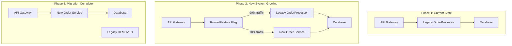

# Code Quality - Answers

## Question 1: Refactoring Large Codebases Safely

📋 **[Back to Question](../sse-topics.md#code-quality)** | **Topic:** Code maintenance and quality

#### 1. Pre-Refactoring Assessment

**Real-World Example:**

> I once had to refactor a 5000-line legacy service that handled order processing. It was a monolithic class with no tests, tight coupling, and multiple responsibilities. Here's my systematic approach:

**Initial Analysis:**

```java
// The Legacy Monster - OrderProcessor.java (before refactoring)
public class OrderProcessor {
    // 5000 lines of spaghetti code
    // Multiple responsibilities: validation, payment, inventory, shipping, email
    // No separation of concerns
    // Tight coupling to external services
    // Zero unit tests
    
    public void processOrder(Order order) throws Exception {
        // 1. Validation (200 lines of nested ifs)
        if (order == null) throw new Exception("null order");
        if (order.getCustomerId() == null) throw new Exception("no customer");
        if (order.getItems() == null || order.getItems().isEmpty()) 
            throw new Exception("no items");
        // ... 197 more lines
        
        // 2. Calculate totals (100 lines)
        double total = 0;
        for (OrderItem item : order.getItems()) {
            double price = item.getPrice();
            if (item.isOnSale()) {
                price = price * 0.9;
            }
            if (order.getCustomer().isPremium()) {
                price = price * 0.95;
            }
            // ... complex discount logic
            total += price * item.getQuantity();
        }
        
        // 3. Payment processing (300 lines)
        // Direct JDBC calls, no abstraction
        Connection conn = DriverManager.getConnection(DB_URL);
        PreparedStatement ps = conn.prepareStatement("INSERT INTO payments...");
        // ... manual transaction management
        
        // 4. Inventory management (500 lines)
        // More direct DB calls
        
        // 5. Shipping (400 lines)
        // HTTP calls with no retry logic
        
        // 6. Email notifications (300 lines)
        // Embedded HTML templates in strings
        
        // 7. Audit logging (200 lines)
        // File I/O scattered throughout
    }
}
```

**Assessment Checklist:**

```markdown
## Refactoring Assessment Template

### 1. Understand Current State
- [ ] Document current functionality
  - What does this code do?
  - What are the inputs/outputs?
  - What are the dependencies?
  
- [ ] Identify pain points
  - Bugs: List known issues
  - Performance: Slow operations?
  - Maintainability: Hard to change?
  
- [ ] Map dependencies
  - External services
  - Databases
  - File systems
  - Third-party libraries

### 2. Test Coverage Analysis
- Current test coverage: 0%
- Critical paths without tests:
  - Payment processing (HIGH RISK)
  - Inventory deduction (HIGH RISK)
  - Email notifications (LOW RISK)

### 3. Impact Analysis
- Users affected: All customers placing orders
- Systems affected: 5 microservices downstream
- Risk level: HIGH (payment processing involved)

### 4. Refactoring Strategy
- Approach: Strangler Fig Pattern
- Timeline: 6 weeks
- Team size: 2 developers
```

#### 2. Building a Safety Net: Comprehensive Testing

**Step 1: Characterization Tests**

```java
/**
 * Characterization tests capture CURRENT behavior (not ideal behavior)
 * These act as a safety net while refactoring
 */
@SpringBootTest
public class OrderProcessorCharacterizationTest {
    
    @Autowired
    private OrderProcessor orderProcessor; // Legacy class
    
    @Autowired
    private OrderRepository orderRepository;
    
    @Autowired
    private PaymentRepository paymentRepository;
    
    /**
     * Test 1: Capture happy path behavior
     */
    @Test
    public void testSimpleOrderProcessing() {
        // Given: A simple order
        Order order = Order.builder()
                .customerId("customer-123")
                .items(Arrays.asList(
                        new OrderItem("product-1", 2, 29.99),
                        new OrderItem("product-2", 1, 49.99)
                ))
                .build();
        
        // When: Process order
        orderProcessor.processOrder(order);
        
        // Then: Verify CURRENT behavior
        Order savedOrder = orderRepository.findById(order.getId()).orElseThrow();
        assertEquals(OrderStatus.COMPLETED, savedOrder.getStatus());
        assertEquals(109.97, savedOrder.getTotalAmount(), 0.01);
        
        Payment payment = paymentRepository.findByOrderId(order.getId()).orElseThrow();
        assertEquals(109.97, payment.getAmount(), 0.01);
        assertEquals(PaymentStatus.COMPLETED, payment.getStatus());
        
        // Verify email was sent (check mock or log)
        verify(emailService).sendOrderConfirmation(order.getId());
    }
    
    /**
     * Test 2: Capture edge case - premium customer discount
     */
    @Test
    public void testPremiumCustomerDiscount() {
        // Given: Premium customer
        Customer premiumCustomer = createPremiumCustomer();
        Order order = createOrderForCustomer(premiumCustomer, 100.00);
        
        // When
        orderProcessor.processOrder(order);
        
        // Then: Verify discount applied (current behavior: 5% off)
        Order savedOrder = orderRepository.findById(order.getId()).orElseThrow();
        assertEquals(95.00, savedOrder.getTotalAmount(), 0.01);
    }
    
    /**
     * Test 3: Capture error handling
     */
    @Test
    public void testPaymentFailure() {
        // Given: Order that will cause payment failure
        mockPaymentGatewayToFail();
        Order order = createSimpleOrder();
        
        // When/Then: Verify CURRENT error behavior
        assertThrows(PaymentException.class, () -> {
            orderProcessor.processOrder(order);
        });
        
        // Verify order is marked as failed
        Order savedOrder = orderRepository.findById(order.getId()).orElseThrow();
        assertEquals(OrderStatus.PAYMENT_FAILED, savedOrder.getStatus());
    }
    
    /**
     * Test 4: Capture quirky behavior (bugs become features temporarily)
     */
    @Test
    public void testWeirdRoundingBehavior() {
        // This test captures a BUG in the current system
        // We'll fix it later, but first we document it
        Order order = createOrderWithAmount(99.995); // Edge case
        
        orderProcessor.processOrder(order);
        
        Order savedOrder = orderRepository.findById(order.getId()).orElseThrow();
        // Current buggy behavior: rounds to 100.00 instead of 100.01
        assertEquals(100.00, savedOrder.getTotalAmount(), 0.01);
    }
}
```

**Step 2: Add Integration Tests**

```java
@SpringBootTest(webEnvironment = SpringBootTest.WebEnvironment.RANDOM_PORT)
@Testcontainers
public class OrderProcessingIntegrationTest {
    
    @Container
    static PostgreSQLContainer<?> postgres = new PostgreSQLContainer<>("postgres:14")
            .withDatabaseName("testdb")
            .withUsername("test")
            .withPassword("test");
    
    @Container
    static KafkaContainer kafka = new KafkaContainer(
            DockerImageName.parse("confluentinc/cp-kafka:7.4.0")
    );
    
    @Container
    static MockServerContainer mockServer = new MockServerContainer(
            DockerImageName.parse("mockserver/mockserver:latest")
    );
    
    @DynamicPropertySource
    static void configureProperties(DynamicPropertyRegistry registry) {
        registry.add("spring.datasource.url", postgres::getJdbcUrl);
        registry.add("spring.kafka.bootstrap-servers", kafka::getBootstrapServers);
        registry.add("payment.gateway.url", 
                () -> "http://" + mockServer.getHost() + ":" + mockServer.getServerPort());
    }
    
    @Autowired
    private TestRestTemplate restTemplate;
    
    private MockServerClient mockServerClient;
    
    @BeforeEach
    void setup() {
        mockServerClient = new MockServerClient(
                mockServer.getHost(),
                mockServer.getServerPort()
        );
    }
    
    @Test
    public void testEndToEndOrderProcessing() {
        // Given: Mock external payment gateway
        mockServerClient
                .when(request()
                        .withMethod("POST")
                        .withPath("/api/payments"))
                .respond(response()
                        .withStatusCode(200)
                        .withBody(json("{ \"status\": \"success\", \"transactionId\": \"tx-123\" }")));
        
        // When: Place order via API
        CreateOrderRequest request = CreateOrderRequest.builder()
                .customerId("customer-123")
                .items(Arrays.asList(
                        new OrderItem("product-1", 2, 29.99)
                ))
                .build();
        
        ResponseEntity<OrderResponse> response = restTemplate.postForEntity(
                "/api/orders",
                request,
                OrderResponse.class
        );
        
        // Then: Verify complete flow
        assertEquals(HttpStatus.CREATED, response.getStatusCode());
        
        String orderId = response.getBody().getOrderId();
        
        // Wait for async processing
        await().atMost(Duration.ofSeconds(10))
                .pollInterval(Duration.ofMillis(500))
                .untilAsserted(() -> {
                    ResponseEntity<OrderDetailResponse> orderDetails = restTemplate.getForEntity(
                            "/api/orders/" + orderId,
                            OrderDetailResponse.class
                    );
                    
                    assertEquals(OrderStatus.COMPLETED, orderDetails.getBody().getStatus());
                });
    }
}
```

**Step 3: Add Test Coverage Monitoring**

```xml
<!-- pom.xml - JaCoCo for code coverage -->
<plugin>
    <groupId>org.jacoco</groupId>
    <artifactId>jacoco-maven-plugin</artifactId>
    <version>0.8.10</version>
    <executions>
        <execution>
            <goals>
                <goal>prepare-agent</goal>
            </goals>
        </execution>
        <execution>
            <id>report</id>
            <phase>test</phase>
            <goals>
                <goal>report</goal>
            </goals>
        </execution>
        <execution>
            <id>jacoco-check</id>
            <goals>
                <goal>check</goal>
            </goals>
            <configuration>
                <rules>
                    <rule>
                        <element>CLASS</element>
                        <limits>
                            <limit>
                                <counter>LINE</counter>
                                <value>COVEREDRATIO</value>
                                <minimum>0.80</minimum>
                            </limit>
                        </limits>
                    </rule>
                </rules>
            </configuration>
        </execution>
    </executions>
</plugin>
```

#### 3. The Refactoring Strategy: Strangler Fig Pattern

**Visualization:**



**Implementation - Phase by Phase:**

```java
// PHASE 1: Extract validation logic (low risk)

// Before: Validation embedded in processOrder()
public void processOrder(Order order) throws Exception {
    if (order == null) throw new Exception("null order");
    if (order.getCustomerId() == null) throw new Exception("no customer");
    // ... 197 more lines
    
    // rest of processing...
}

// After: Extracted to separate class
@Component
public class OrderValidator {
    
    public void validate(Order order) {
        ValidationResult result = ValidationResult.success();
        
        if (order == null) {
            result.addError("Order cannot be null");
        }
        
        if (order.getCustomerId() == null || order.getCustomerId().isEmpty()) {
            result.addError("Customer ID is required");
        }
        
        if (order.getItems() == null || order.getItems().isEmpty()) {
            result.addError("Order must contain at least one item");
        }
        
        for (OrderItem item : order.getItems()) {
            if (item.getQuantity() <= 0) {
                result.addError("Item quantity must be positive");
            }
            if (item.getPrice().compareTo(BigDecimal.ZERO) <= 0) {
                result.addError("Item price must be positive");
            }
        }
        
        if (!result.isValid()) {
            throw new ValidationException(result.getErrors());
        }
    }
}

// Updated OrderProcessor uses validator
public void processOrder(Order order) {
    orderValidator.validate(order); // Extracted!
    
    // rest of processing...
}

// Test for extracted component
@Test
public void testOrderValidator() {
    OrderValidator validator = new OrderValidator();
    
    Order invalidOrder = new Order();
    invalidOrder.setCustomerId(null);
    
    assertThrows(ValidationException.class, () -> {
        validator.validate(invalidOrder);
    });
}
```

```java
// PHASE 2: Extract calculation logic

// Before: Calculation embedded
double total = 0;
for (OrderItem item : order.getItems()) {
    double price = item.getPrice();
    if (item.isOnSale()) {
        price = price * 0.9;
    }
    if (order.getCustomer().isPremium()) {
        price = price * 0.95;
    }
    total += price * item.getQuantity();
}

// After: Extract to service
@Service
public class OrderPricingService {
    
    @Autowired
    private DiscountService discountService;
    
    public BigDecimal calculateTotal(Order order) {
        return order.getItems().stream()
                .map(item -> calculateItemTotal(item, order.getCustomer()))
                .reduce(BigDecimal.ZERO, BigDecimal::add);
    }
    
    private BigDecimal calculateItemTotal(OrderItem item, Customer customer) {
        BigDecimal basePrice = item.getPrice();
        BigDecimal quantity = BigDecimal.valueOf(item.getQuantity());
        
        // Apply item-level discounts
        BigDecimal priceAfterItemDiscounts = discountService
                .applyItemDiscounts(basePrice, item);
        
        // Apply customer-level discounts
        BigDecimal priceAfterCustomerDiscounts = discountService
                .applyCustomerDiscounts(priceAfterItemDiscounts, customer);
        
        return priceAfterCustomerDiscounts.multiply(quantity);
    }
}

// Test
@Test
public void testPremiumCustomerDiscount() {
    Customer premiumCustomer = Customer.builder()
            .id("cust-123")
            .isPremium(true)
            .build();
    
    OrderItem item = OrderItem.builder()
            .productId("prod-1")
            .price(new BigDecimal("100.00"))
            .quantity(1)
            .build();
    
    Order order = Order.builder()
            .customer(premiumCustomer)
            .items(Arrays.asList(item))
            .build();
    
    BigDecimal total = pricingService.calculateTotal(order);
    
    // Premium customer gets 5% off
    assertEquals(new BigDecimal("95.00"), total);
}
```

```java
// PHASE 3: Extract payment processing with Repository pattern

// Before: Direct JDBC in processOrder()
Connection conn = DriverManager.getConnection(DB_URL);
PreparedStatement ps = conn.prepareStatement("INSERT INTO payments...");
// ... manual transaction management

// After: Repository pattern
@Repository
public interface PaymentRepository extends JpaRepository<Payment, String> {
    Optional<Payment> findByOrderId(String orderId);
    List<Payment> findByCustomerIdAndStatus(String customerId, PaymentStatus status);
}

@Service
public class PaymentService {
    
    @Autowired
    private PaymentRepository paymentRepository;
    
    @Autowired
    private PaymentGateway paymentGateway;
    
    @Transactional
    public Payment processPayment(Order order) {
        // Create payment record
        Payment payment = Payment.builder()
                .id(UUID.randomUUID().toString())
                .orderId(order.getId())
                .customerId(order.getCustomerId())
                .amount(order.getTotalAmount())
                .status(PaymentStatus.PENDING)
                .createdAt(LocalDateTime.now())
                .build();
        
        payment = paymentRepository.save(payment);
        
        try {
            // Call external payment gateway
            PaymentGatewayResponse response = paymentGateway.charge(
                    order.getCustomerId(),
                    order.getTotalAmount()
            );
            
            // Update payment status
            payment.setStatus(PaymentStatus.COMPLETED);
            payment.setTransactionId(response.getTransactionId());
            payment.setCompletedAt(LocalDateTime.now());
            
            return paymentRepository.save(payment);
            
        } catch (PaymentGatewayException e) {
            payment.setStatus(PaymentStatus.FAILED);
            payment.setFailureReason(e.getMessage());
            paymentRepository.save(payment);
            
            throw new PaymentProcessingException("Payment failed", e);
        }
    }
}
```

#### 4. Feature Flags for Safe Rollout

```java
// Feature flag configuration
@Configuration
public class FeatureFlagConfig {
    
    @Bean
    public FeatureFlagService featureFlagService() {
        return new LaunchDarklyFeatureFlagService();
    }
}

// Usage in code
@Service
public class OrderFacadeService {
    
    @Autowired
    private OrderProcessor legacyProcessor; // Old code
    
    @Autowired
    private NewOrderService newOrderService; // New code
    
    @Autowired
    private FeatureFlagService featureFlags;
    
    public Order processOrder(CreateOrderRequest request) {
        // Feature flag decides which implementation to use
        if (featureFlags.isEnabled("use-new-order-service", request.getCustomerId())) {
            log.info("Using NEW order service for customer {}", request.getCustomerId());
            return newOrderService.processOrder(request);
        } else {
            log.info("Using LEGACY order processor for customer {}", request.getCustomerId());
            return legacyProcessor.processOrder(convertToLegacyOrder(request));
        }
    }
}

// Feature flag configuration (LaunchDarkly example)
{
  "name": "use-new-order-service",
  "variations": [
    {"value": false, "name": "Legacy"},
    {"value": true, "name": "New Service"}
  ],
  "targeting": {
    "rules": [
      {
        "clauses": [
          {
            "attribute": "customerId",
            "op": "in",
            "values": ["test-customer-1", "test-customer-2"]
          }
        ],
        "variation": 1
      },
      {
        "clauses": [
          {
            "attribute": "percentage",
            "op": "lessThan",
            "values": [10]
          }
        ],
        "variation": 1
      }
    ],
    "fallthrough": {"variation": 0}
  }
}
```

#### 5. Incremental Refactoring with Git

```bash
# Branch strategy for safe refactoring
git checkout -b refactor/extract-order-validation

# Make small, focused changes
git add src/main/java/com/example/OrderValidator.java
git commit -m "Extract order validation logic to separate class

- Moved validation from OrderProcessor to OrderValidator
- Added unit tests for OrderValidator
- OrderProcessor still works exactly as before
- Test coverage: 95% for new validator class"

# Push for review
git push origin refactor/extract-order-validation

# Create pull request with:
# - Before/after code comparison
# - Test results showing no behavior change
# - Performance metrics (if applicable)
```

**PR Description Template:**

```markdown
## Refactoring: Extract Order Validation

### What Changed
- Extracted validation logic from `OrderProcessor.processOrder()` into `OrderValidator`
- Added 15 unit tests for validation rules
- No behavior changes - characterization tests all pass

### Why
- Separation of concerns: validation is now testable independently
- Improved readability: OrderProcessor is 200 lines shorter
- Easier to modify: validation rules in one place

### Testing
- ✅ All existing tests pass (127/127)
- ✅ New validator tests: 15/15 pass
- ✅ Integration tests: 8/8 pass
- ✅ Code coverage: 95% for OrderValidator

### Performance Impact
- No measurable change in order processing time
- Benchmark: 145ms avg (before) → 143ms avg (after)

### Rollback Plan
- Feature flag: `use-extracted-validator` (currently 100% enabled)
- Can be disabled instantly if issues arise
- Git revert commit: `abc123def`

### Screenshots
[Before/After code comparison]
[Test coverage report]
```

#### 6. Monitoring During Refactoring

```java
// Add metrics to compare old vs new
@Service
public class MonitoredOrderFacadeService {
    
    @Autowired
    private MeterRegistry meterRegistry;
    
    public Order processOrder(CreateOrderRequest request) {
        Timer.Sample sample = Timer.start(meterRegistry);
        Order result;
        String implementation;
        
        try {
            if (featureFlags.isEnabled("use-new-order-service", request.getCustomerId())) {
                implementation = "new";
                result = newOrderService.processOrder(request);
            } else {
                implementation = "legacy";
                result = legacyProcessor.processOrder(convertToLegacyOrder(request));
            }
            
            // Record success
            sample.stop(Timer.builder("order.processing.time")
                    .tag("implementation", implementation)
                    .tag("status", "success")
                    .register(meterRegistry));
            
            return result;
            
        } catch (Exception e) {
            // Record failure
            sample.stop(Timer.builder("order.processing.time")
                    .tag("implementation", implementation)
                    .tag("status", "error")
                    .register(meterRegistry));
            
            meterRegistry.counter("order.processing.errors",
                    "implementation", implementation,
                    "error_type", e.getClass().getSimpleName()
            ).increment();
            
            throw e;
        }
    }
}

// Grafana dashboard query
// Compare latency: legacy vs new
rate(order_processing_time_sum{implementation="legacy"}[5m]) 
/ 
rate(order_processing_time_count{implementation="legacy"}[5m])

vs

rate(order_processing_time_sum{implementation="new"}[5m])
/
rate(order_processing_time_count{implementation="new"}[5m])

// Error rate comparison
rate(order_processing_errors_total{implementation="legacy"}[5m])
vs
rate(order_processing_errors_total{implementation="new"}[5m])
```

**Alert Rules:**

```yaml
# Prometheus alert rules
groups:
  - name: refactoring_alerts
    rules:
      - alert: NewServiceHighErrorRate
        expr: |
          rate(order_processing_errors_total{implementation="new"}[5m])
          >
          rate(order_processing_errors_total{implementation="legacy"}[5m]) * 1.1
        for: 5m
        labels:
          severity: critical
        annotations:
          summary: "New order service has higher error rate than legacy"
          description: "Error rate is {{ $value }}% higher. Consider rolling back."
      
      - alert: NewServiceSlowLatency
        expr: |
          rate(order_processing_time_sum{implementation="new"}[5m])
          /
          rate(order_processing_time_count{implementation="new"}[5m])
          >
          rate(order_processing_time_sum{implementation="legacy"}[5m])
          /
          rate(order_processing_time_count{implementation="legacy"}[5m]) * 1.2
        for: 10m
        labels:
          severity: warning
        annotations:
          summary: "New order service is slower than legacy"
          description: "Latency is {{ $value }}ms higher on average"
```

#### 7. Complete Refactoring Timeline

**Week 1-2: Preparation**
- Write characterization tests
- Set up monitoring and metrics
- Create feature flags
- Document current behavior

**Week 3: Extract Validation**
- Create OrderValidator class
- Move validation logic
- Add tests
- Deploy with feature flag (0% traffic)

**Week 4: Extract Calculation**
- Create PricingService
- Move calculation logic
- Add tests
- Enable for 10% traffic

**Week 5: Extract Payment**
- Create PaymentService
- Refactor payment processing
- Add integration tests
- Enable for 50% traffic

**Week 6: Complete Migration**
- 100% traffic to new code
- Monitor for 1 week
- Remove feature flags
- Delete legacy code

#### 8. Lessons Learned

**What Worked Well:**
1. **Small incremental changes**: Each PR was <300 lines
2. **Feature flags**: Could rollback instantly when issues appeared
3. **Comprehensive monitoring**: Caught performance regression in week 4
4. **Pair programming**: Reduced bugs, shared knowledge

**Mistakes Made:**
1. **Initially tried big-bang refactor**: Failed after 2 weeks, had to restart
2. **Skipped characterization tests first time**: Broke subtle edge cases
3. **Didn't involve QA early**: Found integration issues late

**Key Takeaways:**
- **Test coverage is non-negotiable**: Don't refactor without tests
- **Monitor everything**: Metrics reveal problems tests miss
- **Communicate constantly**: Keep stakeholders informed
- **Be ready to rollback**: Not every refactoring succeeds
- **Document decisions**: Future you will thank present you

---

**Document Status:** ✅ All topics covered with examples and diagrams

