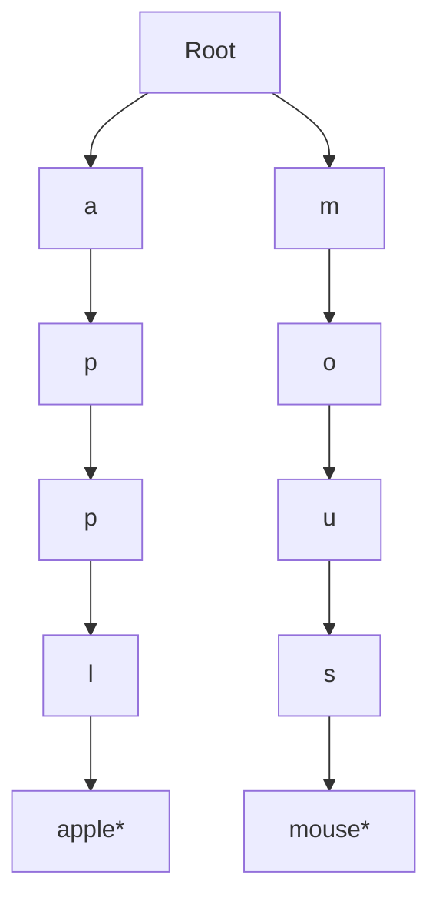

# Data Structure & Algorithms - Answers

## Question 1: Autocomplete Data Structure

📋 **[Back to Question](../sse-topics.md#data-structure--algorithms)** | **Topic:** Data structures and algorithms

**Detailed Answer:**

#### Trie (Prefix Tree) Approach



**Implementation:**

```java
class TrieNode {
    Map<Character, TrieNode> children = new HashMap<>();
    boolean isEndOfWord = false;
    String product = null;
    int frequency = 0;  // For ranking
}

class AutocompleteSystem {
    private TrieNode root;
    private static final int MAX_SUGGESTIONS = 10;
    
    public AutocompleteSystem() {
        this.root = new TrieNode();
    }
    
    // Build trie from products
    public void buildTrie(List<Product> products) {
        for (Product product : products) {
            insert(product.getName().toLowerCase(), product.getSearchCount());
        }
    }
    
    private void insert(String word, int frequency) {
        TrieNode current = root;
        
        for (char ch : word.toCharArray()) {
            current.children.putIfAbsent(ch, new TrieNode());
            current = current.children.get(ch);
        }
        
        current.isEndOfWord = true;
        current.product = word;
        current.frequency = frequency;
    }
    
    // Get autocomplete suggestions
    public List<String> getSuggestions(String prefix) {
        TrieNode current = root;
        
        // Navigate to prefix
        for (char ch : prefix.toLowerCase().toCharArray()) {
            current = current.children.get(ch);
            if (current == null) {
                return Collections.emptyList();
            }
        }
        
        // Find all words with this prefix
        List<ScoredProduct> results = new ArrayList<>();
        dfs(current, prefix, results);
        
        // Sort by frequency and return top 10
        return results.stream()
            .sorted((a, b) -> Integer.compare(b.frequency, a.frequency))
            .limit(MAX_SUGGESTIONS)
            .map(sp -> sp.product)
            .collect(Collectors.toList());
    }
    
    private void dfs(TrieNode node, String prefix, List<ScoredProduct> results) {
        if (node.isEndOfWord) {
            results.add(new ScoredProduct(node.product, node.frequency));
        }
        
        for (Map.Entry<Character, TrieNode> entry : node.children.entrySet()) {
            dfs(entry.getValue(), prefix + entry.getKey(), results);
        }
    }
    
    static class ScoredProduct {
        String product;
        int frequency;
        
        ScoredProduct(String product, int frequency) {
            this.product = product;
            this.frequency = frequency;
        }
    }
}
```

**Usage:**

```java
AutocompleteSystem autocomplete = new AutocompleteSystem();

// Build from database
List<Product> products = productRepository.findAll();
autocomplete.buildTrie(products);

// Get suggestions
List<String> suggestions = autocomplete.getSuggestions("app");
// Returns: ["apple iphone", "apple watch", "apple airpods", ...]
```

#### Optimization with Caching

```java
@Service
public class AutocompleteService {
    
    private final AutocompleteSystem trie;
    private final Cache<String, List<String>> cache;
    
    public AutocompleteService() {
        this.trie = new AutocompleteSystem();
        this.cache = Caffeine.newBuilder()
            .maximumSize(10_000)
            .expireAfterWrite(1, TimeUnit.HOURS)
            .build();
    }
    
    public List<String> getSuggestions(String prefix) {
        // Check cache first
        List<String> cached = cache.getIfPresent(prefix.toLowerCase());
        if (cached != null) {
            return cached;
        }
        
        // Compute and cache
        List<String> results = trie.getSuggestions(prefix);
        cache.put(prefix.toLowerCase(), results);
        return results;
    }
    
    // Rebuild trie periodically (background job)
    @Scheduled(fixedRate = 3600000)  // Every hour
    public void rebuildTrie() {
        List<Product> products = productRepository.findAll();
        trie.buildTrie(products);
        cache.invalidateAll();
    }
}
```

#### Alternative: Elasticsearch Approach

```java
// For millions of products, use Elasticsearch
@Service
public class ElasticsearchAutocomplete {
    
    private final ElasticsearchClient client;
    
    public List<String> getSuggestions(String prefix) {
        SearchResponse<Product> response = client.search(s -> s
            .index("products")
            .suggest(su -> su
                .suggesters("product-suggest", fs -> fs
                    .prefix(prefix)
                    .completion(c -> c
                        .field("name_suggest")
                        .size(10)
                        .skipDuplicates(true)
                    )
                )
            ),
            Product.class
        );
        
        return response.suggest().get("product-suggest").stream()
            .flatMap(suggestion -> suggestion.completion().options().stream())
            .map(option -> option.text())
            .collect(Collectors.toList());
    }
}
```

```json
// Elasticsearch mapping
{
  "mappings": {
    "properties": {
      "name": { "type": "text" },
      "name_suggest": {
        "type": "completion",
        "analyzer": "simple",
        "preserve_separators": true,
        "preserve_position_increments": true,
        "max_input_length": 50
      },
      "popularity": { "type": "integer" }
    }
  }
}
```

#### Trade-offs

| Approach | Memory | Speed | Scalability | Ranking |
|----------|--------|-------|-------------|---------|
| **Trie (In-Memory)** | High (O(n*m)) | Very Fast (O(p+k)) | Limited | Simple |
| **Trie + Cache** | High | Very Fast | Limited | Good |
| **Elasticsearch** | Medium | Fast | Excellent | Advanced |
| **Database LIKE** | Low | Slow | Poor | Limited |

**Best Practice:** 
- **< 100K products:** In-memory Trie with cache
- **> 100K products:** Elasticsearch with completion suggester
- **Hybrid:** Hot products in Trie, full catalog in Elasticsearch

---

## Question 2: Processing Million Records

📋 **[Back to Question](../sse-topics.md#data-structure--algorithms)** | **Topic:** Algorithmic thinking and scalability

**Detailed Answer:**

#### Approach 1: Batch Processing

```java
@Service
public class BatchProcessor {
    
    private static final int BATCH_SIZE = 1000;
    
    public void processAllRecords() {
        long totalRecords = recordRepository.count();
        int totalBatches = (int) Math.ceil((double) totalRecords / BATCH_SIZE);
        
        for (int i = 0; i < totalBatches; i++) {
            List<Record> batch = recordRepository.findAll(
                PageRequest.of(i, BATCH_SIZE)
            ).getContent();
            
            processBatch(batch);
            
            // Optional: Track progress
            log.info("Processed batch {}/{}", i + 1, totalBatches);
        }
    }
    
    private void processBatch(List<Record> records) {
        // Transform
        List<ProcessedRecord> processed = records.stream()
            .map(this::transform)
            .collect(Collectors.toList());
        
        // Bulk insert
        processedRepository.saveAll(processed);
    }
}
```

**Pros:** Simple, predictable memory usage
**Cons:** Slower, single-threaded

#### Approach 2: Parallel Processing

```java
@Service
public class ParallelBatchProcessor {
    
    private final ExecutorService executor;
    private static final int BATCH_SIZE = 1000;
    private static final int THREAD_POOL_SIZE = 10;
    
    public ParallelBatchProcessor() {
        this.executor = Executors.newFixedThreadPool(THREAD_POOL_SIZE);
    }
    
    public void processAllRecords() throws InterruptedException {
        long totalRecords = recordRepository.count();
        int totalBatches = (int) Math.ceil((double) totalRecords / BATCH_SIZE);
        
        List<CompletableFuture<Void>> futures = new ArrayList<>();
        
        for (int i = 0; i < totalBatches; i++) {
            final int batchNum = i;
            
            CompletableFuture<Void> future = CompletableFuture.runAsync(() -> {
                List<Record> batch = recordRepository.findAll(
                    PageRequest.of(batchNum, BATCH_SIZE)
                ).getContent();
                
                processBatch(batch);
            }, executor);
            
            futures.add(future);
        }
        
        // Wait for all batches
        CompletableFuture.allOf(futures.toArray(new CompletableFuture[0])).join();
    }
}
```

**Pros:** Much faster (10x speedup with 10 threads)
**Cons:** Higher memory, potential database connection exhaustion

#### Approach 3: Streaming (Memory Efficient)

```java
@Service
public class StreamProcessor {
    
    @Transactional(readOnly = true)
    public void processAllRecords() {
        // Stream prevents loading all records into memory
        try (Stream<Record> stream = recordRepository.streamAll()) {
            stream
                .map(this::transform)
                .forEach(this::save);
        }
    }
}

// Repository
public interface RecordRepository extends JpaRepository<Record, Long> {
    
    @QueryHints(value = @QueryHint(name = HINT_FETCH_SIZE, value = "1000"))
    @Query("SELECT r FROM Record r")
    Stream<Record> streamAll();
}
```

**Pros:** Constant memory usage
**Cons:** Slower than parallel, must keep transaction open

#### Approach 4: Message Queue (Asynchronous)

```java
// Producer
@Service
public class RecordQueueProducer {
    
    private final KafkaTemplate<String, Record> kafka;
    private static final String TOPIC = "records-to-process";
    
    public void enqueueAllRecords() {
        long totalRecords = recordRepository.count();
        int batchSize = 1000;
        
        for (int i = 0; i < Math.ceil((double) totalRecords / batchSize); i++) {
            List<Record> batch = recordRepository.findAll(
                PageRequest.of(i, batchSize)
            ).getContent();
            
            for (Record record : batch) {
                kafka.send(TOPIC, record);
            }
        }
    }
}

// Consumer (can run on multiple instances)
@Service
public class RecordQueueConsumer {
    
    @KafkaListener(topics = "records-to-process", concurrency = "10")
    public void consumeRecord(Record record) {
        ProcessedRecord processed = transform(record);
        processedRepository.save(processed);
    }
}
```

**Pros:** Decoupled, scalable, fault-tolerant, can resume
**Cons:** More complex, eventual processing

#### Approach 5: Database Bulk Operations

```sql
-- PostgreSQL: Process in database (fastest for simple transforms)
INSERT INTO processed_records (id, data, processed_at)
SELECT 
    id,
    UPPER(data),  -- Simple transformation
    NOW()
FROM records
WHERE status = 'pending';

-- For complex logic, use stored procedure
CREATE OR REPLACE FUNCTION process_records()
RETURNS void AS $$
DECLARE
    rec RECORD;
BEGIN
    FOR rec IN SELECT * FROM records WHERE status = 'pending' LOOP
        -- Complex processing logic
        INSERT INTO processed_records VALUES (
            rec.id,
            perform_complex_transform(rec.data),
            NOW()
        );
        
        UPDATE records SET status = 'processed' WHERE id = rec.id;
    END LOOP;
END;
$$ LANGUAGE plpgsql;

SELECT process_records();
```

**Pros:** Fastest for DB-centric operations, no network overhead
**Cons:** Limited to SQL logic, blocks other operations

#### Comparison Table

| Approach | Speed | Memory | Scalability | Fault Tolerance | Complexity |
|----------|-------|--------|-------------|-----------------|------------|
| **Sequential Batch** | Slow | Low | Poor | Low | Low |
| **Parallel Batch** | Fast | High | Good | Medium | Medium |
| **Streaming** | Medium | Very Low | Medium | Low | Low |
| **Message Queue** | Fast | Low | Excellent | High | High |
| **DB Bulk Ops** | Very Fast | None | Poor | Low | Medium |

#### Best Practice: Hybrid Approach

```java
@Service
public class OptimalRecordProcessor {
    
    private final KafkaTemplate<String, RecordBatch> kafka;
    
    // Step 1: Enqueue batches (fast, non-blocking)
    public void startProcessing() {
        CompletableFuture.runAsync(() -> {
            long totalRecords = recordRepository.count();
            int batchSize = 5000;  // Larger batches for efficiency
            
            for (int i = 0; i < Math.ceil((double) totalRecords / batchSize); i++) {
                List<Record> batch = recordRepository.findAll(
                    PageRequest.of(i, batchSize)
                ).getContent();
                
                kafka.send("record-batches", new RecordBatch(i, batch));
            }
        });
    }
    
    // Step 2: Process batches in parallel (multiple consumers)
    @KafkaListener(topics = "record-batches", concurrency = "5")
    public void processBatch(RecordBatch batch) {
        try {
            List<ProcessedRecord> processed = batch.getRecords().parallelStream()
                .map(this::transform)
                .collect(Collectors.toList());
            
            // Bulk insert
            processedRepository.saveAll(processed);
            
            log.info("Processed batch {} ({} records)", 
                batch.getBatchId(), batch.getRecords().size());
                
        } catch (Exception e) {
            log.error("Failed to process batch {}", batch.getBatchId(), e);
            // Send to DLQ for retry
            kafka.send("record-batches-dlq", batch);
        }
    }
}
```

**This hybrid approach provides:**
- ✅ Fast processing (parallel + batching)
- ✅ Low memory (streaming batches)
- ✅ Scalable (add more consumers)
- ✅ Fault-tolerant (retry failed batches)
- ✅ Progress tracking (batch IDs)

---

