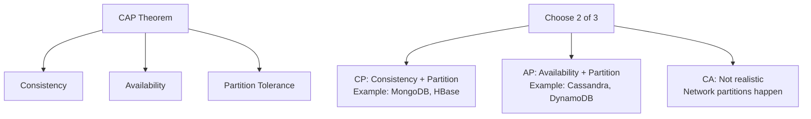
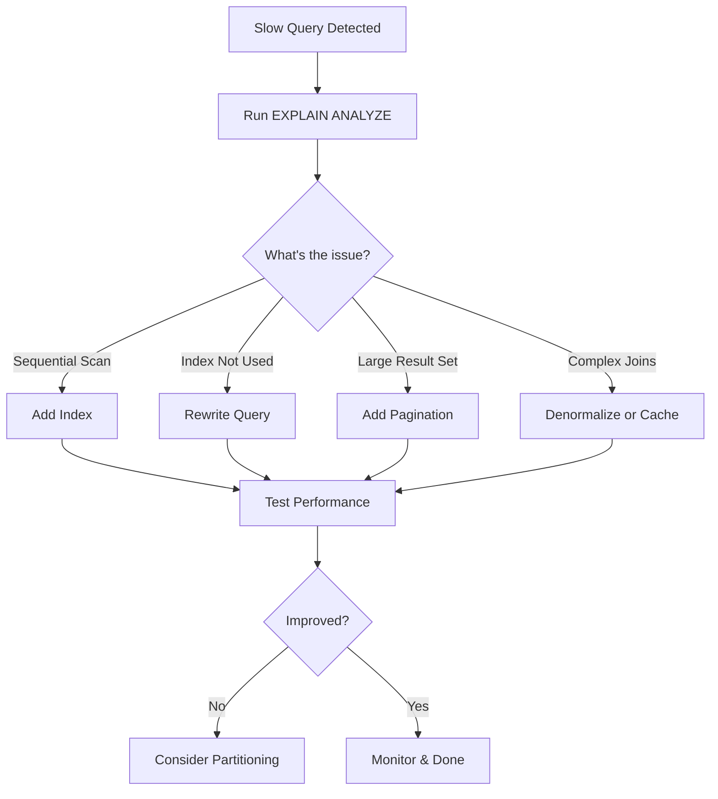
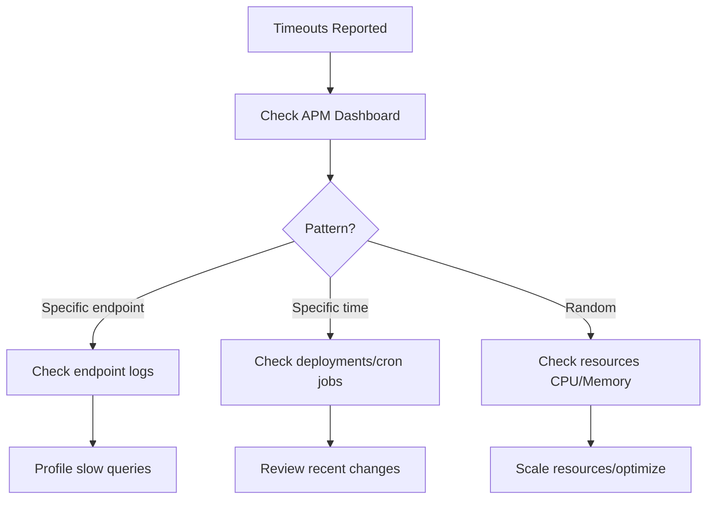
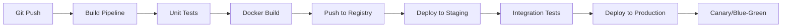
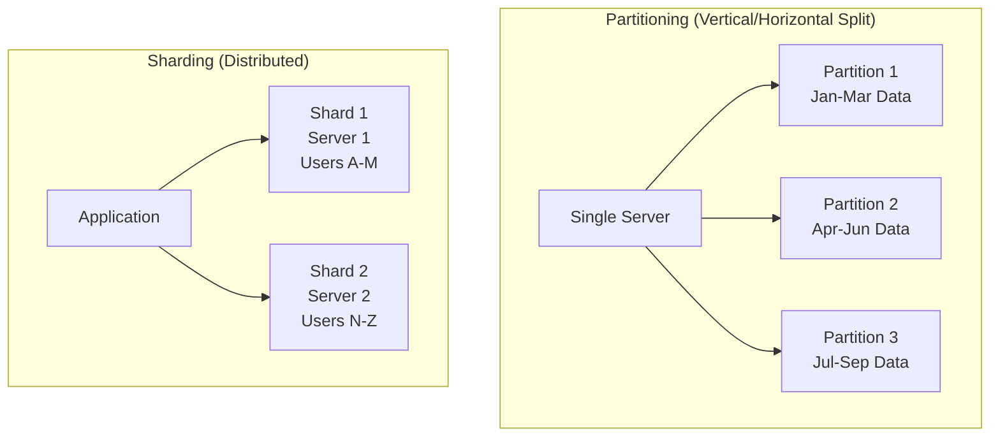

# Database Knowledge - Answers

## Question 1: CAP Theorem

📋 **[Back to Question](../sse-topics.md#database-knowledge)** | **Topic:** Distributed systems fundamentals



**Real Example:**
- **E-commerce cart:** AP (availability matters, eventual consistency OK)
- **Bank transactions:** CP (consistency critical, can deny requests)

---

## Question 2: Zero-Downtime Schema Migration

📋 **[Back to Question](../sse-topics.md#database-knowledge)** | **Topic:** Database operations and deployment

```sql
-- Phase 1: Add new column (nullable)
ALTER TABLE users ADD COLUMN phone VARCHAR(20);

-- Phase 2: Deploy code that writes to both columns
-- Application handles both old and new data

-- Phase 3: Backfill existing data
UPDATE users SET phone = legacy_phone WHERE phone IS NULL;

-- Phase 4: Deploy code that only uses new column
-- Stop writing to old column

-- Phase 5: Remove old column
ALTER TABLE users DROP COLUMN legacy_phone;
```

**Tools:** Flyway, Liquibase for versioned migrations

---

## Question 3: Query Optimization for Large Tables

📋 **[Back to Question](../sse-topics.md#database-knowledge)** | **Topic:** Database performance tuning

**Detailed Answer:**

#### Systematic Optimization Process



#### Step 1: Analyze with EXPLAIN

```sql
-- PostgreSQL example with 100M row table
EXPLAIN (ANALYZE, BUFFERS, VERBOSE)
SELECT u.name, COUNT(o.id) as order_count
FROM users u
JOIN orders o ON u.id = o.user_id
WHERE o.created_at > '2025-01-01'
  AND o.status = 'completed'
GROUP BY u.id, u.name
ORDER BY order_count DESC
LIMIT 10;

-- Look for:
-- 1. Seq Scan (bad) vs Index Scan (good)
-- 2. Execution time and planning time
-- 3. Rows estimated vs actual
-- 4. Buffer usage (cache hits vs reads)
```

**Example Output Analysis:**
```
Limit  (cost=1250000.00..1250000.15 rows=10)
  ->  Sort  (cost=1250000.00..1312500.00 rows=25000000)
        Sort Key: (count(o.id)) DESC
        ->  HashAggregate  (cost=1000000.00..1125000.00 rows=5000000)
              ->  Hash Join  (cost=50000.00..875000.00 rows=25000000)
                    Hash Cond: (o.user_id = u.id)
                    ->  Seq Scan on orders o  (cost=0.00..750000.00 rows=25000000)
                          Filter: ((created_at > '2025-01-01') AND (status = 'completed'))
```

**Problems identified:**
- Sequential scan on orders table (25M rows!)
- No index on `created_at` or `status`
- Hash aggregate materializing 5M rows

#### Step 2: Add Appropriate Indexes

```sql
-- Problem: Sequential scan on orders
-- Solution: Composite index

-- ❌ Less optimal: Single column indexes
CREATE INDEX idx_orders_created_at ON orders(created_at);
CREATE INDEX idx_orders_status ON orders(status);

-- ✅ Better: Composite index (order matters!)
CREATE INDEX idx_orders_status_created_at ON orders(status, created_at);
-- Why? status has low cardinality (5 values), filters out most rows first

-- Even better: Include user_id to avoid table lookup
CREATE INDEX idx_orders_status_created_at_user ON orders(status, created_at, user_id);

-- Check index usage
EXPLAIN (ANALYZE) 
SELECT * FROM orders 
WHERE status = 'completed' 
  AND created_at > '2025-01-01';

-- Should show: "Index Scan using idx_orders_status_created_at"
```

#### Step 3: Rewrite Query

```sql
-- ❌ SLOW: GROUP BY with ORDER BY (sorts all groups)
SELECT u.name, COUNT(o.id) as order_count
FROM users u
JOIN orders o ON u.id = o.user_id
WHERE o.created_at > '2025-01-01'
  AND o.status = 'completed'
GROUP BY u.id, u.name
ORDER BY order_count DESC
LIMIT 10;

-- ✅ FASTER: Use window function
SELECT DISTINCT ON (u.id) 
       u.name,
       COUNT(o.id) OVER (PARTITION BY u.id) as order_count
FROM users u
JOIN orders o ON u.id = o.user_id
WHERE o.created_at > '2025-01-01'
  AND o.status = 'completed'
ORDER BY order_count DESC
LIMIT 10;

-- ✅ FASTEST: Pre-aggregate if query runs frequently
-- Create materialized view (refreshed periodically)
CREATE MATERIALIZED VIEW user_order_counts AS
SELECT u.id, u.name, COUNT(o.id) as order_count
FROM users u
JOIN orders o ON u.id = o.user_id
WHERE o.created_at > '2025-01-01'
  AND o.status = 'completed'
GROUP BY u.id, u.name;

CREATE INDEX ON user_order_counts(order_count DESC);

-- Fast query
SELECT name, order_count 
FROM user_order_counts 
ORDER BY order_count DESC 
LIMIT 10;

-- Refresh periodically (cron job)
REFRESH MATERIALIZED VIEW CONCURRENTLY user_order_counts;
```

#### Step 4: Consider Partitioning

```sql
-- Partition large table by date
CREATE TABLE orders_partitioned (
    id BIGINT,
    user_id BIGINT,
    status VARCHAR(20),
    created_at TIMESTAMP,
    amount DECIMAL(10,2)
) PARTITION BY RANGE (created_at);

-- Create partitions
CREATE TABLE orders_2024_q4 PARTITION OF orders_partitioned
    FOR VALUES FROM ('2024-10-01') TO ('2025-01-01');

CREATE TABLE orders_2025_q1 PARTITION OF orders_partitioned
    FOR VALUES FROM ('2025-01-01') TO ('2025-04-01');

CREATE TABLE orders_2025_q2 PARTITION OF orders_partitioned
    FOR VALUES FROM ('2025-04-01') TO ('2025-07-01');

-- Indexes on each partition
CREATE INDEX ON orders_2025_q1(status, created_at);

-- Query only scans relevant partition
SELECT * FROM orders_partitioned 
WHERE created_at > '2025-01-01' 
  AND status = 'completed';
-- Scans only orders_2025_q1 and orders_2025_q2
```

#### Step 5: Denormalization (If Needed)

```sql
-- Problem: Expensive JOIN for user name
SELECT u.name, o.id, o.amount
FROM orders o
JOIN users u ON o.user_id = u.id
WHERE o.created_at > '2025-01-01';

-- Solution: Denormalize (add user_name to orders)
ALTER TABLE orders ADD COLUMN user_name VARCHAR(100);

-- Populate existing data
UPDATE orders o
SET user_name = u.name
FROM users u
WHERE o.user_id = u.id;

-- Update trigger to keep in sync
CREATE OR REPLACE FUNCTION update_order_user_name()
RETURNS TRIGGER AS $$
BEGIN
    IF NEW.user_id IS NOT NULL THEN
        SELECT name INTO NEW.user_name 
        FROM users WHERE id = NEW.user_id;
    END IF;
    RETURN NEW;
END;
$$ LANGUAGE plpgsql;

CREATE TRIGGER order_user_name_trigger
BEFORE INSERT OR UPDATE ON orders
FOR EACH ROW
EXECUTE FUNCTION update_order_user_name();

-- Fast query without JOIN
SELECT user_name, id, amount
FROM orders
WHERE created_at > '2025-01-01';
```

#### Step 6: Query-Specific Optimizations

```sql
-- Use covering index (all columns in index)
CREATE INDEX idx_orders_covering ON orders(status, created_at)
INCLUDE (user_id, amount);
-- Index-only scan, no table access needed

-- Use LIMIT wisely
-- ❌ SLOW: OFFSET 1000000 (scans 1M rows)
SELECT * FROM orders ORDER BY created_at LIMIT 100 OFFSET 1000000;

-- ✅ FAST: Keyset pagination
SELECT * FROM orders 
WHERE created_at > '2025-01-14 10:00:00'
ORDER BY created_at 
LIMIT 100;

-- Avoid SELECT *
-- ❌ SLOW: Fetches all columns (including large TEXT fields)
SELECT * FROM orders WHERE id = 12345;

-- ✅ FAST: Only needed columns
SELECT id, user_id, status, amount FROM orders WHERE id = 12345;
```

#### Monitoring Tools

```sql
-- PostgreSQL: Check slow queries
SELECT query, calls, total_time, mean_time
FROM pg_stat_statements
ORDER BY mean_time DESC
LIMIT 10;

-- Check index usage
SELECT schemaname, tablename, indexname, idx_scan, idx_tup_read
FROM pg_stat_user_indexes
WHERE idx_scan = 0  -- Unused indexes
ORDER BY pg_relation_size(indexrelid) DESC;

-- Check table bloat
SELECT schemaname, tablename, 
       pg_size_pretty(pg_total_relation_size(schemaname||'.'||tablename))
FROM pg_tables
WHERE schemaname = 'public'
ORDER BY pg_total_relation_size(schemaname||'.'||tablename) DESC;
```

#### Summary Checklist

- [ ] Run EXPLAIN ANALYZE on slow query
- [ ] Check for sequential scans
- [ ] Add indexes on WHERE/JOIN columns
- [ ] Use composite indexes (right column order)
- [ ] Consider covering indexes
- [ ] Rewrite query if needed
- [ ] Add pagination
- [ ] Consider partitioning for very large tables
- [ ] Denormalize if JOIN overhead is high
- [ ] Monitor index usage and remove unused
- [ ] Regular VACUUM and ANALYZE

---

## Question 4: Database Normalization vs Denormalization

📋 **[Back to Question](../sse-topics.md#database-knowledge)** | **Topic:** Database design principles

**Detailed Answer:**

#### Database Normalization

Normalization is organizing data to reduce redundancy and improve data integrity.

**Normal Forms:**

**1NF (First Normal Form)**
```sql
-- ❌ Violates 1NF: Multi-valued attribute
CREATE TABLE orders (
    id INT,
    customer_name VARCHAR(100),
    products VARCHAR(500)  -- "Apple,Banana,Orange"
);

-- ✅ 1NF: Atomic values
CREATE TABLE orders (
    id INT PRIMARY KEY,
    customer_name VARCHAR(100)
);

CREATE TABLE order_items (
    order_id INT REFERENCES orders(id),
    product_name VARCHAR(100)
);
```

**2NF (Second Normal Form)**
```sql
-- ❌ Violates 2NF: Partial dependency
CREATE TABLE order_items (
    order_id INT,
    product_id INT,
    product_name VARCHAR(100),  -- Depends only on product_id
    quantity INT,
    PRIMARY KEY (order_id, product_id)
);

-- ✅ 2NF: No partial dependencies
CREATE TABLE order_items (
    order_id INT,
    product_id INT,
    quantity INT,
    PRIMARY KEY (order_id, product_id),
    FOREIGN KEY (product_id) REFERENCES products(id)
);

CREATE TABLE products (
    id INT PRIMARY KEY,
    name VARCHAR(100)
);
```

**3NF (Third Normal Form)**
```sql
-- ❌ Violates 3NF: Transitive dependency
CREATE TABLE employees (
    id INT PRIMARY KEY,
    name VARCHAR(100),
    department_id INT,
    department_name VARCHAR(100),  -- Depends on department_id
    department_location VARCHAR(100)  -- Depends on department_id
);

-- ✅ 3NF: No transitive dependencies
CREATE TABLE employees (
    id INT PRIMARY KEY,
    name VARCHAR(100),
    department_id INT,
    FOREIGN KEY (department_id) REFERENCES departments(id)
);

CREATE TABLE departments (
    id INT PRIMARY KEY,
    name VARCHAR(100),
    location VARCHAR(100)
);
```

#### When to Denormalize

**Scenario 1: Reduce JOINs for Read-Heavy Workload**

```sql
-- Normalized (3NF)
SELECT o.id, o.order_date, u.name, u.email, p.name, oi.quantity
FROM orders o
JOIN users u ON o.user_id = u.id
JOIN order_items oi ON o.id = oi.order_id
JOIN products p ON oi.product_id = p.id
WHERE o.id = 12345;
-- 3 JOINs = slower

-- Denormalized
ALTER TABLE orders ADD COLUMN user_name VARCHAR(100);
ALTER TABLE orders ADD COLUMN user_email VARCHAR(100);
ALTER TABLE order_items ADD COLUMN product_name VARCHAR(100);

SELECT o.id, o.order_date, o.user_name, o.user_email, 
       oi.product_name, oi.quantity
FROM orders o
JOIN order_items oi ON o.id = oi.order_id
WHERE o.id = 12345;
-- 1 JOIN = faster

-- Trade-off: Must update user_name in orders if user changes name
```

**Scenario 2: Aggregated Data for Analytics**

```sql
-- Normalized: Calculate on-the-fly
SELECT u.id, u.name, 
       COUNT(o.id) as total_orders,
       SUM(o.amount) as total_spent
FROM users u
LEFT JOIN orders o ON u.id = o.user_id
GROUP BY u.id, u.name;
-- Expensive for 100M orders

-- Denormalized: Pre-computed columns
ALTER TABLE users ADD COLUMN total_orders INT DEFAULT 0;
ALTER TABLE users ADD COLUMN total_spent DECIMAL(10,2) DEFAULT 0;

-- Update via trigger
CREATE TRIGGER update_user_stats
AFTER INSERT ON orders
FOR EACH ROW
BEGIN
    UPDATE users 
    SET total_orders = total_orders + 1,
        total_spent = total_spent + NEW.amount
    WHERE id = NEW.user_id;
END;

-- Fast query
SELECT id, name, total_orders, total_spent
FROM users
WHERE total_spent > 1000;
-- No aggregation needed
```

**Scenario 3: Historical Data Snapshots**

```sql
-- Problem: Product price changes over time
-- Can't calculate historical order totals correctly

-- Normalized (wrong approach)
CREATE TABLE orders (
    id INT,
    product_id INT,
    quantity INT,
    -- Missing: price at time of order
    FOREIGN KEY (product_id) REFERENCES products(id)
);

CREATE TABLE products (
    id INT,
    name VARCHAR(100),
    price DECIMAL(10,2)  -- Current price only
);

-- Denormalized (correct approach)
CREATE TABLE orders (
    id INT,
    product_id INT,
    product_name VARCHAR(100),  -- Name at time of order
    product_price DECIMAL(10,2),  -- Price at time of order
    quantity INT,
    total_amount DECIMAL(10,2)  -- Calculated at order time
);
-- Now historical orders remain accurate even if product changes
```

**Scenario 4: Hierarchical Data Access**

```sql
-- Normalized: Employee hierarchy
CREATE TABLE employees (
    id INT PRIMARY KEY,
    name VARCHAR(100),
    manager_id INT REFERENCES employees(id)
);

-- Query: Get employee's full reporting chain
WITH RECURSIVE reporting_chain AS (
    SELECT id, name, manager_id, 1 as level
    FROM employees WHERE id = 12345
    UNION ALL
    SELECT e.id, e.name, e.manager_id, rc.level + 1
    FROM employees e
    JOIN reporting_chain rc ON e.id = rc.manager_id
)
SELECT * FROM reporting_chain;
-- Recursive query = slow

-- Denormalized: Store path
CREATE TABLE employees (
    id INT PRIMARY KEY,
    name VARCHAR(100),
    manager_id INT,
    manager_path VARCHAR(500)  -- "1,5,12,45" (all manager IDs)
);

-- Fast query
SELECT * FROM employees 
WHERE manager_path LIKE '%,12,%'  -- All reports under manager 12
-- Simple string search = fast
```

#### Decision Matrix

| Factor | Normalize | Denormalize |
|--------|-----------|-------------|
| **Data Integrity** | ✅ High | ❌ Lower (must sync) |
| **Storage Space** | ✅ Efficient | ❌ Redundant |
| **Write Performance** | ✅ Fast (fewer updates) | ❌ Slower (update multiple places) |
| **Read Performance** | ❌ Slower (JOINs) | ✅ Fast (no JOINs) |
| **Query Complexity** | ❌ Complex JOINs | ✅ Simple queries |
| **Schema Changes** | ✅ Easier | ❌ Harder |

#### Best Practices

**1. Start Normalized, Denormalize Strategically**
```sql
-- Begin with proper normalization
-- Denormalize only where proven necessary by profiling
```

**2. Use Views for Denormalized Reads**
```sql
-- Keep normalized tables
-- Create materialized views for denormalized reads
CREATE MATERIALIZED VIEW user_order_summary AS
SELECT u.id, u.name, u.email,
       COUNT(o.id) as order_count,
       SUM(o.amount) as total_spent
FROM users u
LEFT JOIN orders o ON u.id = o.user_id
GROUP BY u.id, u.name, u.email;

-- Refresh periodically
REFRESH MATERIALIZED VIEW CONCURRENTLY user_order_summary;
```

**3. Maintain Consistency with Triggers**
```sql
-- If denormalizing, use triggers/events to keep data in sync
CREATE TRIGGER sync_denormalized_data
AFTER UPDATE ON users
FOR EACH ROW
BEGIN
    UPDATE orders 
    SET user_name = NEW.name 
    WHERE user_id = NEW.id;
END;
```

**4. Document Denormalization**
```sql
-- Comment why data is denormalized
COMMENT ON COLUMN orders.user_name IS 
'Denormalized from users.name for performance. 
Updated via trigger sync_user_name_trigger.';
```

---

## Problem Solving & Code Quality - Answers

### Question 1: Production Debugging - Intermittent Timeouts

**Investigation Flow:**


**Action Steps:**
1. Correlate with deployments
2. Check database slow query logs
3. Review APM traces
4. Examine external dependency latencies
5. Check connection pool exhaustion
6. Review thread dumps for deadlocks

---

### Question 2: Code Quality Practices

**Team Practices:**
```java
// 1. Code Reviews
- Mandatory for all PRs
- Check for patterns, not syntax
- Focus on maintainability

// 2. Automated Quality Gates
- SonarQube: Code smells, security vulnerabilities
- Test coverage: Minimum 80%
- Linting: Checkstyle, PMD

// 3. Pair Programming
- Complex features
- Knowledge sharing
- Reduce defects

// 4. Regular Refactoring
- Boy Scout Rule: Leave code better
- Dedicate time for tech debt

// 5. Documentation
- README for each service
- Architecture Decision Records (ADRs)
- API documentation (OpenAPI/Swagger)
```

---

## Cloud Services & DevOps - Answers

### Question 1: CI/CD for Microservices



**Best Practices:**
- Monorepo or polyrepo with shared pipeline templates
- Service-specific vs shared integration tests
- Automated rollback on failure
- Feature flags for gradual rollout

---

### Question 2: Kubernetes Secrets Management

**Options:**
```yaml
# 1. Native Kubernetes Secrets (Base64 encoded - not secure!)
apiVersion: v1
kind: Secret
metadata:
  name: db-secret
data:
  password: cGFzc3dvcmQxMjM= # base64 encoded

# 2. External Secrets Operator + Vault
apiVersion: external-secrets.io/v1beta1
kind: ExternalSecret
metadata:
  name: db-secret
spec:
  secretStoreRef:
    name: vault-backend
  target:
    name: db-secret
  data:
  - secretKey: password
    remoteRef:
      key: database/password
```

**Best Practice:** Use external secret managers (Vault, AWS Secrets Manager) + RBAC + encryption at rest.

---

## Question 5: Sharding vs Partitioning in PostgreSQL

📋 **[Back to Question](../sse-topics.md#database-knowledge)** | **Topic:** Database scaling strategies

**Detailed Answer:**

#### Key Difference



**Partitioning:**
- Logical division of data within a single database server
- Improves query performance and maintenance
- Data still on one server

**Sharding:**
- Physical distribution of data across multiple database servers
- Horizontal scaling for throughput and storage
- More complex to manage

#### PostgreSQL Partitioning

**Declarative Partitioning (PostgreSQL 10+):**

```sql
-- Create partitioned table
CREATE TABLE orders (
    id BIGSERIAL,
    user_id BIGINT NOT NULL,
    order_date DATE NOT NULL,
    amount DECIMAL(10,2),
    status VARCHAR(20)
) PARTITION BY RANGE (order_date);

-- Create partitions
CREATE TABLE orders_2024_q1 PARTITION OF orders
    FOR VALUES FROM ('2024-01-01') TO ('2024-04-01');

CREATE TABLE orders_2024_q2 PARTITION OF orders
    FOR VALUES FROM ('2024-04-01') TO ('2024-07-01');

CREATE TABLE orders_2024_q3 PARTITION OF orders
    FOR VALUES FROM ('2024-07-01') TO ('2024-10-01');

CREATE TABLE orders_2024_q4 PARTITION OF orders
    FOR VALUES FROM ('2024-10-01') TO ('2025-01-01');

-- Create indexes on each partition
CREATE INDEX ON orders_2024_q1(user_id);
CREATE INDEX ON orders_2024_q2(user_id);
CREATE INDEX ON orders_2024_q3(user_id);
CREATE INDEX ON orders_2024_q4(user_id);

-- Query automatically routes to correct partition
SELECT * FROM orders 
WHERE order_date BETWEEN '2024-04-01' AND '2024-06-30';
-- Only scans orders_2024_q2

-- Insert automatically goes to correct partition
INSERT INTO orders (user_id, order_date, amount, status)
VALUES (123, '2024-05-15', 99.99, 'pending');
-- Goes to orders_2024_q2
```

**List Partitioning (by status):**

```sql
CREATE TABLE logs (
    id BIGSERIAL,
    level VARCHAR(20),
    message TEXT,
    created_at TIMESTAMP
) PARTITION BY LIST (level);

CREATE TABLE logs_error PARTITION OF logs
    FOR VALUES IN ('ERROR', 'CRITICAL');

CREATE TABLE logs_info PARTITION OF logs
    FOR VALUES IN ('INFO', 'DEBUG');

CREATE TABLE logs_warning PARTITION OF logs
    FOR VALUES IN ('WARNING');
```

**Hash Partitioning (distribute evenly):**

```sql
CREATE TABLE users (
    id BIGSERIAL,
    email VARCHAR(255),
    name VARCHAR(100)
) PARTITION BY HASH (id);

-- Create 4 hash partitions
CREATE TABLE users_p0 PARTITION OF users
    FOR VALUES WITH (MODULUS 4, REMAINDER 0);

CREATE TABLE users_p1 PARTITION OF users
    FOR VALUES WITH (MODULUS 4, REMAINDER 1);

CREATE TABLE users_p2 PARTITION OF users
    FOR VALUES WITH (MODULUS 4, REMAINDER 2);

CREATE TABLE users_p3 PARTITION OF users
    FOR VALUES WITH (MODULUS 4, REMAINDER 3);
```

#### PostgreSQL Sharding Implementation

**Option 1: Foreign Data Wrappers (postgres_fdw)**

```sql
-- On Shard Coordinator (Main Server)
CREATE EXTENSION postgres_fdw;

-- Define remote servers
CREATE SERVER shard1
    FOREIGN DATA WRAPPER postgres_fdw
    OPTIONS (host 'shard1.example.com', port '5432', dbname 'shard1_db');

CREATE SERVER shard2
    FOREIGN DATA WRAPPER postgres_fdw
    OPTIONS (host 'shard2.example.com', port '5432', dbname 'shard2_db');

-- Create user mappings
CREATE USER MAPPING FOR current_user
    SERVER shard1
    OPTIONS (user 'postgres', password 'secret');

CREATE USER MAPPING FOR current_user
    SERVER shard2
    OPTIONS (user 'postgres', password 'secret');

-- Import foreign schemas
IMPORT FOREIGN SCHEMA public
    FROM SERVER shard1 INTO shard1_schema;

IMPORT FOREIGN SCHEMA public
    FROM SERVER shard2 INTO shard2_schema;

-- Create partitioned table with foreign table partitions
CREATE TABLE users (
    id BIGINT,
    email VARCHAR(255),
    name VARCHAR(100)
) PARTITION BY RANGE (id);

-- Partition 1: Local users (id 1-1M)
CREATE TABLE users_local PARTITION OF users
    FOR VALUES FROM (1) TO (1000000);

-- Partition 2: Foreign shard 1 (id 1M-2M)
CREATE FOREIGN TABLE users_shard1 PARTITION OF users
    FOR VALUES FROM (1000000) TO (2000000)
    SERVER shard1;

-- Partition 3: Foreign shard 2 (id 2M-3M)
CREATE FOREIGN TABLE users_shard2 PARTITION OF users
    FOR VALUES FROM (2000000) TO (3000000)
    SERVER shard2;

-- Query works transparently across shards
SELECT * FROM users WHERE id = 1500000;
-- Automatically queries shard1
```

**Option 2: Application-Level Sharding**

```java
@Service
public class ShardingService {
    
    private final Map<Integer, DataSource> shards;
    
    public ShardingService() {
        shards = Map.of(
            0, createDataSource("jdbc:postgresql://shard0:5432/db"),
            1, createDataSource("jdbc:postgresql://shard1:5432/db"),
            2, createDataSource("jdbc:postgresql://shard2:5432/db")
        );
    }
    
    // Shard by user_id
    private int getShardId(long userId) {
        return (int) (userId % shards.size());
    }
    
    public User getUserById(long userId) {
        int shardId = getShardId(userId);
        DataSource ds = shards.get(shardId);
        
        try (Connection conn = ds.getConnection()) {
            PreparedStatement stmt = conn.prepareStatement(
                "SELECT * FROM users WHERE id = ?"
            );
            stmt.setLong(1, userId);
            ResultSet rs = stmt.executeQuery();
            
            if (rs.next()) {
                return mapToUser(rs);
            }
        }
        return null;
    }
    
    // Cross-shard query (expensive!)
    public List<User> getAllActiveUsers() {
        List<User> allUsers = new ArrayList<>();
        
        // Query all shards in parallel
        List<CompletableFuture<List<User>>> futures = 
            shards.values().stream()
                .map(ds -> CompletableFuture.supplyAsync(() -> 
                    queryActiveUsers(ds)))
                .collect(Collectors.toList());
        
        // Merge results
        for (CompletableFuture<List<User>> future : futures) {
            allUsers.addAll(future.join());
        }
        
        return allUsers;
    }
}
```

**Option 3: Citus Extension (Distributed PostgreSQL)**

```sql
-- Install Citus extension
CREATE EXTENSION citus;

-- Designate coordinator and workers
SELECT citus_set_coordinator_host('coordinator.example.com', 5432);
SELECT citus_add_node('worker1.example.com', 5432);
SELECT citus_add_node('worker2.example.com', 5432);

-- Create distributed table
CREATE TABLE events (
    id BIGSERIAL,
    user_id BIGINT,
    event_type VARCHAR(50),
    created_at TIMESTAMP,
    data JSONB
);

-- Distribute by user_id (colocation key)
SELECT create_distributed_table('events', 'user_id');

-- Queries are automatically distributed
SELECT COUNT(*) FROM events WHERE user_id = 12345;
-- Runs on single shard

SELECT event_type, COUNT(*) 
FROM events 
WHERE created_at > NOW() - INTERVAL '7 days'
GROUP BY event_type;
-- Runs on all shards, results aggregated
```

#### Comparison Table

| Feature | Partitioning | Sharding |
|---------|-------------|----------|
| **Scope** | Single server | Multiple servers |
| **Purpose** | Query performance, maintenance | Horizontal scaling, throughput |
| **Complexity** | Low | High |
| **Automatic routing** | Yes (PostgreSQL) | Application or tool |
| **Cross-partition queries** | Fast | Slow (network) |
| **Scaling** | Limited by single server | Nearly unlimited |
| **Backup** | Single backup | Per-shard backups |
| **Consistency** | ACID guaranteed | Eventual consistency |

#### When to Use Each

**Use Partitioning When:**
- Data growth manageable on single server
- Need to improve query performance
- Want to archive old data easily
- Maintain ACID guarantees
- Example: Time-series data, logs

**Use Sharding When:**
- Data exceeds single server capacity (>1TB)
- Need to scale write throughput
- User base is globally distributed
- Can tolerate eventual consistency
- Example: Social media, large SaaS platforms

#### Best Practices

**Partitioning:**
```sql
-- Regular maintenance
VACUUM ANALYZE orders_2024_q1;

-- Drop old partitions
DROP TABLE orders_2020_q1;

-- Create future partitions in advance
CREATE TABLE orders_2025_q1 PARTITION OF orders
    FOR VALUES FROM ('2025-01-01') TO ('2025-04-01');
```

**Sharding:**
```java
// Choose shard key carefully (immutable, evenly distributed)
// ✅ Good: user_id, customer_id
// ❌ Bad: created_at (uneven), status (low cardinality)

// Avoid cross-shard queries when possible
// Design schema to keep related data on same shard

// Monitor shard balance
SELECT shard_id, COUNT(*) 
FROM users_shard_metadata 
GROUP BY shard_id;
```

---

