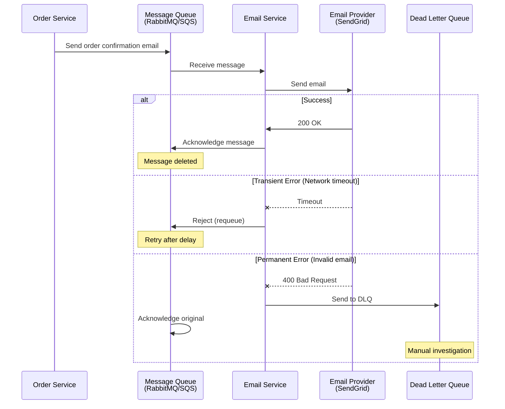

# Development Concepts - Answers

## Question 1: Message Queue Error Handling

📋 **[Back to Question](../sse-topics.md#development-concepts)** | **Topic:** Asynchronous programming and reliability

**Detailed Answer:**

#### Problem Scenario



#### Strategy 1: Retry with Exponential Backoff

**RabbitMQ Consumer (Spring Boot):**

```java
@Configuration
public class RabbitMQConfig {
    
    @Bean
    public Queue emailQueue() {
        return QueueBuilder.durable("email-queue")
            .withArgument("x-dead-letter-exchange", "dlx-exchange")
            .withArgument("x-dead-letter-routing-key", "email-dlq")
            .build();
    }
    
    @Bean
    public Queue deadLetterQueue() {
        return QueueBuilder.durable("email-dlq").build();
    }
    
    @Bean
    public DirectExchange deadLetterExchange() {
        return new DirectExchange("dlx-exchange");
    }
    
    @Bean
    public Binding deadLetterBinding() {
        return BindingBuilder.bind(deadLetterQueue())
            .to(deadLetterExchange())
            .with("email-dlq");
    }
    
    @Bean
    public SimpleRabbitListenerContainerFactory rabbitListenerContainerFactory(
            ConnectionFactory connectionFactory) {
        
        SimpleRabbitListenerContainerFactory factory = new SimpleRabbitListenerContainerFactory();
        factory.setConnectionFactory(connectionFactory);
        
        // Retry configuration
        factory.setAdviceChain(
            RetryInterceptorBuilder.stateless()
                .maxAttempts(3)
                .backOffOptions(
                    1000,  // Initial interval: 1 second
                    2.0,   // Multiplier: exponential backoff
                    10000  // Max interval: 10 seconds
                )
                .recoverer(new RejectAndDontRequeueRecoverer())
                .build()
        );
        
        return factory;
    }
}
```

**Email Consumer with Error Handling:**

```java
@Service
@Slf4j
public class EmailConsumer {
    
    @Autowired
    private EmailService emailService;
    
    @Autowired
    private MetricsService metricsService;
    
    @RabbitListener(queues = "email-queue")
    public void processEmailMessage(
            @Payload EmailMessage message,
            @Header(AmqpHeaders.DELIVERY_TAG) long deliveryTag,
            Channel channel) throws IOException {
        
        log.info("Processing email message: {}", message.getId());
        
        try {
            // Idempotency check
            if (emailService.isAlreadyProcessed(message.getId())) {
                log.info("Message {} already processed, skipping", message.getId());
                channel.basicAck(deliveryTag, false);
                return;
            }
            
            // Process message
            emailService.sendEmail(
                message.getRecipient(),
                message.getSubject(),
                message.getBody()
            );
            
            // Mark as processed (idempotency)
            emailService.markAsProcessed(message.getId());
            
            // Acknowledge successful processing
            channel.basicAck(deliveryTag, false);
            metricsService.incrementSuccess("email-processing");
            
            log.info("Successfully processed email message: {}", message.getId());
            
        } catch (EmailTransientException e) {
            // Temporary failure - retry
            log.warn("Transient error processing message {}: {}", message.getId(), e.getMessage());
            
            int retryCount = getRetryCount(message);
            if (retryCount < 3) {
                // Reject and requeue with delay
                channel.basicNack(deliveryTag, false, true);
                metricsService.incrementRetry("email-processing");
            } else {
                // Max retries exceeded - send to DLQ
                log.error("Max retries exceeded for message {}", message.getId());
                channel.basicNack(deliveryTag, false, false);
                metricsService.incrementFailure("email-processing");
            }
            
        } catch (EmailPermanentException e) {
            // Permanent failure - don't retry
            log.error("Permanent error processing message {}: {}", message.getId(), e.getMessage());
            
            // Send to DLQ without retry
            channel.basicNack(deliveryTag, false, false);
            metricsService.incrementFailure("email-processing");
            
        } catch (Exception e) {
            // Unknown error - be cautious, don't requeue
            log.error("Unexpected error processing message {}", message.getId(), e);
            channel.basicNack(deliveryTag, false, false);
            metricsService.incrementFailure("email-processing");
        }
    }
    
    @RabbitListener(queues = "email-dlq")
    public void processDLQ(@Payload EmailMessage message) {
        log.error("Message in DLQ: {}", message);
        
        // Alert operations team
        alertService.sendAlert(
            "Email message in DLQ",
            String.format("Message ID: %s, Recipient: %s", message.getId(), message.getRecipient())
        );
        
        // Store in database for manual investigation
        dlqRepository.save(DLQEntry.builder()
            .messageId(message.getId())
            .payload(message)
            .timestamp(Instant.now())
            .queue("email-queue")
            .build());
    }
    
    private int getRetryCount(EmailMessage message) {
        // Extract retry count from message headers
        return message.getRetryCount() != null ? message.getRetryCount() : 0;
    }
}
```

**Email Service with Circuit Breaker:**

```java
@Service
@Slf4j
public class EmailService {
    
    @Autowired
    private SendGridClient sendGridClient;
    
    @Autowired
    private RedisTemplate<String, String> redisTemplate;
    
    private static final String PROCESSED_KEY_PREFIX = "email:processed:";
    
    @CircuitBreaker(
        name = "sendgrid",
        fallbackMethod = "sendEmailFallback"
    )
    @Retry(
        name = "sendgrid",
        fallbackMethod = "sendEmailFallback"
    )
    public void sendEmail(String recipient, String subject, String body) {
        log.info("Sending email to: {}", recipient);
        
        try {
            Email from = new Email("noreply@example.com");
            Email to = new Email(recipient);
            Content content = new Content("text/html", body);
            Mail mail = new Mail(from, subject, to, content);
            
            Request request = new Request();
            request.setMethod(Method.POST);
            request.setEndpoint("mail/send");
            request.setBody(mail.build());
            
            Response response = sendGridClient.api(request);
            
            if (response.getStatusCode() >= 200 && response.getStatusCode() < 300) {
                log.info("Email sent successfully to: {}", recipient);
            } else if (response.getStatusCode() >= 400 && response.getStatusCode() < 500) {
                // Client error - permanent failure
                throw new EmailPermanentException(
                    "Invalid request: " + response.getBody()
                );
            } else {
                // Server error - temporary failure
                throw new EmailTransientException(
                    "SendGrid server error: " + response.getStatusCode()
                );
            }
            
        } catch (IOException e) {
            // Network error - temporary failure
            throw new EmailTransientException("Network error: " + e.getMessage(), e);
        }
    }
    
    public void sendEmailFallback(String recipient, String subject, String body, Exception e) {
        log.error("Circuit breaker fallback: Failed to send email to {}", recipient, e);
        
        // Store in database for retry later
        EmailRetryEntry entry = EmailRetryEntry.builder()
            .recipient(recipient)
            .subject(subject)
            .body(body)
            .failureReason(e.getMessage())
            .createdAt(Instant.now())
            .build();
        
        emailRetryRepository.save(entry);
        
        // Could also use alternative email provider
    }
    
    public boolean isAlreadyProcessed(String messageId) {
        String key = PROCESSED_KEY_PREFIX + messageId;
        return Boolean.TRUE.equals(redisTemplate.hasKey(key));
    }
    
    public void markAsProcessed(String messageId) {
        String key = PROCESSED_KEY_PREFIX + messageId;
        // Store for 7 days to handle duplicate messages
        redisTemplate.opsForValue().set(key, "1", Duration.ofDays(7));
    }
}
```

#### Strategy 2: AWS SQS with Visibility Timeout

```java
@Configuration
public class SQSConfig {
    
    @Bean
    public AmazonSQS amazonSQS() {
        return AmazonSQSClientBuilder.standard()
            .withRegion(Regions.US_EAST_1)
            .build();
    }
    
    @Bean
    public QueueMessagingTemplate queueMessagingTemplate() {
        return new QueueMessagingTemplate(amazonSQS());
    }
}
```

```java
@Service
@Slf4j
public class SQSEmailConsumer {
    
    @Autowired
    private AmazonSQS amazonSQS;
    
    @Autowired
    private EmailService emailService;
    
    private static final String QUEUE_URL = "https://sqs.us-east-1.amazonaws.com/123456789/email-queue";
    private static final String DLQ_URL = "https://sqs.us-east-1.amazonaws.com/123456789/email-dlq";
    
    @Scheduled(fixedDelay = 100)
    public void pollMessages() {
        ReceiveMessageRequest receiveRequest = new ReceiveMessageRequest()
            .withQueueUrl(QUEUE_URL)
            .withMaxNumberOfMessages(10)
            .withVisibilityTimeout(30)  // 30 seconds to process
            .withWaitTimeSeconds(20);   // Long polling
        
        ReceiveMessageResult result = amazonSQS.receiveMessage(receiveRequest);
        
        for (Message message : result.getMessages()) {
            processMessage(message);
        }
    }
    
    private void processMessage(Message message) {
        try {
            EmailMessage emailMessage = parseMessage(message.getBody());
            
            // Idempotency check
            if (emailService.isAlreadyProcessed(emailMessage.getId())) {
                log.info("Message already processed: {}", emailMessage.getId());
                deleteMessage(message);
                return;
            }
            
            // Process
            emailService.sendEmail(
                emailMessage.getRecipient(),
                emailMessage.getSubject(),
                emailMessage.getBody()
            );
            
            emailService.markAsProcessed(emailMessage.getId());
            
            // Delete from queue
            deleteMessage(message);
            
            log.info("Successfully processed message: {}", emailMessage.getId());
            
        } catch (EmailTransientException e) {
            // Don't delete - message becomes visible again after timeout
            log.warn("Transient error, will retry: {}", e.getMessage());
            
            // Optionally change visibility timeout for faster/slower retry
            int retryCount = getApproximateReceiveCount(message);
            if (retryCount > 3) {
                // Exponential backoff
                int backoffSeconds = (int) Math.pow(2, retryCount) * 10;
                changeVisibilityTimeout(message, backoffSeconds);
            }
            
        } catch (EmailPermanentException e) {
            // Delete from main queue - will go to DLQ if configured
            log.error("Permanent error, moving to DLQ: {}", e.getMessage());
            deleteMessage(message);
            
        } catch (Exception e) {
            log.error("Unexpected error: {}", e.getMessage(), e);
            // Don't delete - let it retry
        }
    }
    
    private void deleteMessage(Message message) {
        DeleteMessageRequest deleteRequest = new DeleteMessageRequest()
            .withQueueUrl(QUEUE_URL)
            .withReceiptHandle(message.getReceiptHandle());
        amazonSQS.deleteMessage(deleteRequest);
    }
    
    private void changeVisibilityTimeout(Message message, int timeoutSeconds) {
        ChangeMessageVisibilityRequest request = new ChangeMessageVisibilityRequest()
            .withQueueUrl(QUEUE_URL)
            .withReceiptHandle(message.getReceiptHandle())
            .withVisibilityTimeout(timeoutSeconds);
        amazonSQS.changeMessageVisibility(request);
    }
    
    private int getApproximateReceiveCount(Message message) {
        String count = message.getAttributes().get("ApproximateReceiveCount");
        return count != null ? Integer.parseInt(count) : 0;
    }
}
```

**SQS Queue Configuration (CloudFormation):**

```yaml
Resources:
  EmailQueue:
    Type: AWS::SQS::Queue
    Properties:
      QueueName: email-queue
      VisibilityTimeout: 30
      MessageRetentionPeriod: 1209600  # 14 days
      ReceiveMessageWaitTimeSeconds: 20  # Long polling
      RedrivePolicy:
        deadLetterTargetArn: !GetAtt EmailDLQ.Arn
        maxReceiveCount: 3  # Move to DLQ after 3 failures
  
  EmailDLQ:
    Type: AWS::SQS::Queue
    Properties:
      QueueName: email-dlq
      MessageRetentionPeriod: 1209600  # 14 days
  
  DLQAlarm:
    Type: AWS::CloudWatch::Alarm
    Properties:
      AlarmName: email-dlq-messages
      AlarmDescription: Alert when messages in DLQ
      MetricName: ApproximateNumberOfMessagesVisible
      Namespace: AWS/SQS
      Statistic: Sum
      Period: 300
      EvaluationPeriods: 1
      Threshold: 1
      ComparisonOperator: GreaterThanOrEqualToThreshold
      Dimensions:
        - Name: QueueName
          Value: email-dlq
      AlarmActions:
        - !Ref SNSTopic
```

#### Strategy 3: Kafka with Manual Offset Management

```java
@Configuration
public class KafkaConsumerConfig {
    
    @Bean
    public ConsumerFactory<String, EmailMessage> consumerFactory() {
        Map<String, Object> props = new HashMap<>();
        props.put(ConsumerConfig.BOOTSTRAP_SERVERS_CONFIG, "localhost:9092");
        props.put(ConsumerConfig.GROUP_ID_CONFIG, "email-consumer-group");
        props.put(ConsumerConfig.KEY_DESERIALIZER_CLASS_CONFIG, StringDeserializer.class);
        props.put(ConsumerConfig.VALUE_DESERIALIZER_CLASS_CONFIG, JsonDeserializer.class);
        props.put(ConsumerConfig.ENABLE_AUTO_COMMIT_CONFIG, false);  // Manual commit
        props.put(ConsumerConfig.MAX_POLL_RECORDS_CONFIG, 10);
        props.put(JsonDeserializer.TRUSTED_PACKAGES, "com.example.model");
        
        return new DefaultKafkaConsumerFactory<>(props);
    }
    
    @Bean
    public ConcurrentKafkaListenerContainerFactory<String, EmailMessage> kafkaListenerContainerFactory() {
        ConcurrentKafkaListenerContainerFactory<String, EmailMessage> factory =
            new ConcurrentKafkaListenerContainerFactory<>();
        factory.setConsumerFactory(consumerFactory());
        factory.setConcurrency(3);  // 3 consumer threads
        
        // Error handling
        factory.setCommonErrorHandler(new DefaultErrorHandler(
            new DeadLetterPublishingRecoverer(kafkaTemplate()),
            new FixedBackOff(1000L, 3L)  // 3 retries with 1 second delay
        ));
        
        return factory;
    }
}
```

```java
@Service
@Slf4j
public class KafkaEmailConsumer {
    
    @Autowired
    private EmailService emailService;
    
    @KafkaListener(
        topics = "email-topic",
        groupId = "email-consumer-group",
        containerFactory = "kafkaListenerContainerFactory"
    )
    public void consume(
            ConsumerRecord<String, EmailMessage> record,
            Acknowledgment acknowledgment) {
        
        EmailMessage message = record.value();
        log.info("Received message from Kafka: offset={}, key={}", record.offset(), record.key());
        
        try {
            // Idempotency check
            if (emailService.isAlreadyProcessed(message.getId())) {
                log.info("Message already processed: {}", message.getId());
                acknowledgment.acknowledge();
                return;
            }
            
            // Process
            emailService.sendEmail(
                message.getRecipient(),
                message.getSubject(),
                message.getBody()
            );
            
            emailService.markAsProcessed(message.getId());
            
            // Commit offset
            acknowledgment.acknowledge();
            
            log.info("Successfully processed Kafka message: {}", message.getId());
            
        } catch (EmailTransientException e) {
            log.warn("Transient error, will retry: {}", e.getMessage());
            // Don't acknowledge - consumer will reprocess after poll timeout
            throw e;  // Triggers retry in error handler
            
        } catch (EmailPermanentException e) {
            log.error("Permanent error, sending to DLQ: {}", e.getMessage());
            // Acknowledge to skip this message
            acknowledgment.acknowledge();
            // Error handler already sent to DLQ
            
        } catch (Exception e) {
            log.error("Unexpected error: {}", e.getMessage(), e);
            throw e;  // Trigger error handler
        }
    }
    
    @KafkaListener(
        topics = "email-topic-dlt",  // Dead Letter Topic
        groupId = "email-dlq-consumer-group"
    )
    public void consumeDLQ(ConsumerRecord<String, EmailMessage> record) {
        log.error("Message in DLT: offset={}, value={}", record.offset(), record.value());
        
        // Alert and store for manual processing
        alertService.sendAlert("Email message in DLT", record.value().toString());
        dlqRepository.save(DLQEntry.from(record));
    }
}
```

#### Idempotency Pattern

```java
@Service
public class IdempotentEmailService {
    
    @Autowired
    private EmailService emailService;
    
    @Autowired
    private JdbcTemplate jdbcTemplate;
    
    @Transactional
    public void processEmailIdempotent(EmailMessage message) {
        // Try to insert message ID as processed
        try {
            jdbcTemplate.update(
                "INSERT INTO processed_messages (message_id, processed_at) VALUES (?, ?)",
                message.getId(),
                Instant.now()
            );
        } catch (DuplicateKeyException e) {
            // Already processed
            log.info("Message {} already processed", message.getId());
            return;
        }
        
        // Process message
        emailService.sendEmail(
            message.getRecipient(),
            message.getSubject(),
            message.getBody()
        );
    }
}
```

**Database schema:**

```sql
CREATE TABLE processed_messages (
    message_id VARCHAR(255) PRIMARY KEY,
    processed_at TIMESTAMP NOT NULL,
    created_at TIMESTAMP DEFAULT CURRENT_TIMESTAMP,
    INDEX idx_processed_at (processed_at)
);

-- Cleanup old entries
DELETE FROM processed_messages 
WHERE processed_at < NOW() - INTERVAL 7 DAY;
```

#### Monitoring and Alerting

```java
@Service
public class QueueMonitoringService {
    
    @Autowired
    private MeterRegistry meterRegistry;
    
    @Scheduled(fixedRate = 60000)  // Every minute
    public void monitorQueueMetrics() {
        // Queue depth
        int queueDepth = getQueueDepth("email-queue");
        meterRegistry.gauge("queue.depth", queueDepth);
        
        // DLQ depth
        int dlqDepth = getQueueDepth("email-dlq");
        meterRegistry.gauge("dlq.depth", dlqDepth);
        
        // Alert if DLQ has messages
        if (dlqDepth > 0) {
            alertService.sendAlert(
                "Messages in DLQ",
                String.format("%d messages in email-dlq", dlqDepth)
            );
        }
        
        // Alert if queue is growing too fast
        if (queueDepth > 1000) {
            alertService.sendAlert(
                "High queue depth",
                String.format("Queue depth: %d", queueDepth)
            );
        }
    }
    
    public void recordProcessingTime(String operation, long durationMs) {
        meterRegistry.timer("message.processing.time", "operation", operation)
            .record(durationMs, TimeUnit.MILLISECONDS);
    }
    
    public void recordSuccess(String operation) {
        meterRegistry.counter("message.processed", "operation", operation, "status", "success")
            .increment();
    }
    
    public void recordFailure(String operation, String errorType) {
        meterRegistry.counter("message.processed", 
            "operation", operation, 
            "status", "failure",
            "error_type", errorType)
            .increment();
    }
}
```

#### Best Practices Summary

1. **Idempotency** - Always design consumers to be idempotent
2. **Retry Strategy** - Exponential backoff with max retries
3. **Dead Letter Queue** - Capture permanent failures
4. **Monitoring** - Track queue depth, processing time, error rates
5. **At-least-once delivery** - Design for duplicate messages
6. **Circuit Breaker** - Protect against downstream failures
7. **Timeouts** - Set appropriate processing timeouts
8. **Visibility Timeout** - Configure based on processing time
9. **Alerting** - Monitor DLQ and queue depth
10. **Cleanup** - Purge old idempotency records

---

