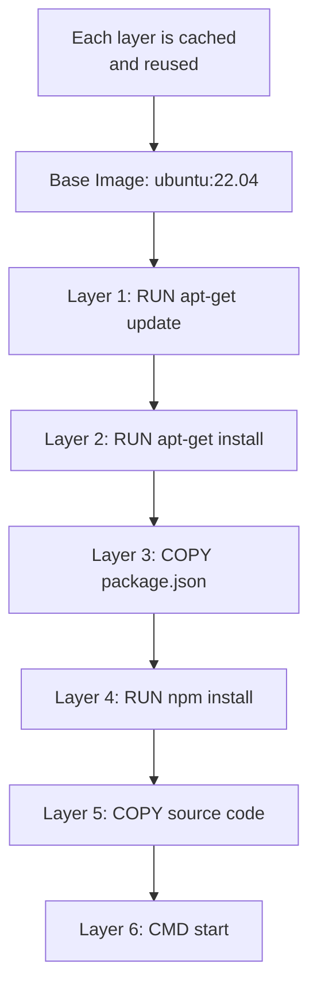
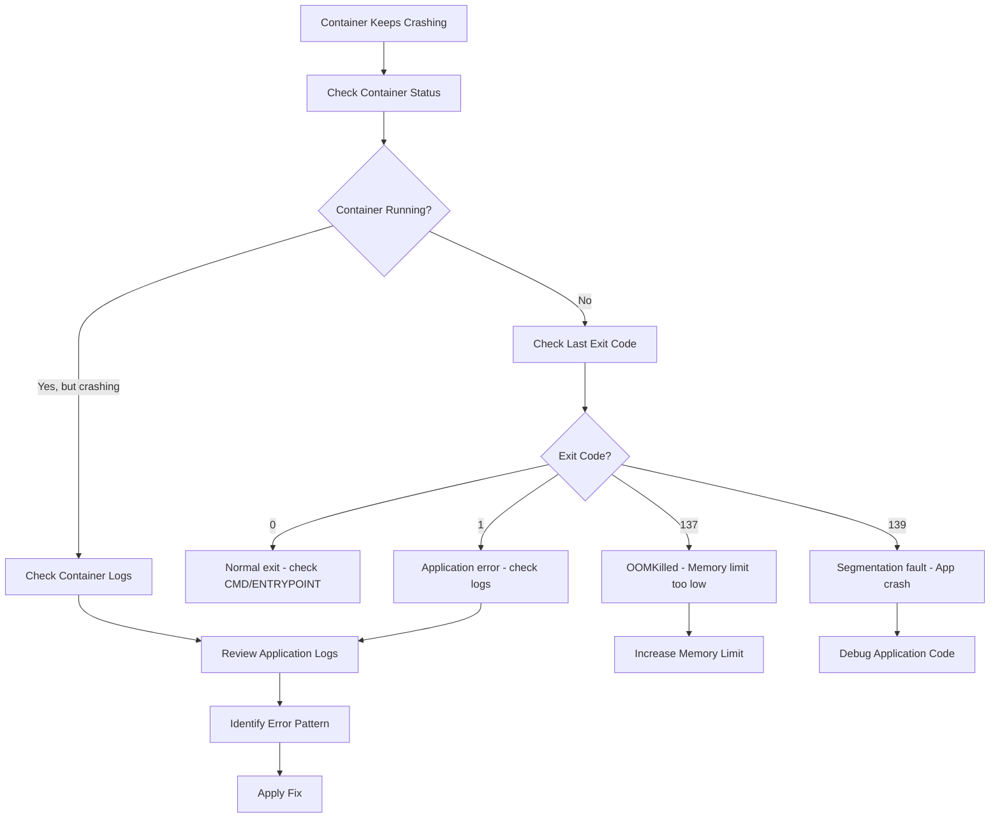

# Docker - Answers

## Question 1: Docker Layers and Optimization

📋 **[Back to Question](../sse-topics.md#docker)** | **Topic:** Docker and containerization

**Detailed Answer:**

#### How Docker Layers Work



**How Layers Are Stored:**

```bash
# Each instruction creates a new layer
FROM ubuntu:22.04          # Layer 1 (base)
RUN apt-get update         # Layer 2 (cached if unchanged)
RUN apt-get install -y nodejs  # Layer 3
COPY package.json .        # Layer 4
RUN npm install            # Layer 5 (rebuilt if package.json changes)
COPY . .                   # Layer 6 (rebuilt on every code change)
CMD ["npm", "start"]       # Layer 7 (metadata, no actual layer)
```

#### ❌ Bad Dockerfile (Inefficient)

```dockerfile
FROM node:18

# ❌ COPY everything first
COPY . /app
WORKDIR /app

# ❌ Install dependencies after copying code
# This invalidates cache on every code change!
RUN npm install

# ❌ Multiple RUN commands = multiple layers
RUN apt-get update
RUN apt-get install -y curl
RUN apt-get install -y vim

EXPOSE 3000
CMD ["npm", "start"]
```

**Problems:**
1. `npm install` runs on every code change
2. Multiple `RUN` commands create unnecessary layers
3. No layer caching benefit

#### ✅ Good Dockerfile (Optimized)

```dockerfile
# Use specific version tag (not 'latest')
FROM node:18-alpine AS builder

# Set working directory
WORKDIR /app

# Copy only dependency files first (changes less frequently)
COPY package*.json ./

# Install dependencies (this layer is cached unless package.json changes)
RUN npm ci --only=production

# Copy source code (changes frequently, so do this last)
COPY . .

# Build if needed
RUN npm run build

# --- Multi-stage build: Use smaller runtime image ---
FROM node:18-alpine

WORKDIR /app

# Copy only necessary files from builder
COPY --from=builder /app/dist ./dist
COPY --from=builder /app/node_modules ./node_modules
COPY --from=builder /app/package*.json ./

# Run as non-root user
RUN addgroup -g 1001 -S nodejs && \
    adduser -S nodejs -u 1001
USER nodejs

EXPOSE 3000

# Use exec form for proper signal handling
CMD ["node", "dist/index.js"]
```

**Benefits:**
1. ✅ Dependencies cached separately from code
2. ✅ Multi-stage build reduces final image size
3. ✅ Single `RUN` for related commands
4. ✅ Non-root user for security
5. ✅ Specific base image version

#### Layer Caching Example

**First Build:**
```bash
$ docker build -t myapp:v1 .

Step 1/10 : FROM node:18-alpine
 ---> a1b2c3d4e5f6

Step 2/10 : WORKDIR /app
 ---> Running in xyz123
 ---> abc456def789

Step 3/10 : COPY package*.json ./
 ---> 111222333444

Step 4/10 : RUN npm ci
 ---> Running in build123
 ---> 555666777888  # Downloaded 150MB of dependencies

Step 5/10 : COPY . .
 ---> aaa111bbb222

Total time: 2 minutes
```

**Second Build (only code changed):**
```bash
$ docker build -t myapp:v2 .

Step 1/10 : FROM node:18-alpine
 ---> Using cache  # ✅ Cached

Step 2/10 : WORKDIR /app
 ---> Using cache  # ✅ Cached

Step 3/10 : COPY package*.json ./
 ---> Using cache  # ✅ Cached (package.json unchanged)

Step 4/10 : RUN npm ci
 ---> Using cache  # ✅ Cached (saved 2 minutes!)

Step 5/10 : COPY . .
 ---> aaa111bbb333  # ❌ Rebuilt (code changed)

Total time: 10 seconds  # 🚀 12x faster!
```

#### Real-World Examples

**Java Spring Boot:**

```dockerfile
FROM maven:3.9-eclipse-temurin-17 AS build

WORKDIR /app

# Copy pom.xml first (dependencies change less frequently)
COPY pom.xml .
RUN mvn dependency:go-offline

# Copy source code
COPY src ./src
RUN mvn package -DskipTests

# Runtime stage
FROM eclipse-temurin:17-jre-alpine

WORKDIR /app

# Copy only the JAR
COPY --from=build /app/target/*.jar app.jar

RUN addgroup -S spring && adduser -S spring -G spring
USER spring

EXPOSE 8080

ENTRYPOINT ["java", "-jar", "app.jar"]
```

**Python:**

```dockerfile
FROM python:3.11-slim AS builder

WORKDIR /app

# Install dependencies in separate layer
COPY requirements.txt .
RUN pip install --no-cache-dir --user -r requirements.txt

# Copy application code
COPY . .

# Runtime stage
FROM python:3.11-slim

WORKDIR /app

# Copy installed packages from builder
COPY --from=builder /root/.local /root/.local
COPY --from=builder /app .

# Add local binaries to PATH
ENV PATH=/root/.local/bin:$PATH

# Non-root user
RUN useradd -m appuser
USER appuser

CMD ["python", "main.py"]
```

#### Image Size Optimization

```dockerfile
# ❌ BAD: Large image (1.2GB)
FROM ubuntu:22.04
RUN apt-get update && apt-get install -y \
    python3 \
    python3-pip \
    git \
    curl \
    vim \
    build-essential
COPY . /app
RUN pip3 install -r requirements.txt

# ✅ GOOD: Optimized (150MB)
FROM python:3.11-slim

# Combine commands to reduce layers
RUN apt-get update && \
    apt-get install -y --no-install-recommends git && \
    rm -rf /var/lib/apt/lists/*  # Clean up

COPY requirements.txt .
RUN pip install --no-cache-dir -r requirements.txt

COPY . /app
WORKDIR /app
```

**Layer Inspection:**

```bash
# View image layers
docker history myapp:latest

# Analyze layer sizes
docker history myapp:latest --human --no-trunc

# Use dive tool for detailed analysis
dive myapp:latest
```

#### Best Practices Summary

1. **Order matters:** Least frequently changing → Most frequently changing
   ```dockerfile
   FROM base
   # 1. Base dependencies (rarely change)
   # 2. Application dependencies (change occasionally)
   # 3. Application code (change frequently)
   ```

2. **Multi-stage builds:** Separate build and runtime
   ```dockerfile
   FROM builder AS build
   # ... build steps
   
   FROM runtime
   COPY --from=build /app/dist .
   ```

3. **Minimize layers:** Combine related commands
   ```dockerfile
   # ✅ One layer
   RUN apt-get update && \
       apt-get install -y pkg1 pkg2 && \
       rm -rf /var/lib/apt/lists/*
   
   # ❌ Three layers
   RUN apt-get update
   RUN apt-get install -y pkg1 pkg2
   RUN rm -rf /var/lib/apt/lists/*
   ```

4. **Use `.dockerignore`:**
   ```
   node_modules
   .git
   .env
   *.log
   dist
   ```

5. **Specific base image versions:**
   ```dockerfile
   # ✅ Specific version
   FROM node:18.17.1-alpine3.18
   
   # ❌ Generic tag (can break builds)
   FROM node:latest
   ```

---

## Question 2: Debugging Crashing Docker Containers

📋 **[Back to Question](../sse-topics.md#docker)** | **Topic:** Container troubleshooting

**Detailed Answer:**

#### Debugging Flowchart



#### Step 1: Check Container Status and Exit Code

```bash
# List all containers (including stopped)
docker ps -a

# Output example:
# CONTAINER ID   IMAGE     STATUS                       PORTS
# abc123def456   myapp     Exited (137) 2 minutes ago

# Get detailed container info
docker inspect abc123def456 --format='{{.State.ExitCode}}'

# Get full state information
docker inspect abc123def456 | jq '.State'
```

**Common Exit Codes:**

| Exit Code | Meaning | Likely Cause |
|-----------|---------|--------------|
| 0 | Normal exit | Container completed successfully or CMD/ENTRYPOINT missing |
| 1 | Application error | Application-level exception or error |
| 125 | Docker daemon error | Problem with Docker itself |
| 126 | Command invocation error | Cannot execute command |
| 127 | File not found | Command or binary not found |
| 137 | SIGKILL (128+9) | **OOMKilled** - Out of memory |
| 139 | SIGSEGV (128+11) | Segmentation fault |
| 143 | SIGTERM (128+15) | Gracefully terminated |

#### Step 2: Check Container Logs

```bash
# View recent logs
docker logs abc123def456

# Follow logs in real-time
docker logs -f abc123def456

# Last 100 lines with timestamps
docker logs --tail 100 --timestamps abc123def456

# Logs since specific time
docker logs --since 30m abc123def456

# For containers that exit immediately, use --follow with run
docker run --rm myapp:latest 2>&1 | tee crash.log
```

#### Step 3: Check Resource Limits

```bash
# Check memory and CPU stats
docker stats abc123def456

# Inspect resource limits
docker inspect abc123def456 | jq '.HostConfig | {Memory, MemorySwap, CpuShares, CpuQuota}'

# Check if OOMKilled
docker inspect abc123def456 | jq '.State.OOMKilled'
```

**Example: Container OOMKilled**

```bash
# Current limit
$ docker inspect myapp | jq '.HostConfig.Memory'
268435456  # 256MB

# Increase memory limit
docker run -d --name myapp --memory="1g" myapp:latest

# Or in docker-compose.yml
services:
  myapp:
    image: myapp:latest
    deploy:
      resources:
        limits:
          memory: 1G
        reservations:
          memory: 512M
```

#### Step 4: Interactive Debugging

```bash
# Override entrypoint to keep container running
docker run -it --entrypoint /bin/sh myapp:latest

# Or override with bash
docker run -it --entrypoint /bin/bash myapp:latest

# Execute command in running container
docker exec -it abc123def456 /bin/sh

# Check processes inside container
docker exec abc123def456 ps aux

# Check disk space
docker exec abc123def456 df -h

# Check environment variables
docker exec abc123def456 env
```

#### Step 5: Check Application-Level Issues

**Java Application Crash:**

```bash
# Check for heap space issues
docker logs myapp 2>&1 | grep -i "outofmemory\|heap"

# Java heap dump on crash (add to Dockerfile)
ENV JAVA_OPTS="-XX:+HeapDumpOnOutOfMemoryError -XX:HeapDumpPath=/tmp"

# Run with increased heap
docker run -e JAVA_OPTS="-Xmx1g -Xms512m" myapp:latest
```

**Node.js Application:**

```bash
# Check for unhandled promise rejections
docker logs myapp 2>&1 | grep -i "unhandled\|rejection"

# Increase heap size
docker run -e NODE_OPTIONS="--max-old-space-size=4096" myapp:latest
```

**Python Application:**

```bash
# Check for Python exceptions
docker logs myapp 2>&1 | grep -i "traceback\|error"

# Run with Python unbuffered output
docker run -e PYTHONUNBUFFERED=1 myapp:latest
```

#### Step 6: Health Checks

```dockerfile
# Add health check to Dockerfile
HEALTHCHECK --interval=30s --timeout=3s --start-period=40s --retries=3 \
  CMD curl -f http://localhost:8080/health || exit 1

# Or wget for minimal images
HEALTHCHECK CMD wget --no-verbose --tries=1 --spider http://localhost:8080/health || exit 1
```

```bash
# Check health status
docker inspect --format='{{.State.Health.Status}}' myapp

# View health check logs
docker inspect --format='{{json .State.Health}}' myapp | jq
```

#### Step 7: Network and Dependency Issues

```bash
# Test network connectivity
docker exec myapp ping -c 3 google.com

# Check DNS resolution
docker exec myapp nslookup database-host

# Test database connection
docker exec myapp nc -zv postgres-host 5432

# Check external API
docker exec myapp curl -v https://api.external.com/health
```

#### Step 8: File System and Permissions

```bash
# Check file permissions
docker exec myapp ls -la /app

# Check disk usage
docker exec myapp du -sh /*

# Check if running as correct user
docker exec myapp whoami

# Check write permissions
docker exec myapp touch /app/test.txt
```

#### Complete Debugging Example

```bash
#!/bin/bash
# debug-container.sh

CONTAINER_NAME="myapp"

echo "=== Container Status ==="
docker ps -a | grep $CONTAINER_NAME

echo -e "\n=== Exit Code ==="
EXIT_CODE=$(docker inspect $CONTAINER_NAME --format='{{.State.ExitCode}}')
echo "Exit Code: $EXIT_CODE"

echo -e "\n=== OOM Killed? ==="
docker inspect $CONTAINER_NAME --format='{{.State.OOMKilled}}'

echo -e "\n=== Memory Limit ==="
docker inspect $CONTAINER_NAME --format='{{.HostConfig.Memory}}' | awk '{print $1/1024/1024 "MB"}'

echo -e "\n=== Last 50 Log Lines ==="
docker logs --tail 50 $CONTAINER_NAME

echo -e "\n=== Resource Usage ==="
docker stats --no-stream $CONTAINER_NAME

echo -e "\n=== Restart Count ==="
docker inspect $CONTAINER_NAME --format='{{.RestartCount}}'
```

#### Common Issues and Solutions

**1. Missing Environment Variables:**

```bash
# Check what env vars are set
docker exec myapp env

# Run with correct env vars
docker run -e DATABASE_URL="postgres://..." myapp:latest

# Or use env file
docker run --env-file .env myapp:latest
```

**2. Port Conflicts:**

```bash
# Check if port is already in use
lsof -i :8080

# Use different host port
docker run -p 8081:8080 myapp:latest
```

**3. Volume Mount Issues:**

```bash
# Check volume mounts
docker inspect myapp --format='{{json .Mounts}}' | jq

# Test with read-only mount
docker run -v /data:/data:ro myapp:latest
```

**4. Entrypoint/CMD Issues:**

```bash
# Check what command is actually running
docker inspect myapp --format='{{.Config.Cmd}}'
docker inspect myapp --format='{{.Config.Entrypoint}}'

# Override for testing
docker run --entrypoint "" myapp:latest /bin/sh -c "your-command"
```

#### Best Practices

1. **Always use health checks** in production
2. **Set appropriate resource limits** (memory, CPU)
3. **Use structured logging** (JSON format)
4. **Implement graceful shutdown** (handle SIGTERM)
5. **Add readiness probes** (separate from health checks)
6. **Monitor restart count** (alert on high restarts)
7. **Use multi-stage builds** to reduce attack surface
8. **Run as non-root user** for security

---

