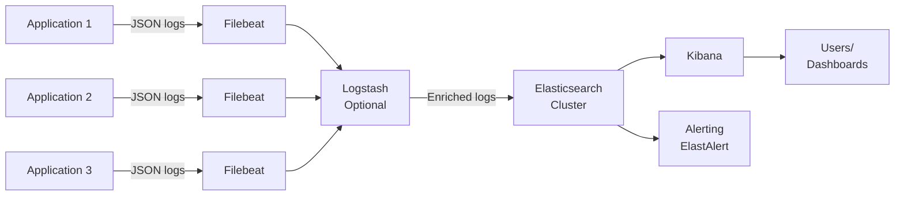

# ELK Stack - Answers

## Question 1: Elasticsearch for Application Logs

📋 **[Back to Question](../sse-topics.md#elk-stack)** | **Topic:** ELK stack and logging

**Detailed Answer:**

#### ELK Stack Architecture



#### Step 1: Application Logging (Structured JSON)

**Spring Boot Application:**

```xml
<!-- pom.xml -->
<dependency>
    <groupId>net.logstash.logback</groupId>
    <artifactId>logstash-logback-encoder</artifactId>
    <version>7.4</version>
</dependency>
```

```xml
<!-- logback-spring.xml -->
<configuration>
    <appender name="JSON_FILE" class="ch.qos.logback.core.rolling.RollingFileAppender">
        <file>/var/log/app/application.log</file>
        <rollingPolicy class="ch.qos.logback.core.rolling.TimeBasedRollingPolicy">
            <fileNamePattern>/var/log/app/application-%d{yyyy-MM-dd}.log</fileNamePattern>
            <maxHistory>7</maxHistory>
        </rollingPolicy>
        <encoder class="net.logstash.logback.encoder.LogstashEncoder">
            <includeMdc>true</includeMdc>
            <includeContext>true</includeContext>
            <customFields>{"service":"order-service","environment":"production"}</customFields>
        </encoder>
    </appender>
    
    <root level="INFO">
        <appender-ref ref="JSON_FILE"/>
    </root>
</configuration>
```

**Sample JSON Log Output:**

```json
{
  "@timestamp": "2026-01-16T10:30:45.123Z",
  "level": "ERROR",
  "logger_name": "com.example.OrderService",
  "message": "Failed to process order",
  "thread_name": "http-nio-8080-exec-5",
  "service": "order-service",
  "environment": "production",
  "trace_id": "abc123def456",
  "span_id": "789ghi",
  "user_id": "user_12345",
  "order_id": "order_67890",
  "exception": {
    "class": "java.sql.SQLException",
    "message": "Connection timeout",
    "stacktrace": "..."
  },
  "mdc": {
    "request_id": "req-xyz789",
    "ip_address": "192.168.1.100"
  }
}
```

#### Step 2: Filebeat Configuration

```yaml
# filebeat.yml
filebeat.inputs:
- type: log
  enabled: true
  paths:
    - /var/log/app/*.log
  json.keys_under_root: true
  json.add_error_key: true
  fields:
    log_type: application
  processors:
    - add_host_metadata: ~
    - add_cloud_metadata: ~
    - add_kubernetes_metadata:  # If running in K8s
        host: ${NODE_NAME}
        matchers:
        - logs_path:
            logs_path: "/var/log/pods/"

# Output to Elasticsearch
output.elasticsearch:
  hosts: ["elasticsearch:9200"]
  index: "app-logs-%{+yyyy.MM.dd}"
  username: "elastic"
  password: "${ELASTICSEARCH_PASSWORD}"

# Optional: Output to Logstash for processing
#output.logstash:
#  hosts: ["logstash:5044"]

# Index lifecycle management
setup.ilm.enabled: true
setup.ilm.rollover_alias: "app-logs"
setup.ilm.pattern: "{now/d}-000001"

# Setup Kibana dashboards
setup.kibana:
  host: "kibana:5601"

# Logging
logging.level: info
logging.to_files: true
logging.files:
  path: /var/log/filebeat
  name: filebeat
  keepfiles: 7
```

**Kubernetes DaemonSet for Filebeat:**

```yaml
apiVersion: apps/v1
kind: DaemonSet
metadata:
  name: filebeat
  namespace: logging
spec:
  selector:
    matchLabels:
      app: filebeat
  template:
    metadata:
      labels:
        app: filebeat
    spec:
      serviceAccountName: filebeat
      containers:
      - name: filebeat
        image: docker.elastic.co/beats/filebeat:8.11.0
        args: [
          "-c", "/etc/filebeat.yml",
          "-e",
        ]
        env:
        - name: ELASTICSEARCH_HOST
          value: elasticsearch
        - name: ELASTICSEARCH_PORT
          value: "9200"
        - name: ELASTICSEARCH_PASSWORD
          valueFrom:
            secretKeyRef:
              name: elasticsearch-secret
              key: password
        - name: NODE_NAME
          valueFrom:
            fieldRef:
              fieldPath: spec.nodeName
        volumeMounts:
        - name: config
          mountPath: /etc/filebeat.yml
          subPath: filebeat.yml
        - name: data
          mountPath: /usr/share/filebeat/data
        - name: varlibdockercontainers
          mountPath: /var/lib/docker/containers
          readOnly: true
        - name: varlog
          mountPath: /var/log
          readOnly: true
      volumes:
      - name: config
        configMap:
          name: filebeat-config
      - name: varlibdockercontainers
        hostPath:
          path: /var/lib/docker/containers
      - name: varlog
        hostPath:
          path: /var/log
      - name: data
        hostPath:
          path: /var/lib/filebeat-data
```

#### Step 3: Elasticsearch Index Configuration

**Index Template:**

```json
PUT _index_template/app-logs-template
{
  "index_patterns": ["app-logs-*"],
  "priority": 500,
  "template": {
    "settings": {
      "number_of_shards": 3,
      "number_of_replicas": 1,
      "index.refresh_interval": "5s",
      "index.codec": "best_compression"
    },
    "mappings": {
      "properties": {
        "@timestamp": {
          "type": "date",
          "format": "strict_date_optional_time||epoch_millis"
        },
        "level": {
          "type": "keyword"
        },
        "logger_name": {
          "type": "keyword"
        },
        "message": {
          "type": "text",
          "fields": {
            "keyword": {
              "type": "keyword",
              "ignore_above": 256
            }
          }
        },
        "service": {
          "type": "keyword"
        },
        "environment": {
          "type": "keyword"
        },
        "trace_id": {
          "type": "keyword"
        },
        "user_id": {
          "type": "keyword"
        },
        "order_id": {
          "type": "keyword"
        },
        "exception": {
          "properties": {
            "class": {
              "type": "keyword"
            },
            "message": {
              "type": "text"
            },
            "stacktrace": {
              "type": "text",
              "index": false
            }
          }
        }
      }
    }
  }
}
```

**Index Lifecycle Policy (ILM):**

```json
PUT _ilm/policy/app-logs-policy
{
  "policy": {
    "phases": {
      "hot": {
        "actions": {
          "rollover": {
            "max_size": "50GB",
            "max_age": "1d"
          }
        }
      },
      "warm": {
        "min_age": "3d",
        "actions": {
          "shrink": {
            "number_of_shards": 1
          },
          "forcemerge": {
            "max_num_segments": 1
          }
        }
      },
      "cold": {
        "min_age": "7d",
        "actions": {
          "freeze": {}
        }
      },
      "delete": {
        "min_age": "30d",
        "actions": {
          "delete": {}
        }
      }
    }
  }
}
```

#### Step 4: Logstash Processing (Optional)

```conf
# logstash.conf
input {
  beats {
    port => 5044
  }
}

filter {
  # Parse JSON
  json {
    source => "message"
  }
  
  # Add GeoIP data for IP addresses
  geoip {
    source => "ip_address"
    target => "geoip"
  }
  
  # Extract user agent information
  if [user_agent] {
    useragent {
      source => "user_agent"
      target => "user_agent_parsed"
    }
  }
  
  # Normalize log levels
  if [level] {
    mutate {
      uppercase => ["level"]
    }
  }
  
  # Drop debug logs in production
  if [environment] == "production" and [level] == "DEBUG" {
    drop {}
  }
  
  # Add custom fields
  mutate {
    add_field => {
      "[@metadata][index]" => "app-logs-%{+YYYY.MM.dd}"
    }
  }
}

output {
  elasticsearch {
    hosts => ["elasticsearch:9200"]
    index => "%{[@metadata][index]}"
    user => "elastic"
    password => "${ELASTICSEARCH_PASSWORD}"
  }
  
  # Also output to stdout for debugging
  stdout {
    codec => rubydebug
  }
}
```

#### Step 5: Kibana Queries and Dashboards

**Common Queries:**

```
# All errors in last 24 hours
level:ERROR AND @timestamp:[now-24h TO now]

# Specific service errors
service:"order-service" AND level:ERROR

# Errors for specific user
user_id:"user_12345" AND level:ERROR

# Full-text search in messages
message:"connection timeout"

# Trace all logs for a request
trace_id:"abc123def456"

# Errors excluding specific exceptions
level:ERROR AND NOT exception.class:"NotFoundException"

# Response time > 1 second
response_time:>=1000

# Multiple conditions
service:"payment-service" AND environment:"production" AND level:(ERROR OR WARN) AND @timestamp:[now-1h TO now]
```

**Kibana Query DSL:**

```json
GET /app-logs-*/_search
{
  "query": {
    "bool": {
      "must": [
        {
          "match": {
            "service": "order-service"
          }
        },
        {
          "range": {
            "@timestamp": {
              "gte": "now-1h"
            }
          }
        }
      ],
      "filter": [
        {
          "term": {
            "level": "ERROR"
          }
        }
      ]
    }
  },
  "aggs": {
    "errors_by_exception": {
      "terms": {
        "field": "exception.class",
        "size": 10
      }
    },
    "errors_over_time": {
      "date_histogram": {
        "field": "@timestamp",
        "fixed_interval": "5m"
      }
    }
  },
  "size": 100,
  "sort": [
    {
      "@timestamp": {
        "order": "desc"
      }
    }
  ]
}
```

#### Step 6: Alerting with ElastAlert

```yaml
# elastalert_config.yaml
es_host: elasticsearch
es_port: 9200
rules_folder: rules
run_every:
  minutes: 1
buffer_time:
  minutes: 15
writeback_index: elastalert_status
```

```yaml
# rules/high_error_rate.yaml
name: High Error Rate Alert
type: frequency
index: app-logs-*
num_events: 50
timeframe:
  minutes: 5

filter:
- term:
    level: "ERROR"
- term:
    service: "order-service"

alert:
- "slack"
- "email"

slack_webhook_url: "https://hooks.slack.com/services/YOUR/WEBHOOK/URL"
slack_channel_override: "#alerts"
slack_msg_color: "danger"

email:
- "oncall@example.com"

alert_subject: "High error rate detected in {0}"
alert_subject_args:
- service

alert_text: |
  Service: {0}
  Environment: {1}
  Error count: {2} in last 5 minutes
  
  Top errors:
  {3}

alert_text_args:
- service
- environment
- num_hits
- top_events_message
```

#### Step 7: Performance Optimization

**1. Index Settings:**
```json
{
  "index.refresh_interval": "30s",  // Default: 1s
  "index.merge.scheduler.max_thread_count": 1,
  "index.translog.durability": "async",
  "index.translog.sync_interval": "30s"
}
```

**2. Bulk Indexing:**
```bash
# Filebeat bulk settings
bulk_max_size: 2000
worker: 2
compression_level: 3
```

**3. Shard Strategy:**
- **Rule of thumb:** Keep shards between 10-50 GB
- **Hot tier:** More shards for write throughput
- **Warm tier:** Fewer shards (use shrink API)

#### Complete Docker Compose Setup

```yaml
version: '3.8'

services:
  elasticsearch:
    image: docker.elastic.co/elasticsearch/elasticsearch:8.11.0
    environment:
      - discovery.type=single-node
      - xpack.security.enabled=true
      - ELASTIC_PASSWORD=changeme
      - "ES_JAVA_OPTS=-Xms2g -Xmx2g"
    volumes:
      - elasticsearch-data:/usr/share/elasticsearch/data
    ports:
      - "9200:9200"
  
  kibana:
    image: docker.elastic.co/kibana/kibana:8.11.0
    environment:
      - ELASTICSEARCH_HOSTS=http://elasticsearch:9200
      - ELASTICSEARCH_USERNAME=elastic
      - ELASTICSEARCH_PASSWORD=changeme
    ports:
      - "5601:5601"
    depends_on:
      - elasticsearch
  
  logstash:
    image: docker.elastic.co/logstash/logstash:8.11.0
    volumes:
      - ./logstash.conf:/usr/share/logstash/pipeline/logstash.conf
    ports:
      - "5044:5044"
    environment:
      - ELASTICSEARCH_PASSWORD=changeme
    depends_on:
      - elasticsearch
  
  filebeat:
    image: docker.elastic.co/beats/filebeat:8.11.0
    user: root
    volumes:
      - ./filebeat.yml:/usr/share/filebeat/filebeat.yml:ro
      - /var/lib/docker/containers:/var/lib/docker/containers:ro
      - /var/log:/var/log:ro
    environment:
      - ELASTICSEARCH_PASSWORD=changeme
    depends_on:
      - elasticsearch

volumes:
  elasticsearch-data:
```

#### Best Practices

1. **Use structured logging (JSON)** - easier to parse and search
2. **Include correlation IDs** - trace requests across services
3. **Set retention policies** - don't keep logs forever (cost!)
4. **Use ILM** - automatically manage index lifecycle
5. **Monitor Elasticsearch health** - CPU, memory, disk, JVM heap
6. **Use index aliases** - allows zero-downtime index changes
7. **Optimize mappings** - use `keyword` for exact matches, `text` for full-text search
8. **Don't index unnecessary fields** - `"index": false` for large fields
9. **Use data tiers** - hot/warm/cold architecture for cost optimization
10. **Regular backups** - use Elasticsearch snapshots

---

