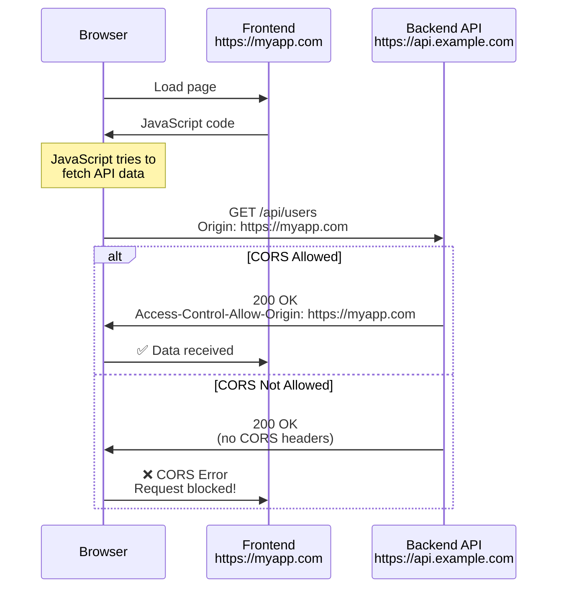
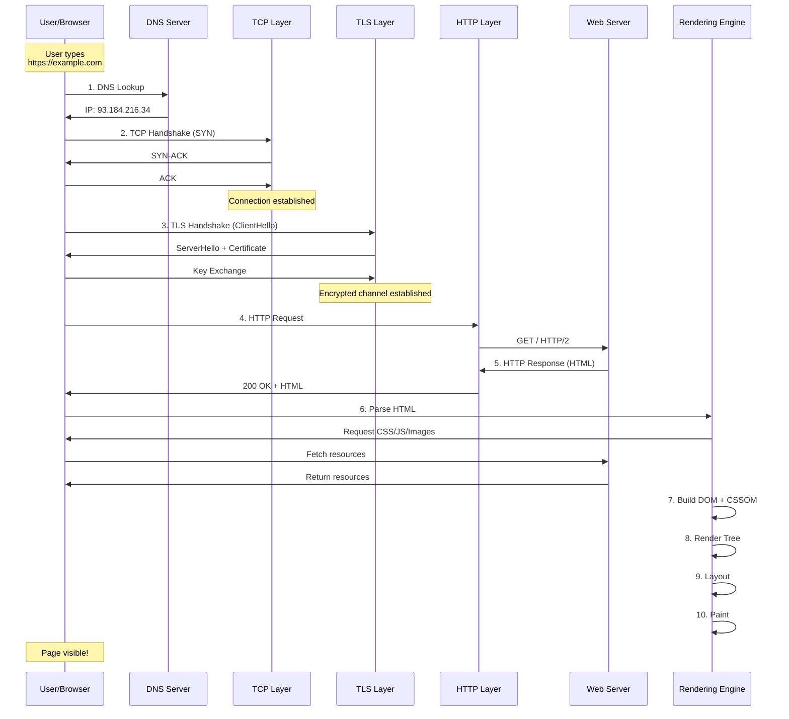

# HTTP - Answers

## Question 1: CORS (Cross-Origin Resource Sharing)

📋 **[Back to Question](../sse-topics.md#http)** | **Topic:** HTTP and web security

**Detailed Answer:**

#### What is CORS?

CORS is a browser security feature that controls how web pages from one origin can access resources from a different origin.

**Origin = Protocol + Domain + Port**

```
https://example.com:443
└─┬──┘ └────┬─────┘ └┬┘
Protocol   Domain   Port
```

#### Why CORS Exists: Same-Origin Policy



**Without CORS:**
- Malicious sites could steal your data
- Example: evil.com could read your Gmail if you're logged in

#### Simple Request vs Preflight Request

**Simple Request (No Preflight):**
```http
GET /api/users HTTP/1.1
Host: api.example.com
Origin: https://myapp.com
Accept: application/json

# Server response:
HTTP/1.1 200 OK
Access-Control-Allow-Origin: https://myapp.com
Content-Type: application/json

[{"id": 1, "name": "John"}]
```

**Conditions for Simple Request:**
- Methods: GET, HEAD, or POST
- Headers: Only Accept, Accept-Language, Content-Language, Content-Type
- Content-Type: application/x-www-form-urlencoded, multipart/form-data, or text/plain

**Preflight Request (OPTIONS):**
```http
# Browser sends OPTIONS first
OPTIONS /api/users HTTP/1.1
Host: api.example.com
Origin: https://myapp.com
Access-Control-Request-Method: POST
Access-Control-Request-Headers: Content-Type, Authorization

# Server preflight response:
HTTP/1.1 204 No Content
Access-Control-Allow-Origin: https://myapp.com
Access-Control-Allow-Methods: GET, POST, PUT, DELETE
Access-Control-Allow-Headers: Content-Type, Authorization
Access-Control-Max-Age: 86400

# Then browser sends actual request:
POST /api/users HTTP/1.1
Host: api.example.com
Origin: https://myapp.com
Content-Type: application/json
Authorization: Bearer token123

{"name": "John"}

# Server actual response:
HTTP/1.1 201 Created
Access-Control-Allow-Origin: https://myapp.com
Content-Type: application/json

{"id": 123, "name": "John"}
```

#### Spring Boot CORS Configuration

**Method 1: @CrossOrigin Annotation**

```java
@RestController
@RequestMapping("/api")
@CrossOrigin(
    origins = "https://myapp.com",
    methods = {RequestMethod.GET, RequestMethod.POST},
    allowedHeaders = {"Content-Type", "Authorization"},
    exposedHeaders = {"X-Total-Count"},
    maxAge = 3600
)
public class UserController {
    
    @GetMapping("/users")
    public List<User> getUsers() {
        return userService.getAllUsers();
    }
    
    // Override at method level
    @PostMapping("/users")
    @CrossOrigin(origins = {"https://myapp.com", "https://admin.myapp.com"})
    public User createUser(@RequestBody User user) {
        return userService.createUser(user);
    }
}
```

**Method 2: Global Configuration**

```java
@Configuration
public class WebConfig implements WebMvcConfigurer {
    
    @Override
    public void addCorsMappings(CorsRegistry registry) {
        registry.addMapping("/api/**")
            .allowedOrigins("https://myapp.com", "https://admin.myapp.com")
            .allowedMethods("GET", "POST", "PUT", "DELETE", "OPTIONS")
            .allowedHeaders("*")
            .exposedHeaders("X-Total-Count", "X-Page-Number")
            .allowCredentials(true)
            .maxAge(3600);
    }
}
```

**Method 3: Filter-Based (More Control)**

```java
@Component
@Order(Ordered.HIGHEST_PRECEDENCE)
public class CorsFilter implements Filter {
    
    @Override
    public void doFilter(ServletRequest req, ServletResponse res, FilterChain chain)
            throws IOException, ServletException {
        
        HttpServletRequest request = (HttpServletRequest) req;
        HttpServletResponse response = (HttpServletResponse) res;
        
        String origin = request.getHeader("Origin");
        
        // Whitelist of allowed origins
        List<String> allowedOrigins = Arrays.asList(
            "https://myapp.com",
            "https://admin.myapp.com"
        );
        
        if (allowedOrigins.contains(origin)) {
            response.setHeader("Access-Control-Allow-Origin", origin);
            response.setHeader("Access-Control-Allow-Credentials", "true");
            response.setHeader("Access-Control-Allow-Methods", 
                "GET, POST, PUT, DELETE, OPTIONS");
            response.setHeader("Access-Control-Allow-Headers",
                "Content-Type, Authorization, X-Requested-With");
            response.setHeader("Access-Control-Expose-Headers",
                "X-Total-Count, X-Page-Number");
            response.setHeader("Access-Control-Max-Age", "3600");
        }
        
        // Handle preflight request
        if ("OPTIONS".equalsIgnoreCase(request.getMethod())) {
            response.setStatus(HttpServletResponse.SC_NO_CONTENT);
            return;
        }
        
        chain.doFilter(req, res);
    }
}
```

**Method 4: Security Config (Spring Security)**

```java
@Configuration
@EnableWebSecurity
public class SecurityConfig {
    
    @Bean
    public SecurityFilterChain filterChain(HttpSecurity http) throws Exception {
        http
            .cors(cors -> cors.configurationSource(corsConfigurationSource()))
            .csrf().disable()
            .authorizeHttpRequests(auth -> auth
                .requestMatchers("/api/public/**").permitAll()
                .anyRequest().authenticated()
            );
        
        return http.build();
    }
    
    @Bean
    public CorsConfigurationSource corsConfigurationSource() {
        CorsConfiguration configuration = new CorsConfiguration();
        configuration.setAllowedOrigins(Arrays.asList(
            "https://myapp.com",
            "https://admin.myapp.com"
        ));
        configuration.setAllowedMethods(Arrays.asList(
            "GET", "POST", "PUT", "DELETE", "OPTIONS"
        ));
        configuration.setAllowedHeaders(Arrays.asList("*"));
        configuration.setExposedHeaders(Arrays.asList(
            "X-Total-Count", "X-Page-Number"
        ));
        configuration.setAllowCredentials(true);
        configuration.setMaxAge(3600L);
        
        UrlBasedCorsConfigurationSource source = new UrlBasedCorsConfigurationSource();
        source.registerCorsConfiguration("/api/**", configuration);
        return source;
    }
}
```

#### Frontend: Making CORS Requests

**JavaScript Fetch:**

```javascript
// Simple GET request
fetch('https://api.example.com/api/users', {
  method: 'GET',
  headers: {
    'Content-Type': 'application/json'
  }
})
.then(response => response.json())
.then(data => console.log(data))
.catch(error => console.error('CORS Error:', error));

// POST with credentials (cookies)
fetch('https://api.example.com/api/users', {
  method: 'POST',
  credentials: 'include',  // Send cookies
  headers: {
    'Content-Type': 'application/json',
    'Authorization': 'Bearer token123'
  },
  body: JSON.stringify({ name: 'John' })
})
.then(response => response.json())
.then(data => console.log(data));
```

**Axios:**

```javascript
axios.defaults.withCredentials = true;  // Enable credentials

axios.get('https://api.example.com/api/users', {
  headers: {
    'Authorization': 'Bearer token123'
  }
})
.then(response => console.log(response.data))
.catch(error => {
  if (error.message.includes('CORS')) {
    console.error('CORS policy blocked the request');
  }
});
```

#### Common CORS Headers

| Header | Purpose | Example |
|--------|---------|---------|
| **Access-Control-Allow-Origin** | Which origins can access | `https://myapp.com` or `*` |
| **Access-Control-Allow-Methods** | Allowed HTTP methods | `GET, POST, PUT, DELETE` |
| **Access-Control-Allow-Headers** | Allowed request headers | `Content-Type, Authorization` |
| **Access-Control-Expose-Headers** | Headers accessible to JS | `X-Total-Count` |
| **Access-Control-Allow-Credentials** | Allow cookies/auth | `true` |
| **Access-Control-Max-Age** | Preflight cache duration | `3600` (1 hour) |

#### Security Best Practices

**❌ Bad: Allow All Origins**

```java
@CrossOrigin(origins = "*")  // DANGEROUS!
public class UserController {
    // Anyone can access this API
}
```

**Why it's bad:**
- Any website can read your API data
- Credentials (cookies) won't work with `*`
- No protection against malicious sites

**✅ Good: Whitelist Specific Origins**

```java
@CrossOrigin(
    origins = {"https://myapp.com", "https://admin.myapp.com"},
    allowCredentials = "true"
)
public class UserController {
    // Only trusted sites can access
}
```

**✅ Better: Environment-Based Configuration**

```java
@Value("${cors.allowed-origins}")
private String[] allowedOrigins;

@Override
public void addCorsMappings(CorsRegistry registry) {
    registry.addMapping("/api/**")
        .allowedOrigins(allowedOrigins)  // From application.yml
        .allowCredentials(true);
}
```

```yaml
# application-prod.yml
cors:
  allowed-origins:
    - https://myapp.com
    - https://admin.myapp.com

# application-dev.yml
cors:
  allowed-origins:
    - http://localhost:3000
    - http://localhost:4200
```

#### Troubleshooting CORS Errors

**Error:** "Access to fetch at '...' from origin '...' has been blocked by CORS policy"

```bash
# 1. Check browser console for exact error
# Example: "No 'Access-Control-Allow-Origin' header is present"

# 2. Check Network tab
# - Look at request headers (Origin)
# - Look at response headers (Access-Control-*)

# 3. Test with curl
curl -H "Origin: https://myapp.com" \
     -H "Access-Control-Request-Method: POST" \
     -H "Access-Control-Request-Headers: Content-Type" \
     -X OPTIONS \
     -v \
     https://api.example.com/api/users

# Should see Access-Control-* headers in response
```

**Common Issues:**

1. **Missing CORS headers**
   - Solution: Add CORS configuration

2. **Credentials + Wildcard origin**
   ```java
   // ❌ Won't work
   .allowedOrigins("*")
   .allowCredentials(true)
   
   // ✅ Use specific origins
   .allowedOrigins("https://myapp.com")
   .allowCredentials(true)
   ```

3. **HTTP vs HTTPS mismatch**
   ```
   Frontend: https://myapp.com
   Backend:  http://api.example.com  // ❌ Won't work!
   ```

4. **Port mismatch considered different origin**
   ```
   Origin 1: http://localhost:3000
   Origin 2: http://localhost:4200  // Different origin!
   ```

#### Nginx as Reverse Proxy (Alternative)

```nginx
server {
    listen 80;
    server_name myapp.com;
    
    location /api/ {
        # Add CORS headers
        add_header 'Access-Control-Allow-Origin' 'https://frontend.com' always;
        add_header 'Access-Control-Allow-Methods' 'GET, POST, PUT, DELETE, OPTIONS' always;
        add_header 'Access-Control-Allow-Headers' 'Content-Type, Authorization' always;
        add_header 'Access-Control-Allow-Credentials' 'true' always;
        
        # Handle preflight
        if ($request_method = 'OPTIONS') {
            add_header 'Access-Control-Max-Age' 1728000;
            add_header 'Content-Type' 'text/plain; charset=utf-8';
            add_header 'Content-Length' 0;
            return 204;
        }
        
        # Proxy to backend
        proxy_pass http://backend:8080/;
        proxy_set_header Host $host;
        proxy_set_header X-Real-IP $remote_addr;
    }
}
```

#### Best Practices Summary

1. **Never use `*` in production** with credentials
2. **Whitelist specific origins** based on environment
3. **Use HTTPS** for both frontend and backend
4. **Minimize exposed headers** - only what's needed
5. **Set appropriate maxAge** for preflight caching
6. **Handle OPTIONS** requests properly
7. **Test thoroughly** across all supported origins
8. **Monitor CORS errors** in production logs

---

## Question 2: What Happens When You Type a URL

📋 **[Back to Question](../sse-topics.md#http)** | **Topic:** Internet fundamentals

**Detailed Answer:**

#### Complete Flow Visualization



#### Step 1: DNS Resolution

**What happens:**
Browser converts domain name to IP address through hierarchical DNS lookup.

```bash
# DNS lookup process
User types: https://www.example.com

1. Browser cache check
   └─ Cache hit? → Use cached IP
   └─ Cache miss? → Continue

2. OS cache check (/etc/hosts, system DNS cache)
   └─ Mac: `dscacheutil -q host -a name example.com`
   └─ Windows: `ipconfig /displaydns`

3. Router cache check

4. ISP DNS server (Recursive resolver)
   └─ Query root nameserver (.com)
   └─ Query TLD nameserver (example.com)
   └─ Query authoritative nameserver (final IP)

5. Return IP: 93.184.216.34
```

**Example DNS query:**

```bash
# Using dig command
$ dig www.example.com

; <<>> DiG 9.10.6 <<>> www.example.com
;; ANSWER SECTION:
www.example.com.    86400   IN  A   93.184.216.34

;; Query time: 23 msec
;; SERVER: 8.8.8.8#53(8.8.8.8)
```

**DNS Record Types:**
- **A record:** Domain → IPv4 address
- **AAAA record:** Domain → IPv6 address
- **CNAME:** Alias to another domain
- **MX:** Mail server
- **TXT:** Text records (SPF, DKIM, verification)

#### Step 2: TCP Three-Way Handshake

**Establishing connection on port 443 (HTTPS):**

```
Client                          Server (93.184.216.34:443)
  |                                |
  |------- SYN (seq=100) --------->|  "I want to connect"
  |                                |
  |<---- SYN-ACK (seq=300, --------|  "OK, I'm ready"
  |        ack=101)                |
  |                                |
  |------- ACK (ack=301) --------->|  "Got it, let's go!"
  |                                |
  [Connection Established]
  
Typical time: 1-2 RTT (Round Trip Time)
```

**Wireshark capture example:**

```
No.  Time     Source         Destination    Protocol Info
1    0.000    192.168.1.100  93.184.216.34  TCP      [SYN] Seq=0 Win=65535
2    0.045    93.184.216.34  192.168.1.100  TCP      [SYN, ACK] Seq=0 Ack=1
3    0.046    192.168.1.100  93.184.216.34  TCP      [ACK] Seq=1 Ack=1
```

#### Step 3: TLS/SSL Handshake (HTTPS)

**Complete TLS 1.3 handshake:**

```
Client                                    Server
  |                                          |
  |-------- ClientHello ------------------>|
  |  - Supported cipher suites              |
  |  - Random bytes                         |
  |  - SNI: www.example.com                |
  |                                          |
  |<------- ServerHello --------------------|
  |         Certificate                     |
  |         (public key + CA signature)     |
  |                                          |
  |  [Client verifies certificate]          |
  |  - Check CA signature                   |
  |  - Validate domain name                 |
  |  - Check expiration date                |
  |                                          |
  |-------- Key Exchange ----------------->|
  |  (Encrypted with server public key)     |
  |                                          |
  |<------- Finished ----------------------|
  |                                          |
  [Encrypted channel ready]
  
Typical time: 1-2 RTT
```

**Certificate verification:**

```bash
# View certificate details
$ openssl s_client -connect example.com:443 -servername example.com

Certificate chain
 0 s:/CN=example.com
   i:/C=US/O=DigiCert Inc/CN=DigiCert TLS RSA SHA256 2020 CA1
   
Server certificate
-----BEGIN CERTIFICATE-----
MIIHbjCCBlagAwIBAgIQB1vO8waJyK...
-----END CERTIFICATE-----

subject=/CN=example.com
issuer=/C=US/O=DigiCert Inc/CN=DigiCert TLS RSA SHA256 2020 CA1

Verify return code: 0 (ok)
```

**What gets encrypted:**
- ✅ URL path and query parameters
- ✅ HTTP headers (including cookies)
- ✅ Request/response body
- ❌ Domain name (visible in SNI)
- ❌ IP addresses

#### Step 4: HTTP Request

**Complete HTTP/2 request:**

```http
:method: GET
:path: /
:scheme: https
:authority: www.example.com
user-agent: Mozilla/5.0 (Macintosh; Intel Mac OS X 10_15_7)
accept: text/html,application/xhtml+xml,application/xml;q=0.9,*/*;q=0.8
accept-language: en-US,en;q=0.9
accept-encoding: gzip, deflate, br
connection: keep-alive
cookie: session_id=abc123; user_pref=dark_mode
```

**HTTP/2 vs HTTP/1.1:**

| Feature | HTTP/1.1 | HTTP/2 |
|---------|----------|--------|
| **Connections** | One request per connection | Multiplexing (many requests) |
| **Headers** | Text, repeated | Binary, compressed (HPACK) |
| **Priority** | None | Stream prioritization |
| **Server Push** | No | Yes |

#### Step 5: Server Processing

**Typical backend flow:**

```java
// Spring Boot controller
@RestController
public class HomeController {
    
    @GetMapping("/")
    public String home(HttpServletRequest request) {
        // 1. Load balancer forwards request
        String clientIp = request.getHeader("X-Forwarded-For");
        
        // 2. Security filters (Spring Security)
        // - CSRF validation
        // - Session validation
        // - CORS headers
        
        // 3. Controller processing
        // - Business logic
        // - Database queries
        // - External API calls
        
        // 4. Template rendering (Thymeleaf)
        return "index";
    }
}
```

**Load balancer decision:**

```
        Load Balancer (Nginx)
               |
    ┌──────────┼──────────┐
    |          |          |
Server1     Server2    Server3
(busy)      (idle)     (busy)
             ↑
        Request goes here
```

#### Step 6: HTTP Response

**Complete response:**

```http
HTTP/2 200 OK
date: Thu, 16 Jan 2026 10:30:00 GMT
content-type: text/html; charset=UTF-8
content-length: 12543
server: nginx/1.21.0
cache-control: max-age=3600, public
etag: "33a64df551425fcc55e4d42a148795d9"
last-modified: Wed, 15 Jan 2026 14:22:00 GMT
x-frame-options: SAMEORIGIN
x-content-type-options: nosniff
strict-transport-security: max-age=31536000; includeSubDomains
content-encoding: gzip

<!DOCTYPE html>
<html>
<head>
    <title>Example Domain</title>
    <link rel="stylesheet" href="/styles.css">
    <script src="/app.js" defer></script>
</head>
<body>
    <h1>Hello World</h1>
    
</body>
</html>
```

**Response codes:**
- **2xx:** Success (200 OK, 201 Created, 204 No Content)
- **3xx:** Redirect (301 Permanent, 302 Temporary, 304 Not Modified)
- **4xx:** Client error (400 Bad Request, 401 Unauthorized, 404 Not Found)
- **5xx:** Server error (500 Internal Error, 502 Bad Gateway, 503 Unavailable)

#### Step 7: Browser Parsing

**Critical rendering path:**

```
1. Parse HTML → Build DOM Tree
   └─ Encounter <link> tag → Fetch CSS (parallel)
   └─ Encounter <script> tag → Fetch + execute JS (blocks rendering unless defer/async)
   └─ Encounter  tag → Fetch image (parallel)

2. Parse CSS → Build CSSOM Tree

3. Combine DOM + CSSOM → Render Tree
   └─ Only visible elements (exclude display:none)

4. Layout (Reflow)
   └─ Calculate position and size of each element

5. Paint
   └─ Rasterize render tree to pixels

6. Composite
   └─ Combine layers (GPU accelerated)
```

**DOM Tree example:**

```
html
├── head
│   ├── title → "Example Domain"
│   ├── link → /styles.css
│   └── script → /app.js
└── body
    ├── h1 → "Hello World"
    └── img → /logo.png
```

**CSSOM Tree example:**

```css
/* styles.css */
body {
  margin: 0;
  font-family: Arial;
}

h1 {
  color: blue;
  font-size: 32px;
}
```

#### Step 8: Resource Loading Waterfall

**Network timeline:**

```
Time  |  Resource                | Action
------|-------------------------|------------------
0ms   |  example.com (HTML)     |  ████████ 200ms
200ms |  styles.css             |  ████ 100ms
200ms |  app.js (defer)         |  ████ 100ms
200ms |  logo.png               |  ██████ 150ms
350ms |  [DOM Ready]            |  ✓
350ms |  app.js execution       |  ██ 50ms
400ms |  [Page Fully Loaded]    |  ✓
```

**Optimizations:**
- **DNS prefetch:** `<link rel="dns-prefetch" href="//cdn.example.com">`
- **Preconnect:** `<link rel="preconnect" href="https://api.example.com">`
- **Preload:** `<link rel="preload" href="/critical.css" as="style">`
- **Defer JS:** `<script src="app.js" defer></script>`
- **Async JS:** `<script src="analytics.js" async></script>`

#### Step 9: JavaScript Execution

**Browser APIs available:**

```javascript
// DOM manipulation
document.querySelector('h1').textContent = 'Updated!';

// Network requests
fetch('/api/data')
  .then(res => res.json())
  .then(data => console.log(data));

// Browser storage
localStorage.setItem('theme', 'dark');
sessionStorage.setItem('tempData', 'value');

// Cookies
document.cookie = "user=John; expires=Fri, 31 Dec 2026 23:59:59 GMT; Secure; SameSite=Strict";

// Events
document.getElementById('btn').addEventListener('click', () => {
  console.log('Button clicked!');
});
```

**Event loop:**

```
Call Stack          Web APIs           Task Queue
-----------        ---------          -----------
                                      
main()             setTimeout()   →   callback()
  fetch()      →   XHR request    →   .then()
  console.log()    
                   
[Runs synchronously] [Async operations] [Waiting callbacks]
```

#### Step 10: Caching Mechanisms

**Browser cache headers:**

```http
# Strong caching (no server request)
Cache-Control: max-age=31536000, immutable
# Browser caches for 1 year, never revalidates

# Conditional caching (validation request)
Cache-Control: no-cache
ETag: "33a64df551425fcc"
# Browser sends If-None-Match: "33a64df551425fcc"
# Server returns 304 Not Modified if unchanged
```

**Service Worker caching:**

```javascript
// sw.js - Service Worker
self.addEventListener('install', (event) => {
  event.waitUntil(
    caches.open('v1').then((cache) => {
      return cache.addAll([
        '/',
        '/styles.css',
        '/app.js',
        '/logo.png'
      ]);
    })
  );
});

self.addEventListener('fetch', (event) => {
  event.respondWith(
    caches.match(event.request).then((response) => {
      return response || fetch(event.request);
    })
  );
});
```

#### Performance Metrics

**Core Web Vitals:**

```javascript
// Largest Contentful Paint (LCP) - should be < 2.5s
new PerformanceObserver((list) => {
  const entries = list.getEntries();
  const lastEntry = entries[entries.length - 1];
  console.log('LCP:', lastEntry.renderTime);
}).observe({ entryTypes: ['largest-contentful-paint'] });

// First Input Delay (FID) - should be < 100ms
new PerformanceObserver((list) => {
  const entries = list.getEntries();
  entries.forEach((entry) => {
    console.log('FID:', entry.processingStart - entry.startTime);
  });
}).observe({ entryTypes: ['first-input'] });

// Cumulative Layout Shift (CLS) - should be < 0.1
let cls = 0;
new PerformanceObserver((list) => {
  list.getEntries().forEach((entry) => {
    if (!entry.hadRecentInput) {
      cls += entry.value;
    }
  });
  console.log('CLS:', cls);
}).observe({ entryTypes: ['layout-shift'] });
```

**Navigation Timing API:**

```javascript
// Measure page load time
window.addEventListener('load', () => {
  const perfData = performance.timing;
  const pageLoadTime = perfData.loadEventEnd - perfData.navigationStart;
  const connectTime = perfData.responseEnd - perfData.requestStart;
  const renderTime = perfData.domComplete - perfData.domLoading;
  
  console.log({
    DNS: perfData.domainLookupEnd - perfData.domainLookupStart,
    TCP: perfData.connectEnd - perfData.connectStart,
    TLS: perfData.requestStart - perfData.secureConnectionStart,
    TTFB: perfData.responseStart - perfData.requestStart,
    Download: perfData.responseEnd - perfData.responseStart,
    DOMParse: perfData.domInteractive - perfData.domLoading,
    TotalLoad: pageLoadTime
  });
});
```

#### Complete Timeline Example

```
0ms     - User types URL
10ms    - Browser checks cache (DNS, HTTP)
20ms    - DNS lookup starts
65ms    - DNS resolved (45ms)
70ms    - TCP SYN sent
115ms   - TCP handshake complete (45ms RTT)
120ms   - TLS ClientHello sent
210ms   - TLS handshake complete (90ms)
215ms   - HTTP request sent
260ms   - First byte received (TTFB = 45ms)
420ms   - Full HTML received (160ms download)
425ms   - HTML parsing starts
430ms   - CSS request sent (discovered in HTML)
480ms   - JS request sent (discovered in HTML)
520ms   - CSS received + parsed
600ms   - Render tree built
650ms   - Layout calculated
700ms   - First paint
730ms   - JS received + parsed
780ms   - JS executed
850ms   - All images loaded
900ms   - Page fully interactive
```

#### Best Practices for Performance

1. **Reduce DNS lookups** - use fewer domains
2. **Enable HTTP/2** - multiplexing, header compression
3. **Use CDN** - serve static assets from edge locations
4. **Compress responses** - gzip/brotli
5. **Minimize render-blocking resources** - defer/async JS, inline critical CSS
6. **Optimize images** - WebP format, lazy loading, responsive images
7. **Enable caching** - long max-age for immutable assets
8. **Reduce redirects** - each redirect adds RTT
9. **Use service workers** - offline support, faster repeat visits
10. **Monitor real user metrics** - use RUM tools

---

