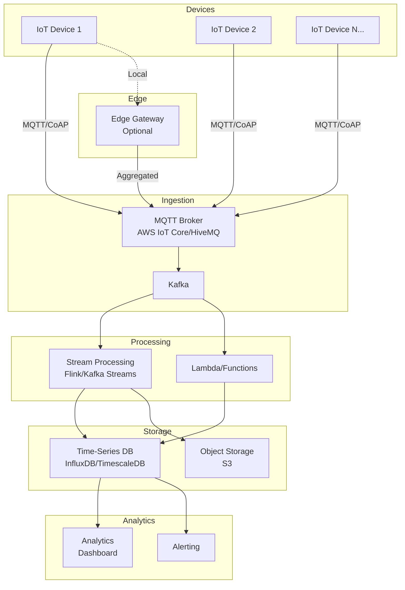
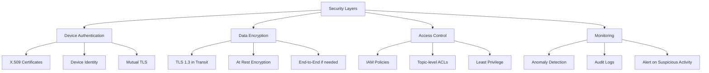

# IOT - Answers

## Question 1: IoT System for Thousands of Devices

📋 **[Back to Question](../sse-topics.md#iot)** | **Topic:** IoT and distributed systems

#### Question
If you were designing an IoT system for thousands of devices sending telemetry data, what would you consider?

#### Comprehensive Answer

Designing an IoT system at scale requires careful consideration of connectivity, data handling, security, and operational concerns. This is a complex distributed systems problem with unique constraints.

---

#### 1. System Architecture Overview



---

#### 2. Communication Protocols

##### MQTT: The Standard for IoT

```yaml
# MQTT Configuration for IoT Devices

Protocol: MQTT v5.0
Transport: TCP with TLS 1.3
Port: 8883 (secure)

Quality of Service Levels:
  QoS 0: At most once (fire and forget)
    Use case: Non-critical sensor readings
    Pros: Minimal overhead, fast
    Cons: No delivery guarantee
    
  QoS 1: At least once (acknowledged)
    Use case: Important telemetry data
    Pros: Guaranteed delivery
    Cons: Possible duplicates
    
  QoS 2: Exactly once (assured)
    Use case: Critical commands
    Pros: No duplicates
    Cons: Higher overhead

Topic Structure:
  devices/{device_id}/telemetry/{sensor_type}
  devices/{device_id}/commands
  devices/{device_id}/status
```

##### Example: MQTT Client Implementation

```python
# Python MQTT client for IoT device
import paho.mqtt.client as mqtt
import json
import time
import ssl
from datetime import datetime

class IoTDevice:
    def __init__(self, device_id, broker_url, port=8883):
        self.device_id = device_id
        self.broker_url = broker_url
        self.port = port
        self.client = mqtt.Client(client_id=device_id)
        
        # Configure TLS for secure connection
        self.client.tls_set(
            ca_certs="/path/to/ca.crt",
            certfile="/path/to/device.crt",
            keyfile="/path/to/device.key",
            tls_version=ssl.PROTOCOL_TLSv1_2
        )
        
        # Set callbacks
        self.client.on_connect = self.on_connect
        self.client.on_disconnect = self.on_disconnect
        self.client.on_message = self.on_message
        
        # Local buffer for offline data
        self.offline_buffer = []
        self.max_buffer_size = 1000
    
    def on_connect(self, client, userdata, flags, rc):
        """Called when device connects to broker"""
        if rc == 0:
            print(f"Connected to MQTT broker")
            # Subscribe to commands topic
            self.client.subscribe(f"devices/{self.device_id}/commands")
            
            # Send buffered data if any
            self.flush_offline_buffer()
        else:
            print(f"Connection failed with code {rc}")
    
    def on_disconnect(self, client, userdata, rc):
        """Handle disconnection"""
        if rc != 0:
            print("Unexpected disconnection, will retry...")
    
    def on_message(self, client, userdata, msg):
        """Handle incoming commands"""
        try:
            command = json.loads(msg.payload.decode())
            self.handle_command(command)
        except Exception as e:
            print(f"Error processing command: {e}")
    
    def send_telemetry(self, sensor_data):
        """Send sensor data with offline buffering"""
        payload = {
            'device_id': self.device_id,
            'timestamp': datetime.utcnow().isoformat(),
            'data': sensor_data
        }
        
        topic = f"devices/{self.device_id}/telemetry"
        
        try:
            # QoS 1 for guaranteed delivery
            result = self.client.publish(
                topic,
                json.dumps(payload),
                qos=1,
                retain=False
            )
            
            if result.rc != mqtt.MQTT_ERR_SUCCESS:
                # Connection issue, buffer data
                self.buffer_offline_data(payload)
        except Exception as e:
            print(f"Error sending telemetry: {e}")
            self.buffer_offline_data(payload)
    
    def buffer_offline_data(self, payload):
        """Buffer data when offline"""
        if len(self.offline_buffer) < self.max_buffer_size:
            self.offline_buffer.append(payload)
        else:
            # Buffer full, drop oldest data
            self.offline_buffer.pop(0)
            self.offline_buffer.append(payload)
    
    def flush_offline_buffer(self):
        """Send buffered data when reconnected"""
        while self.offline_buffer:
            payload = self.offline_buffer.pop(0)
            topic = f"devices/{self.device_id}/telemetry"
            self.client.publish(topic, json.dumps(payload), qos=1)
            time.sleep(0.1)  # Rate limit to avoid overwhelming
    
    def connect(self):
        """Connect to broker with auto-reconnect"""
        self.client.connect(self.broker_url, self.port, keepalive=60)
        self.client.loop_start()  # Start background thread

# Usage
device = IoTDevice("sensor-001", "mqtt.example.com")
device.connect()

# Send telemetry
while True:
    sensor_data = {
        'temperature': read_temperature(),
        'humidity': read_humidity(),
        'battery': read_battery_level()
    }
    device.send_telemetry(sensor_data)
    time.sleep(60)  # Send every minute
```

##### Alternative Protocols

```markdown
## Protocol Comparison

**MQTT:**
- ✅ Lightweight, low bandwidth
- ✅ Designed for IoT
- ✅ Publish/subscribe model
- ❌ Not HTTP-friendly

**CoAP (Constrained Application Protocol):**
- ✅ Very lightweight (UDP-based)
- ✅ RESTful API style
- ✅ Good for constrained devices
- ❌ Less mature ecosystem

**HTTP/REST:**
- ✅ Simple, well-understood
- ✅ Easy debugging
- ❌ Higher overhead
- ❌ Not ideal for battery-powered devices

**Recommendation:**
MQTT for most IoT scenarios, CoAP for extremely constrained devices
```

---

#### 3. Data Ingestion and Processing

##### MQTT Broker Selection

```yaml
# Broker Comparison

AWS IoT Core:
  Pros:
    - Fully managed
    - Integrated with AWS services
    - Device registry and certificates
    - Rules engine for routing
  Cons:
    - AWS vendor lock-in
    - Can be expensive at scale
  Best for: AWS-heavy infrastructure

HiveMQ:
  Pros:
    - High performance
    - Enterprise features
    - Clustering support
  Cons:
    - Self-hosted complexity
    - License costs
  Best for: On-premise or hybrid

Eclipse Mosquitto:
  Pros:
    - Open source
    - Lightweight
    - Easy to deploy
  Cons:
    - Limited clustering
    - Manual scaling
  Best for: Small to medium scale
```

##### Stream Processing Architecture

```java
// Kafka Streams processing for IoT telemetry
import org.apache.kafka.streams.*;
import org.apache.kafka.streams.kstream.*;
import java.time.Duration;

public class IoTStreamProcessor {
    
    public static void main(String[] args) {
        StreamsBuilder builder = new StreamsBuilder();
        
        // Input stream: Raw telemetry from MQTT bridge
        KStream<String, TelemetryData> telemetry = builder.stream(
            "iot-telemetry-raw",
            Consumed.with(Serdes.String(), new TelemetryDataSerde())
        );
        
        // 1. Filter out invalid data
        KStream<String, TelemetryData> validTelemetry = telemetry
            .filter((key, value) -> 
                value != null && 
                value.getTimestamp() != null &&
                value.getDeviceId() != null
            );
        
        // 2. Detect anomalies (e.g., temperature too high)
        KStream<String, Alert> anomalies = validTelemetry
            .filter((key, value) -> 
                value.getTemperature() > 80.0  // Threshold
            )
            .mapValues(telemetry -> new Alert(
                telemetry.getDeviceId(),
                "High temperature detected",
                telemetry.getTemperature()
            ));
        
        // Send alerts to separate topic
        anomalies.to("iot-alerts", Produced.with(Serdes.String(), new AlertSerde()));
        
        // 3. Aggregate data by device (5-minute windows)
        KTable<Windowed<String>, TelemetryStats> aggregated = validTelemetry
            .groupByKey()
            .windowedBy(TimeWindows.of(Duration.ofMinutes(5)))
            .aggregate(
                TelemetryStats::new,  // Initializer
                (key, value, stats) -> {
                    // Aggregation logic
                    stats.addReading(value);
                    return stats;
                },
                Materialized.with(Serdes.String(), new TelemetryStatsSerde())
            );
        
        // Write aggregated data for storage
        aggregated
            .toStream()
            .map((windowedKey, stats) -> 
                KeyValue.pair(windowedKey.key(), stats)
            )
            .to("iot-telemetry-aggregated");
        
        // Start the stream processor
        KafkaStreams streams = new KafkaStreams(builder.build(), getConfig());
        streams.start();
        
        // Graceful shutdown
        Runtime.getRuntime().addShutdownHook(new Thread(streams::close));
    }
}
```

---

#### 4. Data Storage Strategy

##### Time-Series Database Selection

```sql
-- TimescaleDB (PostgreSQL extension) example

-- Create hypertable for telemetry data
CREATE TABLE device_telemetry (
    time TIMESTAMPTZ NOT NULL,
    device_id VARCHAR(50) NOT NULL,
    temperature DOUBLE PRECISION,
    humidity DOUBLE PRECISION,
    battery_level INTEGER,
    signal_strength INTEGER
);

-- Convert to hypertable (automatic partitioning by time)
SELECT create_hypertable('device_telemetry', 'time');

-- Create indexes for common queries
CREATE INDEX idx_device_time ON device_telemetry (device_id, time DESC);

-- Automatic data retention policy (keep 90 days)
SELECT add_retention_policy('device_telemetry', INTERVAL '90 days');

-- Continuous aggregate for hourly averages
CREATE MATERIALIZED VIEW device_telemetry_hourly
WITH (timescaledb.continuous) AS
SELECT 
    time_bucket('1 hour', time) AS hour,
    device_id,
    AVG(temperature) as avg_temperature,
    AVG(humidity) as avg_humidity,
    AVG(battery_level) as avg_battery,
    COUNT(*) as reading_count
FROM device_telemetry
GROUP BY hour, device_id;

-- Automatically refresh every hour
SELECT add_continuous_aggregate_policy('device_telemetry_hourly',
    start_offset => INTERVAL '2 hours',
    end_offset => INTERVAL '1 hour',
    schedule_interval => INTERVAL '1 hour');

-- Query: Get last 24 hours for device
SELECT 
    time,
    temperature,
    humidity,
    battery_level
FROM device_telemetry
WHERE device_id = 'sensor-001'
  AND time > NOW() - INTERVAL '24 hours'
ORDER BY time DESC;

-- Query: Devices with low battery
SELECT DISTINCT ON (device_id)
    device_id,
    battery_level,
    time
FROM device_telemetry
WHERE time > NOW() - INTERVAL '1 hour'
ORDER BY device_id, time DESC;
```

##### Cold Storage Strategy

```python
# Data lifecycle management
class IoTDataLifecycle:
    """
    Hot data (0-7 days): TimescaleDB - Fast queries
    Warm data (7-90 days): TimescaleDB compressed - Cost-effective
    Cold data (90+ days): S3 - Archival
    """
    
    def __init__(self, timescaledb_conn, s3_client):
        self.db = timescaledb_conn
        self.s3 = s3_client
    
    def archive_old_data(self):
        """Archive data older than 90 days to S3"""
        cutoff_date = datetime.now() - timedelta(days=90)
        
        # Export to Parquet for efficient storage
        query = """
            SELECT * FROM device_telemetry
            WHERE time < %s
            ORDER BY time
        """
        
        df = pd.read_sql(query, self.db, params=[cutoff_date])
        
        # Write to Parquet (columnar format)
        parquet_file = f"telemetry-archive-{cutoff_date.strftime('%Y-%m')}.parquet"
        df.to_parquet(parquet_file, compression='gzip')
        
        # Upload to S3
        self.s3.upload_file(
            parquet_file,
            'iot-telemetry-archive',
            f"year={cutoff_date.year}/month={cutoff_date.month}/{parquet_file}"
        )
        
        # Delete from TimescaleDB
        self.db.execute(
            "DELETE FROM device_telemetry WHERE time < %s",
            [cutoff_date]
        )
```

---

#### 5. Device Management

##### Device Registry

```python
# Device registry and authentication
from sqlalchemy import Column, String, DateTime, Boolean, JSON
from sqlalchemy.ext.declarative import declarative_base

Base = declarative_base()

class Device(Base):
    __tablename__ = 'devices'
    
    device_id = Column(String(50), primary_key=True)
    device_type = Column(String(50))  # sensor, gateway, actuator
    firmware_version = Column(String(20))
    last_seen = Column(DateTime)
    status = Column(String(20))  # online, offline, maintenance
    location = Column(JSON)  # {'lat': 37.7749, 'lon': -122.4194}
    metadata = Column(JSON)  # Flexible storage
    certificate_arn = Column(String(255))  # AWS IoT certificate
    is_active = Column(Boolean, default=True)
    created_at = Column(DateTime)
    updated_at = Column(DateTime)

class DeviceManager:
    def __init__(self, db_session, iot_client):
        self.db = db_session
        self.iot = iot_client
    
    def provision_device(self, device_id, device_type):
        """Provision new IoT device with certificates"""
        # Create device certificate
        cert_response = self.iot.create_keys_and_certificate(setAsActive=True)
        
        # Store device in registry
        device = Device(
            device_id=device_id,
            device_type=device_type,
            status='provisioned',
            certificate_arn=cert_response['certificateArn'],
            created_at=datetime.utcnow()
        )
        self.db.add(device)
        self.db.commit()
        
        # Return credentials for device
        return {
            'device_id': device_id,
            'certificate_pem': cert_response['certificatePem'],
            'private_key': cert_response['keyPair']['PrivateKey'],
            'mqtt_endpoint': self.iot.describe_endpoint()['endpointAddress']
        }
    
    def update_device_status(self, device_id, status):
        """Update device status"""
        device = self.db.query(Device).filter_by(device_id=device_id).first()
        if device:
            device.status = status
            device.last_seen = datetime.utcnow()
            self.db.commit()
    
    def get_offline_devices(self, threshold_minutes=10):
        """Find devices that haven't reported recently"""
        cutoff = datetime.utcnow() - timedelta(minutes=threshold_minutes)
        return self.db.query(Device).filter(
            Device.last_seen < cutoff,
            Device.status == 'online'
        ).all()
```

##### Over-The-Air (OTA) Updates

```yaml
# OTA Update Strategy

Approach:
  1. Staged rollout (10% → 50% → 100%)
  2. Rollback capability
  3. Download during low-usage hours
  4. Resume interrupted downloads

Implementation:
  - Store firmware in S3/CDN
  - Publish update notification via MQTT
  - Device downloads when ready
  - Report progress and result
  
Safety:
  - Checksum verification
  - Dual partition (active + update)
  - Automatic rollback on boot failure
```

---

#### 6. Security Considerations



##### Security Implementation

```python
# Security best practices for IoT

class IoTSecurity:
    """Security utilities for IoT system"""
    
    @staticmethod
    def validate_device_identity(certificate, device_id):
        """Verify device certificate matches claimed identity"""
        # Extract Common Name from certificate
        cert_device_id = certificate.subject.get_attributes_for_oid(
            NameOID.COMMON_NAME
        )[0].value
        
        return cert_device_id == device_id
    
    @staticmethod
    def detect_anomalous_behavior(device_id, telemetry_rate):
        """Detect potential compromised devices"""
        # Normal: 1 message per minute
        # Suspicious: >100 messages per minute (DDoS attempt?)
        if telemetry_rate > 100:
            return {
                'is_anomalous': True,
                'reason': 'Excessive message rate',
                'action': 'throttle_or_block'
            }
        return {'is_anomalous': False}
    
    @staticmethod
    def rotate_credentials(device_id):
        """Periodic credential rotation"""
        # Generate new certificate
        # Publish to device via secure channel
        # Deactivate old certificate after grace period
        pass
```

---

#### 7. Scalability Considerations

```markdown
## Scaling Dimensions

**Horizontal Scaling:**
- MQTT broker: Cluster with load balancer
- Kafka: Add brokers and partitions
- Stream processing: Increase parallelism
- Database: Read replicas, sharding

**Vertical Scaling:**
- Increase broker instance size
- More memory for caching
- Faster disks for database

**Data Volume Management:**
- Downsampling: Store aggregates for old data
- Compression: TimescaleDB native compression
- Archival: Move to S3 after retention period

**Cost Optimization:**
- Use reserved instances
- Spot instances for batch processing
- Data tiering (hot/warm/cold)
- Optimize message payload size
```

---

#### 8. Monitoring and Alerting

```python
# Monitoring dashboard metrics

iot_metrics = {
    'device_health': {
        'total_devices': 50000,
        'online_devices': 48500,
        'offline_devices': 1500,
        'devices_with_low_battery': 250
    },
    'data_ingestion': {
        'messages_per_second': 5000,
        'bytes_per_second': 2500000,
        'avg_message_size': 500,
        'p95_latency_ms': 120
    },
    'errors': {
        'authentication_failures': 5,
        'malformed_messages': 12,
        'broker_errors': 0
    },
    'storage': {
        'database_size_gb': 500,
        'growth_rate_gb_per_day': 10,
        'query_p95_ms': 50
    }
}

# Alerts
alerts = [
    {
        'condition': 'offline_devices > 5% of total',
        'severity': 'warning',
        'action': 'investigate_connectivity'
    },
    {
        'condition': 'authentication_failures > 100/minute',
        'severity': 'critical',
        'action': 'possible_attack'
    },
    {
        'condition': 'database_size > 80% of capacity',
        'severity': 'warning',
        'action': 'scale_or_archive'
    }
]
```

---

#### 9. Complete Example: Temperature Monitoring System

```python
# End-to-end IoT system for temperature monitoring

from dataclasses import dataclass
from typing import List
import asyncio

@dataclass
class TemperatureReading:
    device_id: str
    timestamp: datetime
    temperature: float
    location: dict

class IoTTemperatureSystem:
    """Complete system for temperature monitoring"""
    
    def __init__(self):
        self.mqtt_broker = MQTTBroker()
        self.stream_processor = StreamProcessor()
        self.database = TimescaleDB()
        self.alert_service = AlertService()
    
    async def process_temperature_reading(self, reading: TemperatureReading):
        """Process incoming temperature reading"""
        # 1. Validate
        if not self.is_valid_reading(reading):
            logger.warning(f"Invalid reading from {reading.device_id}")
            return
        
        # 2. Store in database
        await self.database.insert(reading)
        
        # 3. Check for alerts
        if reading.temperature > 30:  # Threshold
            await self.alert_service.send_alert(
                f"High temperature detected: {reading.temperature}°C",
                severity="warning",
                device_id=reading.device_id
            )
        
        # 4. Update device status
        await self.update_device_last_seen(reading.device_id)
    
    def is_valid_reading(self, reading: TemperatureReading) -> bool:
        """Validate reading"""
        return (
            -50 <= reading.temperature <= 100 and  # Reasonable range
            reading.timestamp is not None and
            reading.device_id is not None
        )
```

---

#### 10. Key Takeaways

```markdown
## IoT System Design Checklist

**Protocol:**
- [ ] Use MQTT for low-bandwidth, reliable messaging
- [ ] Configure appropriate QoS levels
- [ ] Plan topic structure for scalability

**Data Handling:**
- [ ] Stream processing for real-time analytics
- [ ] Time-series database for telemetry storage
- [ ] Data lifecycle management (hot/warm/cold)

**Device Management:**
- [ ] Device registry for inventory
- [ ] OTA update capability
- [ ] Health monitoring and alerting

**Security:**
- [ ] X.509 certificates for authentication
- [ ] TLS encryption for data in transit
- [ ] Least privilege access control
- [ ] Anomaly detection

**Scalability:**
- [ ] Horizontal scaling for all components
- [ ] Data aggregation and downsampling
- [ ] Efficient storage with compression

**Operations:**
- [ ] Comprehensive monitoring dashboard
- [ ] Alerting for critical issues
- [ ] Automated remediation where possible
```

---

