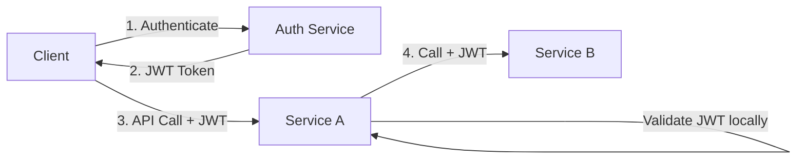
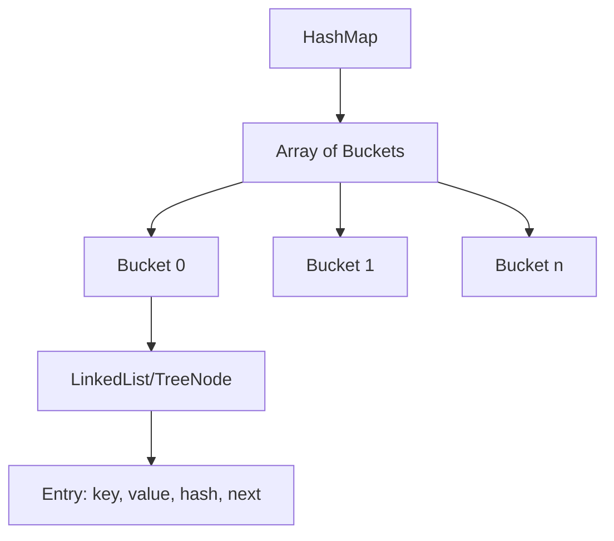
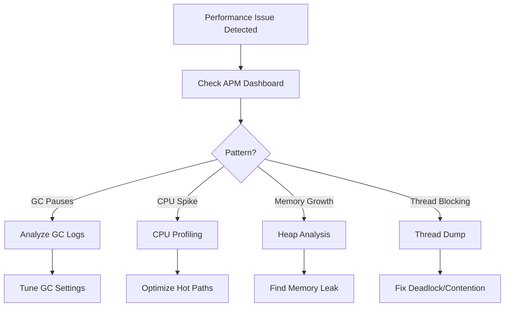
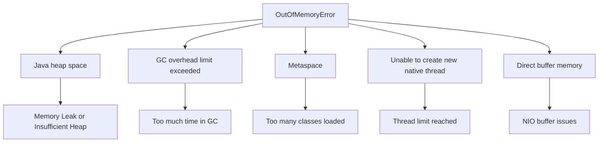
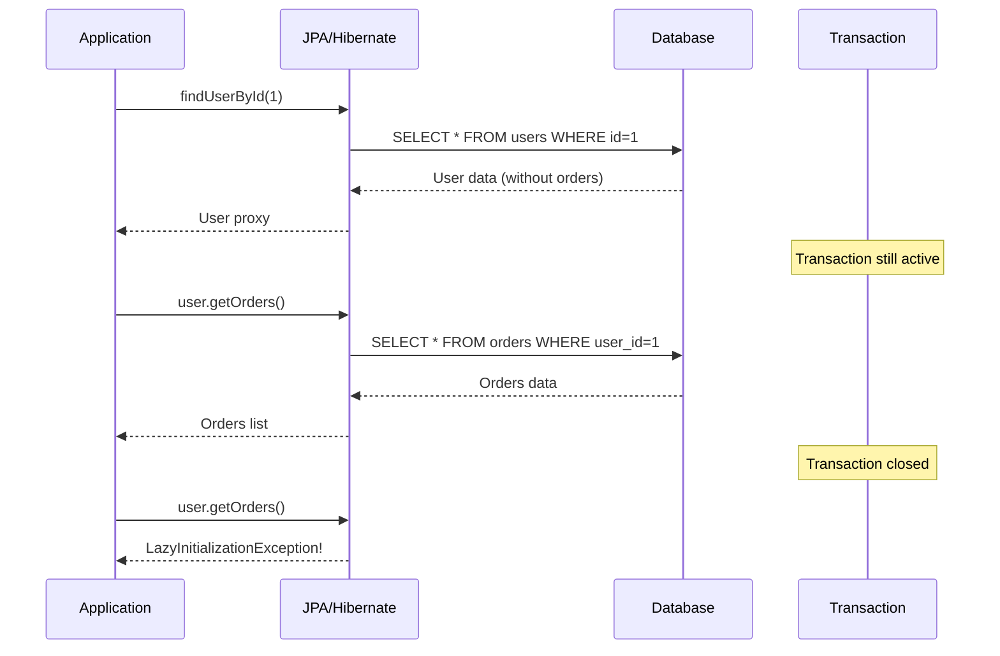
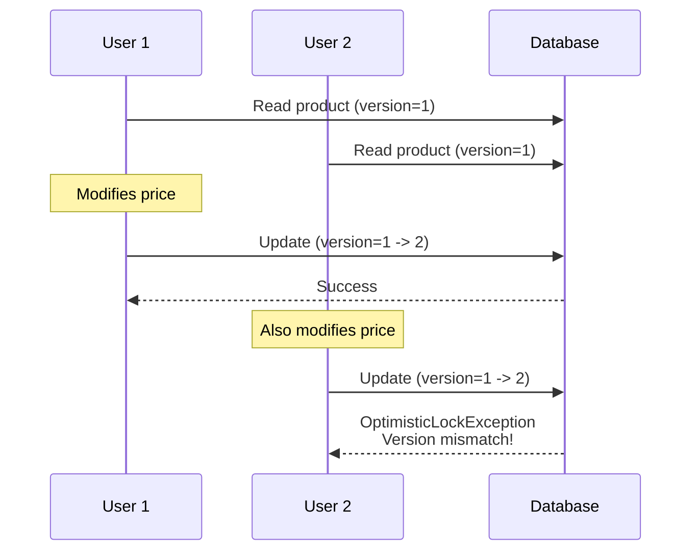

# Java - Answers

## Question 1: OAuth 2.0 vs JWT for Microservices

📋 **[Back to Question](../sse-topics.md#java)**

**Key Understanding:** OAuth 2.0 is a framework, JWT is a token format - use both together!



**Best Practice:** Use OAuth 2.0 authorization framework with JWT as token format. Short-lived JWT (15min) + long-lived refresh token in Redis (7 days).

---

## Question 2: Exception Handling Best Practices

📋 **[Back to Question](../sse-topics.md#java)**

**Problem:** Catching generic `Exception` hides root causes and prevents proper error recovery.

**Solution:**
```java
// ✅ GOOD
try {
    processPayment(order);
} catch (PaymentDeclinedException e) {
    return OrderResult.paymentFailed(e.getReason());
} catch (InsufficientFundsException e) {
    notifyCustomer(order, "Please add funds");
} catch (OutOfStockException e) {
    refundPayment();
    return OrderResult.outOfStock();
}
```

**Key Points:**
- Catch specific exceptions first
- Add context when rethrowing
- Use try-with-resources for resource management
- Create domain-specific exception hierarchies

---

## Question 3: Strategy Pattern Implementation

📋 **[Back to Question](../sse-topics.md#java)**

```java
// Strategy interface
public interface PaymentStrategy {
    PaymentResult process(Payment payment);
}

// Concrete strategies
public class CreditCardStrategy implements PaymentStrategy {
    public PaymentResult process(Payment payment) {
        // Credit card processing logic
    }
}

public class PayPalStrategy implements PaymentStrategy {
    public PaymentResult process(Payment payment) {
        // PayPal processing logic
    }
}

// Context
public class PaymentProcessor {
    private PaymentStrategy strategy;
    
    public void setStrategy(PaymentStrategy strategy) {
        this.strategy = strategy;
    }
    
    public PaymentResult process(Payment payment) {
        return strategy.process(payment);
    }
}
```

**When to Use:** When you have multiple algorithms for the same task and want to switch between them at runtime. Follows Open/Closed Principle.

---

## Question 4: HashMap Internals

📋 **[Back to Question](../sse-topics.md#java)**



**Key Concepts:**
- **Initial capacity:** 16, **Load factor:** 0.75
- **Hash collision:** Handled via linked list (< 8 entries) or red-black tree (≥ 8 entries) since Java 8
- **Resize:** When size > capacity * loadFactor, array doubles
- **Time complexity:** O(1) average, O(log n) worst case with tree

---

## Question 5: Thread Safety with Collections

📋 **[Back to Question](../sse-topics.md#java)**

**Problem:** Multiple threads accessing shared `ArrayList` causes `ConcurrentModificationException` and data corruption.

**Solutions:**
```java
// Option 1: CopyOnWriteArrayList
List<String> list = new CopyOnWriteArrayList<>(); // Good for read-heavy

// Option 2: Synchronized wrapper
List<String> list = Collections.synchronizedList(new ArrayList<>());

// Option 3: Explicit synchronization
synchronized(list) {
    list.add(item);
}

// Option 4: Concurrent collections
ConcurrentHashMap<K, V> map = new ConcurrentHashMap<>();
```

---

## Question 6: Java 17 Features in Production

📋 **[Back to Question](../sse-topics.md#java)**

**Detailed Answer:**

Java 17 is a Long-Term Support (LTS) release with several practical features for production:

#### 1. Records (JEP 395)

```java
// Before: Boilerplate class
public class UserDTO {
    private final String name;
    private final String email;
    
    public UserDTO(String name, String email) {
        this.name = name;
        this.email = email;
    }
    
    // getters, equals, hashCode, toString...
}

// ✅ With Records
public record UserDTO(String name, String email) {}

// Usage
UserDTO user = new UserDTO("John", "john@example.com");
String name = user.name(); // Accessor method
```

**Use Case:** DTOs, immutable data carriers, API responses

#### 2. Sealed Classes (JEP 409)

```java
// Define restricted inheritance hierarchy
public sealed interface PaymentMethod 
    permits CreditCard, PayPal, BankTransfer {}

public final class CreditCard implements PaymentMethod {
    private String cardNumber;
}

public final class PayPal implements PaymentMethod {
    private String email;
}

public final class BankTransfer implements PaymentMethod {
    private String accountNumber;
}

// Pattern matching with sealed types
public double calculateFee(PaymentMethod payment) {
    return switch(payment) {
        case CreditCard c -> 2.9;
        case PayPal p -> 3.5;
        case BankTransfer b -> 0.5;
        // No default needed - compiler knows all cases!
    };
}
```

**Use Case:** Domain modeling, state machines, exhaustive pattern matching

#### 3. Pattern Matching for switch (Preview)

```java
// Before
public String formatValue(Object obj) {
    if (obj instanceof String) {
        String s = (String) obj;
        return s.toUpperCase();
    } else if (obj instanceof Integer) {
        Integer i = (Integer) obj;
        return String.valueOf(i * 2);
    }
    return obj.toString();
}

// ✅ With Pattern Matching
public String formatValue(Object obj) {
    return switch(obj) {
        case String s -> s.toUpperCase();
        case Integer i -> String.valueOf(i * 2);
        case null -> "null";
        default -> obj.toString();
    };
}
```

#### 4. Text Blocks (JEP 378)

```java
// Before: Escaped strings
String json = "{\"name\":\"John\",\"age\":30}";

// ✅ With Text Blocks
String json = """
    {
        "name": "John",
        "age": 30
    }
    """;

// SQL queries
String query = """
    SELECT u.id, u.name, o.total
    FROM users u
    JOIN orders o ON u.id = o.user_id
    WHERE u.status = 'active'
    """;
```

**Use Case:** SQL queries, JSON/XML templates, HTML snippets

#### 5. Enhanced Pseudo-Random Number Generators

```java
// Better random number generation
RandomGenerator generator = RandomGenerator.of("L64X128MixRandom");
int random = generator.nextInt(1, 100);
```

**Production Recommendation:**
- ✅ **Use:** Records, Text Blocks, Sealed Classes
- ⚠️ **Evaluate:** Pattern matching (preview features)
- 📊 **Monitor:** Performance with new GC improvements

---

## Question 7: Java Performance Debugging

📋 **[Back to Question](../sse-topics.md#java)**

**Detailed Answer:**

#### Scenario: API response time degraded from 200ms to 3s

**Debugging Process:**



#### Step 1: Enable JVM Diagnostic Tools

```bash
# Enable GC logging
java -Xlog:gc*:file=gc.log:time,uptime:filecount=5,filesize=10M \
     -XX:+HeapDumpOnOutOfMemoryError \
     -XX:HeapDumpPath=/var/log/heapdump.hprof \
     -jar app.jar
```

#### Step 2: Take Thread Dump

```bash
# Get JVM process ID
jps -l

# Take thread dump
jstack <pid> > threaddump.txt

# Or multiple dumps for analysis
for i in {1..5}; do jstack <pid> > threaddump_$i.txt; sleep 5; done
```

**Analyze for:**
- Deadlocks
- Thread contention (BLOCKED threads)
- High number of WAITING threads

#### Step 3: Heap Dump Analysis

```bash
# Generate heap dump
jmap -dump:live,format=b,file=heap.bin <pid>

# Analyze with Eclipse MAT or JProfiler
```

**Look for:**
- Objects with high retained heap
- Duplicate strings
- Large collections
- Memory leak patterns

#### Step 4: CPU Profiling

```java
// Using JFR (Java Flight Recorder)
jcmd <pid> JFR.start name=profile duration=60s filename=profile.jfr
jcmd <pid> JFR.dump name=profile filename=profile.jfr
jcmd <pid> JFR.stop name=profile
```

**Tools Used:**
1. **VisualVM** - Real-time monitoring, profiling
2. **JProfiler** - Advanced profiling, memory analysis
3. **YourKit** - CPU and memory profiling
4. **Eclipse MAT** - Heap dump analysis
5. **Java Mission Control** - JFR analysis
6. **APM Tools** - New Relic, Datadog, Dynatrace

#### Common Findings & Solutions:

**Finding 1: Frequent Full GCs**
```bash
# Solution: Tune heap size
-Xms4g -Xmx4g  # Same min/max to avoid resizing
-XX:+UseG1GC   # Use G1 collector
-XX:MaxGCPauseMillis=200
```

**Finding 2: Hot Method in Profiler**
```java
// Before: Inefficient string concatenation
String result = "";
for (String s : list) {
    result += s + ",";  // Creates new String each iteration!
}

// ✅ After: Use StringBuilder
StringBuilder sb = new StringBuilder();
for (String s : list) {
    sb.append(s).append(",");
}
String result = sb.toString();
```

**Finding 3: Database Connection Pool Exhaustion**
```yaml
# Increase pool size in application.yml
spring:
  datasource:
    hikari:
      maximum-pool-size: 20
      connection-timeout: 30000
      idle-timeout: 600000
```

---

## Question 8: Custom Annotations with Reflection

📋 **[Back to Question](../sse-topics.md#java)**

**Detailed Answer:**

#### Custom Annotation Design

```java
// 1. Define annotation
@Retention(RetentionPolicy.RUNTIME)  // Available at runtime
@Target(ElementType.FIELD)           // Can be applied to fields
public @interface Validate {
    String message() default "Validation failed";
    int minLength() default 0;
    int maxLength() default Integer.MAX_VALUE;
    String regex() default "";
}

// 2. Apply annotation
public class UserRegistrationRequest {
    
    @Validate(minLength = 3, maxLength = 50, 
              message = "Name must be between 3 and 50 characters")
    private String name;
    
    @Validate(regex = "^[A-Za-z0-9+_.-]+@(.+)$",
              message = "Invalid email format")
    private String email;
    
    @Validate(minLength = 8, 
              message = "Password must be at least 8 characters")
    private String password;
    
    // getters and setters
}

// 3. Process annotation with reflection
public class Validator {
    
    public static List<String> validate(Object obj) {
        List<String> errors = new ArrayList<>();
        
        // Get all fields
        Field[] fields = obj.getClass().getDeclaredFields();
        
        for (Field field : fields) {
            // Check if field has @Validate annotation
            if (field.isAnnotationPresent(Validate.class)) {
                Validate validation = field.getAnnotation(Validate.class);
                field.setAccessible(true);
                
                try {
                    String value = (String) field.get(obj);
                    
                    // Validate min length
                    if (value != null && value.length() < validation.minLength()) {
                        errors.add(validation.message());
                    }
                    
                    // Validate max length
                    if (value != null && value.length() > validation.maxLength()) {
                        errors.add(validation.message());
                    }
                    
                    // Validate regex
                    if (!validation.regex().isEmpty() && value != null) {
                        if (!value.matches(validation.regex())) {
                            errors.add(validation.message());
                        }
                    }
                    
                } catch (IllegalAccessException e) {
                    errors.add("Cannot access field: " + field.getName());
                }
            }
        }
        
        return errors;
    }
}

// 4. Usage
public class Main {
    public static void main(String[] args) {
        UserRegistrationRequest request = new UserRegistrationRequest();
        request.setName("Jo");  // Too short
        request.setEmail("invalid-email");
        request.setPassword("12345");  // Too short
        
        List<String> errors = Validator.validate(request);
        errors.forEach(System.out::println);
    }
}
```

#### Practical Use Cases:

**1. Custom Logging**
```java
@Retention(RetentionPolicy.RUNTIME)
@Target(ElementType.METHOD)
public @interface LogExecutionTime {}

// AOP aspect to process
@Aspect
@Component
public class LoggingAspect {
    
    @Around("@annotation(LogExecutionTime)")
    public Object logExecutionTime(ProceedingJoinPoint joinPoint) throws Throwable {
        long start = System.currentTimeMillis();
        Object result = joinPoint.proceed();
        long duration = System.currentTimeMillis() - start;
        
        log.info("{} executed in {} ms", 
                joinPoint.getSignature(), duration);
        return result;
    }
}
```

**2. API Rate Limiting**
```java
@Retention(RetentionPolicy.RUNTIME)
@Target(ElementType.METHOD)
public @interface RateLimit {
    int requests() default 100;
    int perSeconds() default 60;
}

@RestController
public class ApiController {
    
    @RateLimit(requests = 10, perSeconds = 60)
    @GetMapping("/api/data")
    public ResponseEntity<Data> getData() {
        return ResponseEntity.ok(data);
    }
}
```

**3. Database Column Mapping**
```java
@Retention(RetentionPolicy.RUNTIME)
@Target(ElementType.FIELD)
public @interface Column {
    String name();
    boolean nullable() default true;
}

public class User {
    @Column(name = "user_id", nullable = false)
    private Long id;
    
    @Column(name = "user_name")
    private String name;
}
```

**Performance Considerations:**
- Reflection is slower than direct access
- Cache reflection results when possible
- Use annotation processing (compile-time) for better performance
- Consider AspectJ for production-grade AOP

---

## Question 9: OutOfMemoryError Diagnosis

📋 **[Back to Question](../sse-topics.md#java)**

**Detailed Answer:**

#### Types of OutOfMemoryError



#### Diagnostic Process

**Step 1: Enable Heap Dump on OOM**
```bash
java -Xmx2g \
     -XX:+HeapDumpOnOutOfMemoryError \
     -XX:HeapDumpPath=/var/log/heapdump.hprof \
     -XX:+PrintGCDetails \
     -XX:+PrintGCTimeStamps \
     -Xlog:gc*:file=gc.log \
     -jar app.jar
```

**Step 2: Analyze Heap Dump with Eclipse MAT**

```bash
# Download and analyze heap dump
./mat.sh /path/to/heapdump.hprof
```

**Look for:**
1. **Leak Suspects Report** - Automatically identifies potential leaks
2. **Dominator Tree** - Objects consuming most memory
3. **Histogram** - Object count by class
4. **Thread Overview** - Memory per thread

#### Distinguishing Memory Leak vs Insufficient Heap

**Memory Leak Indicators:**
```
✗ Heap usage grows over time and never decreases
✗ OOM happens at unpredictable times
✗ Memory usage doesn't correlate with load
✗ Same object types accumulate (e.g., 10M String objects)
```

**Insufficient Heap Indicators:**
```
✓ OOM happens during peak load
✓ Heap usage is stable during normal operation
✓ Large spike in legitimate objects (e.g., bulk processing)
✓ GC frees significant memory between requests
```

#### Analysis Example

```java
// Common Memory Leak: Static Collection
public class CacheManager {
    // ❌ Grows unbounded!
    private static Map<String, Object> cache = new HashMap<>();
    
    public static void put(String key, Object value) {
        cache.put(key, value);  // Never removes old entries!
    }
}

// ✅ Fix: Use bounded cache
public class CacheManager {
    private static final Cache<String, Object> cache = 
        CacheBuilder.newBuilder()
            .maximumSize(10000)
            .expireAfterWrite(1, TimeUnit.HOURS)
            .build();
    
    public static void put(String key, Object value) {
        cache.put(key, value);
    }
}
```

**GC Log Analysis:**
```bash
# Parse GC logs
gcviewer gc.log

# Look for:
# 1. Heap usage before/after GC
# 2. GC frequency increasing
# 3. Full GC not reclaiming much memory (leak!)
```

**Example GC Log Pattern (Memory Leak):**
```
[GC] Heap: 1.8G -> 1.7G  (200MB freed)  <-- Leak!
[GC] Heap: 1.9G -> 1.8G  (100MB freed)  <-- Getting worse
[GC] Heap: 1.95G -> 1.9G (50MB freed)   <-- Approaching limit
[Full GC] 2.0G -> 1.95G  (50MB freed)   <-- OOM soon!
```

**Example GC Log Pattern (Insufficient Heap):**
```
[GC] Heap: 1.8G -> 200MB  (1.6GB freed)  <-- Normal
[GC] Heap: 1.9G -> 150MB  (1.75GB freed) <-- GC working well
[Spike] Heap: 2.0G -> OOM               <-- Legitimate spike
```

#### Common Memory Leak Causes

**1. Unclosed Resources**
```java
// ❌ Leak: Connection not closed
public void query() {
    Connection conn = dataSource.getConnection();
    // Exception occurs, connection leaks!
}

// ✅ Fix: Try-with-resources
public void query() {
    try (Connection conn = dataSource.getConnection()) {
        // Auto-closed even if exception
    }
}
```

**2. Event Listeners Not Removed**
```java
// ❌ Leak: Listener keeps reference
public class MyComponent {
    public MyComponent() {
        eventBus.register(this);
    }
    // Never unregistered!
}

// ✅ Fix: Unregister in cleanup
@PreDestroy
public void cleanup() {
    eventBus.unregister(this);
}
```

**3. ThreadLocal Not Cleaned**
```java
// ❌ Leak in thread pools
private static ThreadLocal<UserContext> context = new ThreadLocal<>();

public void handleRequest() {
    context.set(new UserContext());
    // Never removed! Thread reuse causes accumulation
}

// ✅ Fix: Always remove
public void handleRequest() {
    try {
        context.set(new UserContext());
        // Process request
    } finally {
        context.remove();  // Critical!
    }
}
```

#### Tools for Analysis

1. **Eclipse MAT** - Heap dump analysis
2. **JProfiler** - Live profiling
3. **VisualVM** - JVM monitoring
4. **YourKit** - Memory profiling
5. **JConsole** - Basic JMX monitoring
6. **GCViewer** - GC log visualization

---

## Question 10: JPA Lazy Loading

📋 **[Back to Question](../sse-topics.md#java)**

**Detailed Answer:**

#### Lazy Loading Concept



#### Entity Setup

```java
@Entity
public class User {
    @Id
    @GeneratedValue(strategy = GenerationType.IDENTITY)
    private Long id;
    
    private String name;
    
    // Lazy loading (default for @OneToMany)
    @OneToMany(mappedBy = "user", fetch = FetchType.LAZY)
    private List<Order> orders;
    
    // Getters and setters
}

@Entity
public class Order {
    @Id
    @GeneratedValue(strategy = GenerationType.IDENTITY)
    private Long id;
    
    private BigDecimal total;
    
    @ManyToOne(fetch = FetchType.LAZY)
    @JoinColumn(name = "user_id")
    private User user;
}
```

#### Common Problems

**Problem 1: LazyInitializationException**

```java
// ❌ Fails: Session closed when accessing lazy property
@Service
public class UserService {
    
    @Transactional
    public User getUser(Long id) {
        return userRepository.findById(id).orElseThrow();
    }
}

@RestController
public class UserController {
    
    @GetMapping("/users/{id}")
    public UserDTO getUser(@PathVariable Long id) {
        User user = userService.getUser(id);
        // Transaction ended! Session closed!
        
        List<Order> orders = user.getOrders(); 
        // LazyInitializationException!
        
        return new UserDTO(user, orders);
    }
}
```

**Solution 1: Eager Fetching with JOIN FETCH**

```java
@Repository
public interface UserRepository extends JpaRepository<User, Long> {
    
    // ✅ Fetch user and orders in single query
    @Query("SELECT u FROM User u LEFT JOIN FETCH u.orders WHERE u.id = :id")
    Optional<User> findByIdWithOrders(@PathVariable Long id);
}

@Service
public class UserService {
    
    @Transactional(readOnly = true)
    public User getUserWithOrders(Long id) {
        return userRepository.findByIdWithOrders(id).orElseThrow();
    }
}
```

**Solution 2: Entity Graph**

```java
@Entity
@NamedEntityGraph(
    name = "User.orders",
    attributeNodes = @NamedAttributeNode("orders")
)
public class User {
    // Entity definition
}

@Repository
public interface UserRepository extends JpaRepository<User, Long> {
    
    @EntityGraph("User.orders")
    Optional<User> findById(Long id);
}
```

**Solution 3: Open Session in View (Not Recommended for APIs)**

```yaml
# application.yml
spring:
  jpa:
    open-in-view: true  # Keep session open until view renders
```

⚠️ **Warning:** Can cause performance issues and unexpected behavior in REST APIs!

**Problem 2: N+1 Query Problem**

```java
// ❌ Generates N+1 queries!
@Transactional
public List<UserDTO> getAllUsersWithOrders() {
    List<User> users = userRepository.findAll();  // 1 query
    
    return users.stream()
        .map(user -> new UserDTO(
            user.getName(),
            user.getOrders().size()  // N queries (one per user)!
        ))
        .collect(Collectors.toList());
}

// SQL Generated:
// SELECT * FROM users;  -- 1 query
// SELECT * FROM orders WHERE user_id = 1;  -- Query for user 1
// SELECT * FROM orders WHERE user_id = 2;  -- Query for user 2
// ... (N more queries)
```

**Solution: Batch Fetching**

```java
@Entity
public class User {
    @OneToMany(mappedBy = "user")
    @BatchSize(size = 10)  // Fetch in batches of 10
    private List<Order> orders;
}

// Or use JOIN FETCH
@Query("SELECT DISTINCT u FROM User u LEFT JOIN FETCH u.orders")
List<User> findAllWithOrders();
```

**Solution: DTO Projection**

```java
// ✅ Single optimized query
@Query("""
    SELECT new com.example.dto.UserDTO(
        u.name, 
        COUNT(o.id)
    )
    FROM User u 
    LEFT JOIN u.orders o 
    GROUP BY u.id, u.name
    """)
List<UserDTO> findAllUsersWithOrderCount();
```

#### Best Practices

**1. Default to Lazy, Fetch Explicitly**
```java
// Keep defaults lazy
@OneToMany(fetch = FetchType.LAZY)  // Default
private List<Order> orders;

// Fetch when needed
@Query("SELECT u FROM User u JOIN FETCH u.orders WHERE u.id = :id")
Optional<User> findByIdWithOrders(@Param("id") Long id);
```

**2. Use Read-Only Transactions**
```java
@Transactional(readOnly = true)  // Optimizes Hibernate
public User getUser(Long id) {
    return userRepository.findById(id).orElseThrow();
}
```

**3. Enable Query Logging in Dev**
```yaml
spring:
  jpa:
    show-sql: true
    properties:
      hibernate:
        format_sql: true
        use_sql_comments: true
logging:
  level:
    org.hibernate.SQL: DEBUG
    org.hibernate.type.descriptor.sql.BasicBinder: TRACE
```

**4. Monitor with Statistics**
```yaml
spring:
  jpa:
    properties:
      hibernate:
        generate_statistics: true
```

---

## Question 11: Optimistic Locking in JPA

📋 **[Back to Question](../sse-topics.md#java)**

**Detailed Answer:**

#### Optimistic Locking Concept



#### Entity Setup

```java
@Entity
public class Product {
    
    @Id
    @GeneratedValue(strategy = GenerationType.IDENTITY)
    private Long id;
    
    private String name;
    
    private BigDecimal price;
    
    @Version  // Optimistic locking
    private Long version;
    
    // Getters and setters
}
```

**Generated SQL:**
```sql
-- Read
SELECT id, name, price, version FROM product WHERE id = 1;
-- Result: id=1, name="Widget", price=99.99, version=5

-- Update
UPDATE product 
SET name = ?, price = ?, version = version + 1 
WHERE id = ? AND version = 5;
-- If 0 rows affected -> OptimisticLockException
```

#### REST API Implementation

```java
// 1. DTO with version
public class ProductDTO {
    private Long id;
    private String name;
    private BigDecimal price;
    private Long version;  // Include in API response
    
    // Getters and setters
}

// 2. Service layer
@Service
public class ProductService {
    
    @Autowired
    private ProductRepository productRepository;
    
    @Transactional
    public ProductDTO updateProduct(Long id, ProductDTO dto) {
        Product product = productRepository.findById(id)
            .orElseThrow(() -> new ResourceNotFoundException("Product not found"));
        
        // Check if version matches
        if (!product.getVersion().equals(dto.getVersion())) {
            throw new OptimisticLockException(
                "Product was modified by another user");
        }
        
        product.setName(dto.getName());
        product.setPrice(dto.getPrice());
        
        Product saved = productRepository.save(product);
        return toDTO(saved);
    }
}

// 3. REST Controller
@RestController
@RequestMapping("/api/products")
public class ProductController {
    
    @Autowired
    private ProductService productService;
    
    @PutMapping("/{id}")
    public ResponseEntity<ProductDTO> updateProduct(
            @PathVariable Long id,
            @RequestBody ProductDTO dto) {
        
        try {
            ProductDTO updated = productService.updateProduct(id, dto);
            return ResponseEntity.ok(updated);
            
        } catch (OptimisticLockException e) {
            // Return 409 Conflict
            return ResponseEntity
                .status(HttpStatus.CONFLICT)
                .header("X-Error-Message", 
                       "Resource was modified by another user")
                .build();
        }
    }
    
    @GetMapping("/{id}")
    public ResponseEntity<ProductDTO> getProduct(@PathVariable Long id) {
        ProductDTO product = productService.getProduct(id);
        return ResponseEntity.ok(product);
    }
}
```

#### Client-Side Handling

```javascript
// JavaScript client
async function updateProduct(productId) {
    // 1. Get latest data with version
    const response = await fetch(`/api/products/${productId}`);
    const product = await response.json();
    // { id: 1, name: "Widget", price: 99.99, version: 5 }
    
    // 2. Modify and send update with version
    product.price = 149.99;
    
    const updateResponse = await fetch(`/api/products/${productId}`, {
        method: 'PUT',
        headers: { 'Content-Type': 'application/json' },
        body: JSON.stringify(product)  // Includes version: 5
    });
    
    if (updateResponse.status === 409) {
        // Conflict! Another user modified it
        alert('Product was modified by another user. Please refresh.');
        // Re-fetch latest data
        location.reload();
    } else if (updateResponse.ok) {
        const updated = await updateResponse.json();
        console.log('Updated successfully', updated);
        // version is now 6
    }
}
```

#### Global Exception Handler

```java
@RestControllerAdvice
public class GlobalExceptionHandler {
    
    @ExceptionHandler(OptimisticLockException.class)
    public ResponseEntity<ErrorResponse> handleOptimisticLock(
            OptimisticLockException ex) {
        
        ErrorResponse error = new ErrorResponse(
            HttpStatus.CONFLICT.value(),
            "Resource was modified by another user",
            "Please refresh and try again"
        );
        
        return ResponseEntity
            .status(HttpStatus.CONFLICT)
            .body(error);
    }
}
```

#### Advanced: Retry Strategy

```java
@Service
public class ProductService {
    
    private static final int MAX_RETRIES = 3;
    
    @Transactional
    public ProductDTO updateProductWithRetry(Long id, ProductUpdateRequest request) {
        int attempts = 0;
        
        while (attempts < MAX_RETRIES) {
            try {
                // Fetch latest version
                Product product = productRepository.findById(id)
                    .orElseThrow(() -> new ResourceNotFoundException());
                
                // Apply changes
                product.setName(request.getName());
                product.setPrice(request.getPrice());
                
                // Save (will increment version)
                Product saved = productRepository.save(product);
                return toDTO(saved);
                
            } catch (OptimisticLockException e) {
                attempts++;
                if (attempts >= MAX_RETRIES) {
                    throw new RetryExceededException(
                        "Failed after " + MAX_RETRIES + " attempts");
                }
                // Wait before retry
                Thread.sleep(100 * attempts);  // Exponential backoff
            }
        }
        
        throw new RuntimeException("Unexpected error");
    }
}
```

#### Optimistic vs Pessimistic Locking

**Optimistic Locking** (Default choice)
```java
@Version
private Long version;

// ✅ Pros: Better concurrency, no locks held
// ❌ Cons: Conflicts require retry logic
// Use when: Conflicts are rare
```

**Pessimistic Locking** (Use sparingly)
```java
@Lock(LockModeType.PESSIMISTIC_WRITE)
@Query("SELECT p FROM Product p WHERE p.id = :id")
Optional<Product> findByIdWithLock(@Param("id") Long id);

// ✅ Pros: Guarantees no conflicts
// ❌ Cons: Reduced concurrency, potential deadlocks
// Use when: Must prevent all conflicts (e.g., inventory)
```

#### Testing Concurrent Updates

```java
@SpringBootTest
public class OptimisticLockingTest {
    
    @Autowired
    private ProductRepository productRepository;
    
    @Test
    public void testConcurrentUpdate() throws Exception {
        // Setup
        Product product = new Product();
        product.setName("Test Product");
        product.setPrice(BigDecimal.valueOf(100));
        product = productRepository.save(product);
        
        Long productId = product.getId();
        
        // Simulate two concurrent updates
        CountDownLatch latch = new CountDownLatch(2);
        AtomicInteger successCount = new AtomicInteger(0);
        AtomicInteger failureCount = new AtomicInteger(0);
        
        Runnable updateTask = () -> {
            try {
                Product p = productRepository.findById(productId).get();
                p.setPrice(p.getPrice().add(BigDecimal.TEN));
                productRepository.save(p);
                successCount.incrementAndGet();
            } catch (OptimisticLockException e) {
                failureCount.incrementAndGet();
            } finally {
                latch.countDown();
            }
        };
        
        // Execute concurrently
        new Thread(updateTask).start();
        new Thread(updateTask).start();
        
        latch.await();
        
        // One should succeed, one should fail
        assertEquals(1, successCount.get());
        assertEquals(1, failureCount.get());
    }
}
```

---

