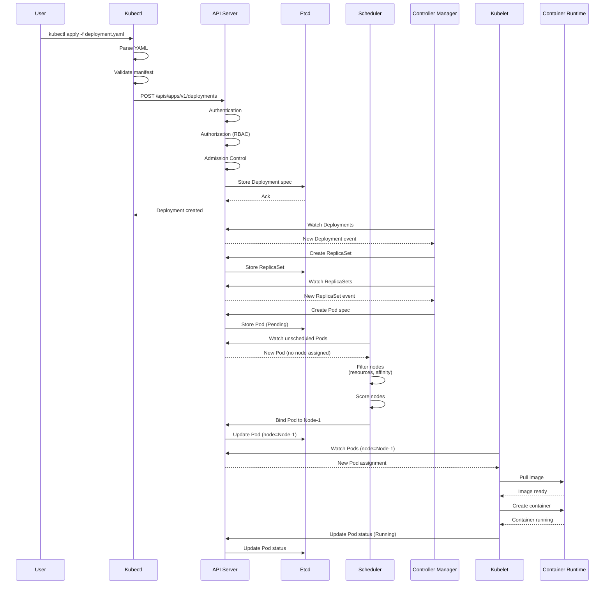
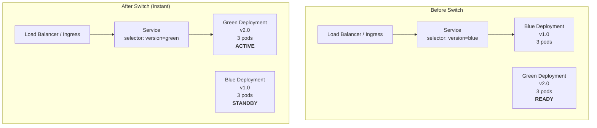
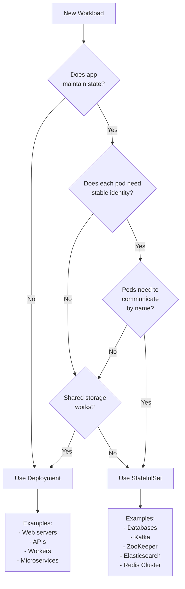

# Kubernetes - Answers

## Question 1: Kubernetes Secrets Management

📋 **[Back to Question](../sse-topics.md#kubernetes)** | **Topic:** Kubernetes and security

**Options:**
```yaml
# 1. Native Kubernetes Secrets (Base64 encoded - not secure!)
apiVersion: v1
kind: Secret
metadata:
  name: db-secret
data:
  password: cGFzc3dvcmQxMjM= # base64 encoded

# 2. External Secrets Operator + Vault
apiVersion: external-secrets.io/v1beta1
kind: ExternalSecret
metadata:
  name: db-secret
spec:
  secretStoreRef:
    name: vault-backend
  target:
    name: db-secret
  data:
  - secretKey: password
    remoteRef:
      key: database/password
```

**Best Practice:** Use external secret managers (Vault, AWS Secrets Manager) + RBAC + encryption at rest.

---

## Question 2: kubectl apply Internals

📋 **[Back to Question](../sse-topics.md#kubernetes)** | **Topic:** Kubernetes fundamentals

**Detailed Answer:**

#### Complete Flow Diagram



#### Step-by-Step Breakdown

**Step 1: Client-Side Processing (kubectl)**

```bash
$ kubectl apply -f deployment.yaml --v=8

# What kubectl does:
# 1. Read and parse YAML file
# 2. Validate syntax
# 3. Get current resource from API server (if exists)
# 4. Calculate 3-way merge (local, server, last-applied)
# 5. Send HTTP request to API server
```

**YAML Example:**

```yaml
apiVersion: apps/v1
kind: Deployment
metadata:
  name: nginx-deployment
  labels:
    app: nginx
spec:
  replicas: 3
  selector:
    matchLabels:
      app: nginx
  template:
    metadata:
      labels:
        app: nginx
    spec:
      containers:
      - name: nginx
        image: nginx:1.24
        ports:
        - containerPort: 80
```

**Step 2: API Server Processing**

```go
// Simplified flow inside API server

// 1. Authentication
// - X509 client certs
// - Bearer tokens
// - Service account tokens
func authenticate(request) {
    // Verify user identity
    return user
}

// 2. Authorization (RBAC)
func authorize(user, verb, resource) {
    // Check if user can "create" "deployments"
    // in namespace "default"
    return allowed
}

// 3. Admission Control
func admitRequest(resource) {
    // Mutating webhooks (can modify)
    runMutatingWebhooks(resource)
    
    // Validating webhooks (can reject)
    runValidatingWebhooks(resource)
    
    // Built-in admission controllers:
    // - LimitRanger
    // - ResourceQuota
    // - PodSecurityPolicy
    return approved
}

// 4. Store in etcd
func persist(resource) {
    etcd.Put(key, resource)
}
```

**HTTP Request (actual):**

```http
POST /apis/apps/v1/namespaces/default/deployments HTTP/1.1
Host: kubernetes.default.svc
Authorization: Bearer eyJhbGc...
Content-Type: application/json

{
  "apiVersion": "apps/v1",
  "kind": "Deployment",
  "metadata": {...},
  "spec": {...}
}
```

**Step 3: Etcd Storage**

```bash
# Data stored in etcd (key-value store)
Key: /registry/deployments/default/nginx-deployment
Value: {
  "apiVersion": "apps/v1",
  "kind": "Deployment",
  "metadata": {
    "name": "nginx-deployment",
    "namespace": "default",
    "uid": "abc-123-def",
    "resourceVersion": "12345"  # Important for optimistic locking
  },
  "spec": {...},
  "status": {}
}
```

**Step 4: Deployment Controller (Controller Manager)**

```go
// Deployment controller watches for Deployment objects
func (dc *DeploymentController) Run() {
    // Watch for Deployment events
    informer.Watch(func(event Event) {
        deployment := event.Object.(*Deployment)
        
        // Reconciliation loop
        for {
            current := getDeployment(deployment.Name)
            desired := current.Spec
            
            if current.Status != desired {
                // Create/update ReplicaSet
                rs := createReplicaSet(deployment)
                apiServer.Create(rs)
            }
            
            // Continuously reconcile
            time.Sleep(syncPeriod)
        }
    })
}
```

**ReplicaSet Created:**

```yaml
apiVersion: apps/v1
kind: ReplicaSet
metadata:
  name: nginx-deployment-7d9f8c-xyz
  ownerReferences:  # Links back to Deployment
  - apiVersion: apps/v1
    kind: Deployment
    name: nginx-deployment
    uid: abc-123-def
spec:
  replicas: 3
  selector:
    matchLabels:
      app: nginx
      pod-template-hash: 7d9f8c
  template:
    # ... same as Deployment template
```

**Step 5: ReplicaSet Controller**

```go
// ReplicaSet controller creates Pods
func (rsc *ReplicaSetController) syncReplicaSet(rs *ReplicaSet) {
    // Count running pods matching selector
    pods := getPodsMatchingSelector(rs.Spec.Selector)
    currentReplicas := len(pods)
    desiredReplicas := rs.Spec.Replicas
    
    if currentReplicas < desiredReplicas {
        // Create missing pods
        diff := desiredReplicas - currentReplicas
        for i := 0; i < diff; i++ {
            pod := createPodFromTemplate(rs.Spec.Template)
            apiServer.Create(pod)
        }
    } else if currentReplicas > desiredReplicas {
        // Delete excess pods
        podsToDelete := currentReplicas - desiredReplicas
        deletePods(pods, podsToDelete)
    }
}
```

**Pod Created (initially Pending):**

```yaml
apiVersion: v1
kind: Pod
metadata:
  name: nginx-deployment-7d9f8c-xyz-abc
  labels:
    app: nginx
    pod-template-hash: 7d9f8c
  ownerReferences:
  - apiVersion: apps/v1
    kind: ReplicaSet
    name: nginx-deployment-7d9f8c-xyz
spec:
  containers:
  - name: nginx
    image: nginx:1.24
  nodeName: ""  # Not assigned yet
status:
  phase: Pending  # Waiting for scheduling
```

**Step 6: Scheduler**

```go
// Scheduler assigns Pods to Nodes
func (s *Scheduler) schedulePod(pod *Pod) {
    // 1. Filter phase - find feasible nodes
    feasibleNodes := []Node{}
    for _, node := range allNodes {
        if canSchedule(pod, node) {
            feasibleNodes = append(feasibleNodes, node)
        }
    }
    
    // Filtering checks:
    // - Node has enough CPU/memory
    // - Node selector matches
    // - Affinity rules satisfied
    // - Taints/tolerations
    // - Volume availability
    
    // 2. Score phase - rank nodes
    scores := make(map[Node]int)
    for _, node := range feasibleNodes {
        score := 0
        // Score based on:
        score += balancedResourceAllocation(node, pod)
        score += leastRequestedPriority(node, pod)
        score += nodeAffinityPriority(node, pod)
        scores[node] = score
    }
    
    // 3. Select best node
    bestNode := nodeWithHighestScore(scores)
    
    // 4. Bind pod to node
    binding := &Binding{
        ObjectMeta: pod.ObjectMeta,
        Target: ObjectReference{
            Kind: "Node",
            Name: bestNode.Name,
        },
    }
    apiServer.Create(binding)
}
```

**Pod Updated (node assigned):**

```yaml
spec:
  nodeName: "worker-node-1"  # Now assigned
status:
  phase: Pending
  conditions:
  - type: PodScheduled
    status: "True"
```

**Step 7: Kubelet (on worker-node-1)**

```go
// Kubelet watches Pods assigned to its node
func (k *Kubelet) syncPod(pod *Pod) {
    // 1. Pull image
    image := pod.Spec.Containers[0].Image
    err := k.imageManager.PullImage(image)
    
    // 2. Create container
    container, err := k.containerRuntime.CreateContainer(
        pod,
        pod.Spec.Containers[0],
    )
    
    // 3. Start container
    err = k.containerRuntime.StartContainer(container.ID)
    
    // 4. Monitor and report status
    go k.monitorContainer(container)
    
    // 5. Update pod status to API server
    pod.Status.Phase = "Running"
    pod.Status.ContainerStatuses = []ContainerStatus{
        {
            Name: "nginx",
            State: ContainerState{Running: &Running{StartedAt: time.Now()}},
            Ready: true,
        },
    }
    k.apiServer.UpdateStatus(pod)
}
```

**Step 8: Container Runtime (CRI)**

```bash
# Kubelet calls CRI (Container Runtime Interface)
# Could be containerd, CRI-O, or Docker

# 1. Pull image
crictl pull nginx:1.24

# 2. Create container
crictl create <pod-sandbox-id> container-config.json pod-config.json

# 3. Start container
crictl start <container-id>

# 4. Container running!
```

**Final Pod Status:**

```yaml
status:
  phase: Running
  conditions:
  - type: Initialized
    status: "True"
  - type: Ready
    status: "True"
  - type: ContainersReady
    status: "True"
  - type: PodScheduled
    status: "True"
  containerStatuses:
  - name: nginx
    state:
      running:
        startedAt: "2026-01-16T10:30:00Z"
    ready: true
    restartCount: 0
    image: nginx:1.24
    imageID: docker-pullable://nginx@sha256:abc...
  hostIP: 10.0.1.5
  podIP: 10.244.1.10
  startTime: "2026-01-16T10:29:45Z"
```

#### Watching the Process in Real-Time

```bash
# Terminal 1: Watch events
kubectl get events --watch

# Terminal 2: Watch pod status
watch kubectl get pods

# Terminal 3: Apply deployment
kubectl apply -f deployment.yaml

# You'll see:
# 1. Deployment created
# 2. ReplicaSet created
# 3. Pods created (Pending)
# 4. Pods scheduled to nodes
# 5. Images pulled
# 6. Containers created
# 7. Pods running
```

#### Key Concepts

**1. Desired State vs Current State:**

```go
// Kubernetes reconciliation pattern
for {
    desired := getDesiredState()  // From etcd
    current := getCurrentState()  // From actual system
    
    if current != desired {
        takeAction(desired, current)
    }
    
    time.Sleep(syncPeriod)
}
```

**2. Watch Mechanism:**

```bash
# Controllers don't poll, they watch
curl -i http://localhost:8001/api/v1/watch/pods
# Returns streaming connection with events
```

**3. Resource Version (Optimistic Locking):**

```yaml
metadata:
  resourceVersion: "12345"  # Increments on each change
# Prevents race conditions in updates
```

#### Debugging kubectl apply

```bash
# Dry run (doesn't actually apply)
kubectl apply -f deployment.yaml --dry-run=client -o yaml

# Server-side dry run (goes through admission)
kubectl apply -f deployment.yaml --dry-run=server

# See exactly what kubectl sends
kubectl apply -f deployment.yaml -v=9

# Diff before applying
kubectl diff -f deployment.yaml

# View last applied configuration
kubectl get deployment nginx-deployment -o yaml | grep last-applied-configuration
```

---

## Question 3: Blue-Green Deployment in Kubernetes

📋 **[Back to Question](../sse-topics.md#kubernetes)** | **Topic:** Deployment strategies

**Detailed Answer:**

#### Blue-Green Deployment Architecture



#### Method 1: Service Selector Switching (Simple)

**Initial Setup - Blue (v1.0):**

```yaml
# blue-deployment.yaml
apiVersion: apps/v1
kind: Deployment
metadata:
  name: myapp-blue
spec:
  replicas: 3
  selector:
    matchLabels:
      app: myapp
      version: blue
  template:
    metadata:
      labels:
        app: myapp
        version: blue
    spec:
      containers:
      - name: myapp
        image: myapp:v1.0
        ports:
        - containerPort: 8080
---
# service.yaml
apiVersion: v1
kind: Service
metadata:
  name: myapp-service
spec:
  selector:
    app: myapp
    version: blue  # Points to blue initially
  ports:
  - port: 80
    targetPort: 8080
  type: LoadBalancer
```

**Deploy Green (v2.0):**

```yaml
# green-deployment.yaml
apiVersion: apps/v1
kind: Deployment
metadata:
  name: myapp-green
spec:
  replicas: 3
  selector:
    matchLabels:
      app: myapp
      version: green
  template:
    metadata:
      labels:
        app: myapp
        version: green
    spec:
      containers:
      - name: myapp
        image: myapp:v2.0  # New version
        ports:
        - containerPort: 8080
        readinessProbe:  # Important!
          httpGet:
            path: /health
            port: 8080
          initialDelaySeconds: 10
          periodSeconds: 5
```

**Deployment Process:**

```bash
# 1. Deploy blue (current production)
kubectl apply -f blue-deployment.yaml
kubectl apply -f service.yaml

# 2. Deploy green (new version) - no traffic yet
kubectl apply -f green-deployment.yaml

# 3. Wait for green to be ready
kubectl wait --for=condition=available --timeout=300s deployment/myapp-green

# 4. Test green directly (bypassing service)
kubectl port-forward deployment/myapp-green 8080:8080
curl http://localhost:8080

# 5. Switch traffic to green (INSTANT CUTOVER)
kubectl patch service myapp-service -p '{"spec":{"selector":{"version":"green"}}}'

# 6. Verify
kubectl get endpoints myapp-service
# Should show green pod IPs

# 7. If issues, rollback instantly
kubectl patch service myapp-service -p '{"spec":{"selector":{"version":"blue"}}}'

# 8. Once confident, scale down or delete blue
kubectl scale deployment myapp-blue --replicas=0
# or
kubectl delete deployment myapp-blue
```

#### Method 2: Ingress-Based Traffic Switching

```yaml
# ingress-blue.yaml
apiVersion: networking.k8s.io/v1
kind: Ingress
metadata:
  name: myapp-ingress
  annotations:
    nginx.ingress.kubernetes.io/rewrite-target: /
spec:
  rules:
  - host: myapp.example.com
    http:
      paths:
      - path: /
        pathType: Prefix
        backend:
          service:
            name: myapp-blue-service  # Initially blue
            port:
              number: 80
```

**Switching Traffic:**

```bash
# Update Ingress to point to green
kubectl patch ingress myapp-ingress --type='json' -p='[
  {
    "op": "replace",
    "path": "/spec/rules/0/http/paths/0/backend/service/name",
    "value": "myapp-green-service"
  }
]'
```

#### Method 3: Weighted Traffic Split (Gradual Migration)

**Using Istio or similar service mesh:**

```yaml
apiVersion: networking.istio.io/v1beta1
kind: VirtualService
metadata:
  name: myapp
spec:
  hosts:
  - myapp.example.com
  http:
  - match:
    - uri:
        prefix: /
    route:
    - destination:
        host: myapp-blue-service
        port:
          number: 80
      weight: 100  # 100% to blue initially
    - destination:
        host: myapp-green-service
        port:
          number: 80
      weight: 0    # 0% to green
```

**Gradual Rollout:**

```bash
# 10% to green
kubectl patch virtualservice myapp --type merge -p '
{
  "spec": {
    "http": [{
      "route": [
        {"destination": {"host": "myapp-blue-service"}, "weight": 90},
        {"destination": {"host": "myapp-green-service"}, "weight": 10}
      ]
    }]
  }
}'

# Monitor metrics, then increase
# 50% to green
kubectl patch virtualservice myapp --type merge -p '...' # weight: 50/50

# 100% to green
kubectl patch virtualservice myapp --type merge -p '...' # weight: 0/100
```

#### Method 4: Using Argo Rollouts

```yaml
# rollout.yaml
apiVersion: argoproj.io/v1alpha1
kind: Rollout
metadata:
  name: myapp
spec:
  replicas: 5
  strategy:
    blueGreen:
      activeService: myapp-active    # Production traffic
      previewService: myapp-preview  # Testing traffic
      autoPromotionEnabled: false    # Manual approval
      scaleDownDelaySeconds: 30
  selector:
    matchLabels:
      app: myapp
  template:
    metadata:
      labels:
        app: myapp
    spec:
      containers:
      - name: myapp
        image: myapp:v1.0
        ports:
        - containerPort: 8080
---
apiVersion: v1
kind: Service
metadata:
  name: myapp-active
spec:
  selector:
    app: myapp
  ports:
  - port: 80
    targetPort: 8080
---
apiVersion: v1
kind: Service
metadata:
  name: myapp-preview
spec:
  selector:
    app: myapp
  ports:
  - port: 80
    targetPort: 8080
```

**Using Argo Rollouts:**

```bash
# Install Argo Rollouts
kubectl create namespace argo-rollouts
kubectl apply -n argo-rollouts -f https://github.com/argoproj/argo-rollouts/releases/latest/download/install.yaml

# Deploy initial version
kubectl apply -f rollout.yaml

# Update to new version
kubectl argo rollouts set image myapp myapp=myapp:v2.0

# Argo creates green deployment automatically
# Traffic still goes to blue (active)

# Test green via preview service
kubectl port-forward service/myapp-preview 8080:80

# Promote to production (switch traffic)
kubectl argo rollouts promote myapp

# Or rollback
kubectl argo rollouts undo myapp

# Watch rollout status
kubectl argo rollouts get rollout myapp --watch
```

#### Complete Automation Script

```bash
#!/bin/bash
# blue-green-deploy.sh

set -e

APP_NAME="myapp"
NEW_VERSION=$1
CURRENT_VERSION=$(kubectl get service $APP_NAME-service -o jsonpath='{.spec.selector.version}')

echo "Current version: $CURRENT_VERSION"
echo "New version: $NEW_VERSION"

# Determine colors
if [ "$CURRENT_VERSION" == "blue" ]; then
  OLD_COLOR="blue"
  NEW_COLOR="green"
else
  OLD_COLOR="green"
  NEW_COLOR="blue"
fi

echo "Deploying $NEW_COLOR version..."

# Deploy new version
cat <<EOF | kubectl apply -f -
apiVersion: apps/v1
kind: Deployment
metadata:
  name: $APP_NAME-$NEW_COLOR
spec:
  replicas: 3
  selector:
    matchLabels:
      app: $APP_NAME
      version: $NEW_COLOR
  template:
    metadata:
      labels:
        app: $APP_NAME
        version: $NEW_COLOR
    spec:
      containers:
      - name: $APP_NAME
        image: $APP_NAME:$NEW_VERSION
        ports:
        - containerPort: 8080
        readinessProbe:
          httpGet:
            path: /health
            port: 8080
          initialDelaySeconds: 10
          periodSeconds: 5
        livenessProbe:
          httpGet:
            path: /health
            port: 8080
          initialDelaySeconds: 30
          periodSeconds: 10
EOF

# Wait for rollout
echo "Waiting for $NEW_COLOR deployment..."
kubectl rollout status deployment/$APP_NAME-$NEW_COLOR --timeout=5m

# Smoke test (optional)
echo "Running smoke tests..."
kubectl run smoke-test --rm -i --restart=Never --image=curlimages/curl -- \
  curl -f http://$APP_NAME-$NEW_COLOR:8080/health || {
    echo "Smoke test failed!"
    exit 1
  }

# Switch traffic
echo "Switching traffic to $NEW_COLOR..."
kubectl patch service $APP_NAME-service -p "{\"spec\":{\"selector\":{\"version\":\"$NEW_COLOR\"}}}"

echo "Deployment complete!"
echo "To rollback, run:"
echo "kubectl patch service $APP_NAME-service -p '{\"spec\":{\"selector\":{\"version\":\"$OLD_COLOR\"}}}'"

# Optional: Scale down old version after delay
echo "Waiting 5 minutes before scaling down $OLD_COLOR..."
sleep 300
kubectl scale deployment/$APP_NAME-$OLD_COLOR --replicas=1
```

#### Monitoring During Deployment

```yaml
# ServiceMonitor for Prometheus
apiVersion: monitoring.coreos.com/v1
kind: ServiceMonitor
metadata:
  name: myapp
spec:
  selector:
    matchLabels:
      app: myapp
  endpoints:
  - port: metrics
    interval: 30s
```

**Grafana Dashboard Query:**

```promql
# Request rate by version
sum(rate(http_requests_total[5m])) by (version)

# Error rate by version
sum(rate(http_requests_total{status=~"5.."}[5m])) by (version)

# P95 latency by version
histogram_quantile(0.95, 
  rate(http_request_duration_seconds_bucket[5m])
) by (version)
```

#### Best Practices

1. **Always use readiness probes** - ensures green is healthy before switch
2. **Database migrations** - must be backward compatible
3. **Smoke tests** - automated validation before switch
4. **Monitoring** - watch metrics on both versions
5. **Rollback plan** - documented and tested
6. **Cost consideration** - running 2x resources temporarily
7. **Session handling** - use external session store (Redis)
8. **Feature flags** - additional safety for risky features

---

## Question 4: StatefulSet vs Deployment

📋 **[Back to Question](../sse-topics.md#kubernetes)** | **Topic:** Kubernetes workload types

**Detailed Answer:**

#### Comparison Table

| Feature | Deployment | StatefulSet |
|---------|-----------|-------------|
| **Pod Identity** | Random names (pod-7d9f8c-xyz) | Stable names (pod-0, pod-1, pod-2) |
| **Pod Order** | Created/deleted in parallel | Ordered creation/deletion |
| **Network Identity** | Random IPs, Service load balancing | Stable hostname per pod |
| **Storage** | Shared volumes or no persistence | Persistent per-pod volumes |
| **DNS** | Service DNS only | Per-pod DNS (pod-0.service.ns.svc.cluster.local) |
| **Scaling** | Parallel | Sequential (pod-0 → pod-1 → pod-2) |
| **Updates** | Rolling update (parallel) | Ordered rolling update |
| **Use Cases** | Stateless apps (web servers, APIs) | Stateful apps (databases, queues) |

#### Deployment Example (Stateless Web App)

```yaml
apiVersion: apps/v1
kind: Deployment
metadata:
  name: nginx-web
spec:
  replicas: 3
  selector:
    matchLabels:
      app: nginx
  template:
    metadata:
      labels:
        app: nginx
    spec:
      containers:
      - name: nginx
        image: nginx:1.24
        ports:
        - containerPort: 80
---
apiVersion: v1
kind: Service
metadata:
  name: nginx-service
spec:
  selector:
    app: nginx
  ports:
  - port: 80
    targetPort: 80
  type: LoadBalancer
```

**Behavior:**
```bash
$ kubectl get pods
NAME                         READY   STATUS
nginx-web-7d9f8c-abc12       1/1     Running
nginx-web-7d9f8c-def34       1/1     Running
nginx-web-7d9f8c-ghi56       1/1     Running

# Random pod names
# Any pod can be deleted/recreated
# All pods are identical
# Traffic load-balanced across all pods
```

#### StatefulSet Example (Database Cluster)

```yaml
apiVersion: apps/v1
kind: StatefulSet
metadata:
  name: mysql
spec:
  serviceName: mysql  # Headless service for stable network IDs
  replicas: 3
  selector:
    matchLabels:
      app: mysql
  template:
    metadata:
      labels:
        app: mysql
    spec:
      containers:
      - name: mysql
        image: mysql:8.0
        ports:
        - containerPort: 3306
        env:
        - name: MYSQL_ROOT_PASSWORD
          valueFrom:
            secretKeyRef:
              name: mysql-secret
              key: password
        volumeMounts:
        - name: data
          mountPath: /var/lib/mysql
  volumeClaimTemplates:  # Each pod gets its own PVC
  - metadata:
      name: data
    spec:
      accessModes: ["ReadWriteOnce"]
      storageClassName: "fast-ssd"
      resources:
        requests:
          storage: 10Gi
---
# Headless Service (no load balancing, returns pod IPs)
apiVersion: v1
kind: Service
metadata:
  name: mysql
spec:
  clusterIP: None  # Headless service
  selector:
    app: mysql
  ports:
  - port: 3306
    targetPort: 3306
```

**Behavior:**
```bash
$ kubectl get pods
NAME      READY   STATUS
mysql-0   1/1     Running
mysql-1   1/1     Running
mysql-2   1/1     Running

# Predictable pod names (0, 1, 2)
# mysql-0 is always the first pod created
# If mysql-1 is deleted, it's recreated with same name and storage

$ kubectl get pvc
NAME           STATUS   VOLUME     CAPACITY
data-mysql-0   Bound    pvc-abc    10Gi
data-mysql-1   Bound    pvc-def    10Gi
data-mysql-2   Bound    pvc-ghi    10Gi

# Each pod has dedicated persistent storage
```

#### Stable Network Identity

```bash
# With Deployment (random IPs)
$ kubectl get pods -o wide
NAME                         IP
nginx-web-7d9f8c-abc12       10.244.1.5
nginx-web-7d9f8c-def34       10.244.2.8
nginx-web-7d9f8c-ghi56       10.244.3.2

# If pod restarts, it gets a new IP

# With StatefulSet (stable DNS names)
$ kubectl exec -it mysql-0 -- nslookup mysql-0.mysql
Name:      mysql-0.mysql.default.svc.cluster.local
Address:   10.244.1.10

$ kubectl exec -it mysql-0 -- nslookup mysql-1.mysql
Name:      mysql-1.mysql.default.svc.cluster.local
Address:   10.244.2.15

# Each pod has stable DNS: <pod-name>.<service-name>.<namespace>.svc.cluster.local
# Other pods can directly connect to specific replicas
```

#### Ordered Deployment and Scaling

**Deployment (Parallel):**
```bash
$ kubectl scale deployment nginx-web --replicas=5
# All new pods start simultaneously
# nginx-web-xyz-4 and nginx-web-xyz-5 created in parallel

$ kubectl scale deployment nginx-web --replicas=2
# 3 pods deleted in parallel, order doesn't matter
```

**StatefulSet (Sequential):**
```bash
$ kubectl scale statefulset mysql --replicas=5
# Pods created one at a time in order:
# 1. mysql-3 created and running
# 2. Then mysql-4 created and running

$ kubectl scale statefulset mysql --replicas=2
# Pods deleted in reverse order:
# 1. mysql-4 deleted
# 2. Then mysql-3 deleted
# mysql-2 deleted last

# Ensures clean shutdown of dependent services
```

#### Use Case 1: MySQL Replication

```yaml
apiVersion: apps/v1
kind: StatefulSet
metadata:
  name: mysql
spec:
  serviceName: mysql
  replicas: 3
  template:
    spec:
      initContainers:
      - name: init-mysql
        image: mysql:8.0
        command:
        - bash
        - "-c"
        - |
          set -ex
          # Generate mysql server-id from pod ordinal index
          [[ `hostname` =~ -([0-9]+)$ ]] || exit 1
          ordinal=${BASH_REMATCH[1]}
          echo [mysqld] > /mnt/conf.d/server-id.cnf
          echo server-id=$((100 + $ordinal)) >> /mnt/conf.d/server-id.cnf
          
          # mysql-0 is primary, others are replicas
          if [[ $ordinal -eq 0 ]]; then
            cp /mnt/config-map/primary.cnf /mnt/conf.d/
          else
            cp /mnt/config-map/replica.cnf /mnt/conf.d/
          fi
        volumeMounts:
        - name: conf
          mountPath: /mnt/conf.d
        - name: config-map
          mountPath: /mnt/config-map
      containers:
      - name: mysql
        image: mysql:8.0
        env:
        - name: MYSQL_ROOT_PASSWORD
          valueFrom:
            secretKeyRef:
              name: mysql-secret
              key: password
        ports:
        - containerPort: 3306
        volumeMounts:
        - name: data
          mountPath: /var/lib/mysql
        - name: conf
          mountPath: /etc/mysql/conf.d
      volumes:
      - name: conf
        emptyDir: {}
      - name: config-map
        configMap:
          name: mysql-config
  volumeClaimTemplates:
  - metadata:
      name: data
    spec:
      accessModes: ["ReadWriteOnce"]
      resources:
        requests:
          storage: 10Gi
---
# Headless service for stable DNS
apiVersion: v1
kind: Service
metadata:
  name: mysql
spec:
  clusterIP: None
  selector:
    app: mysql
  ports:
  - port: 3306
---
# Service for reads (load balanced across replicas)
apiVersion: v1
kind: Service
metadata:
  name: mysql-read
spec:
  selector:
    app: mysql
  ports:
  - port: 3306
```

**Application Connection:**
```java
@Configuration
public class DatabaseConfig {
    
    // Write to primary (mysql-0)
    @Bean
    public DataSource primaryDataSource() {
        return DataSourceBuilder.create()
            .url("jdbc:mysql://mysql-0.mysql:3306/mydb")
            .build();
    }
    
    // Read from any replica
    @Bean
    public DataSource replicaDataSource() {
        return DataSourceBuilder.create()
            .url("jdbc:mysql://mysql-read:3306/mydb")  // Load balanced
            .build();
    }
}
```

#### Use Case 2: Apache Kafka Cluster

```yaml
apiVersion: apps/v1
kind: StatefulSet
metadata:
  name: kafka
spec:
  serviceName: kafka
  replicas: 3
  selector:
    matchLabels:
      app: kafka
  template:
    metadata:
      labels:
        app: kafka
    spec:
      containers:
      - name: kafka
        image: confluentinc/cp-kafka:7.5.0
        ports:
        - containerPort: 9092
        env:
        - name: KAFKA_BROKER_ID
          valueFrom:
            fieldRef:
              fieldPath: metadata.name  # kafka-0, kafka-1, kafka-2
        - name: KAFKA_ZOOKEEPER_CONNECT
          value: "zookeeper:2181"
        - name: KAFKA_ADVERTISED_LISTENERS
          value: "PLAINTEXT://$(POD_NAME).kafka:9092"
        - name: POD_NAME
          valueFrom:
            fieldRef:
              fieldPath: metadata.name
        volumeMounts:
        - name: data
          mountPath: /var/lib/kafka/data
  volumeClaimTemplates:
  - metadata:
      name: data
    spec:
      accessModes: ["ReadWriteOnce"]
      resources:
        requests:
          storage: 100Gi
```

**Why StatefulSet for Kafka:**
- Each broker needs stable ID (kafka-0, kafka-1, kafka-2)
- Data partitions tied to specific brokers
- Clients connect to specific brokers by name
- Ordered startup ensures proper cluster formation

#### Use Case 3: When NOT to Use StatefulSet

```yaml
# ❌ Don't use StatefulSet for this
apiVersion: apps/v1
kind: StatefulSet
metadata:
  name: api-server  # WRONG! This should be a Deployment
spec:
  replicas: 5
  template:
    spec:
      containers:
      - name: api
        image: myapp:v1.0
        # Stateless API - no need for stable identity!

# ✅ Use Deployment instead
apiVersion: apps/v1
kind: Deployment
metadata:
  name: api-server  # CORRECT!
spec:
  replicas: 5
  template:
    spec:
      containers:
      - name: api
        image: myapp:v1.0
```

**Use Deployment when:**
- Application is stateless
- Pods are interchangeable
- No need for stable network identity
- Shared storage or no storage needed
- Order of startup/shutdown doesn't matter

**Use StatefulSet when:**
- Application maintains state
- Each pod needs unique identity
- Pods need to discover each other by name
- Each pod needs its own persistent storage
- Ordered deployment/scaling required
- Examples: Databases, message queues, distributed caches

#### Pod Management Policy

```yaml
# Default: OrderedReady (sequential)
apiVersion: apps/v1
kind: StatefulSet
metadata:
  name: mysql
spec:
  podManagementPolicy: OrderedReady  # Wait for each pod to be ready
  # ...

# Alternative: Parallel (faster, but no ordering guarantee)
apiVersion: apps/v1
kind: StatefulSet
metadata:
  name: web
spec:
  podManagementPolicy: Parallel  # Start all pods simultaneously
  # Useful when pods don't depend on each other
  # ...
```

#### Update Strategy

```yaml
apiVersion: apps/v1
kind: StatefulSet
metadata:
  name: mysql
spec:
  updateStrategy:
    type: RollingUpdate
    rollingUpdate:
      partition: 2  # Only update pods with ordinal >= 2
      # mysql-2, mysql-3, mysql-4... updated
      # mysql-0, mysql-1 remain on old version
      # Useful for canary testing
```

#### When to Choose Which



#### Best Practices

1. **Headless Service Required:** Always create a headless service (clusterIP: None) for StatefulSets
2. **Storage Class:** Use appropriate StorageClass for volumeClaimTemplates
3. **Init Containers:** Use for setup that depends on pod ordinal
4. **Graceful Shutdown:** Implement proper termination handling
5. **Backup Strategy:** Regular backups of persistent volumes
6. **Monitoring:** Track pod-specific metrics (not just aggregates)
7. **Resource Limits:** Set appropriate limits for each pod

---

