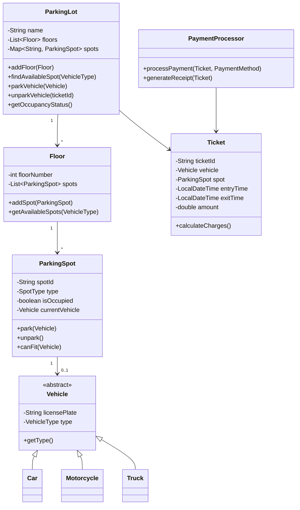
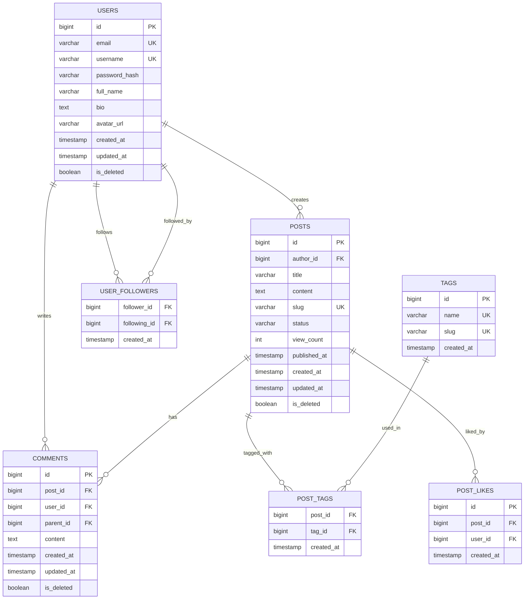

# Low-level Design - Answers

## Question 1: Parking Lot System Design

📋 **[Back to Question](../sse-topics.md#low-level-design)** | **Topic:** Object-oriented design and low-level design

**Detailed Answer:**

#### Class Diagram



#### Implementation

```java
// Enums
enum VehicleType {
    MOTORCYCLE, CAR, TRUCK, ELECTRIC
}

enum SpotType {
    COMPACT, REGULAR, LARGE, ELECTRIC
}

enum PaymentMethod {
    CASH, CREDIT_CARD, DEBIT_CARD, UPI
}

// Vehicle hierarchy
abstract class Vehicle {
    private String licensePlate;
    private VehicleType type;
    
    public Vehicle(String licensePlate, VehicleType type) {
        this.licensePlate = licensePlate;
        this.type = type;
    }
    
    public String getLicensePlate() {
        return licensePlate;
    }
    
    public VehicleType getType() {
        return type;
    }
}

class Car extends Vehicle {
    public Car(String licensePlate) {
        super(licensePlate, VehicleType.CAR);
    }
}

class Motorcycle extends Vehicle {
    public Motorcycle(String licensePlate) {
        super(licensePlate, VehicleType.MOTORCYCLE);
    }
}

class Truck extends Vehicle {
    public Truck(String licensePlate) {
        super(licensePlate, VehicleType.TRUCK);
    }
}

// Parking Spot
class ParkingSpot {
    private String spotId;
    private SpotType type;
    private boolean isOccupied;
    private Vehicle currentVehicle;
    
    public ParkingSpot(String spotId, SpotType type) {
        this.spotId = spotId;
        this.type = type;
        this.isOccupied = false;
    }
    
    public boolean canFit(Vehicle vehicle) {
        if (isOccupied) return false;
        
        return switch (vehicle.getType()) {
            case MOTORCYCLE -> type == SpotType.COMPACT || type == SpotType.REGULAR || type == SpotType.LARGE;
            case CAR -> type == SpotType.REGULAR || type == SpotType.LARGE;
            case TRUCK -> type == SpotType.LARGE;
            case ELECTRIC -> type == SpotType.ELECTRIC;
        };
    }
    
    public void park(Vehicle vehicle) {
        if (!canFit(vehicle)) {
            throw new IllegalStateException("Vehicle cannot fit in this spot");
        }
        this.currentVehicle = vehicle;
        this.isOccupied = true;
    }
    
    public Vehicle unpark() {
        Vehicle vehicle = this.currentVehicle;
        this.currentVehicle = null;
        this.isOccupied = false;
        return vehicle;
    }
    
    public String getSpotId() {
        return spotId;
    }
    
    public boolean isOccupied() {
        return isOccupied;
    }
    
    public SpotType getType() {
        return type;
    }
}

// Floor
class Floor {
    private int floorNumber;
    private List<ParkingSpot> spots;
    
    public Floor(int floorNumber) {
        this.floorNumber = floorNumber;
        this.spots = new ArrayList<>();
    }
    
    public void addSpot(ParkingSpot spot) {
        spots.add(spot);
    }
    
    public List<ParkingSpot> getAvailableSpots(VehicleType vehicleType) {
        return spots.stream()
            .filter(spot -> !spot.isOccupied())
            .filter(spot -> canParkVehicleType(spot, vehicleType))
            .collect(Collectors.toList());
    }
    
    private boolean canParkVehicleType(ParkingSpot spot, VehicleType vehicleType) {
        return switch (vehicleType) {
            case MOTORCYCLE -> true; // Can park anywhere
            case CAR -> spot.getType() == SpotType.REGULAR || spot.getType() == SpotType.LARGE;
            case TRUCK -> spot.getType() == SpotType.LARGE;
            case ELECTRIC -> spot.getType() == SpotType.ELECTRIC;
        };
    }
    
    public int getFloorNumber() {
        return floorNumber;
    }
}

// Ticket
class Ticket {
    private String ticketId;
    private Vehicle vehicle;
    private ParkingSpot spot;
    private LocalDateTime entryTime;
    private LocalDateTime exitTime;
    private double amount;
    
    // Pricing: $2/hour for motorcycle, $5/hour for car, $10/hour for truck
    private static final Map<VehicleType, Double> HOURLY_RATES = Map.of(
        VehicleType.MOTORCYCLE, 2.0,
        VehicleType.CAR, 5.0,
        VehicleType.TRUCK, 10.0,
        VehicleType.ELECTRIC, 5.0
    );
    
    public Ticket(String ticketId, Vehicle vehicle, ParkingSpot spot) {
        this.ticketId = ticketId;
        this.vehicle = vehicle;
        this.spot = spot;
        this.entryTime = LocalDateTime.now();
    }
    
    public double calculateCharges() {
        if (exitTime == null) {
            exitTime = LocalDateTime.now();
        }
        
        long hours = Duration.between(entryTime, exitTime).toHours();
        if (hours == 0) hours = 1; // Minimum 1 hour charge
        
        double hourlyRate = HOURLY_RATES.get(vehicle.getType());
        this.amount = hours * hourlyRate;
        return this.amount;
    }
    
    public String getTicketId() {
        return ticketId;
    }
    
    public Vehicle getVehicle() {
        return vehicle;
    }
    
    public ParkingSpot getSpot() {
        return spot;
    }
    
    public LocalDateTime getEntryTime() {
        return entryTime;
    }
    
    public void setExitTime(LocalDateTime exitTime) {
        this.exitTime = exitTime;
    }
}

// Payment Processor
class PaymentProcessor {
    public boolean processPayment(Ticket ticket, PaymentMethod method) {
        double amount = ticket.calculateCharges();
        System.out.println("Processing " + method + " payment of $" + amount);
        
        // Simulate payment processing
        return true;
    }
    
    public String generateReceipt(Ticket ticket) {
        return String.format("""
            ========== PARKING RECEIPT ==========
            Ticket ID: %s
            Vehicle: %s (%s)
            Spot: %s
            Entry: %s
            Exit: %s
            Amount: $%.2f
            =====================================
            """,
            ticket.getTicketId(),
            ticket.getVehicle().getLicensePlate(),
            ticket.getVehicle().getType(),
            ticket.getSpot().getSpotId(),
            ticket.getEntryTime(),
            LocalDateTime.now(),
            ticket.calculateCharges()
        );
    }
}

// Main Parking Lot
class ParkingLot {
    private String name;
    private List<Floor> floors;
    private Map<String, Ticket> activeTickets; // ticketId -> Ticket
    private PaymentProcessor paymentProcessor;
    private AtomicInteger ticketCounter;
    
    public ParkingLot(String name) {
        this.name = name;
        this.floors = new ArrayList<>();
        this.activeTickets = new ConcurrentHashMap<>();
        this.paymentProcessor = new PaymentProcessor();
        this.ticketCounter = new AtomicInteger(1);
    }
    
    public void addFloor(Floor floor) {
        floors.add(floor);
    }
    
    public ParkingSpot findAvailableSpot(VehicleType vehicleType) {
        // Strategy: Find nearest available spot
        for (Floor floor : floors) {
            List<ParkingSpot> availableSpots = floor.getAvailableSpots(vehicleType);
            if (!availableSpots.isEmpty()) {
                return availableSpots.get(0);
            }
        }
        return null;
    }
    
    public Ticket parkVehicle(Vehicle vehicle) {
        ParkingSpot spot = findAvailableSpot(vehicle.getType());
        
        if (spot == null) {
            throw new IllegalStateException("No available spots for " + vehicle.getType());
        }
        
        spot.park(vehicle);
        String ticketId = "T" + ticketCounter.getAndIncrement();
        Ticket ticket = new Ticket(ticketId, vehicle, spot);
        activeTickets.put(ticketId, ticket);
        
        System.out.println("Vehicle " + vehicle.getLicensePlate() + 
                         " parked at spot " + spot.getSpotId());
        return ticket;
    }
    
    public String unparkVehicle(String ticketId, PaymentMethod paymentMethod) {
        Ticket ticket = activeTickets.get(ticketId);
        
        if (ticket == null) {
            throw new IllegalArgumentException("Invalid ticket ID");
        }
        
        // Unpark vehicle
        Vehicle vehicle = ticket.getSpot().unpark();
        ticket.setExitTime(LocalDateTime.now());
        
        // Process payment
        boolean paymentSuccess = paymentProcessor.processPayment(ticket, paymentMethod);
        
        if (!paymentSuccess) {
            throw new IllegalStateException("Payment failed");
        }
        
        // Remove from active tickets
        activeTickets.remove(ticketId);
        
        // Generate receipt
        return paymentProcessor.generateReceipt(ticket);
    }
    
    public Map<SpotType, Integer> getOccupancyStatus() {
        Map<SpotType, Integer> occupancy = new HashMap<>();
        
        for (Floor floor : floors) {
            for (ParkingSpot spot : floor.getAvailableSpots(VehicleType.MOTORCYCLE)) {
                occupancy.merge(spot.getType(), spot.isOccupied() ? 1 : 0, Integer::sum);
            }
        }
        
        return occupancy;
    }
}
```

#### Usage Example

```java
public class ParkingLotDemo {
    public static void main(String[] args) {
        // Create parking lot
        ParkingLot lot = new ParkingLot("Downtown Parking");
        
        // Floor 1: 20 compact, 30 regular spots
        Floor floor1 = new Floor(1);
        for (int i = 1; i <= 20; i++) {
            floor1.addSpot(new ParkingSpot("F1-C" + i, SpotType.COMPACT));
        }
        for (int i = 1; i <= 30; i++) {
            floor1.addSpot(new ParkingSpot("F1-R" + i, SpotType.REGULAR));
        }
        lot.addFloor(floor1);
        
        // Floor 2: 25 regular, 10 large, 5 electric spots
        Floor floor2 = new Floor(2);
        for (int i = 1; i <= 25; i++) {
            floor2.addSpot(new ParkingSpot("F2-R" + i, SpotType.REGULAR));
        }
        for (int i = 1; i <= 10; i++) {
            floor2.addSpot(new ParkingSpot("F2-L" + i, SpotType.LARGE));
        }
        for (int i = 1; i <= 5; i++) {
            floor2.addSpot(new ParkingSpot("F2-E" + i, SpotType.ELECTRIC));
        }
        lot.addFloor(floor2);
        
        // Park vehicles
        Vehicle car1 = new Car("ABC123");
        Ticket ticket1 = lot.parkVehicle(car1);
        System.out.println("Ticket issued: " + ticket1.getTicketId());
        
        Vehicle motorcycle1 = new Motorcycle("XYZ789");
        Ticket ticket2 = lot.parkVehicle(motorcycle1);
        
        Vehicle truck1 = new Truck("TRK456");
        Ticket ticket3 = lot.parkVehicle(truck1);
        
        // Simulate time passing
        try {
            Thread.sleep(2000);
        } catch (InterruptedException e) {
            e.printStackTrace();
        }
        
        // Unpark and pay
        String receipt = lot.unparkVehicle(ticket1.getTicketId(), PaymentMethod.CREDIT_CARD);
        System.out.println(receipt);
        
        // Check occupancy
        System.out.println("Occupancy: " + lot.getOccupancyStatus());
    }
}
```

#### SOLID Principles Applied

1. **Single Responsibility Principle (SRP)**
   - `ParkingSpot`: Manages spot state
   - `Ticket`: Handles parking duration and charges
   - `PaymentProcessor`: Processes payments only

2. **Open/Closed Principle (OCP)**
   - New vehicle types can be added without modifying existing code
   - New spot allocation strategies via Strategy pattern

3. **Liskov Substitution Principle (LSP)**
   - All `Vehicle` subclasses can be used interchangeably

4. **Interface Segregation Principle (ISP)**
   - Interfaces are focused (if we had defined them)

5. **Dependency Inversion Principle (DIP)**
   - `ParkingLot` depends on abstractions (`Vehicle`, not concrete types)

---

## Question 2: Blogging Platform Database Schema

📋 **[Back to Question](../sse-topics.md#low-level-design)** | **Topic:** Database design and modeling

**Detailed Answer:**

#### Entity Relationship Diagram



#### SQL Schema

```sql
-- Users table
CREATE TABLE users (
    id BIGSERIAL PRIMARY KEY,
    email VARCHAR(255) NOT NULL UNIQUE,
    username VARCHAR(50) NOT NULL UNIQUE,
    password_hash VARCHAR(255) NOT NULL,
    full_name VARCHAR(100),
    bio TEXT,
    avatar_url VARCHAR(500),
    created_at TIMESTAMP DEFAULT CURRENT_TIMESTAMP,
    updated_at TIMESTAMP DEFAULT CURRENT_TIMESTAMP,
    is_deleted BOOLEAN DEFAULT FALSE
);

-- Indexes for users
CREATE INDEX idx_users_email ON users(email) WHERE is_deleted = FALSE;
CREATE INDEX idx_users_username ON users(username) WHERE is_deleted = FALSE;
CREATE INDEX idx_users_created_at ON users(created_at DESC);

-- Posts table
CREATE TABLE posts (
    id BIGSERIAL PRIMARY KEY,
    author_id BIGINT NOT NULL,
    title VARCHAR(255) NOT NULL,
    content TEXT NOT NULL,
    slug VARCHAR(255) NOT NULL UNIQUE,
    status VARCHAR(20) DEFAULT 'draft', -- draft, published, archived
    view_count INT DEFAULT 0,
    published_at TIMESTAMP,
    created_at TIMESTAMP DEFAULT CURRENT_TIMESTAMP,
    updated_at TIMESTAMP DEFAULT CURRENT_TIMESTAMP,
    is_deleted BOOLEAN DEFAULT FALSE,
    FOREIGN KEY (author_id) REFERENCES users(id) ON DELETE CASCADE
);

-- Indexes for posts
CREATE INDEX idx_posts_author_id ON posts(author_id);
CREATE INDEX idx_posts_slug ON posts(slug) WHERE is_deleted = FALSE;
CREATE INDEX idx_posts_status ON posts(status) WHERE is_deleted = FALSE;
CREATE INDEX idx_posts_published_at ON posts(published_at DESC) WHERE status = 'published' AND is_deleted = FALSE;
CREATE INDEX idx_posts_created_at ON posts(created_at DESC);

-- Full-text search index
CREATE INDEX idx_posts_fulltext ON posts USING GIN(to_tsvector('english', title || ' ' || content));

-- Comments table (supports nested comments)
CREATE TABLE comments (
    id BIGSERIAL PRIMARY KEY,
    post_id BIGINT NOT NULL,
    user_id BIGINT NOT NULL,
    parent_id BIGINT, -- NULL for top-level comments
    content TEXT NOT NULL,
    created_at TIMESTAMP DEFAULT CURRENT_TIMESTAMP,
    updated_at TIMESTAMP DEFAULT CURRENT_TIMESTAMP,
    is_deleted BOOLEAN DEFAULT FALSE,
    FOREIGN KEY (post_id) REFERENCES posts(id) ON DELETE CASCADE,
    FOREIGN KEY (user_id) REFERENCES users(id) ON DELETE CASCADE,
    FOREIGN KEY (parent_id) REFERENCES comments(id) ON DELETE CASCADE
);

-- Indexes for comments
CREATE INDEX idx_comments_post_id ON comments(post_id, created_at DESC);
CREATE INDEX idx_comments_user_id ON comments(user_id);
CREATE INDEX idx_comments_parent_id ON comments(parent_id);

-- Tags table
CREATE TABLE tags (
    id BIGSERIAL PRIMARY KEY,
    name VARCHAR(50) NOT NULL UNIQUE,
    slug VARCHAR(50) NOT NULL UNIQUE,
    created_at TIMESTAMP DEFAULT CURRENT_TIMESTAMP
);

-- Index for tags
CREATE INDEX idx_tags_slug ON tags(slug);

-- Post-Tags junction table (many-to-many)
CREATE TABLE post_tags (
    post_id BIGINT NOT NULL,
    tag_id BIGINT NOT NULL,
    created_at TIMESTAMP DEFAULT CURRENT_TIMESTAMP,
    PRIMARY KEY (post_id, tag_id),
    FOREIGN KEY (post_id) REFERENCES posts(id) ON DELETE CASCADE,
    FOREIGN KEY (tag_id) REFERENCES tags(id) ON DELETE CASCADE
);

-- Index for reverse lookup
CREATE INDEX idx_post_tags_tag_id ON post_tags(tag_id);

-- Post likes table
CREATE TABLE post_likes (
    id BIGSERIAL PRIMARY KEY,
    post_id BIGINT NOT NULL,
    user_id BIGINT NOT NULL,
    created_at TIMESTAMP DEFAULT CURRENT_TIMESTAMP,
    UNIQUE(post_id, user_id),
    FOREIGN KEY (post_id) REFERENCES posts(id) ON DELETE CASCADE,
    FOREIGN KEY (user_id) REFERENCES users(id) ON DELETE CASCADE
);

-- Indexes for post likes
CREATE INDEX idx_post_likes_post_id ON post_likes(post_id);
CREATE INDEX idx_post_likes_user_id ON post_likes(user_id);

-- User followers table (self-referencing many-to-many)
CREATE TABLE user_followers (
    follower_id BIGINT NOT NULL, -- User who is following
    following_id BIGINT NOT NULL, -- User being followed
    created_at TIMESTAMP DEFAULT CURRENT_TIMESTAMP,
    PRIMARY KEY (follower_id, following_id),
    FOREIGN KEY (follower_id) REFERENCES users(id) ON DELETE CASCADE,
    FOREIGN KEY (following_id) REFERENCES users(id) ON DELETE CASCADE,
    CHECK (follower_id != following_id) -- Can't follow yourself
);

-- Indexes for followers
CREATE INDEX idx_user_followers_following_id ON user_followers(following_id);

-- Triggers for updated_at
CREATE OR REPLACE FUNCTION update_updated_at_column()
RETURNS TRIGGER AS $$
BEGIN
    NEW.updated_at = CURRENT_TIMESTAMP;
    RETURN NEW;
END;
$$ LANGUAGE plpgsql;

CREATE TRIGGER update_users_updated_at
BEFORE UPDATE ON users
FOR EACH ROW
EXECUTE FUNCTION update_updated_at_column();

CREATE TRIGGER update_posts_updated_at
BEFORE UPDATE ON posts
FOR EACH ROW
EXECUTE FUNCTION update_updated_at_column();

CREATE TRIGGER update_comments_updated_at
BEFORE UPDATE ON comments
FOR EACH ROW
EXECUTE FUNCTION update_updated_at_column();
```

#### Common Queries

```sql
-- Get post with author, tags, and like count
SELECT 
    p.id,
    p.title,
    p.content,
    p.slug,
    p.published_at,
    u.username AS author_username,
    u.avatar_url AS author_avatar,
    COUNT(DISTINCT pl.id) AS like_count,
    ARRAY_AGG(DISTINCT t.name) AS tags
FROM posts p
JOIN users u ON p.author_id = u.id
LEFT JOIN post_likes pl ON p.id = pl.post_id
LEFT JOIN post_tags pt ON p.id = pt.post_id
LEFT JOIN tags t ON pt.tag_id = t.id
WHERE p.slug = 'my-awesome-post'
  AND p.status = 'published'
  AND p.is_deleted = FALSE
GROUP BY p.id, u.username, u.avatar_url;

-- Get comments with nested structure
WITH RECURSIVE comment_tree AS (
    -- Base case: top-level comments
    SELECT 
        c.id,
        c.content,
        c.user_id,
        c.parent_id,
        c.created_at,
        u.username,
        u.avatar_url,
        1 AS depth,
        ARRAY[c.id] AS path
    FROM comments c
    JOIN users u ON c.user_id = u.id
    WHERE c.post_id = 123
      AND c.parent_id IS NULL
      AND c.is_deleted = FALSE
    
    UNION ALL
    
    -- Recursive case: nested comments
    SELECT 
        c.id,
        c.content,
        c.user_id,
        c.parent_id,
        c.created_at,
        u.username,
        u.avatar_url,
        ct.depth + 1,
        ct.path || c.id
    FROM comments c
    JOIN users u ON c.user_id = u.id
    JOIN comment_tree ct ON c.parent_id = ct.id
    WHERE c.is_deleted = FALSE
      AND ct.depth < 5  -- Limit nesting depth
)
SELECT * FROM comment_tree
ORDER BY path;

-- Full-text search
SELECT 
    p.id,
    p.title,
    p.content,
    ts_rank(to_tsvector('english', p.title || ' ' || p.content), 
            plainto_tsquery('english', 'search term')) AS rank
FROM posts p
WHERE to_tsvector('english', p.title || ' ' || p.content) @@ plainto_tsquery('english', 'search term')
  AND p.status = 'published'
  AND p.is_deleted = FALSE
ORDER BY rank DESC
LIMIT 10;

-- Get user's feed (posts from followed users)
SELECT 
    p.id,
    p.title,
    p.slug,
    p.published_at,
    u.username AS author
FROM posts p
JOIN users u ON p.author_id = u.id
JOIN user_followers uf ON u.id = uf.following_id
WHERE uf.follower_id = 456  -- Current user's ID
  AND p.status = 'published'
  AND p.is_deleted = FALSE
ORDER BY p.published_at DESC
LIMIT 20;

-- Popular tags (with post count)
SELECT 
    t.id,
    t.name,
    t.slug,
    COUNT(pt.post_id) AS post_count
FROM tags t
JOIN post_tags pt ON t.id = pt.tag_id
JOIN posts p ON pt.post_id = p.id
WHERE p.status = 'published'
  AND p.is_deleted = FALSE
GROUP BY t.id, t.name, t.slug
ORDER BY post_count DESC
LIMIT 20;
```

#### Key Design Decisions

1. **Soft Deletes**: `is_deleted` flag preserves data integrity and allows recovery
2. **Audit Fields**: `created_at`, `updated_at` for tracking changes
3. **Indexes**: Cover common query patterns (author lookup, slug lookup, published date)
4. **Junction Tables**: `post_tags` for many-to-many relationships
5. **Self-referencing**: `user_followers` for follower system
6. **Nested Comments**: `parent_id` allows hierarchical comments
7. **Unique Constraints**: Prevent duplicates (email, username, slug)
8. **Full-text Search**: GIN index for fast text searches
9. **Triggers**: Auto-update `updated_at` timestamp

---

