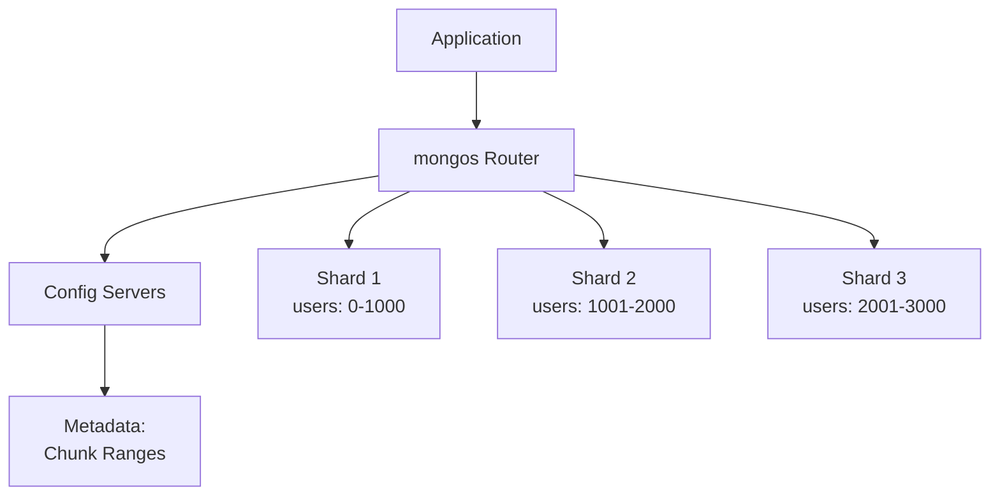

# MongoDB - Answers

## Question 1: Document-Oriented Modeling

📋 **[Back to Question](../sse-topics.md#mongodb)** | **Topic:** Document-oriented database design

**Relational vs MongoDB:**

```javascript
// Relational: Normalized (separate tables + JOIN)
Users: { id, name, email }
Orders: { id, user_id, total }

// MongoDB: Embedded (one collection)
{
  _id: ObjectId("..."),
  name: "John Doe",
  email: "john@example.com",
  orders: [
    { orderId: 123, total: 99.99, date: ISODate("...") },
    { orderId: 124, total: 149.99, date: ISODate("...") }
  ]
}
```

**Decision Factors:**
- **Embed** if: Always accessed together, 1-to-few, data doesn't change often
- **Reference** if: Many-to-many, data grows unbounded, accessed independently

---

## Question 2: Query Performance Optimization

📋 **[Back to Question](../sse-topics.md#mongodb)** | **Topic:** MongoDB performance and indexing

```javascript
// 1. Use explain() to analyze
db.users.find({ email: "john@example.com" }).explain("executionStats")

// 2. Check for index usage
// Look for "COLLSCAN" (bad) vs "IXSCAN" (good)

// 3. Create appropriate index
db.users.createIndex({ email: 1 })

// 4. Compound index for multiple fields
db.orders.createIndex({ userId: 1, createdAt: -1 })

// 5. Use projection to limit fields
db.users.find({ email: "..." }, { name: 1, email: 1, _id: 0 })
```

---

## Question 3: Replication Lag Solutions

📋 **[Back to Question](../sse-topics.md#mongodb)** | **Topic:** MongoDB replication understanding

```javascript
// Read preference options
const options = {
  readPreference: 'primary',        // Always read from primary
  readPreference: 'primaryPreferred', // Primary, fallback to secondary
  readPreference: 'secondary',       // Only secondaries
  readPreference: 'nearest'          // Lowest latency node
}

// Write concern for consistency
db.collection.insertOne(doc, {
  writeConcern: { w: "majority", j: true }
})
```

**Strategy:** Use `readPreference: 'primary'` for critical reads, accept eventual consistency for analytics queries.

---

## Question 4: MongoDB Sharding

📋 **[Back to Question](../sse-topics.md#mongodb)** | **Topic:** MongoDB scalability and partitioning

**Detailed Answer:**

#### What is Sharding?

Sharding is MongoDB's approach to horizontal scaling by distributing data across multiple servers (shards).



#### When Do You Need Sharding?

**Need sharding when:**
- Dataset exceeds single server storage (~2TB+)
- Working set doesn't fit in RAM
- Write throughput exceeds single server capacity (10k+ writes/sec)
- Geographic distribution required

**Don't need sharding when:**
- Data size < 1TB
- Reads can be scaled with replicas
- Single server meets performance needs

#### Shard Key Selection (Critical!)

```javascript
// Example: E-commerce orders collection

// ❌ BAD: Monotonically increasing (auto-increment)
db.orders.createIndex({ order_id: 1 })
sh.shardCollection("mydb.orders", { order_id: 1 })
// Problem: All writes go to one shard (hotspot!)

// ❌ BAD: Low cardinality
sh.shardCollection("mydb.orders", { status: 1 })
// Problem: Only a few possible values = uneven distribution

// ✅ GOOD: Hashed shard key
sh.shardCollection("mydb.orders", { user_id: "hashed" })
// Pros: Even distribution
// Cons: Can't do range queries efficiently

// ✅ GOOD: Compound key with high cardinality
sh.shardCollection("mydb.orders", { user_id: 1, order_date: 1 })
// Pros: Balanced writes, efficient queries
// Cons: More complex
```

#### Shard Key Characteristics

**Good shard key has:**
1. **High Cardinality** - Many unique values
2. **Even Distribution** - Data spread across shards
3. **Query Isolation** - Queries target single shard when possible

```javascript
// Example: User activity logs

// Good: user_id + timestamp
{
  _id: ObjectId("..."),
  user_id: 12345,        // High cardinality
  timestamp: ISODate("2026-01-14T10:00:00Z"),
  action: "page_view"
}

// Shard key
sh.shardCollection("logs.activity", { 
  user_id: 1, 
  timestamp: 1 
})

// Query hits single shard
db.activity.find({ 
  user_id: 12345, 
  timestamp: { $gte: ISODate("2026-01-01") }
})
```

#### Common Gotchas

**1. Jumbo Chunks**
```javascript
// Problem: Single document > chunk size (64MB default)
// Or: Many docs with same shard key value

// Solution: Choose better shard key or split manually
sh.splitAt("mydb.orders", { user_id: 5000 })
```

**2. Unbalanced Shards**
```javascript
// Check distribution
db.orders.getShardDistribution()

// Output shows imbalance:
// Shard 1: 70% of data
// Shard 2: 20% of data
// Shard 3: 10% of data

// Enable balancer (runs automatically)
sh.startBalancer()
sh.getBalancerState()
```

**3. Broadcast Queries**
```javascript
// ❌ BAD: Query without shard key = scatter-gather
db.orders.find({ status: "pending" })
// Hits ALL shards!

// ✅ GOOD: Query includes shard key
db.orders.find({ 
  user_id: 12345,  // Shard key
  status: "pending" 
})
// Hits SINGLE shard
```

**4. Cannot Change Shard Key**
```javascript
// ❌ WRONG: Can't change shard key after sharding
// Must:
// 1. Create new collection
// 2. Migrate data
// 3. Switch application
```

#### Setup Example

```javascript
// 1. Enable sharding on database
sh.enableSharding("ecommerce")

// 2. Create index (required before sharding)
db.orders.createIndex({ user_id: 1, order_date: 1 })

// 3. Shard the collection
sh.shardCollection("ecommerce.orders", { 
  user_id: 1, 
  order_date: 1 
})

// 4. Check status
sh.status()

// 5. Monitor chunk distribution
db.orders.getShardDistribution()
```

#### Application Considerations

```javascript
// Connect to mongos (router), not individual shards
const client = new MongoClient('mongodb://mongos1,mongos2,mongos3:27017', {
  readPreference: 'primaryPreferred'
})

// Always include shard key in queries when possible
const orders = await db.collection('orders').find({
  user_id: userId,  // Shard key - targets single shard
  order_date: { $gte: startDate }
}).toArray()

// Aggregation pipelines work across shards
const stats = await db.collection('orders').aggregate([
  { $match: { status: 'completed' } },  // Runs on all shards
  { $group: { _id: '$user_id', total: { $sum: '$amount' } } },
  { $sort: { total: -1 } },
  { $limit: 10 }
]).toArray()
```

#### Operational Complexity

**Challenges:**
- More servers to manage (3+ shards + 3 config servers + mongos routers)
- Backup complexity (coordinate across shards)
- Monitoring complexity
- Shard key choice is permanent
- Chunk migrations can impact performance

**Recommendations:**
- Start with replica sets, shard only when needed
- Test shard key thoroughly before production
- Monitor chunk distribution regularly
- Use MongoDB Atlas for managed sharding

---

