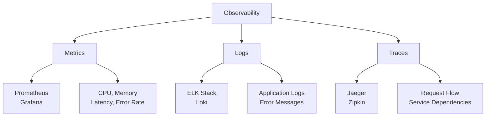
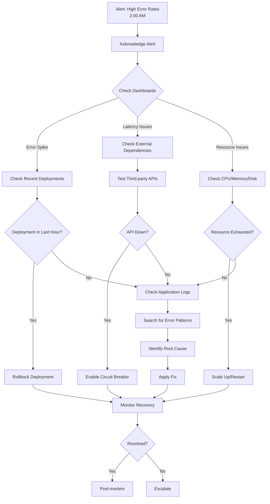

# Monitoring & Observability - Answers

## Question 1: Monitoring Distributed Systems

📋 **[Back to Question](../sse-topics.md#monitoring--observability)** | **Topic:** Monitoring and observability

**Detailed Answer:**

#### Three Pillars of Observability



#### 1. Metrics (Prometheus + Grafana)

**Prometheus Setup:**

```yaml
# prometheus.yml
global:
  scrape_interval: 15s
  evaluation_interval: 15s

scrape_configs:
  - job_name: 'spring-boot-apps'
    metrics_path: '/actuator/prometheus'
    static_configs:
      - targets:
        - 'api-server-1:8080'
        - 'api-server-2:8080'
        - 'api-server-3:8080'
  
  - job_name: 'postgres'
    static_configs:
      - targets: ['postgres-exporter:9187']
  
  - job_name: 'redis'
    static_configs:
      - targets: ['redis-exporter:9121']

alerting:
  alertmanagers:
    - static_configs:
      - targets: ['alertmanager:9093']
```

**Spring Boot Metrics:**

```java
@RestController
@RequestMapping("/api")
public class UserController {
    
    private final MeterRegistry meterRegistry;
    private final Counter requestCounter;
    private final Timer requestTimer;
    
    public UserController(MeterRegistry meterRegistry) {
        this.meterRegistry = meterRegistry;
        
        // Custom metrics
        this.requestCounter = Counter.builder("api.requests.total")
            .description("Total API requests")
            .tag("endpoint", "users")
            .register(meterRegistry);
        
        this.requestTimer = Timer.builder("api.requests.duration")
            .description("API request duration")
            .tag("endpoint", "users")
            .register(meterRegistry);
    }
    
    @GetMapping("/users/{id}")
    public ResponseEntity<User> getUser(@PathVariable Long id) {
        return requestTimer.record(() -> {
            requestCounter.increment();
            
            try {
                User user = userService.getUser(id);
                return ResponseEntity.ok(user);
            } catch (UserNotFoundException e) {
                meterRegistry.counter("api.errors",
                    "endpoint", "users",
                    "error", "not_found").increment();
                throw e;
            }
        });
    }
}
```

**Key Metrics to Track:**

```promql
# Golden Signals (Google SRE)

# 1. Latency (response time)
histogram_quantile(0.95, 
  rate(http_server_requests_seconds_bucket[5m])
)

# 2. Traffic (requests per second)
sum(rate(http_server_requests_seconds_count[5m])) by (uri)

# 3. Errors (error rate)
sum(rate(http_server_requests_seconds_count{status=~"5.."}[5m])) 
/ 
sum(rate(http_server_requests_seconds_count[5m]))

# 4. Saturation (resource utilization)
100 - (avg by (instance) (irate(node_cpu_seconds_total{mode="idle"}[5m])) * 100)
```

**Grafana Dashboard:**

```json
{
  "dashboard": {
    "title": "Service Overview",
    "panels": [
      {
        "title": "Request Rate",
        "targets": [
          {
            "expr": "sum(rate(http_server_requests_seconds_count[5m])) by (uri)"
          }
        ]
      },
      {
        "title": "P95 Latency",
        "targets": [
          {
            "expr": "histogram_quantile(0.95, rate(http_server_requests_seconds_bucket[5m]))"
          }
        ]
      },
      {
        "title": "Error Rate",
        "targets": [
          {
            "expr": "sum(rate(http_server_requests_seconds_count{status=~\"5..\"}[5m]))"
          }
        ]
      }
    ]
  }
}
```

#### 2. Logs (ELK Stack / Loki)

**Structured Logging:**

```java
@Slf4j
@Service
public class OrderService {
    
    public Order createOrder(CreateOrderRequest request) {
        MDC.put("userId", String.valueOf(request.getUserId()));
        MDC.put("orderId", UUID.randomUUID().toString());
        
        try {
            log.info("Creating order", 
                kv("userId", request.getUserId()),
                kv("items", request.getItems().size()),
                kv("totalAmount", request.getTotalAmount()));
            
            Order order = processOrder(request);
            
            log.info("Order created successfully",
                kv("orderId", order.getId()),
                kv("status", order.getStatus()));
            
            return order;
            
        } catch (PaymentFailedException e) {
            log.error("Payment failed",
                kv("userId", request.getUserId()),
                kv("amount", request.getTotalAmount()),
                kv("error", e.getMessage()),
                e);
            throw e;
        } finally {
            MDC.clear();
        }
    }
}
```

**Logback Configuration:**

```xml
<configuration>
    <appender name="JSON" class="ch.qos.logback.core.ConsoleAppender">
        <encoder class="net.logstash.logback.encoder.LogstashEncoder">
            <includeContext>true</includeContext>
            <includeMdc>true</includeMdc>
            <includeCallerData>true</includeCallerData>
        </encoder>
    </appender>
    
    <root level="INFO">
        <appender-ref ref="JSON"/>
    </root>
</configuration>
```

**Elasticsearch Query (Kibana):**

```json
GET logs-*/_search
{
  "query": {
    "bool": {
      "must": [
        { "match": { "level": "ERROR" }},
        { "range": { "@timestamp": { "gte": "now-1h" }}}
      ]
    }
  },
  "aggs": {
    "errors_by_service": {
      "terms": { "field": "service.name" }
    }
  }
}
```

#### 3. Distributed Tracing (Jaeger/Zipkin)

**Spring Boot with Micrometer Tracing:**

```yaml
# application.yml
management:
  tracing:
    sampling:
      probability: 1.0  # 100% sampling for dev/staging
  zipkin:
    tracing:
      endpoint: http://zipkin:9411/api/v2/spans
```

```java
@RestController
public class OrderController {
    
    private final Tracer tracer;
    private final OrderService orderService;
    private final PaymentService paymentService;
    
    @PostMapping("/orders")
    public Order createOrder(@RequestBody CreateOrderRequest request) {
        Span span = tracer.nextSpan().name("createOrder").start();
        
        try (Tracer.SpanInScope ws = tracer.withSpan(span)) {
            span.tag("user.id", String.valueOf(request.getUserId()));
            span.tag("order.total", String.valueOf(request.getTotalAmount()));
            
            // This creates child spans automatically
            Order order = orderService.createOrder(request);
            paymentService.processPayment(order);
            
            span.tag("order.id", String.valueOf(order.getId()));
            return order;
            
        } catch (Exception e) {
            span.tag("error", "true");
            span.tag("error.message", e.getMessage());
            throw e;
        } finally {
            span.end();
        }
    }
}
```

#### Alerting Strategy

**Prometheus Alert Rules:**

```yaml
# alerts.yml
groups:
  - name: api_alerts
    interval: 30s
    rules:
      # High error rate
      - alert: HighErrorRate
        expr: |
          sum(rate(http_server_requests_seconds_count{status=~"5.."}[5m]))
          /
          sum(rate(http_server_requests_seconds_count[5m]))
          > 0.05
        for: 5m
        labels:
          severity: critical
        annotations:
          summary: "High error rate detected"
          description: "Error rate is {{ $value | humanizePercentage }} for {{ $labels.instance }}"
      
      # High latency
      - alert: HighLatency
        expr: |
          histogram_quantile(0.95,
            rate(http_server_requests_seconds_bucket[5m])
          ) > 1.0
        for: 5m
        labels:
          severity: warning
        annotations:
          summary: "High latency detected"
          description: "P95 latency is {{ $value }}s for {{ $labels.instance }}"
      
      # Service down
      - alert: ServiceDown
        expr: up{job="spring-boot-apps"} == 0
        for: 1m
        labels:
          severity: critical
        annotations:
          summary: "Service is down"
          description: "{{ $labels.instance }} has been down for more than 1 minute"
```

**AlertManager Configuration:**

```yaml
# alertmanager.yml
global:
  slack_api_url: 'https://hooks.slack.com/services/YOUR/WEBHOOK/URL'

route:
  group_by: ['alertname', 'cluster']
  group_wait: 10s
  group_interval: 10s
  repeat_interval: 12h
  receiver: 'slack-notifications'
  
  routes:
    - match:
        severity: critical
      receiver: 'pagerduty'
    
    - match:
        severity: warning
      receiver: 'slack-notifications'

receivers:
  - name: 'slack-notifications'
    slack_configs:
      - channel: '#alerts'
        title: '{{ .GroupLabels.alertname }}'
        text: '{{ range .Alerts }}{{ .Annotations.description }}{{ end }}'
  
  - name: 'pagerduty'
    pagerduty_configs:
      - service_key: 'YOUR_PAGERDUTY_KEY'
```

#### SLI/SLO/SLA

```yaml
# Service Level Indicators (SLIs)
slis:
  - name: availability
    description: "Percentage of successful requests"
    query: |
      sum(rate(http_server_requests_seconds_count{status!~"5.."}[30d]))
      /
      sum(rate(http_server_requests_seconds_count[30d]))
  
  - name: latency
    description: "95th percentile response time"
    query: |
      histogram_quantile(0.95,
        rate(http_server_requests_seconds_bucket[30d])
      )

# Service Level Objectives (SLOs)
slos:
  - name: availability_slo
    sli: availability
    target: 0.999  # 99.9% uptime
    window: 30d
  
  - name: latency_slo
    sli: latency
    target: 0.5  # 500ms P95
    window: 30d

# Service Level Agreements (SLAs)
# Customer-facing commitments
sla:
  uptime: "99.9%"  # 43.2 minutes downtime per month
  response_time: "< 500ms for 95% of requests"
  support: "24/7 critical issue support"
```

#### Complete Monitoring Stack

```yaml
# docker-compose.yml
version: '3.8'

services:
  prometheus:
    image: prom/prometheus
    volumes:
      - ./prometheus.yml:/etc/prometheus/prometheus.yml
    ports:
      - "9090:9090"
  
  grafana:
    image: grafana/grafana
    ports:
      - "3000:3000"
    environment:
      - GF_SECURITY_ADMIN_PASSWORD=admin
  
  elasticsearch:
    image: docker.elastic.co/elasticsearch/elasticsearch:8.11.0
    environment:
      - discovery.type=single-node
    ports:
      - "9200:9200"
  
  kibana:
    image: docker.elastic.co/kibana/kibana:8.11.0
    ports:
      - "5601:5601"
  
  jaeger:
    image: jaegertracing/all-in-one
    ports:
      - "16686:16686"  # UI
      - "14268:14268"  # Collector
  
  alertmanager:
    image: prom/alertmanager
    ports:
      - "9093:9093"
```

---

## Question 2: 2 AM Production Incident Response

📋 **[Back to Question](../sse-topics.md#monitoring--observability)** | **Topic:** Troubleshooting and incident response

**Detailed Answer:**

#### Incident Response Flowchart



#### Step-by-Step Investigation

**Step 1: Acknowledge and Assess (2 minutes)**

```bash
# Check alert details
curl http://prometheus:9090/api/v1/alerts

# Quick dashboard check
# - Error rate timeline
# - Affected services
# - Geographic distribution
```

**Step 2: Check Recent Changes (3 minutes)**

```bash
# Check recent deployments
kubectl get events --sort-by='.lastTimestamp' | head -20

# Check recent config changes
git log --since="2 hours ago" --all

# Check who deployed what
kubectl rollout history deployment/api-server
```

**If Recent Deployment Found:**

```bash
# Immediate rollback
kubectl rollout undo deployment/api-server

# Monitor recovery
watch -n 2 'kubectl get pods | grep api-server'

# Check error rates dropping
curl -G http://prometheus:9090/api/v1/query \
  --data-urlencode 'query=rate(http_server_requests_seconds_count{status=~"5.."}[5m])'
```

**Step 3: Check Application Logs (5 minutes)**

```bash
# Aggregate errors from all instances
kubectl logs -l app=api-server --since=1h | grep ERROR | sort | uniq -c | sort -rn

# Search for specific error patterns
kubectl logs -l app=api-server --since=1h | grep "NullPointerException\|SQLException\|TimeoutException"

# Check specific pod
kubectl logs api-server-7d9f8c-xyz --tail=100
```

**Common Error Patterns:**

```log
# Database connection pool exhausted
ERROR - HikariPool-1 - Connection is not available

# Out of memory
ERROR - java.lang.OutOfMemoryError: Java heap space

# External API timeout
ERROR - Read timed out executing GET https://api.third-party.com

# Circuit breaker open
ERROR - CircuitBreaker 'paymentService' is OPEN
```

**Step 4: Check External Dependencies (3 minutes)**

```bash
# Test database connectivity
kubectl exec -it api-server-xyz -- nc -zv postgres-service 5432

# Test Redis
kubectl exec -it api-server-xyz -- redis-cli -h redis-service ping

# Test external APIs
curl -w "@curl-format.txt" -o /dev/null -s https://api.third-party.com/health
```

**Step 5: Check Resource Utilization (2 minutes)**

```bash
# Pod resource usage
kubectl top pods -l app=api-server

# Node resources
kubectl top nodes

# Check for OOMKilled pods
kubectl get pods -l app=api-server -o json | jq '.items[] | select(.status.containerStatuses[].lastState.terminated.reason == "OOMKilled")'
```

#### Incident Communication

```markdown
**Incident Report - #INC-2025-001**

**Status:** Investigating
**Severity:** P1 - Critical
**Started:** 2025-01-15 02:00 UTC
**Impact:** 500 error rate at 15% (baseline: 0.1%)

**Timeline:**
- 02:00 - Alert triggered: High error rate
- 02:02 - On-call engineer acknowledged
- 02:05 - Identified recent deployment at 01:45
- 02:08 - Initiated rollback to previous version
- 02:12 - Rollback complete, monitoring recovery
- 02:15 - Error rate dropped to 2%
- 02:20 - Error rate back to baseline (0.1%)

**Root Cause:**
Deployment v2.5.3 introduced NullPointerException in user profile endpoint when optional bio field is null.

**Resolution:**
Rolled back to v2.5.2. Fix in progress for v2.5.4.

**Action Items:**
1. Add null check in UserProfileService
2. Add integration test for null bio field
3. Improve staging environment testing

**Communication:**
- Posted in #incidents channel
- Notified on-call manager
- Customer support team notified
```

#### Quick Fixes

**1. Scale Up Resources:**

```bash
# Horizontal scaling
kubectl scale deployment api-server --replicas=10

# Vertical scaling (requires restart)
kubectl set resources deployment api-server \
  --limits=cpu=2,memory=4Gi \
  --requests=cpu=1,memory=2Gi
```

**2. Enable Circuit Breaker:**

```java
// Emergency circuit breaker activation
curl -X POST http://api-server:8080/actuator/circuitbreakers/paymentService \
  -d '{"state": "FORCED_OPEN"}'
```

**3. Increase Connection Pool:**

```yaml
# ConfigMap update
kubectl edit configmap api-server-config

# Change values
spring:
  datasource:
    hikari:
      maximum-pool-size: 50  # Was 20
      connection-timeout: 30000
```

**4. Emergency Feature Flag:**

```bash
# Disable problematic feature
curl -X POST http://feature-flag-service/api/flags/new-profile-ui/disable
```

#### Post-Incident Actions

**1. Write Post-mortem (within 24 hours):**

```markdown
# Post-mortem: 500 Errors on User Profile Endpoint

