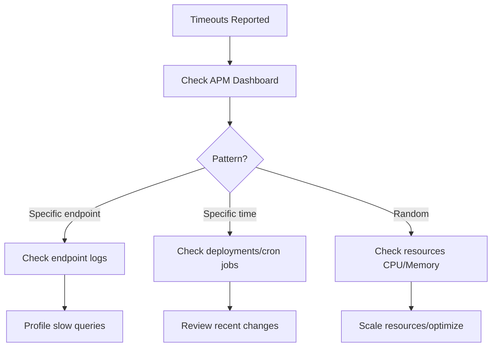

## Problem Solving & Code Quality - Answers

### Question 1: Production Debugging - Intermittent Timeouts

**Investigation Flow:**


**Action Steps:**
1. Correlate with deployments
2. Check database slow query logs
3. Review APM traces
4. Examine external dependency latencies
5. Check connection pool exhaustion
6. Review thread dumps for deadlocks

---

### Question 2: Code Quality Practices

**Team Practices:**
```java
// 1. Code Reviews
- Mandatory for all PRs
- Check for patterns, not syntax
- Focus on maintainability

// 2. Automated Quality Gates
- SonarQube: Code smells, security vulnerabilities
- Test coverage: Minimum 80%
- Linting: Checkstyle, PMD

// 3. Pair Programming
- Complex features
- Knowledge sharing
- Reduce defects

// 4. Regular Refactoring
- Boy Scout Rule: Leave code better
- Dedicate time for tech debt

// 5. Documentation
- README for each service
- Architecture Decision Records (ADRs)
- API documentation (OpenAPI/Swagger)
```

---

