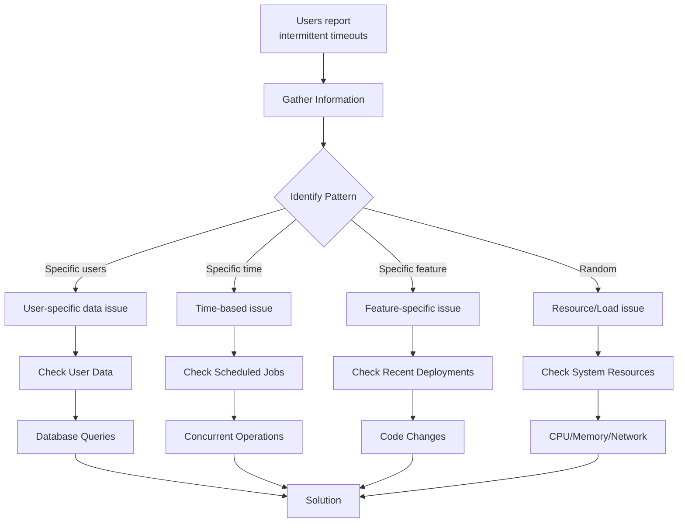

# Problem Solving - Answers

## Question 1: Production Debugging - Intermittent Timeouts

📋 **[Back to Question](../sse-topics.md#problem-solving)** | **Topic:** Debugging and problem-solving

**Detailed Answer:**

#### Systematic Troubleshooting Process



#### Step 1: Gather Information

**Questions to ask:**

```bash
# When did it start?
- Exact timestamp of first report
- Any recent deployments?
- Any infrastructure changes?

# What's the scope?
- All users or specific users?
- All features or specific endpoint?
- Specific geographic region?
- Mobile vs web?

# What's the frequency?
- Consistent pattern or random?
- Time of day correlation?
- Growing worse or stable?

# What's the user experience?
- Complete timeout or slow response?
- Error message shown?
- Any data loss?
```

**Initial data collection:**

```bash
# Check application logs
kubectl logs -f deployment/api-service --since=1h | grep -i "timeout\|error"

# Check recent deployments
kubectl rollout history deployment/api-service

# Check pod restarts
kubectl get pods -o wide

# Check resource usage
kubectl top pods
kubectl top nodes
```

#### Step 2: Check Application Logs

```bash
# Filter for errors and timeouts
grep -E "timeout|ERROR|WARN" /var/log/application.log | tail -100

# Look for specific error patterns
grep "ReadTimeoutException\|SocketTimeoutException" /var/log/application.log

# Check for out of memory errors
grep "OutOfMemoryError\|GC overhead" /var/log/application.log

# Analyze by timestamp
awk '{print $1, $2}' /var/log/application.log | grep "2026-01-16 10:" | sort | uniq -c

# Find slowest requests
grep "duration=" /var/log/application.log | \
  awk -F'duration=' '{print $2}' | \
  awk '{print $1}' | \
  sort -rn | head -20
```

**Spring Boot logging configuration:**

```yaml
# application.yml
logging:
  level:
    root: INFO
    com.example: DEBUG
    org.springframework.web: DEBUG
    org.hibernate.SQL: DEBUG
  pattern:
    console: "%d{yyyy-MM-dd HH:mm:ss} - %msg%n"
    file: "%d{yyyy-MM-dd HH:mm:ss} [%thread] %-5level %logger{36} - %msg - duration=%X{duration}ms - traceId=%X{traceId}%n"
```

#### Step 3: APM Tools (Application Performance Monitoring)

**New Relic query:**

```sql
-- Find slow transactions
SELECT average(duration), percentile(duration, 95, 99)
FROM Transaction
WHERE appName = 'api-service'
AND name LIKE '%/api/orders%'
SINCE 1 hour ago
FACET name
```

**Datadog query:**

```
-- Find timeouts by endpoint
requests:trace.servlet.request{env:production,service:api-service}
.rollup(count)
.by(resource_name)
WHERE status:timeout
```

**Grafana dashboard queries:**

```promql
# Request duration p95
histogram_quantile(0.95, 
  rate(http_server_requests_seconds_bucket[5m])
)

# Error rate
rate(http_server_requests_seconds_count{status="5xx"}[5m])

# Timeout count
increase(http_requests_total{outcome="timeout"}[5m])
```

#### Step 4: Check Database Performance

```sql
-- PostgreSQL: Find slow queries
SELECT 
    pid,
    now() - query_start AS duration,
    query,
    state
FROM pg_stat_activity
WHERE state != 'idle'
  AND now() - query_start > interval '5 seconds'
ORDER BY duration DESC;

-- Find long-running transactions
SELECT 
    pid,
    now() - xact_start AS duration,
    query
FROM pg_stat_activity
WHERE xact_start IS NOT NULL
  AND now() - xact_start > interval '10 seconds'
ORDER BY duration DESC;

-- Check for locks
SELECT 
    blocked_locks.pid AS blocked_pid,
    blocked_activity.query AS blocked_query,
    blocking_locks.pid AS blocking_pid,
    blocking_activity.query AS blocking_query
FROM pg_catalog.pg_locks blocked_locks
JOIN pg_catalog.pg_stat_activity blocked_activity ON blocked_activity.pid = blocked_locks.pid
JOIN pg_catalog.pg_locks blocking_locks 
    ON blocking_locks.locktype = blocked_locks.locktype
    AND blocking_locks.database IS NOT DISTINCT FROM blocked_locks.database
    AND blocking_locks.relation IS NOT DISTINCT FROM blocked_locks.relation
    AND blocking_locks.pid != blocked_locks.pid
JOIN pg_catalog.pg_stat_activity blocking_activity ON blocking_activity.pid = blocking_locks.pid
WHERE NOT blocked_locks.granted;

-- Check table sizes and bloat
SELECT 
    schemaname,
    tablename,
    pg_size_pretty(pg_total_relation_size(schemaname||'.'||tablename)) AS size
FROM pg_tables
WHERE schemaname NOT IN ('pg_catalog', 'information_schema')
ORDER BY pg_total_relation_size(schemaname||'.'||tablename) DESC
LIMIT 10;

-- MySQL: Check processlist
SHOW FULL PROCESSLIST;

-- MySQL: Slow query log
SELECT * FROM mysql.slow_log 
WHERE start_time > NOW() - INTERVAL 1 HOUR
ORDER BY query_time DESC
LIMIT 10;
```

**Enable query logging temporarily:**

```java
// Spring Boot - log slow queries
spring:
  jpa:
    properties:
      hibernate:
        show_sql: true
        format_sql: true
        use_sql_comments: true
        session:
          events:
            log:
              LOG_QUERIES_SLOWER_THAN_MS: 1000  # Log queries > 1 second
```

#### Step 5: Check External Dependencies

```bash
# Test external API response times
curl -w "@curl-format.txt" -o /dev/null -s "https://payment-api.example.com/health"

# curl-format.txt
time_namelookup:  %{time_namelookup}s\n
time_connect:  %{time_connect}s\n
time_appconnect:  %{time_appconnect}s\n
time_pretransfer:  %{time_pretransfer}s\n
time_redirect:  %{time_redirect}s\n
time_starttransfer:  %{time_starttransfer}s\n
time_total:  %{time_total}s\n

# Check DNS resolution
nslookup payment-api.example.com
dig payment-api.example.com

# Check network latency
ping -c 10 payment-api.example.com
traceroute payment-api.example.com

# Test with timeout
timeout 5s curl https://payment-api.example.com/api/status
```

**Circuit breaker metrics:**

```java
@Service
public class ExternalAPIService {
    
    @Autowired
    private MeterRegistry meterRegistry;
    
    @CircuitBreaker(
        name = "paymentAPI",
        fallbackMethod = "paymentFallback"
    )
    @TimeLimiter(name = "paymentAPI")
    public CompletableFuture<PaymentResponse> processPayment(PaymentRequest request) {
        long startTime = System.currentTimeMillis();
        
        try {
            PaymentResponse response = paymentClient.process(request);
            
            long duration = System.currentTimeMillis() - startTime;
            meterRegistry.timer("external.api.duration", "service", "payment")
                .record(duration, TimeUnit.MILLISECONDS);
            
            return CompletableFuture.completedFuture(response);
            
        } catch (Exception e) {
            meterRegistry.counter("external.api.error", 
                "service", "payment",
                "error", e.getClass().getSimpleName())
                .increment();
            throw e;
        }
    }
    
    public CompletableFuture<PaymentResponse> paymentFallback(PaymentRequest request, Exception e) {
        log.error("Payment API circuit breaker triggered", e);
        // Return cached response or queue for later
        return CompletableFuture.completedFuture(PaymentResponse.retryLater());
    }
}
```

#### Step 6: Check System Resources

```bash
# CPU usage
top -bn1 | grep "Cpu(s)"
mpstat 1 10  # 10 samples, 1 second apart

# Memory usage
free -h
ps aux --sort=-%mem | head -10

# Disk I/O
iostat -x 1 10
iotop -o  # Show processes doing I/O

# Network
netstat -an | grep ESTABLISHED | wc -l  # Connection count
ss -s  # Socket statistics
iftop  # Network bandwidth

# Check for port exhaustion
cat /proc/sys/net/ipv4/ip_local_port_range
ss -tan | awk '{print $4}' | cut -d':' -f2 | \
  sort | uniq -c | sort -rn | head

# File descriptors
lsof | wc -l
cat /proc/sys/fs/file-max
```

**Kubernetes resource check:**

```bash
# Pod resource usage
kubectl top pods --namespace=production

# Node resource usage
kubectl top nodes

# Describe pod for limits
kubectl describe pod api-service-xyz --namespace=production

# Check for throttling
kubectl get hpa --namespace=production

# Check events
kubectl get events --namespace=production --sort-by='.lastTimestamp'
```

#### Step 7: Check for Memory Leaks

```bash
# Java heap dump
jmap -dump:format=b,file=heap-dump.hprof <pid>

# Analyze with Eclipse MAT or VisualVM

# Check for memory leaks in Spring Boot
# Add to application.yml
management:
  endpoints:
    web:
      exposure:
        include: heapdump,metrics,prometheus
  metrics:
    export:
      prometheus:
        enabled: true

# Query heap usage
curl http://localhost:8080/actuator/metrics/jvm.memory.used

# Thread dump
jstack <pid> > thread-dump.txt

# Analyze thread states
grep "java.lang.Thread.State" thread-dump.txt | sort | uniq -c
```

**Connection pool leak detection:**

```java
// HikariCP configuration
spring:
  datasource:
    hikari:
      maximum-pool-size: 10
      minimum-idle: 5
      connection-timeout: 20000
      idle-timeout: 300000
      max-lifetime: 1200000
      leak-detection-threshold: 60000  # Alert if connection held > 60s

// Monitor connection pool
@Component
public class DataSourceMetrics {
    
    @Autowired
    private HikariDataSource dataSource;
    
    @Autowired
    private MeterRegistry registry;
    
    @PostConstruct
    public void bindMetrics() {
        registry.gauge("hikari.connections.active", dataSource, ds -> 
            ds.getHikariPoolMXBean().getActiveConnections());
        registry.gauge("hikari.connections.idle", dataSource, ds -> 
            ds.getHikariPoolMXBean().getIdleConnections());
        registry.gauge("hikari.connections.total", dataSource, ds -> 
            ds.getHikariPoolMXBean().getTotalConnections());
    }
}
```

#### Step 8: Recent Deployments

```bash
# Check recent deployments
kubectl rollout history deployment/api-service

# Compare with previous version
git diff v1.2.3 v1.2.4 -- src/main/java/com/example/service/

# Check for performance regressions
# Compare metrics before/after deployment
SELECT 
    DATE_TRUNC('hour', timestamp) AS hour,
    AVG(duration) AS avg_duration,
    percentile_cont(0.95) WITHIN GROUP (ORDER BY duration) AS p95_duration
FROM request_logs
WHERE endpoint = '/api/orders'
  AND timestamp > NOW() - INTERVAL '24 hours'
GROUP BY hour
ORDER BY hour;

# Rollback if needed
kubectl rollout undo deployment/api-service
```

#### Step 9: Load Testing

```bash
# Reproduce issue with load test
# Using Apache Bench
ab -n 1000 -c 100 https://api.example.com/api/orders

# Using wrk
wrk -t12 -c400 -d30s https://api.example.com/api/orders

# Using k6
k6 run --vus 100 --duration 30s load-test.js
```

```javascript
// load-test.js (k6)
import http from 'k6/http';
import { check, sleep } from 'k6';

export let options = {
  stages: [
    { duration: '2m', target: 100 },  // Ramp up
    { duration: '5m', target: 100 },  // Stay at 100
    { duration: '2m', target: 0 },    // Ramp down
  ],
  thresholds: {
    http_req_duration: ['p(95)<500'],  // 95% under 500ms
    http_req_failed: ['rate<0.01'],     // Error rate < 1%
  },
};

export default function () {
  let response = http.get('https://api.example.com/api/orders');
  
  check(response, {
    'status is 200': (r) => r.status === 200,
    'response time OK': (r) => r.timings.duration < 500,
  });
  
  sleep(1);
}
```

#### Step 10: Communication & Resolution

**Stakeholder communication template:**

```markdown
## Production Issue: Intermittent Timeouts

**Status:** Investigating  
**Severity:** P1  
**Started:** 2026-01-16 10:30 AM UTC  
**Impact:** 5% of requests timing out, affecting order placement  

### Timeline
- 10:30 AM: First user reports received
- 10:35 AM: On-call engineer paged
- 10:40 AM: Investigation started
- 10:50 AM: Root cause identified - database connection pool exhaustion
- 11:00 AM: Fix deployed (increased pool size from 10 to 20)
- 11:10 AM: Monitoring shows issue resolved

### Root Cause
- Recent deployment increased concurrent requests
- Database connection pool size not adjusted
- Connections held longer due to new feature's complex queries
- Pool exhaustion caused timeout errors

### Resolution
- Immediate: Increased connection pool size to 20
- Short-term: Optimize slow queries identified
- Long-term: Implement connection pool monitoring alerts

### Prevention
- Add connection pool metrics to dashboard
- Set alert for >80% pool utilization
- Load test before deployment with production-like traffic
- Review database query performance in code reviews

### Communication
- Status page updated
- Customer support notified
- Engineering team briefed
- Post-mortem scheduled for tomorrow
```

#### Common Causes Checklist

```markdown
## Timeout Root Causes Checklist

### Application Layer
- [ ] Slow database queries
- [ ] N+1 query problem
- [ ] Missing database indexes
- [ ] Connection pool exhaustion
- [ ] Thread pool exhaustion
- [ ] Memory leaks causing GC pauses
- [ ] Inefficient algorithms (O(n²) instead of O(n))
- [ ] Synchronous calls to slow external APIs

### Infrastructure Layer
- [ ] CPU throttling (K8s limits)
- [ ] Memory limits causing OOMKill
- [ ] Disk I/O saturation
- [ ] Network latency/packet loss
- [ ] Load balancer misconfiguration
- [ ] DNS resolution delays
- [ ] SSL/TLS handshake slowness

### External Dependencies
- [ ] Third-party API degradation
- [ ] Database replication lag
- [ ] Cache server down (Redis/Memcached)
- [ ] Message queue congestion
- [ ] CDN issues

### Recent Changes
- [ ] New deployment
- [ ] Configuration change
- [ ] Infrastructure scaling
- [ ] Database migration
- [ ] Third-party API changes
```

#### Best Practices

1. **Structured logging** - Include correlation IDs, timestamps, duration
2. **Distributed tracing** - Use Jaeger/Zipkin to trace requests
3. **Monitoring** - Comprehensive metrics and alerts
4. **Timeout configuration** - Set appropriate timeouts at every level
5. **Circuit breakers** - Fail fast on external dependencies
6. **Load testing** - Regular testing before deployments
7. **Runbooks** - Document common issues and solutions
8. **Blameless post-mortems** - Learn from incidents

---

