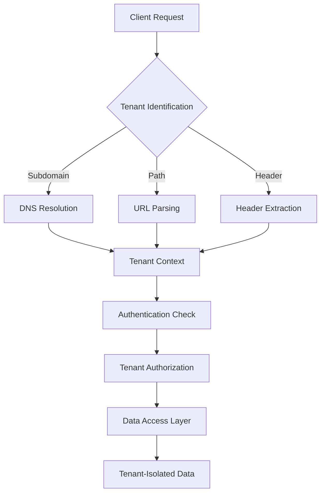
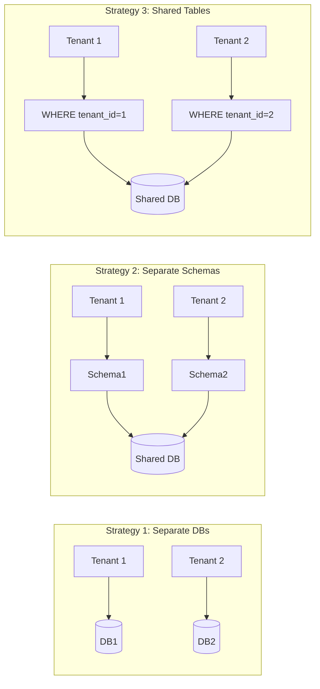
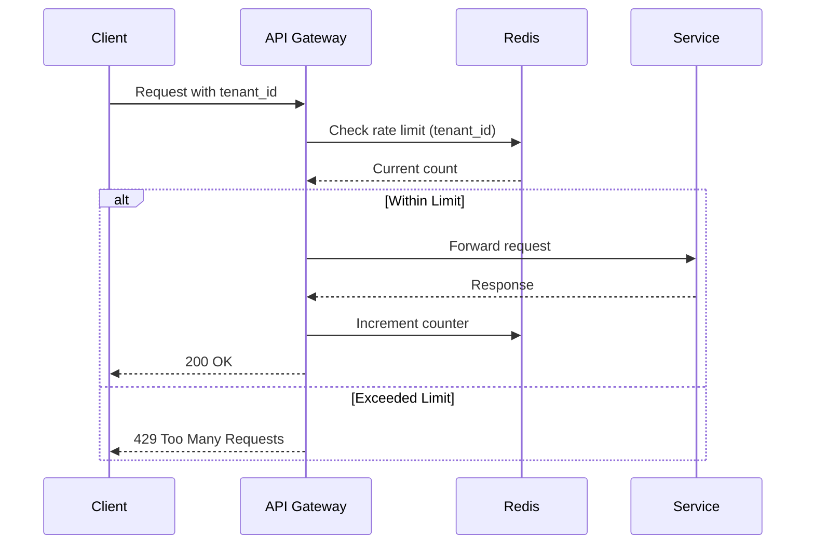
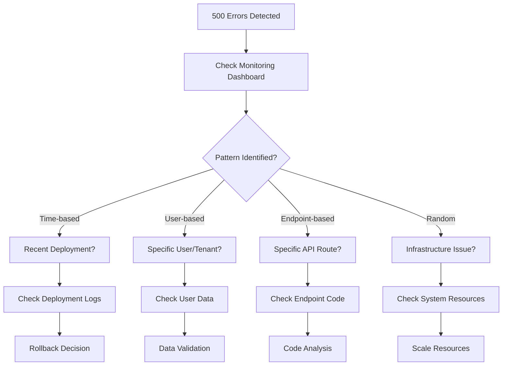
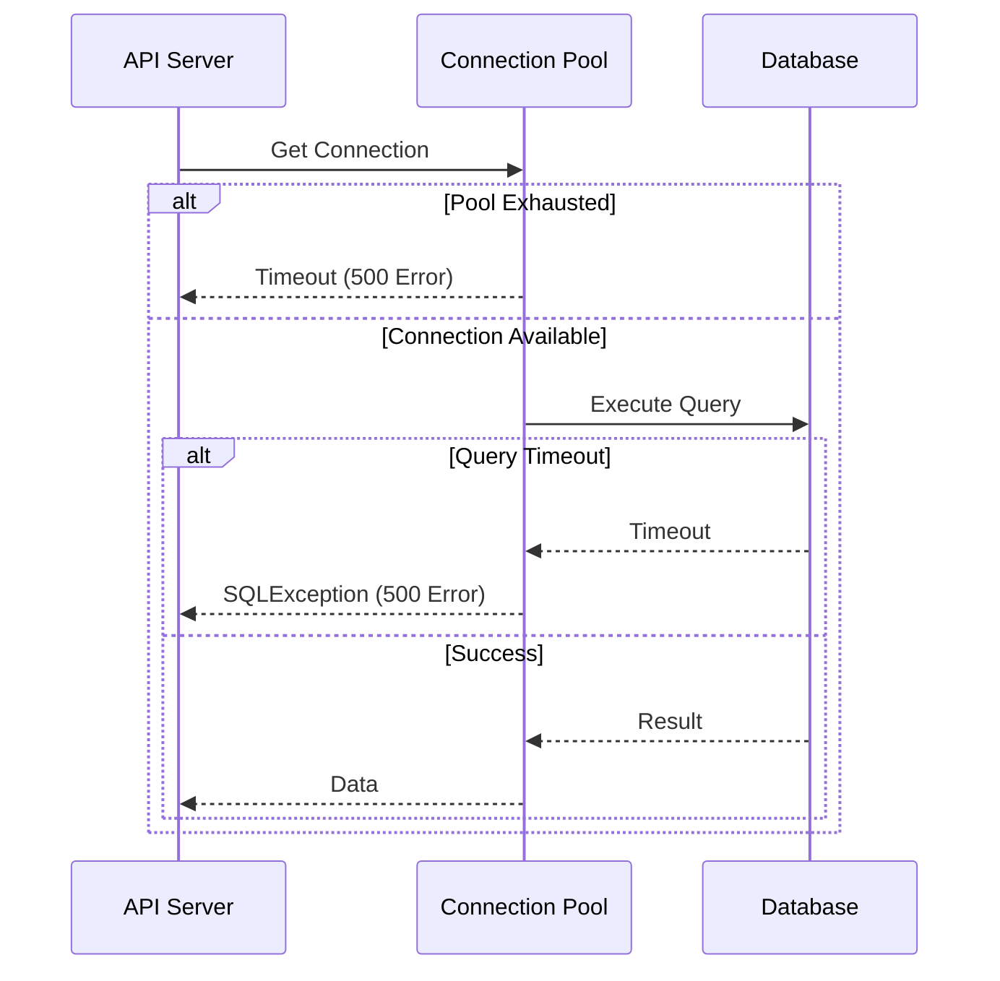
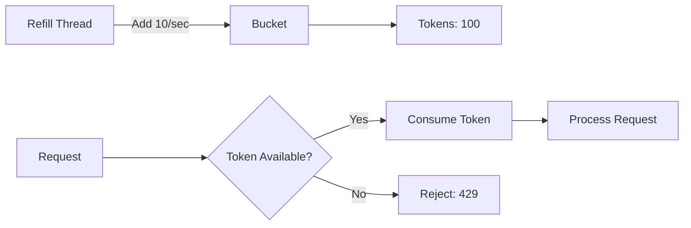
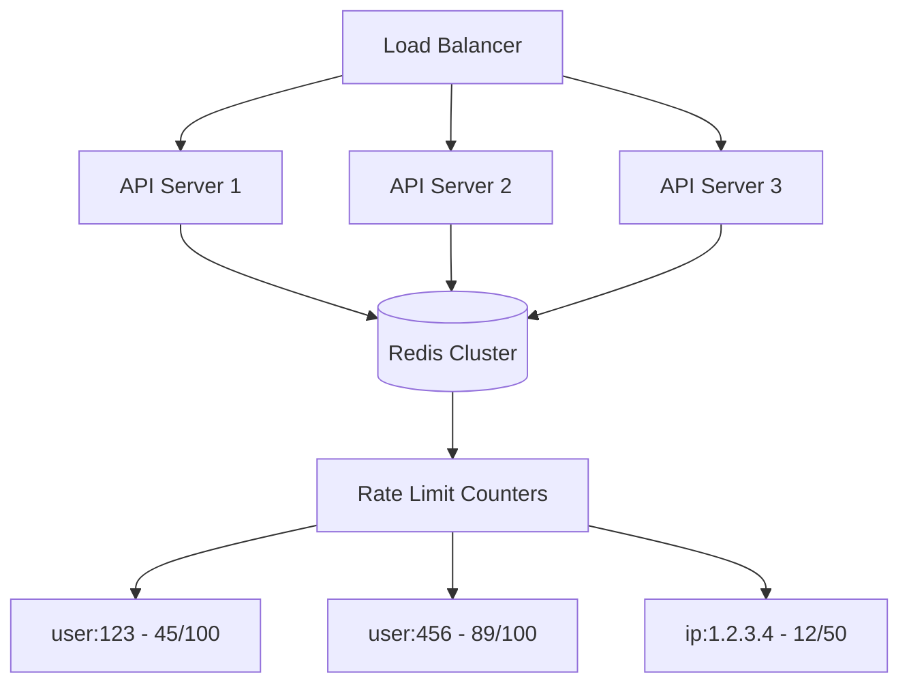

# REST APIs - Answers

## Question 1: Multi-tenant SaaS REST API Design

📋 **[Back to Question](../sse-topics.md#rest-apis)**

**Detailed Answer:**

When designing a REST API for multi-tenant SaaS applications, consider these key strategies:

### 1. Tenant Identification Strategies

**Option A: Subdomain-based**
```
https://tenant1.myapp.com/api/v1/users
https://tenant2.myapp.com/api/v1/users
```

**Option B: Path-based**
```
https://api.myapp.com/tenants/tenant1/v1/users
https://api.myapp.com/tenants/tenant2/v1/users
```

**Option C: Header-based**
```
GET /api/v1/users
Headers: X-Tenant-ID: tenant1
```



### 2. Data Isolation Strategies

**Strategy 1: Separate Databases**
- Each tenant has its own database
- Maximum isolation and security
- Higher operational complexity
- Best for: Compliance-heavy industries, large enterprises

**Strategy 2: Shared Database, Separate Schemas**
- One database, separate schema per tenant
- Good balance of isolation and management
- Moderate complexity

**Strategy 3: Shared Database, Shared Schema**
- All tenants share the same tables
- Use `tenant_id` column as discriminator
- Most cost-effective
- Requires careful query filtering



### 3. Authentication & Authorization

```java
// JWT Token with tenant context
{
  "sub": "user123",
  "tenant_id": "tenant1",
  "roles": ["admin"],
  "exp": 1234567890
}
```

**Implementation Example:**
```java
@RestController
@RequestMapping("/api/v1/users")
public class UserController {
    
    @GetMapping
    public ResponseEntity<List<User>> getUsers(
        @RequestHeader("X-Tenant-ID") String tenantId,
        Authentication auth) {
        
        // Verify tenant from JWT matches header
        if (!auth.getTenantId().equals(tenantId)) {
            throw new UnauthorizedException();
        }
        
        return userService.getUsersByTenant(tenantId);
    }
}
```

### 4. Rate Limiting per Tenant



**Implementation:**
```java
public class TenantRateLimiter {
    private final RedisTemplate<String, Long> redis;
    
    public boolean allowRequest(String tenantId, String tier) {
        String key = "rate_limit:" + tenantId;
        int limit = getRateLimitForTier(tier); // e.g., 1000 req/min
        
        Long count = redis.opsForValue().increment(key);
        if (count == 1) {
            redis.expire(key, 1, TimeUnit.MINUTES);
        }
        
        return count <= limit;
    }
}
```

### 5. Security Considerations

- **Cross-tenant data leakage prevention**: Always filter by tenant_id in queries
- **SQL injection protection**: Use parameterized queries
- **Row-level security**: Database-level tenant filtering
- **API key management**: Separate keys per tenant
- **Audit logging**: Track all tenant data access

### 6. Scalability Considerations

- **Tenant sharding**: Distribute tenants across multiple database instances
- **Caching**: Use tenant-aware cache keys (`cache:tenant1:users`)
- **Connection pooling**: Separate pools per tenant tier
- **Async processing**: Queue-based background jobs with tenant context

---

## Question 2: REST API Debugging (500 Errors)

📋 **[Back to Question](../sse-topics.md#rest-apis)**

**Detailed Answer:**

When facing 500 errors on 20% of requests, follow this systematic approach:

### Debugging Process Flow



### Step-by-Step Investigation

**Step 1: Check Monitoring Tools**
```bash
# Example: Query error patterns
# APM Tool (New Relic, DataDog, etc.)
# - Error rate by endpoint
# - Error rate by time
# - Response time percentiles
```

**Step 2: Examine Application Logs**
```bash
# Search for stack traces
grep "500" /var/log/app/error.log | tail -100

# Look for patterns
grep "NullPointerException\|SQLException\|TimeoutException" error.log

# Check specific time window
grep "2026-01-14 10:" error.log | wc -l
```

**Step 3: Database Connection Analysis**



**Step 4: Check External Dependencies**
```java
// Circuit breaker pattern to identify failing dependencies
@CircuitBreaker(name = "paymentService", 
    fallbackMethod = "paymentFallback")
public PaymentResponse processPayment(Payment payment) {
    return paymentClient.process(payment);
}

// Monitor circuit breaker metrics
// - Open circuit = dependency is down
// - Half-open = testing recovery
```

**Step 5: Analyze Request Payload Patterns**
```bash
# Check if specific payloads cause issues
# Example: Large file uploads, special characters, etc.

# Extract failed request IDs
SELECT request_id, payload_size, error_message 
FROM request_logs 
WHERE status_code = 500 
  AND timestamp > NOW() - INTERVAL 1 HOUR;
```

### Common Root Causes

1. **Database Connection Pool Exhaustion**
   - Solution: Increase pool size or fix connection leaks
   
2. **Null Pointer Exceptions**
   - Solution: Add null checks, use `Optional<T>`
   
3. **Timeout Issues**
   - Solution: Increase timeouts or optimize slow queries
   
4. **Out of Memory**
   - Solution: Increase heap size or fix memory leaks
   
5. **External Service Failures**
   - Solution: Implement circuit breakers and fallbacks

### Quick Fix Actions

```java
// Enable debug logging temporarily
logging.level.com.myapp=DEBUG

// Add request/response interceptor for failing requests
@Component
public class ErrorLoggingInterceptor implements HandlerInterceptor {
    @Override
    public void afterCompletion(HttpServletRequest request, 
                                HttpServletResponse response, 
                                Object handler, 
                                Exception ex) {
        if (response.getStatus() == 500) {
            log.error("500 Error - URI: {}, Params: {}, Exception: {}", 
                request.getRequestURI(), 
                request.getParameterMap(), 
                ex);
        }
    }
}
```

---

## Question 3: Rate Limiting Implementation

📋 **[Back to Question](../sse-topics.md#rest-apis)**

**Detailed Answer:**

### Rate Limiting Algorithms

**1. Token Bucket Algorithm**



**Implementation:**
```java
public class TokenBucketRateLimiter {
    private final long capacity;
    private final long refillRate;
    private long tokens;
    private long lastRefillTime;
    
    public TokenBucketRateLimiter(long capacity, long refillRatePerSecond) {
        this.capacity = capacity;
        this.refillRate = refillRatePerSecond;
        this.tokens = capacity;
        this.lastRefillTime = System.currentTimeMillis();
    }
    
    public synchronized boolean allowRequest() {
        refill();
        
        if (tokens > 0) {
            tokens--;
            return true;
        }
        return false;
    }
    
    private void refill() {
        long now = System.currentTimeMillis();
        long elapsedTime = now - lastRefillTime;
        long tokensToAdd = (elapsedTime / 1000) * refillRate;
        
        tokens = Math.min(capacity, tokens + tokensToAdd);
        lastRefillTime = now;
    }
}
```

**2. Sliding Window Algorithm**

```java
public class SlidingWindowRateLimiter {
    private final RedisTemplate<String, String> redis;
    private final int maxRequests;
    private final long windowSizeMs;
    
    public boolean allowRequest(String clientId) {
        String key = "rate_limit:" + clientId;
        long now = System.currentTimeMillis();
        long windowStart = now - windowSizeMs;
        
        // Remove old entries
        redis.opsForZSet().removeRangeByScore(key, 0, windowStart);
        
        // Count requests in window
        Long count = redis.opsForZSet().count(key, windowStart, now);
        
        if (count < maxRequests) {
            // Add current request
            redis.opsForZSet().add(key, UUID.randomUUID().toString(), now);
            redis.expire(key, windowSizeMs, TimeUnit.MILLISECONDS);
            return true;
        }
        
        return false;
    }
}
```

### Distributed Rate Limiting Architecture



### Spring Boot Implementation

```java
@Component
public class RateLimitingFilter extends OncePerRequestFilter {
    
    @Autowired
    private RedisTemplate<String, Long> redisTemplate;
    
    @Override
    protected void doFilterInternal(HttpServletRequest request, 
                                   HttpServletResponse response, 
                                   FilterChain filterChain) 
            throws ServletException, IOException {
        
        String clientId = extractClientId(request);
        String key = "rate_limit:" + clientId;
        
        // Increment counter
        Long requests = redisTemplate.opsForValue().increment(key);
        
        if (requests == 1) {
            // Set expiry for first request
            redisTemplate.expire(key, 1, TimeUnit.MINUTES);
        }
        
        // Get rate limit for client tier
        int limit = getRateLimitForClient(clientId);
        
        // Set rate limit headers
        response.setHeader("X-RateLimit-Limit", String.valueOf(limit));
        response.setHeader("X-RateLimit-Remaining", 
            String.valueOf(Math.max(0, limit - requests)));
        
        if (requests > limit) {
            response.setStatus(429);
            response.setHeader("Retry-After", "60");
            response.getWriter().write("{\"error\": \"Rate limit exceeded\"}");
            return;
        }
        
        filterChain.doFilter(request, response);
    }
    
    private String extractClientId(HttpServletRequest request) {
        // Try API key first
        String apiKey = request.getHeader("X-API-Key");
        if (apiKey != null) {
            return "api_key:" + apiKey;
        }
        
        // Fall back to IP address
        return "ip:" + request.getRemoteAddr();
    }
}
```

### Data to Track

1. **Request Count**: Number of requests in time window
2. **Time Window**: Sliding or fixed window
3. **Client Identifier**: API key, user ID, IP address
4. **Tier/Plan**: Different limits for different plans
5. **Reset Time**: When the counter resets

### Storage Considerations

**Redis Data Structure:**
```redis
# Simple counter (fixed window)
SET rate_limit:user123 45 EX 60

# Sorted set (sliding window)
ZADD rate_limit:user123 1705234567890 "req_uuid_1"
ZADD rate_limit:user123 1705234568123 "req_uuid_2"

# Hash for multiple attributes
HSET rate_limit:user123 count 45 reset_at 1705234620
```
