# Soft Skills - Answers

## Question 1: Difficult Technical Decision

📋 **[Back to Question](../sse-topics.md#soft-skills)** | **Topic:** Soft skills and decision-making

#### Question
Tell me about a difficult technical decision you made. How did you approach it and what was the outcome?

#### Comprehensive Answer

Making difficult technical decisions is a core responsibility of senior engineers. The key is structured thinking, stakeholder involvement, and learning from outcomes—whether successful or not.

---

#### 1. Framework for Technical Decision-Making


---

#### 2. Real-World Example Scenario

##### The Microservices Migration Decision

**Context:**
- Company: E-commerce platform (monolithic Rails app)
- Team: 20 engineers
- Challenge: Scaling issues, deployment bottlenecks
- Pressure: CEO wants faster feature delivery

**The Decision:**
*Should we migrate from monolith to microservices?*

---

#### 3. Step-by-Step Approach

##### Step 1: Gather Context and Data

```python
# Example: Data-driven analysis
class SystemAnalysis:
    def __init__(self):
        self.metrics = {}
    
    def analyze_current_state(self):
        """Gather quantitative data about current system"""
        return {
            'deployment_frequency': '2x per week',
            'deployment_time': '45 minutes',
            'test_suite_time': '30 minutes',
            'incident_rate': '3-4 per month',
            'team_velocity': {
                'Q1': 120,
                'Q2': 95,  # Decreasing trend
                'Q3': 85
            },
            'code_coupling': {
                'highly_coupled_modules': 15,
                'independent_modules': 3
            }
        }
    
    def calculate_pain_points(self):
        """Quantify current problems"""
        return {
            'blocked_deployments': '40% of PRs wait for others',
            'merge_conflicts': '15 per week',
            'developer_survey': {
                'frustrated_with_deploy': '75%',
                'want_more_autonomy': '80%'
            }
        }

# Analysis results
analysis = SystemAnalysis()
current_state = analysis.analyze_current_state()
pain_points = analysis.calculate_pain_points()
```

##### Step 2: Define Constraints

```markdown
## Constraints and Requirements

**Business Constraints:**
- Cannot stop feature development
- Must maintain 99.9% uptime
- Budget: $500K for migration
- Timeline: 12 months maximum

**Technical Constraints:**
- Current team skills: Ruby/Rails (strong), distributed systems (limited)
- Database: Single PostgreSQL instance (100GB)
- Traffic: 10K requests/min peak
- Integration: 5 external payment/shipping APIs

**Team Constraints:**
- 20 engineers (need 4 for migration)
- Hiring freeze in effect
- Cannot impact current velocity by >30%
```

##### Step 3: Generate Options

```markdown
## Option 1: Full Microservices Migration
**Approach:** Split into 10-15 services
**Timeline:** 12-18 months
**Cost:** $800K-1M
**Pros:**
- Maximum scalability
- Team autonomy
- Modern architecture
**Cons:**
- High complexity
- Longer timeline
- Operational overhead

## Option 2: Modular Monolith
**Approach:** Extract domains within monolith
**Timeline:** 3-6 months
**Cost:** $200K
**Pros:**
- Lower risk
- Faster delivery
- Simpler operations
**Cons:**
- Still shared database
- Deployment remains coupled
- Limited scalability

## Option 3: Strangler Fig Pattern (CHOSEN)
**Approach:** Gradually extract services
**Timeline:** 6-12 months (iterative)
**Cost:** $400K
**Pros:**
- Incremental migration
- Continuous delivery
- Learn as we go
- Reversible decisions
**Cons:**
- Dual systems temporarily
- Requires API gateway
- Team coordination needed
```

##### Step 4: Evaluate Trade-offs

```mermaid
graph TD
    A[Evaluation Criteria] --> B[Technical Fit]
    A --> C[Risk Level]
    A --> D[Cost]
    A --> E[Team Capability]
    A --> F[Business Impact]
    
    B --> B1[Scalability: ⭐⭐⭐⭐]
    B --> B2[Maintainability: ⭐⭐⭐⭐⭐]
    
    C --> C1[Implementation Risk: Medium]
    C --> C2[Operational Risk: Medium]
    
    D --> D1[Initial: $400K]
    D --> D2[Ongoing: +$50K/year]
    
    E --> E1[Learning Curve: Moderate]
    E --> E2[Staffing: Within capacity]
    
    F --> F1[Velocity Impact: -20% initially]
    F --> F2[Time to Value: 3 months]
```



##### Step 5: Create Decision Matrix

```markdown
| Criteria | Weight | Monolith | Modular Monolith | Strangler Fig | Full Microservices |
|----------|--------|----------|-------------------|---------------|---------------------|
| Time to Value | 25% | 0 | 8 | 7 | 3 |
| Risk | 20% | 9 | 8 | 7 | 4 |
| Scalability | 15% | 3 | 5 | 8 | 10 |
| Team Fit | 20% | 8 | 9 | 7 | 4 |
| Cost | 10% | 10 | 9 | 7 | 3 |
| Future Flexibility | 10% | 2 | 4 | 8 | 10 |
| **Total Score** | | **5.8** | **7.5** | **7.2** | **5.1** |
```

**Analysis:** Modular Monolith and Strangler Fig are close. Chose Strangler Fig for better long-term scalability.

---

#### 4. Stakeholder Consultation

##### Technical Team Discussion

```markdown
## Architecture Review Meeting

**Attendees:**
- Engineering Team (20 people)
- CTO
- Product Manager
- DevOps Lead

**Agenda:**
1. Present current problems (data-driven)
2. Show 3 options with trade-offs
3. Open discussion
4. Vote on preferred approach

**Key Feedback:**
- Backend team: Prefer microservices for autonomy
- Frontend team: Concerned about API changes
- DevOps: Worried about operational complexity
- Product: Needs continued feature delivery

**Consensus:**
- Start with Strangler Fig
- Extract 1 service as pilot
- Re-evaluate after 3 months
```

##### Architecture Decision Record (ADR)

```markdown
# ADR-0015: Adopt Strangler Fig Pattern for Microservices Migration

## Status
Accepted

## Context
Our monolithic Rails application has become difficult to scale and deploy. 
Team velocity has decreased 30% over 2 quarters due to code coupling and 
merge conflicts. We need to improve scalability while maintaining feature delivery.

## Decision
We will use the Strangler Fig pattern to gradually migrate to microservices.

**Phase 1 (Months 1-3):** Extract payment service
**Phase 2 (Months 4-6):** Extract inventory service  
**Phase 3 (Months 7-9):** Extract user service
**Phase 4 (Months 10-12):** Extract order service

## Consequences

**Positive:**
- Incremental migration reduces risk
- Continuous feature delivery maintained
- Team learns distributed systems gradually
- Can adjust course based on learnings

**Negative:**
- Temporary complexity of dual systems
- Need API gateway and service mesh
- Requires strong observability

## Alternatives Considered
- Full microservices migration (too risky, too long)
- Modular monolith (doesn't solve scalability)
- Stay with monolith (unsustainable)
```

---

#### 5. Implementation Plan


##### First Service: Payment Service

```go
// Example: New payment microservice in Go
package main

import (
    "github.com/gin-gonic/gin"
    "payment-service/handlers"
    "payment-service/middleware"
)

func main() {
    router := gin.Default()
    
    // Middleware
    router.Use(middleware.Auth())
    router.Use(middleware.Logging())
    router.Use(middleware.Metrics())
    
    // Routes
    v1 := router.Group("/api/v1")
    {
        v1.POST("/payments", handlers.CreatePayment)
        v1.GET("/payments/:id", handlers.GetPayment)
        v1.POST("/payments/:id/refund", handlers.RefundPayment)
    }
    
    // Health check
    router.GET("/health", handlers.HealthCheck)
    
    router.Run(":8080")
}
```

##### API Gateway Configuration

```yaml
# Kong API Gateway configuration
services:
  - name: payment-service
    url: http://payment-service:8080
    routes:
      - name: payment-routes
        paths:
          - /api/v1/payments
        methods:
          - POST
          - GET
        plugins:
          - name: rate-limiting
            config:
              minute: 100
          - name: jwt
          - name: prometheus
```

---

#### 6. Monitoring the Outcome

##### Success Metrics

```python
class MigrationMetrics:
    def track_phase_1(self):
        """Track metrics for payment service extraction"""
        return {
            'before': {
                'deployment_time': '45 min',
                'payment_latency_p95': '800ms',
                'incidents_per_month': 3.5,
                'team_velocity': 85
            },
            'after_3_months': {
                'deployment_time': '15 min (payment), 40 min (monolith)',
                'payment_latency_p95': '200ms',
                'incidents_per_month': 2.0,
                'team_velocity': 90,
                'payment_team_autonomy': 'High'
            },
            'roi': {
                'investment': '$120K',
                'payback_period': '8 months',
                'annual_savings': '$180K'
            }
        }
```

---

#### 7. The Outcome

**After 3 Months (Phase 1):**
✅ Payment service extracted successfully  
✅ Deployment time reduced by 67% for payments  
✅ Latency improved by 75%  
✅ Team morale increased  
⚠️ Operational complexity increased (manageable)  
⚠️ Initial velocity dip recovered

**Decision to Continue:**
Based on success, proceeded with Phase 2 (Inventory Service)

---

#### 8. Lessons Learned

```markdown
## Retrospective: What Went Well

1. **Incremental approach was right**
   - Reduced risk significantly
   - Learned from each phase
   
2. **Strong monitoring paid off**
   - Caught issues early
   - Data-driven decisions

3. **Team involvement crucial**
   - Buy-in from beginning
   - Shared ownership

## What Could Be Improved

1. **Underestimated operational complexity**
   - Should have hired SRE earlier
   - Needed better observability from day 1

2. **Communication gaps**
   - Frontend team surprised by API changes
   - Should have better changelog process

3. **Database migration harder than expected**
   - Data consistency challenges
   - Needed more testing

## Would I Do It Differently?

**Yes:**
- Start with better observability infrastructure
- Invest in developer tooling earlier
- More comprehensive testing strategy

**No:**
- Strangler Fig was correct choice
- Incremental approach was essential
- Team involvement process was good
```

---

#### 9. Communication Template for Difficult Decisions

```markdown
## Technical Decision Communication Framework

### For Team:
**What:** [Clear, concise statement]
**Why:** [Problem statement with data]
**How:** [Approach and timeline]
**Impact:** [What changes for them]
**Support:** [Resources available]

### For Leadership:
**Business Impact:** [Revenue, cost, risk]
**Investment Required:** [Time, money, people]
**Timeline:** [Milestones]
**ROI:** [Expected returns]
**Risks:** [What could go wrong]

### For Customers:
**Benefits:** [Improved experience]
**Timeline:** [When to expect]
**Minimal Disruption:** [How we'll ensure continuity]
```

---

#### 10. Key Takeaways

1. **Use data to inform decisions** - Not gut feeling
2. **Consider multiple options** - Avoid anchoring bias
3. **Document your reasoning** - ADRs are invaluable
4. **Involve stakeholders early** - Get buy-in
5. **Make reversible decisions when possible** - Reduce risk
6. **Monitor outcomes** - Measure what matters
7. **Learn and adapt** - No decision is final
8. **Communicate clearly** - Different messages for different audiences

---

## Question 2: Technical Disagreement Handling

📋 **[Back to Question](../sse-topics.md#soft-skills)** | **Topic:** Soft skills and communication

#### Question
Tell me about a time you disagreed with a technical decision. How did you handle it?

#### Comprehensive Answer

Handling technical disagreements professionally is a critical skill for senior engineers. The goal is healthy debate that leads to better decisions, not winning arguments.

---

#### 1. Framework for Handling Disagreements


---

#### 2. Real-World Example Scenario

##### The GraphQL vs REST API Debate

**Context:**
- Team: Backend engineering (8 people)
- Project: New API for mobile app
- Timeline: 3 months
- My Position: REST API
- Team Lead's Position: GraphQL

**Initial Reaction:**
❌ **Don't:** "GraphQL is trendy nonsense, REST works fine!"  
✅ **Do:** "I have concerns about GraphQL. Can we discuss?"

---

#### 3. Step 1: Understanding the Other Perspective

```markdown
## Active Listening Checklist

Before arguing your position, ensure you understand theirs:

- [ ] What problem are they trying to solve?
- [ ] What are their key concerns?
- [ ] What data/experience informs their view?
- [ ] What constraints are they considering?
- [ ] What's their risk tolerance?

**In this case:**
- Team Lead concerned about over-fetching
- Mobile app has bandwidth constraints
- Frontend team requested flexible queries
- Previous REST API had 20+ endpoints
```

---

#### 4. Step 2: Preparing Your Case

##### Gather Objective Data

```python
# Example: Comparative analysis
class APIComparison:
    def __init__(self):
        self.criteria = {}
    
    def analyze_graphql_vs_rest(self):
        """Data-driven comparison"""
        return {
            'development_time': {
                'graphql': {
                    'initial_setup': '2-3 weeks',
                    'learning_curve': 'Steep (team unfamiliar)',
                    'estimated_timeline': '4 months'
                },
                'rest': {
                    'initial_setup': '3-5 days',
                    'learning_curve': 'Minimal (team expert)',
                    'estimated_timeline': '2.5 months'
                }
            },
            'performance': {
                'graphql': {
                    'over_fetching': 'Eliminated',
                    'n_plus_1_risk': 'High (needs DataLoader)',
                    'caching': 'Complex'
                },
                'rest': {
                    'over_fetching': 'Moderate issue',
                    'n_plus_1_risk': 'Low (controlled endpoints)',
                    'caching': 'Standard HTTP caching'
                }
            },
            'team_readiness': {
                'graphql': '2/8 team members familiar',
                'rest': '8/8 team members expert'
            },
            'operational_complexity': {
                'graphql': {
                    'monitoring': 'Requires custom tooling',
                    'rate_limiting': 'Complex (query cost)',
                    'debugging': 'Harder (dynamic queries)'
                },
                'rest': {
                    'monitoring': 'Standard APM tools',
                    'rate_limiting': 'Simple (endpoint-based)',
                    'debugging': 'Straightforward'
                }
            },
            'mobile_app_benefit': {
                'graphql': 'High (flexible queries)',
                'rest': 'Medium (with good endpoint design)'
            }
        }

comparison = APIComparison()
analysis = comparison.analyze_graphql_vs_rest()
```

##### Document Your Concerns

```markdown
## Concerns About GraphQL for This Project

### 1. Timeline Risk (HIGH)
- **Impact:** Could delay mobile launch by 6 weeks
- **Data:** Team learning curve + setup time
- **Mitigation:** None realistic within timeline

### 2. Team Expertise (HIGH)
- **Impact:** 6/8 developers never used GraphQL
- **Data:** Team skill matrix
- **Mitigation:** Training, but still risky for production

### 3. Operational Complexity (MEDIUM)
- **Impact:** More complex monitoring and debugging
- **Data:** Need custom observability for GraphQL
- **Mitigation:** Could adopt tools like Apollo Studio

### 4. Over-engineering? (MEDIUM)
- **Impact:** Simple CRUD app might not need GraphQL
- **Data:** Requirements analysis shows straightforward data model
- **Mitigation:** Design efficient REST endpoints
```

---

#### 5. Step 3: The Discussion

##### Schedule Dedicated Time

```markdown
## Meeting Request Template

**To:** Team Lead
**Subject:** Discussion: API Technology Choice

Hi [Name],

I'd like to discuss the GraphQL vs REST decision for the mobile API project. 
I have some concerns about timeline and team readiness that I think are worth exploring.

I've prepared some data and alternatives that might help us make the best decision.

Could we schedule 30 minutes this week?

Thanks,
[Your name]
```

##### The Conversation Framework

```markdown
## Disagreement Discussion Structure

### 1. Start with Agreement (2 min)
"I agree that over-fetching is a problem and mobile performance is critical."

### 2. State Your Concerns (5 min)
"My concerns are about timeline risk and team readiness. Let me show you the data..."

### 3. Present Data (10 min)
[Show comparison analysis, risk assessment]

### 4. Propose Alternatives (5 min)
"What if we designed efficient REST endpoints now, but planned GraphQL for V2?"

### 5. Listen to Response (5 min)
[Genuinely consider their counter-arguments]

### 6. Find Common Ground (3 min)
"Seems like we both want mobile performance and on-time delivery. Let's explore options..."
```

---

#### 6. Alternative Proposals

```markdown
## Option 1: REST with Efficient Design
**Approach:** Design REST API with mobile-first endpoints
**Timeline:** 2.5 months
**Pros:** 
- Faster delivery
- Lower risk
- Team expertise
**Cons:**
- Still some over-fetching
- Less flexible for frontend

## Option 2: GraphQL (Original Plan)
**Approach:** Full GraphQL implementation
**Timeline:** 4 months
**Pros:**
- Eliminates over-fetching
- Future-proof
- Flexible queries
**Cons:**
- Delayed launch
- Team learning curve
- Operational complexity

## Option 3: Hybrid Approach (PROPOSED)
**Approach:** 
- REST for V1 (fast delivery)
- GraphQL layer in Q2 (after mobile launch)
- Gradual migration
**Timeline:** 2.5 months (V1), then iterative
**Pros:**
- On-time launch
- Gets mobile app benefits
- Team learns GraphQL gradually
- Reversible decision
**Cons:**
- Some duplication temporarily
- Extra work in Q2

## Option 4: BFF Pattern with GraphQL
**Approach:**
- Simple REST from backend services
- GraphQL BFF (Backend-for-Frontend) layer
- Only BFF team learns GraphQL
**Timeline:** 3 months
**Pros:**
- Mobile gets GraphQL benefits
- Backend stays REST (team expertise)
- Smaller learning curve
**Cons:**
- Extra layer
- Still some delay
```

---

#### 7. The Outcome

##### What Actually Happened

```markdown
## Resolution: Hybrid Approach Adopted

**Decision:**
- Phase 1 (Current sprint): REST API for mobile V1
- Phase 2 (Q2): GraphQL layer added as BFF
- Team member volunteers to become GraphQL expert

**Why This Works:**
- Meets business deadline (mobile launch)
- Addresses performance concerns (gradual improvement)
- Reduces risk (incremental approach)
- Team learns without pressure

**My Response:**
"This is a great compromise. I fully support this plan and will help ensure V1 REST API is well-designed for eventual GraphQL layer."
```

##### Implementation

```javascript
// Phase 1: REST API (Shipped on time)
// Express.js REST endpoints
app.get('/api/users/:id', async (req, res) => {
  const user = await User.findById(req.params.id);
  res.json(user);
});

app.get('/api/users/:id/posts', async (req, res) => {
  const posts = await Post.findByUserId(req.params.id);
  res.json(posts);
});

// Phase 2: GraphQL BFF Layer (Added in Q2)
// Apollo Server wrapping REST services
const typeDefs = gql`
  type User {
    id: ID!
    name: String!
    posts: [Post!]!
  }
  
  type Post {
    id: ID!
    title: String!
    content: String!
  }
  
  type Query {
    user(id: ID!): User
  }
`;

const resolvers = {
  Query: {
    user: async (_, { id }) => {
      // Calls REST backend
      return fetch(`http://api/users/${id}`).then(r => r.json());
    }
  },
  User: {
    posts: async (user) => {
      // Calls REST backend
      return fetch(`http://api/users/${user.id}/posts`).then(r => r.json());
    }
  }
};
```

---

#### 8. Lessons Learned

```markdown
## Retrospective: Handling the Disagreement

### What Worked Well ✅

1. **Data-driven approach**
   - Comparison analysis was convincing
   - Hard to argue with numbers

2. **Respectful communication**
   - No personal attacks
   - Focused on project success

3. **Multiple alternatives**
   - Showed willingness to compromise
   - Hybrid approach was win-win

4. **Full commitment after decision**
   - Didn't sabotage GraphQL plan
   - Actively helped with implementation

### What Could Improve ⚠️

1. **Earlier discussion**
   - Should have raised concerns in architecture review
   - Waiting too long increased tension

2. **More frontend input**
   - Should have involved mobile team earlier
   - Their perspective was valuable

3. **Better data initially**
   - Initial GraphQL estimate was optimistic
   - Should have validated with prototyping
```

---

#### 9. When Escalation is Necessary


##### Escalation Template

```markdown
## Escalation Email Template

**To:** Engineering Manager
**CC:** Team Lead
**Subject:** Input Needed: API Technology Decision

Hi [Manager],

[Team Lead] and I have different perspectives on the API technology choice 
for the mobile project. We've had a productive discussion but haven't reached 
consensus, and the decision is time-sensitive.

**Context:**
- Mobile API launch in 3 months
- Choosing between GraphQL and REST
- Trade-offs involve timeline, risk, and team readiness

**Both Perspectives:**
[Team Lead's view]: GraphQL provides better mobile performance and flexibility
[My view]: REST reduces timeline risk with current team expertise

**Areas of Agreement:**
- Mobile performance is critical
- On-time delivery is important
- Team should learn GraphQL eventually

**Decision Needed:**
Which approach should we take, or is there a compromise?

I've prepared detailed analysis I can share in a meeting.

Thanks,
[Your name]
```

---

#### 10. Best Practices for Disagreements

##### DO's ✅

1. **Assume good intent** - Everyone wants the best outcome
2. **Use data** - Facts over opinions
3. **Listen actively** - Understand before responding
4. **Propose alternatives** - Show willingness to compromise
5. **Stay professional** - No personal attacks
6. **Commit to decision** - Once made, support it fully
7. **Document learnings** - For future reference
8. **Give credit** - If their approach works, acknowledge it

##### DON'Ts ❌

1. **Don't make it personal** - "You always..." language
2. **Don't be passive-aggressive** - Say "I disagree", not "Whatever..."
3. **Don't go around them** - Talk to them first, not their manager
4. **Don't say "I told you so"** - Even if you were right
5. **Don't hold grudges** - Move on after resolution
6. **Don't gossip** - Keep disagreements professional
7. **Don't escalate too quickly** - Try direct discussion first
8. **Don't refuse to implement** - That's insubordination

---

#### 11. Cultural Considerations

```markdown
## Building a Healthy Disagreement Culture

### Team Agreements
- "Strong opinions, weakly held"
- "Disagree and commit"
- "Challenge ideas, not people"
- "Data over hierarchy"

### Safe Environment
- Psychological safety for junior engineers
- "There are no stupid questions"
- Blameless retrospectives
- Regular architecture reviews for debate
```

---

#### 12. Key Takeaways

1. **Pick your battles** - Not every disagreement matters
2. **Prepare thoroughly** - Data wins arguments
3. **Stay professional** - Focus on the problem, not the person
4. **Seek compromise** - Win-win is better than win-lose
5. **Commit fully** - Once decided, make it succeed
6. **Learn and reflect** - Every disagreement is a learning opportunity
7. **Build relationships** - Today's opponent is tomorrow's teammate

---

## Question 3: Staying Current with Technology

📋 **[Back to Question](../sse-topics.md#soft-skills)** | **Topic:** Learning and growth mindset

#### Question
Tell me how you stay current with technology. What have you learned recently?

#### Comprehensive Answer

Staying current with technology is essential for senior engineers. The tech landscape evolves rapidly, and maintaining relevance requires intentional learning strategies and genuine curiosity.

---

#### 1. Multi-Channel Learning Strategy


---

#### 2. Reading and Research

##### Technical Blogs and Newsletters

**High-Quality Sources:**
```markdown
## Daily/Weekly Reading List

**Engineering Blogs:**
- [Martin Fowler's Blog](https://martinfowler.com)
- [Netflix TechBlog](https://netflixtechblog.com)
- [Uber Engineering](https://eng.uber.com)
- [Spotify Engineering](https://engineering.atspotify.com)
- [AWS Architecture Blog](https://aws.amazon.com/blogs/architecture/)

**Newsletters:**
- [TLDR Newsletter](https://tldr.tech) - Daily tech news
- [Pointer.io](https://pointer.io) - Weekly curated links
- [ByteByteGo](https://blog.bytebytego.com) - System design
- [Changelog](https://changelog.com/news) - Open source news

**Aggregators:**
- Hacker News (news.ycombinator.com)
- Reddit: r/programming, r/webdev, r/devops
- Dev.to community
```

##### Books and Long-Form Content

**Recent Reading List:**
```markdown
## 2025-2026 Reading

**Completed:**
- "Designing Data-Intensive Applications" - Martin Kleppmann ⭐⭐⭐⭐⭐
- "Staff Engineer: Leadership Beyond the Management Track" - Will Larson
- "Accelerate: Building and Scaling High Performing Technology Organizations"

**In Progress:**
- "System Design Interview Vol 2" - Alex Xu
- "Database Internals" - Alex Petrov

**On Deck:**
- "Software Engineering at Google"
- "Release It! 2nd Edition" - Michael Nygard
```

##### Research Papers

```python
# Example: Tracking papers to read
class ResearchPaperTracker:
    def __init__(self):
        self.papers = []
    
    def add_influential_papers(self):
        """Papers every senior engineer should read"""
        return [
            {
                'title': 'MapReduce: Simplified Data Processing on Large Clusters',
                'authors': 'Dean & Ghemawat (Google)',
                'year': 2004,
                'why_important': 'Foundation of big data processing',
                'status': 'Read',
                'key_learnings': 'Parallelization patterns, fault tolerance'
            },
            {
                'title': 'Dynamo: Amazon\'s Highly Available Key-value Store',
                'authors': 'DeCandia et al. (Amazon)',
                'year': 2007,
                'why_important': 'Eventual consistency, distributed systems',
                'status': 'Read',
                'key_learnings': 'CAP theorem practical applications'
            },
            {
                'title': 'Attention Is All You Need',
                'authors': 'Vaswani et al. (Google)',
                'year': 2017,
                'why_important': 'Transformers architecture (GPT foundation)',
                'status': 'In Progress',
                'key_learnings': 'Understanding modern AI/ML'
            }
        ]
```

---

#### 3. Hands-On Learning

##### Side Projects

**Current Projects (2025-2026):**
```yaml
Project 1:
  name: "Personal Finance Tracker"
  technologies: [Next.js 14, Prisma, PostgreSQL, tRPC]
  learning_goals:
    - Server Components in Next.js
    - Type-safe APIs with tRPC
    - Database schema design
  status: Active
  github: private

Project 2:
  name: "Distributed Rate Limiter"
  technologies: [Go, Redis, Docker, Kubernetes]
  learning_goals:
    - Token bucket algorithm
    - Redis Lua scripts
    - Helm charts
  status: Completed
  github: public
  blog_post: "Building a Production-Ready Rate Limiter"

Project 3:
  name: "AI Code Review Assistant"
  technologies: [Python, OpenAI API, GitHub Actions, FastAPI]
  learning_goals:
    - LLM prompt engineering
    - GitHub webhooks
    - Async Python patterns
  status: Planning
```

**Example: Learning New Framework**
```javascript
// Side project: Exploring Next.js 14 Server Components
// File: app/dashboard/page.tsx

import { Suspense } from 'react';
import { getUserStats } from '@/lib/db';

// Server Component - runs on server
export default async function DashboardPage() {
  // Direct database access - no API route needed!
  const stats = await getUserStats();
  
  return (
    <div>
      <h1>Dashboard</h1>
      <Suspense fallback={<Loading />}>
        <StatsCards data={stats} />
      </Suspense>
    </div>
  );
}

// Learning: Server Components change mental model
// - No useEffect for data fetching
// - Colocation of data fetching with UI
// - Automatic loading states with Suspense
```

##### Open Source Contributions

```markdown
## Open Source Journey

**Contributions (2025):**

1. **TypeScript (Minor bug fix)**
   - PR #58234: Fixed type inference in generic constraints
   - Learning: Deep dive into TS compiler internals
   - Impact: Used by millions of developers

2. **React (Documentation)**
   - PR #26789: Updated Server Components guide
   - Learning: Technical writing, community feedback
   - Impact: Helped 1000+ developers understand new patterns

3. **Kubernetes (Feature)**
   - Issue #112345: Pod security context validation
   - Learning: Go testing patterns, Kubernetes architecture
   - Status: In review

**Benefits:**
- Learn from code reviews by maintainers
- Understand large codebases
- Build reputation in community
- Give back to tools I use daily
```

---

#### 4. Community Engagement

##### Conferences and Meetups

```markdown
## 2025-2026 Conference Attendance

**Attended:**
- ✅ AWS re:Invent 2025 (Las Vegas)
  - Learned: Serverless patterns, Step Functions workflows
  - Networking: Met engineers from Stripe, Airbnb
  
- ✅ ReactConf 2025 (Virtual)
  - Learned: React 19 features, Server Components best practices
  - Takeaway: Implemented Server Actions at work

**Upcoming:**
- 📅 KubeCon 2026 (March)
- 📅 Local TypeScript Meetup (Monthly)

**Local Engagement:**
- Organizer: San Francisco Backend Engineering Meetup
- Speaker: Gave talk on "Distributed Tracing Patterns"
```

##### Social Media and Online Communities

```python
# Example: Curated Twitter/X feed for learning
class TechTwitterCuration:
    def __init__(self):
        self.follows = []
    
    def recommended_follows(self):
        """Accounts providing high-value tech content"""
        return {
            'system_design': [
                '@alexxubyte',  # ByteByteGo - System design
                '@b0rk',        # Julia Evans - Visual explanations
                '@kelseyhightower'  # Kelsey - Kubernetes, Cloud
            ],
            'frontend': [
                '@dan_abramov',  # React co-creator
                '@ryanflorence',  # Remix, React Router
                '@leeerob'       # Next.js, Vercel
            ],
            'backend': [
                '@mipsytipsy',   # Honeycomb, Observability
                '@allspaw',      # Etsy, Resilience Engineering
                '@copyconstruct'  # Databases, Distributed Systems
            ],
            'general': [
                '@martinfowler',  # Software architecture
                '@glennswest',    # Cloud architecture
                '@rakyll'         # Go, performance
            ]
        }
```

##### Podcasts

```markdown
## Regular Podcast Rotation

**Weekly Listens:**
- **Software Engineering Daily** (Daily, 45 min)
  - Deep dives into technologies and companies
  - Recent episode: "Kafka Internals" - learned about log compaction

- **The Changelog** (Weekly)
  - Open source projects and maintainers
  - Discovered new tools through interviews

- **Stack Overflow Podcast** (Weekly)
  - Industry trends and developer culture

**Occasional:**
- Kubernetes Podcast
- Go Time
- JS Party
```

---

#### 5. Work-Based Learning

##### Code Reviews as Learning Tool

```markdown
## Learning from Code Reviews

**As Reviewer:**
- Exposure to different coding styles
- See how others solve problems
- Discover new libraries and patterns

**Example Learning:**
Reviewed PR that used Temporal.io for workflows.
→ Research: Learned about durable execution
→ Prototype: Built proof-of-concept
→ Proposal: Pitched for use in our retry logic
→ Production: Now using Temporal for async jobs
```

##### Internal Tech Talks and Lunch & Learns

```markdown
## Monthly Tech Talks (Organized)

**Format:**
- 30 min presentation
- 15 min Q&A
- Optional hands-on workshop

**Recent Topics:**
- January: "Intro to OpenTelemetry" (I presented)
- December: "PostgreSQL Performance Tuning" (DBA team)
- November: "React Server Components" (Frontend lead)

**Learning:**
- Presenting forces deep understanding
- Questions reveal gaps in knowledge
- Cross-team knowledge sharing
```

---

#### 6. Experimentation and Prototyping

##### Technology Radar

```markdown
## Personal Technology Radar (Inspired by ThoughtWorks)

**Adopt (Using in production):**
- Next.js
- PostgreSQL
- Docker/Kubernetes
- TypeScript

**Trial (Experimenting with):**
- tRPC (type-safe APIs)
- Temporal (durable workflows)
- Bun (JS runtime)

**Assess (Worth exploring):**
- Turso (distributed SQLite)
- HTMX (hypermedia approach)
- Astro (content-focused sites)

**Hold (Avoid for now):**
- Micro-frontends (complexity > benefits for our team)
- GraphQL (REST sufficient for current needs)
```

##### Learning New Languages

```go
// Example: Learning Go (coming from Python/JavaScript)
// Project: Building a CLI tool for database migrations

package main

import (
    "database/sql"
    "fmt"
    _ "github.com/lib/pq"
)

// Learning notes as comments
func main() {
    // Go uses explicit error handling (no try/catch)
    db, err := sql.Open("postgres", connStr)
    if err != nil {
        // Error handling is verbose but explicit
        fmt.Printf("Failed to connect: %v\n", err)
        return
    }
    defer db.Close()  // Defer ensures cleanup
    
    // Interfaces are implicit (no 'implements' keyword)
    var migrator Migrator = &PostgresMigrator{db: db}
    migrator.Run()
}

// Key learnings from Go:
// - Simplicity over features
// - Explicit error handling
// - Strong standard library
// - Fast compilation
// - Excellent concurrency primitives (goroutines)
```

---

#### 7. What I've Learned Recently (Real Examples)

##### Example 1: React Server Components (Q4 2025)

```markdown
## React Server Components Deep Dive

**Motivation:**
- Next.js 14 released with stable Server Components
- Team considering migration from Next.js 13

**Learning Process:**
1. Read official docs (2 hours)
2. Built simple blog app (4 hours)
3. Watched Vercel conference talks (1 hour)
4. Read source code examples (2 hours)
5. Wrote internal guide for team (3 hours)

**Key Insights:**
- Paradigm shift: Components can be async and fetch data directly
- No waterfallFetching issue with parallel data fetching
- Automatic code splitting at component level
- Mental model change: Think in server/client boundary

**Practical Application:**
- Prototyped dashboard rewrite using Server Components
- 40% reduction in client bundle size
- Simplified data fetching logic
- Proposed for next quarter's roadmap
```

##### Example 2: Database Sharding Strategies (January 2026)

```sql
-- Learning: Implementing sharding for multi-tenant SaaS

-- Challenge: Single PostgreSQL instance hitting limits at 50K tenants

-- Researched approaches:
-- 1. Horizontal sharding by tenant_id
-- 2. Citus extension (distributed PostgreSQL)
-- 3. Application-level routing

-- Prototype: Hash-based sharding
CREATE TABLE tenants_shard_1 (
    tenant_id UUID PRIMARY KEY,
    name VARCHAR(255),
    created_at TIMESTAMP,
    CHECK (hashtext(tenant_id::text) % 4 = 0)
);

CREATE TABLE tenants_shard_2 (
    tenant_id UUID PRIMARY KEY,
    name VARCHAR(255),
    created_at TIMESTAMP,
    CHECK (hashtext(tenant_id::text) % 4 = 1)
);

-- Learning outcomes:
-- - Shard key selection is critical
-- - Cross-shard queries are expensive
-- - Migration strategy must be planned upfront
-- - Went with Citus for simpler management
```

##### Example 3: LLM Prompt Engineering (November 2025)

```python
# Learning: Building AI code review assistant

from openai import OpenAI

client = OpenAI()

def review_code_with_context(code: str, file_path: str, repo_context: str):
    """
    Learning: Effective prompting requires:
    1. Clear role definition
    2. Specific context
    3. Output format specification
    4. Examples (few-shot learning)
    """
    
    prompt = f"""You are a senior software engineer conducting a code review.

Repository Context:
{repo_context}

File: {file_path}
Code:
```
{code}
```

Review this code for:
1. Bugs and edge cases
2. Performance issues
3. Security vulnerabilities
4. Code style and best practices

Format your response as:
## Issues Found
- [CRITICAL/HIGH/MEDIUM/LOW] Description
  - Location: Line X
  - Suggestion: How to fix

## Positive Aspects
- What was done well
"""

    response = client.chat.completions.create(
        model="gpt-4",
        messages=[{"role": "user", "content": prompt}],
        temperature=0.3  # Lower temperature for consistency
    )
    
    return response.choices[0].message.content

# Key learnings:
# - Prompt engineering is iterative
# - Context windows matter (token limits)
# - Temperature affects consistency
# - Few-shot examples improve results
# - Testing against diverse code samples essential
```

---

#### 8. Learning Efficiency Strategies

##### The 80/20 Rule


##### Focused Learning Blocks

```markdown
## Weekly Learning Schedule

**Monday-Thursday:**
- Morning (7-8 AM): Reading (1 hour before work)
  - Tech blogs, documentation
  
- Lunch (12-1 PM): Podcasts/Videos
  - Passive learning while eating

**Friday:**
- Afternoon (3-5 PM): Deep Focus Block
  - Work on side project
  - No meetings scheduled (team agreement)

**Weekend:**
- Saturday AM: Experimentation
  - Try new tools, build prototypes
  
- Sunday: Flexible
  - Conference talks, books
```

---

#### 9. Measuring Learning Progress

##### Personal Learning Dashboard

```javascript
// Tracking learning activities
const learningMetrics2025 = {
  books: {
    completed: 8,
    goal: 12,
    progress: '67%'
  },
  sideProjects: {
    completed: 3,
    active: 2,
    technologies_learned: ['Next.js 14', 'tRPC', 'Go', 'Temporal']
  },
  openSource: {
    contributions: 15,
    repos_contributed: 5,
    stars_earned: 234
  },
  conferences: {
    attended: 2,
    talks_given: 1,
    meetups: 12
  },
  blogPosts: {
    published: 6,
    views: 15000,
    most_popular: 'Building a Distributed Rate Limiter'
  }
};
```

---

#### 10. Avoiding Learning Pitfalls

##### Don't: Tutorial Hell

```markdown
## Common Pitfall: Tutorial Addiction

❌ **Tutorial Hell:**
- Watching 10 tutorials on same topic
- Never building anything original
- Moving to next shiny thing

✅ **Effective Learning:**
- Watch ONE good tutorial
- Build something WITHOUT following along
- Struggle and debug independently
- Only refer back when stuck
```

##### Don't: Resume-Driven Development

```markdown
## Be Intentional, Not Trendy

❌ **Resume-Driven:**
"Need to learn Rust because everyone talks about it"
(No practical application at work or projects)

✅ **Purpose-Driven:**
"Learning Rust to understand systems programming concepts"
"Applying Rust for performance-critical CLI tools"
```

---

#### 11. Sharing Knowledge

##### Teaching as Learning

```markdown
## Knowledge Sharing Activities

**Internal:**
- Monthly tech talks at work
- Code review comments with explanations
- Mentoring junior developers
- Internal documentation

**External:**
- Blog posts on personal site
- Stack Overflow answers
- Twitter threads explaining concepts
- Conference talks (goal: 1-2 per year)

**Why Teaching Helps Learning:**
- Forces deep understanding
- Reveals gaps in knowledge
- Gets feedback from community
- Builds reputation
```

---

#### 12. Example Answer for Interview

```markdown
## "How do I stay current?" - Sample Answer

"I use a multi-channel approach to stay current:

**Reading:** I subscribe to engineering blogs from companies like Netflix and 
Uber, and newsletters like TLDR and ByteByteGo. I'm currently reading 
'Database Internals' by Alex Petrov.

**Hands-On:** I maintain side projects to experiment with new technologies. 
Recently, I built a distributed rate limiter in Go to learn about token bucket 
algorithms and Redis Lua scripts. The code is on my GitHub.

**Community:** I attend our local Backend Engineering meetup monthly and went 
to AWS re:Invent last year. I also follow key people on Twitter for curated content.

**Work-Based:** I learn through code reviews and organize monthly tech talks 
at work. Last month I presented on OpenTelemetry after implementing it in our services.

**Recently learned:** In the past 3 months, I've deep-dived into React Server 
Components for a potential migration, studied database sharding strategies for 
our scaling challenges, and learned LLM prompt engineering while building an 
AI code review tool.

The key for me is hands-on application. I don't just read about technologies—I 
build something with them to truly understand trade-offs and gotchas."
```

---

## Question 4: Mentoring Struggling Junior Developer

📋 **[Back to Question](../sse-topics.md#soft-skills)** | **Topic:** Mentorship and leadership

#### Question
How would you handle a situation where a junior developer on your team is struggling?

#### Comprehensive Answer

Mentoring struggling developers is a critical senior engineer responsibility. The goal is to support their growth while maintaining team productivity and psychological safety.

---

#### 1. Framework for Supporting Struggling Developers


---

#### 2. Identifying the Signs

##### Common Indicators

```markdown
## Signs a Junior Developer is Struggling

**Code Quality Issues:**
- Frequent bugs in PRs
- Not following established patterns
- Ignoring code review feedback
- Copy-pasting code without understanding

**Productivity Issues:**
- Taking much longer than estimated
- Tasks sitting in "In Progress" for days
- Avoiding complex tickets
- Not asking for help

**Communication Issues:**
- Quiet in standups
- Not responding to messages promptly
- Avoiding pairing sessions
- Not attending team meetings

**Behavioral Signs:**
- Seems stressed or anxious
- Working long hours but low output
- Defensive about feedback
- Comparing self negatively to others
```

---

#### 3. Root Cause Analysis

```python
# Framework: Understanding why someone is struggling

class DeveloperStrugglingAnalysis:
    def __init__(self, developer_name):
        self.developer = developer_name
        self.observations = []
    
    def identify_root_causes(self):
        """
        Common root causes for struggling developers
        """
        return {
            'skills_gap': {
                'description': 'Lacks technical knowledge for role',
                'indicators': [
                    'Unfamiliar with tech stack',
                    'Misunderstands fundamental concepts',
                    'Can\'t debug effectively'
                ],
                'solution': 'Training, pairing, simplified tasks'
            },
            'overwhelming_complexity': {
                'description': 'Tasks too advanced for current level',
                'indicators': [
                    'Takes 3x longer than expected',
                    'Asks same questions repeatedly',
                    'Code quality degrades under pressure'
                ],
                'solution': 'Break down tasks, start simpler'
            },
            'lack_of_context': {
                'description': 'Doesn\'t understand system architecture',
                'indicators': [
                    'Changes don\'t consider broader impact',
                    'Surprised by how pieces connect',
                    'Asks "why" questions frequently'
                ],
                'solution': 'Architecture docs, system walkthroughs'
            },
            'process_confusion': {
                'description': 'Unclear on team workflows',
                'indicators': [
                    'Doesn\'t know when to ask for help',
                    'Misses steps in deployment',
                    'Unsure about PR expectations'
                ],
                'solution': 'Document processes, pair on full cycle'
            },
            'confidence_issues': {
                'description': 'Imposter syndrome, fear of failure',
                'indicators': [
                    'Over-apologizes',
                    'Hesitant to share ideas',
                    'Avoids challenging work'
                ],
                'solution': 'Reassurance, celebrate wins, safe environment'
            },
            'personal_issues': {
                'description': 'External factors affecting work',
                'indicators': [
                    'Recent performance decline',
                    'Seems distracted or tired',
                    'Mentions life challenges'
                ],
                'solution': 'Flexibility, involve manager, EAP resources'
            }
        }
```

---

#### 4. The Initial Conversation

##### Scheduling the 1-on-1

```markdown
## Message Template (Slack/Email)

Hey [Name],

I'd like to chat about how things are going. I've noticed you might be  
facing some challenges with [specific observation], and I want to make sure 
you have the support you need.

Could we grab 30 minutes this week? This is completely normal—we all need 
help sometimes, and I'm here to support you.

Let me know what works for your schedule!

[Your name]
```

##### Conversation Structure

```markdown
## 1-on-1 Conversation Framework

**1. Set the Tone (2 min)**
"Thanks for meeting. I want to start by saying this is a supportive conversation—
we all struggle sometimes, and my job is to help you succeed."

**2. Share Observations (3 min)**
"I've noticed [specific examples]:
- The authentication feature took longer than expected
- You seemed uncertain during the architecture discussion
- Your last few PRs had some bugs that could have been caught with tests

I'm not saying this to criticize—I'm saying it because I want to help."

**3. Listen to Their Perspective (10 min)**
"How are you feeling about your work right now?"
"What's been most challenging for you?"
"Is there anything outside of work affecting you?"

[Listen actively, don't interrupt, take notes]

**4. Identify Specific Challenges (5 min)**
"It sounds like the main challenges are:
1. [Challenge 1]
2. [Challenge 2]
3. [Challenge 3]

Did I understand correctly?"

**5. Collaborative Problem Solving (8 min)**
"Let's talk about how we can address these. What do you think would help?"
[Listen to their ideas first]
"I have some ideas too: [propose support strategies]"

**6. Create Action Plan (2 min)**
"Here's what we'll do:
- [Action 1] - I'll [my responsibility]
- [Action 2] - You'll [their responsibility]
- We'll check in again [timeframe]

Does this sound good?"
```

---

#### 5. Support Strategies

##### Strategy 1: Pair Programming

```markdown
## Structured Pairing Sessions

**Schedule:**
- 2-3 times per week
- 1-2 hour sessions
- Focused on specific skills

**Approach:**
- Driver/Navigator pattern
- Switch roles every 20 minutes
- Think out loud to demonstrate reasoning

**Example Session:**
Week 1: "Let's build a REST endpoint together"
Week 2: "Let's debug this production issue together"
Week 3: "Let's write tests for this feature together"
Week 4: "You drive, I'll navigate and ask questions"
```

**Example: Pairing on API Development**

```python
# Pair programming session: Building a user API endpoint

# Phase 1: Senior drives, junior observes
# Senior thinks out loud:
"""
"First, let's think about what this endpoint needs to do:
1. Accept user input
2. Validate it
3. Save to database
4. Return response

I'm starting with the validation because invalid data is the most common issue.
Notice how I'm using Pydantic here—it handles validation automatically..."
"""

from fastapi import FastAPI, HTTPException
from pydantic import BaseModel, EmailStr, validator

class UserCreate(BaseModel):
    email: EmailStr  # Pydantic validates email format
    username: str
    age: int
    
    @validator('username')
    def username_must_be_valid(cls, v):
        # Explaining validation logic
        if len(v) < 3:
            raise ValueError('Username must be at least 3 characters')
        return v

# Phase 2: Junior drives, senior navigates
# Senior: "Now you implement the endpoint. I'll guide you."
# Junior writes code, senior asks questions:
"""
- "What happens if the email already exists?"
- "Should we return a 200 or 201 status?"
- "How do we handle database errors?"
"""

@app.post("/users", status_code=201)
async def create_user(user: UserCreate):
    # Junior implements with senior guidance
    # ...existing code...
    pass
```

##### Strategy 2: Task Breakdown

```markdown
## Breaking Down Complex Tasks

**Original Task:** "Implement user authentication system"
(Too broad for struggling junior)

**Broken Down:**

**Phase 1: Foundation (1 week)**
- [ ] Create User model with password hashing
- [ ] Write tests for User model
- [ ] Review: Pair with senior on model design

**Phase 2: Registration (1 week)**
- [ ] Implement registration endpoint
- [ ] Add validation
- [ ] Write API tests
- [ ] Review: Code review with detailed feedback

**Phase 3: Login (1 week)**
- [ ] Implement login endpoint
- [ ] Add JWT token generation
- [ ] Write tests
- [ ] Review: Senior tests authentication flow

**Phase 4: Authorization (1 week)**
- [ ] Add protected endpoint decorator
- [ ] Implement token validation
- [ ] Add tests for unauthorized access
- [ ] Review: Security audit with senior

**Each phase:**
- Clear acceptance criteria
- Checkpoints for review
- Learning objectives stated
```

##### Strategy 3: Gradual Complexity Increase


##### Strategy 4: Comprehensive Resources

```markdown
## Resource Package for Junior Developer

**Immediate:**
- [ ] Share "Getting Started" guide (team-specific)
- [ ] Grant access to learning platforms (Pluralsight, Frontend Masters)
- [ ] Provide architecture diagrams with explanations
- [ ] Share team's coding standards document

**Technical Skills:**
- [ ] Curated list of tutorials for tech stack
- [ ] Example PRs demonstrating good patterns
- [ ] Testing best practices guide
- [ ] Debugging checklist

**Process:**
- [ ] PR checklist and review guidelines
- [ ] Deployment runbook
- [ ] "Who to ask for what" team guide
- [ ] Meeting etiquette and expectations

**Regular:**
- [ ] Weekly 1-on-1 for check-in
- [ ] Bi-weekly pairing sessions
- [ ] Monthly skill assessment and goal-setting
```

---

#### 6. Building Confidence

##### Celebrate Small Wins

```markdown
## Recognition Strategy

**Public Recognition:**
- Call out good work in standup
- Highlight their PR in team chat
- Mention their contribution in sprint review

**Private Encouragement:**
"Hey, I noticed you handled that edge case really well in your PR. 
That shows good attention to detail. Keep it up!"

**Progression Tracking:**
Week 1: "Fixed first bug independently"
Week 4: "Completed feature with minimal guidance"
Week 8: "Helped onboard newer team member"
Week 12: "Reviewed another developer's PR"
```

##### Safe Environment for Questions

```markdown
## Creating Psychological Safety

**Team Norms:**
- "No question is stupid"
- "We all Google basic things"
- "Asking for help is a strength, not weakness"

**Lead by Example:**
- Senior engineer: "I'm stuck on this CSS issue, can someone help?"
- Shows it's okay to not know everything
- Models healthy help-seeking behavior

**Slack Channel: #learning-together**
- Safe space for questions
- Senior engineers answer patiently
- Celebrate learning moments
```

---

#### 7. Regular Check-ins and Feedback

##### Weekly 1-on-1 Template

```markdown
## Weekly Check-in Agenda (15-20 min)

**1. How are you feeling? (3 min)**
- General wellbeing check
- Work-life balance

**2. Progress review (5 min)**
- What went well this week?
- What was challenging?
- Blockers or concerns?

**3. Learning focus (5 min)**
- What did you learn?
- Questions that came up?
- Areas to focus next week?

**4. Feedback (5 min)**
- Positive feedback (specific)
- Constructive feedback (with examples)
- Action items

**5. Support needs (2 min)**
- What help do you need next week?
- Schedule pairing sessions
```

##### Feedback Delivery Framework

```markdown
## SBI Model: Situation-Behavior-Impact

❌ **Bad Feedback:**
"Your code quality needs improvement."
(Vague, demoralizing)

✅ **Good Feedback:**
"In yesterday's PR (Situation), I noticed the authentication logic didn't 
include input validation (Behavior). This could allow invalid data into our 
database and cause security issues (Impact). Let's pair on adding validation 
patterns—I'll show you how we typically handle this."

**Key Elements:**
- Specific situation
- Observable behavior
- Clear impact
- Constructive path forward
- Offer to help
```

---

#### 8. When to Escalate


##### Manager Escalation Email

```markdown
## Template: Escalating to Manager

Subject: Support Discussion - [Junior Dev Name]

Hi [Manager],

I wanted to discuss [Junior's name] progress. I've been working with them for 
the past 6 weeks on [specific challenges].

**Support provided:**
- Weekly 1-on-1s
- Bi-weekly pairing sessions
- Task breakdowns and simplified assignments
- Technical resources and documentation

**Progress:**
- [Positive aspects]
- [Areas still struggling]

**Concern:**
Despite consistent support, [specific concerning patterns]. I want to ensure 
we're providing the right level and type of support.

**Next steps I'm considering:**
1. [Option 1]
2. [Option 2]
3. [Option 3]

Can we discuss the best path forward?

[Your name]
```

---

#### 9. Real-World Success Story

```markdown
## Case Study: Turning Around a Struggling Junior

**Initial Situation (Week 0):**
- Junior developer "Alex" joining team after bootcamp
- First job, no CS degree
- Struggling with async JavaScript concepts
- Taking 2-3x longer on tasks
- Visibly stressed, working nights/weekends

**Intervention (Weeks 1-4):**

Week 1:
- Had supportive 1-on-1 conversation
- Identified gaps: promises, async/await, event loop
- Created learning plan

Week 2:
- Paired on async API call implementation
- Explained event loop with visual diagrams
- Shared curated resources

Week 3:
- Alex implemented timeout handling independently
- Provided positive feedback in team chat
- Noticed increased confidence

Week 4:
- Alex asked smart questions in PR review
- Completed task in expected timeframe
- Started helping another bootcamp grad

**Outcome (Week 12):**
- Consistently delivering quality code
- Comfortable with async patterns
- Mentoring newer team member
- Gave internal talk on "Understanding JavaScript Event Loop"

**Key Success Factors:**
- Early identification
- Specific skill gaps addressed
- Consistent support without micromanaging
- Celebrated progress
- Safe environment for questions
```

---

#### 10. Best Practices Summary

```markdown
## Do's and Don'ts

**DO:**
✅ Identify struggles early
✅ Have private, supportive conversations
✅ Break down complex tasks
✅ Pair regularly
✅ Celebrate small wins
✅ Provide specific, actionable feedback
✅ Create safe space for questions
✅ Be patient—learning takes time
✅ Involve manager when needed

**DON'T:**
❌ Criticize publicly
❌ Compare to other developers
❌ Take over their work
❌ Give up too quickly
❌ Ignore the problem hoping it resolves
❌ Provide vague feedback
❌ Rush their learning
❌ Make them feel stupid for asking questions
```

---

