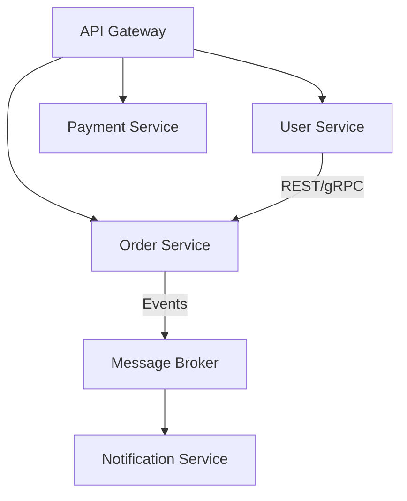

# Software Architecture - Answers

## Question 1: Microservices vs Monolith

📋 **[Back to Question](../sse-topics.md#software-architecture)** | **Topic:** Microservices architecture understanding

**Microservices:**


**When to use:**
- Large teams (10+)
- Need independent deployment
- Different tech stacks per service
- Scalability requirements vary

**Monolith:**
- Small teams (< 10)
- MVP/early stage
- Simpler operations
- Tight coupling acceptable

**Hybrid:** Start monolith, extract services when boundaries are clear.

---

## Question 2: Event-Driven Architecture

📋 **[Back to Question](../sse-topics.md#software-architecture)** | **Topic:** Event-driven architecture knowledge

```java
// Message Broker Choice

// Kafka - High throughput, log-based
- Pros: Durability, replay capability, ordering
- Cons: Complex ops, eventual consistency

// RabbitMQ - Traditional messaging
- Pros: Routing flexibility, easy setup
- Cons: Lower throughput than Kafka

// AWS SQS/SNS - Managed service
- Pros: No ops, auto-scaling
- Cons: Vendor lock-in, limited features
```

**Decision:** Kafka for event sourcing/streaming, RabbitMQ for work queues, SQS for simple decoupling.

---

