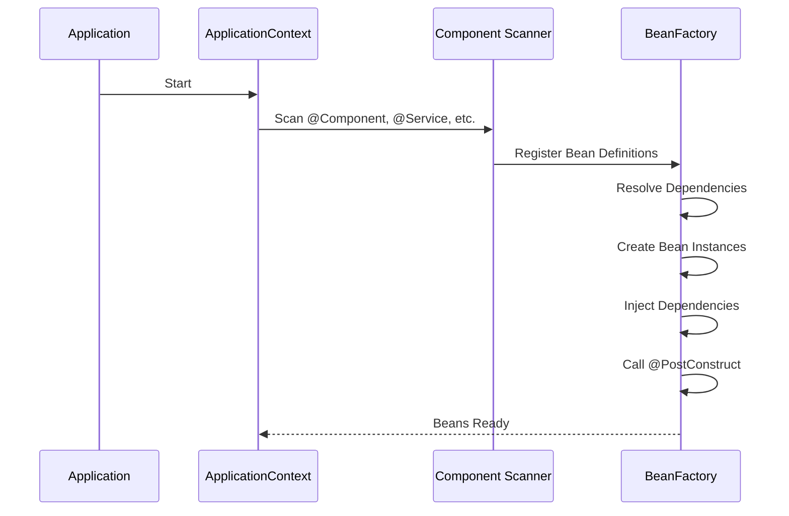
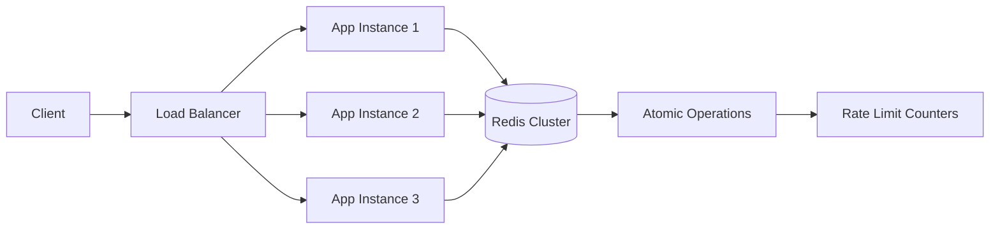

# Spring Boot - Answers

## Question 1: @Component vs @Service vs @Repository

📋 **[Back to Question](../sse-topics.md#spring-boot)**

**Answer:** Semantically different but technically similar - all create Spring beans.

- **@Component:** Generic stereotype
- **@Service:** Business logic layer
- **@Repository:** Data access layer (adds automatic exception translation)

```java
@Repository // Translates SQLException to DataAccessException
public class UserRepository {
    // Data access code
}

@Service // Marks business logic
public class UserService {
    // Business logic
}
```

---

## Question 2: Memory Leak Diagnosis in Spring Boot

📋 **[Back to Question](../sse-topics.md#spring-boot)**

**Investigation Steps:**
1. Generate heap dump: `jmap -dump:live,format=b,file=heap.bin <pid>`
2. Analyze with Eclipse MAT or JProfiler
3. Look for:
   - Prototype beans in singleton beans
   - Event listeners not unregistered
   - ThreadLocal not cleaned
   - Static collections growing unbounded

```java
// Common issue: Prototype in Singleton
@Service
public class SingletonService {
    @Autowired
    private PrototypeBean prototypeBean; // ❌ Same instance reused!
}

// Fix: Use ObjectFactory or lookup method
@Service
public class SingletonService {
    @Autowired
    private ObjectFactory<PrototypeBean> prototypeBeanFactory;
    
    public void doWork() {
        PrototypeBean bean = prototypeBeanFactory.getObject(); // ✅ New instance
    }
}
```

---

## Question 3: Spring Dependency Injection Lifecycle

📋 **[Back to Question](../sse-topics.md#spring-boot)**



**Key Phases:**
1. Component scanning
2. Bean definition registration
3. Dependency resolution
4. Bean instantiation
5. Dependency injection
6. Initialization callbacks (@PostConstruct)

---

## Question 4: @Transactional Propagation

📋 **[Back to Question](../sse-topics.md#spring-boot)**

**REQUIRES_NEW:** Creates new transaction even if one exists.

```java
@Transactional(propagation = Propagation.REQUIRES_NEW)
public void auditLog(String action) {
    // Runs in separate transaction
    // Commits independently of parent
}
```

**Use Cases:**
- Audit logging (must commit even if parent fails)
- Independent operations

**Risks:**
- Deadlocks in same table
- Performance overhead (new transaction)
- Complexity in error handling

---

## Question 5: Handling Long-Running Operations (Async)

📋 **[Back to Question](../sse-topics.md#spring-boot)**

**Detailed Answer:**

#### Approach 1: @Async with CompletableFuture

**Configuration:**
```java
@Configuration
@EnableAsync
public class AsyncConfig implements AsyncConfigurer {
    
    @Override
    @Bean(name = "taskExecutor")
    public Executor getAsyncExecutor() {
        ThreadPoolTaskExecutor executor = new ThreadPoolTaskExecutor();
        executor.setCorePoolSize(5);
        executor.setMaxPoolSize(10);
        executor.setQueueCapacity(100);
        executor.setThreadNamePrefix("async-");
        executor.setRejectedExecutionHandler(new ThreadPoolExecutor.CallerRunsPolicy());
        executor.initialize();
        return executor;
    }
    
    @Override
    public AsyncUncaughtExceptionHandler getAsyncUncaughtExceptionHandler() {
        return new CustomAsyncExceptionHandler();
    }
}

public class CustomAsyncExceptionHandler implements AsyncUncaughtExceptionHandler {
    
    private static final Logger log = LoggerFactory.getLogger(CustomAsyncExceptionHandler.class);
    
    @Override
    public void handleUncaughtException(Throwable ex, Method method, Object... params) {
        log.error("Async method {} threw exception: {}", 
                 method.getName(), ex.getMessage(), ex);
        // Send alert, log to monitoring system, etc.
    }
}
```

**Service Implementation:**
```java
@Service
public class ReportService {
    
    @Autowired
    private ReportRepository reportRepository;
    
    @Autowired
    private EmailService emailService;
    
    // Async method that returns CompletableFuture
    @Async("taskExecutor")
    public CompletableFuture<Report> generateReport(Long userId) {
        log.info("Generating report for user: {} on thread: {}", 
                userId, Thread.currentThread().getName());
        
        try {
            // Simulate long-running operation
            Thread.sleep(5000);
            
            Report report = new Report();
            report.setUserId(userId);
            report.setData(fetchReportData(userId));
            report.setGeneratedAt(LocalDateTime.now());
            
            Report saved = reportRepository.save(report);
            
            return CompletableFuture.completedFuture(saved);
            
        } catch (Exception e) {
            log.error("Error generating report", e);
            return CompletableFuture.failedFuture(e);
        }
    }
    
    // Fire-and-forget async method
    @Async
    public void sendNotificationAsync(String email, String message) {
        log.info("Sending notification async on thread: {}", 
                Thread.currentThread().getName());
        emailService.send(email, message);
    }
}
```

**Controller Usage:**
```java
@RestController
@RequestMapping("/api/reports")
public class ReportController {
    
    @Autowired
    private ReportService reportService;
    
    // Non-blocking endpoint
    @PostMapping("/generate")
    public ResponseEntity<String> generateReport(@RequestParam Long userId) {
        
        // Start async task
        CompletableFuture<Report> futureReport = 
            reportService.generateReport(userId);
        
        // Return immediately
        return ResponseEntity.accepted()
            .body("Report generation started. You'll be notified when ready.");
    }
    
    // Wait for completion
    @PostMapping("/generate-sync")
    public ResponseEntity<Report> generateReportSync(@RequestParam Long userId) 
            throws ExecutionException, InterruptedException {
        
        CompletableFuture<Report> futureReport = 
            reportService.generateReport(userId);
        
        // Wait for result (blocks this request, but doesn't block other requests)
        Report report = futureReport.get(30, TimeUnit.SECONDS);
        
        return ResponseEntity.ok(report);
    }
    
    // Combine multiple async operations
    @PostMapping("/generate-all")
    public ResponseEntity<List<Report>> generateMultipleReports(
            @RequestParam List<Long> userIds) throws Exception {
        
        // Start all tasks in parallel
        List<CompletableFuture<Report>> futures = userIds.stream()
            .map(reportService::generateReport)
            .collect(Collectors.toList());
        
        // Wait for all to complete
        CompletableFuture<Void> allFutures = CompletableFuture.allOf(
            futures.toArray(new CompletableFuture[0]));
        
        // Get all results
        allFutures.get(60, TimeUnit.SECONDS);
        
        List<Report> reports = futures.stream()
            .map(CompletableFuture::join)
            .collect(Collectors.toList());
        
        return ResponseEntity.ok(reports);
    }
}
```

#### Approach 2: Message Queue (Recommended for Production)

```java
// 1. Configuration
@Configuration
public class RabbitMQConfig {
    
    @Bean
    public Queue reportQueue() {
        return new Queue("report.generation.queue", true);
    }
    
    @Bean
    public Jackson2JsonMessageConverter messageConverter() {
        return new Jackson2JsonMessageConverter();
    }
}

// 2. Producer (Controller)
@RestController
@RequestMapping("/api/reports")
public class ReportController {
    
    @Autowired
    private RabbitTemplate rabbitTemplate;
    
    @PostMapping("/generate")
    public ResponseEntity<String> generateReport(@RequestParam Long userId) {
        
        ReportRequest request = new ReportRequest(userId, UUID.randomUUID().toString());
        
        // Send to queue
        rabbitTemplate.convertAndSend("report.generation.queue", request);
        
        return ResponseEntity.accepted()
            .body("Report generation queued. Request ID: " + request.getRequestId());
    }
}

// 3. Consumer (Worker)
@Service
public class ReportWorker {
    
    @Autowired
    private ReportService reportService;
    
    @RabbitListener(queues = "report.generation.queue", concurrency = "5-10")
    public void processReportRequest(ReportRequest request) {
        log.info("Processing report request: {}", request.getRequestId());
        
        try {
            Report report = reportService.generateReportSync(request.getUserId());
            
            // Notify user
            reportService.sendNotification(request.getUserId(), 
                "Your report is ready: " + report.getId());
            
        } catch (Exception e) {
            log.error("Failed to generate report", e);
            // Send to DLQ or retry
        }
    }
}
```

#### Approach 3: Spring WebFlux (Reactive)

```java
@RestController
@RequestMapping("/api/reports")
public class ReactiveReportController {
    
    @Autowired
    private ReactiveReportService reportService;
    
    // Non-blocking reactive endpoint
    @PostMapping("/generate")
    public Mono<ResponseEntity<Report>> generateReport(@RequestParam Long userId) {
        
        return reportService.generateReportReactive(userId)
            .map(report -> ResponseEntity.ok(report))
            .defaultIfEmpty(ResponseEntity.notFound().build());
    }
    
    // Server-Sent Events for progress updates
    @GetMapping(value = "/stream", produces = MediaType.TEXT_EVENT_STREAM_VALUE)
    public Flux<ReportProgress> streamReportProgress(@RequestParam Long userId) {
        
        return reportService.generateReportWithProgress(userId);
    }
}

@Service
public class ReactiveReportService {
    
    public Mono<Report> generateReportReactive(Long userId) {
        return Mono.fromCallable(() -> {
            // Long-running operation
            Thread.sleep(5000);
            return new Report(userId, "data");
        })
        .subscribeOn(Schedulers.boundedElastic());
    }
    
    public Flux<ReportProgress> generateReportWithProgress(Long userId) {
        return Flux.interval(Duration.ofSeconds(1))
            .take(10)
            .map(i -> new ReportProgress(userId, i * 10 + "%"));
    }
}
```

#### Comparison of Approaches

```mermaid
graph TD
    A[Long-Running Task] --> B{Choose Approach}
    
    B -->|Simple, In-Process| C[@Async]
    B -->|Reliable, Distributed| D[Message Queue]
    B -->|Streaming, Reactive| E[WebFlux]
    
    C --> C1[Pros: Easy setup]
    C --> C2[Cons: No persistence]
    
    D --> D1[Pros: Durable, scalable]
    D --> D2[Cons: More complexity]
    
    E --> E1[Pros: Non-blocking]
    E --> E2[Cons: Paradigm shift]
```

**Best Practices:**
1. Configure thread pool size based on workload
2. Set timeouts for async operations
3. Handle exceptions properly
4. Use message queues for critical operations
5. Monitor async task execution

---

## Question 6: Rate Limiting in Spring Boot (Distributed)

📋 **[Back to Question](../sse-topics.md#spring-boot)**

**Detailed Answer:**

#### Approach 1: Spring AOP + Redis

**1. Custom Annotation**
```java
@Target(ElementType.METHOD)
@Retention(RetentionPolicy.RUNTIME)
public @interface RateLimit {
    int requests() default 100;
    int perSeconds() default 60;
    RateLimitType type() default RateLimitType.IP;
}

public enum RateLimitType {
    IP,
    USER,
    API_KEY
}
```

**2. AOP Aspect Implementation**
```java
@Aspect
@Component
public class RateLimitAspect {
    
    @Autowired
    private RedisTemplate<String, String> redisTemplate;
    
    @Around("@annotation(rateLimit)")
    public Object checkRateLimit(ProceedingJoinPoint joinPoint, RateLimit rateLimit) 
            throws Throwable {
        
        HttpServletRequest request = 
            ((ServletRequestAttributes) RequestContextHolder.currentRequestAttributes())
                .getRequest();
        
        String key = generateKey(request, rateLimit.type());
        
        if (!allowRequest(key, rateLimit.requests(), rateLimit.perSeconds())) {
            throw new RateLimitExceededException(
                "Rate limit exceeded. Try again later.");
        }
        
        return joinPoint.proceed();
    }
    
    private String generateKey(HttpServletRequest request, RateLimitType type) {
        String identifier = switch(type) {
            case IP -> request.getRemoteAddr();
            case USER -> extractUserId(request);
            case API_KEY -> request.getHeader("X-API-Key");
        };
        return "rate_limit:" + type + ":" + identifier;
    }
    
    private boolean allowRequest(String key, int maxRequests, int windowSeconds) {
        String script = """
            local current = redis.call('GET', KEYS[1])
            if current == false then
                redis.call('SET', KEYS[1], 1, 'EX', ARGV[1])
                return 1
            else
                if tonumber(current) < tonumber(ARGV[2]) then
                    return redis.call('INCR', KEYS[1])
                else
                    return 0
                end
            end
            """;
        
        DefaultRedisScript<Long> redisScript = new DefaultRedisScript<>();
        redisScript.setScriptText(script);
        redisScript.setResultType(Long.class);
        
        Long result = redisTemplate.execute(
            redisScript,
            Collections.singletonList(key),
            String.valueOf(windowSeconds),
            String.valueOf(maxRequests)
        );
        
        return result != null && result > 0;
    }
}
```

**3. Usage in Controller**
```java
@RestController
@RequestMapping("/api")
public class ApiController {
    
    @RateLimit(requests = 10, perSeconds = 60, type = RateLimitType.IP)
    @GetMapping("/data")
    public ResponseEntity<Data> getData() {
        return ResponseEntity.ok(new Data());
    }
    
    @RateLimit(requests = 100, perSeconds = 60, type = RateLimitType.USER)
    @PostMapping("/process")
    public ResponseEntity<Result> processData(@RequestBody Request request) {
        return ResponseEntity.ok(processService.process(request));
    }
}
```

**4. Exception Handler**
```java
@RestControllerAdvice
public class RateLimitExceptionHandler {
    
    @ExceptionHandler(RateLimitExceededException.class)
    public ResponseEntity<ErrorResponse> handleRateLimit(RateLimitExceededException ex) {
        
        HttpHeaders headers = new HttpHeaders();
        headers.add("X-RateLimit-Retry-After", "60");
        
        ErrorResponse error = new ErrorResponse(
            HttpStatus.TOO_MANY_REQUESTS.value(),
            "Rate limit exceeded",
            "You have exceeded the rate limit. Please try again later."
        );
        
        return ResponseEntity
            .status(HttpStatus.TOO_MANY_REQUESTS)
            .headers(headers)
            .body(error);
    }
}
```

#### Approach 2: Bucket4j Library

**1. Dependencies**
```xml
<dependency>
    <groupId>com.github.vladimir-bukhtoyarov</groupId>
    <artifactId>bucket4j-core</artifactId>
    <version>8.1.0</version>
</dependency>
<dependency>
    <groupId>com.github.vladimir-bukhtoyarov</groupId>
    <artifactId>bucket4j-redis</artifactId>
    <version>8.1.0</version>
</dependency>
```

**2. Configuration**
```java
@Configuration
public class RateLimitConfig {
    
    @Bean
    public ProxyManager<String> proxyManager(RedissonClient redissonClient) {
        return Bucket4jRedis.proxyManagerFor(redissonClient);
    }
    
    @Bean
    public BucketConfiguration bucketConfiguration() {
        return BucketConfiguration.builder()
            .addLimit(Bandwidth.classic(100, Refill.intervally(100, Duration.ofMinutes(1))))
            .build();
    }
}
```

**3. Service Implementation**
```java
@Service
public class RateLimitService {
    
    @Autowired
    private ProxyManager<String> proxyManager;
    
    @Autowired
    private BucketConfiguration bucketConfiguration;
    
    public boolean allowRequest(String key) {
        Bucket bucket = proxyManager.builder()
            .build(key, bucketConfiguration);
        
        return bucket.tryConsume(1);
    }
    
    public long getRemainingTokens(String key) {
        Bucket bucket = proxyManager.builder()
            .build(key, bucketConfiguration);
        
        return bucket.getAvailableTokens();
    }
}
```

**4. Filter Implementation**
```java
@Component
public class RateLimitFilter extends OncePerRequestFilter {
    
    @Autowired
    private RateLimitService rateLimitService;
    
    @Override
    protected void doFilterInternal(
            HttpServletRequest request,
            HttpServletResponse response,
            FilterChain filterChain) throws ServletException, IOException {
        
        String clientId = extractClientId(request);
        String key = "rate_limit:" + clientId;
        
        if (!rateLimitService.allowRequest(key)) {
            response.setStatus(HttpStatus.TOO_MANY_REQUESTS.value());
            response.setHeader("X-RateLimit-Retry-After", "60");
            response.getWriter().write("{\"error\": \"Rate limit exceeded\"}");
            return;
        }
        
        // Add rate limit headers
        long remaining = rateLimitService.getRemainingTokens(key);
        response.setHeader("X-RateLimit-Remaining", String.valueOf(remaining));
        response.setHeader("X-RateLimit-Limit", "100");
        
        filterChain.doFilter(request, response);
    }
    
    private String extractClientId(HttpServletRequest request) {
        String apiKey = request.getHeader("X-API-Key");
        if (apiKey != null) {
            return apiKey;
        }
        return request.getRemoteAddr();
    }
}
```

#### Approach 3: Resilience4j RateLimiter

```java
@Configuration
public class Resilience4jConfig {
    
    @Bean
    public RateLimiter rateLimiter() {
        RateLimiterConfig config = RateLimiterConfig.custom()
            .limitForPeriod(100)
            .limitRefreshPeriod(Duration.ofMinutes(1))
            .timeoutDuration(Duration.ofSeconds(1))
            .build();
        
        return RateLimiter.of("api-rate-limiter", config);
    }
}

@Service
public class ApiService {
    
    @Autowired
    private RateLimiter rateLimiter;
    
    public Data getData() {
        return RateLimiter.decorateSupplier(rateLimiter, this::fetchData).get();
    }
    
    private Data fetchData() {
        // Business logic
        return new Data();
    }
}
```

#### Distributed Considerations



**Key Points:**
1. **Use Redis for shared state** across instances
2. **Atomic operations** (Lua scripts) to prevent race conditions
3. **Set TTL** on keys to auto-expire
4. **Monitor Redis** performance and latency
5. **Fallback strategy** if Redis is unavailable

---

## Question 7: @MockBean vs @Mock in Testing

📋 **[Back to Question](../sse-topics.md#spring-boot)**

**Detailed Answer:**

#### Key Differences

```java
// @Mock - Pure Mockito (no Spring context)
@ExtendWith(MockitoExtension.class)
public class UserServiceTest {
    
    @Mock  // Mockito creates mock
    private UserRepository userRepository;
    
    @InjectMocks  // Injects mocks into service
    private UserService userService;
    
    @Test
    void testGetUser() {
        // Fast - no Spring context loaded
        when(userRepository.findById(1L))
            .thenReturn(Optional.of(new User("John")));
        
        User user = userService.getUser(1L);
        assertEquals("John", user.getName());
    }
}

// @MockBean - Spring Test (replaces bean in context)
@SpringBootTest
public class UserControllerIntegrationTest {
    
    @MockBean  // Spring replaces bean in application context
    private UserService userService;
    
    @Autowired  // Real controller with mocked dependency
    private UserController userController;
    
    @Test
    void testGetUserEndpoint() {
        // Slower - Spring context loaded
        when(userService.getUser(1L))
            .thenReturn(new User("John"));
        
        ResponseEntity<User> response = userController.getUser(1L);
        assertEquals(HttpStatus.OK, response.getStatusCode());
    }
}
```

#### When to Use Each

**Use @Mock when:**

```java
// 1. Pure unit tests (no Spring needed)
@ExtendWith(MockitoExtension.class)
public class CalculatorServiceTest {
    
    @Mock
    private TaxCalculator taxCalculator;
    
    @InjectMocks
    private PriceCalculator priceCalculator;
    
    @Test
    void calculatePrice() {
        when(taxCalculator.calculate(100)).thenReturn(10.0);
        double price = priceCalculator.calculateWithTax(100);
        assertEquals(110.0, price);
    }
}

// 2. Testing business logic in isolation
@ExtendWith(MockitoExtension.class)
public class OrderServiceTest {
    
    @Mock
    private PaymentGateway paymentGateway;
    
    @Mock
    private InventoryService inventoryService;
    
    @Mock
    private EmailService emailService;
    
    @InjectMocks
    private OrderService orderService;
    
    @Test
    void testPlaceOrder() {
        // Fast, isolated test
        Order order = new Order();
        when(inventoryService.checkStock(order)).thenReturn(true);
        when(paymentGateway.charge(order)).thenReturn(true);
        
        boolean result = orderService.placeOrder(order);
        
        assertTrue(result);
        verify(emailService).sendConfirmation(order);
    }
}
```

**Use @MockBean when:**

```java
// 1. Integration tests with Spring context
@SpringBootTest
@AutoConfigureMockMvc
public class OrderControllerTest {
    
    @Autowired
    private MockMvc mockMvc;
    
    @MockBean  // Replace actual bean
    private OrderService orderService;
    
    @Test
    void testCreateOrder() throws Exception {
        Order order = new Order();
        when(orderService.create(any())).thenReturn(order);
        
        mockMvc.perform(post("/api/orders")
            .contentType(MediaType.APPLICATION_JSON)
            .content("{\"items\":[{\"id\":1}]}"))
            .andExpect(status().isCreated());
    }
}

// 2. Testing with Spring Security
@SpringBootTest
@AutoConfigureMockMvc
public class SecureEndpointTest {
    
    @Autowired
    private MockMvc mockMvc;
    
    @MockBean
    private UserService userService;
    
    @Test
    @WithMockUser(roles = "ADMIN")
    void testAdminEndpoint() throws Exception {
        mockMvc.perform(get("/api/admin/users"))
            .andExpect(status().isOk());
    }
}

// 3. Testing external service integrations
@SpringBootTest
public class PaymentIntegrationTest {
    
    @MockBean  // Mock external service
    private StripeClient stripeClient;
    
    @Autowired
    private PaymentService paymentService;
    
    @Test
    void testPaymentProcessing() {
        when(stripeClient.charge(any())).thenReturn(new PaymentResult("success"));
        
        PaymentResult result = paymentService.processPayment(100.0);
        assertEquals("success", result.getStatus());
    }
}
```

#### Performance Comparison

```java
// Fast: ~50ms per test
@ExtendWith(MockitoExtension.class)
public class FastUnitTest {
    @Mock UserRepository repository;
    @InjectMocks UserService service;
}

// Slow: ~2-5 seconds per test class
@SpringBootTest
public class SlowIntegrationTest {
    @MockBean UserRepository repository;
    @Autowired UserService service;
}

// Medium: ~500ms per test (slice testing)
@WebMvcTest(UserController.class)
public class WebLayerTest {
    @MockBean UserService service;
    @Autowired MockMvc mockMvc;
}
```

#### Best Practices

**1. Layer Your Tests**
```java
// Unit tests - Fast, many
@ExtendWith(MockitoExtension.class)
public class ServiceUnitTest {
    @Mock private Repository repo;
    @InjectMocks private Service service;
}

// Slice tests - Medium speed, some
@WebMvcTest(Controller.class)
public class ControllerSliceTest {
    @MockBean private Service service;
    @Autowired private MockMvc mockMvc;
}

// Integration tests - Slow, few
@SpringBootTest
public class FullIntegrationTest {
    @Autowired private Repository repo;
}
```

**2. Use Test Slices**
```java
// Web layer only
@WebMvcTest(UserController.class)
public class UserControllerTest {
    @MockBean private UserService userService;
    @Autowired private MockMvc mockMvc;
}

// JPA layer only
@DataJpaTest
public class UserRepositoryTest {
    @Autowired private UserRepository userRepository;
}

// JSON serialization only
@JsonTest
public class UserJsonTest {
    @Autowired private JacksonTester<User> json;
}
```

**3. Avoid @SpringBootTest When Possible**
```java
// ❌ Slow - loads entire context
@SpringBootTest
public class ServiceTest {
    @MockBean private Repository repo;
    @Autowired private Service service;
}

// ✅ Fast - pure unit test
@ExtendWith(MockitoExtension.class)
public class ServiceTest {
    @Mock private Repository repo;
    @InjectMocks private Service service;
}
```

#### Summary Table

| Feature | @Mock | @MockBean |
|---------|-------|----------|
| **Speed** | Fast (≈50ms) | Slow (≈2-5s) |
| **Context** | None | Full Spring |
| **Use Case** | Unit tests | Integration tests |
| **Framework** | Mockito | Spring Boot Test |
| **Best For** | Business logic | Controllers, Security |

---

