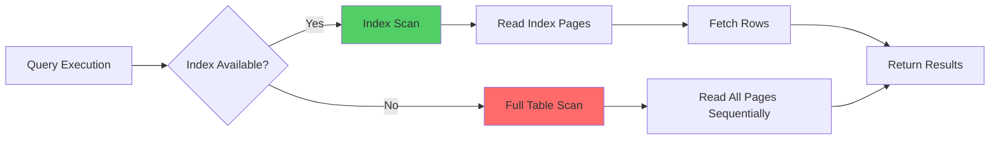

# SQL - Answers

## Question 1: Optimizing Queries with Full Table Scans

📋 **[Back to Question](../sse-topics.md#sql)** | **Topic:** SQL optimization

#### Question
How would you optimize SQL queries that are doing full table scans?

#### Comprehensive Answer

Full table scans are often performance bottlenecks in database systems. Understanding how to identify and optimize them is crucial for senior engineers.

---

#### 1. Understanding Full Table Scans



**When Full Table Scans Happen:**
- No index exists on query columns
- Query optimizer determines full scan is cheaper
- Index selectivity is poor
- Using functions on indexed columns
- OR conditions without covering indexes

**When Full Table Scans Are OK:**
- Small tables (<1000 rows)
- Queries returning large % of table
- Analytical queries on data warehouse tables

---

#### 2. Identifying Full Table Scans

##### PostgreSQL

```sql
-- Enable query plan output
EXPLAIN (ANALYZE, BUFFERS) 
SELECT * FROM users 
WHERE email = 'john@example.com';

-- Output shows "Seq Scan" (sequential scan = full table scan)
/*
Seq Scan on users  (cost=0.00..18334.00 rows=1 width=1084) 
                   (actual time=0.123..145.234 rows=1 loops=1)
  Filter: (email = 'john@example.com'::text)
  Rows Removed by Filter: 999999
  Buffers: shared hit=8334
Planning Time: 0.234 ms
Execution Time: 145.467 ms
*/

-- After adding index:
CREATE INDEX idx_users_email ON users(email);

EXPLAIN (ANALYZE, BUFFERS)
SELECT * FROM users 
WHERE email = 'john@example.com';

/*
Index Scan using idx_users_email on users 
  (cost=0.42..8.44 rows=1 width=1084) 
  (actual time=0.034..0.036 rows=1 loops=1)
  Index Cond: (email = 'john@example.com'::text)
  Buffers: shared hit=4
Planning Time: 0.156 ms
Execution Time: 0.067 ms
*/
-- 2000x faster!
```

##### MySQL

```sql
-- Check query execution plan
EXPLAIN SELECT * FROM users WHERE email = 'john@example.com';

-- Output:
/*
+----+-------------+-------+------+---------------+------+---------+------+--------+-------------+
| id | select_type | table | type | possible_keys | key  | key_len | ref  | rows   | Extra       |
+----+-------------+-------+------+---------------+------+---------+------+--------+-------------+
|  1 | SIMPLE      | users | ALL  | NULL          | NULL | NULL    | NULL | 100000 | Using where |
+----+-------------+-------+------+---------------+------+---------+------+--------+-------------+
*/
-- type=ALL means full table scan
-- rows=100000 means scanning all rows

-- After index:
CREATE INDEX idx_users_email ON users(email);

EXPLAIN SELECT * FROM users WHERE email = 'john@example.com';
/*
| id | select_type | table | type | possible_keys     | key              | key_len | ref   | rows | Extra |
|  1 | SIMPLE      | users | ref  | idx_users_email   | idx_users_email  | 767     | const | 1    | NULL  |
*/
-- type=ref means index lookup
-- rows=1 means only reading necessary rows
```

---

#### 3. Optimization Strategy 1: Add Indexes

##### Single-Column Indexes

```sql
-- Problem: Slow user lookup by email
SELECT * FROM users WHERE email = 'john@example.com';

-- Solution: Add index
CREATE INDEX idx_users_email ON users(email);

-- Performance improvement:
-- Before: 150ms (scan 1M rows)
-- After: 0.5ms (index lookup)
```

##### Composite Indexes

```sql
-- Problem: Query with multiple WHERE conditions
SELECT * FROM orders 
WHERE customer_id = 123 
  AND status = 'pending' 
  AND created_at > '2026-01-01';

-- Wrong approach: Three separate indexes
CREATE INDEX idx_orders_customer ON orders(customer_id);
CREATE INDEX idx_orders_status ON orders(status);
CREATE INDEX idx_orders_created ON orders(created_at);
-- Database can only use ONE index efficiently

-- ✅ Right approach: Composite index
CREATE INDEX idx_orders_customer_status_date 
ON orders(customer_id, status, created_at);

-- Index column order matters!
-- Rule: Most selective columns first, or follow WHERE clause order
```

##### Covering Indexes

```sql
-- Problem: Query needs columns not in index
SELECT user_id, email, name 
FROM users 
WHERE email = 'john@example.com';

-- Solution 1: Simple index (still requires table lookup)
CREATE INDEX idx_users_email ON users(email);
-- Index scan + heap fetch

-- ✅ Solution 2: Covering index (no table lookup needed)
CREATE INDEX idx_users_email_covering 
ON users(email) INCLUDE (user_id, name);
-- All data in index, no heap fetch = faster

-- MySQL syntax:
CREATE INDEX idx_users_email_covering 
ON users(email, user_id, name);
```

##### Partial Indexes

```sql
-- Problem: Only care about active users
SELECT * FROM users WHERE status = 'active' AND email = 'john@example.com';

-- Solution: Partial index (smaller, faster)
CREATE INDEX idx_users_active_email 
ON users(email) 
WHERE status = 'active';

-- Benefits:
-- - Smaller index size
-- - Faster index scans
-- - Lower maintenance overhead
```

---

#### 4. Optimization Strategy 2: Rewrite Queries

##### Avoid Functions on Indexed Columns

```sql
-- ❌ Bad: Function prevents index usage
SELECT * FROM users 
WHERE LOWER(email) = 'john@example.com';
-- Full table scan even with index on email

-- ✅ Good: Store lowercase in column or use expression index
CREATE INDEX idx_users_email_lower ON users(LOWER(email));
-- Now index can be used

-- Or normalize data:
UPDATE users SET email = LOWER(email);
CREATE INDEX idx_users_email ON users(email);
SELECT * FROM users WHERE email = 'john@example.com';
```

##### Use SARGABLE Queries

```sql
-- SARGABLE = Search ARGument ABLE (can use indexes)

-- ❌ Non-SARGABLE:
SELECT * FROM orders WHERE YEAR(created_at) = 2026;
-- Function on column prevents index usage

-- ✅ SARGABLE:
SELECT * FROM orders 
WHERE created_at >= '2026-01-01' 
  AND created_at < '2027-01-01';
-- Index on created_at can be used


-- ❌ Non-SARGABLE:
SELECT * FROM products WHERE price * 1.1 > 100;

-- ✅ SARGABLE:
SELECT * FROM products WHERE price > 100 / 1.1;
```

##### Optimize OR Conditions

```sql
-- ❌ OR often causes full scans
SELECT * FROM users 
WHERE first_name = 'John' OR last_name = 'Doe';
-- Even with indexes, database may full scan

-- ✅ UNION approach
SELECT * FROM users WHERE first_name = 'John'
UNION
SELECT * FROM users WHERE last_name = 'Doe';
-- Each query uses its index, then results combined
```

---

#### 5. Optimization Strategy 3: Limit Result Sets

```sql
-- Problem: Selecting too much data
SELECT * FROM transactions 
WHERE amount > 100;
-- Returns 500K rows

-- Solution 1: Add LIMIT
SELECT * FROM transactions 
WHERE amount > 100 
ORDER BY created_at DESC 
LIMIT 100;
-- Returns 100 rows, much faster

-- Solution 2: Use pagination
SELECT * FROM transactions 
WHERE amount > 100 
  AND id > 12345  -- Cursor-based pagination
ORDER BY id 
LIMIT 100;

-- Solution 3: Filter more specifically
SELECT * FROM transactions 
WHERE amount > 100 
  AND created_at > NOW() - INTERVAL '7 days'
  AND status = 'completed';
-- Fewer rows to scan
```

---

#### 6. Optimization Strategy 4: Table Partitioning

```sql
-- Problem: Massive table, queries only need recent data
CREATE TABLE events (
    id BIGSERIAL,
    user_id INTEGER,
    event_type VARCHAR(50),
    created_at TIMESTAMPTZ,
    data JSONB
);
-- 1 billion rows, queries always filter by date

-- Solution: Range partitioning by date
CREATE TABLE events (
    id BIGSERIAL,
    user_id INTEGER,
    event_type VARCHAR(50),
    created_at TIMESTAMPTZ,
    data JSONB
) PARTITION BY RANGE (created_at);

-- Create monthly partitions
CREATE TABLE events_2026_01 PARTITION OF events
FOR VALUES FROM ('2026-01-01') TO ('2026-02-01');

CREATE TABLE events_2026_02 PARTITION OF events
FOR VALUES FROM ('2026-02-01') TO ('2026-03-01');

-- Query only scans relevant partition
SELECT * FROM events 
WHERE created_at >= '2026-01-15' 
  AND created_at < '2026-01-20';
-- Only scans events_2026_01, not entire table!

-- Automatic partition management
CREATE OR REPLACE FUNCTION create_monthly_partition()
RETURNS void AS $$
DECLARE
    partition_name TEXT;
    start_date DATE;
    end_date DATE;
BEGIN
    start_date := DATE_TRUNC('month', CURRENT_DATE + INTERVAL '1 month');
    end_date := start_date + INTERVAL '1 month';
    partition_name := 'events_' || TO_CHAR(start_date, 'YYYY_MM');
    
    EXECUTE format(
        'CREATE TABLE IF NOT EXISTS %I PARTITION OF events FOR VALUES FROM (%L) TO (%L)',
        partition_name, start_date, end_date
    );
END;
$$ LANGUAGE plpgsql;
```

---

#### 7. Optimization Strategy 5: Analyze and Statistics

```sql
-- Problem: Outdated statistics cause bad query plans
-- PostgreSQL tracks table statistics for query planner

-- Update statistics
ANALYZE users;

-- Check statistics
SELECT 
    tablename,
    last_analyze,
    last_autoanalyze,
    n_live_tup,  -- Number of live rows
    n_dead_tup   -- Number of dead rows
FROM pg_stat_user_tables
WHERE tablename = 'users';

-- Auto-vacuum configuration (postgresql.conf)
-- autovacuum = on
-- autovacuum_analyze_threshold = 50
-- autovacuum_analyze_scale_factor = 0.1

-- Manual maintenance
VACUUM ANALYZE users;  -- Reclaim space and update stats
```

---

#### 8. Real-World Example: E-commerce Orders Optimization

```sql
-- Initial slow query (2.5 seconds)
EXPLAIN ANALYZE
SELECT 
    o.order_id,
    o.total_amount,
    u.email,
    u.name
FROM orders o
JOIN users u ON o.user_id = u.user_id
WHERE o.status = 'pending'
  AND o.created_at > NOW() - INTERVAL '30 days'
ORDER BY o.created_at DESC
LIMIT 100;

/*
Hash Join  (cost=25000.00..850000.00 rows=50000 width=128) 
           (actual time=1200.234..2456.789 rows=100 loops=1)
  Hash Cond: (o.user_id = u.user_id)
  ->  Seq Scan on orders o  (cost=0.00..750000.00 rows=50000 width=64)
                           (actual time=0.123..2100.456 rows=50000 loops=1)
        Filter: ((status = 'pending') AND (created_at > (now() - '30 days')))
        Rows Removed by Filter: 9950000
  ->  Hash  (cost=20000.00..20000.00 rows=1000000 width=64)
           (actual time=150.234..150.234 rows=1000000 loops=1)
        ->  Seq Scan on users u  (cost=0.00..20000.00 rows=1000000 width=64)
Planning Time: 1.234 ms
Execution Time: 2456.890 ms
*/

-- Step 1: Add composite index
CREATE INDEX idx_orders_status_created 
ON orders(status, created_at DESC);

-- Step 2: Add index on foreign key
CREATE INDEX idx_orders_user_id ON orders(user_id);

-- Step 3: Add covering index for users
CREATE INDEX idx_users_id_email_name 
ON users(user_id) INCLUDE (email, name);

-- After optimization (15ms)
EXPLAIN ANALYZE
SELECT 
    o.order_id,
    o.total_amount,
    u.email,
    u.name
FROM orders o
JOIN users u ON o.user_id = u.user_id
WHERE o.status = 'pending'
  AND o.created_at > NOW() - INTERVAL '30 days'
ORDER BY o.created_at DESC
LIMIT 100;

/*
Nested Loop  (cost=0.85..125.50 rows=100 width=128)
             (actual time=0.045..14.567 rows=100 loops=1)
  ->  Index Scan using idx_orders_status_created on orders o
      (cost=0.42..85.50 rows=100 width=64)
      (actual time=0.023..8.234 rows=100 loops=1)
        Index Cond: ((status = 'pending') AND 
                     (created_at > (now() - '30 days')))
  ->  Index Only Scan using idx_users_id_email_name on users u
      (cost=0.43..0.40 rows=1 width=64)
      (actual time=0.003..0.004 rows=1 loops=100)
        Index Cond: (user_id = o.user_id)
        Heap Fetches: 0
Planning Time: 0.567 ms
Execution Time: 14.890 ms
*/

-- 165x faster!
```

---

#### 9. Monitoring and Prevention

```python
# Automated slow query detection

class SlowQueryMonitor:
    """Monitor and alert on slow queries"""
    
    def __init__(self, db_connection):
        self.db = db_connection
        self.slow_query_threshold_ms = 100
    
    def find_slow_queries(self):
        """Find queries with full table scans taking > threshold"""
        query = """
            SELECT 
                query,
                calls,
                total_time,
                mean_time,
                max_time
            FROM pg_stat_statements
            WHERE mean_time > %s
            ORDER BY mean_time DESC
            LIMIT 20
        """
        return self.db.execute(query, [self.slow_query_threshold_ms])
    
    def suggest_indexes(self, slow_query):
        """Suggest indexes for slow query"""
        # Parse WHERE clauses
        # Identify columns without indexes
        # Suggest composite indexes
        # Check index usage statistics
        pass
```

---

#### 10. Best Practices Summary

```markdown
## Query Optimization Checklist

**Before Optimizing:**
- [ ] Use EXPLAIN ANALYZE to confirm full table scan
- [ ] Check current query execution time
- [ ] Verify table size and row count

**Optimization Steps:**
1. [ ] Add appropriate indexes (single, composite, covering)
2. [ ] Rewrite query to be SARGABLE
3. [ ] Avoid functions on indexed columns
4. [ ] Add LIMIT clauses where appropriate
5. [ ] Consider table partitioning for large tables
6. [ ] Update table statistics (ANALYZE)
7. [ ] Review and tune database configuration

**After Optimizing:**
- [ ] Re-run EXPLAIN ANALYZE
- [ ] Compare execution time
- [ ] Monitor index usage
- [ ] Check index maintenance overhead

**When Full Scans Are OK:**
- Small tables (<10K rows)
- Analytics queries on data warehouses
- Queries returning >20% of table rows

**Red Flags:**
- Query taking >1 second on indexed columns
- Seq Scan on tables with millions of rows
- Growing query times as data increases
```

---

