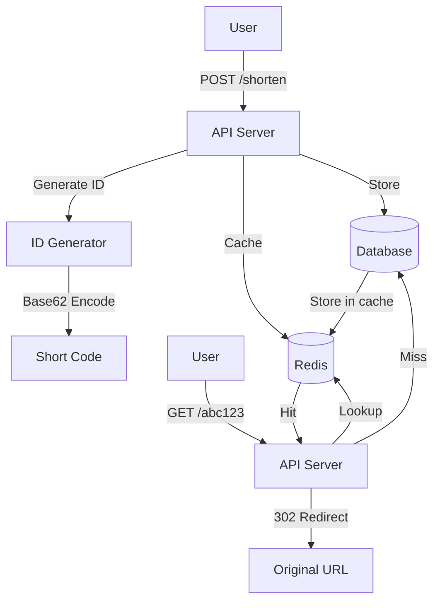
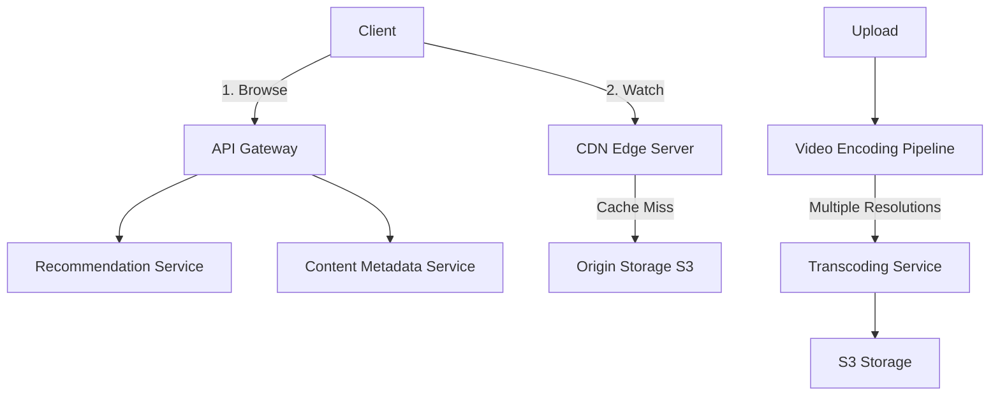
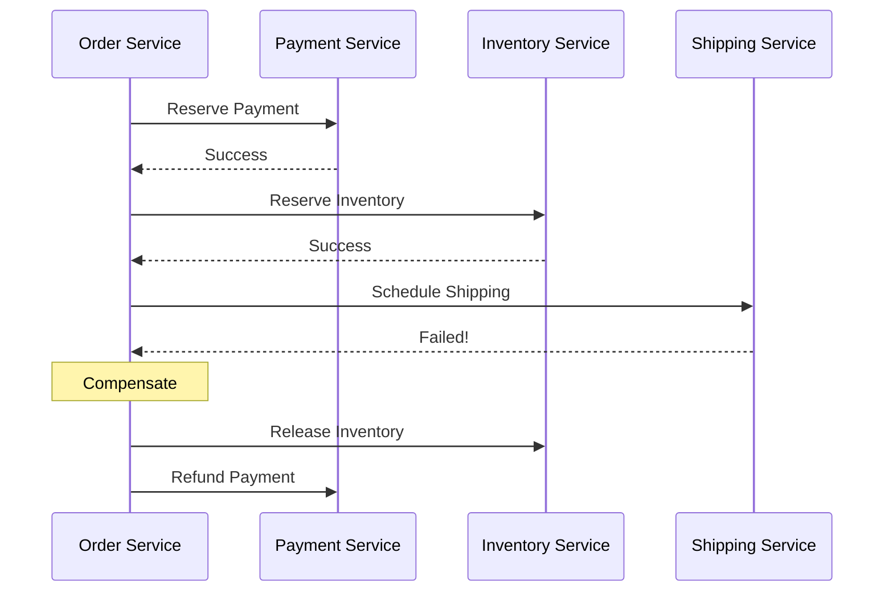
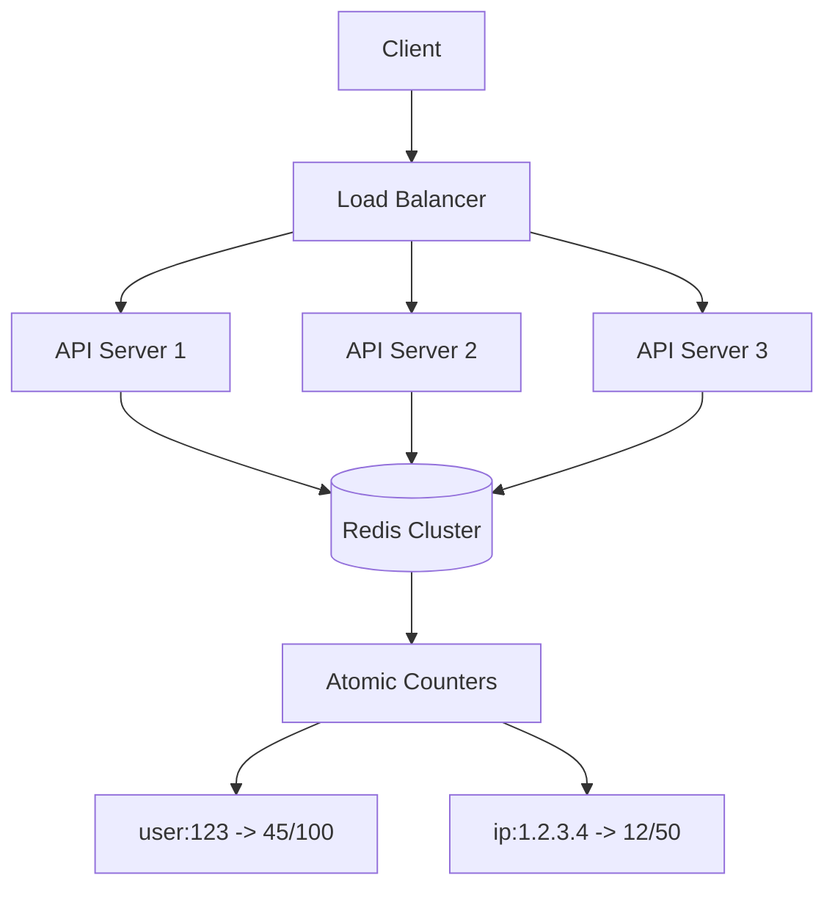
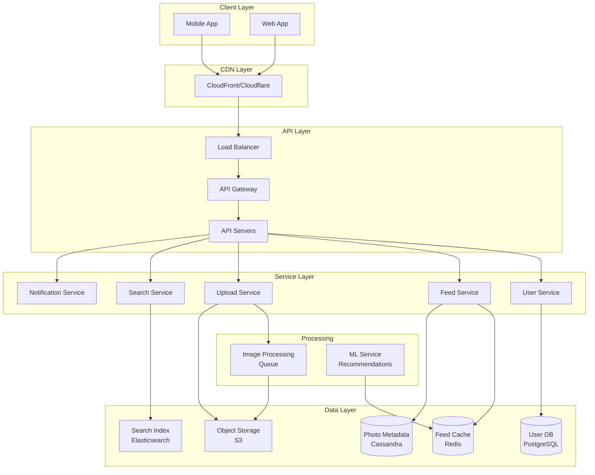

# System Design - Answers

## Question 1: URL Shortener Design

📋 **[Back to Question](../sse-topics.md#system-design)** | **Topic:** System design and scalability



**Key Components:**
1. **ID Generation:** Auto-increment or distributed ID generator (Snowflake)
2. **Encoding:** Base62 (a-z, A-Z, 0-9) for short URLs
3. **Storage:** PostgreSQL or MongoDB for persistence
4. **Cache:** Redis for hot URLs
5. **Analytics:** Kafka for click tracking

**Scalability:**
- Horizontal scaling with load balancers
- Database sharding by hash(short_code)
- CDN for redirect responses

---

## Question 2: Design Netflix

📋 **[Back to Question](../sse-topics.md#system-design)** | **Topic:** System design for complex systems



**Key Components:**
1. **CDN:** Distribute video content globally (AWS CloudFront)
2. **Video Encoding:** Multiple bitrates (adaptive streaming)
3. **Recommendation Engine:** ML-based, personalized
4. **Metadata Service:** Titles, descriptions, ratings
5. **User Service:** Profiles, watch history, preferences
6. **Analytics:** Track viewing patterns, A/B testing

**Data Consistency:** Eventual consistency acceptable for most features; strong consistency for payments/subscriptions.

---

## Question 3: Distributed Transactions - Saga Pattern

📋 **[Back to Question](../sse-topics.md#system-design)** | **Topic:** Distributed transactions and consistency



**Saga Pattern:** Break transaction into local transactions with compensating actions.

**Implementation:**
- **Choreography:** Services emit events, others listen
- **Orchestration:** Central coordinator manages flow

**Trade-offs:**
- Eventual consistency
- Complexity in compensation logic
- Requires idempotency

---

## Question 4: Distributed Rate Limiter Design

📋 **[Back to Question](../sse-topics.md#system-design)** | **Topic:** Distributed systems design

**Detailed Answer:**

#### Architecture



#### Implementation Approaches

**Approach 1: Token Bucket with Redis**

```java
public class DistributedRateLimiter {
    
    private final RedisTemplate<String, String> redis;
    
    public boolean allowRequest(String clientId, int maxTokens, int refillRate) {
        String key = "rate_limit:" + clientId;
        long now = System.currentTimeMillis();
        
        // Lua script for atomic operations
        String script = """
            local key = KEYS[1]
            local max_tokens = tonumber(ARGV[1])
            local refill_rate = tonumber(ARGV[2])
            local now = tonumber(ARGV[3])
            
            local bucket = redis.call('HMGET', key, 'tokens', 'last_refill')
            local tokens = tonumber(bucket[1]) or max_tokens
            local last_refill = tonumber(bucket[2]) or now
            
            -- Calculate refill
            local elapsed = (now - last_refill) / 1000
            local tokens_to_add = math.floor(elapsed * refill_rate)
            tokens = math.min(max_tokens, tokens + tokens_to_add)
            
            if tokens >= 1 then
                tokens = tokens - 1
                redis.call('HMSET', key, 'tokens', tokens, 'last_refill', now)
                redis.call('EXPIRE', key, 3600)
                return 1
            else
                return 0
            end
            """;
        
        DefaultRedisScript<Long> redisScript = new DefaultRedisScript<>();
        redisScript.setScriptText(script);
        redisScript.setResultType(Long.class);
        
        Long result = redis.execute(
            redisScript,
            Collections.singletonList(key),
            String.valueOf(maxTokens),
            String.valueOf(refillRate),
            String.valueOf(now)
        );
        
        return result != null && result == 1;
    }
}
```

**Approach 2: Sliding Window with Redis**

```java
public class SlidingWindowRateLimiter {
    
    private final RedisTemplate<String, String> redis;
    private final int windowSizeMs;
    private final int maxRequests;
    
    public boolean allowRequest(String clientId) {
        String key = "rate_limit:window:" + clientId;
        long now = System.currentTimeMillis();
        long windowStart = now - windowSizeMs;
        
        // Lua script
        String script = """
            local key = KEYS[1]
            local window_start = ARGV[1]
            local now = ARGV[2]
            local max_requests = tonumber(ARGV[3])
            local request_id = ARGV[4]
            
            -- Remove old entries
            redis.call('ZREMRANGEBYSCORE', key, 0, window_start)
            
            -- Count requests in window
            local count = redis.call('ZCARD', key)
            
            if count < max_requests then
                redis.call('ZADD', key, now, request_id)
                redis.call('EXPIRE', key, 60)
                return 1
            else
                return 0
            end
            """;
        
        DefaultRedisScript<Long> redisScript = new DefaultRedisScript<>();
        redisScript.setScriptText(script);
        redisScript.setResultType(Long.class);
        
        Long result = redis.execute(
            redisScript,
            Collections.singletonList(key),
            String.valueOf(windowStart),
            String.valueOf(now),
            String.valueOf(maxRequests),
            UUID.randomUUID().toString()
        );
        
        return result != null && result == 1;
    }
}
```

#### Synchronization Strategies

**1. Centralized State (Redis)**
- All servers check same Redis instance
- Atomic operations via Lua scripts
- Handles network partitions gracefully

**2. Gossip Protocol**
- Servers share rate limit state
- Eventually consistent
- More complex, less common

**3. Consistent Hashing**
- Route same client to same server
- Sticky sessions
- Fails if server goes down

#### Handling Edge Cases

**Network Partition:**
```java
public boolean allowRequestWithFallback(String clientId) {
    try {
        return distributedRateLimiter.allowRequest(clientId);
    } catch (RedisConnectionException e) {
        // Fallback: Allow with local rate limiter
        log.warn("Redis unavailable, using local rate limiter");
        return localRateLimiter.allowRequest(clientId);
    }
}
```

**Clock Skew:**
```java
// Use Redis time instead of local time
String script = """
    local time = redis.call('TIME')
    local now = tonumber(time[1]) * 1000 + math.floor(tonumber(time[2]) / 1000)
    -- Use 'now' for all time calculations
    """;
```

**Race Conditions:**
```java
// Use Lua scripts for atomicity
// All operations in single atomic block
// No race conditions between servers
```

#### Monitoring

```java
@Component
public class RateLimitMetrics {
    
    private final MeterRegistry meterRegistry;
    
    public void recordAllowed(String clientId) {
        meterRegistry.counter("rate_limit.allowed", 
            "client", clientId).increment();
    }
    
    public void recordRejected(String clientId) {
        meterRegistry.counter("rate_limit.rejected", 
            "client", clientId).increment();
    }
    
    public void recordLatency(String clientId, long latencyMs) {
        meterRegistry.timer("rate_limit.check.latency",
            "client", clientId).record(latencyMs, TimeUnit.MILLISECONDS);
    }
}
```

---

## Question 5: Design Instagram - Requirements Gathering

📋 **[Back to Question](../sse-topics.md#system-design)** | **Topic:** Requirements gathering and system design

**Detailed Answer:**

#### Questions to Ask

**1. Scale & Users**
- What's the expected number of Monthly Active Users (MAU)?
- What's the Daily Active Users (DAU)?
- How many photos/videos uploaded per day?
- Average photo/video size?
- Geographic distribution of users?

**2. Features Scope**
- Core features only (photo sharing, feed, likes, comments)?
- Or include Stories, Reels, DMs, Live?
- Do we need video support or just photos?
- Search functionality required?
- Recommendation/discovery features?

**3. Performance Requirements**
- What's acceptable feed load time? (< 500ms?)
- Photo upload time expectations? (< 5s for 5MB?)
- Consistency requirements? (eventual consistency OK for likes?)
- Availability target? (99.9%? 99.99%?)

**4. Read/Write Ratio**
- How many reads vs writes? (typically 100:1 for social media)
- How many followers does average user have?
- Post frequency per user?

**5. Storage & Data**
- How long to retain data?
- Data privacy requirements (GDPR, etc.)?
- Backup and disaster recovery needs?

#### High-Level Design (After Requirements)

**Assuming:**
- 500M MAU, 100M DAU
- 100M photos/day
- Average photo: 2MB
- Read:Write ratio: 100:1
- Global distribution



#### Key Components

**1. Feed Generation**
```python
# Fan-out on write (for users with few followers)
def post_photo(user_id, photo):
    photo_id = save_photo(photo)
    followers = get_followers(user_id)
    
    for follower in followers:
        # Write to each follower's feed cache
        cache.lpush(f"feed:{follower}", photo_id)
        cache.ltrim(f"feed:{follower}", 0, 999)  # Keep latest 1000

# Fan-out on read (for celebrities)
def get_feed(user_id):
    if is_celebrity(user_id):
        # Generate feed on-demand
        following = get_following(user_id)
        return get_recent_posts(following, limit=50)
    else:
        # Read from pre-computed cache
        return cache.lrange(f"feed:{user_id}", 0, 49)
```

**2. Photo Storage**
```python
# Upload flow
def upload_photo(user_id, photo):
    # 1. Generate unique ID
    photo_id = generate_id()
    
    # 2. Upload to S3
    s3_key = f"photos/{user_id}/{photo_id}.jpg"
    s3.upload(photo, s3_key)
    
    # 3. Queue for processing (thumbnails, filters)
    queue.publish('photo.processing', {
        'photo_id': photo_id,
        's3_key': s3_key
    })
    
    # 4. Save metadata
    db.insert('photos', {
        'id': photo_id,
        'user_id': user_id,
        's3_url': s3_key,
        'upload_time': now(),
        'status': 'processing'
    })
    
    return photo_id

# Processing worker
def process_photo(photo_id, s3_key):
    # Generate thumbnails
    create_thumbnail(s3_key, size='small')  # 150x150
    create_thumbnail(s3_key, size='medium') # 600x600
    
    # Update status
    db.update('photos', {'id': photo_id}, {'status': 'ready'})
    
    # Notify user
    notification.send(user_id, 'Photo uploaded successfully')
```

**3. Sharding Strategy**
```
Users DB: Shard by user_id
Photos Metadata: Shard by user_id (co-locate user's photos)
Feed Cache: Shard by user_id
```

**4. Data Consistency**
```
Likes/Comments: Eventual consistency OK
Follows: Strong consistency (prevent duplicate follows)
Photo upload: Strong consistency
Feed: Eventual consistency OK (slight delay acceptable)
```

#### Scalability Considerations

1. **CDN for static content** (photos, videos)
2. **Cache heavily** (feeds, user profiles, hot photos)
3. **Async processing** (image thumbnails, ML recommendations)
4. **Horizontal scaling** (stateless API servers)
5. **Database sharding** (by user_id)
6. **Read replicas** for read-heavy workload

---

