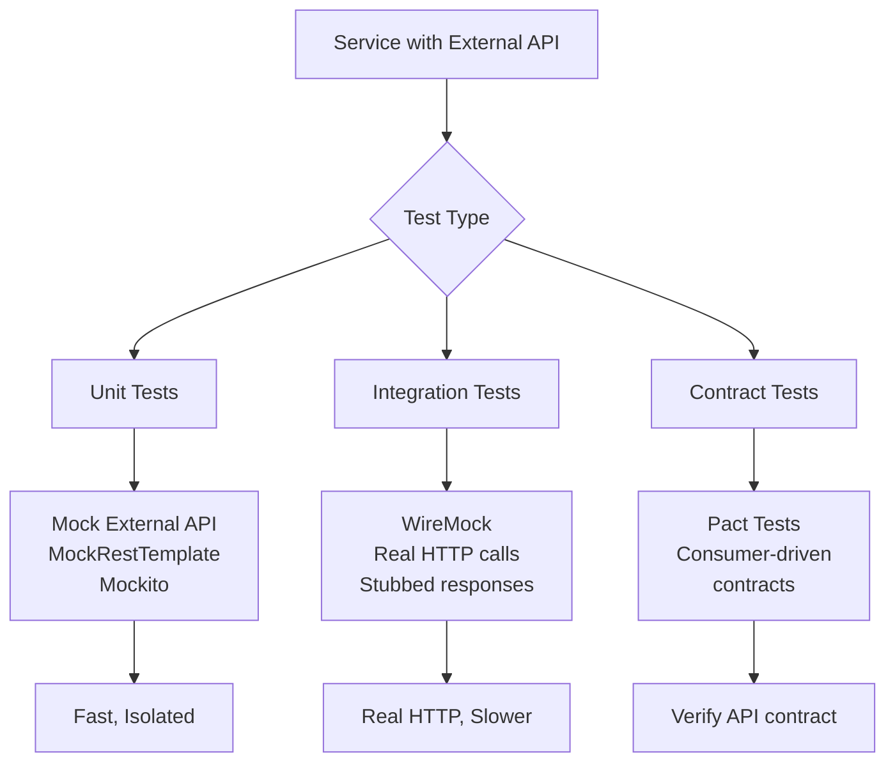
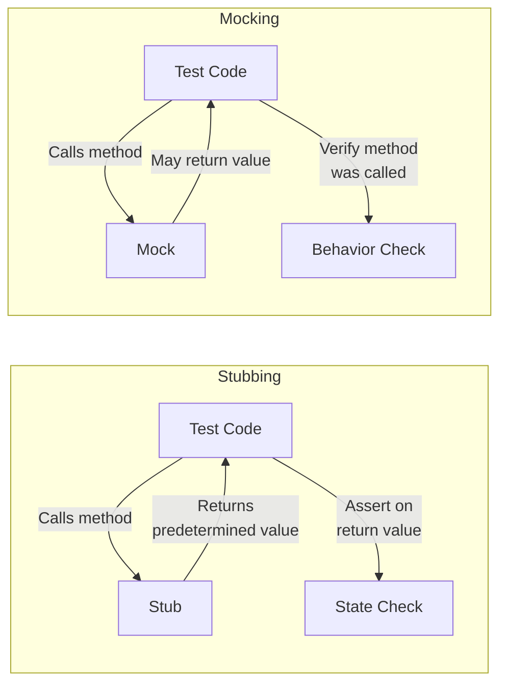

# Unit Testing - Answers

## Question 1: Testing Service with External API

📋 **[Back to Question](../sse-topics.md#unit-testing)** | **Topic:** Unit testing best practices

**Detailed Answer:**

#### Testing Strategy Overview



#### Example Service to Test

```java
@Service
@Slf4j
public class PaymentService {
    
    private final RestTemplate restTemplate;
    private final String paymentApiUrl;
    
    @Value("${payment.api.url}")
    public PaymentService(RestTemplate restTemplate, String paymentApiUrl) {
        this.restTemplate = restTemplate;
        this.paymentApiUrl = paymentApiUrl;
    }
    
    public PaymentResponse processPayment(PaymentRequest request) {
        try {
            log.info("Processing payment for order: {}", request.getOrderId());
            
            HttpHeaders headers = new HttpHeaders();
            headers.setContentType(MediaType.APPLICATION_JSON);
            headers.set("Authorization", "Bearer " + getApiKey());
            
            HttpEntity<PaymentRequest> entity = new HttpEntity<>(request, headers);
            
            ResponseEntity<PaymentResponse> response = restTemplate.postForEntity(
                paymentApiUrl + "/process",
                entity,
                PaymentResponse.class
            );
            
            if (response.getStatusCode().is2xxSuccessful()) {
                return response.getBody();
            } else {
                throw new PaymentException("Payment failed with status: " + response.getStatusCode());
            }
            
        } catch (RestClientException e) {
            log.error("Payment API call failed", e);
            throw new PaymentException("Payment service unavailable", e);
        }
    }
    
    public PaymentStatus checkPaymentStatus(String transactionId) {
        try {
            String url = paymentApiUrl + "/status/" + transactionId;
            ResponseEntity<PaymentStatus> response = restTemplate.getForEntity(
                url,
                PaymentStatus.class
            );
            return response.getBody();
        } catch (HttpClientErrorException.NotFound e) {
            throw new PaymentNotFoundException("Transaction not found: " + transactionId);
        } catch (RestClientException e) {
            log.error("Failed to check payment status", e);
            throw new PaymentException("Status check failed", e);
        }
    }
    
    private String getApiKey() {
        // Retrieve from secure storage
        return "secret_api_key";
    }
}
```

#### Approach 1: Mockito - Pure Unit Test

```java
@ExtendWith(MockitoExtension.class)
class PaymentServiceTest {
    
    @Mock
    private RestTemplate restTemplate;
    
    @InjectMocks
    private PaymentService paymentService;
    
    @BeforeEach
    void setUp() {
        // Inject the API URL via reflection or constructor
        ReflectionTestUtils.setField(paymentService, "paymentApiUrl", "http://api.example.com");
    }
    
    @Test
    @DisplayName("Should successfully process payment")
    void testProcessPayment_Success() {
        // Arrange
        PaymentRequest request = PaymentRequest.builder()
            .orderId("ORDER-123")
            .amount(new BigDecimal("99.99"))
            .currency("USD")
            .cardNumber("4111111111111111")
            .build();
        
        PaymentResponse expectedResponse = PaymentResponse.builder()
            .transactionId("TXN-456")
            .status("APPROVED")
            .message("Payment successful")
            .build();
        
        ResponseEntity<PaymentResponse> responseEntity = 
            ResponseEntity.ok(expectedResponse);
        
        // Mock the API call
        when(restTemplate.postForEntity(
            eq("http://api.example.com/process"),
            any(HttpEntity.class),
            eq(PaymentResponse.class)
        )).thenReturn(responseEntity);
        
        // Act
        PaymentResponse actualResponse = paymentService.processPayment(request);
        
        // Assert
        assertNotNull(actualResponse);
        assertEquals("TXN-456", actualResponse.getTransactionId());
        assertEquals("APPROVED", actualResponse.getStatus());
        
        // Verify interaction
        verify(restTemplate, times(1)).postForEntity(
            eq("http://api.example.com/process"),
            any(HttpEntity.class),
            eq(PaymentResponse.class)
        );
    }
    
    @Test
    @DisplayName("Should throw exception when API returns 4xx")
    void testProcessPayment_ClientError() {
        // Arrange
        PaymentRequest request = PaymentRequest.builder()
            .orderId("ORDER-123")
            .amount(new BigDecimal("99.99"))
            .build();
        
        when(restTemplate.postForEntity(
            anyString(),
            any(HttpEntity.class),
            eq(PaymentResponse.class)
        )).thenThrow(new HttpClientErrorException(HttpStatus.BAD_REQUEST, "Invalid request"));
        
        // Act & Assert
        PaymentException exception = assertThrows(
            PaymentException.class,
            () -> paymentService.processPayment(request)
        );
        
        assertTrue(exception.getMessage().contains("Payment service unavailable"));
        verify(restTemplate, times(1)).postForEntity(anyString(), any(), any());
    }
    
    @Test
    @DisplayName("Should handle network timeout")
    void testProcessPayment_Timeout() {
        // Arrange
        PaymentRequest request = PaymentRequest.builder()
            .orderId("ORDER-123")
            .amount(new BigDecimal("99.99"))
            .build();
        
        when(restTemplate.postForEntity(
            anyString(),
            any(HttpEntity.class),
            eq(PaymentResponse.class)
        )).thenThrow(new ResourceAccessException("Connection timeout"));
        
        // Act & Assert
        assertThrows(PaymentException.class, () -> paymentService.processPayment(request));
    }
    
    @Test
    @DisplayName("Should check payment status successfully")
    void testCheckPaymentStatus_Success() {
        // Arrange
        String transactionId = "TXN-456";
        PaymentStatus expectedStatus = new PaymentStatus("COMPLETED", "Payment processed");
        
        when(restTemplate.getForEntity(
            eq("http://api.example.com/status/" + transactionId),
            eq(PaymentStatus.class)
        )).thenReturn(ResponseEntity.ok(expectedStatus));
        
        // Act
        PaymentStatus actualStatus = paymentService.checkPaymentStatus(transactionId);
        
        // Assert
        assertEquals("COMPLETED", actualStatus.getStatus());
        verify(restTemplate).getForEntity(anyString(), eq(PaymentStatus.class));
    }
    
    @Test
    @DisplayName("Should throw exception when transaction not found")
    void testCheckPaymentStatus_NotFound() {
        // Arrange
        String transactionId = "INVALID-TXN";
        
        when(restTemplate.getForEntity(anyString(), eq(PaymentStatus.class)))
            .thenThrow(new HttpClientErrorException(HttpStatus.NOT_FOUND));
        
        // Act & Assert
        assertThrows(
            PaymentNotFoundException.class,
            () -> paymentService.checkPaymentStatus(transactionId)
        );
    }
    
    @Test
    @DisplayName("Should verify correct headers are sent")
    void testProcessPayment_VerifyHeaders() {
        // Arrange
        PaymentRequest request = PaymentRequest.builder()
            .orderId("ORDER-123")
            .amount(new BigDecimal("99.99"))
            .build();
        
        ArgumentCaptor<HttpEntity> entityCaptor = ArgumentCaptor.forClass(HttpEntity.class);
        
        when(restTemplate.postForEntity(
            anyString(),
            entityCaptor.capture(),
            eq(PaymentResponse.class)
        )).thenReturn(ResponseEntity.ok(new PaymentResponse()));
        
        // Act
        paymentService.processPayment(request);
        
        // Assert - verify headers
        HttpEntity<PaymentRequest> capturedEntity = entityCaptor.getValue();
        HttpHeaders headers = capturedEntity.getHeaders();
        
        assertEquals(MediaType.APPLICATION_JSON, headers.getContentType());
        assertTrue(headers.get("Authorization").get(0).startsWith("Bearer "));
    }
}
```

#### Approach 2: WireMock - Integration Test

```xml
<!-- pom.xml -->
<dependency>
    <groupId>com.github.tomakehurst</groupId>
    <artifactId>wiremock-jre8-standalone</artifactId>
    <version>2.35.0</version>
    <scope>test</scope>
</dependency>
```

```java
@SpringBootTest
@TestInstance(TestInstance.Lifecycle.PER_CLASS)
class PaymentServiceIntegrationTest {
    
    @Autowired
    private PaymentService paymentService;
    
    private WireMockServer wireMockServer;
    
    @BeforeAll
    void setupWireMock() {
        wireMockServer = new WireMockServer(8089);
        wireMockServer.start();
        WireMock.configureFor("localhost", 8089);
    }
    
    @AfterAll
    void teardownWireMock() {
        wireMockServer.stop();
    }
    
    @BeforeEach
    void resetWireMock() {
        WireMock.reset();
    }
    
    @Test
    @DisplayName("Integration test: successful payment processing")
    void testProcessPayment_WithWireMock() {
        // Arrange - Stub the API response
        stubFor(post(urlEqualTo("/process"))
            .withHeader("Content-Type", equalTo("application/json"))
            .withHeader("Authorization", matching("Bearer .*"))
            .withRequestBody(matchingJsonPath("$.orderId", equalTo("ORDER-123")))
            .willReturn(aResponse()
                .withStatus(200)
                .withHeader("Content-Type", "application/json")
                .withBody("""
                    {
                        "transactionId": "TXN-789",
                        "status": "APPROVED",
                        "message": "Payment successful"
                    }
                    """)));
        
        PaymentRequest request = PaymentRequest.builder()
            .orderId("ORDER-123")
            .amount(new BigDecimal("99.99"))
            .currency("USD")
            .build();
        
        // Act
        PaymentResponse response = paymentService.processPayment(request);
        
        // Assert
        assertEquals("TXN-789", response.getTransactionId());
        assertEquals("APPROVED", response.getStatus());
        
        // Verify the request was made
        verify(postRequestedFor(urlEqualTo("/process"))
            .withHeader("Authorization", matching("Bearer .*")));
    }
    
    @Test
    @DisplayName("Integration test: simulate API delay")
    void testProcessPayment_WithDelay() {
        // Simulate slow API
        stubFor(post(urlEqualTo("/process"))
            .willReturn(aResponse()
                .withStatus(200)
                .withFixedDelay(3000)  // 3 second delay
                .withBody("{\"status\": \"APPROVED\"}")));
        
        PaymentRequest request = PaymentRequest.builder()
            .orderId("ORDER-123")
            .amount(new BigDecimal("99.99"))
            .build();
        
        // Act & Assert - should timeout or handle delay
        assertThrows(PaymentException.class, () -> paymentService.processPayment(request));
    }
    
    @Test
    @DisplayName("Integration test: API returns 500 error")
    void testProcessPayment_ServerError() {
        // Simulate server error
        stubFor(post(urlEqualTo("/process"))
            .willReturn(aResponse()
                .withStatus(500)
                .withBody("Internal Server Error")));
        
        PaymentRequest request = PaymentRequest.builder()
            .orderId("ORDER-123")
            .amount(new BigDecimal("99.99"))
            .build();
        
        // Act & Assert
        assertThrows(PaymentException.class, () -> paymentService.processPayment(request));
    }
    
    @Test
    @DisplayName("Integration test: verify request body")
    void testProcessPayment_VerifyRequestBody() {
        stubFor(post(urlEqualTo("/process"))
            .willReturn(aResponse().withStatus(200).withBody("{\"status\": \"APPROVED\"}")));
        
        PaymentRequest request = PaymentRequest.builder()
            .orderId("ORDER-999")
            .amount(new BigDecimal("250.00"))
            .currency("EUR")
            .cardNumber("5555555555554444")
            .build();
        
        paymentService.processPayment(request);
        
        // Verify specific fields were sent
        verify(postRequestedFor(urlEqualTo("/process"))
            .withRequestBody(matchingJsonPath("$.orderId", equalTo("ORDER-999")))
            .withRequestBody(matchingJsonPath("$.amount", equalTo("250.00")))
            .withRequestBody(matchingJsonPath("$.currency", equalTo("EUR"))));
    }
    
    @Test
    @DisplayName("Integration test: multiple scenarios with priorities")
    void testProcessPayment_ScenarioMatching() {
        // Scenario 1: High priority - specific order ID gets rejected
        stubFor(post(urlEqualTo("/process"))
            .withRequestBody(matchingJsonPath("$.orderId", equalTo("FRAUD-123")))
            .atPriority(1)  // Highest priority
            .willReturn(aResponse()
                .withStatus(403)
                .withBody("{\"error\": \"Fraudulent transaction\"}")));
        
        // Scenario 2: Default - all other requests succeed
        stubFor(post(urlEqualTo("/process"))
            .atPriority(10)  // Lower priority (default)
            .willReturn(aResponse()
                .withStatus(200)
                .withBody("{\"status\": \"APPROVED\"}")));
        
        // Test fraud case
        PaymentRequest fraudRequest = PaymentRequest.builder()
            .orderId("FRAUD-123")
            .amount(new BigDecimal("99.99"))
            .build();
        
        assertThrows(PaymentException.class, () -> paymentService.processPayment(fraudRequest));
        
        // Test normal case
        PaymentRequest normalRequest = PaymentRequest.builder()
            .orderId("ORDER-456")
            .amount(new BigDecimal("99.99"))
            .build();
        
        PaymentResponse response = paymentService.processPayment(normalRequest);
        assertEquals("APPROVED", response.getStatus());
    }
}
```

#### Approach 3: MockServer

```xml
<dependency>
    <groupId>org.mock-server</groupId>
    <artifactId>mockserver-netty</artifactId>
    <version>5.15.0</version>
    <scope>test</scope>
</dependency>
```

```java
@SpringBootTest
class PaymentServiceMockServerTest {
    
    private ClientAndServer mockServer;
    
    @BeforeEach
    void startMockServer() {
        mockServer = ClientAndServer.startClientAndServer(8090);
    }
    
    @AfterEach
    void stopMockServer() {
        mockServer.stop();
    }
    
    @Test
    void testPaymentWithMockServer() {
        // Setup expectation
        mockServer
            .when(request()
                .withMethod("POST")
                .withPath("/process")
                .withHeader("Content-Type", "application/json"))
            .respond(response()
                .withStatusCode(200)
                .withHeader("Content-Type", "application/json")
                .withBody("{\"transactionId\": \"TXN-999\", \"status\": \"APPROVED\"}"));
        
        // Test code...
        
        // Verify request was received
        mockServer.verify(
            request()
                .withMethod("POST")
                .withPath("/process"),
            VerificationTimes.exactly(1)
        );
    }
}
```

#### Test Isolation Best Practices

```java
@Test
void testWithIsolation() {
    // ✅ Good: Each test is independent
    
    // 1. Create fresh test data
    PaymentRequest request = createTestPaymentRequest();
    
    // 2. Mock dependencies for this test only
    when(restTemplate.postForEntity(anyString(), any(), any()))
        .thenReturn(ResponseEntity.ok(new PaymentResponse()));
    
    // 3. Execute test
    PaymentResponse response = paymentService.processPayment(request);
    
    // 4. Verify outcomes
    assertNotNull(response);
    
    // 5. Clean up (if needed)
    verify(restTemplate).postForEntity(anyString(), any(), any());
}

// ❌ Bad: Tests depend on shared state
private static PaymentResponse sharedResponse;  // DON'T DO THIS

@Test
void test1() {
    sharedResponse = paymentService.processPayment(request);
}

@Test
void test2() {
    // Depends on test1 running first - FRAGILE!
    assertEquals("APPROVED", sharedResponse.getStatus());
}
```

#### Testing Error Scenarios

```java
@Nested
@DisplayName("Error Handling Tests")
class ErrorHandlingTests {
    
    @Test
    @DisplayName("Network timeout")
    void testNetworkTimeout() {
        when(restTemplate.postForEntity(anyString(), any(), any()))
            .thenThrow(new ResourceAccessException("Timeout"));
        
        assertThrows(PaymentException.class, 
            () -> paymentService.processPayment(request));
    }
    
    @Test
    @DisplayName("Connection refused")
    void testConnectionRefused() {
        when(restTemplate.postForEntity(anyString(), any(), any()))
            .thenThrow(new RestClientException("Connection refused"));
        
        assertThrows(PaymentException.class,
            () -> paymentService.processPayment(request));
    }
    
    @Test
    @DisplayName("Invalid response format")
    void testInvalidResponseFormat() {
        when(restTemplate.postForEntity(anyString(), any(), any()))
            .thenThrow(new HttpMessageNotReadableException("Invalid JSON"));
        
        assertThrows(PaymentException.class,
            () -> paymentService.processPayment(request));
    }
    
    @Test
    @DisplayName("SSL certificate error")
    void testSslError() {
        when(restTemplate.postForEntity(anyString(), any(), any()))
            .thenThrow(new ResourceAccessException("SSL handshake failed"));
        
        assertThrows(PaymentException.class,
            () -> paymentService.processPayment(request));
    }
}
```

#### Test Configuration

```yaml
# application-test.yml
payment:
  api:
    url: http://localhost:8089  # WireMock server
    
spring:
  rest:
    connection-timeout: 1000
    read-timeout: 2000
```

#### Best Practices Summary

1. **Use Mockito for pure unit tests** - fast, no network
2. **Use WireMock for integration tests** - real HTTP, controllable responses
3. **Test error scenarios** - timeouts, 4xx, 5xx, network errors
4. **Verify request details** - headers, body, URL
5. **Keep tests isolated** - no shared state between tests
6. **Use meaningful test names** - describe what's being tested
7. **Test edge cases** - null values, empty responses, malformed JSON
8. **Separate unit and integration tests** - different test suites
9. **Use test fixtures** - reusable test data builders
10. **Clean up resources** - stop mock servers, reset mocks

---

## Question 2: Mocking vs Stubbing

📋 **[Back to Question](../sse-topics.md#unit-testing)** | **Topic:** Testing fundamentals

**Detailed Answer:**

#### Key Differences

| Aspect | Stubbing | Mocking |
|--------|----------|---------|
| **Purpose** | Provide predetermined responses | Verify interactions happened |
| **Verification** | Not verified | Explicitly verified |
| **Focus** | State verification | Behavior verification |
| **When to use** | Testing output/return values | Testing method calls/interactions |
| **Example** | `when(...).thenReturn(...)` | `verify(...).method()` |

#### Visual Explanation



#### Stubbing Example

**Scenario:** Testing a service that depends on a repository

```java
@Service
public class UserService {
    private final UserRepository userRepository;
    private final EmailService emailService;
    
    public UserService(UserRepository userRepository, EmailService emailService) {
        this.userRepository = userRepository;
        this.emailService = emailService;
    }
    
    public User getUserById(Long id) {
        return userRepository.findById(id)
            .orElseThrow(() -> new UserNotFoundException(id));
    }
    
    public void sendWelcomeEmail(Long userId) {
        User user = userRepository.findById(userId)
            .orElseThrow(() -> new UserNotFoundException(userId));
        emailService.send(user.getEmail(), "Welcome!", "Welcome to our platform");
    }
}
```

**Stubbing Test (State Verification):**

```java
@ExtendWith(MockitoExtension.class)
class UserServiceStubbingTest {
    
    @Mock
    private UserRepository userRepository;
    
    @Mock
    private EmailService emailService;
    
    @InjectMocks
    private UserService userService;
    
    @Test
    @DisplayName("Stubbing: Return user when found")
    void testGetUserById_Stubbing() {
        // Arrange - STUB the repository response
        Long userId = 1L;
        User expectedUser = User.builder()
            .id(userId)
            .name("John Doe")
            .email("john@example.com")
            .build();
        
        when(userRepository.findById(userId))
            .thenReturn(Optional.of(expectedUser));  // ← STUB
        
        // Act
        User actualUser = userService.getUserById(userId);
        
        // Assert - VERIFY STATE (return value)
        assertEquals(expectedUser.getId(), actualUser.getId());
        assertEquals(expectedUser.getName(), actualUser.getName());
        assertEquals(expectedUser.getEmail(), actualUser.getEmail());
        
        // NOT verifying if findById was called
        // We only care about the RESULT
    }
    
    @Test
    @DisplayName("Stubbing: Throw exception when user not found")
    void testGetUserById_NotFound_Stubbing() {
        // Arrange - STUB to return empty
        when(userRepository.findById(anyLong()))
            .thenReturn(Optional.empty());  // ← STUB
        
        // Act & Assert - VERIFY STATE (exception thrown)
        assertThrows(UserNotFoundException.class, () -> {
            userService.getUserById(999L);
        });
    }
}
```

#### Mocking Example (Behavior Verification)

```java
@ExtendWith(MockitoExtension.class)
class UserServiceMockingTest {
    
    @Mock
    private UserRepository userRepository;
    
    @Mock
    private EmailService emailService;
    
    @InjectMocks
    private UserService userService;
    
    @Test
    @DisplayName("Mocking: Verify email service was called")
    void testSendWelcomeEmail_Mocking() {
        // Arrange
        Long userId = 1L;
        User user = User.builder()
            .id(userId)
            .email("john@example.com")
            .build();
        
        when(userRepository.findById(userId))
            .thenReturn(Optional.of(user));
        
        // Act
        userService.sendWelcomeEmail(userId);
        
        // Assert - VERIFY BEHAVIOR (method was called with correct args)
        verify(emailService, times(1)).send(
            eq("john@example.com"),
            eq("Welcome!"),
            eq("Welcome to our platform")
        );  // ← MOCK VERIFICATION
        
        // We're verifying the INTERACTION, not the return value
    }
    
    @Test
    @DisplayName("Mocking: Verify email NOT sent when user not found")
    void testSendWelcomeEmail_UserNotFound() {
        // Arrange
        when(userRepository.findById(anyLong()))
            .thenReturn(Optional.empty());
        
        // Act
        assertThrows(UserNotFoundException.class, () -> {
            userService.sendWelcomeEmail(999L);
        });
        
        // Assert - VERIFY email service was NOT called
        verify(emailService, never()).send(anyString(), anyString(), anyString());
        // ← MOCK VERIFICATION (negative case)
    }
    
    @Test
    @DisplayName("Mocking: Verify order of method calls")
    void testMethodCallOrder() {
        // Arrange
        Long userId = 1L;
        User user = User.builder().id(userId).email("test@example.com").build();
        when(userRepository.findById(userId)).thenReturn(Optional.of(user));
        
        InOrder inOrder = inOrder(userRepository, emailService);
        
        // Act
        userService.sendWelcomeEmail(userId);
        
        // Assert - VERIFY call order
        inOrder.verify(userRepository).findById(userId);  // ← Called first
        inOrder.verify(emailService).send(anyString(), anyString(), anyString());  // ← Called second
    }
}
```

#### Combining Both

```java
@Test
@DisplayName("Combine stubbing and mocking")
void testCombination() {
    // Arrange
    Long userId = 1L;
    User user = User.builder()
        .id(userId)
        .email("john@example.com")
        .build();
    
    // STUB: Provide return value
    when(userRepository.findById(userId))
        .thenReturn(Optional.of(user));
    
    // Act
    userService.sendWelcomeEmail(userId);
    
    // Assert with MOCK: Verify behavior
    verify(emailService).send(
        eq("john@example.com"),
        eq("Welcome!"),
        anyString()
    );
    
    // Could also assert state if method returned something
}
```

#### Argument Matchers

```java
@Test
void testArgumentMatchers() {
    // Exact value
    when(userRepository.findById(1L))
        .thenReturn(Optional.of(user));
    
    // Any value
    when(userRepository.findById(anyLong()))
        .thenReturn(Optional.of(user));
    
    // Custom matcher
    when(userRepository.findById(longThat(id -> id > 0)))
        .thenReturn(Optional.of(user));
    
    // Argument captor
    ArgumentCaptor<String> emailCaptor = ArgumentCaptor.forClass(String.class);
    verify(emailService).send(emailCaptor.capture(), anyString(), anyString());
    assertEquals("john@example.com", emailCaptor.getValue());
}
```

#### Spy vs Mock

```java
@ExtendWith(MockitoExtension.class)
class SpyVsMockTest {
    
    // MOCK: Completely fake object
    @Mock
    private UserRepository mockRepository;
    
    // SPY: Real object with selective stubbing
    @Spy
    private UserRepository spyRepository = new UserRepositoryImpl();
    
    @Test
    @DisplayName("Mock: All methods return default values unless stubbed")
    void testMock() {
        // Mock returns null by default
        User user = mockRepository.findById(1L).orElse(null);
        assertNull(user);  // ← Mock didn't call real method
        
        // Must stub to get behavior
        when(mockRepository.findById(1L))
            .thenReturn(Optional.of(new User()));
    }
    
    @Test
    @DisplayName("Spy: Real methods called unless stubbed")
    void testSpy() {
        // Spy calls REAL method
        User user = spyRepository.findById(1L).orElse(null);
        // ← Real findById() was called
        
        // Can stub specific methods
        when(spyRepository.findById(2L))
            .thenReturn(Optional.of(new User()));
        
        // Verify real method was called
        verify(spyRepository).findById(1L);
    }
}
```

#### When to Use What

**Use Stubbing when:**
```java
// 1. Testing return values
@Test
void testReturnValue() {
    when(calculator.add(2, 3)).thenReturn(5);
    assertEquals(5, calculator.add(2, 3));  // ← State verification
}

// 2. Testing data transformation
@Test
void testDataTransformation() {
    when(mapper.toDto(entity)).thenReturn(dto);
    UserDto result = service.getUserDto(1L);
    assertEquals(dto.getName(), result.getName());  // ← State verification
}

// 3. Testing different scenarios
@Test
void testScenarios() {
    // Happy path
    when(repository.save(any())).thenReturn(savedEntity);
    
    // Error scenario
    when(repository.save(invalidEntity)).thenThrow(new ValidationException());
}
```

**Use Mocking when:**
```java
// 1. Verifying method was called
@Test
void testMethodCalled() {
    service.deleteUser(1L);
    verify(repository).deleteById(1L);  // ← Behavior verification
}

// 2. Verifying call count
@Test
void testCallCount() {
    service.processUsers(List.of(user1, user2, user3));
    verify(emailService, times(3)).send(anyString(), anyString(), anyString());
}

// 3. Verifying void methods
@Test
void testVoidMethod() {
    service.updateUserStatus(1L, "ACTIVE");
    verify(repository).updateStatus(1L, "ACTIVE");  // ← No return value to check
}

// 4. Verifying order of operations
@Test
void testOperationOrder() {
    InOrder inOrder = inOrder(auditService, repository, cacheService);
    
    service.createUser(user);
    
    inOrder.verify(auditService).logStart();
    inOrder.verify(repository).save(any());
    inOrder.verify(cacheService).invalidate();
    inOrder.verify(auditService).logEnd();
}
```

#### Real-World Example

```java
@Service
public class OrderService {
    private final OrderRepository orderRepository;
    private final PaymentService paymentService;
    private final InventoryService inventoryService;
    private final NotificationService notificationService;
    
    @Transactional
    public Order createOrder(OrderRequest request) {
        // 1. Check inventory
        boolean available = inventoryService.checkAvailability(request.getProductId(), request.getQuantity());
        if (!available) {
            throw new OutOfStockException();
        }
        
        // 2. Process payment
        PaymentResult payment = paymentService.processPayment(request.getPaymentDetails());
        
        // 3. Save order
        Order order = Order.builder()
            .productId(request.getProductId())
            .quantity(request.getQuantity())
            .paymentId(payment.getTransactionId())
            .status(OrderStatus.CONFIRMED)
            .build();
        Order savedOrder = orderRepository.save(order);
        
        // 4. Update inventory
        inventoryService.reduceStock(request.getProductId(), request.getQuantity());
        
        // 5. Send notification
        notificationService.sendOrderConfirmation(savedOrder);
        
        return savedOrder;
    }
}
```

**Test using BOTH stubbing and mocking:**

```java
@ExtendWith(MockitoExtension.class)
class OrderServiceTest {
    
    @Mock private OrderRepository orderRepository;
    @Mock private PaymentService paymentService;
    @Mock private InventoryService inventoryService;
    @Mock private NotificationService notificationService;
    
    @InjectMocks
    private OrderService orderService;
    
    @Test
    @DisplayName("Successful order creation - combination of stubbing and mocking")
    void testCreateOrder_Success() {
        // Arrange
        OrderRequest request = new OrderRequest(/* ... */);
        
        // STUBBING: Provide return values for state verification
        when(inventoryService.checkAvailability(anyLong(), anyInt()))
            .thenReturn(true);  // ← Stub
        
        when(paymentService.processPayment(any()))
            .thenReturn(new PaymentResult("TXN-123"));  // ← Stub
        
        when(orderRepository.save(any(Order.class)))
            .thenReturn(Order.builder().id(1L).status(OrderStatus.CONFIRMED).build());  // ← Stub
        
        // Act
        Order result = orderService.createOrder(request);
        
        // Assert - STATE VERIFICATION (using stubs)
        assertNotNull(result);
        assertEquals(1L, result.getId());
        assertEquals(OrderStatus.CONFIRMED, result.getStatus());
        
        // Assert - BEHAVIOR VERIFICATION (using mocks)
        InOrder inOrder = inOrder(inventoryService, paymentService, orderRepository, notificationService);
        
        // Verify method call order
        inOrder.verify(inventoryService).checkAvailability(anyLong(), anyInt());
        inOrder.verify(paymentService).processPayment(any());
        inOrder.verify(orderRepository).save(any(Order.class));
        inOrder.verify(inventoryService).reduceStock(anyLong(), anyInt());
        inOrder.verify(notificationService).sendOrderConfirmation(any(Order.class));
        
        // Verify specific interactions
        verify(inventoryService).checkAvailability(request.getProductId(), request.getQuantity());
        verify(inventoryService).reduceStock(request.getProductId(), request.getQuantity());
        verify(notificationService).sendOrderConfirmation(argThat(order -> 
            order.getStatus() == OrderStatus.CONFIRMED
        ));
    }
    
    @Test
    @DisplayName("Order fails when out of stock - verify payment NOT called")
    void testCreateOrder_OutOfStock() {
        // Arrange
        OrderRequest request = new OrderRequest(/* ... */);
        
        // STUB: Inventory not available
        when(inventoryService.checkAvailability(anyLong(), anyInt()))
            .thenReturn(false);
        
        // Act & Assert
        assertThrows(OutOfStockException.class, () -> {
            orderService.createOrder(request);
        });
        
        // MOCK: Verify payment was NEVER called
        verify(paymentService, never()).processPayment(any());
        verify(orderRepository, never()).save(any());
        verify(notificationService, never()).sendOrderConfirmation(any());
    }
}
```

#### Best Practices

1. **Prefer stubbing for dependencies** - return values you need
2. **Use mocking to verify critical interactions** - ensure side effects happen
3. **Don't over-verify** - only verify what matters
   ```java
   // ❌ Too much verification
   verify(repository).findById(1L);
   verify(mapper).toDto(entity);
   verify(validator).validate(dto);
   // ... dozens more
   
   // ✅ Verify only critical interactions
   verify(auditService).logSecurityEvent(any());
   ```

4. **Use `@InjectMocks` carefully** - creates real instance with mocked dependencies
5. **Reset mocks between tests** - use `@BeforeEach` or `MockitoExtension`
6. **Avoid mocking value objects** - use real instances
7. **Mock at service boundaries** - not internal domain logic

---

