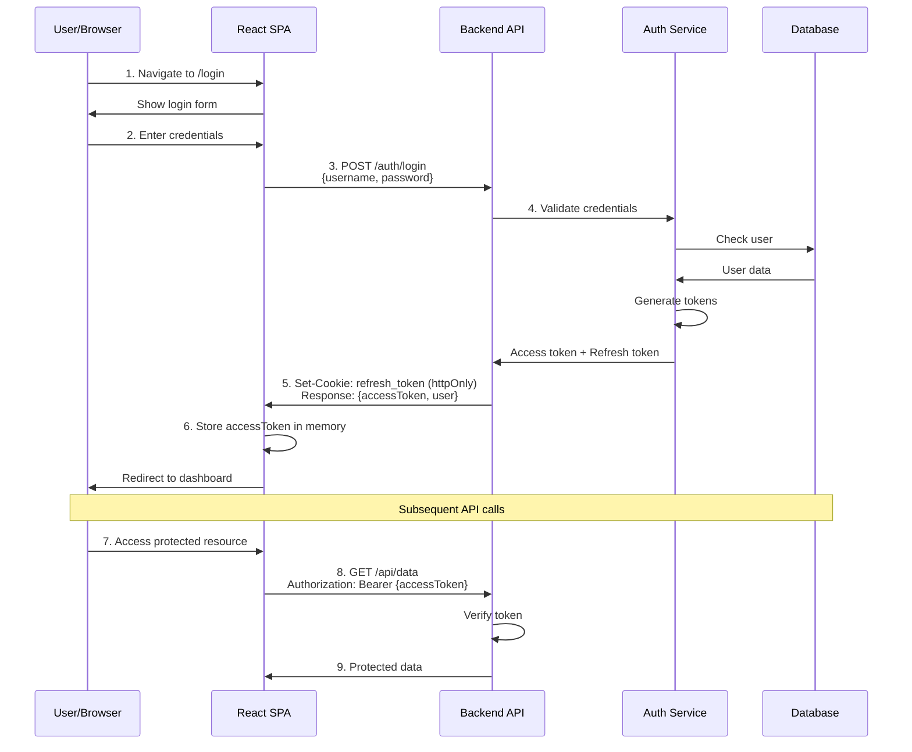

# User Authentication & Authorization - Answers

## Question 1: SPA Authentication Implementation

📋 **[Back to Question](../sse-topics.md#user-authentication--authorization)** | **Topic:** Authentication and security

**Detailed Answer:**

#### Authentication Flow Overview



#### Step 1: Backend - Spring Boot Authentication

**Security Configuration:**

```java
@Configuration
@EnableWebSecurity
public class SecurityConfig {
    
    @Bean
    public SecurityFilterChain filterChain(HttpSecurity http) throws Exception {
        http
            .csrf(csrf -> csrf
                .csrfTokenRepository(CookieCsrfTokenRepository.withHttpOnlyFalse())
                .csrfTokenRequestHandler(new SpaCsrfTokenRequestHandler())
            )
            .cors(cors -> cors.configurationSource(corsConfigurationSource()))
            .sessionManagement(session -> session
                .sessionCreationPolicy(SessionCreationPolicy.STATELESS)
            )
            .authorizeHttpRequests(auth -> auth
                .requestMatchers("/auth/login", "/auth/register", "/auth/refresh").permitAll()
                .requestMatchers("/api/admin/**").hasRole("ADMIN")
                .requestMatchers("/api/**").authenticated()
                .anyRequest().permitAll()
            )
            .addFilterBefore(jwtAuthenticationFilter(), UsernamePasswordAuthenticationFilter.class)
            .exceptionHandling(ex -> ex
                .authenticationEntryPoint((request, response, authException) -> {
                    response.setStatus(HttpServletResponse.SC_UNAUTHORIZED);
                    response.getWriter().write("{\"error\": \"Unauthorized\"}");
                })
            );
        
        return http.build();
    }
    
    @Bean
    public JwtAuthenticationFilter jwtAuthenticationFilter() {
        return new JwtAuthenticationFilter();
    }
    
    @Bean
    public CorsConfigurationSource corsConfigurationSource() {
        CorsConfiguration configuration = new CorsConfiguration();
        configuration.setAllowedOrigins(List.of("https://app.example.com"));
        configuration.setAllowedMethods(List.of("GET", "POST", "PUT", "DELETE", "OPTIONS"));
        configuration.setAllowedHeaders(List.of("*"));
        configuration.setAllowCredentials(true);
        configuration.setMaxAge(3600L);
        
        UrlBasedCorsConfigurationSource source = new UrlBasedCorsConfigurationSource();
        source.registerCorsConfiguration("/**", configuration);
        return source;
    }
}
```

**JWT Service:**

```java
@Service
public class JwtService {
    
    @Value("${jwt.secret}")
    private String secret;
    
    @Value("${jwt.access-token-expiration}")
    private long accessTokenExpiration; // 15 minutes
    
    @Value("${jwt.refresh-token-expiration}")
    private long refreshTokenExpiration; // 7 days
    
    public String generateAccessToken(UserDetails userDetails) {
        Map<String, Object> claims = new HashMap<>();
        claims.put("roles", userDetails.getAuthorities().stream()
            .map(GrantedAuthority::getAuthority)
            .collect(Collectors.toList()));
        
        return Jwts.builder()
            .setClaims(claims)
            .setSubject(userDetails.getUsername())
            .setIssuedAt(new Date())
            .setExpiration(new Date(System.currentTimeMillis() + accessTokenExpiration))
            .signWith(getSigningKey(), SignatureAlgorithm.HS256)
            .compact();
    }
    
    public String generateRefreshToken(String username) {
        return Jwts.builder()
            .setSubject(username)
            .setIssuedAt(new Date())
            .setExpiration(new Date(System.currentTimeMillis() + refreshTokenExpiration))
            .setId(UUID.randomUUID().toString()) // JTI for revocation
            .signWith(getSigningKey(), SignatureAlgorithm.HS256)
            .compact();
    }
    
    public boolean validateToken(String token) {
        try {
            Jwts.parserBuilder()
                .setSigningKey(getSigningKey())
                .build()
                .parseClaimsJws(token);
            return true;
        } catch (JwtException | IllegalArgumentException e) {
            return false;
        }
    }
    
    public String extractUsername(String token) {
        return extractClaim(token, Claims::getSubject);
    }
    
    public <T> T extractClaim(String token, Function<Claims, T> claimsResolver) {
        final Claims claims = extractAllClaims(token);
        return claimsResolver.apply(claims);
    }
    
    private Claims extractAllClaims(String token) {
        return Jwts.parserBuilder()
            .setSigningKey(getSigningKey())
            .build()
            .parseClaimsJws(token)
            .getBody();
    }
    
    private Key getSigningKey() {
        byte[] keyBytes = Decoders.BASE64.decode(secret);
        return Keys.hmacShaKeyFor(keyBytes);
    }
}
```

**Auth Controller:**

```java
@RestController
@RequestMapping("/auth")
@Slf4j
public class AuthController {
    
    private final AuthenticationManager authenticationManager;
    private final JwtService jwtService;
    private final UserService userService;
    private final RefreshTokenService refreshTokenService;
    
    @PostMapping("/login")
    public ResponseEntity<AuthResponse> login(@RequestBody @Valid LoginRequest request, 
                                               HttpServletResponse response) {
        try {
            // Authenticate user
            Authentication authentication = authenticationManager.authenticate(
                new UsernamePasswordAuthenticationToken(
                    request.getUsername(),
                    request.getPassword()
                )
            );
            
            SecurityContextHolder.getContext().setAuthentication(authentication);
            UserDetails userDetails = (UserDetails) authentication.getPrincipal();
            
            // Generate tokens
            String accessToken = jwtService.generateAccessToken(userDetails);
            String refreshToken = jwtService.generateRefreshToken(userDetails.getUsername());
            
            // Store refresh token in database (for revocation)
            refreshTokenService.saveRefreshToken(userDetails.getUsername(), refreshToken);
            
            // Set refresh token as httpOnly cookie
            ResponseCookie cookie = ResponseCookie.from("refresh_token", refreshToken)
                .httpOnly(true)
                .secure(true) // HTTPS only
                .path("/auth/refresh")
                .maxAge(Duration.ofDays(7))
                .sameSite("Strict")
                .build();
            
            response.addHeader(HttpHeaders.SET_COOKIE, cookie.toString());
            
            // Return access token in response body
            User user = userService.findByUsername(userDetails.getUsername());
            return ResponseEntity.ok(AuthResponse.builder()
                .accessToken(accessToken)
                .tokenType("Bearer")
                .expiresIn(900) // 15 minutes
                .user(UserDto.from(user))
                .build());
            
        } catch (AuthenticationException e) {
            log.error("Authentication failed for user: {}", request.getUsername());
            throw new BadCredentialsException("Invalid username or password");
        }
    }
    
    @PostMapping("/refresh")
    public ResponseEntity<AuthResponse> refreshToken(@CookieValue(name = "refresh_token") String refreshToken) {
        if (!jwtService.validateToken(refreshToken)) {
            throw new InvalidTokenException("Invalid refresh token");
        }
        
        String username = jwtService.extractUsername(refreshToken);
        String tokenId = jwtService.extractClaim(refreshToken, Claims::getId);
        
        // Verify refresh token exists and not revoked
        if (!refreshTokenService.isValidRefreshToken(username, tokenId)) {
            throw new InvalidTokenException("Refresh token revoked or expired");
        }
        
        UserDetails userDetails = userService.loadUserByUsername(username);
        String newAccessToken = jwtService.generateAccessToken(userDetails);
        
        return ResponseEntity.ok(AuthResponse.builder()
            .accessToken(newAccessToken)
            .tokenType("Bearer")
            .expiresIn(900)
            .build());
    }
    
    @PostMapping("/logout")
    public ResponseEntity<Void> logout(@CookieValue(name = "refresh_token") String refreshToken,
                                        HttpServletResponse response) {
        String username = jwtService.extractUsername(refreshToken);
        String tokenId = jwtService.extractClaim(refreshToken, Claims::getId);
        
        // Revoke refresh token
        refreshTokenService.revokeRefreshToken(username, tokenId);
        
        // Clear cookie
        ResponseCookie cookie = ResponseCookie.from("refresh_token", "")
            .httpOnly(true)
            .secure(true)
            .path("/auth/refresh")
            .maxAge(0)
            .build();
        
        response.addHeader(HttpHeaders.SET_COOKIE, cookie.toString());
        
        return ResponseEntity.noContent().build();
    }
}
```

**JWT Authentication Filter:**

```java
@Component
public class JwtAuthenticationFilter extends OncePerRequestFilter {
    
    @Autowired
    private JwtService jwtService;
    
    @Autowired
    private UserDetailsService userDetailsService;
    
    @Override
    protected void doFilterInternal(HttpServletRequest request,
                                     HttpServletResponse response,
                                     FilterChain filterChain) throws ServletException, IOException {
        
        final String authHeader = request.getHeader(HttpHeaders.AUTHORIZATION);
        
        if (authHeader == null || !authHeader.startsWith("Bearer ")) {
            filterChain.doFilter(request, response);
            return;
        }
        
        try {
            final String jwt = authHeader.substring(7);
            final String username = jwtService.extractUsername(jwt);
            
            if (username != null && SecurityContextHolder.getContext().getAuthentication() == null) {
                UserDetails userDetails = userDetailsService.loadUserByUsername(username);
                
                if (jwtService.validateToken(jwt)) {
                    UsernamePasswordAuthenticationToken authToken = new UsernamePasswordAuthenticationToken(
                        userDetails,
                        null,
                        userDetails.getAuthorities()
                    );
                    
                    authToken.setDetails(new WebAuthenticationDetailsSource().buildDetails(request));
                    SecurityContextHolder.getContext().setAuthentication(authToken);
                }
            }
        } catch (Exception e) {
            log.error("Cannot set user authentication", e);
        }
        
        filterChain.doFilter(request, response);
    }
}
```

#### Step 2: Frontend - React Implementation

**Auth Service:**

```typescript
// authService.ts
import axios from 'axios';

interface LoginCredentials {
  username: string;
  password: string;
}

interface AuthResponse {
  accessToken: string;
  tokenType: string;
  expiresIn: number;
  user: User;
}

class AuthService {
  private accessToken: string | null = null;
  private tokenRefreshTimeout: NodeJS.Timeout | null = null;

  async login(credentials: LoginCredentials): Promise<AuthResponse> {
    const response = await axios.post<AuthResponse>('/auth/login', credentials, {
      withCredentials: true // Send cookies
    });
    
    this.setAccessToken(response.data.accessToken);
    this.scheduleTokenRefresh(response.data.expiresIn);
    
    return response.data;
  }

  async refreshToken(): Promise<string> {
    try {
      const response = await axios.post<AuthResponse>('/auth/refresh', {}, {
        withCredentials: true // Send refresh_token cookie
      });
      
      this.setAccessToken(response.data.accessToken);
      this.scheduleTokenRefresh(response.data.expiresIn);
      
      return response.data.accessToken;
    } catch (error) {
      this.logout();
      throw error;
    }
  }

  async logout(): Promise<void> {
    try {
      await axios.post('/auth/logout', {}, {
        withCredentials: true
      });
    } finally {
      this.clearAccessToken();
      if (this.tokenRefreshTimeout) {
        clearTimeout(this.tokenRefreshTimeout);
      }
      window.location.href = '/login';
    }
  }

  setAccessToken(token: string): void {
    this.accessToken = token;
  }

  getAccessToken(): string | null {
    return this.accessToken;
  }

  clearAccessToken(): void {
    this.accessToken = null;
  }

  private scheduleTokenRefresh(expiresIn: number): void {
    if (this.tokenRefreshTimeout) {
      clearTimeout(this.tokenRefreshTimeout);
    }

    // Refresh 1 minute before expiration
    const refreshTime = (expiresIn - 60) * 1000;
    
    this.tokenRefreshTimeout = setTimeout(() => {
      this.refreshToken();
    }, refreshTime);
  }

  isAuthenticated(): boolean {
    return this.accessToken !== null;
  }
}

export const authService = new AuthService();
```

**Axios Interceptor:**

```typescript
// axiosConfig.ts
import axios from 'axios';
import { authService } from './authService';

axios.defaults.baseURL = 'https://api.example.com';
axios.defaults.withCredentials = true;

// Request interceptor - add access token
axios.interceptors.request.use(
  (config) => {
    const token = authService.getAccessToken();
    if (token) {
      config.headers.Authorization = `Bearer ${token}`;
    }
    return config;
  },
  (error) => Promise.reject(error)
);

// Response interceptor - handle 401 and retry with refresh
axios.interceptors.response.use(
  (response) => response,
  async (error) => {
    const originalRequest = error.config;

    // If 401 and not already retried
    if (error.response?.status === 401 && !originalRequest._retry) {
      originalRequest._retry = true;

      try {
        // Try to refresh token
        const newAccessToken = await authService.refreshToken();
        
        // Retry original request with new token
        originalRequest.headers.Authorization = `Bearer ${newAccessToken}`;
        return axios(originalRequest);
      } catch (refreshError) {
        // Refresh failed, redirect to login
        authService.logout();
        return Promise.reject(refreshError);
      }
    }

    return Promise.reject(error);
  }
);
```

**React Auth Context:**

```typescript
// AuthContext.tsx
import React, { createContext, useContext, useState, useEffect } from 'react';
import { authService } from './authService';

interface AuthContextType {
  user: User | null;
  isLoading: boolean;
  login: (credentials: LoginCredentials) => Promise<void>;
  logout: () => Promise<void>;
  isAuthenticated: boolean;
}

const AuthContext = createContext<AuthContextType | undefined>(undefined);

export const AuthProvider: React.FC<{ children: React.ReactNode }> = ({ children }) => {
  const [user, setUser] = useState<User | null>(null);
  const [isLoading, setIsLoading] = useState(true);

  useEffect(() => {
    // Try to refresh token on app load (check if user has valid refresh token)
    const initAuth = async () => {
      try {
        await authService.refreshToken();
        // Fetch current user info
        const userResponse = await axios.get('/api/me');
        setUser(userResponse.data);
      } catch (error) {
        console.log('No valid session');
      } finally {
        setIsLoading(false);
      }
    };

    initAuth();
  }, []);

  const login = async (credentials: LoginCredentials) => {
    const response = await authService.login(credentials);
    setUser(response.user);
  };

  const logout = async () => {
    await authService.logout();
    setUser(null);
  };

  return (
    <AuthContext.Provider
      value={{
        user,
        isLoading,
        login,
        logout,
        isAuthenticated: user !== null,
      }}
    >
      {children}
    </AuthContext.Provider>
  );
};

export const useAuth = () => {
  const context = useContext(AuthContext);
  if (!context) {
    throw new Error('useAuth must be used within AuthProvider');
  }
  return context;
};
```

**Protected Route:**

```typescript
// ProtectedRoute.tsx
import React from 'react';
import { Navigate } from 'react-router-dom';
import { useAuth } from './AuthContext';

interface ProtectedRouteProps {
  children: React.ReactNode;
  requiredRole?: string;
}

export const ProtectedRoute: React.FC<ProtectedRouteProps> = ({ 
  children, 
  requiredRole 
}) => {
  const { user, isLoading, isAuthenticated } = useAuth();

  if (isLoading) {
    return <div>Loading...</div>;
  }

  if (!isAuthenticated) {
    return <Navigate to="/login" replace />;
  }

  if (requiredRole && !user?.roles.includes(requiredRole)) {
    return <Navigate to="/forbidden" replace />;
  }

  return <>{children}</>;
};
```

**Login Component:**

```typescript
// LoginPage.tsx
import React, { useState } from 'react';
import { useNavigate } from 'react-router-dom';
import { useAuth } from './AuthContext';

export const LoginPage: React.FC = () => {
  const [username, setUsername] = useState('');
  const [password, setPassword] = useState('');
  const [error, setError] = useState('');
  const { login } = useAuth();
  const navigate = useNavigate();

  const handleSubmit = async (e: React.FormEvent) => {
    e.preventDefault();
    setError('');

    try {
      await login({ username, password });
      navigate('/dashboard');
    } catch (err: any) {
      setError(err.response?.data?.message || 'Login failed');
    }
  };

  return (
    <div>
      <h1>Login</h1>
      <form onSubmit={handleSubmit}>
        <input
          type="text"
          value={username}
          onChange={(e) => setUsername(e.target.value)}
          placeholder="Username"
          autoComplete="username"
        />
        <input
          type="password"
          value={password}
          onChange={(e) => setPassword(e.target.value)}
          placeholder="Password"
          autoComplete="current-password"
        />
        <button type="submit">Login</button>
      </form>
      {error && <p style={{ color: 'red' }}>{error}</p>}
    </div>
  );
};
```

#### Security Best Practices

**1. Token Storage:**

```typescript
// ❌ BAD: localStorage (vulnerable to XSS)
localStorage.setItem('accessToken', token);

// ❌ BAD: sessionStorage (still vulnerable to XSS)
sessionStorage.setItem('accessToken', token);

// ✅ GOOD: In-memory (cleared on refresh)
class AuthService {
  private accessToken: string | null = null;
}

// ✅ GOOD: httpOnly cookie for refresh token (backend sets it)
Set-Cookie: refresh_token=...; HttpOnly; Secure; SameSite=Strict
```

**2. CSRF Protection:**

```java
// Backend
@Configuration
public class SecurityConfig {
    @Bean
    public SecurityFilterChain filterChain(HttpSecurity http) throws Exception {
        http.csrf(csrf -> csrf
            .csrfTokenRepository(CookieCsrfTokenRepository.withHttpOnlyFalse())
            .csrfTokenRequestHandler(new SpaCsrfTokenRequestHandler())
        );
        return http.build();
    }
}
```

```typescript
// Frontend - Axios automatically sends CSRF token from cookie
axios.defaults.xsrfCookieName = 'XSRF-TOKEN';
axios.defaults.xsrfHeaderName = 'X-XSRF-TOKEN';
```

**3. XSS Prevention:**

```typescript
// React automatically escapes content
const UserProfile = ({ user }: { user: User }) => {
  return <div>{user.name}</div>; // ✅ Auto-escaped
};

// ❌ Dangerous if user input contains <script>
<div dangerouslySetInnerHTML={{ __html: userInput }} />

// ✅ Sanitize HTML if you must use it
import DOMPurify from 'dompurify';
<div dangerouslySetInnerHTML={{ __html: DOMPurify.sanitize(userInput) }} />
```

**4. Content Security Policy:**

```java
// Backend - Add CSP header
@Component
public class SecurityHeadersFilter implements Filter {
    @Override
    public void doFilter(ServletRequest request, ServletResponse response, FilterChain chain) {
        HttpServletResponse httpResponse = (HttpServletResponse) response;
        
        httpResponse.setHeader("Content-Security-Policy",
            "default-src 'self'; " +
            "script-src 'self' 'unsafe-inline' https://cdn.example.com; " +
            "style-src 'self' 'unsafe-inline'; " +
            "img-src 'self' data: https:; " +
            "font-src 'self' data:; " +
            "connect-src 'self' https://api.example.com"
        );
        
        httpResponse.setHeader("X-Content-Type-Options", "nosniff");
        httpResponse.setHeader("X-Frame-Options", "DENY");
        httpResponse.setHeader("X-XSS-Protection", "1; mode=block");
        httpResponse.setHeader("Strict-Transport-Security", "max-age=31536000; includeSubDomains");
        
        chain.doFilter(request, response);
    }
}
```

#### OAuth 2.0 Integration

**Google OAuth Flow:**

```typescript
// Frontend
const handleGoogleLogin = () => {
  const clientId = 'YOUR_GOOGLE_CLIENT_ID';
  const redirectUri = 'https://app.example.com/oauth/callback';
  const scope = 'openid profile email';
  
  const authUrl = `https://accounts.google.com/o/oauth2/v2/auth?` +
    `client_id=${clientId}&` +
    `redirect_uri=${encodeURIComponent(redirectUri)}&` +
    `response_type=code&` +
    `scope=${encodeURIComponent(scope)}&` +
    `state=${generateRandomState()}`;
  
  window.location.href = authUrl;
};

// OAuth Callback Component
const OAuthCallback: React.FC = () => {
  useEffect(() => {
    const urlParams = new URLSearchParams(window.location.search);
    const code = urlParams.get('code');
    const state = urlParams.get('state');
    
    if (code) {
      // Send code to backend for token exchange
      axios.post('/auth/oauth/google', { code, state })
        .then(response => {
          authService.setAccessToken(response.data.accessToken);
          navigate('/dashboard');
        });
    }
  }, []);
  
  return <div>Authenticating...</div>;
};
```

```java
// Backend OAuth Controller
@RestController
@RequestMapping("/auth/oauth")
public class OAuthController {
    
    @PostMapping("/google")
    public ResponseEntity<AuthResponse> googleOAuth(@RequestBody OAuthRequest request) {
        // Exchange code for Google tokens
        GoogleTokenResponse tokenResponse = googleAuthService.exchangeCodeForTokens(request.getCode());
        
        // Get user info from Google
        GoogleUserInfo userInfo = googleAuthService.getUserInfo(tokenResponse.getAccessToken());
        
        // Find or create user in database
        User user = userService.findOrCreateUserFromOAuth(userInfo);
        
        // Generate our own JWT tokens
        String accessToken = jwtService.generateAccessToken(user);
        String refreshToken = jwtService.generateRefreshToken(user.getUsername());
        
        return ResponseEntity.ok(new AuthResponse(accessToken, refreshToken, user));
    }
}
```

#### Token Rotation Strategy

```java
@Service
public class RefreshTokenService {
    
    @Autowired
    private RefreshTokenRepository refreshTokenRepository;
    
    public void saveRefreshToken(String username, String token) {
        String tokenId = extractTokenId(token);
        Date expiryDate = extractExpiration(token);
        
        RefreshToken refreshToken = RefreshToken.builder()
            .username(username)
            .tokenId(tokenId)
            .token(token)
            .expiryDate(expiryDate)
            .build();
        
        refreshTokenRepository.save(refreshToken);
        
        // Optional: Limit number of active refresh tokens per user
        refreshTokenRepository.deleteOldTokens(username, 5);
    }
    
    public boolean isValidRefreshToken(String username, String tokenId) {
        return refreshTokenRepository.findByUsernameAndTokenId(username, tokenId)
            .map(token -> !token.isRevoked() && token.getExpiryDate().after(new Date()))
            .orElse(false);
    }
    
    public void revokeRefreshToken(String username, String tokenId) {
        refreshTokenRepository.findByUsernameAndTokenId(username, tokenId)
            .ifPresent(token -> {
                token.setRevoked(true);
                refreshTokenRepository.save(token);
            });
    }
    
    public void revokeAllUserTokens(String username) {
        refreshTokenRepository.revokeAllByUsername(username);
    }
}
```

#### Complete Security Checklist

| Security Concern | Solution |
|------------------|----------|
| **XSS** | React auto-escapes, CSP headers, sanitize HTML |
| **CSRF** | SameSite cookies, CSRF tokens |
| **Token theft** | httpOnly cookies for refresh, short-lived access tokens |
| **Token replay** | JTI (token ID), token revocation list |
| **Man-in-the-middle** | HTTPS only, HSTS header |
| **Session fixation** | Regenerate session on login |
| **Brute force** | Rate limiting, account lockout |
| **SQL injection** | Prepared statements, ORM |
| **Sensitive data exposure** | Don't log tokens, encrypt at rest |

---

