# Distributed Metrics Logging and Aggregation System

[← Back to Topics](../topics.md#distributed-metrics-logging-and-aggregation-system-like-datadog-prometheus)

## Problem Statement

Design a system that can collect, aggregate, and query metrics from millions of servers processing billions of events per day. Support real-time alerting and historical analysis.

---

## Requirements

### Functional Requirements
1. **Metric Collection**: Collect metrics from millions of servers (CPU, memory, disk, custom application metrics)
2. **Real-time Ingestion**: Process billions of data points per day with low latency
3. **Query Interface**: Support complex queries with filtering, grouping, and aggregation
4. **Alerting**: Real-time alert evaluation based on threshold rules
5. **Historical Analysis**: Store and query historical data (months to years)
6. **Dashboards**: Support real-time dashboard updates

### Non-Functional Requirements
1. **Scalability**: Handle 10M+ metrics/second write throughput
2. **Availability**: 99.9% uptime
3. **Latency**: 
   - Write latency: <100ms p99
   - Query latency: <1s for real-time dashboards
4. **Retention**: Configurable (7 days full resolution, 1 year downsampled)
5. **Durability**: No data loss for critical metrics

### Scale Estimates
- **Servers**: 1 million servers
- **Metrics per server**: 100 metrics
- **Collection interval**: 10 seconds
- **Write rate**: 1M * 100 / 10 = **10M data points/second**
- **Daily volume**: 10M * 86,400 = **864 billion data points/day**
- **Storage** (assuming 12 bytes per point): ~10TB/day raw data

---

## High-Level Architecture

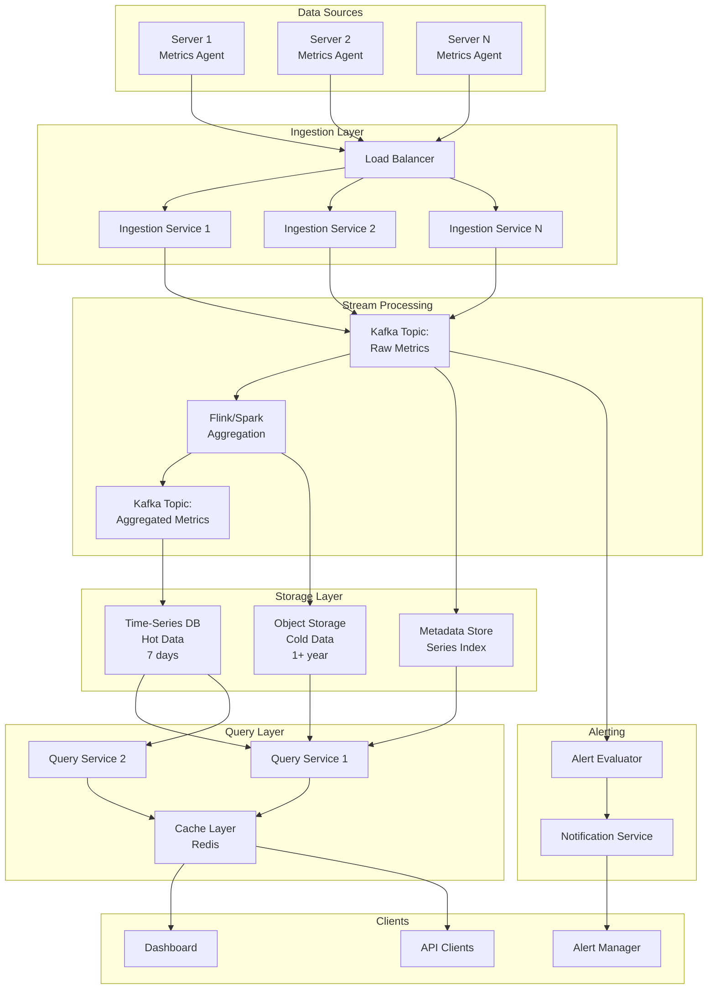

---

## Detailed Design

### 1. Metric Collection (Push vs Pull)

#### Push Model (Recommended for this scale)
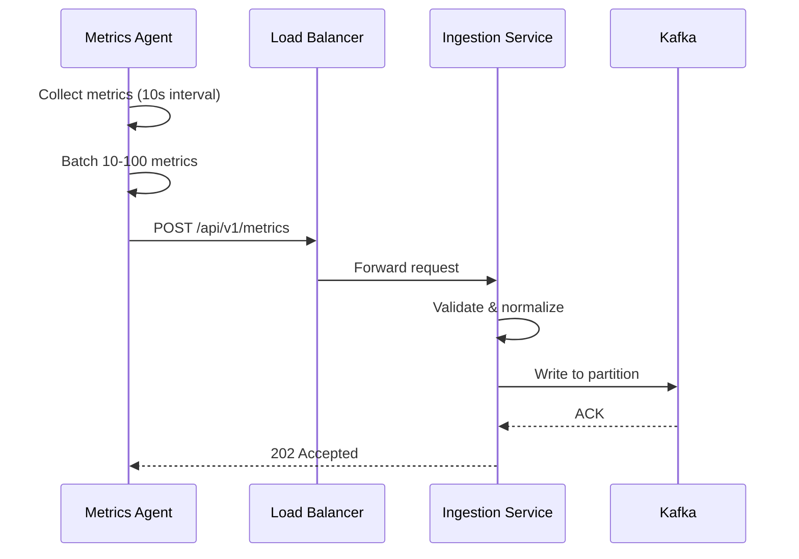

**Advantages of Push:**
- Agents control send rate (no thundering herd)
- Better for auto-scaling environments
- Works behind firewalls/NAT
- Easier to implement backpressure

#### Data Format Example
```json
{
  "source": "server-123.prod.us-east-1",
  "timestamp": 1706832000,
  "metrics": [
    {
      "name": "cpu.usage",
      "value": 45.2,
      "type": "gauge",
      "tags": {
        "host": "server-123",
        "datacenter": "us-east-1",
        "service": "api-gateway"
      }
    },
    {
      "name": "http.requests.count",
      "value": 1523,
      "type": "counter",
      "tags": {
        "endpoint": "/api/users",
        "status": "200"
      }
    }
  ]
}
```

---

### 2. Ingestion Layer

#### Components
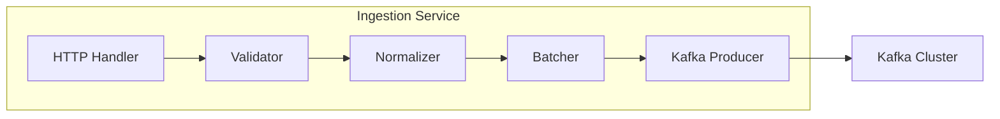

**Responsibilities:**
1. **Validation**: Check metric format, required fields
2. **Normalization**: Convert units, standardize tag names
3. **Enrichment**: Add metadata (region, cluster info)
4. **Batching**: Batch writes to Kafka for efficiency
5. **Rate Limiting**: Per-source rate limiting

#### Partitioning Strategy
```python
# Partition by metric name + tags hash for even distribution
def get_partition(metric_name, tags):
    key = f"{metric_name}:{sorted(tags.items())}"
    return hash(key) % num_partitions
```

---

### 3. Stream Processing & Aggregation

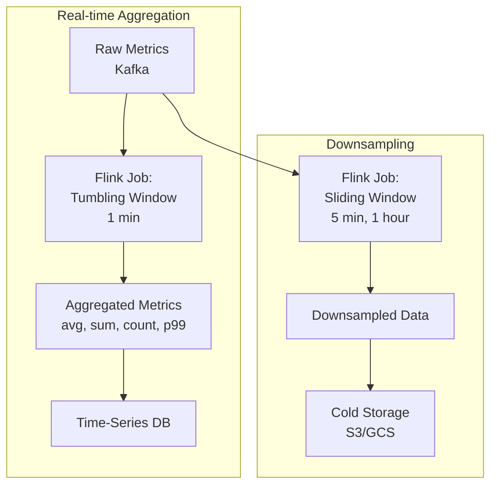

#### Aggregation Example (Flink)
```java
DataStream<Metric> metrics = kafka.readFrom("raw-metrics");

metrics
    .keyBy(m -> m.getMetricName() + ":" + m.getTags())
    .window(TumblingEventTimeWindows.of(Time.minutes(1)))
    .aggregate(new MetricAggregator())
    .addSink(timeseriesDB);

class MetricAggregator implements AggregateFunction<Metric, MetricStats, AggregatedMetric> {
    @Override
    public MetricStats createAccumulator() {
        return new MetricStats();
    }
    
    @Override
    public MetricStats add(Metric value, MetricStats accumulator) {
        accumulator.add(value.getValue());
        return accumulator;
    }
    
    @Override
    public AggregatedMetric getResult(MetricStats accumulator) {
        return new AggregatedMetric(
            accumulator.getAvg(),
            accumulator.getP50(),
            accumulator.getP99(),
            accumulator.getMax()
        );
    }
}
```

---

### 4. Storage Layer

#### Time-Series Database (Hot Storage)

**Option 1: InfluxDB**
- Optimized for time-series data
- Built-in downsampling
- InfluxQL for queries

**Option 2: TimescaleDB (PostgreSQL extension)**
- SQL interface
- Better for complex joins
- Automatic partitioning by time

**Option 3: Prometheus (with Thanos for long-term storage)**
- Pull-based collection
- PromQL query language
- Service discovery

**Recommended: TimescaleDB** for flexibility

#### Schema Design
```sql
CREATE TABLE metrics (
    time        TIMESTAMPTZ NOT NULL,
    metric_name TEXT NOT NULL,
    value       DOUBLE PRECISION NOT NULL,
    tags        JSONB,
    PRIMARY KEY (time, metric_name, tags)
);

-- Convert to hypertable for automatic partitioning
SELECT create_hypertable('metrics', 'time', chunk_time_interval => INTERVAL '1 day');

-- Create indexes for common queries
CREATE INDEX idx_metric_name ON metrics (metric_name, time DESC);
CREATE INDEX idx_tags ON metrics USING GIN (tags);
```

#### Data Retention Policy
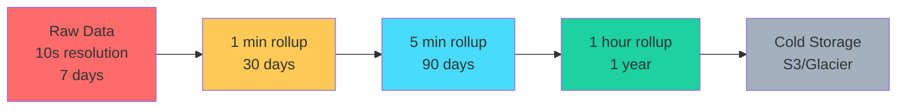

#### Downsampling Jobs
```sql
-- Continuous aggregate for 1-minute rollups
CREATE MATERIALIZED VIEW metrics_1min
WITH (timescaledb.continuous) AS
SELECT
    time_bucket('1 minute', time) AS bucket,
    metric_name,
    tags,
    AVG(value) as avg_value,
    MAX(value) as max_value,
    MIN(value) as min_value,
    COUNT(*) as count
FROM metrics
GROUP BY bucket, metric_name, tags;
```

---

### 5. Metadata Store (Series Index)

**Purpose**: Track all unique metric series to prevent tag explosion

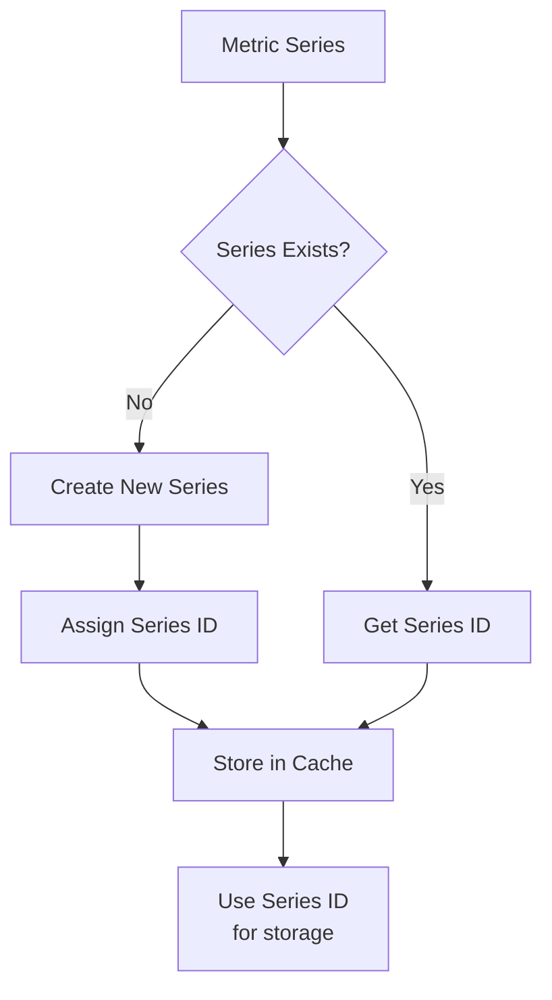

#### Schema (Redis or Cassandra)
```python
# Key: metric_name:tag1=value1,tag2=value2
# Value: series_id (uint64)

series_key = "cpu.usage:host=server-1,dc=us-east"
series_id = redis.get(series_key)

if not series_id:
    series_id = generate_unique_id()
    redis.set(series_key, series_id)
    redis.sadd("all_series", series_key)
```

---

### 6. Query Layer

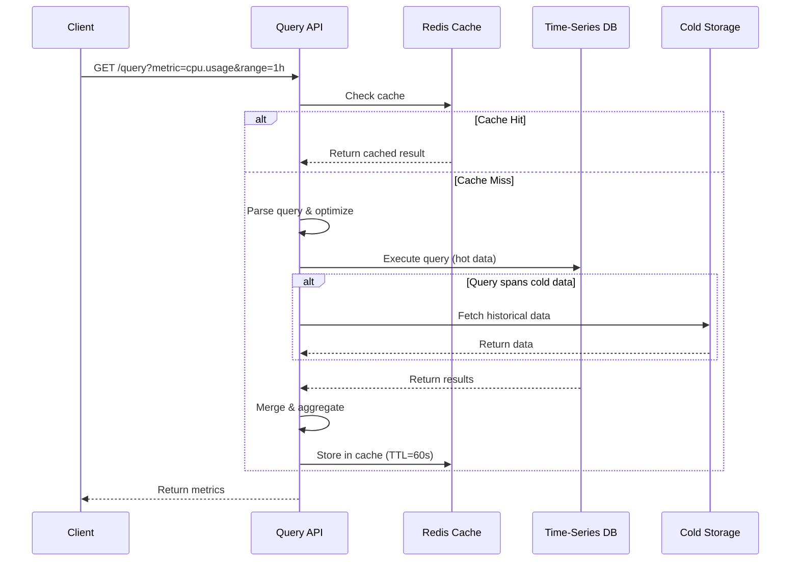

#### Query API Examples

**PromQL-style Query Language:**
```
# Average CPU usage across all servers in us-east datacenter
avg(cpu.usage{datacenter="us-east"}[5m])

# Rate of HTTP requests per second
rate(http.requests.count[1m])

# 99th percentile latency
histogram_quantile(0.99, http.request.duration)
```

#### Query Optimization Techniques

1. **Query Result Caching**
```python
def query_metrics(metric_name, time_range, tags):
    cache_key = f"{metric_name}:{time_range}:{tags}"
    
    # Check cache first
    cached = redis.get(cache_key)
    if cached:
        return json.loads(cached)
    
    # Execute query
    result = execute_query(metric_name, time_range, tags)
    
    # Cache with TTL based on query recency
    ttl = 60 if time_range.is_recent() else 3600
    redis.setex(cache_key, ttl, json.dumps(result))
    
    return result
```

2. **Pre-aggregation for Common Queries**
3. **Parallel query execution across time chunks**
4. **Down-sampling for large time ranges**

---

### 7. Alerting System

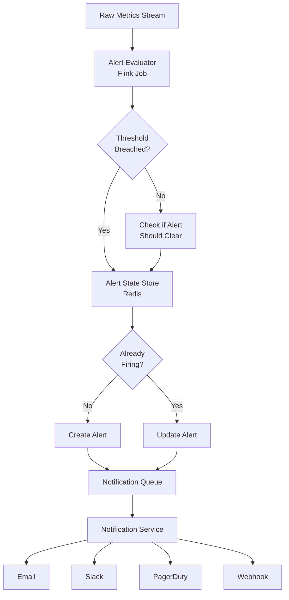

#### Alert Rule Definition
```yaml
alerts:
  - name: high_cpu_usage
    metric: cpu.usage
    condition: avg(5m) > 80
    for: 3m  # Must breach for 3 minutes
    labels:
      severity: warning
      team: infrastructure
    annotations:
      summary: "High CPU usage on {{ $labels.host }}"
      description: "CPU usage is {{ $value }}% on {{ $labels.host }}"
```

#### Alert State Machine
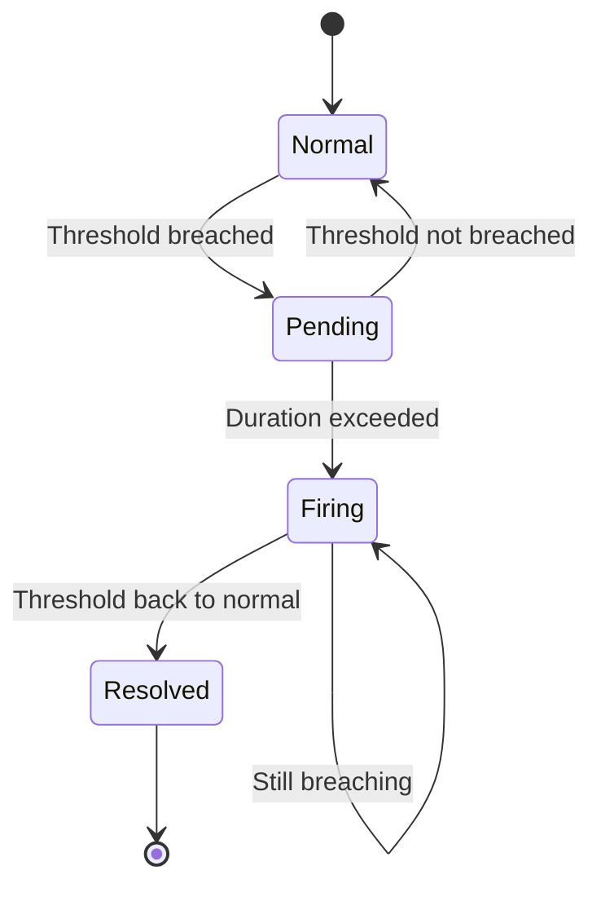

#### Alert Evaluation (Pseudo-code)
```python
class AlertEvaluator:
    def evaluate_rule(self, rule, metrics):
        # Calculate aggregation over time window
        value = self.aggregate(metrics, rule.window, rule.aggregation)
        
        # Check if threshold is breached
        is_breaching = self.evaluate_condition(value, rule.condition)
        
        # Get current alert state
        alert_state = redis.hget(f"alert:{rule.name}", "state")
        
        if is_breaching:
            if alert_state == "normal":
                # Start pending timer
                redis.hset(f"alert:{rule.name}", "state", "pending")
                redis.hset(f"alert:{rule.name}", "since", time.now())
            
            elif alert_state == "pending":
                # Check if duration exceeded
                since = redis.hget(f"alert:{rule.name}", "since")
                if time.now() - since >= rule.for_duration:
                    # Fire alert
                    self.fire_alert(rule, value)
                    redis.hset(f"alert:{rule.name}", "state", "firing")
        else:
            if alert_state == "firing":
                # Resolve alert
                self.resolve_alert(rule)
                redis.hset(f"alert:{rule.name}", "state", "resolved")
```

---

### 8. Cardinality Management

**Problem**: Tag explosion can create millions of unique series

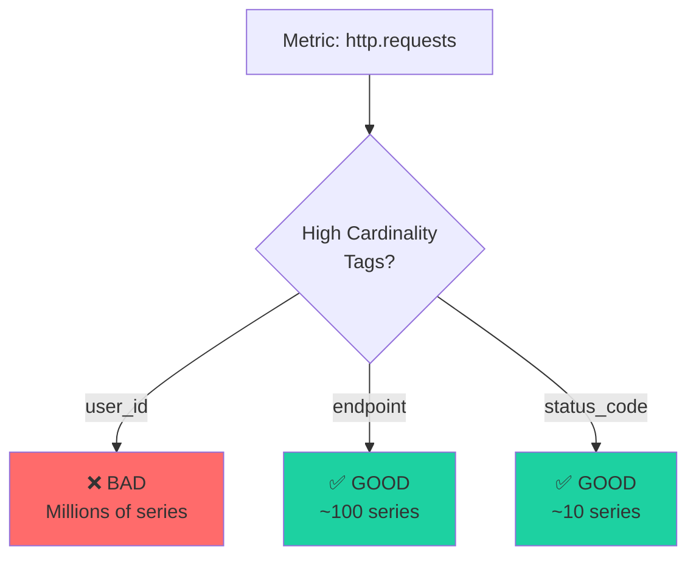

#### Best Practices

**❌ Bad: High-cardinality tags**
```json
{
  "name": "http.request.duration",
  "tags": {
    "user_id": "12345",           // Millions of users
    "request_id": "abc-123-xyz",  // Unique per request
    "timestamp": "1706832123"     // Unique per second
  }
}
```

**✅ Good: Low-cardinality tags**
```json
{
  "name": "http.request.duration",
  "tags": {
    "service": "api-gateway",     // ~10 services
    "endpoint": "/api/users",     // ~100 endpoints
    "status_code": "200",         // ~10 status codes
    "datacenter": "us-east-1"     // ~5 datacenters
  }
}
```

#### Cardinality Monitoring
```python
def check_cardinality(metric_name):
    # Count unique series for this metric
    unique_series = redis.scard(f"series:{metric_name}")
    
    # Alert if exceeds threshold
    if unique_series > CARDINALITY_LIMIT:
        alert(f"High cardinality detected for {metric_name}: {unique_series} series")
```

---

## Deep Dive Topics

### A. Write Path Optimization

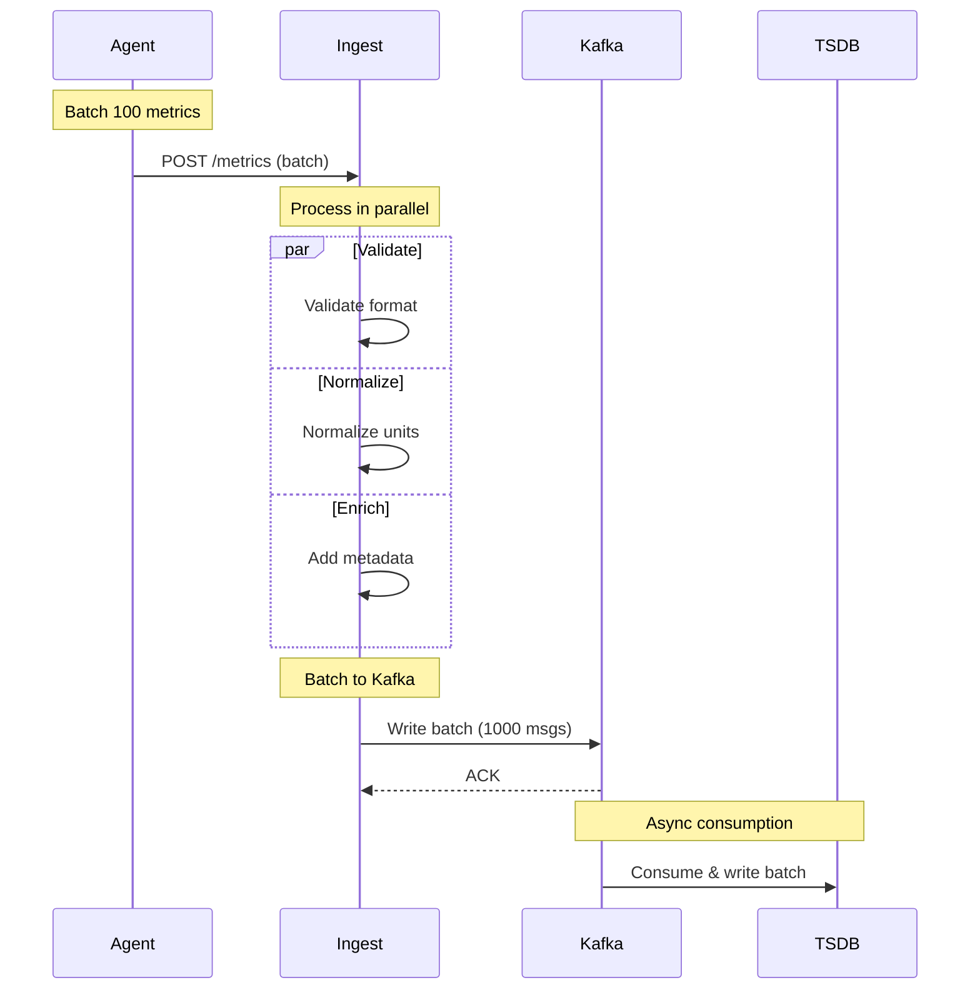

**Optimizations:**
1. **Batching at agent**: Send 10-100 metrics per request
2. **Batching at Kafka producer**: Accumulate before sending
3. **Compression**: Use Snappy/LZ4 for Kafka messages
4. **Async writes**: Don't wait for TSDB acknowledgment
5. **Write buffering**: Buffer writes in memory before flushing

### B. Query Path Optimization

**Multi-level Caching:**
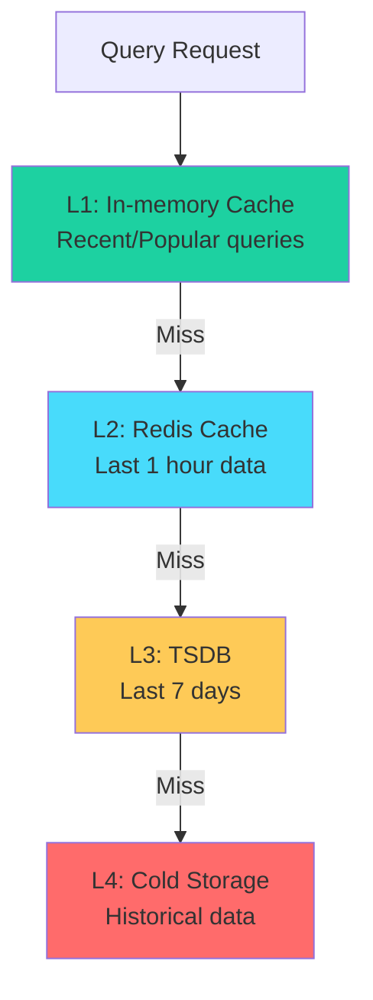

### C. Data Compression

**Time-series compression algorithms:**

1. **Delta-of-delta encoding** (Gorilla compression)
```
Original:  [100, 102, 104, 106, 108]
Deltas:    [2, 2, 2, 2]
Delta-delta: [0, 0, 0]  // Highly compressible!
```

2. **Run-length encoding** for repeated values
3. **XOR compression** for floating-point values

**Compression Ratios:**
- Raw data: 12 bytes/point
- Compressed: 1-2 bytes/point
- **Compression ratio: 6-12x**

---

## Technology Stack

| Component | Technology Options | Recommended |
|-----------|-------------------|-------------|
| **Ingestion** | Golang, Java Spring Boot | Golang (performance) |
| **Message Queue** | Kafka, Pulsar, RabbitMQ | Kafka (throughput) |
| **Stream Processing** | Flink, Spark Streaming, Kafka Streams | Flink (complex aggregations) |
| **Time-Series DB** | InfluxDB, TimescaleDB, Prometheus | TimescaleDB (flexibility) |
| **Cache** | Redis, Memcached | Redis (data structures) |
| **Cold Storage** | S3, GCS, Azure Blob | S3 (cost-effective) |
| **Metadata Store** | Cassandra, DynamoDB, Redis | Cassandra (scale) |
| **Query Engine** | Custom, Presto, ClickHouse | Custom + ClickHouse |

---

## Capacity Planning

### Storage Calculation

**Hot Storage (7 days, full resolution):**
```
10M points/sec * 86,400 sec/day * 7 days * 12 bytes/point
= 72 TB raw (compressed to ~10 TB)
```

**Cold Storage (1 year, 1-hour rollups):**
```
10M points/sec * 86,400 sec/day * 365 days * 2 bytes/point / 360 (hourly rollup)
= 18 TB
```

**Total Storage: ~30 TB**

### Compute Requirements

**Ingestion Servers:**
- 10M writes/sec
- Each server: 100K writes/sec
- **Need: 100 servers** (with 2x redundancy)

**Kafka Cluster:**
- 10M msgs/sec * 100 bytes/msg = 1 GB/sec
- 3x replication = 3 GB/sec
- **Need: 10-20 brokers**

---

## Monitoring & Observability

**Key Metrics to Track:**

```yaml
System Health:
  - ingestion.throughput (points/sec)
  - ingestion.latency.p99 (ms)
  - kafka.lag (messages)
  - tsdb.write.latency (ms)
  - query.latency.p95 (ms)
  - cache.hit.ratio (%)

Resource Utilization:
  - cpu.usage (%)
  - memory.usage (%)
  - disk.io.utilization (%)
  - network.bandwidth (MB/s)

Data Quality:
  - metric.validation.errors (count)
  - series.cardinality (count)
  - data.gaps (count)
  - duplicate.metrics (count)
```

---

## Trade-offs and Considerations

### 1. Push vs Pull
| Aspect | Push | Pull |
|--------|------|------|
| **Scalability** | ✅ Better (clients control rate) | ❌ Server polls all targets |
| **Firewall-friendly** | ✅ Yes | ❌ Needs inbound access |
| **Service discovery** | ❌ Clients need endpoints | ✅ Server discovers targets |
| **Short-lived jobs** | ✅ Can push before exit | ❌ Might miss data |

### 2. Consistency vs Availability
- **Chose**: Eventual consistency (AP in CAP)
- **Why**: Metrics can tolerate small delays; availability more important

### 3. Accuracy vs Performance
- **Strategy**: 
  - Real-time queries: Approximate (sampling, downsampling)
  - Historical queries: Exact (from aggregated data)

### 4. Storage Costs vs Query Speed
- **Solution**: Multi-tier storage
  - Hot: Fast SSD for recent data
  - Warm: Slower SSD for last month
  - Cold: S3 for historical

---

## Failure Scenarios & Handling

### 1. Ingestion Service Failure
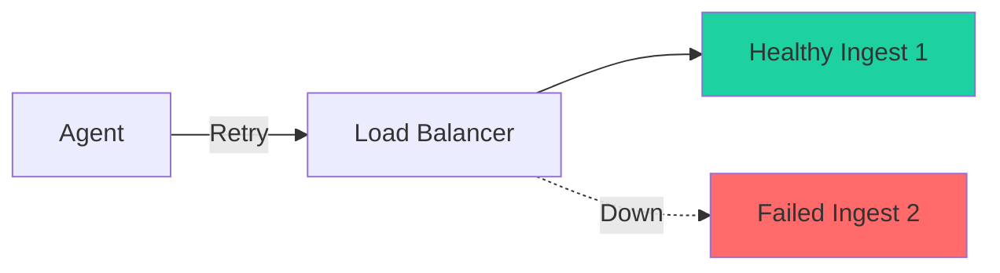
**Solution**: Load balancer health checks, automatic failover

### 2. Kafka Partition Failure
**Solution**: Replication factor = 3, min in-sync replicas = 2

### 3. TSDB Failure
**Solution**: 
- Data replicated in Kafka (replay capability)
- Multi-region TSDB deployment
- Automated backups

### 4. Query Service Overload
**Solution**:
- Rate limiting per user/dashboard
- Query result caching
- Query complexity limits
- Auto-scaling based on CPU/memory

---

## Security Considerations

1. **Authentication**: API keys, OAuth 2.0
2. **Authorization**: Role-based access control (RBAC)
3. **Encryption**: 
   - In transit: TLS 1.3
   - At rest: AES-256
4. **Data isolation**: Multi-tenancy with strict data separation
5. **Audit logging**: Track all data access

---

## Extensions & Future Enhancements

1. **Machine Learning Integration**
   - Anomaly detection
   - Predictive alerting
   - Automatic baseline detection

2. **Distributed Tracing Integration**
   - Correlate metrics with traces
   - Exemplar support (link metric spikes to traces)

3. **Log Integration**
   - Unified observability platform
   - Correlated logs, metrics, traces

4. **Cost Optimization**
   - Intelligent downsampling based on query patterns
   - Automatic archival of unused metrics

5. **Advanced Querying**
   - Natural language queries
   - Saved queries and templates

---

## Summary

This design provides:
- ✅ **10M+ writes/second** throughput
- ✅ **Sub-second query** latency for recent data
- ✅ **Scalable** to millions of servers
- ✅ **Cost-effective** with tiered storage
- ✅ **Real-time alerting** with low false positives
- ✅ **High availability** with no single point of failure

**Key Design Decisions:**
1. Push-based collection for scalability
2. Kafka for buffering and replay capability
3. Stream processing for real-time aggregation
4. Time-series DB for efficient storage and queries
5. Multi-tier storage for cost optimization
6. Aggressive caching for query performance

[← Back to Topics](../topics.md#distributed-metrics-logging-and-aggregation-system-like-datadog-prometheus)
