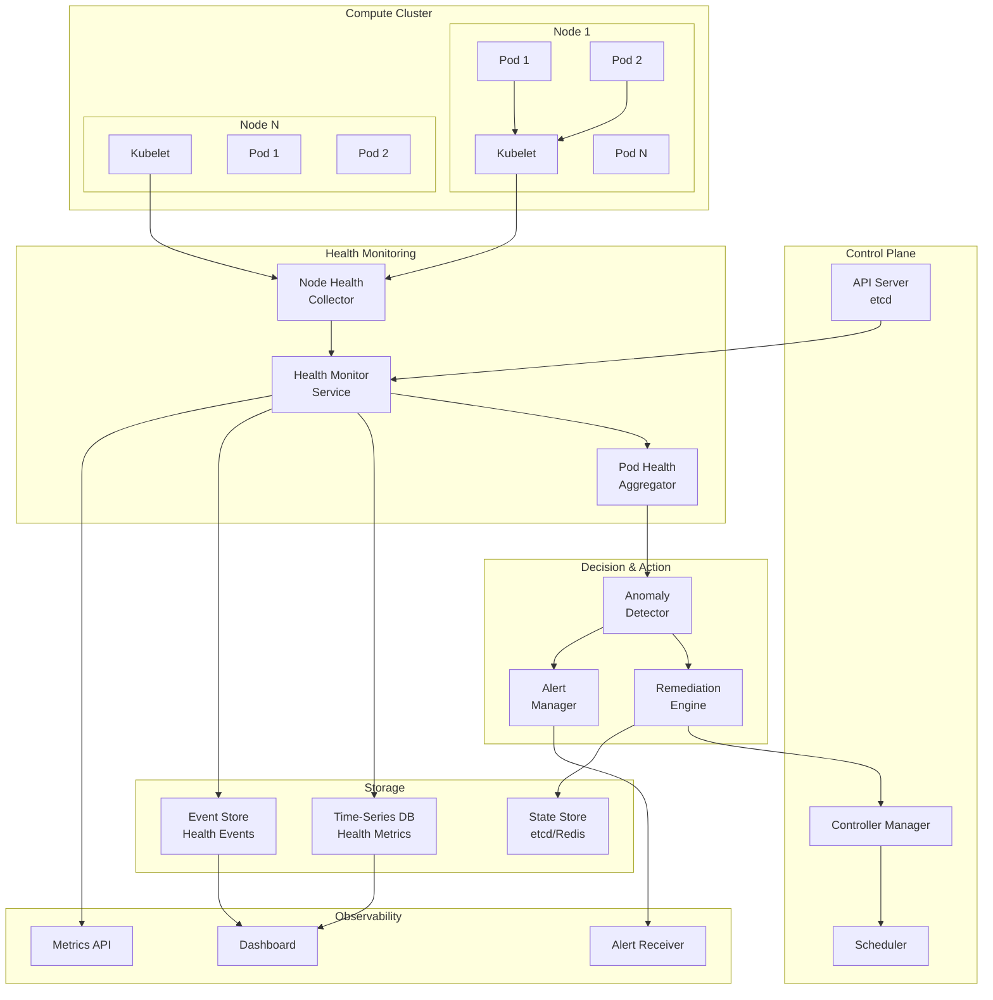
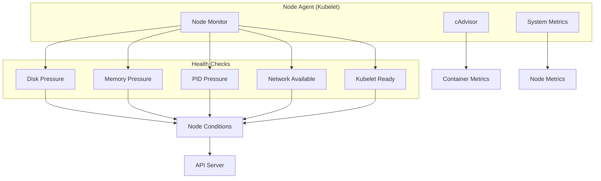
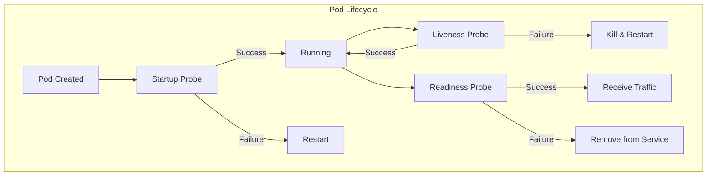
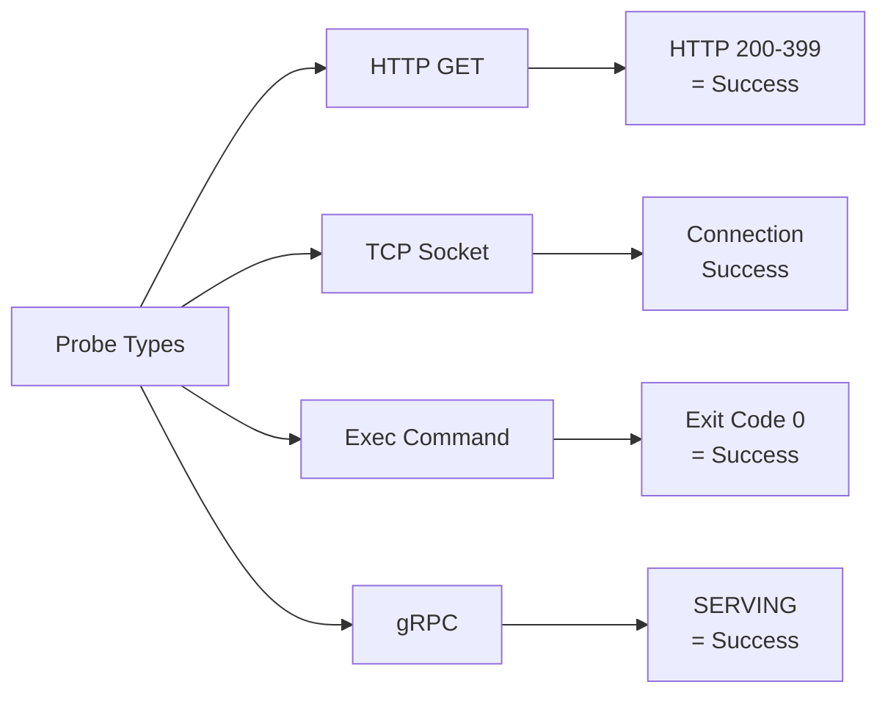
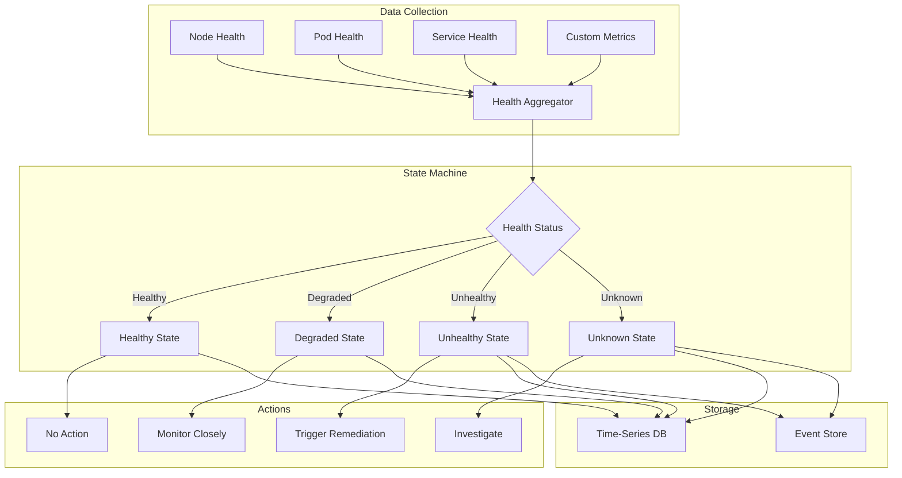
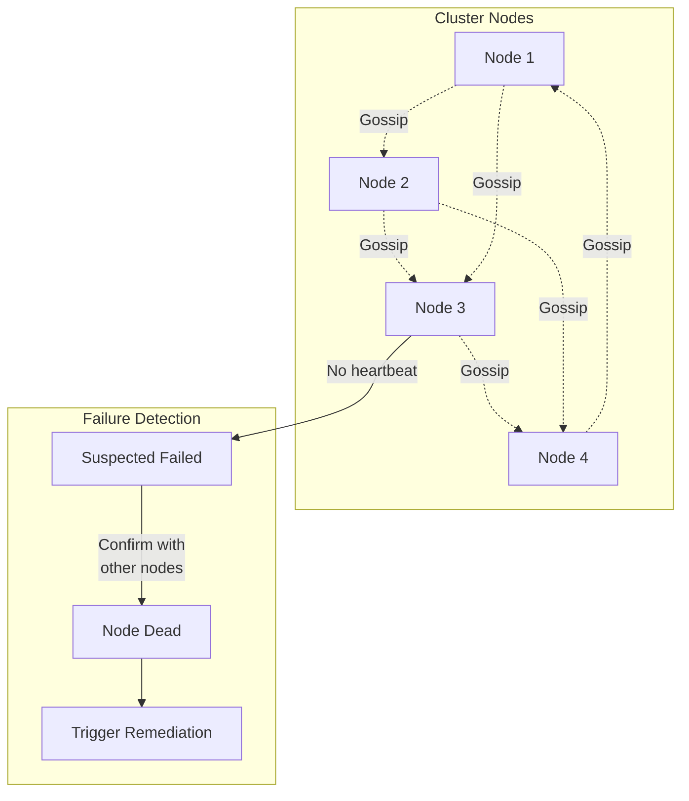
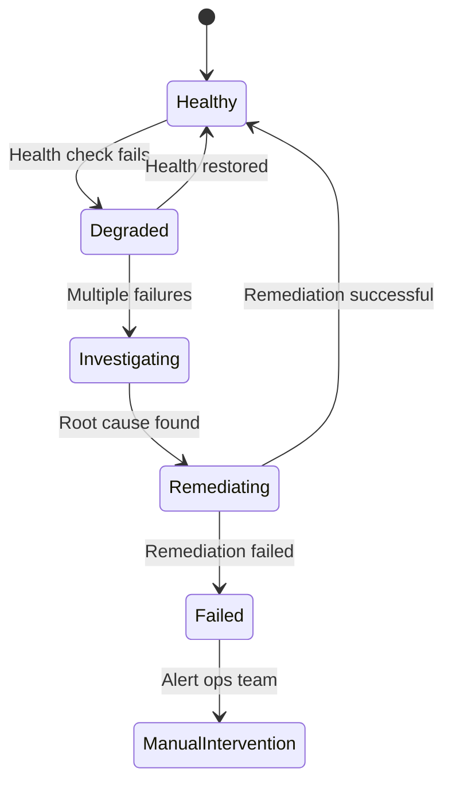
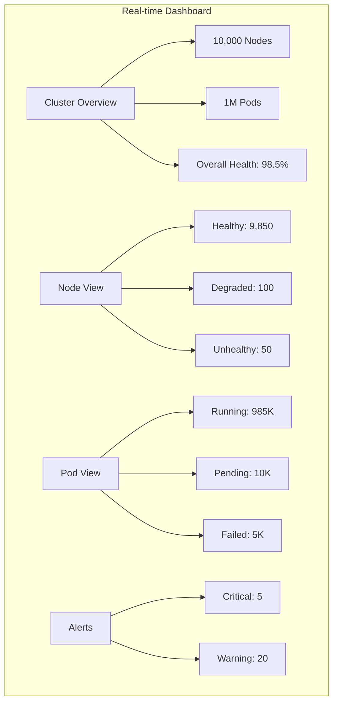

# Monitoring Health for a Large Compute Cluster

[← Back to Topics](../topics.md#monitoring-health-for-a-large-compute-cluster-like-kubernetes)

## Problem Statement

Design a health monitoring system for a compute cluster with 10K+ nodes running containerized workloads. Detect failures, perform auto-remediation, and provide real-time cluster state visibility.

---

## Requirements

### Functional Requirements
1. **Node Health Monitoring**: CPU, memory, disk, network, and kernel metrics
2. **Container/Pod Health**: Liveness, readiness, and startup probes
3. **Service Health**: Application-level health checks
4. **Failure Detection**: Identify failed nodes, pods, and services
5. **Auto-Remediation**: Automatic restart, reschedule, or replace failed components
6. **Real-time Dashboard**: Cluster-wide health visualization
7. **Alerting**: Intelligent alerting with noise reduction
8. **Audit Logs**: Track all health events and remediation actions

### Non-Functional Requirements
1. **Scalability**: Support 10K+ nodes, 100K+ pods
2. **Low Latency**: Failure detection within 10 seconds
3. **High Availability**: No single point of failure
4. **Accuracy**: <0.1% false positives
5. **Performance**: Minimal overhead (<2% CPU per node)
6. **Resilience**: System should heal itself

### Scale Estimates
- **Nodes**: 10,000 nodes
- **Pods per node**: 100 pods
- **Total pods**: 1 million pods
- **Health checks per pod**: 3 (liveness, readiness, startup)
- **Check frequency**: 10 seconds
- **Total checks/second**: 1M * 3 / 10 = **300K checks/second**

---

## High-Level Architecture



---

## Detailed Design

### 1. Node Health Monitoring



#### Node Conditions

```yaml
nodeConditions:
  - type: Ready
    status: "True"
    reason: "KubeletReady"
    message: "kubelet is posting ready status"
    lastHeartbeatTime: "2026-01-22T10:30:00Z"
    lastTransitionTime: "2026-01-20T08:00:00Z"
  
  - type: MemoryPressure
    status: "False"
    reason: "KubeletHasSufficientMemory"
    message: "kubelet has sufficient memory available"
  
  - type: DiskPressure
    status: "False"
    reason: "KubeletHasNoDiskPressure"
    message: "kubelet has no disk pressure"
  
  - type: PIDPressure
    status: "False"
    reason: "KubeletHasSufficientPID"
    message: "kubelet has sufficient PID available"
  
  - type: NetworkUnavailable
    status: "False"
    reason: "RouteCreated"
    message: "RouteController created a route"
```

#### Node Health Monitor Implementation

```go
package healthcheck

import (
    "context"
    "time"
    "k8s.io/api/core/v1"
    "k8s.io/client-go/kubernetes"
)

type NodeHealthMonitor struct {
    clientset *kubernetes.Clientset
    nodeName  string
    interval  time.Duration
}

func (m *NodeHealthMonitor) Start(ctx context.Context) {
    ticker := time.NewTicker(m.interval)
    defer ticker.Stop()
    
    for {
        select {
        case <-ctx.Done():
            return
        case <-ticker.C:
            m.performHealthCheck()
        }
    }
}

func (m *NodeHealthMonitor) performHealthCheck() {
    conditions := []v1.NodeCondition{}
    
    // Check disk pressure
    diskPressure := m.checkDiskPressure()
    conditions = append(conditions, diskPressure)
    
    // Check memory pressure
    memoryPressure := m.checkMemoryPressure()
    conditions = append(conditions, memoryPressure)
    
    // Check PID pressure
    pidPressure := m.checkPIDPressure()
    conditions = append(conditions, pidPressure)
    
    // Check network
    networkAvailable := m.checkNetwork()
    conditions = append(conditions, networkAvailable)
    
    // Update node status
    m.updateNodeStatus(conditions)
}

func (m *NodeHealthMonitor) checkDiskPressure() v1.NodeCondition {
    usage := m.getDiskUsage()
    
    if usage > 0.85 {
        return v1.NodeCondition{
            Type:    v1.NodeDiskPressure,
            Status:  v1.ConditionTrue,
            Reason:  "KubeletHasDiskPressure",
            Message: fmt.Sprintf("disk usage is %.2f%%", usage*100),
        }
    }
    
    return v1.NodeCondition{
        Type:    v1.NodeDiskPressure,
        Status:  v1.ConditionFalse,
        Reason:  "KubeletHasNoDiskPressure",
        Message: "kubelet has no disk pressure",
    }
}

func (m *NodeHealthMonitor) checkMemoryPressure() v1.NodeCondition {
    memInfo := m.getMemoryInfo()
    availableMemory := memInfo.Available
    totalMemory := memInfo.Total
    
    if float64(availableMemory)/float64(totalMemory) < 0.1 {
        return v1.NodeCondition{
            Type:    v1.NodeMemoryPressure,
            Status:  v1.ConditionTrue,
            Reason:  "KubeletHasInsufficientMemory",
            Message: "kubelet has insufficient memory available",
        }
    }
    
    return v1.NodeCondition{
        Type:    v1.NodeMemoryPressure,
        Status:  v1.ConditionFalse,
        Reason:  "KubeletHasSufficientMemory",
        Message: "kubelet has sufficient memory available",
    }
}

func (m *NodeHealthMonitor) checkPIDPressure() v1.NodeCondition {
    pids := m.getRunningPIDs()
    maxPIDs := m.getMaxPIDs()
    
    if float64(pids)/float64(maxPIDs) > 0.9 {
        return v1.NodeCondition{
            Type:    v1.NodePIDPressure,
            Status:  v1.ConditionTrue,
            Reason:  "KubeletHasInsufficientPID",
            Message: "kubelet has insufficient PID available",
        }
    }
    
    return v1.NodeCondition{
        Type:    v1.NodePIDPressure,
        Status:  v1.ConditionFalse,
        Reason:  "KubeletHasSufficientPID",
        Message: "kubelet has sufficient PID available",
    }
}
```

---

### 2. Pod Health Probes



#### Probe Configuration

```yaml
apiVersion: v1
kind: Pod
metadata:
  name: my-app
spec:
  containers:
  - name: app
    image: my-app:v1
    
    # Startup probe (runs first)
    startupProbe:
      httpGet:
        path: /healthz
        port: 8080
      initialDelaySeconds: 0
      periodSeconds: 10
      timeoutSeconds: 3
      failureThreshold: 30  # 5 minutes max startup time
    
    # Liveness probe (is the app alive?)
    livenessProbe:
      httpGet:
        path: /healthz
        port: 8080
      initialDelaySeconds: 30
      periodSeconds: 10
      timeoutSeconds: 5
      failureThreshold: 3  # Restart after 3 failures
      successThreshold: 1
    
    # Readiness probe (can the app serve traffic?)
    readinessProbe:
      httpGet:
        path: /ready
        port: 8080
      initialDelaySeconds: 5
      periodSeconds: 5
      timeoutSeconds: 3
      failureThreshold: 3
      successThreshold: 1
    
    resources:
      requests:
        memory: "256Mi"
        cpu: "100m"
      limits:
        memory: "512Mi"
        cpu: "500m"
```

#### Probe Types



#### Kubelet Probe Manager

```go
package probes

import (
    "context"
    "net/http"
    "time"
)

type ProbeManager struct {
    workers map[string]*ProbeWorker
}

type ProbeWorker struct {
    podName       string
    containerName string
    probe         *Probe
    results       chan ProbeResult
}

type Probe struct {
    Type              ProbeType
    HTTPGet           *HTTPGetAction
    TCPSocket         *TCPSocketAction
    Exec              *ExecAction
    InitialDelay      time.Duration
    Period            time.Duration
    Timeout           time.Duration
    SuccessThreshold  int
    FailureThreshold  int
}

type ProbeResult struct {
    Success bool
    Output  string
    Error   error
}

func (w *ProbeWorker) Run(ctx context.Context) {
    // Wait for initial delay
    time.Sleep(w.probe.InitialDelay)
    
    ticker := time.NewTicker(w.probe.Period)
    defer ticker.Stop()
    
    consecutiveFailures := 0
    consecutiveSuccesses := 0
    
    for {
        select {
        case <-ctx.Done():
            return
        case <-ticker.C:
            result := w.executeProbe()
            
            if result.Success {
                consecutiveSuccesses++
                consecutiveFailures = 0
                
                if consecutiveSuccesses >= w.probe.SuccessThreshold {
                    w.results <- ProbeResult{Success: true}
                }
            } else {
                consecutiveFailures++
                consecutiveSuccesses = 0
                
                if consecutiveFailures >= w.probe.FailureThreshold {
                    w.results <- ProbeResult{
                        Success: false,
                        Error:   result.Error,
                    }
                }
            }
        }
    }
}

func (w *ProbeWorker) executeProbe() ProbeResult {
    ctx, cancel := context.WithTimeout(context.Background(), w.probe.Timeout)
    defer cancel()
    
    switch w.probe.Type {
    case HTTPProbe:
        return w.executeHTTPProbe(ctx)
    case TCPProbe:
        return w.executeTCPProbe(ctx)
    case ExecProbe:
        return w.executeExecProbe(ctx)
    default:
        return ProbeResult{Success: false}
    }
}

func (w *ProbeWorker) executeHTTPProbe(ctx context.Context) ProbeResult {
    url := fmt.Sprintf("http://%s:%d%s",
        w.probe.HTTPGet.Host,
        w.probe.HTTPGet.Port,
        w.probe.HTTPGet.Path,
    )
    
    req, _ := http.NewRequestWithContext(ctx, "GET", url, nil)
    
    // Add custom headers
    for _, header := range w.probe.HTTPGet.Headers {
        req.Header.Add(header.Name, header.Value)
    }
    
    client := &http.Client{Timeout: w.probe.Timeout}
    resp, err := client.Do(req)
    
    if err != nil {
        return ProbeResult{Success: false, Error: err}
    }
    defer resp.Body.Close()
    
    // Success if status code is 2xx or 3xx
    if resp.StatusCode >= 200 && resp.StatusCode < 400 {
        return ProbeResult{Success: true}
    }
    
    return ProbeResult{
        Success: false,
        Error:   fmt.Errorf("HTTP status %d", resp.StatusCode),
    }
}
```

---

### 3. Health Aggregation & State Management



#### Health Aggregation Service

```python
from dataclasses import dataclass
from enum import Enum
from typing import Dict, List
import asyncio
import asyncpg

class HealthStatus(Enum):
    HEALTHY = "healthy"
    DEGRADED = "degraded"
    UNHEALTHY = "unhealthy"
    UNKNOWN = "unknown"

@dataclass
class NodeHealth:
    node_name: str
    status: HealthStatus
    conditions: Dict[str, bool]
    metrics: Dict[str, float]
    last_heartbeat: int

@dataclass
class PodHealth:
    pod_name: str
    namespace: str
    node_name: str
    status: HealthStatus
    liveness: bool
    readiness: bool
    restart_count: int

class HealthAggregator:
    def __init__(self):
        self.node_health = {}
        self.pod_health = {}
        self.db_pool = None
    
    async def aggregate_cluster_health(self) -> Dict:
        """Aggregate health across entire cluster"""
        
        # Get all node health
        nodes = await self.get_all_nodes()
        
        healthy_nodes = 0
        degraded_nodes = 0
        unhealthy_nodes = 0
        
        for node in nodes:
            health = await self.get_node_health(node)
            
            if health.status == HealthStatus.HEALTHY:
                healthy_nodes += 1
            elif health.status == HealthStatus.DEGRADED:
                degraded_nodes += 1
            else:
                unhealthy_nodes += 1
        
        # Get pod health
        pods = await self.get_all_pods()
        
        running_pods = 0
        pending_pods = 0
        failed_pods = 0
        
        for pod in pods:
            health = await self.get_pod_health(pod)
            
            if health.status == HealthStatus.HEALTHY:
                running_pods += 1
            elif health.status == HealthStatus.DEGRADED:
                pending_pods += 1
            else:
                failed_pods += 1
        
        # Determine overall cluster health
        cluster_status = self.determine_cluster_status(
            healthy_nodes, degraded_nodes, unhealthy_nodes,
            running_pods, failed_pods
        )
        
        return {
            "status": cluster_status,
            "nodes": {
                "total": len(nodes),
                "healthy": healthy_nodes,
                "degraded": degraded_nodes,
                "unhealthy": unhealthy_nodes
            },
            "pods": {
                "total": len(pods),
                "running": running_pods,
                "pending": pending_pods,
                "failed": failed_pods
            },
            "timestamp": time.time()
        }
    
    def determine_cluster_status(
        self,
        healthy_nodes: int,
        degraded_nodes: int,
        unhealthy_nodes: int,
        running_pods: int,
        failed_pods: int
    ) -> HealthStatus:
        """Determine overall cluster health status"""
        
        total_nodes = healthy_nodes + degraded_nodes + unhealthy_nodes
        total_pods = running_pods + failed_pods
        
        # Critical: >20% nodes unhealthy or >30% pods failed
        if (unhealthy_nodes / total_nodes > 0.2 or 
            failed_pods / total_pods > 0.3):
            return HealthStatus.UNHEALTHY
        
        # Degraded: >5% nodes unhealthy or >10% pods failed
        if (unhealthy_nodes / total_nodes > 0.05 or
            failed_pods / total_pods > 0.1):
            return HealthStatus.DEGRADED
        
        return HealthStatus.HEALTHY
    
    async def get_node_health(self, node_name: str) -> NodeHealth:
        """Get health status for a specific node"""
        
        # Query from cache first
        if node_name in self.node_health:
            cached = self.node_health[node_name]
            
            # Return if recent (< 30 seconds old)
            if time.time() - cached.last_heartbeat < 30:
                return cached
        
        # Fetch from Kubernetes API
        node = await self.k8s_client.get_node(node_name)
        
        # Parse conditions
        conditions = {}
        for condition in node.status.conditions:
            conditions[condition.type] = condition.status == "True"
        
        # Determine health status
        status = HealthStatus.HEALTHY
        
        if not conditions.get("Ready", False):
            status = HealthStatus.UNHEALTHY
        elif (conditions.get("MemoryPressure", False) or
              conditions.get("DiskPressure", False)):
            status = HealthStatus.DEGRADED
        
        health = NodeHealth(
            node_name=node_name,
            status=status,
            conditions=conditions,
            metrics={},
            last_heartbeat=int(time.time())
        )
        
        # Update cache
        self.node_health[node_name] = health
        
        return health
```

---

### 4. Failure Detection with Gossip Protocol



#### Gossip-based Health Check

```go
package gossip

import (
    "time"
    "github.com/hashicorp/memberlist"
)

type GossipHealthChecker struct {
    memberlist *memberlist.Memberlist
    delegates  *HealthDelegate
}

type HealthDelegate struct {
    nodeHealth map[string]*NodeHealthStatus
}

type NodeHealthStatus struct {
    NodeName      string
    Status        string
    LastHeartbeat time.Time
    FailureCount  int
}

func (d *HealthDelegate) NotifyMsg(msg []byte) {
    // Process health messages from other nodes
    var health NodeHealthStatus
    json.Unmarshal(msg, &health)
    
    d.nodeHealth[health.NodeName] = &health
}

func (d *HealthDelegate) NodeMeta(limit int) []byte {
    // Share this node's health
    health := d.getLocalHealth()
    data, _ := json.Marshal(health)
    return data
}

func (g *GossipHealthChecker) MonitorNode(nodeName string) {
    ticker := time.NewTicker(5 * time.Second)
    defer ticker.Stop()
    
    for range ticker.C {
        status := g.delegates.nodeHealth[nodeName]
        
        if status == nil {
            continue
        }
        
        // Check if node is alive
        timeSinceHeartbeat := time.Since(status.LastHeartbeat)
        
        if timeSinceHeartbeat > 30*time.Second {
            status.FailureCount++
            
            // Confirm with other nodes before declaring dead
            if g.confirmFailureWithPeers(nodeName, 3) {
                g.handleNodeFailure(nodeName)
            }
        } else {
            status.FailureCount = 0
        }
    }
}

func (g *GossipHealthChecker) confirmFailureWithPeers(
    nodeName string,
    requiredConfirmations int,
) bool {
    members := g.memberlist.Members()
    confirmations := 0
    
    for _, member := range members {
        // Ask peer about node health
        if g.askPeerAboutNode(member, nodeName) == "unhealthy" {
            confirmations++
        }
        
        if confirmations >= requiredConfirmations {
            return true
        }
    }
    
    return false
}
```

---

### 5. Auto-Remediation Engine



#### Remediation Actions

```python
from enum import Enum
from typing import List, Dict
import asyncio

class RemediationAction(Enum):
    RESTART_POD = "restart_pod"
    RESTART_CONTAINER = "restart_container"
    RESCHEDULE_POD = "reschedule_pod"
    DRAIN_NODE = "drain_node"
    REBOOT_NODE = "reboot_node"
    SCALE_UP = "scale_up"
    SCALE_DOWN = "scale_down"
    ROLLBACK_DEPLOYMENT = "rollback_deployment"

class RemediationEngine:
    def __init__(self):
        self.action_history = []
        self.cooldown_periods = {
            RemediationAction.RESTART_POD: 60,      # 1 minute
            RemediationAction.RESCHEDULE_POD: 300,  # 5 minutes
            RemediationAction.DRAIN_NODE: 1800,     # 30 minutes
            RemediationAction.REBOOT_NODE: 3600,    # 1 hour
        }
    
    async def handle_pod_failure(self, pod: PodHealth):
        """Handle pod health failure"""
        
        # Check restart count
        if pod.restart_count > 10:
            # Too many restarts, might be a deeper issue
            await self.alert_operations(
                f"Pod {pod.pod_name} has restarted {pod.restart_count} times"
            )
            
            # Try rescheduling to different node
            await self.execute_action(
                RemediationAction.RESCHEDULE_POD,
                {"pod": pod.pod_name, "namespace": pod.namespace}
            )
        elif pod.restart_count > 5:
            # Multiple restarts, check node health
            node_health = await self.get_node_health(pod.node_name)
            
            if node_health.status != HealthStatus.HEALTHY:
                # Node might be the problem, reschedule pod
                await self.execute_action(
                    RemediationAction.RESCHEDULE_POD,
                    {"pod": pod.pod_name, "namespace": pod.namespace}
                )
        else:
            # First few failures, just restart
            await self.execute_action(
                RemediationAction.RESTART_POD,
                {"pod": pod.pod_name, "namespace": pod.namespace}
            )
    
    async def handle_node_failure(self, node: NodeHealth):
        """Handle node health failure"""
        
        # Check what's wrong with the node
        if node.conditions.get("DiskPressure"):
            # Disk is full, clean up
            await self.cleanup_node_disk(node.node_name)
        
        elif node.conditions.get("MemoryPressure"):
            # Memory pressure, evict non-critical pods
            await self.evict_low_priority_pods(node.node_name)
        
        elif not node.conditions.get("Ready"):
            # Node not ready, drain and investigate
            await self.execute_action(
                RemediationAction.DRAIN_NODE,
                {"node": node.node_name}
            )
            
            # Wait for pods to be rescheduled
            await asyncio.sleep(60)
            
            # If still not ready, reboot
            if not await self.is_node_ready(node.node_name):
                await self.execute_action(
                    RemediationAction.REBOOT_NODE,
                    {"node": node.node_name}
                )
    
    async def execute_action(
        self,
        action: RemediationAction,
        params: Dict
    ) -> bool:
        """Execute remediation action with safety checks"""
        
        # Check cooldown period
        if not self.can_execute_action(action, params):
            logging.warning(
                f"Action {action} is in cooldown period, skipping"
            )
            return False
        
        # Check rate limiting
        if not self.check_rate_limit(action):
            logging.warning(
                f"Action {action} exceeds rate limit, skipping"
            )
            return False
        
        # Record action
        self.record_action(action, params)
        
        # Execute based on action type
        try:
            if action == RemediationAction.RESTART_POD:
                await self.restart_pod(params['pod'], params['namespace'])
            
            elif action == RemediationAction.RESCHEDULE_POD:
                await self.reschedule_pod(params['pod'], params['namespace'])
            
            elif action == RemediationAction.DRAIN_NODE:
                await self.drain_node(params['node'])
            
            elif action == RemediationAction.REBOOT_NODE:
                await self.reboot_node(params['node'])
            
            return True
        
        except Exception as e:
            logging.error(f"Failed to execute {action}: {e}")
            return False
    
    def can_execute_action(
        self,
        action: RemediationAction,
        params: Dict
    ) -> bool:
        """Check if action is in cooldown period"""
        
        cooldown = self.cooldown_periods.get(action, 0)
        
        for historical_action in reversed(self.action_history):
            if (historical_action['action'] == action and
                historical_action['params'] == params):
                
                time_since = time.time() - historical_action['timestamp']
                
                if time_since < cooldown:
                    return False
                break
        
        return True
    
    def check_rate_limit(self, action: RemediationAction) -> bool:
        """Check if we're executing too many actions"""
        
        # Count actions in last 5 minutes
        recent_actions = [
            a for a in self.action_history
            if time.time() - a['timestamp'] < 300
        ]
        
        # Limit to 10 actions per 5 minutes
        return len(recent_actions) < 10
```

---

### 6. Dashboard & Visualization



---

## Technology Stack

| Component | Technology | Reason |
|-----------|------------|--------|
| **Container Orchestrator** | Kubernetes | Industry standard |
| **Node Monitoring** | Kubelet + cAdvisor | Built-in |
| **Health Checks** | Kubernetes Probes | Native support |
| **Service Mesh** | Istio/Linkerd | Advanced health checks |
| **Metrics** | Prometheus | Time-series DB |
| **Alerting** | Alertmanager | Integrates with Prometheus |
| **Visualization** | Grafana | Rich dashboards |
| **State Store** | etcd | Distributed K-V store |

---

## Trade-offs

### 1. Probe Frequency vs Overhead
- **High frequency (5s)**: Faster detection, more overhead
- **Low frequency (30s)**: Less overhead, slower detection
- **Decision**: 10s for most apps, 5s for critical

### 2. Auto-remediation vs Manual
- **Auto**: Faster recovery, risk of wrong action
- **Manual**: Safe, slower recovery
- **Decision**: Auto with safeguards + manual approval for destructive actions

### 3. Centralized vs Distributed Health Checks
- **Centralized**: Simpler, single point of failure
- **Distributed**: Complex, more resilient
- **Decision**: Distributed with gossip protocol

---

## Summary

This design provides:
- ✅ **10K+ nodes, 1M+ pods** monitoring
- ✅ **<10 second** failure detection
- ✅ **Auto-remediation** with safety guards
- ✅ **<0.1% false positives** through multi-level validation
- ✅ **Self-healing** cluster with minimal manual intervention

**Key Innovations:**
1. Multi-level health checks (node, pod, service)
2. Gossip protocol for distributed failure detection
3. Intelligent remediation with cooldowns and rate limiting
4. Real-time dashboard with cluster-wide visibility

[← Back to Topics](../topics.md#monitoring-health-for-a-large-compute-cluster-like-kubernetes)
