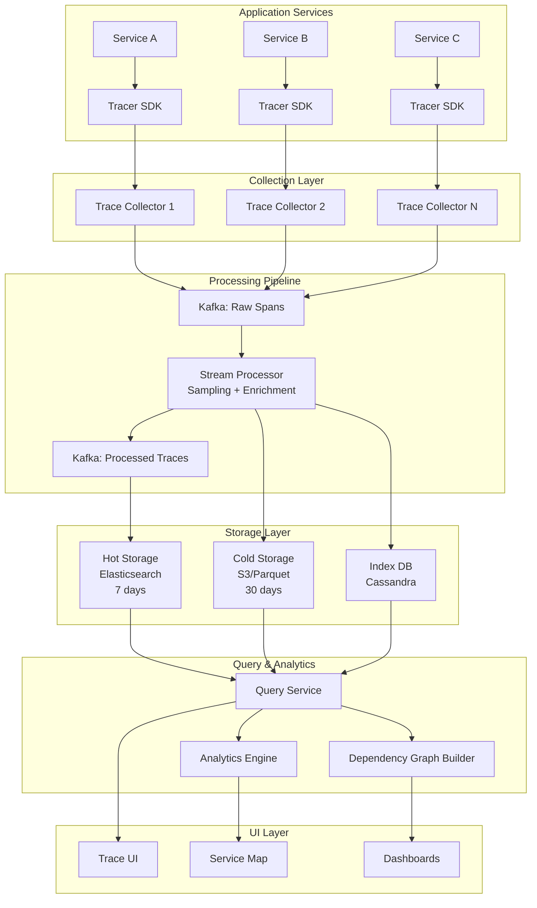
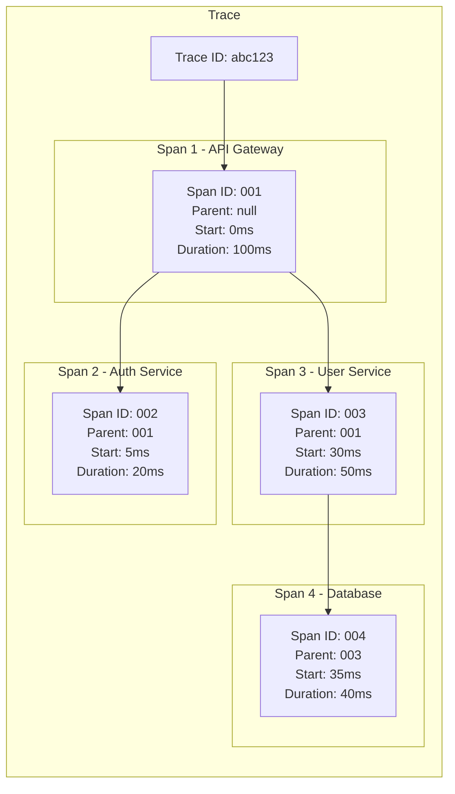
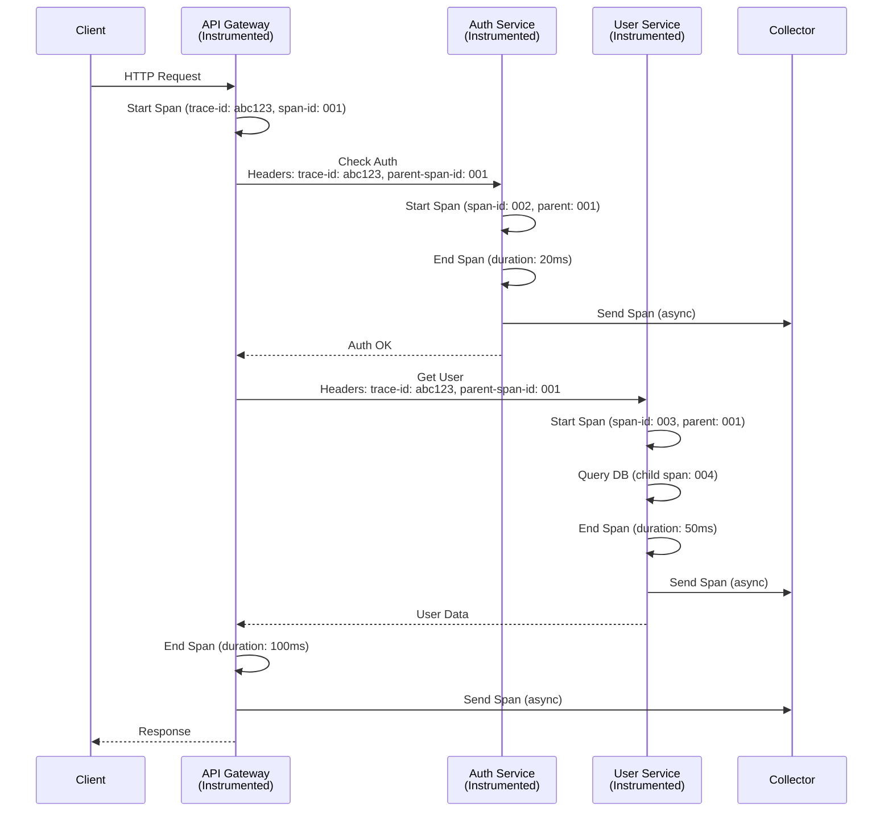
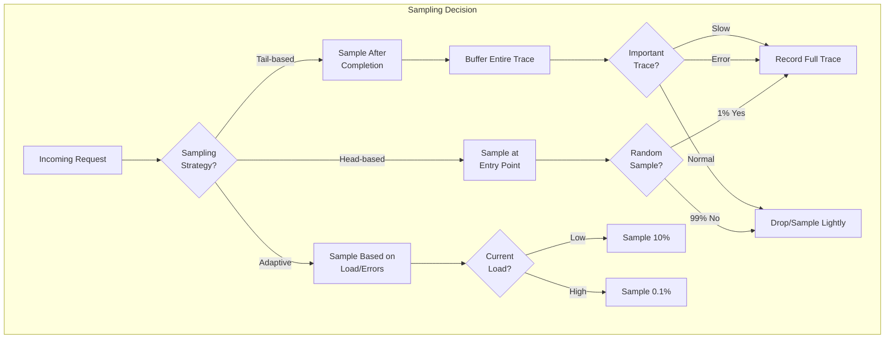
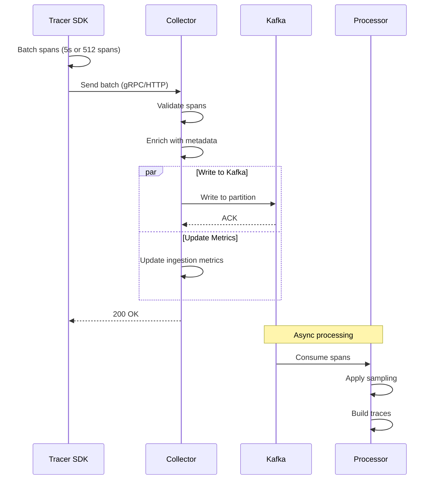
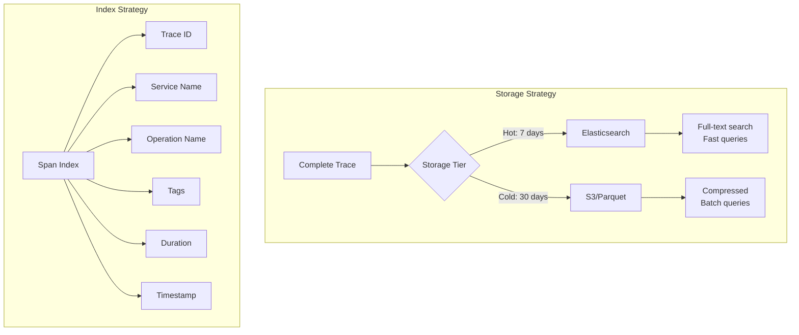
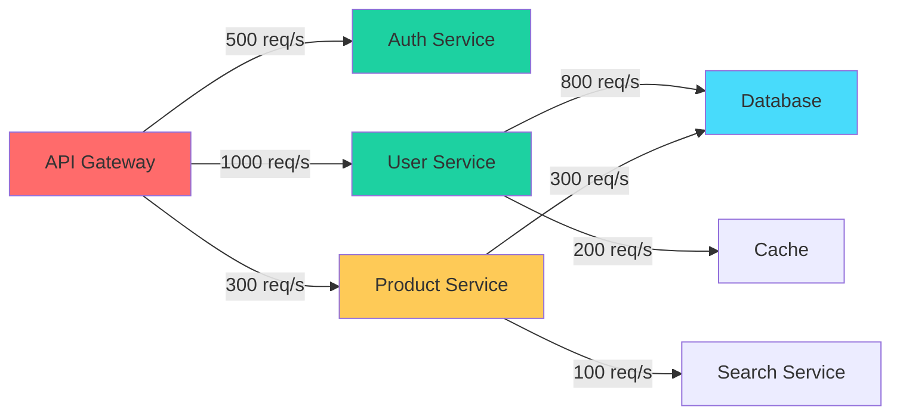

# Designing a Distributed Tracing System

[← Back to Topics](../topics.md#designing-a-distributed-tracing-system-like-jaeger-zipkin)

## Problem Statement

Design a distributed tracing system that can track requests across 1000+ microservices with minimal performance overhead (<5ms latency). Support trace sampling, correlation, and root cause analysis.

---

## Requirements

### Functional Requirements
1. **Trace Collection**: Capture spans from all services in a distributed system
2. **Context Propagation**: Maintain trace context across service boundaries
3. **Sampling**: Support multiple sampling strategies (head-based, tail-based, adaptive)
4. **Trace Storage**: Store and query traces efficiently
5. **Trace Visualization**: Display trace timelines and service dependencies
6. **Root Cause Analysis**: Identify bottlenecks and errors
7. **Service Dependency Graph**: Visualize service relationships
8. **Metrics Integration**: Correlate traces with metrics

### Non-Functional Requirements
1. **Low Latency**: <5ms overhead per instrumented call
2. **Scalability**: Handle 1000+ services, 10M spans/second
3. **High Availability**: 99.9% uptime
4. **Minimal Resource Usage**: <1% CPU overhead
5. **Retention**: 7 days full traces, 30 days sampled
6. **Query Performance**: Sub-second query for recent traces

### Scale Estimates
- **Services**: 1,000 microservices
- **Requests/second**: 1M requests/second
- **Avg spans per trace**: 10 spans
- **Total spans**: 10M spans/second
- **Sampling rate**: 1% (100K traces/second sampled)
- **Storage**: ~50TB for 7 days retention

---

## High-Level Architecture



---

## Detailed Design

### 1. Tracing Concepts



#### Span Data Model

```json
{
  "traceId": "abc123-def456-ghi789",
  "spanId": "span-001",
  "parentSpanId": null,
  "operationName": "GET /api/users",
  "serviceName": "api-gateway",
  "startTime": 1706832000000000,
  "duration": 100000,
  "tags": {
    "http.method": "GET",
    "http.url": "/api/users",
    "http.status_code": 200,
    "span.kind": "server",
    "component": "http",
    "peer.service": "user-service"
  },
  "logs": [
    {
      "timestamp": 1706832000050000,
      "fields": {
        "event": "cache_miss",
        "key": "user:123"
      }
    }
  ],
  "references": [
    {
      "refType": "CHILD_OF",
      "traceId": "abc123-def456-ghi789",
      "spanId": "span-000"
    }
  ]
}
```

---

### 2. Tracer SDK Implementation



#### Tracer SDK (OpenTelemetry-style)

```python
from opentelemetry import trace
from opentelemetry.sdk.trace import TracerProvider
from opentelemetry.sdk.trace.export import BatchSpanProcessor
from opentelemetry.exporter.otlp.proto.grpc.trace_exporter import OTLPSpanExporter
import time

# Initialize tracer
tracer_provider = TracerProvider()
trace.set_tracer_provider(tracer_provider)

# Configure exporter
otlp_exporter = OTLPSpanExporter(
    endpoint="collector.example.com:4317",
    insecure=True
)

# Add batch processor (reduces overhead)
span_processor = BatchSpanProcessor(
    otlp_exporter,
    max_queue_size=2048,
    schedule_delay_millis=5000,  # Batch every 5 seconds
    max_export_batch_size=512
)
tracer_provider.add_span_processor(span_processor)

tracer = trace.get_tracer(__name__)

class TracedHTTPClient:
    """HTTP client with automatic tracing"""
    
    def __init__(self):
        self.tracer = trace.get_tracer(__name__)
    
    async def get(self, url: str, headers: dict = None):
        # Start a new span for this HTTP call
        with self.tracer.start_as_current_span(
            "HTTP GET",
            kind=trace.SpanKind.CLIENT
        ) as span:
            # Add span attributes
            span.set_attribute("http.method", "GET")
            span.set_attribute("http.url", url)
            
            # Inject trace context into headers
            headers = headers or {}
            carrier = {}
            inject_trace_context(carrier)
            headers.update(carrier)
            
            try:
                # Make HTTP request
                response = await self.http_client.get(url, headers=headers)
                
                # Record response status
                span.set_attribute("http.status_code", response.status_code)
                
                if response.status_code >= 400:
                    span.set_status(trace.Status(trace.StatusCode.ERROR))
                
                return response
            
            except Exception as e:
                # Record exception
                span.record_exception(e)
                span.set_status(trace.Status(trace.StatusCode.ERROR))
                raise

def inject_trace_context(carrier: dict):
    """Inject trace context into carrier (headers)"""
    span = trace.get_current_span()
    
    if span.is_recording():
        span_context = span.get_span_context()
        
        # W3C Trace Context format
        carrier["traceparent"] = (
            f"00-{span_context.trace_id:032x}-"
            f"{span_context.span_id:016x}-"
            f"{span_context.trace_flags:02x}"
        )
        
        # Optionally add trace state
        if span_context.trace_state:
            carrier["tracestate"] = str(span_context.trace_state)

def extract_trace_context(carrier: dict):
    """Extract trace context from carrier (headers)"""
    traceparent = carrier.get("traceparent")
    
    if not traceparent:
        return None
    
    # Parse W3C Trace Context
    parts = traceparent.split("-")
    if len(parts) != 4:
        return None
    
    version, trace_id, span_id, flags = parts
    
    return {
        "trace_id": int(trace_id, 16),
        "span_id": int(span_id, 16),
        "flags": int(flags, 16)
    }

# Example usage in a web service
from fastapi import FastAPI, Request
from opentelemetry.instrumentation.fastapi import FastAPIInstrumentor

app = FastAPI()

# Auto-instrument FastAPI
FastAPIInstrumentor.instrument_app(app)

@app.get("/api/users/{user_id}")
async def get_user(user_id: str, request: Request):
    # Span is automatically created by instrumentation
    
    with tracer.start_as_current_span("fetch_user_from_db") as span:
        span.set_attribute("user.id", user_id)
        
        # Simulate database query
        user = await database.get_user(user_id)
        
        span.add_event("user_fetched", {
            "user.id": user_id,
            "user.name": user.name
        })
    
    with tracer.start_as_current_span("enrich_user_data") as span:
        # Call another service
        http_client = TracedHTTPClient()
        profile = await http_client.get(
            f"http://profile-service/api/profiles/{user_id}"
        )
    
    return {"user": user, "profile": profile}
```

---

### 3. Context Propagation Standards

#### W3C Trace Context Format

```
traceparent: 00-{trace-id}-{parent-span-id}-{trace-flags}

Example:
traceparent: 00-4bf92f3577b34da6a3ce929d0e0e4736-00f067aa0ba902b7-01

Where:
- 00: version
- 4bf92f3577b34da6a3ce929d0e0e4736: trace-id (128-bit)
- 00f067aa0ba902b7: parent-span-id (64-bit)
- 01: trace-flags (sampled)
```

#### B3 Format (Zipkin)

```
B3: {trace-id}-{span-id}-{sampled}-{parent-span-id}

Example:
B3: 4bf92f3577b34da6a3ce929d0e0e4736-00f067aa0ba902b7-1-0000000000000000
```

---

### 4. Sampling Strategies



#### Sampling Implementation

```python
from abc import ABC, abstractmethod
import random
import time

class Sampler(ABC):
    @abstractmethod
    def should_sample(self, trace_context: dict) -> bool:
        pass

class ProbabilisticSampler(Sampler):
    """Head-based sampling: decide at trace start"""
    
    def __init__(self, sample_rate: float = 0.01):
        self.sample_rate = sample_rate
    
    def should_sample(self, trace_context: dict) -> bool:
        return random.random() < self.sample_rate

class RateLimitingSampler(Sampler):
    """Sample up to N traces per second"""
    
    def __init__(self, max_traces_per_second: int = 100):
        self.max_traces = max_traces_per_second
        self.traces_this_second = 0
        self.current_second = int(time.time())
    
    def should_sample(self, trace_context: dict) -> bool:
        now = int(time.time())
        
        if now > self.current_second:
            self.current_second = now
            self.traces_this_second = 0
        
        if self.traces_this_second < self.max_traces:
            self.traces_this_second += 1
            return True
        
        return False

class TailSampler:
    """Tail-based sampling: decide after trace completes"""
    
    def __init__(self):
        self.trace_buffer = {}
        self.buffer_timeout = 30  # seconds
    
    def add_span(self, span: dict):
        trace_id = span['traceId']
        
        if trace_id not in self.trace_buffer:
            self.trace_buffer[trace_id] = {
                'spans': [],
                'start_time': time.time(),
                'complete': False
            }
        
        self.trace_buffer[trace_id]['spans'].append(span)
        
        # Check if trace is complete (root span ended)
        if span.get('parentSpanId') is None and span.get('duration'):
            self.trace_buffer[trace_id]['complete'] = True
            self.evaluate_trace(trace_id)
    
    def evaluate_trace(self, trace_id: str):
        """Decide whether to keep or drop this trace"""
        trace = self.trace_buffer[trace_id]
        
        # Always sample if:
        # 1. Contains errors
        # 2. Duration > P99 (slow)
        # 3. Rare operations
        
        should_keep = False
        
        for span in trace['spans']:
            # Check for errors
            if span.get('error'):
                should_keep = True
                break
            
            # Check for slow operations
            if span.get('duration', 0) > self.get_p99_duration(span['operationName']):
                should_keep = True
                break
            
            # Check for rare operations
            if self.is_rare_operation(span['operationName']):
                should_keep = True
                break
        
        if should_keep:
            self.persist_trace(trace_id)
        else:
            # Apply probabilistic sampling to normal traces
            if random.random() < 0.01:  # Keep 1%
                self.persist_trace(trace_id)
            else:
                del self.trace_buffer[trace_id]
    
    def get_p99_duration(self, operation: str) -> float:
        # Query historical data for P99 latency
        # Simplified for example
        return 1000.0  # 1 second

class AdaptiveSampler(Sampler):
    """Adjust sampling rate based on load and error rate"""
    
    def __init__(self):
        self.base_rate = 0.01
        self.current_rate = self.base_rate
        self.error_rate = 0.0
        self.request_rate = 0
    
    def should_sample(self, trace_context: dict) -> bool:
        # Update sampling rate based on conditions
        self.adjust_rate()
        
        return random.random() < self.current_rate
    
    def adjust_rate(self):
        # Increase sampling when error rate is high
        if self.error_rate > 0.05:  # >5% errors
            self.current_rate = min(0.1, self.base_rate * 10)
        
        # Decrease sampling when load is high
        elif self.request_rate > 100000:  # >100K RPS
            self.current_rate = max(0.001, self.base_rate / 10)
        
        else:
            self.current_rate = self.base_rate
```

---

### 5. Trace Collector



#### Collector Implementation

```go
package collector

import (
    "context"
    "encoding/json"
    "github.com/segmentio/kafka-go"
    "google.golang.org/grpc"
)

type SpanCollector struct {
    kafkaWriter *kafka.Writer
    validator   *SpanValidator
    enricher    *SpanEnricher
}

type Span struct {
    TraceID       string            `json:"traceId"`
    SpanID        string            `json:"spanId"`
    ParentSpanID  string            `json:"parentSpanId,omitempty"`
    OperationName string            `json:"operationName"`
    ServiceName   string            `json:"serviceName"`
    StartTime     int64             `json:"startTime"`
    Duration      int64             `json:"duration"`
    Tags          map[string]string `json:"tags"`
    Logs          []SpanLog         `json:"logs,omitempty"`
}

func NewSpanCollector(kafkaBrokers []string) *SpanCollector {
    return &SpanCollector{
        kafkaWriter: &kafka.Writer{
            Addr:         kafka.TCP(kafkaBrokers...),
            Topic:        "raw-spans",
            Balancer:     &kafka.Hash{}, // Partition by trace ID
            Compression:  kafka.Snappy,
            BatchSize:    100,
            BatchTimeout: 10 * time.Millisecond,
        },
        validator: NewSpanValidator(),
        enricher:  NewSpanEnricher(),
    }
}

func (c *SpanCollector) IngestSpans(ctx context.Context, req *IngestRequest) (*IngestResponse, error) {
    spans := req.GetSpans()
    
    var validSpans []Span
    var errors []error
    
    for _, span := range spans {
        // Validate span
        if err := c.validator.Validate(span); err != nil {
            errors = append(errors, err)
            continue
        }
        
        // Enrich span with metadata
        c.enricher.Enrich(span)
        
        validSpans = append(validSpans, span)
    }
    
    // Write to Kafka in batch
    if err := c.writeToKafka(ctx, validSpans); err != nil {
        return nil, err
    }
    
    return &IngestResponse{
        Accepted: len(validSpans),
        Rejected: len(errors),
    }, nil
}

func (c *SpanCollector) writeToKafka(ctx context.Context, spans []Span) error {
    messages := make([]kafka.Message, len(spans))
    
    for i, span := range spans {
        data, _ := json.Marshal(span)
        
        messages[i] = kafka.Message{
            Key:   []byte(span.TraceID), // Partition by trace ID
            Value: data,
            Headers: []kafka.Header{
                {Key: "service", Value: []byte(span.ServiceName)},
            },
        }
    }
    
    return c.kafkaWriter.WriteMessages(ctx, messages...)
}

type SpanValidator struct{}

func (v *SpanValidator) Validate(span *Span) error {
    if span.TraceID == "" {
        return errors.New("missing trace ID")
    }
    if span.SpanID == "" {
        return errors.New("missing span ID")
    }
    if span.StartTime == 0 {
        return errors.New("missing start time")
    }
    return nil
}

type SpanEnricher struct {
    metadata map[string]string
}

func (e *SpanEnricher) Enrich(span *Span) {
    // Add collector metadata
    if span.Tags == nil {
        span.Tags = make(map[string]string)
    }
    
    span.Tags["collector.timestamp"] = fmt.Sprintf("%d", time.Now().Unix())
    span.Tags["collector.version"] = "v1.0.0"
}
```

---

### 6. Trace Storage



#### Elasticsearch Schema

```json
{
  "mappings": {
    "properties": {
      "traceId": {
        "type": "keyword"
      },
      "spanId": {
        "type": "keyword"
      },
      "parentSpanId": {
        "type": "keyword"
      },
      "operationName": {
        "type": "keyword"
      },
      "serviceName": {
        "type": "keyword"
      },
      "startTime": {
        "type": "date"
      },
      "duration": {
        "type": "long"
      },
      "tags": {
        "type": "object",
        "enabled": true
      },
      "logs": {
        "type": "nested"
      }
    }
  },
  "settings": {
    "number_of_shards": 10,
    "number_of_replicas": 1,
    "index.lifecycle.name": "traces-policy",
    "index.lifecycle.rollover_alias": "traces"
  }
}
```

#### Query Examples

```python
from elasticsearch import Elasticsearch

class TraceQueryService:
    def __init__(self):
        self.es = Elasticsearch(["es1:9200", "es2:9200"])
    
    async def find_trace(self, trace_id: str):
        """Get all spans for a trace"""
        
        query = {
            "query": {
                "term": {"traceId": trace_id}
            },
            "sort": [{"startTime": "asc"}],
            "size": 1000
        }
        
        result = self.es.search(index="traces-*", body=query)
        
        spans = [hit["_source"] for hit in result["hits"]["hits"]]
        
        return self.build_trace_tree(spans)
    
    async def find_slow_traces(
        self,
        service: str,
        operation: str,
        min_duration: int,
        limit: int = 100
    ):
        """Find slow traces for an operation"""
        
        query = {
            "query": {
                "bool": {
                    "must": [
                        {"term": {"serviceName": service}},
                        {"term": {"operationName": operation}},
                        {"range": {"duration": {"gte": min_duration}}}
                    ]
                }
            },
            "sort": [{"duration": "desc"}],
            "size": limit
        }
        
        result = self.es.search(index="traces-*", body=query)
        
        return [hit["_source"] for hit in result["hits"]["hits"]]
    
    async def find_error_traces(
        self,
        service: str,
        time_range: tuple,
        limit: int = 100
    ):
        """Find traces with errors"""
        
        query = {
            "query": {
                "bool": {
                    "must": [
                        {"term": {"serviceName": service}},
                        {
                            "range": {
                                "startTime": {
                                    "gte": time_range[0],
                                    "lte": time_range[1]
                                }
                            }
                        }
                    ],
                    "should": [
                        {"term": {"tags.error": "true"}},
                        {"term": {"tags.http.status_code": "500"}},
                        {"range": {"tags.http.status_code": {"gte": 400}}}
                    ],
                    "minimum_should_match": 1
                }
            },
            "size": limit
        }
        
        result = self.es.search(index="traces-*", body=query)
        
        return [hit["_source"] for hit in result["hits"]["hits"]]
    
    def build_trace_tree(self, spans: list) -> dict:
        """Build hierarchical trace structure"""
        
        span_map = {span["spanId"]: span for span in spans}
        root = None
        
        for span in spans:
            span["children"] = []
            
            if span.get("parentSpanId"):
                parent = span_map.get(span["parentSpanId"])
                if parent:
                    parent["children"].append(span)
            else:
                root = span
        
        return root
```

---

### 7. Service Dependency Graph



#### Dependency Graph Builder

```python
from collections import defaultdict
from typing import Dict, List, Tuple

class DependencyGraphBuilder:
    def __init__(self):
        self.edges = defaultdict(lambda: defaultdict(int))
        self.service_metrics = defaultdict(lambda: {
            'request_count': 0,
            'error_count': 0,
            'total_duration': 0
        })
    
    def process_trace(self, spans: List[dict]):
        """Extract service dependencies from a trace"""
        
        for span in spans:
            service = span['serviceName']
            
            # Update service metrics
            self.service_metrics[service]['request_count'] += 1
            self.service_metrics[service]['total_duration'] += span['duration']
            
            if span.get('tags', {}).get('error'):
                self.service_metrics[service]['error_count'] += 1
            
            # Find child spans (direct dependencies)
            for child_span in spans:
                if child_span.get('parentSpanId') == span['spanId']:
                    child_service = child_span['serviceName']
                    
                    if service != child_service:
                        # Record edge (service -> child_service)
                        self.edges[service][child_service] += 1
    
    def build_graph(self) -> dict:
        """Build service dependency graph"""
        
        nodes = []
        edges = []
        
        # Build nodes
        for service, metrics in self.service_metrics.items():
            error_rate = (
                metrics['error_count'] / metrics['request_count']
                if metrics['request_count'] > 0 else 0
            )
            
            avg_duration = (
                metrics['total_duration'] / metrics['request_count']
                if metrics['request_count'] > 0 else 0
            )
            
            nodes.append({
                'id': service,
                'label': service,
                'metrics': {
                    'requestCount': metrics['request_count'],
                    'errorRate': error_rate,
                    'avgDuration': avg_duration
                },
                'health': self.determine_health(error_rate, avg_duration)
            })
        
        # Build edges
        for source, targets in self.edges.items():
            for target, count in targets.items():
                edges.append({
                    'source': source,
                    'target': target,
                    'value': count,
                    'label': f"{count} req/s"
                })
        
        return {
            'nodes': nodes,
            'edges': edges
        }
    
    def determine_health(self, error_rate: float, avg_duration: float) -> str:
        if error_rate > 0.05 or avg_duration > 1000:
            return 'unhealthy'
        elif error_rate > 0.01 or avg_duration > 500:
            return 'degraded'
        return 'healthy'
```

---

### 8. Performance Optimization

#### 1. Span Batching

```python
class SpanBatcher:
    def __init__(self, max_batch_size=512, max_wait_time=5.0):
        self.max_batch_size = max_batch_size
        self.max_wait_time = max_wait_time
        self.buffer = []
        self.last_flush = time.time()
    
    def add_span(self, span: dict):
        self.buffer.append(span)
        
        # Flush if batch size reached or timeout
        if (len(self.buffer) >= self.max_batch_size or
            time.time() - self.last_flush >= self.max_wait_time):
            self.flush()
    
    def flush(self):
        if not self.buffer:
            return
        
        # Send batch
        self.send_batch(self.buffer)
        
        # Reset
        self.buffer = []
        self.last_flush = time.time()
```

#### 2. Async Span Export

```python
import asyncio
from concurrent.futures import ThreadPoolExecutor

class AsyncSpanExporter:
    def __init__(self):
        self.queue = asyncio.Queue(maxsize=10000)
        self.executor = ThreadPoolExecutor(max_workers=4)
    
    async def export_span(self, span: dict):
        # Non-blocking add to queue
        try:
            self.queue.put_nowait(span)
        except asyncio.QueueFull:
            # Drop span if queue is full (backpressure)
            self.metrics.increment('spans.dropped')
    
    async def worker(self):
        while True:
            batch = []
            
            # Collect batch
            for _ in range(512):
                try:
                    span = await asyncio.wait_for(
                        self.queue.get(),
                        timeout=1.0
                    )
                    batch.append(span)
                except asyncio.TimeoutError:
                    break
            
            if batch:
                # Send batch asynchronously
                await self.send_batch(batch)
```

---

## Technology Stack

| Component | Technology | Justification |
|-----------|------------|---------------|
| **SDK** | OpenTelemetry | Industry standard, multi-language |
| **Collector** | OTEL Collector | Vendor-agnostic, extensible |
| **Message Queue** | Kafka | High throughput, replay capability |
| **Processing** | Flink | Complex event processing, windowing |
| **Hot Storage** | Elasticsearch | Full-text search, flexible queries |
| **Cold Storage** | S3 + Parquet | Cost-effective, columnar format |
| **Index** | Cassandra | High-write throughput |
| **UI** | Jaeger UI / Grafana | Trace visualization |

---

## Trade-offs

### 1. Head-based vs Tail-based Sampling
| Aspect | Head-based | Tail-based |
|--------|------------|------------|
| **Decision Time** | At start | After completion |
| **Latency** | No latency | Buffering delay |
| **Accuracy** | May miss important traces | Captures all errors |
| **Complexity** | Simple | Complex buffering |
| **Decision**: Use both - head-based for most, tail-based for critical paths

### 2. Sampling Rate
- **1%**: Balanced cost/visibility
- **10%**: High cost, better debugging
- **0.1%**: Low cost, limited visibility
- **Decision**: Adaptive sampling based on load and error rate

### 3. Storage Duration
- **7 days hot**: Fast queries, high cost
- **30 days cold**: Slower queries, low cost
- **Decision**: Tiered storage with automatic archival

---

## Summary

This design provides:
- ✅ **1000+ services** with full tracing
- ✅ **<5ms overhead** per instrumented call
- ✅ **10M spans/second** ingestion
- ✅ **Intelligent sampling** to reduce costs
- ✅ **Sub-second queries** for recent traces
- ✅ **Service dependency visualization**
- ✅ **Root cause analysis** for errors and slowness

**Key Innovations:**
1. Multi-strategy sampling (head/tail/adaptive)
2. Async span export with batching
3. Tiered storage for cost optimization
4. Real-time dependency graph generation
5. Correlation with metrics and logs

[← Back to Topics](../topics.md#designing-a-distributed-tracing-system-like-jaeger-zipkin)
