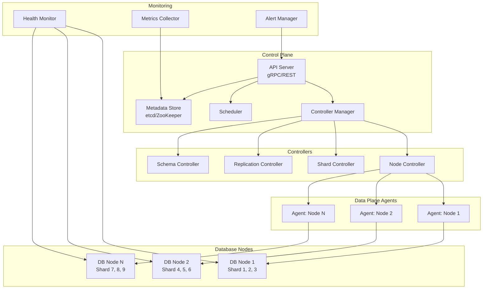
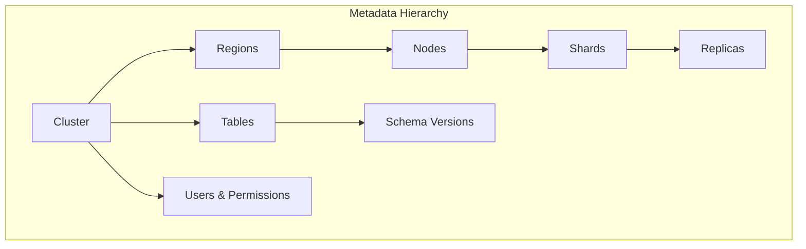
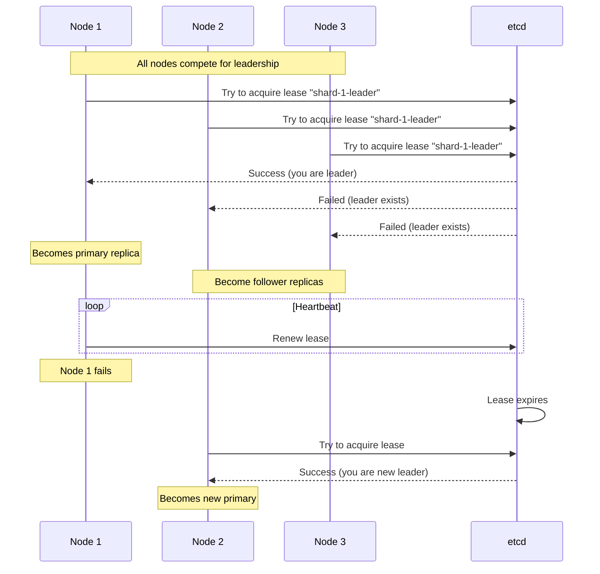
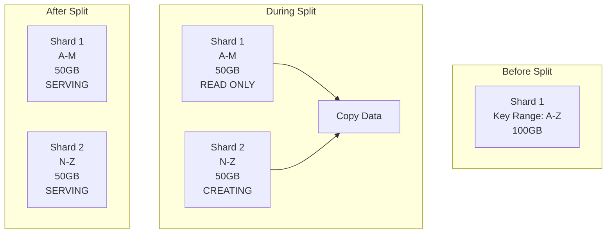
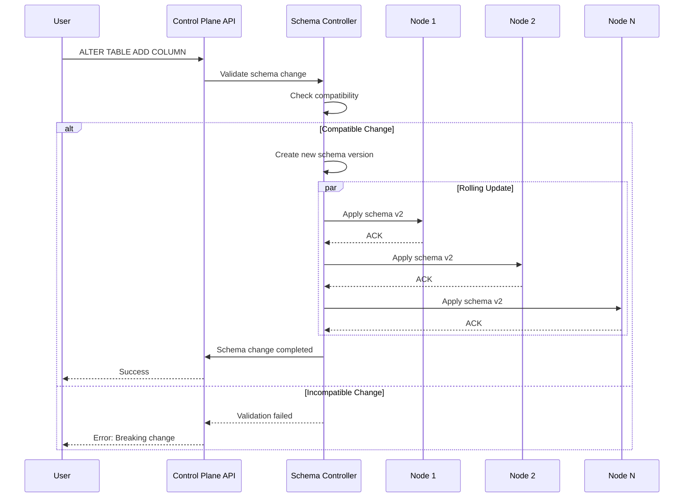

# Control Plane for a Distributed Database

[← Back to Topics](../topics.md#control-plane-for-a-distributed-database-like-vitess-cockroachdb)

## Problem Statement

Design a control plane for a distributed SQL database that manages cluster membership, schema changes, rebalancing, and failure recovery across global deployments.

---

## Requirements

### Functional Requirements
1. **Cluster Management**: Add/remove nodes, manage topology
2. **Schema Evolution**: Rolling schema changes without downtime
3. **Shard Management**: Split, merge, and rebalance shards
4. **Failure Detection**: Detect and recover from node failures
5. **Leader Election**: Elect leaders for shards/regions
6. **Configuration Management**: Centralized configuration store
7. **Metadata Management**: Track shards, replicas, schema versions
8. **Health Monitoring**: Monitor cluster health
9. **Rolling Upgrades**: Upgrade software without downtime

### Non-Functional Requirements
1. **High Availability**: 99.999% uptime (5 nines)
2. **Strong Consistency**: For metadata operations
3. **Low Latency**: <50ms for control plane operations
4. **Scalability**: Support 1000+ nodes globally
5. **Fault Tolerance**: Survive datacenter failures
6. **Auditability**: Track all control plane operations

### Scale Estimates
- **Nodes**: 1,000 database nodes
- **Shards**: 10,000 shards
- **Regions**: 10 geographic regions
- **Tables**: 10,000 tables
- **Operations/sec**: 1,000 control plane operations/sec

---

## High-Level Architecture



---

## Detailed Design

### 1. Metadata Store



#### Metadata Schema

```protobuf
// cluster_metadata.proto

message Cluster {
    string cluster_id = 1;
    string name = 2;
    ClusterConfig config = 3;
    repeated Region regions = 4;
    int64 created_at = 5;
    int64 updated_at = 6;
}

message Region {
    string region_id = 1;
    string name = 2;  // us-east, eu-west, etc.
    repeated Node nodes = 3;
    RegionStatus status = 4;
}

message Node {
    string node_id = 1;
    string hostname = 2;
    string ip_address = 3;
    int32 port = 4;
    NodeStatus status = 5;  // ONLINE, OFFLINE, DRAINING
    repeated Shard shards = 6;
    ResourceInfo resources = 7;
    int64 heartbeat_timestamp = 8;
}

message Shard {
    string shard_id = 1;
    string table_name = 2;
    KeyRange key_range = 3;
    repeated Replica replicas = 4;
    string primary_replica_id = 5;
    ShardStatus status = 6;  // SERVING, SPLITTING, MERGING
    int64 size_bytes = 7;
}

message Replica {
    string replica_id = 1;
    string node_id = 2;
    ReplicaType type = 3;  // PRIMARY, SECONDARY, WITNESS
    ReplicaStatus status = 4;  // ONLINE, CATCHING_UP, FAILED
    int64 lag_ms = 5;
}

message Table {
    string table_name = 1;
    Schema current_schema = 2;
    repeated Schema schema_history = 3;
    ShardingConfig sharding = 4;
    ReplicationConfig replication = 5;
}

message Schema {
    int32 version = 1;
    repeated Column columns = 2;
    repeated Index indexes = 3;
    int64 created_at = 4;
}

enum NodeStatus {
    ONLINE = 0;
    OFFLINE = 1;
    DRAINING = 2;
    MAINTENANCE = 3;
}

enum ShardStatus {
    SERVING = 0;
    SPLITTING = 1;
    MERGING = 2;
    MIGRATING = 3;
    FAILED = 4;
}
```

#### Metadata Store Implementation (etcd)

```go
package controlplane

import (
    "context"
    "encoding/json"
    "go.etcd.io/etcd/client/v3"
    "time"
)

type MetadataStore struct {
    client *clientv3.Client
}

func NewMetadataStore(endpoints []string) (*MetadataStore, error) {
    cli, err := clientv3.New(clientv3.Config{
        Endpoints:   endpoints,
        DialTimeout: 5 * time.Second,
    })
    
    if err != nil {
        return nil, err
    }
    
    return &MetadataStore{client: cli}, nil
}

// Node operations
func (m *MetadataStore) RegisterNode(ctx context.Context, node *Node) error {
    key := fmt.Sprintf("/cluster/nodes/%s", node.NodeID)
    value, _ := json.Marshal(node)
    
    // Use lease for node registration (heartbeat-based)
    lease, err := m.client.Grant(ctx, 30) // 30 second TTL
    if err != nil {
        return err
    }
    
    _, err = m.client.Put(ctx, key, string(value), clientv3.WithLease(lease.ID))
    return err
}

func (m *MetadataStore) GetNode(ctx context.Context, nodeID string) (*Node, error) {
    key := fmt.Sprintf("/cluster/nodes/%s", nodeID)
    resp, err := m.client.Get(ctx, key)
    
    if err != nil {
        return nil, err
    }
    
    if len(resp.Kvs) == 0 {
        return nil, fmt.Errorf("node not found: %s", nodeID)
    }
    
    var node Node
    err = json.Unmarshal(resp.Kvs[0].Value, &node)
    return &node, err
}

func (m *MetadataStore) ListNodes(ctx context.Context) ([]*Node, error) {
    resp, err := m.client.Get(ctx, "/cluster/nodes/", clientv3.WithPrefix())
    
    if err != nil {
        return nil, err
    }
    
    var nodes []*Node
    for _, kv := range resp.Kvs {
        var node Node
        if err := json.Unmarshal(kv.Value, &node); err == nil {
            nodes = append(nodes, &node)
        }
    }
    
    return nodes, nil
}

// Shard operations
func (m *MetadataStore) CreateShard(ctx context.Context, shard *Shard) error {
    key := fmt.Sprintf("/cluster/shards/%s", shard.ShardID)
    value, _ := json.Marshal(shard)
    
    // Use transaction for atomic creation
    txn := m.client.Txn(ctx)
    txn.If(clientv3.Compare(clientv3.Version(key), "=", 0))
    txn.Then(clientv3.OpPut(key, string(value)))
    
    resp, err := txn.Commit()
    if err != nil {
        return err
    }
    
    if !resp.Succeeded {
        return fmt.Errorf("shard already exists: %s", shard.ShardID)
    }
    
    return nil
}

func (m *MetadataStore) UpdateShard(ctx context.Context, shard *Shard) error {
    key := fmt.Sprintf("/cluster/shards/%s", shard.ShardID)
    value, _ := json.Marshal(shard)
    
    _, err := m.client.Put(ctx, key, string(value))
    return err
}

// Watch for changes
func (m *MetadataStore) WatchNodes(ctx context.Context) clientv3.WatchChan {
    return m.client.Watch(ctx, "/cluster/nodes/", clientv3.WithPrefix())
}

func (m *MetadataStore) WatchShards(ctx context.Context) clientv3.WatchChan {
    return m.client.Watch(ctx, "/cluster/shards/", clientv3.WithPrefix())
}
```

---

### 2. Leader Election



#### Leader Election Implementation

```go
package election

import (
    "context"
    "go.etcd.io/etcd/client/v3/concurrency"
)

type LeaderElection struct {
    session  *concurrency.Session
    election *concurrency.Election
}

func NewLeaderElection(
    client *clientv3.Client,
    electionKey string,
) (*LeaderElection, error) {
    // Create session with TTL
    session, err := concurrency.NewSession(client, concurrency.WithTTL(10))
    if err != nil {
        return nil, err
    }
    
    election := concurrency.NewElection(session, electionKey)
    
    return &LeaderElection{
        session:  session,
        election: election,
    }, nil
}

func (l *LeaderElection) Campaign(ctx context.Context, nodeID string) error {
    // Try to become leader
    return l.election.Campaign(ctx, nodeID)
}

func (l *LeaderElection) Resign(ctx context.Context) error {
    // Resign leadership
    return l.election.Resign(ctx)
}

func (l *LeaderElection) IsLeader(ctx context.Context, nodeID string) (bool, error) {
    leader, err := l.election.Leader(ctx)
    if err != nil {
        return false, err
    }
    
    return string(leader.Kvs[0].Value) == nodeID, nil
}

func (l *LeaderElection) ObserveLeader(ctx context.Context) <-chan string {
    ch := make(chan string)
    
    go func() {
        defer close(ch)
        
        for {
            select {
            case <-ctx.Done():
                return
            default:
                leader, err := l.election.Leader(ctx)
                if err == nil && len(leader.Kvs) > 0 {
                    ch <- string(leader.Kvs[0].Value)
                }
                
                // Watch for leader changes
                watchCh := l.election.Observe(ctx)
                for resp := range watchCh {
                    if len(resp.Kvs) > 0 {
                        ch <- string(resp.Kvs[0].Value)
                    }
                }
            }
        }
    }()
    
    return ch
}

// Example usage
func (n *Node) BecomeShardLeader(shardID string) {
    electionKey := fmt.Sprintf("/shard-leaders/%s", shardID)
    
    election, err := NewLeaderElection(n.etcdClient, electionKey)
    if err != nil {
        log.Fatal(err)
    }
    
    // Campaign for leadership
    ctx := context.Background()
    if err := election.Campaign(ctx, n.nodeID); err != nil {
        log.Printf("Failed to become leader: %v", err)
        return
    }
    
    log.Printf("Became leader for shard %s", shardID)
    
    // Promote replica to primary
    n.promoteReplicaToPrimary(shardID)
    
    // Keep heartbeat
    go n.maintainLeadership(election)
}
```

---

### 3. Shard Splitting



#### Shard Splitting Algorithm

```python
from enum import Enum
from dataclasses import dataclass
import asyncio

class SplitPhase(Enum):
    PREPARING = "preparing"
    COPYING = "copying"
    CATCHING_UP = "catching_up"
    SWITCHING = "switching"
    COMPLETED = "completed"

@dataclass
class ShardSplitOperation:
    source_shard_id: str
    target_shard_1_id: str
    target_shard_2_id: str
    split_key: str
    phase: SplitPhase
    progress: float

class ShardSplitter:
    """
    Shard splitting with online operation
    """
    
    def __init__(self, metadata_store, replication_service):
        self.metadata = metadata_store
        self.replication = replication_service
    
    async def split_shard(
        self,
        shard_id: str,
        split_key: str
    ) -> tuple[str, str]:
        """
        Split a shard into two at the given key
        
        Steps:
        1. Prepare: Create target shards
        2. Copy: Copy data to target shards
        3. Catch up: Apply incremental changes
        4. Switch: Atomically switch traffic
        5. Cleanup: Delete source shard
        """
        
        # Get source shard metadata
        source_shard = await self.metadata.get_shard(shard_id)
        
        # Phase 1: Prepare
        target_1, target_2 = await self.prepare_split(source_shard, split_key)
        
        # Phase 2: Copy initial data
        await self.copy_data(source_shard, target_1, target_2, split_key)
        
        # Phase 3: Catch up with incremental changes
        await self.catch_up(source_shard, target_1, target_2)
        
        # Phase 4: Switch traffic (atomic)
        await self.switch_traffic(source_shard, target_1, target_2)
        
        # Phase 5: Cleanup
        await self.cleanup(source_shard)
        
        return target_1.shard_id, target_2.shard_id
    
    async def prepare_split(
        self,
        source_shard: Shard,
        split_key: str
    ) -> tuple[Shard, Shard]:
        """Prepare target shards"""
        
        # Create shard 1: [start_key, split_key)
        target_1 = Shard(
            shard_id=self.generate_shard_id(),
            table_name=source_shard.table_name,
            key_range=KeyRange(
                start=source_shard.key_range.start,
                end=split_key
            ),
            status=ShardStatus.CREATING
        )
        
        # Create shard 2: [split_key, end_key)
        target_2 = Shard(
            shard_id=self.generate_shard_id(),
            table_name=source_shard.table_name,
            key_range=KeyRange(
                start=split_key,
                end=source_shard.key_range.end
            ),
            status=ShardStatus.CREATING
        )
        
        # Create metadata
        await self.metadata.create_shard(target_1)
        await self.metadata.create_shard(target_2)
        
        # Allocate replicas
        await self.allocate_replicas(target_1, source_shard.replicas)
        await self.allocate_replicas(target_2, source_shard.replicas)
        
        return target_1, target_2
    
    async def copy_data(
        self,
        source: Shard,
        target_1: Shard,
        target_2: Shard,
        split_key: str
    ):
        """Copy data from source to targets"""
        
        # Set source to READ_ONLY mode
        await self.metadata.update_shard_status(
            source.shard_id,
            ShardStatus.SPLITTING
        )
        
        # Take snapshot of source
        snapshot_id = await self.create_snapshot(source)
        
        # Copy snapshot to targets in parallel
        await asyncio.gather(
            self.copy_snapshot_range(
                snapshot_id,
                target_1,
                source.key_range.start,
                split_key
            ),
            self.copy_snapshot_range(
                snapshot_id,
                target_2,
                split_key,
                source.key_range.end
            )
        )
        
        # Release snapshot
        await self.delete_snapshot(snapshot_id)
    
    async def catch_up(
        self,
        source: Shard,
        target_1: Shard,
        target_2: Shard
    ):
        """Apply incremental changes during copy"""
        
        # Get changes since snapshot
        changes = await self.get_incremental_changes(source)
        
        # Apply changes to appropriate target
        for change in changes:
            if change.key < target_1.key_range.end:
                await self.apply_change(target_1, change)
            else:
                await self.apply_change(target_2, change)
        
        # Verify targets are caught up
        await self.verify_data_consistency(source, target_1, target_2)
    
    async def switch_traffic(
        self,
        source: Shard,
        target_1: Shard,
        target_2: Shard
    ):
        """Atomically switch traffic to new shards"""
        
        # Update routing table atomically
        routing_update = {
            'remove': [source.shard_id],
            'add': [target_1.shard_id, target_2.shard_id]
        }
        
        await self.metadata.atomic_routing_update(routing_update)
        
        # Update shard statuses
        await self.metadata.update_shard_status(
            target_1.shard_id,
            ShardStatus.SERVING
        )
        await self.metadata.update_shard_status(
            target_2.shard_id,
            ShardStatus.SERVING
        )
        
        # Wait for propagation
        await asyncio.sleep(5)
    
    async def cleanup(self, source: Shard):
        """Cleanup source shard"""
        
        # Mark source as deprecated
        await self.metadata.update_shard_status(
            source.shard_id,
            ShardStatus.DEPRECATED
        )
        
        # Wait for in-flight requests to drain
        await asyncio.sleep(30)
        
        # Delete source shard data
        for replica in source.replicas:
            await self.delete_replica_data(replica)
        
        # Remove metadata
        await self.metadata.delete_shard(source.shard_id)
```

---

### 4. Schema Evolution



#### Schema Change Implementation

```go
package schema

import (
    "context"
    "fmt"
)

type SchemaChange struct {
    TableName     string
    OldVersion    int
    NewVersion    int
    ChangeType    SchemaChangeType
    DDL           string
    IsBackwardCompatible bool
}

type SchemaChangeType int

const (
    AddColumn SchemaChangeType = iota
    DropColumn
    ModifyColumn
    AddIndex
    DropIndex
)

type SchemaController struct {
    metadata *MetadataStore
}

func (s *SchemaController) ApplySchemaChange(
    ctx context.Context,
    change *SchemaChange,
) error {
    // Step 1: Validate
    if err := s.validateSchemaChange(change); err != nil {
        return fmt.Errorf("validation failed: %w", err)
    }
    
    // Step 2: Check compatibility
    if !change.IsBackwardCompatible {
        return fmt.Errorf("breaking schema change not allowed")
    }
    
    // Step 3: Create new schema version
    newSchema := s.createNewSchemaVersion(change)
    
    // Step 4: Apply to all nodes in rolling fashion
    nodes, err := s.metadata.ListNodes(ctx)
    if err != nil {
        return err
    }
    
    // Apply to nodes one by one
    for _, node := range nodes {
        if err := s.applyToNode(ctx, node, newSchema); err != nil {
            // Rollback
            s.rollback(ctx, nodes, change)
            return err
        }
        
        // Wait and verify
        time.Sleep(5 * time.Second)
        if err := s.verifySchemaOnNode(ctx, node, newSchema); err != nil {
            s.rollback(ctx, nodes, change)
            return err
        }
    }
    
    // Step 5: Update metadata
    return s.metadata.UpdateTableSchema(ctx, change.TableName, newSchema)
}

func (s *SchemaController) validateSchemaChange(change *SchemaChange) error {
    switch change.ChangeType {
    case AddColumn:
        // Adding column is safe if it has a default or is nullable
        return nil
    
    case DropColumn:
        // Dropping column requires two-phase:
        // 1. Stop using the column
        // 2. Actually drop it
        return fmt.Errorf("drop column requires two-phase process")
    
    case ModifyColumn:
        // Check if modification is compatible
        // e.g., widening type is safe, narrowing is not
        return s.validateColumnModification(change)
    
    default:
        return nil
    }
}

func (s *SchemaController) applyToNode(
    ctx context.Context,
    node *Node,
    schema *Schema,
) error {
    // Send schema change DDL to node
    client := s.getNodeClient(node)
    
    return client.ExecuteDDL(ctx, schema.DDL)
}

func (s *SchemaController) rollback(
    ctx context.Context,
    nodes []*Node,
    change *SchemaChange,
) error {
    // Rollback schema change on all nodes
    for _, node := range nodes {
        // Execute rollback DDL
        s.applyToNode(ctx, node, change.OldSchema)
    }
    
    return nil
}
```

---

### 5. Rebalancing

```python
class LoadBalancer:
    """
    Rebalance shards across nodes for even distribution
    """
    
    def __init__(self, metadata_store):
        self.metadata = metadata_store
        self.target_imbalance_ratio = 0.1  # 10% tolerance
    
    async def rebalance_cluster(self):
        """
        Rebalance shards across cluster
        
        Goals:
        - Even data distribution
        - Even load distribution
        - Minimize data movement
        """
        
        # Get current state
        nodes = await self.metadata.list_nodes()
        shards = await self.metadata.list_shards()
        
        # Calculate current distribution
        distribution = self.calculate_distribution(nodes, shards)
        
        # Check if rebalancing is needed
        if not self.needs_rebalancing(distribution):
            return
        
        # Generate rebalancing plan
        plan = self.generate_plan(distribution)
        
        # Execute plan
        await self.execute_plan(plan)
    
    def calculate_distribution(self, nodes, shards):
        """Calculate current shard distribution"""
        
        node_loads = {}
        
        for node in nodes:
            node_loads[node.node_id] = {
                'shard_count': 0,
                'data_size': 0,
                'shards': []
            }
        
        for shard in shards:
            for replica in shard.replicas:
                if replica.type == ReplicaType.PRIMARY:
                    node_id = replica.node_id
                    node_loads[node_id]['shard_count'] += 1
                    node_loads[node_id]['data_size'] += shard.size_bytes
                    node_loads[node_id]['shards'].append(shard)
        
        return node_loads
    
    def needs_rebalancing(self, distribution):
        """Check if cluster needs rebalancing"""
        
        if not distribution:
            return False
        
        # Calculate average load
        avg_shards = sum(d['shard_count'] for d in distribution.values()) / len(distribution)
        avg_size = sum(d['data_size'] for d in distribution.values()) / len(distribution)
        
        # Check for imbalance
        for node_load in distribution.values():
            shard_ratio = node_load['shard_count'] / avg_shards if avg_shards > 0 else 0
            size_ratio = node_load['data_size'] / avg_size if avg_size > 0 else 0
            
            # If any node is >10% off balance, rebalance
            if (abs(shard_ratio - 1.0) > self.target_imbalance_ratio or
                abs(size_ratio - 1.0) > self.target_imbalance_ratio):
                return True
        
        return False
    
    def generate_plan(self, distribution):
        """
        Generate rebalancing plan
        
        Use greedy algorithm:
        - Move shards from most loaded nodes to least loaded nodes
        """
        
        plan = []
        
        # Sort nodes by load
        sorted_nodes = sorted(
            distribution.items(),
            key=lambda x: x[1]['data_size'],
            reverse=True
        )
        
        # Calculate target load per node
        total_size = sum(d['data_size'] for d in distribution.values())
        target_size = total_size / len(distribution)
        
        # Generate moves
        for source_node_id, source_load in sorted_nodes:
            if source_load['data_size'] <= target_size:
                break
            
            # Find target node (least loaded)
            target_node_id, target_load = min(
                distribution.items(),
                key=lambda x: x[1]['data_size']
            )
            
            # Select shard to move
            shard = self.select_shard_to_move(source_load['shards'])
            
            plan.append({
                'shard_id': shard.shard_id,
                'from_node': source_node_id,
                'to_node': target_node_id
            })
            
            # Update virtual distribution
            source_load['data_size'] -= shard.size_bytes
            target_load['data_size'] += shard.size_bytes
        
        return plan
    
    async def execute_plan(self, plan):
        """Execute rebalancing plan"""
        
        for move in plan:
            await self.move_shard(
                move['shard_id'],
                move['from_node'],
                move['to_node']
            )
    
    async def move_shard(self, shard_id, from_node, to_node):
        """
        Move shard from one node to another
        
        Steps:
        1. Add replica on target node
        2. Wait for replication to catch up
        3. Promote target replica to primary
        4. Remove replica from source node
        """
        
        # Add replica on target
        await self.add_replica(shard_id, to_node)
        
        # Wait for catch-up
        await self.wait_for_replica_sync(shard_id, to_node)
        
        # Promote to primary
        await self.promote_replica(shard_id, to_node)
        
        # Remove old replica
        await self.remove_replica(shard_id, from_node)
```

---

### 6. Failure Detection and Recovery

```python
class FailureDetector:
    """
    Detect node failures and trigger recovery
    """
    
    def __init__(self, metadata_store):
        self.metadata = metadata_store
        self.heartbeat_timeout = 30  # seconds
    
    async def monitor_cluster(self):
        """Continuously monitor cluster health"""
        
        while True:
            nodes = await self.metadata.list_nodes()
            
            for node in nodes:
                if await self.is_node_failed(node):
                    await self.handle_node_failure(node)
            
            await asyncio.sleep(5)
    
    async def is_node_failed(self, node):
        """Check if node has failed"""
        
        now = time.time()
        last_heartbeat = node.heartbeat_timestamp
        
        return (now - last_heartbeat) > self.heartbeat_timeout
    
    async def handle_node_failure(self, failed_node):
        """Handle node failure"""
        
        # Mark node as failed
        await self.metadata.update_node_status(
            failed_node.node_id,
            NodeStatus.FAILED
        )
        
        # Get all shards on failed node
        shards = await self.metadata.get_shards_on_node(failed_node.node_id)
        
        # Recover each shard
        for shard in shards:
            await self.recover_shard(shard, failed_node)
    
    async def recover_shard(self, shard, failed_node):
        """
        Recover shard after node failure
        
        If primary failed:
        - Elect new primary from secondaries
        - Add new secondary for replication factor
        
        If secondary failed:
        - Add new secondary on healthy node
        """
        
        # Find which replica failed
        failed_replica = None
        for replica in shard.replicas:
            if replica.node_id == failed_node.node_id:
                failed_replica = replica
                break
        
        if failed_replica.type == ReplicaType.PRIMARY:
            # Primary failed - elect new primary
            await self.elect_new_primary(shard)
        
        # Add replacement replica
        await self.add_replacement_replica(shard, failed_replica)
```

---

## Technology Stack

| Component | Technology | Justification |
|-----------|------------|---------------|
| **Metadata Store** | etcd, ZooKeeper | Distributed consensus |
| **Leader Election** | Raft, Paxos | Consensus algorithms |
| **RPC** | gRPC | High-performance RPC |
| **Serialization** | Protobuf | Efficient encoding |
| **Monitoring** | Prometheus + Grafana | Metrics and visualization |

---

## Summary

This design provides:
- ✅ **1000+ node** distributed database management
- ✅ **99.999% availability** with automatic failover
- ✅ **Online operations** (schema changes, splits, rebalancing)
- ✅ **Strong consistency** for metadata operations
- ✅ **Global deployments** with multi-region support

**Key Innovations:**
1. etcd-based metadata store for consistency
2. Raft-based leader election per shard
3. Online shard splitting without downtime
4. Rolling schema changes with compatibility checks
5. Automated rebalancing and failure recovery

[← Back to Topics](../topics.md#control-plane-for-a-distributed-database-like-vitess-cockroachdb)
