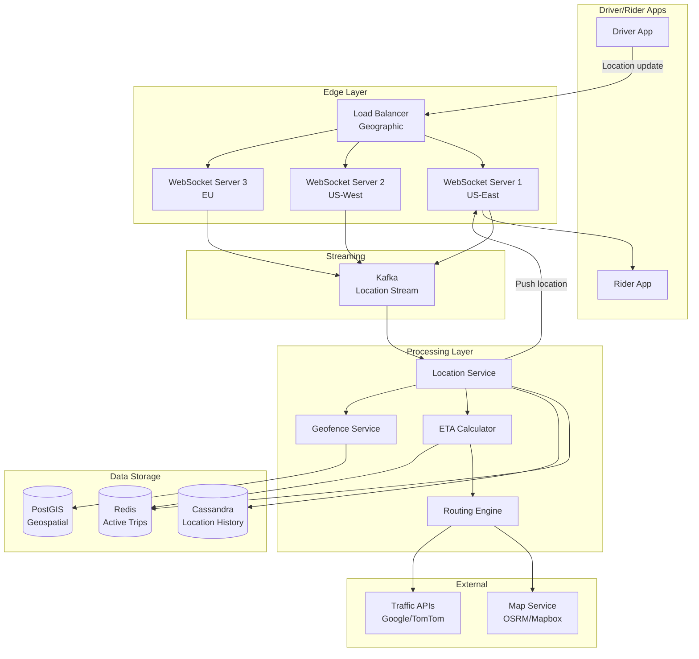
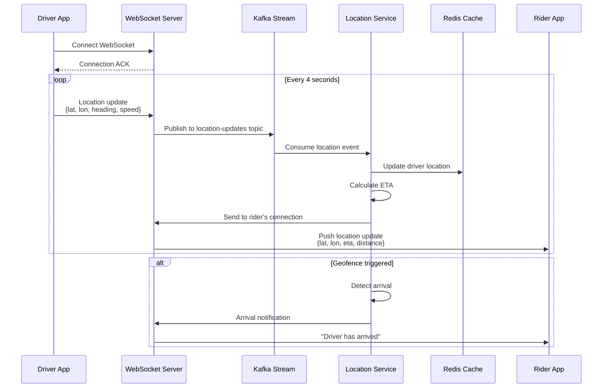
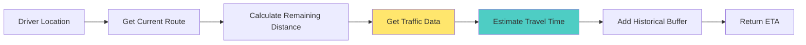
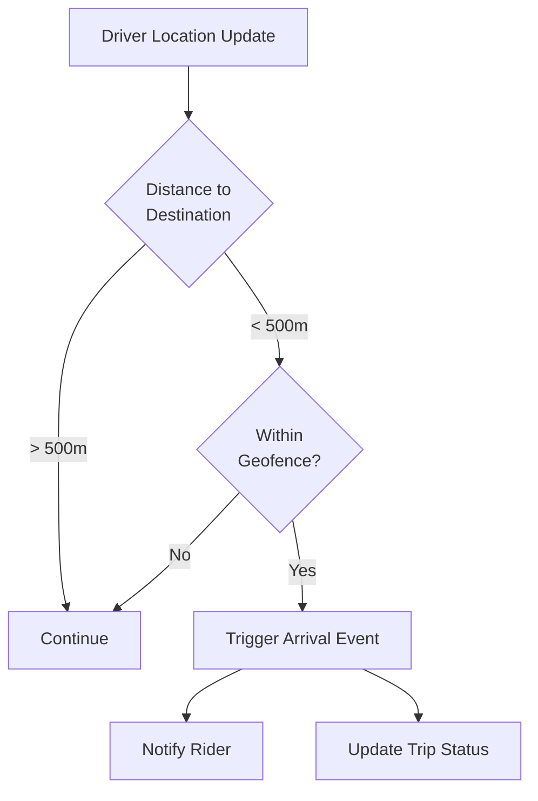

# ETA and Live Location Sharing Between Driver and Rider

[← Back to Topics](../topics.md#eta-and-live-location-sharing-between-driver-and-rider)

## Problem Statement

Design a system for real-time location tracking and ETA calculation for 1M concurrent trips. Update locations every 4 seconds, recalculate ETA based on traffic conditions, and ensure sub-second latency for location updates.

---

## Requirements

### Functional Requirements
1. **Real-Time Location Updates**: Drivers send location every 4 seconds
2. **Location Broadcasting**: Share driver location with matched rider
3. **ETA Calculation**: Compute time to pickup/dropoff
4. **Route Optimization**: Adjust route based on traffic
5. **Location History**: Store trip path for 30 days
6. **Geofencing**: Detect arrival at pickup/dropoff
7. **Privacy Controls**: Hide exact location when trip ends
8. **Offline Handling**: Queue updates when network unavailable

### Non-Functional Requirements
1. **Throughput**: 1M concurrent trips × 0.25 updates/sec = **250K location updates/second**
2. **Latency**: <500ms for location updates, <2s for ETA recalculation
3. **Accuracy**: ±10 meters for location, ±2 minutes for ETA
4. **Scalability**: Handle 10M+ daily trips
5. **Availability**: 99.99% uptime
6. **Battery Efficiency**: Optimize GPS usage

### Scale Estimates
- **Concurrent trips**: 1M
- **Location updates**: 250K/second
- **Update frequency**: Every 4 seconds
- **Avg trip duration**: 20 minutes
- **Daily location updates**: 250K/s × 86,400s = **21.6 billion/day**
- **Storage (30 days)**: 21.6B × 30 days × 100 bytes ≈ **65 TB**

---

## High-Level Architecture



---

## Detailed Design

### 1. Location Update Protocol



---

### 2. WebSocket Connection Management

```python
import asyncio
import json
from dataclasses import dataclass
from typing import Dict, Set
import time

@dataclass
class Connection:
    user_id: str
    user_type: str  # 'driver' or 'rider'
    trip_id: str
    websocket: object  # WebSocket connection
    last_activity: float
    
class WebSocketConnectionManager:
    """
    Manage WebSocket connections for drivers and riders
    """
    
    def __init__(self):
        # Active connections
        self.connections: Dict[str, Connection] = {}
        
        # Trip mappings for quick lookup
        self.trip_to_driver: Dict[str, str] = {}  # trip_id -> driver_user_id
        self.trip_to_rider: Dict[str, str] = {}   # trip_id -> rider_user_id
        
        # Connection pools per server
        self.server_connections: Dict[str, Set[str]] = {}
    
    async def connect(
        self,
        user_id: str,
        user_type: str,
        trip_id: str,
        websocket: object
    ):
        """Register new WebSocket connection"""
        
        connection = Connection(
            user_id=user_id,
            user_type=user_type,
            trip_id=trip_id,
            websocket=websocket,
            last_activity=time.time()
        )
        
        self.connections[user_id] = connection
        
        # Map trip to user
        if user_type == 'driver':
            self.trip_to_driver[trip_id] = user_id
        else:
            self.trip_to_rider[trip_id] = user_id
        
        print(f"Connected: {user_type} {user_id} for trip {trip_id}")
    
    async def disconnect(self, user_id: str):
        """Remove WebSocket connection"""
        
        if user_id not in self.connections:
            return
        
        connection = self.connections[user_id]
        trip_id = connection.trip_id
        
        # Remove mappings
        if connection.user_type == 'driver':
            self.trip_to_driver.pop(trip_id, None)
        else:
            self.trip_to_rider.pop(trip_id, None)
        
        del self.connections[user_id]
        
        print(f"Disconnected: {user_id}")
    
    async def send_to_user(self, user_id: str, message: dict):
        """Send message to specific user"""
        
        if user_id not in self.connections:
            return False
        
        connection = self.connections[user_id]
        
        try:
            await connection.websocket.send(json.dumps(message))
            connection.last_activity = time.time()
            return True
        except Exception as e:
            print(f"Error sending to {user_id}: {e}")
            await self.disconnect(user_id)
            return False
    
    async def send_to_trip(self, trip_id: str, message: dict):
        """Send message to all users in a trip"""
        
        # Send to driver
        driver_id = self.trip_to_driver.get(trip_id)
        if driver_id:
            await self.send_to_user(driver_id, message)
        
        # Send to rider
        rider_id = self.trip_to_rider.get(trip_id)
        if rider_id:
            await self.send_to_user(rider_id, message)
    
    async def broadcast_location(
        self,
        trip_id: str,
        driver_location: dict,
        eta_seconds: int
    ):
        """Broadcast driver location to rider"""
        
        rider_id = self.trip_to_rider.get(trip_id)
        
        if not rider_id:
            return
        
        message = {
            'type': 'location_update',
            'trip_id': trip_id,
            'location': {
                'lat': driver_location['lat'],
                'lon': driver_location['lon'],
                'heading': driver_location.get('heading', 0),
                'speed': driver_location.get('speed', 0)
            },
            'eta_seconds': eta_seconds,
            'timestamp': time.time()
        }
        
        await self.send_to_user(rider_id, message)
    
    async def heartbeat_monitor(self):
        """
        Monitor connections and close stale ones
        Run as background task
        """
        
        timeout = 30  # 30 seconds
        
        while True:
            await asyncio.sleep(10)
            
            now = time.time()
            stale_connections = []
            
            for user_id, connection in self.connections.items():
                if now - connection.last_activity > timeout:
                    stale_connections.append(user_id)
            
            for user_id in stale_connections:
                print(f"Closing stale connection: {user_id}")
                await self.disconnect(user_id)


# FastAPI WebSocket endpoint
from fastapi import FastAPI, WebSocket, WebSocketDisconnect

app = FastAPI()
manager = WebSocketConnectionManager()

@app.websocket("/ws/location/{trip_id}/{user_id}/{user_type}")
async def location_websocket(
    websocket: WebSocket,
    trip_id: str,
    user_id: str,
    user_type: str
):
    await websocket.accept()
    await manager.connect(user_id, user_type, trip_id, websocket)
    
    try:
        while True:
            # Receive location from driver
            data = await websocket.receive_text()
            message = json.loads(data)
            
            if message['type'] == 'location':
                # Process location update
                await process_location_update(trip_id, user_id, message)
            
            elif message['type'] == 'ping':
                # Heartbeat
                await websocket.send(json.dumps({'type': 'pong'}))
    
    except WebSocketDisconnect:
        await manager.disconnect(user_id)
```

---

### 3. Location Processing Service

```go
package location

import (
    "context"
    "encoding/json"
    "fmt"
    "time"
    
    "github.com/go-redis/redis/v8"
    "github.com/segmentio/kafka-go"
)

type LocationUpdate struct {
    TripID    string    `json:"trip_id"`
    DriverID  string    `json:"driver_id"`
    Lat       float64   `json:"lat"`
    Lon       float64   `json:"lon"`
    Heading   float64   `json:"heading"`
    Speed     float64   `json:"speed"`
    Accuracy  float64   `json:"accuracy"`
    Timestamp time.Time `json:"timestamp"`
}

type LocationService struct {
    kafka         *kafka.Reader
    redis         *redis.Client
    etaCalculator *ETACalculator
    geofence      *GeofenceService
}

func NewLocationService(
    kafkaBrokers []string,
    redisClient *redis.Client,
) *LocationService {
    reader := kafka.NewReader(kafka.ReaderConfig{
        Brokers:     kafkaBrokers,
        Topic:       "location-updates",
        GroupID:     "location-processor",
        MinBytes:    1024,      // 1KB
        MaxBytes:    10485760,  // 10MB
        MaxWait:     100 * time.Millisecond,
    })
    
    return &LocationService{
        kafka:         reader,
        redis:         redisClient,
        etaCalculator: NewETACalculator(redisClient),
        geofence:      NewGeofenceService(redisClient),
    }
}

func (s *LocationService) Start(ctx context.Context) error {
    for {
        select {
        case <-ctx.Done():
            return ctx.Err()
        default:
            s.processLocationUpdates(ctx)
        }
    }
}

func (s *LocationService) processLocationUpdates(ctx context.Context) {
    // Read batch of location updates
    msg, err := s.kafka.ReadMessage(ctx)
    if err != nil {
        return
    }
    
    var location LocationUpdate
    err = json.Unmarshal(msg.Value, &location)
    if err != nil {
        return
    }
    
    // 1. Update driver location in Redis
    err = s.updateDriverLocation(ctx, &location)
    if err != nil {
        fmt.Printf("Error updating location: %v\n", err)
        return
    }
    
    // 2. Calculate ETA
    eta, distance, err := s.etaCalculator.Calculate(ctx, location.TripID)
    if err != nil {
        fmt.Printf("Error calculating ETA: %v\n", err)
    }
    
    // 3. Check geofences
    arrived, err := s.geofence.CheckArrival(ctx, &location)
    if err == nil && arrived {
        s.notifyArrival(ctx, location.TripID)
    }
    
    // 4. Store in time-series DB (Cassandra)
    s.storeLocationHistory(ctx, &location)
    
    // 5. Broadcast to rider (via WebSocket)
    s.broadcastToRider(ctx, location.TripID, &location, eta, distance)
}

func (s *LocationService) updateDriverLocation(
    ctx context.Context,
    location *LocationUpdate,
) error {
    // Store in Redis with TTL
    key := fmt.Sprintf("trip:%s:driver_location", location.TripID)
    
    data := map[string]interface{}{
        "lat":       location.Lat,
        "lon":       location.Lon,
        "heading":   location.Heading,
        "speed":     location.Speed,
        "accuracy":  location.Accuracy,
        "timestamp": location.Timestamp.Unix(),
    }
    
    err := s.redis.HSet(ctx, key, data).Err()
    if err != nil {
        return err
    }
    
    // Set TTL (24 hours)
    s.redis.Expire(ctx, key, 24*time.Hour)
    
    // Update geospatial index
    geoKey := "drivers:locations"
    s.redis.GeoAdd(ctx, geoKey, &redis.GeoLocation{
        Name:      location.DriverID,
        Longitude: location.Lon,
        Latitude:  location.Lat,
    })
    
    return nil
}

func (s *LocationService) storeLocationHistory(
    ctx context.Context,
    location *LocationUpdate,
) error {
    // Store in Cassandra for analytics
    // CQL: INSERT INTO location_history (trip_id, timestamp, lat, lon, ...)
    // This would use gocql driver in production
    return nil
}

func (s *LocationService) broadcastToRider(
    ctx context.Context,
    tripID string,
    location *LocationUpdate,
    etaSeconds int,
    distanceMeters float64,
) error {
    // Get rider's WebSocket connection ID
    riderConnKey := fmt.Sprintf("trip:%s:rider_connection", tripID)
    connID, err := s.redis.Get(ctx, riderConnKey).Result()
    
    if err != nil {
        return err
    }
    
    // Publish to rider's connection (via pub/sub or direct push)
    message := map[string]interface{}{
        "type":            "location_update",
        "trip_id":         tripID,
        "lat":             location.Lat,
        "lon":             location.Lon,
        "heading":         location.Heading,
        "speed":           location.Speed,
        "eta_seconds":     etaSeconds,
        "distance_meters": distanceMeters,
        "timestamp":       location.Timestamp,
    }
    
    data, _ := json.Marshal(message)
    
    // Publish to WebSocket server via Redis pub/sub
    channel := fmt.Sprintf("ws:push:%s", connID)
    s.redis.Publish(ctx, channel, data)
    
    return nil
}
```

---

### 4. ETA Calculation



#### ETA Calculator Implementation

```python
import math
import time
from typing import Tuple, Optional
import requests

class ETACalculator:
    """
    Calculate ETA considering:
    - Remaining distance
    - Current traffic
    - Historical patterns
    - Time of day
    """
    
    def __init__(self, redis_client, routing_service_url: str):
        self.redis = redis_client
        self.routing_service = routing_service_url
        self.default_speed_kmh = 40  # Default speed
    
    def calculate_eta(
        self,
        trip_id: str,
        driver_location: Tuple[float, float],
        destination: Tuple[float, float]
    ) -> Tuple[int, float]:
        """
        Calculate ETA in seconds and remaining distance in meters
        
        Returns: (eta_seconds, distance_meters)
        """
        
        # 1. Get optimal route
        route = self.get_route(driver_location, destination)
        
        if not route:
            # Fallback to straight-line distance
            distance = self.haversine_distance(
                driver_location[0], driver_location[1],
                destination[0], destination[1]
            )
            eta = self.estimate_time(distance, self.default_speed_kmh)
            return eta, distance
        
        # 2. Get route distance and duration
        distance_meters = route['distance']
        base_duration = route['duration']
        
        # 3. Apply traffic multiplier
        traffic_factor = self.get_traffic_factor(trip_id, route)
        adjusted_duration = base_duration * traffic_factor
        
        # 4. Apply historical buffer (add 10% for safety)
        historical_buffer = self.get_historical_buffer(
            driver_location,
            destination,
            time.localtime().tm_hour
        )
        
        final_eta = int(adjusted_duration * (1 + historical_buffer))
        
        return final_eta, distance_meters
    
    def get_route(
        self,
        origin: Tuple[float, float],
        destination: Tuple[float, float]
    ) -> Optional[dict]:
        """
        Get route from routing service (OSRM/Google Maps)
        """
        
        try:
            # Call OSRM routing service
            url = f"{self.routing_service}/route/v1/driving/{origin[1]},{origin[0]};{destination[1]},{destination[0]}"
            params = {
                'overview': 'full',
                'geometries': 'geojson',
                'steps': 'true'
            }
            
            response = requests.get(url, params=params, timeout=2)
            data = response.json()
            
            if data['code'] != 'Ok':
                return None
            
            route = data['routes'][0]
            
            return {
                'distance': route['distance'],  # meters
                'duration': route['duration'],  # seconds
                'geometry': route['geometry'],
                'steps': route['legs'][0]['steps']
            }
        
        except Exception as e:
            print(f"Routing error: {e}")
            return None
    
    def get_traffic_factor(
        self,
        trip_id: str,
        route: dict
    ) -> float:
        """
        Get traffic multiplier from live traffic data
        
        Returns multiplier: 1.0 (no traffic) to 2.0 (heavy traffic)
        """
        
        # Check cache first
        cache_key = f"traffic:factor:{trip_id}"
        cached = self.redis.get(cache_key)
        
        if cached:
            return float(cached)
        
        # Calculate traffic factor from route segments
        # In production, integrate with Google Traffic API or TomTom
        
        # For now, simple time-of-day heuristic
        hour = time.localtime().tm_hour
        
        if 7 <= hour <= 9 or 17 <= hour <= 19:
            # Rush hour
            factor = 1.5
        elif 10 <= hour <= 16:
            # Midday
            factor = 1.2
        else:
            # Off-peak
            factor = 1.0
        
        # Cache for 2 minutes
        self.redis.setex(cache_key, 120, str(factor))
        
        return factor
    
    def get_historical_buffer(
        self,
        origin: Tuple[float, float],
        destination: Tuple[float, float],
        hour: int
    ) -> float:
        """
        Get historical accuracy buffer
        
        Returns buffer percentage: 0.1 = 10% buffer
        """
        
        # Query historical data
        # For simplicity, return fixed buffer
        return 0.10  # 10% buffer
    
    def haversine_distance(
        self,
        lat1: float,
        lon1: float,
        lat2: float,
        lon2: float
    ) -> float:
        """
        Calculate straight-line distance in meters
        """
        
        R = 6371000  # Earth radius in meters
        
        phi1 = math.radians(lat1)
        phi2 = math.radians(lat2)
        delta_phi = math.radians(lat2 - lat1)
        delta_lambda = math.radians(lon2 - lon1)
        
        a = (math.sin(delta_phi / 2) ** 2 +
             math.cos(phi1) * math.cos(phi2) *
             math.sin(delta_lambda / 2) ** 2)
        
        c = 2 * math.atan2(math.sqrt(a), math.sqrt(1 - a))
        
        return R * c
    
    def estimate_time(self, distance_meters: float, speed_kmh: float) -> int:
        """Estimate time in seconds"""
        return int((distance_meters / 1000) / speed_kmh * 3600)
```

---

### 5. Geofencing for Arrival Detection



#### Geofence Service

```python
from typing import Tuple
import math

class GeofenceService:
    """
    Detect when driver arrives at pickup/dropoff location
    """
    
    def __init__(self, redis_client):
        self.redis = redis_client
        self.arrival_radius_meters = 100  # 100m threshold
    
    def check_arrival(
        self,
        trip_id: str,
        driver_location: Tuple[float, float]
    ) -> bool:
        """
        Check if driver has arrived at destination
        
        Returns True if within geofence
        """
        
        # Get trip destination
        trip_key = f"trip:{trip_id}:destination"
        dest_data = self.redis.hgetall(trip_key)
        
        if not dest_data:
            return False
        
        dest_lat = float(dest_data[b'lat'])
        dest_lon = float(dest_data[b'lon'])
        
        # Calculate distance
        distance = self.haversine_distance(
            driver_location[0], driver_location[1],
            dest_lat, dest_lon
        )
        
        # Check if already notified
        notified_key = f"trip:{trip_id}:arrival_notified"
        already_notified = self.redis.get(notified_key)
        
        if already_notified:
            return False
        
        # Within geofence?
        if distance <= self.arrival_radius_meters:
            # Mark as notified
            self.redis.setex(notified_key, 3600, '1')  # 1 hour TTL
            return True
        
        return False
    
    def haversine_distance(
        self,
        lat1: float,
        lon1: float,
        lat2: float,
        lon2: float
    ) -> float:
        """Calculate distance in meters"""
        
        R = 6371000  # Earth radius in meters
        
        phi1 = math.radians(lat1)
        phi2 = math.radians(lat2)
        delta_phi = math.radians(lat2 - lat1)
        delta_lambda = math.radians(lon2 - lon1)
        
        a = (math.sin(delta_phi / 2) ** 2 +
             math.cos(phi1) * math.cos(phi2) *
             math.sin(delta_lambda / 2) ** 2)
        
        c = 2 * math.atan2(math.sqrt(a), math.sqrt(1 - a))
        
        return R * c
```

---

### 6. Battery Optimization

```python
class BatteryOptimizedLocationTracker:
    """
    Optimize location updates for battery life
    """
    
    def __init__(self):
        self.update_intervals = {
            'trip_active_moving': 4,      # 4 seconds
            'trip_active_stationary': 10,  # 10 seconds
            'waiting_for_rider': 8,        # 8 seconds
            'idle': 30                     # 30 seconds
        }
    
    def get_update_interval(
        self,
        trip_status: str,
        is_moving: bool,
        battery_level: float
    ) -> int:
        """
        Determine optimal update interval
        
        Factors:
        - Trip status
        - Movement
        - Battery level
        """
        
        # Base interval
        if trip_status == 'in_trip':
            interval = self.update_intervals['trip_active_moving'] if is_moving else self.update_intervals['trip_active_stationary']
        elif trip_status == 'waiting':
            interval = self.update_intervals['waiting_for_rider']
        else:
            interval = self.update_intervals['idle']
        
        # Adjust for low battery
        if battery_level < 0.20:  # < 20%
            interval *= 2  # Double interval
        elif battery_level < 0.10:  # < 10%
            interval *= 4  # Quadruple interval
        
        return interval
```

---

## Technology Stack

| Component | Technology | Justification |
|-----------|------------|---------------|
| **WebSocket** | FastAPI + uvicorn | Async Python, high performance |
| **Streaming** | Apache Kafka | Durable location event stream |
| **Cache** | Redis | Fast location lookups, pub/sub |
| **Geospatial** | PostGIS | Advanced spatial queries |
| **Time-Series** | Cassandra | High-write throughput |
| **Routing** | OSRM | Open-source routing engine |
| **Traffic Data** | Google Maps API | Real-time traffic |

---

## Performance Optimizations

### 1. Connection Pooling
```
WebSocket servers: 100 servers × 10K connections = 1M concurrent
```

### 2. Geographic Routing
```
Route clients to nearest edge server
US-East, US-West, EU, Asia
```

### 3. Redis Geospatial Index
```redis
GEOADD drivers:locations -122.4194 37.7749 driver_123
GEORADIUS drivers:locations -122.4194 37.7749 5 km
```

---

## Trade-offs

### 1. Update Frequency vs Battery
- **4-second updates**: Smooth tracking, high battery drain
- **10-second updates**: Battery-friendly, choppy animation

### 2. ETA Accuracy vs Latency
- **Real-time traffic**: Accurate, slower (API calls)
- **Cached traffic**: Fast, less accurate

### 3. WebSocket vs Polling
- **WebSocket**: Real-time, persistent connections
- **Polling**: Simple, higher latency, more bandwidth

---

## Summary

This design provides:
- ✅ **250K location updates/second** throughput
- ✅ **<500ms location update** latency
- ✅ **Real-time ETA** with traffic awareness
- ✅ **Geofencing** for arrival detection
- ✅ **Battery-optimized** location tracking
- ✅ **99.99% availability** with multi-region

**Key Features:**
1. WebSocket for real-time bidirectional communication
2. Kafka for durable location event streaming
3. Redis for fast active trip state
4. Cassandra for location history
5. OSRM for fast routing
6. PostGIS for geofencing

[← Back to Topics](../topics.md#eta-and-live-location-sharing-between-driver-and-rider)
