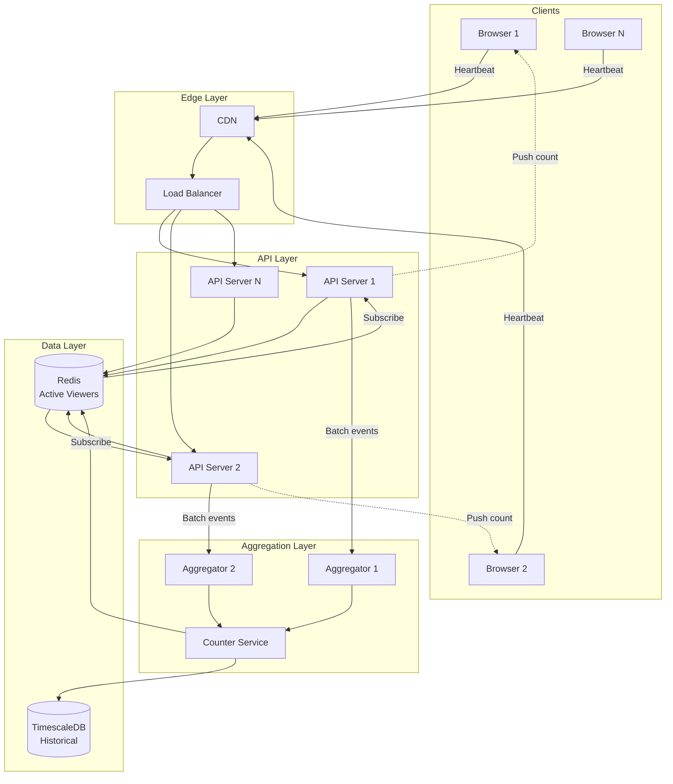
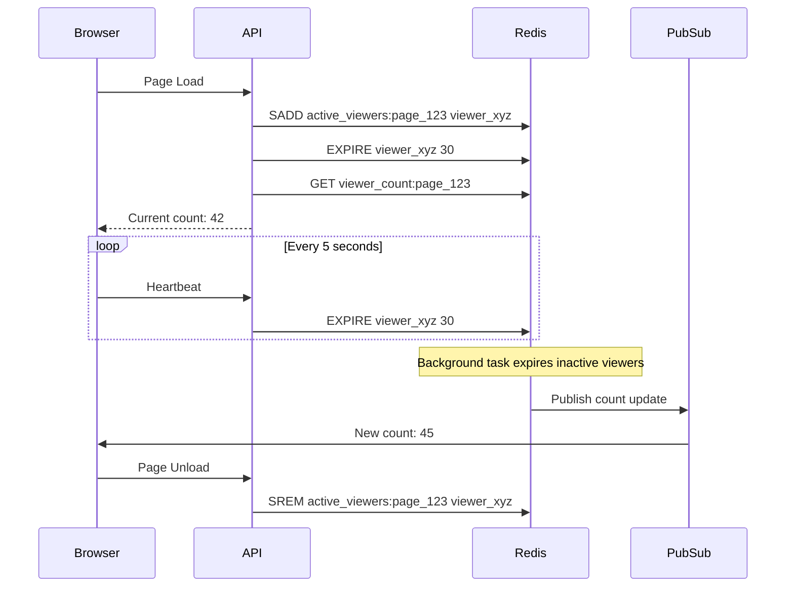
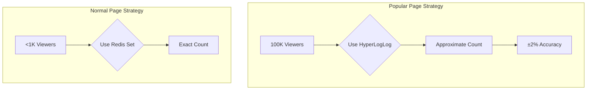

# Showing Live Viewer Count on a Page

[← Back to Topics](../topics.md#showing-live-viewer-count-on-a-page)

## Problem Statement

Design a system to display real-time viewer count for web pages (e.g., product pages, live streams, articles) handling 10M concurrent viewers across 1M pages with <1 second update latency.

---

## Requirements

### Functional Requirements
1. **Track Active Viewers**: Count users currently viewing a page
2. **Real-Time Updates**: Update count every 1-5 seconds
3. **Viewer Timeout**: Remove inactive viewers after 30 seconds
4. **Anonymous Support**: Track without user accounts
5. **Aggregation**: Show total count across page variants
6. **Historical Data**: Store peak viewer counts
7. **Rate Limiting**: Prevent count manipulation
8. **Privacy**: Don't expose individual viewer identity

### Non-Functional Requirements
1. **Scale**: 10M concurrent viewers across 1M pages
2. **Latency**: <1 second for count updates
3. **Accuracy**: ±5% accuracy acceptable (eventual consistency)
4. **High Availability**: 99.9% uptime
5. **Low Overhead**: Minimal client/server resource usage
6. **Cost-Efficient**: Optimize for high read volume

### Scale Estimates
- **Concurrent viewers**: 10M
- **Active pages**: 1M
- **Avg viewers per page**: 10M / 1M = 10
- **Popular pages**: Up to 100K viewers
- **Heartbeat frequency**: Every 5 seconds
- **Heartbeat events/sec**: 10M / 5 = **2M events/second**

---

## High-Level Architecture



---

## Detailed Design

### 1. Client-Side Tracking



#### JavaScript Client

```javascript
class ViewerCountTracker {
    constructor(pageId) {
        this.pageId = pageId;
        this.viewerId = this.generateViewerId();
        this.heartbeatInterval = 5000;  // 5 seconds
        this.heartbeatTimer = null;
        this.eventSource = null;
    }
    
    generateViewerId() {
        // Generate unique viewer ID
        // Use session ID or generate random UUID
        return `viewer_${Date.now()}_${Math.random().toString(36).substr(2, 9)}`;
    }
    
    async start() {
        // 1. Join page (register viewer)
        await this.joinPage();
        
        // 2. Start heartbeat
        this.startHeartbeat();
        
        // 3. Listen for count updates (Server-Sent Events)
        this.listenForUpdates();
        
        // 4. Handle page unload
        window.addEventListener('beforeunload', () => this.stop());
        
        // 5. Handle visibility change (tab inactive)
        document.addEventListener('visibilitychange', () => {
            if (document.hidden) {
                this.pauseHeartbeat();
            } else {
                this.resumeHeartbeat();
            }
        });
    }
    
    async joinPage() {
        try {
            const response = await fetch('/api/viewer-count/join', {
                method: 'POST',
                headers: { 'Content-Type': 'application/json' },
                body: JSON.stringify({
                    page_id: this.pageId,
                    viewer_id: this.viewerId
                })
            });
            
            const data = await response.json();
            this.updateCount(data.viewer_count);
        } catch (error) {
            console.error('Failed to join page:', error);
        }
    }
    
    async leavePage() {
        try {
            // Use sendBeacon for reliable delivery on page unload
            const data = JSON.stringify({
                page_id: this.pageId,
                viewer_id: this.viewerId
            });
            
            navigator.sendBeacon('/api/viewer-count/leave', data);
        } catch (error) {
            console.error('Failed to leave page:', error);
        }
    }
    
    startHeartbeat() {
        this.heartbeatTimer = setInterval(() => {
            this.sendHeartbeat();
        }, this.heartbeatInterval);
    }
    
    pauseHeartbeat() {
        if (this.heartbeatTimer) {
            clearInterval(this.heartbeatTimer);
            this.heartbeatTimer = null;
        }
    }
    
    resumeHeartbeat() {
        if (!this.heartbeatTimer) {
            this.startHeartbeat();
            this.sendHeartbeat();  // Send immediately
        }
    }
    
    async sendHeartbeat() {
        try {
            await fetch('/api/viewer-count/heartbeat', {
                method: 'POST',
                headers: { 'Content-Type': 'application/json' },
                body: JSON.stringify({
                    page_id: this.pageId,
                    viewer_id: this.viewerId
                }),
                keepalive: true  // Allow requests after page unload
            });
        } catch (error) {
            console.error('Heartbeat failed:', error);
        }
    }
    
    listenForUpdates() {
        // Server-Sent Events for real-time count updates
        this.eventSource = new EventSource(
            `/api/viewer-count/stream/${this.pageId}`
        );
        
        this.eventSource.addEventListener('count_update', (event) => {
            const data = JSON.parse(event.data);
            this.updateCount(data.viewer_count);
        });
        
        this.eventSource.addEventListener('error', (error) => {
            console.error('SSE error:', error);
            
            // Reconnect after delay
            setTimeout(() => {
                this.listenForUpdates();
            }, 5000);
        });
    }
    
    updateCount(count) {
        // Update UI
        const countElement = document.getElementById('viewer-count');
        if (countElement) {
            countElement.textContent = this.formatCount(count);
        }
    }
    
    formatCount(count) {
        // Format large numbers (1.2K, 10K, 1M)
        if (count >= 1000000) {
            return (count / 1000000).toFixed(1) + 'M';
        } else if (count >= 1000) {
            return (count / 1000).toFixed(1) + 'K';
        } else {
            return count.toString();
        }
    }
    
    stop() {
        // Stop heartbeat
        this.pauseHeartbeat();
        
        // Close SSE connection
        if (this.eventSource) {
            this.eventSource.close();
        }
        
        // Leave page
        this.leavePage();
    }
}

// Usage
const tracker = new ViewerCountTracker('product_123');
tracker.start();
```

---

### 2. Backend Viewer Tracking Service

```python
from dataclasses import dataclass
from typing import Set, Optional
import time
import redis
import asyncio

@dataclass
class ViewerSession:
    viewer_id: str
    page_id: str
    joined_at: float
    last_heartbeat: float

class ViewerCountService:
    """
    Track active viewers per page using Redis
    """
    
    def __init__(self, redis_client: redis.Redis):
        self.redis = redis_client
        self.viewer_timeout = 30  # seconds
        self.batch_size = 1000
        
        # Lua scripts for atomic operations
        self._register_join_script()
    
    def _register_join_script(self):
        """Pre-register Lua script for atomic join operation"""
        
        self.join_script = self.redis.register_script("""
            local page_key = KEYS[1]
            local viewer_id = ARGV[1]
            local ttl = ARGV[2]
            local now = ARGV[3]
            
            -- Add viewer to set
            redis.call('SADD', page_key, viewer_id)
            
            -- Set viewer metadata
            local viewer_key = 'viewer:' .. viewer_id
            redis.call('HSET', viewer_key, 'last_heartbeat', now)
            redis.call('EXPIRE', viewer_key, ttl)
            
            -- Get current count
            local count = redis.call('SCARD', page_key)
            
            return count
        """)
    
    def join_page(self, page_id: str, viewer_id: str) -> int:
        """
        Register viewer joining a page
        
        Returns current viewer count
        """
        
        page_key = f"active_viewers:{page_id}"
        now = time.time()
        
        # Execute Lua script atomically
        count = self.join_script(
            keys=[page_key],
            args=[viewer_id, self.viewer_timeout, now]
        )
        
        # Publish count update
        self._publish_count_update(page_id, count)
        
        return count
    
    def leave_page(self, page_id: str, viewer_id: str) -> int:
        """
        Remove viewer from page
        
        Returns updated viewer count
        """
        
        page_key = f"active_viewers:{page_id}"
        
        # Remove from set
        self.redis.srem(page_key, viewer_id)
        
        # Delete viewer metadata
        viewer_key = f"viewer:{viewer_id}"
        self.redis.delete(viewer_key)
        
        # Get updated count
        count = self.redis.scard(page_key)
        
        # Publish count update
        self._publish_count_update(page_id, count)
        
        return count
    
    def heartbeat(self, page_id: str, viewer_id: str):
        """
        Update viewer's last heartbeat time
        """
        
        viewer_key = f"viewer:{viewer_id}"
        now = time.time()
        
        # Update last heartbeat
        self.redis.hset(viewer_key, 'last_heartbeat', now)
        
        # Refresh TTL
        self.redis.expire(viewer_key, self.viewer_timeout)
    
    def get_viewer_count(self, page_id: str) -> int:
        """Get current viewer count for page"""
        
        page_key = f"active_viewers:{page_id}"
        return self.redis.scard(page_key)
    
    def _publish_count_update(self, page_id: str, count: int):
        """Publish count update to subscribers"""
        
        channel = f"viewer_count:{page_id}"
        message = {
            'page_id': page_id,
            'viewer_count': count,
            'timestamp': time.time()
        }
        
        self.redis.publish(channel, str(message))
    
    async def cleanup_inactive_viewers(self):
        """
        Background task to remove inactive viewers
        Run every 10 seconds
        """
        
        while True:
            await asyncio.sleep(10)
            
            try:
                # Scan all page keys
                cursor = 0
                while True:
                    cursor, keys = self.redis.scan(
                        cursor,
                        match='active_viewers:*',
                        count=100
                    )
                    
                    for key in keys:
                        await self._cleanup_page_viewers(key.decode('utf-8'))
                    
                    if cursor == 0:
                        break
            
            except Exception as e:
                print(f"Cleanup error: {e}")
    
    async def _cleanup_page_viewers(self, page_key: str):
        """Remove inactive viewers from a page"""
        
        # Get all viewers for page
        viewer_ids = self.redis.smembers(page_key)
        
        if not viewer_ids:
            return
        
        now = time.time()
        inactive_viewers = []
        
        # Check each viewer's last heartbeat
        for viewer_id in viewer_ids:
            viewer_key = f"viewer:{viewer_id.decode('utf-8')}"
            last_heartbeat = self.redis.hget(viewer_key, 'last_heartbeat')
            
            if not last_heartbeat:
                # No metadata, remove viewer
                inactive_viewers.append(viewer_id)
                continue
            
            # Check if timed out
            if now - float(last_heartbeat) > self.viewer_timeout:
                inactive_viewers.append(viewer_id)
        
        # Remove inactive viewers
        if inactive_viewers:
            self.redis.srem(page_key, *inactive_viewers)
            
            # Update count
            page_id = page_key.split(':')[1]
            count = self.redis.scard(page_key)
            self._publish_count_update(page_id, count)
```

---

### 3. Aggregation for Popular Pages



#### HyperLogLog for Popular Pages

```python
class ScalableViewerCounter:
    """
    Use HyperLogLog for pages with high viewer count
    """
    
    def __init__(self, redis_client: redis.Redis):
        self.redis = redis_client
        self.threshold = 1000  # Switch to HyperLogLog above this
    
    def add_viewer(self, page_id: str, viewer_id: str) -> int:
        """
        Add viewer using appropriate data structure
        """
        
        # Check current count
        count_key = f"viewer_count:{page_id}"
        current_count = self.redis.get(count_key)
        
        if current_count and int(current_count) > self.threshold:
            # Use HyperLogLog for popular pages
            return self._add_viewer_hll(page_id, viewer_id)
        else:
            # Use Set for normal pages
            return self._add_viewer_set(page_id, viewer_id)
    
    def _add_viewer_set(self, page_id: str, viewer_id: str) -> int:
        """Add viewer using Redis Set (exact count)"""
        
        set_key = f"active_viewers:{page_id}"
        self.redis.sadd(set_key, viewer_id)
        
        count = self.redis.scard(set_key)
        
        # Update count cache
        count_key = f"viewer_count:{page_id}"
        self.redis.set(count_key, count, ex=60)
        
        return count
    
    def _add_viewer_hll(self, page_id: str, viewer_id: str) -> int:
        """Add viewer using HyperLogLog (approximate count)"""
        
        hll_key = f"viewers_hll:{page_id}"
        self.redis.pfadd(hll_key, viewer_id)
        
        # Get approximate count
        count = self.redis.pfcount(hll_key)
        
        # Update count cache
        count_key = f"viewer_count:{page_id}"
        self.redis.set(count_key, count, ex=60)
        
        return count
    
    def migrate_to_hll(self, page_id: str):
        """Migrate from Set to HyperLogLog when threshold reached"""
        
        set_key = f"active_viewers:{page_id}"
        hll_key = f"viewers_hll:{page_id}"
        
        # Get all viewers from set
        viewers = self.redis.smembers(set_key)
        
        # Add to HyperLogLog
        if viewers:
            self.redis.pfadd(hll_key, *viewers)
        
        # Delete set
        self.redis.delete(set_key)
```

---

### 4. API Implementation (FastAPI)

```python
from fastapi import FastAPI, Response
from fastapi.responses import StreamingResponse
import asyncio
import json

app = FastAPI()
viewer_service = ViewerCountService(redis_client)

@app.post("/api/viewer-count/join")
async def join_page(request: dict):
    """Viewer joins a page"""
    
    page_id = request['page_id']
    viewer_id = request['viewer_id']
    
    count = viewer_service.join_page(page_id, viewer_id)
    
    return {
        'viewer_count': count,
        'viewer_id': viewer_id
    }

@app.post("/api/viewer-count/leave")
async def leave_page(request: dict):
    """Viewer leaves a page"""
    
    page_id = request['page_id']
    viewer_id = request['viewer_id']
    
    count = viewer_service.leave_page(page_id, viewer_id)
    
    return {'viewer_count': count}

@app.post("/api/viewer-count/heartbeat")
async def heartbeat(request: dict):
    """Viewer heartbeat"""
    
    page_id = request['page_id']
    viewer_id = request['viewer_id']
    
    viewer_service.heartbeat(page_id, viewer_id)
    
    return {'status': 'ok'}

@app.get("/api/viewer-count/{page_id}")
async def get_count(page_id: str):
    """Get current viewer count"""
    
    count = viewer_service.get_viewer_count(page_id)
    
    return {'viewer_count': count}

@app.get("/api/viewer-count/stream/{page_id}")
async def stream_count(page_id: str):
    """Server-Sent Events stream for count updates"""
    
    async def event_stream():
        # Subscribe to Redis pub/sub
        pubsub = redis_client.pubsub()
        channel = f"viewer_count:{page_id}"
        pubsub.subscribe(channel)
        
        try:
            while True:
                message = pubsub.get_message(ignore_subscribe_messages=True)
                
                if message and message['type'] == 'message':
                    data = eval(message['data'].decode('utf-8'))
                    
                    # Send SSE event
                    yield f"event: count_update\n"
                    yield f"data: {json.dumps(data)}\n\n"
                
                await asyncio.sleep(0.1)
        
        finally:
            pubsub.unsubscribe()
    
    return StreamingResponse(
        event_stream(),
        media_type='text/event-stream'
    )
```

---

## Technology Stack

| Component | Technology | Justification |
|-----------|------------|---------------|
| **Cache** | Redis | Sets, HyperLogLog, Pub/Sub |
| **API** | FastAPI | Async, SSE support |
| **Time-Series** | TimescaleDB | Historical analytics |
| **CDN** | CloudFlare | Edge caching |

---

## Performance Characteristics

### Memory Usage
```
Normal page (Set): 1000 viewers × 40 bytes = 40 KB
Popular page (HyperLogLog): 12 KB (regardless of count)

1M pages × 40 KB = 40 GB (manageable)
```

### Redis Operations
```
Join: SADD (O(1))
Leave: SREM (O(1))
Count: SCARD (O(1))
Heartbeat: HSET + EXPIRE (O(1))
```

---

## Trade-offs

### 1. Accuracy vs Scalability
- **Exact count (Set)**: Accurate, memory intensive
- **Approximate (HyperLogLog)**: ±2% accuracy, constant memory

### 2. Update Frequency
- **1-second updates**: Real-time, high load
- **5-second updates**: Reduced load, acceptable delay

### 3. Delivery Method
- **Server-Sent Events**: Efficient for read-only
- **WebSocket**: Bidirectional, more overhead

---

## Summary

This design provides:
- ✅ **2M heartbeats/second** throughput
- ✅ **<1 second** update latency
- ✅ **10M concurrent viewers** supported
- ✅ **±5% accuracy** with HyperLogLog
- ✅ **Low overhead** with batching
- ✅ **Auto cleanup** of inactive viewers

**Key Features:**
1. Redis Sets for exact counts
2. HyperLogLog for popular pages
3. Server-Sent Events for real-time updates
4. Heartbeat mechanism with TTL
5. Background cleanup of inactive viewers
6. Pub/Sub for count distribution

[← Back to Topics](../topics.md#showing-live-viewer-count-on-a-page)
