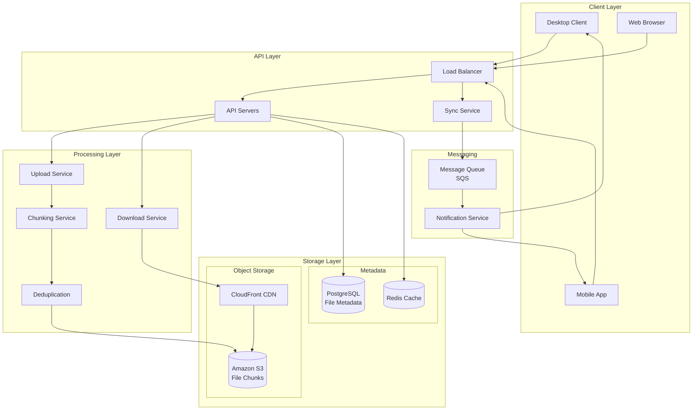
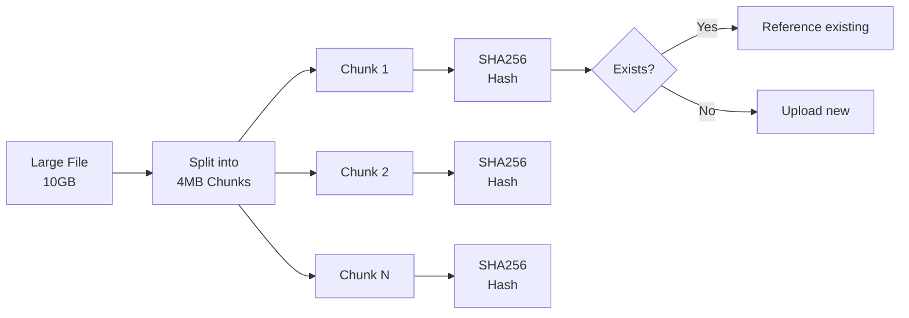
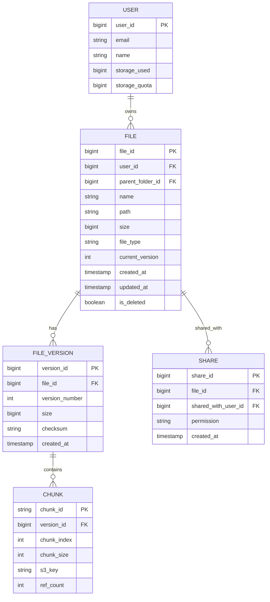
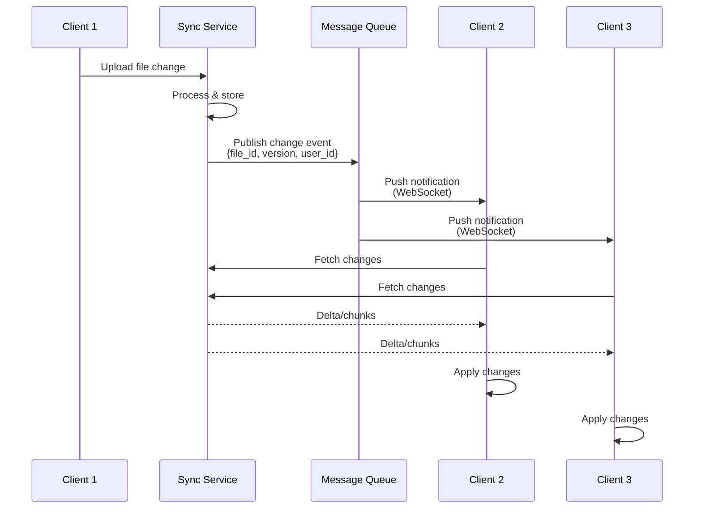

# Cloud File Storage System (Dropbox/Google Drive)

[← Back to Topics](../topics.md#cloud-file-storage-system-like-dropboxgoogle-drive)

## Problem Statement

Design a cloud file storage and synchronization service supporting 500M users, handling file uploads/downloads, real-time syncing across devices, file sharing, and version history.

---

## Requirements

### Functional Requirements
1. **File Upload/Download**: Support files up to 10GB
2. **Real-Time Sync**: Sync changes across all devices
3. **File Sharing**: Share files/folders with users
4. **Version History**: Keep last 30 versions
5. **Conflict Resolution**: Handle concurrent edits
6. **Offline Mode**: Queue changes when offline
7. **Selective Sync**: Choose which folders to sync
8. **Desktop/Mobile Clients**: Native apps for all platforms

### Non-Functional Requirements
1. **Storage**: Support petabytes of data
2. **Throughput**: Handle 1M concurrent uploads
3. **Availability**: 99.9% uptime
4. **Durability**: 99.999999999% (11 nines)
5. **Bandwidth Optimization**: Delta sync, deduplication
6. **Latency**: <200ms for metadata operations

### Scale Estimates
- **Users**: 500M
- **Avg files per user**: 1,000 files
- **Avg file size**: 1MB
- **Total storage**: 500M × 1GB ≈ **500 PB**
- **Daily active users**: 100M
- **Peak upload rate**: 1M concurrent
- **Bandwidth**: 10 Gbps aggregate

---

## High-Level Architecture



---

## Detailed Design

### 1. File Chunking and Deduplication



#### Chunking Service

```python
import hashlib
import os
from typing import List, Dict
from dataclasses import dataclass

@dataclass
class Chunk:
    chunk_id: str  # SHA256 hash
    offset: int
    size: int
    data: bytes = None

class FileChunker:
    """
    Split files into chunks for efficient storage and sync
    """
    
    def __init__(self, chunk_size: int = 4 * 1024 * 1024):  # 4MB
        self.chunk_size = chunk_size
    
    def chunk_file(self, file_path: str) -> List[Chunk]:
        """
        Split file into fixed-size chunks
        
        Returns list of chunks with hashes
        """
        
        chunks = []
        offset = 0
        
        with open(file_path, 'rb') as f:
            while True:
                data = f.read(self.chunk_size)
                
                if not data:
                    break
                
                # Calculate chunk hash
                chunk_hash = hashlib.sha256(data).hexdigest()
                
                chunk = Chunk(
                    chunk_id=chunk_hash,
                    offset=offset,
                    size=len(data),
                    data=data
                )
                
                chunks.append(chunk)
                offset += len(data)
        
        return chunks
    
    def chunk_file_rolling(self, file_path: str) -> List[Chunk]:
        """
        Content-defined chunking using rolling hash (Rabin fingerprinting)
        
        Benefits:
        - Better deduplication for modified files
        - Chunk boundaries based on content, not position
        """
        
        chunks = []
        window_size = 48  # Rabin window
        
        with open(file_path, 'rb') as f:
            chunk_data = bytearray()
            offset = 0
            
            while True:
                byte = f.read(1)
                
                if not byte:
                    # Last chunk
                    if chunk_data:
                        chunk_hash = hashlib.sha256(chunk_data).hexdigest()
                        chunks.append(Chunk(
                            chunk_id=chunk_hash,
                            offset=offset,
                            size=len(chunk_data),
                            data=bytes(chunk_data)
                        ))
                    break
                
                chunk_data.extend(byte)
                
                # Check if chunk boundary (using simplified rolling hash)
                if len(chunk_data) >= self.chunk_size or \
                   self._is_chunk_boundary(chunk_data[-window_size:]):
                    
                    chunk_hash = hashlib.sha256(chunk_data).hexdigest()
                    chunks.append(Chunk(
                        chunk_id=chunk_hash,
                        offset=offset,
                        size=len(chunk_data),
                        data=bytes(chunk_data)
                    ))
                    
                    offset += len(chunk_data)
                    chunk_data = bytearray()
        
        return chunks
    
    def _is_chunk_boundary(self, window: bytes) -> bool:
        """Check if window represents a chunk boundary"""
        
        if len(window) < 8:
            return False
        
        # Simple check: last 13 bits are zero (average 8KB chunks)
        hash_value = int.from_bytes(window[-8:], 'little')
        return (hash_value & 0x1FFF) == 0
    
    def reconstruct_file(
        self,
        chunks: List[Chunk],
        output_path: str
    ):
        """Reconstruct file from chunks"""
        
        with open(output_path, 'wb') as f:
            for chunk in sorted(chunks, key=lambda c: c.offset):
                f.write(chunk.data)


class DeduplicationService:
    """
    Track chunk hashes to avoid duplicate storage
    """
    
    def __init__(self, storage_client, metadata_db):
        self.storage = storage_client
        self.metadata = metadata_db
        self.chunk_cache = {}  # In-memory cache
    
    def upload_chunk(self, chunk: Chunk) -> str:
        """
        Upload chunk with deduplication
        
        Returns chunk_id (hash)
        """
        
        chunk_id = chunk.chunk_id
        
        # Check if chunk already exists
        if self._chunk_exists(chunk_id):
            print(f"Chunk {chunk_id} already exists, skipping upload")
            
            # Increment reference count
            self._increment_chunk_ref(chunk_id)
            
            return chunk_id
        
        # Upload new chunk to S3
        s3_key = f"chunks/{chunk_id}"
        self.storage.put_object(
            key=s3_key,
            body=chunk.data
        )
        
        # Store metadata
        self._store_chunk_metadata(chunk_id, chunk.size)
        
        return chunk_id
    
    def _chunk_exists(self, chunk_id: str) -> bool:
        """Check if chunk exists in storage"""
        
        # Check cache first
        if chunk_id in self.chunk_cache:
            return True
        
        # Check database
        result = self.metadata.query(
            "SELECT chunk_id FROM chunks WHERE chunk_id = %s",
            (chunk_id,)
        )
        
        exists = len(result) > 0
        
        if exists:
            self.chunk_cache[chunk_id] = True
        
        return exists
    
    def _increment_chunk_ref(self, chunk_id: str):
        """Increment reference count for existing chunk"""
        
        self.metadata.execute(
            "UPDATE chunks SET ref_count = ref_count + 1 WHERE chunk_id = %s",
            (chunk_id,)
        )
    
    def _store_chunk_metadata(self, chunk_id: str, size: int):
        """Store chunk metadata"""
        
        self.metadata.execute(
            "INSERT INTO chunks (chunk_id, size, ref_count) VALUES (%s, %s, 1)",
            (chunk_id, size)
        )
        
        # Add to cache
        self.chunk_cache[chunk_id] = True
```

---

### 2. File Metadata Model



#### Database Schema

```sql
-- Files table
CREATE TABLE files (
    file_id BIGSERIAL PRIMARY KEY,
    user_id BIGINT NOT NULL,
    parent_folder_id BIGINT,
    name VARCHAR(255) NOT NULL,
    path TEXT NOT NULL,
    size BIGINT DEFAULT 0,
    file_type VARCHAR(50),
    current_version INT DEFAULT 1,
    created_at TIMESTAMP DEFAULT NOW(),
    updated_at TIMESTAMP DEFAULT NOW(),
    is_deleted BOOLEAN DEFAULT FALSE,
    
    INDEX idx_user_path (user_id, path),
    INDEX idx_parent (parent_folder_id),
    FOREIGN KEY (parent_folder_id) REFERENCES files(file_id)
);

-- File versions table
CREATE TABLE file_versions (
    version_id BIGSERIAL PRIMARY KEY,
    file_id BIGINT NOT NULL,
    version_number INT NOT NULL,
    size BIGINT NOT NULL,
    checksum VARCHAR(64) NOT NULL,  -- SHA256
    created_at TIMESTAMP DEFAULT NOW(),
    
    UNIQUE (file_id, version_number),
    FOREIGN KEY (file_id) REFERENCES files(file_id),
    INDEX idx_file_version (file_id, version_number DESC)
);

-- Chunks table
CREATE TABLE chunks (
    chunk_id VARCHAR(64) PRIMARY KEY,  -- SHA256 hash
    size INT NOT NULL,
    s3_key VARCHAR(255) NOT NULL,
    ref_count INT DEFAULT 0,
    created_at TIMESTAMP DEFAULT NOW(),
    
    INDEX idx_ref_count (ref_count)
);

-- Version chunks mapping
CREATE TABLE version_chunks (
    version_id BIGINT NOT NULL,
    chunk_id VARCHAR(64) NOT NULL,
    chunk_index INT NOT NULL,
    
    PRIMARY KEY (version_id, chunk_index),
    FOREIGN KEY (version_id) REFERENCES file_versions(version_id),
    FOREIGN KEY (chunk_id) REFERENCES chunks(chunk_id)
);

-- Sharding strategy: Shard by user_id
-- user_id % num_shards = shard_id
```

---

### 3. Real-Time Sync Service



#### Sync Service Implementation

```go
package sync

import (
    "context"
    "encoding/json"
    "fmt"
    "time"
    
    "github.com/gorilla/websocket"
)

type SyncEvent struct {
    EventType  string    `json:"event_type"`  // "file_updated", "file_deleted"
    FileID     int64     `json:"file_id"`
    UserID     int64     `json:"user_id"`
    Version    int       `json:"version"`
    Timestamp  time.Time `json:"timestamp"`
    DeviceID   string    `json:"device_id"`
}

type SyncService struct {
    connections map[int64][]*websocket.Conn  // user_id -> connections
    messageQueue *MessageQueue
}

func NewSyncService() *SyncService {
    return &SyncService{
        connections:  make(map[int64][]*websocket.Conn),
        messageQueue: NewMessageQueue(),
    }
}

func (s *SyncService) RegisterClient(
    userID int64,
    conn *websocket.Conn,
) {
    if s.connections[userID] == nil {
        s.connections[userID] = make([]*websocket.Conn, 0)
    }
    
    s.connections[userID] = append(s.connections[userID], conn)
    
    fmt.Printf("Client connected: user %d\n", userID)
}

func (s *SyncService) UnregisterClient(
    userID int64,
    conn *websocket.Conn,
) {
    connections := s.connections[userID]
    
    for i, c := range connections {
        if c == conn {
            s.connections[userID] = append(
                connections[:i],
                connections[i+1:]...,
            )
            break
        }
    }
}

func (s *SyncService) PublishChange(event *SyncEvent) error {
    // Store event
    err := s.messageQueue.Publish(event)
    if err != nil {
        return err
    }
    
    // Notify all connected devices for this user
    s.notifyUser(event.UserID, event)
    
    // Notify shared users
    sharedUsers := s.getSharedUsers(event.FileID)
    for _, sharedUserID := range sharedUsers {
        s.notifyUser(sharedUserID, event)
    }
    
    return nil
}

func (s *SyncService) notifyUser(userID int64, event *SyncEvent) {
    connections := s.connections[userID]
    
    if connections == nil || len(connections) == 0 {
        return
    }
    
    message, _ := json.Marshal(event)
    
    // Send to all devices except originating device
    for _, conn := range connections {
        // Skip sending to originating device
        // (device_id check would go here)
        
        err := conn.WriteMessage(websocket.TextMessage, message)
        if err != nil {
            fmt.Printf("Error sending to user %d: %v\n", userID, err)
        }
    }
}

func (s *SyncService) GetChanges(
    ctx context.Context,
    userID int64,
    since time.Time,
) ([]*SyncEvent, error) {
    // Fetch changes since timestamp
    events, err := s.messageQueue.FetchSince(userID, since)
    if err != nil {
        return nil, err
    }
    
    return events, nil
}

func (s *SyncService) getSharedUsers(fileID int64) []int64 {
    // Query database for users with access to this file
    // Simplified for example
    return []int64{}
}

type MessageQueue struct {
    // In production, use SQS, Kafka, or similar
}

func NewMessageQueue() *MessageQueue {
    return &MessageQueue{}
}

func (mq *MessageQueue) Publish(event *SyncEvent) error {
    // Publish to message queue
    return nil
}

func (mq *MessageQueue) FetchSince(
    userID int64,
    since time.Time,
) ([]*SyncEvent, error) {
    // Fetch events for user since timestamp
    return []*SyncEvent{}, nil
}
```

---

### 4. Delta Sync (Rsync Algorithm)

```python
import hashlib
from typing import List, Tuple

class DeltaSync:
    """
    Efficient delta sync using rolling hash (similar to rsync)
    Only transfer changed portions of files
    """
    
    def __init__(self, block_size: int = 4096):
        self.block_size = block_size
    
    def generate_signature(self, file_path: str) -> List[Tuple[int, str]]:
        """
        Generate signature for file (list of block hashes)
        
        Returns: [(offset, hash), ...]
        """
        
        signatures = []
        offset = 0
        
        with open(file_path, 'rb') as f:
            while True:
                block = f.read(self.block_size)
                
                if not block:
                    break
                
                # Calculate strong hash (SHA256)
                block_hash = hashlib.sha256(block).hexdigest()
                
                signatures.append((offset, block_hash))
                offset += self.block_size
        
        return signatures
    
    def generate_delta(
        self,
        new_file_path: str,
        old_signatures: List[Tuple[int, str]]
    ) -> List[dict]:
        """
        Generate delta: instructions to transform old file to new
        
        Returns list of operations:
        - {"type": "copy", "offset": int, "size": int}
        - {"type": "data", "data": bytes}
        """
        
        # Build hash lookup
        signature_map = {sig[1]: sig[0] for sig in old_signatures}
        
        delta = []
        
        with open(new_file_path, 'rb') as f:
            offset = 0
            
            while True:
                block = f.read(self.block_size)
                
                if not block:
                    break
                
                block_hash = hashlib.sha256(block).hexdigest()
                
                if block_hash in signature_map:
                    # Block unchanged, reference old file
                    delta.append({
                        "type": "copy",
                        "offset": signature_map[block_hash],
                        "size": len(block)
                    })
                else:
                    # Block changed, send new data
                    delta.append({
                        "type": "data",
                        "data": block
                    })
                
                offset += self.block_size
        
        return delta
    
    def apply_delta(
        self,
        old_file_path: str,
        delta: List[dict],
        output_path: str
    ):
        """Apply delta to reconstruct new file"""
        
        with open(old_file_path, 'rb') as old_file:
            with open(output_path, 'wb') as new_file:
                for op in delta:
                    if op["type"] == "copy":
                        # Copy from old file
                        old_file.seek(op["offset"])
                        data = old_file.read(op["size"])
                        new_file.write(data)
                    
                    elif op["type"] == "data":
                        # Write new data
                        new_file.write(op["data"])
```

---

### 5. Conflict Resolution

```python
from enum import Enum
from dataclasses import dataclass
from datetime import datetime

class ConflictResolutionStrategy(Enum):
    LAST_WRITE_WINS = "last_write_wins"
    VERSIONING = "versioning"
    MANUAL = "manual"

@dataclass
class FileVersion:
    version_id: int
    file_id: int
    content: bytes
    timestamp: datetime
    device_id: str
    checksum: str

class ConflictResolver:
    """
    Resolve conflicts when multiple clients edit same file
    """
    
    def __init__(self, strategy: ConflictResolutionStrategy):
        self.strategy = strategy
    
    def resolve(
        self,
        local_version: FileVersion,
        remote_version: FileVersion
    ) -> FileVersion:
        """
        Resolve conflict between local and remote versions
        """
        
        if self.strategy == ConflictResolutionStrategy.LAST_WRITE_WINS:
            return self._last_write_wins(local_version, remote_version)
        
        elif self.strategy == ConflictResolutionStrategy.VERSIONING:
            return self._create_conflicted_copy(local_version, remote_version)
        
        elif self.strategy == ConflictResolutionStrategy.MANUAL:
            return self._manual_resolution(local_version, remote_version)
        
        return remote_version
    
    def _last_write_wins(
        self,
        local: FileVersion,
        remote: FileVersion
    ) -> FileVersion:
        """Use version with latest timestamp"""
        
        if local.timestamp > remote.timestamp:
            return local
        else:
            return remote
    
    def _create_conflicted_copy(
        self,
        local: FileVersion,
        remote: FileVersion
    ) -> FileVersion:
        """
        Create conflicted copy for manual resolution
        
        Example: 
        - Keep remote version as main
        - Save local version as "file (conflicted copy 2024-01-22).txt"
        """
        
        # In practice, rename local file
        print(f"Creating conflicted copy for manual resolution")
        
        # Return remote as canonical version
        return remote
    
    def _manual_resolution(
        self,
        local: FileVersion,
        remote: FileVersion
    ) -> FileVersion:
        """Prompt user to choose version"""
        
        # In UI, show both versions and let user choose
        print("Manual conflict resolution required")
        
        return remote
```

---

## Technology Stack

| Component | Technology | Justification |
|-----------|------------|---------------|
| **Object Storage** | Amazon S3 | Durability, scalability |
| **CDN** | CloudFront | Global distribution |
| **Database** | PostgreSQL (sharded) | ACID transactions |
| **Cache** | Redis | Fast metadata access |
| **Message Queue** | Amazon SQS | Async notifications |
| **WebSocket** | Socket.io | Real-time sync |
| **Chunking** | Rabin fingerprinting | Content-defined chunks |

---

## Performance Optimizations

### 1. Chunking Benefits
```
10GB file with 4MB chunks = 2,560 chunks

Deduplication savings:
- 30% typical for documents
- 70% typical for code repositories
- 90% for backup data

Bandwidth savings:
- Only upload changed chunks
- 1% change = 25MB upload (vs 10GB)
```

### 2. CDN Edge Caching
```
Cache hit ratio: 80-90%
Latency reduction: 200ms → 20ms
Bandwidth savings: 80% reduction
```

---

## Trade-offs

### 1. Chunk Size
- **Small chunks (1MB)**: Better dedup, more overhead
- **Large chunks (16MB)**: Less dedup, lower overhead

### 2. Sync Strategy
- **Push**: Real-time, requires persistent connection
- **Pull**: Polling, simpler but higher latency

### 3. Conflict Resolution
- **Automatic**: Convenient, may lose data
- **Manual**: Preserves data, requires user action

---

## Summary

This design provides:
- ✅ **500 PB storage** capacity
- ✅ **1M concurrent uploads**
- ✅ **Real-time sync** across devices
- ✅ **30-70% storage savings** with deduplication
- ✅ **99.999999999% durability**
- ✅ **<200ms metadata** operations

**Key Features:**
1. Content-defined chunking with deduplication
2. Delta sync for bandwidth efficiency
3. Real-time sync via WebSocket
4. Version history (30 versions)
5. Conflict resolution strategies
6. S3 + CloudFront for global distribution

[← Back to Topics](../topics.md#cloud-file-storage-system-like-dropboxgoogle-drive)
