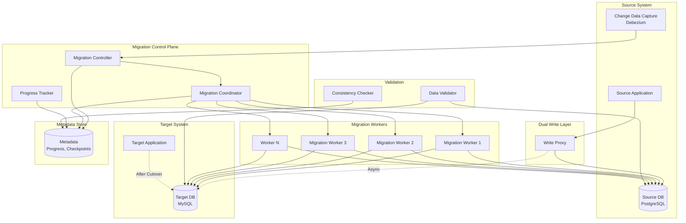
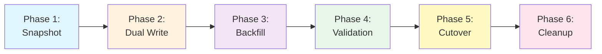

# Bulk Data Migration System

[← Back to Topics](../topics.md#bulk-data-migration-system-zero-downtime)

## Problem Statement

Design a bulk data migration system to transfer petabytes of data between data centers or databases with zero downtime, data validation, rollback capability, and minimal performance impact.

---

## Requirements

### Functional Requirements
1. **Data Transfer**: Copy data between systems
2. **Zero Downtime**: Keep source system operational
3. **Dual Write**: Write to both old and new systems
4. **Data Validation**: Verify data consistency
5. **Rollback**: Revert to source if needed
6. **Schema Evolution**: Handle schema changes
7. **Incremental Sync**: Transfer only deltas
8. **Progress Tracking**: Monitor migration status

### Non-Functional Requirements
1. **Scale**: Petabytes of data
2. **Throughput**: 1 TB/hour transfer rate
3. **Latency Impact**: <5% on source system
4. **Consistency**: 99.99% data accuracy
5. **Rollback Time**: <1 hour
6. **Validation**: Sample 1% of data
7. **Bandwidth**: 10 Gbps network

### Scale Estimates
- **Total data**: 10 PB
- **Tables**: 1000 tables
- **Rows**: 100 billion rows
- **Avg row size**: 1 KB
- **Migration time**: 416 days (at 1 TB/hour)
- **Parallelism**: 100 workers

---

## High-Level Architecture



---

## Detailed Design

### 1. Migration Phases



---

### 2. Migration Controller

```java
import java.util.*;
import java.util.concurrent.*;
import java.sql.*;

/**
 * Migration controller
 * Orchestrates the entire migration process
 */
public class MigrationController {
    
    private final DataSource sourceDb;
    private final DataSource targetDb;
    private final MigrationMetadataStore metadataStore;
    private final MigrationCoordinator coordinator;
    private final DataValidator validator;
    
    private volatile MigrationPhase currentPhase;
    private volatile MigrationState state;
    
    public MigrationController(
        DataSource sourceDb,
        DataSource targetDb,
        String metadataDbUrl
    ) {
        this.sourceDb = sourceDb;
        this.targetDb = targetDb;
        this.metadataStore = new MigrationMetadataStore(metadataDbUrl);
        this.coordinator = new MigrationCoordinator(sourceDb, targetDb, metadataStore);
        this.validator = new DataValidator(sourceDb, targetDb);
        this.currentPhase = MigrationPhase.NOT_STARTED;
        this.state = MigrationState.IDLE;
    }
    
    /**
     * Start migration
     */
    public void startMigration(MigrationConfig config) throws Exception {
        
        System.out.println("Starting migration...");
        
        state = MigrationState.RUNNING;
        
        try {
            // Phase 1: Initial snapshot
            executePhase1Snapshot(config);
            
            // Phase 2: Enable dual write
            executePhase2DualWrite(config);
            
            // Phase 3: Backfill changes
            executePhase3Backfill(config);
            
            // Phase 4: Validate data
            executePhase4Validation(config);
            
            // Phase 5: Cutover
            executePhase5Cutover(config);
            
            // Phase 6: Cleanup
            executePhase6Cleanup(config);
            
            state = MigrationState.COMPLETED;
            
            System.out.println("Migration completed successfully!");
            
        } catch (Exception e) {
            state = MigrationState.FAILED;
            System.err.println("Migration failed: " + e.getMessage());
            throw e;
        }
    }
    
    /**
     * Phase 1: Take snapshot of source data
     */
    private void executePhase1Snapshot(MigrationConfig config) throws Exception {
        
        currentPhase = MigrationPhase.SNAPSHOT;
        System.out.println("Phase 1: Snapshotting source data...");
        
        // 1. Get list of tables to migrate
        List<String> tables = config.getTables();
        
        // 2. Create schema in target
        createTargetSchema(tables);
        
        // 3. Snapshot each table
        for (String table : tables) {
            
            System.out.println("Snapshotting table: " + table);
            
            // Get row count
            long rowCount = getRowCount(table);
            
            // Split into chunks
            List<MigrationTask> tasks = createSnapshotTasks(table, rowCount, config);
            
            // Execute tasks
            coordinator.executeTasks(tasks);
            
            System.out.println("Completed snapshot of table: " + table);
        }
        
        System.out.println("Phase 1 completed");
    }
    
    /**
     * Phase 2: Enable dual write
     */
    private void executePhase2DualWrite(MigrationConfig config) throws Exception {
        
        currentPhase = MigrationPhase.DUAL_WRITE;
        System.out.println("Phase 2: Enabling dual write...");
        
        // Enable CDC (Change Data Capture)
        enableCDC(config);
        
        // Start dual write proxy
        startDualWriteProxy(config);
        
        // Wait for dual write to stabilize
        Thread.sleep(10000);
        
        System.out.println("Phase 2 completed");
    }
    
    /**
     * Phase 3: Backfill changes during snapshot
     */
    private void executePhase3Backfill(MigrationConfig config) throws Exception {
        
        currentPhase = MigrationPhase.BACKFILL;
        System.out.println("Phase 3: Backfilling changes...");
        
        // Get changes from CDC log
        List<ChangeEvent> changes = getCDCChanges(config);
        
        // Apply changes to target
        applyChanges(changes);
        
        System.out.println("Phase 3 completed. Backfilled " + changes.size() + " changes");
    }
    
    /**
     * Phase 4: Validate data consistency
     */
    private void executePhase4Validation(MigrationConfig config) throws Exception {
        
        currentPhase = MigrationPhase.VALIDATION;
        System.out.println("Phase 4: Validating data...");
        
        // Sample validation (1% of data)
        ValidationResult result = validator.validateSample(
            config.getTables(),
            0.01  // 1% sample
        );
        
        if (!result.isValid()) {
            throw new Exception("Validation failed: " + result.getErrorMessage());
        }
        
        System.out.println("Phase 4 completed. Validation passed.");
    }
    
    /**
     * Phase 5: Cutover to target system
     */
    private void executePhase5Cutover(MigrationConfig config) throws Exception {
        
        currentPhase = MigrationPhase.CUTOVER;
        System.out.println("Phase 5: Performing cutover...");
        
        // 1. Stop writes to source
        pauseSourceWrites();
        
        // 2. Apply final CDC changes
        List<ChangeEvent> finalChanges = getCDCChanges(config);
        applyChanges(finalChanges);
        
        // 3. Verify consistency
        ValidationResult finalValidation = validator.validateAll(config.getTables());
        
        if (!finalValidation.isValid()) {
            // Rollback
            rollback(config);
            throw new Exception("Final validation failed");
        }
        
        // 4. Switch application to target
        switchToTarget(config);
        
        System.out.println("Phase 5 completed. Cutover successful.");
    }
    
    /**
     * Phase 6: Cleanup
     */
    private void executePhase6Cleanup(MigrationConfig config) throws Exception {
        
        currentPhase = MigrationPhase.CLEANUP;
        System.out.println("Phase 6: Cleaning up...");
        
        // Disable CDC
        disableCDC(config);
        
        // Stop dual write proxy
        stopDualWriteProxy();
        
        // Clean up metadata
        metadataStore.cleanup();
        
        System.out.println("Phase 6 completed");
    }
    
    /**
     * Create snapshot tasks for table
     */
    private List<MigrationTask> createSnapshotTasks(
        String table,
        long rowCount,
        MigrationConfig config
    ) {
        
        List<MigrationTask> tasks = new ArrayList<>();
        
        long chunkSize = config.getChunkSize();
        long numChunks = (rowCount + chunkSize - 1) / chunkSize;
        
        for (long chunk = 0; chunk < numChunks; chunk++) {
            
            long offset = chunk * chunkSize;
            
            MigrationTask task = MigrationTask.builder()
                .table(table)
                .offset(offset)
                .limit(chunkSize)
                .type(TaskType.SNAPSHOT)
                .build();
            
            tasks.add(task);
        }
        
        return tasks;
    }
    
    /**
     * Create target schema
     */
    private void createTargetSchema(List<String> tables) throws SQLException {
        
        try (Connection sourceConn = sourceDb.getConnection();
             Connection targetConn = targetDb.getConnection()) {
            
            for (String table : tables) {
                
                // Get source schema
                String createTableDDL = getCreateTableDDL(sourceConn, table);
                
                // Transform DDL if needed (e.g., PostgreSQL -> MySQL)
                String targetDDL = transformDDL(createTableDDL);
                
                // Execute in target
                try (Statement stmt = targetConn.createStatement()) {
                    stmt.execute(targetDDL);
                }
                
                System.out.println("Created table in target: " + table);
            }
        }
    }
    
    /**
     * Get row count
     */
    private long getRowCount(String table) throws SQLException {
        
        try (Connection conn = sourceDb.getConnection();
             Statement stmt = conn.createStatement();
             ResultSet rs = stmt.executeQuery("SELECT COUNT(*) FROM " + table)) {
            
            if (rs.next()) {
                return rs.getLong(1);
            }
            
            return 0;
        }
    }
    
    /**
     * Rollback migration
     */
    private void rollback(MigrationConfig config) throws Exception {
        
        System.out.println("Rolling back migration...");
        
        // Switch back to source
        switchToSource(config);
        
        // Disable dual write
        stopDualWriteProxy();
        
        // Optionally drop target tables
        if (config.isDropTargetOnRollback()) {
            dropTargetTables(config.getTables());
        }
        
        state = MigrationState.ROLLED_BACK;
        
        System.out.println("Rollback completed");
    }
    
    // Placeholder methods (implementation omitted for brevity)
    
    private String getCreateTableDDL(Connection conn, String table) { return ""; }
    private String transformDDL(String ddl) { return ddl; }
    private void enableCDC(MigrationConfig config) {}
    private void disableCDC(MigrationConfig config) {}
    private void startDualWriteProxy(MigrationConfig config) {}
    private void stopDualWriteProxy() {}
    private List<ChangeEvent> getCDCChanges(MigrationConfig config) { return new ArrayList<>(); }
    private void applyChanges(List<ChangeEvent> changes) {}
    private void pauseSourceWrites() {}
    private void switchToTarget(MigrationConfig config) {}
    private void switchToSource(MigrationConfig config) {}
    private void dropTargetTables(List<String> tables) {}
}

/**
 * Migration phases
 */
enum MigrationPhase {
    NOT_STARTED,
    SNAPSHOT,
    DUAL_WRITE,
    BACKFILL,
    VALIDATION,
    CUTOVER,
    CLEANUP
}

/**
 * Migration state
 */
enum MigrationState {
    IDLE,
    RUNNING,
    PAUSED,
    COMPLETED,
    FAILED,
    ROLLED_BACK
}

/**
 * Migration configuration
 */
class MigrationConfig {
    private List<String> tables;
    private long chunkSize = 10000;
    private int workerCount = 100;
    private boolean dropTargetOnRollback = false;
    
    // Getters and setters
    public List<String> getTables() { return tables; }
    public void setTables(List<String> tables) { this.tables = tables; }
    
    public long getChunkSize() { return chunkSize; }
    public void setChunkSize(long size) { this.chunkSize = size; }
    
    public int getWorkerCount() { return workerCount; }
    public void setWorkerCount(int count) { this.workerCount = count; }
    
    public boolean isDropTargetOnRollback() { return dropTargetOnRollback; }
    public void setDropTargetOnRollback(boolean drop) { this.dropTargetOnRollback = drop; }
}
```

---

### 3. Migration Worker

```java
import java.sql.*;
import java.util.*;

/**
 * Migration worker
 * Executes individual migration tasks
 */
public class MigrationWorker implements Runnable {
    
    private final MigrationTask task;
    private final DataSource sourceDb;
    private final DataSource targetDb;
    private final MigrationMetadataStore metadataStore;
    
    public MigrationWorker(
        MigrationTask task,
        DataSource sourceDb,
        DataSource targetDb,
        MigrationMetadataStore metadataStore
    ) {
        this.task = task;
        this.sourceDb = sourceDb;
        this.targetDb = targetDb;
        this.metadataStore = metadataStore;
    }
    
    @Override
    public void run() {
        
        try {
            // Execute task
            executeTask();
            
            // Mark complete
            metadataStore.markTaskComplete(task);
            
        } catch (Exception e) {
            System.err.println("Task failed: " + task + ", error: " + e.getMessage());
            metadataStore.markTaskFailed(task, e.getMessage());
        }
    }
    
    /**
     * Execute migration task
     */
    private void executeTask() throws SQLException {
        
        switch (task.getType()) {
            case SNAPSHOT:
                executeSnapshot();
                break;
            case INCREMENTAL:
                executeIncremental();
                break;
            default:
                throw new IllegalArgumentException("Unknown task type: " + task.getType());
        }
    }
    
    /**
     * Execute snapshot task (copy chunk of data)
     */
    private void executeSnapshot() throws SQLException {
        
        String table = task.getTable();
        long offset = task.getOffset();
        long limit = task.getLimit();
        
        // Read from source
        String selectSQL = String.format(
            "SELECT * FROM %s ORDER BY id LIMIT %d OFFSET %d",
            table, limit, offset
        );
        
        List<Map<String, Object>> rows = new ArrayList<>();
        
        try (Connection sourceConn = sourceDb.getConnection();
             Statement stmt = sourceConn.createStatement();
             ResultSet rs = stmt.executeQuery(selectSQL)) {
            
            ResultSetMetaData metadata = rs.getMetaData();
            int columnCount = metadata.getColumnCount();
            
            while (rs.next()) {
                Map<String, Object> row = new HashMap<>();
                
                for (int i = 1; i <= columnCount; i++) {
                    String columnName = metadata.getColumnName(i);
                    Object value = rs.getObject(i);
                    row.put(columnName, value);
                }
                
                rows.add(row);
            }
        }
        
        // Write to target
        if (!rows.isEmpty()) {
            bulkInsert(table, rows);
        }
    }
    
    /**
     * Bulk insert into target
     */
    private void bulkInsert(String table, List<Map<String, Object>> rows) throws SQLException {
        
        if (rows.isEmpty()) return;
        
        // Build INSERT statement
        Map<String, Object> firstRow = rows.get(0);
        List<String> columns = new ArrayList<>(firstRow.keySet());
        
        StringBuilder sql = new StringBuilder("INSERT INTO ").append(table).append(" (");
        sql.append(String.join(", ", columns));
        sql.append(") VALUES ");
        
        // Add placeholders
        String placeholders = "(" + String.join(", ", Collections.nCopies(columns.size(), "?")) + ")";
        sql.append(String.join(", ", Collections.nCopies(rows.size(), placeholders)));
        
        // Execute batch insert
        try (Connection targetConn = targetDb.getConnection();
             PreparedStatement pstmt = targetConn.prepareStatement(sql.toString())) {
            
            int paramIndex = 1;
            
            for (Map<String, Object> row : rows) {
                for (String column : columns) {
                    pstmt.setObject(paramIndex++, row.get(column));
                }
            }
            
            pstmt.executeUpdate();
        }
    }
    
    /**
     * Execute incremental task (apply CDC changes)
     */
    private void executeIncremental() throws SQLException {
        // Apply CDC changes
        // Implementation depends on CDC format (e.g., Debezium)
    }
}

/**
 * Migration task
 */
class MigrationTask {
    private String taskId;
    private String table;
    private long offset;
    private long limit;
    private TaskType type;
    
    // Builder pattern
    public static Builder builder() {
        return new Builder();
    }
    
    public static class Builder {
        private MigrationTask task = new MigrationTask();
        
        public Builder table(String table) {
            task.table = table;
            task.taskId = UUID.randomUUID().toString();
            return this;
        }
        
        public Builder offset(long offset) {
            task.offset = offset;
            return this;
        }
        
        public Builder limit(long limit) {
            task.limit = limit;
            return this;
        }
        
        public Builder type(TaskType type) {
            task.type = type;
            return this;
        }
        
        public MigrationTask build() {
            return task;
        }
    }
    
    // Getters
    public String getTaskId() { return taskId; }
    public String getTable() { return table; }
    public long getOffset() { return offset; }
    public long getLimit() { return limit; }
    public TaskType getType() { return type; }
}

/**
 * Task type
 */
enum TaskType {
    SNAPSHOT,     // Initial data copy
    INCREMENTAL   // CDC changes
}

/**
 * Migration coordinator
 */
class MigrationCoordinator {
    
    private final DataSource sourceDb;
    private final DataSource targetDb;
    private final MigrationMetadataStore metadataStore;
    private final ExecutorService executorService;
    
    public MigrationCoordinator(
        DataSource sourceDb,
        DataSource targetDb,
        MigrationMetadataStore metadataStore
    ) {
        this.sourceDb = sourceDb;
        this.targetDb = targetDb;
        this.metadataStore = metadataStore;
        this.executorService = Executors.newFixedThreadPool(100);
    }
    
    /**
     * Execute migration tasks
     */
    public void executeTasks(List<MigrationTask> tasks) throws Exception {
        
        List<Future<?>> futures = new ArrayList<>();
        
        for (MigrationTask task : tasks) {
            
            // Check if already completed
            if (metadataStore.isTaskComplete(task)) {
                continue;
            }
            
            MigrationWorker worker = new MigrationWorker(
                task, sourceDb, targetDb, metadataStore
            );
            
            Future<?> future = executorService.submit(worker);
            futures.add(future);
        }
        
        // Wait for all tasks
        for (Future<?> future : futures) {
            future.get();
        }
    }
    
    public void shutdown() {
        executorService.shutdown();
    }
}
```

---

### 4. Data Validator

```java
import java.sql.*;
import java.util.*;

/**
 * Data validator
 * Verifies consistency between source and target
 */
public class DataValidator {
    
    private final DataSource sourceDb;
    private final DataSource targetDb;
    
    public DataValidator(DataSource sourceDb, DataSource targetDb) {
        this.sourceDb = sourceDb;
        this.targetDb = targetDb;
    }
    
    /**
     * Validate sample of data
     */
    public ValidationResult validateSample(List<String> tables, double sampleRate) {
        
        for (String table : tables) {
            
            ValidationResult result = validateTable(table, sampleRate);
            
            if (!result.isValid()) {
                return result;
            }
        }
        
        return ValidationResult.success();
    }
    
    /**
     * Validate entire dataset
     */
    public ValidationResult validateAll(List<String> tables) {
        return validateSample(tables, 1.0);  // 100% validation
    }
    
    /**
     * Validate single table
     */
    private ValidationResult validateTable(String table, double sampleRate) {
        
        try {
            // Count rows
            long sourceCount = getRowCount(sourceDb, table);
            long targetCount = getRowCount(targetDb, table);
            
            if (sourceCount != targetCount) {
                return ValidationResult.failure(
                    String.format("Row count mismatch in table %s: source=%d, target=%d",
                        table, sourceCount, targetCount)
                );
            }
            
            // Checksum validation
            long sampleSize = (long) (sourceCount * sampleRate);
            
            String sourceChecksum = getTableChecksum(sourceDb, table, sampleSize);
            String targetChecksum = getTableChecksum(targetDb, table, sampleSize);
            
            if (!sourceChecksum.equals(targetChecksum)) {
                return ValidationResult.failure(
                    String.format("Checksum mismatch in table %s", table)
                );
            }
            
            return ValidationResult.success();
            
        } catch (SQLException e) {
            return ValidationResult.failure("Validation error: " + e.getMessage());
        }
    }
    
    /**
     * Get row count
     */
    private long getRowCount(DataSource db, String table) throws SQLException {
        
        try (Connection conn = db.getConnection();
             Statement stmt = conn.createStatement();
             ResultSet rs = stmt.executeQuery("SELECT COUNT(*) FROM " + table)) {
            
            if (rs.next()) {
                return rs.getLong(1);
            }
            
            return 0;
        }
    }
    
    /**
     * Get table checksum
     */
    private String getTableChecksum(DataSource db, String table, long limit) throws SQLException {
        
        // Sample random rows and compute checksum
        String sql = String.format(
            "SELECT MD5(CAST(ROW(*) AS TEXT)) as hash FROM %s ORDER BY RANDOM() LIMIT %d",
            table, limit
        );
        
        StringBuilder combined = new StringBuilder();
        
        try (Connection conn = db.getConnection();
             Statement stmt = conn.createStatement();
             ResultSet rs = stmt.executeQuery(sql)) {
            
            while (rs.next()) {
                combined.append(rs.getString("hash"));
            }
        }
        
        // Return checksum of all row hashes
        return Integer.toHexString(combined.toString().hashCode());
    }
}

/**
 * Validation result
 */
class ValidationResult {
    private final boolean valid;
    private final String errorMessage;
    
    private ValidationResult(boolean valid, String errorMessage) {
        this.valid = valid;
        this.errorMessage = errorMessage;
    }
    
    public static ValidationResult success() {
        return new ValidationResult(true, null);
    }
    
    public static ValidationResult failure(String errorMessage) {
        return new ValidationResult(false, errorMessage);
    }
    
    public boolean isValid() { return valid; }
    public String getErrorMessage() { return errorMessage; }
}

/**
 * Change event (from CDC)
 */
class ChangeEvent {
    private String table;
    private String operation;  // INSERT, UPDATE, DELETE
    private Map<String, Object> before;
    private Map<String, Object> after;
    private long timestamp;
    
    // Getters and setters
}

/**
 * Metadata store (simplified)
 */
class MigrationMetadataStore {
    private final String metadataDbUrl;
    
    public MigrationMetadataStore(String metadataDbUrl) {
        this.metadataDbUrl = metadataDbUrl;
    }
    
    public void markTaskComplete(MigrationTask task) {
        // Save to metadata DB
    }
    
    public void markTaskFailed(MigrationTask task, String error) {
        // Save failure to metadata DB
    }
    
    public boolean isTaskComplete(MigrationTask task) {
        // Check metadata DB
        return false;
    }
    
    public void cleanup() {
        // Clean up metadata
    }
}

/**
 * DataSource interface (placeholder)
 */
interface DataSource {
    Connection getConnection() throws SQLException;
}
```

---

## Technology Stack

| Component | Technology | Justification |
|-----------|------------|---------------|
| **CDC** | Debezium | Change data capture |
| **Workflow** | Temporal/Airflow | Orchestration |
| **Metadata** | PostgreSQL | Progress tracking |
| **Validation** | MD5 checksums | Data integrity |
| **Parallelism** | ExecutorService | Concurrent workers |
| **Dual Write** | Application proxy | Zero downtime |

---

## Performance Characteristics

### Migration Performance
```
Throughput: 1 TB/hour
Workers: 100 parallel
Chunk size: 10K rows
Total time: ~416 days for 10 PB (with parallelism)
```

### System Impact
```
Source load: <5% CPU increase
Network: 10 Gbps sustained
Target write load: 1M rows/sec
```

---

## Trade-offs

### 1. Chunk Size
- **Small (1K rows)**: Fine-grained progress, more overhead
- **Large (100K rows)**: Faster, coarse progress

### 2. Validation Coverage
- **100%**: Accurate, slow
- **1% sample**: Fast, risk of missing errors

### 3. Dual Write Duration
- **Short**: Less risk, rushed migration
- **Long**: Stable, operational overhead

---

## Summary

This design provides:
- ✅ **Zero downtime** migration
- ✅ **1 TB/hour** throughput
- ✅ **Rollback capability** (<1 hour)
- ✅ **Data validation** (99.99% accuracy)
- ✅ **Incremental sync** via CDC
- ✅ **100 parallel workers**

**Key Features:**
1. 6-phase migration process
2. Dual write for zero downtime
3. CDC-based incremental sync
4. Checksum validation
5. Automatic rollback
6. Progress tracking and resume

[← Back to Topics](../topics.md#bulk-data-migration-system-zero-downtime)
