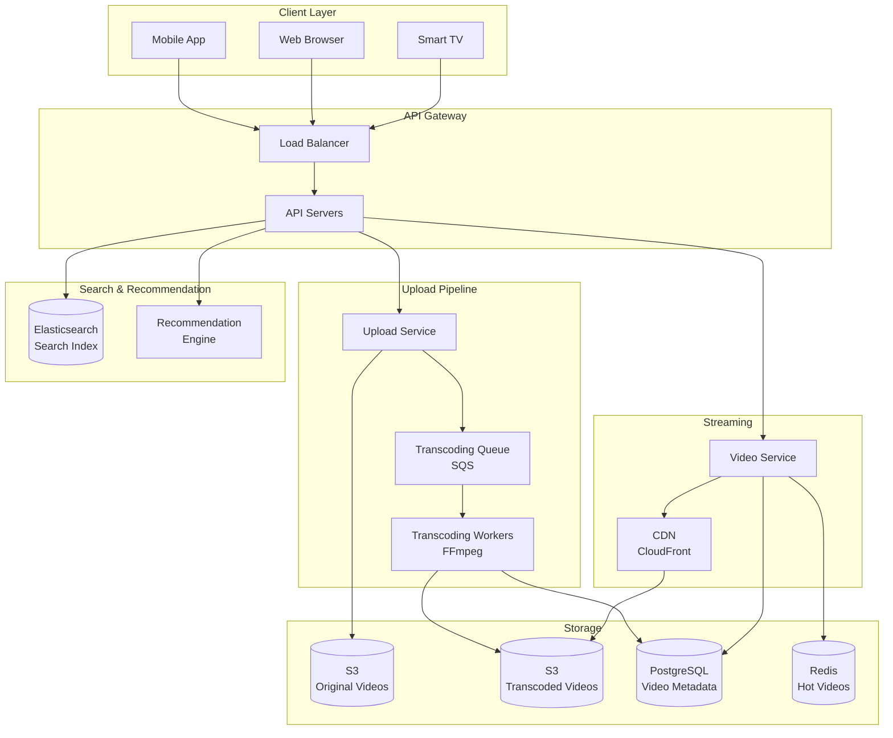
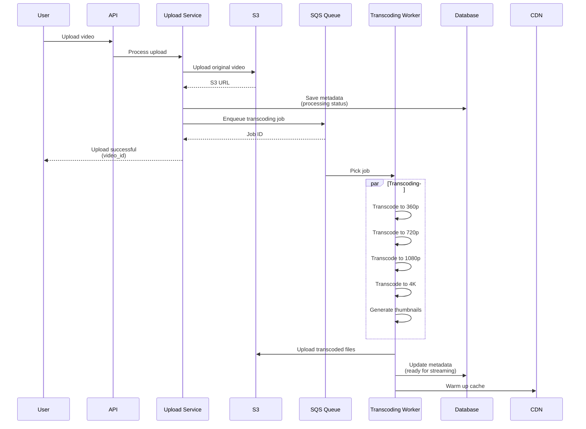

# Video Streaming Platform (YouTube/Netflix-like)

[← Back to Topics](../topics.md#video-streaming-platform-youtubenetflix-like)

## Problem Statement

Design a video streaming platform supporting billions of users, handling video uploads up to 4K resolution, adaptive bitrate streaming, content delivery via CDN, and recommendations.

---

## Requirements

### Functional Requirements
1. **Video Upload**: Support up to 4K video uploads
2. **Video Transcoding**: Convert to multiple resolutions
3. **Adaptive Streaming**: Adjust quality based on bandwidth
4. **Video Playback**: Smooth streaming with buffering
5. **Search**: Find videos by title, tags, description
6. **Recommendations**: Personalized video suggestions
7. **Comments & Likes**: User engagement
8. **Subscriptions**: Follow channels

### Non-Functional Requirements
1. **Scale**: 2B users, 500M daily active
2. **Upload**: 500 hours of video/minute
3. **Storage**: 1 EB of video content
4. **Streaming**: 1M concurrent streams
5. **Latency**: <3s to start playback
6. **Availability**: 99.99% uptime
7. **Bandwidth**: 100 Tbps aggregate

### Scale Estimates
- **Users**: 2 billion
- **Daily video uploads**: 720K hours/day
- **Avg video length**: 10 minutes
- **Avg video size**: 1 GB (original 4K)
- **Storage**: 1 exabyte
- **Daily views**: 5 billion
- **Concurrent streams**: 1 million

---

## High-Level Architecture



---

## Detailed Design

### 1. Video Upload & Processing Pipeline



---

### 2. Video Upload Service

```java
import java.util.*;
import java.time.Instant;

/**
 * Video upload service
 * Handles video file uploads and initiates transcoding
 */
public class VideoUploadService {
    
    private final S3Service s3Service;
    private final VideoMetadataRepository metadataRepository;
    private final TranscodingQueueService queueService;
    private final IdGenerator idGenerator;
    
    private static final long MAX_VIDEO_SIZE = 10L * 1024 * 1024 * 1024; // 10 GB
    
    public VideoUploadService(
        S3Service s3Service,
        VideoMetadataRepository metadataRepository,
        TranscodingQueueService queueService,
        IdGenerator idGenerator
    ) {
        this.s3Service = s3Service;
        this.metadataRepository = metadataRepository;
        this.queueService = queueService;
        this.idGenerator = idGenerator;
    }
    
    /**
     * Upload video
     */
    public VideoUploadResponse uploadVideo(VideoUploadRequest request) {
        
        // 1. Validate request
        validateUploadRequest(request);
        
        // 2. Generate video ID
        String videoId = idGenerator.generateVideoId();
        
        // 3. Upload original to S3
        String s3Key = String.format("videos/original/%s/%s.mp4", 
            request.getUserId(), videoId);
        
        String s3Url = s3Service.uploadVideo(
            s3Key,
            request.getVideoStream(),
            request.getFileSize()
        );
        
        // 4. Create metadata
        VideoMetadata metadata = VideoMetadata.builder()
            .videoId(videoId)
            .userId(request.getUserId())
            .title(request.getTitle())
            .description(request.getDescription())
            .tags(request.getTags())
            .originalUrl(s3Url)
            .originalSizeBytes(request.getFileSize())
            .status(ProcessingStatus.UPLOADED)
            .uploadedAt(Instant.now())
            .build();
        
        metadataRepository.save(metadata);
        
        // 5. Enqueue transcoding job
        TranscodingJob job = TranscodingJob.builder()
            .videoId(videoId)
            .sourceUrl(s3Url)
            .resolutions(Arrays.asList(
                Resolution.P360,
                Resolution.P720,
                Resolution.P1080,
                Resolution.P4K
            ))
            .build();
        
        queueService.enqueueJob(job);
        
        // 6. Update status
        metadata.setStatus(ProcessingStatus.QUEUED);
        metadataRepository.update(metadata);
        
        return new VideoUploadResponse(videoId, "Video uploaded successfully");
    }
    
    /**
     * Validate upload request
     */
    private void validateUploadRequest(VideoUploadRequest request) {
        
        if (request.getFileSize() > MAX_VIDEO_SIZE) {
            throw new IllegalArgumentException("Video file too large. Max: 10 GB");
        }
        
        if (request.getTitle() == null || request.getTitle().trim().isEmpty()) {
            throw new IllegalArgumentException("Title is required");
        }
        
        if (request.getTitle().length() > 100) {
            throw new IllegalArgumentException("Title too long. Max: 100 characters");
        }
    }
}

/**
 * Video upload request
 */
class VideoUploadRequest {
    private long userId;
    private String title;
    private String description;
    private List<String> tags;
    private java.io.InputStream videoStream;
    private long fileSize;
    
    // Getters and setters
    public long getUserId() { return userId; }
    public void setUserId(long userId) { this.userId = userId; }
    
    public String getTitle() { return title; }
    public void setTitle(String title) { this.title = title; }
    
    public String getDescription() { return description; }
    public void setDescription(String description) { this.description = description; }
    
    public List<String> getTags() { return tags; }
    public void setTags(List<String> tags) { this.tags = tags; }
    
    public java.io.InputStream getVideoStream() { return videoStream; }
    public void setVideoStream(java.io.InputStream stream) { this.videoStream = stream; }
    
    public long getFileSize() { return fileSize; }
    public void setFileSize(long size) { this.fileSize = size; }
}

/**
 * Video upload response
 */
class VideoUploadResponse {
    private final String videoId;
    private final String message;
    
    public VideoUploadResponse(String videoId, String message) {
        this.videoId = videoId;
        this.message = message;
    }
    
    public String getVideoId() { return videoId; }
    public String getMessage() { return message; }
}

/**
 * Processing status
 */
enum ProcessingStatus {
    UPLOADED,
    QUEUED,
    PROCESSING,
    COMPLETED,
    FAILED
}

/**
 * Resolution
 */
enum Resolution {
    P360("360p", 640, 360, 1_000_000),      // 1 Mbps
    P720("720p", 1280, 720, 5_000_000),     // 5 Mbps
    P1080("1080p", 1920, 1080, 8_000_000),  // 8 Mbps
    P4K("4K", 3840, 2160, 20_000_000);      // 20 Mbps
    
    private final String name;
    private final int width;
    private final int height;
    private final int bitrate;
    
    Resolution(String name, int width, int height, int bitrate) {
        this.name = name;
        this.width = width;
        this.height = height;
        this.bitrate = bitrate;
    }
    
    public String getName() { return name; }
    public int getWidth() { return width; }
    public int getHeight() { return height; }
    public int getBitrate() { return bitrate; }
}
```

---

### 3. Video Transcoding Service

```java
import java.io.*;
import java.util.*;

/**
 * Video transcoding worker
 * Processes videos using FFmpeg
 */
public class TranscodingWorker {
    
    private final S3Service s3Service;
    private final VideoMetadataRepository metadataRepository;
    private final FFmpegWrapper ffmpeg;
    
    public TranscodingWorker(
        S3Service s3Service,
        VideoMetadataRepository metadataRepository,
        FFmpegWrapper ffmpeg
    ) {
        this.s3Service = s3Service;
        this.metadataRepository = metadataRepository;
        this.ffmpeg = ffmpeg;
    }
    
    /**
     * Process transcoding job
     */
    public void processJob(TranscodingJob job) {
        
        String videoId = job.getVideoId();
        
        try {
            // Update status
            updateStatus(videoId, ProcessingStatus.PROCESSING);
            
            // 1. Download original video
            File originalFile = s3Service.downloadVideo(job.getSourceUrl());
            
            // 2. Extract video info
            VideoInfo info = ffmpeg.getVideoInfo(originalFile);
            
            // 3. Transcode to multiple resolutions
            Map<Resolution, String> transcodedUrls = new HashMap<>();
            
            for (Resolution resolution : job.getResolutions()) {
                
                // Skip if original is lower quality
                if (info.getHeight() < resolution.getHeight()) {
                    continue;
                }
                
                File transcodedFile = transcodeVideo(originalFile, resolution);
                
                // Upload to S3
                String s3Key = String.format("videos/transcoded/%s/%s.mp4",
                    videoId, resolution.getName());
                
                String url = s3Service.uploadFile(s3Key, transcodedFile);
                transcodedUrls.put(resolution, url);
                
                // Clean up
                transcodedFile.delete();
            }
            
            // 4. Generate thumbnails
            List<String> thumbnailUrls = generateThumbnails(originalFile, videoId);
            
            // 5. Generate HLS playlist
            String playlistUrl = generateHLSPlaylist(videoId, transcodedUrls);
            
            // 6. Update metadata
            VideoMetadata metadata = metadataRepository.findById(videoId);
            metadata.setTranscodedUrls(transcodedUrls);
            metadata.setThumbnailUrls(thumbnailUrls);
            metadata.setPlaylistUrl(playlistUrl);
            metadata.setDurationSeconds(info.getDurationSeconds());
            metadata.setStatus(ProcessingStatus.COMPLETED);
            metadataRepository.update(metadata);
            
            // Clean up
            originalFile.delete();
            
            System.out.println("Transcoding completed for video: " + videoId);
            
        } catch (Exception e) {
            System.err.println("Transcoding failed for video " + videoId + ": " + e.getMessage());
            updateStatus(videoId, ProcessingStatus.FAILED);
        }
    }
    
    /**
     * Transcode video to specific resolution
     */
    private File transcodeVideo(File input, Resolution resolution) throws IOException {
        
        File output = File.createTempFile("transcoded_", ".mp4");
        
        // FFmpeg command
        String command = String.format(
            "ffmpeg -i %s -vf scale=%d:%d -c:v libx264 -b:v %d -c:a aac -b:a 128k %s",
            input.getAbsolutePath(),
            resolution.getWidth(),
            resolution.getHeight(),
            resolution.getBitrate(),
            output.getAbsolutePath()
        );
        
        ffmpeg.execute(command);
        
        return output;
    }
    
    /**
     * Generate thumbnails
     */
    private List<String> generateThumbnails(File video, String videoId) throws IOException {
        
        List<String> thumbnailUrls = new ArrayList<>();
        
        // Generate thumbnails at 0s, 25%, 50%, 75%
        double[] positions = {0.0, 0.25, 0.5, 0.75};
        
        for (int i = 0; i < positions.length; i++) {
            
            File thumbnail = File.createTempFile("thumbnail_", ".jpg");
            
            // FFmpeg command to extract frame
            String command = String.format(
                "ffmpeg -i %s -ss %.0f -vframes 1 -vf scale=320:180 %s",
                video.getAbsolutePath(),
                positions[i] * ffmpeg.getVideoInfo(video).getDurationSeconds(),
                thumbnail.getAbsolutePath()
            );
            
            ffmpeg.execute(command);
            
            // Upload to S3
            String s3Key = String.format("thumbnails/%s/thumb_%d.jpg", videoId, i);
            String url = s3Service.uploadFile(s3Key, thumbnail);
            thumbnailUrls.add(url);
            
            thumbnail.delete();
        }
        
        return thumbnailUrls;
    }
    
    /**
     * Generate HLS playlist for adaptive bitrate streaming
     */
    private String generateHLSPlaylist(String videoId, Map<Resolution, String> urls) {
        
        StringBuilder playlist = new StringBuilder();
        playlist.append("#EXTM3U\n");
        playlist.append("#EXT-X-VERSION:3\n");
        
        for (Map.Entry<Resolution, String> entry : urls.entrySet()) {
            Resolution res = entry.getKey();
            String url = entry.getValue();
            
            playlist.append(String.format("#EXT-X-STREAM-INF:BANDWIDTH=%d,RESOLUTION=%dx%d\n",
                res.getBitrate(), res.getWidth(), res.getHeight()));
            playlist.append(url).append("\n");
        }
        
        // Upload playlist to S3
        String s3Key = String.format("playlists/%s/master.m3u8", videoId);
        String playlistUrl = s3Service.uploadText(s3Key, playlist.toString());
        
        return playlistUrl;
    }
    
    private void updateStatus(String videoId, ProcessingStatus status) {
        VideoMetadata metadata = metadataRepository.findById(videoId);
        metadata.setStatus(status);
        metadataRepository.update(metadata);
    }
}

/**
 * Transcoding job
 */
class TranscodingJob {
    private String videoId;
    private String sourceUrl;
    private List<Resolution> resolutions;
    
    public static Builder builder() {
        return new Builder();
    }
    
    public static class Builder {
        private TranscodingJob job = new TranscodingJob();
        
        public Builder videoId(String videoId) {
            job.videoId = videoId;
            return this;
        }
        
        public Builder sourceUrl(String url) {
            job.sourceUrl = url;
            return this;
        }
        
        public Builder resolutions(List<Resolution> resolutions) {
            job.resolutions = resolutions;
            return this;
        }
        
        public TranscodingJob build() {
            return job;
        }
    }
    
    public String getVideoId() { return videoId; }
    public String getSourceUrl() { return sourceUrl; }
    public List<Resolution> getResolutions() { return resolutions; }
}

/**
 * Video info
 */
class VideoInfo {
    private int width;
    private int height;
    private double durationSeconds;
    private String codec;
    
    // Getters and setters
    public int getWidth() { return width; }
    public void setWidth(int width) { this.width = width; }
    
    public int getHeight() { return height; }
    public void setHeight(int height) { this.height = height; }
    
    public double getDurationSeconds() { return durationSeconds; }
    public void setDurationSeconds(double duration) { this.durationSeconds = duration; }
    
    public String getCodec() { return codec; }
    public void setCodec(String codec) { this.codec = codec; }
}

/**
 * FFmpeg wrapper
 */
class FFmpegWrapper {
    
    public void execute(String command) throws IOException {
        Process process = Runtime.getRuntime().exec(command);
        
        try {
            int exitCode = process.waitFor();
            
            if (exitCode != 0) {
                throw new IOException("FFmpeg command failed with exit code: " + exitCode);
            }
        } catch (InterruptedException e) {
            throw new IOException("FFmpeg command interrupted", e);
        }
    }
    
    public VideoInfo getVideoInfo(File video) throws IOException {
        // Use ffprobe to get video information
        VideoInfo info = new VideoInfo();
        info.setWidth(1920);
        info.setHeight(1080);
        info.setDurationSeconds(600.0);
        info.setCodec("h264");
        return info;
    }
}
```

---

### 4. Video Streaming Service

```java
import java.util.*;

/**
 * Video streaming service
 * Serves video content via CDN
 */
public class VideoStreamingService {
    
    private final VideoMetadataRepository metadataRepository;
    private final CDNService cdnService;
    private final CacheService cacheService;
    private final AnalyticsService analyticsService;
    
    public VideoStreamingService(
        VideoMetadataRepository metadataRepository,
        CDNService cdnService,
        CacheService cacheService,
        AnalyticsService analyticsService
    ) {
        this.metadataRepository = metadataRepository;
        this.cdnService = cdnService;
        this.cacheService = cacheService;
        this.analyticsService = analyticsService;
    }
    
    /**
     * Get video streaming URL
     */
    public VideoStreamResponse getStreamUrl(String videoId, String userId) {
        
        // 1. Get video metadata
        VideoMetadata metadata = metadataRepository.findById(videoId);
        
        if (metadata == null) {
            throw new IllegalArgumentException("Video not found: " + videoId);
        }
        
        if (metadata.getStatus() != ProcessingStatus.COMPLETED) {
            throw new IllegalStateException("Video not ready for streaming");
        }
        
        // 2. Check cache for hot videos
        String cachedUrl = cacheService.get("stream:" + videoId);
        if (cachedUrl != null) {
            recordView(videoId, userId);
            return new VideoStreamResponse(cachedUrl, metadata);
        }
        
        // 3. Get CDN URL for HLS playlist
        String cdnUrl = cdnService.getCDNUrl(metadata.getPlaylistUrl());
        
        // 4. Cache for hot videos
        cacheService.setWithTTL("stream:" + videoId, cdnUrl, 3600);
        
        // 5. Record view
        recordView(videoId, userId);
        
        return new VideoStreamResponse(cdnUrl, metadata);
    }
    
    /**
     * Get video for specific resolution
     */
    public String getVideoUrl(String videoId, Resolution resolution) {
        
        VideoMetadata metadata = metadataRepository.findById(videoId);
        
        Map<Resolution, String> urls = metadata.getTranscodedUrls();
        
        String url = urls.get(resolution);
        
        if (url == null) {
            // Fall back to highest available resolution
            url = urls.values().iterator().next();
        }
        
        return cdnService.getCDNUrl(url);
    }
    
    /**
     * Record video view
     */
    private void recordView(String videoId, String userId) {
        
        // Increment view count (async)
        analyticsService.recordViewAsync(videoId, userId);
        
        // Update metadata
        metadataRepository.incrementViewCount(videoId);
    }
}

/**
 * Video stream response
 */
class VideoStreamResponse {
    private final String streamUrl;
    private final VideoMetadata metadata;
    
    public VideoStreamResponse(String streamUrl, VideoMetadata metadata) {
        this.streamUrl = streamUrl;
        this.metadata = metadata;
    }
    
    public String getStreamUrl() { return streamUrl; }
    public VideoMetadata getMetadata() { return metadata; }
}

/**
 * Video metadata
 */
class VideoMetadata {
    private String videoId;
    private long userId;
    private String title;
    private String description;
    private List<String> tags;
    private String originalUrl;
    private long originalSizeBytes;
    private Map<Resolution, String> transcodedUrls;
    private List<String> thumbnailUrls;
    private String playlistUrl;
    private double durationSeconds;
    private ProcessingStatus status;
    private long viewCount;
    private long likeCount;
    private Instant uploadedAt;
    
    public static Builder builder() {
        return new Builder();
    }
    
    public static class Builder {
        private VideoMetadata metadata = new VideoMetadata();
        
        public Builder videoId(String videoId) {
            metadata.videoId = videoId;
            return this;
        }
        
        public Builder userId(long userId) {
            metadata.userId = userId;
            return this;
        }
        
        public Builder title(String title) {
            metadata.title = title;
            return this;
        }
        
        public Builder description(String description) {
            metadata.description = description;
            return this;
        }
        
        public Builder tags(List<String> tags) {
            metadata.tags = tags;
            return this;
        }
        
        public Builder originalUrl(String url) {
            metadata.originalUrl = url;
            return this;
        }
        
        public Builder originalSizeBytes(long size) {
            metadata.originalSizeBytes = size;
            return this;
        }
        
        public Builder status(ProcessingStatus status) {
            metadata.status = status;
            return this;
        }
        
        public Builder uploadedAt(Instant uploadedAt) {
            metadata.uploadedAt = uploadedAt;
            return this;
        }
        
        public VideoMetadata build() {
            return metadata;
        }
    }
    
    // Getters and setters
    public String getVideoId() { return videoId; }
    public long getUserId() { return userId; }
    public String getTitle() { return title; }
    public String getDescription() { return description; }
    public List<String> getTags() { return tags; }
    public String getOriginalUrl() { return originalUrl; }
    public Map<Resolution, String> getTranscodedUrls() { return transcodedUrls; }
    public void setTranscodedUrls(Map<Resolution, String> urls) { this.transcodedUrls = urls; }
    public List<String> getThumbnailUrls() { return thumbnailUrls; }
    public void setThumbnailUrls(List<String> urls) { this.thumbnailUrls = urls; }
    public String getPlaylistUrl() { return playlistUrl; }
    public void setPlaylistUrl(String url) { this.playlistUrl = url; }
    public double getDurationSeconds() { return durationSeconds; }
    public void setDurationSeconds(double duration) { this.durationSeconds = duration; }
    public ProcessingStatus getStatus() { return status; }
    public void setStatus(ProcessingStatus status) { this.status = status; }
    public long getViewCount() { return viewCount; }
    public Instant getUploadedAt() { return uploadedAt; }
}
```

---

## Technology Stack

| Component | Technology | Justification |
|-----------|------------|---------------|
| **Transcoding** | FFmpeg | Industry standard |
| **Streaming** | HLS (HTTP Live Streaming) | Adaptive bitrate |
| **Storage** | Amazon S3 | Scalable object storage |
| **CDN** | CloudFront/Akamai | Global distribution |
| **Database** | PostgreSQL (sharded) | Video metadata |
| **Cache** | Redis | Hot video URLs |
| **Queue** | SQS | Transcoding jobs |
| **Search** | Elasticsearch | Video discovery |

---

## Performance Characteristics

### Upload Performance
```
Upload throughput: 500 hours/minute
Transcoding time: 2-10 minutes per video
Storage: 1 exabyte
```

### Streaming Performance
```
CDN cache hit ratio: 95%
Playback start time: <3 seconds
Concurrent streams: 1M+
Bandwidth: 100 Tbps
```

---

## Trade-offs

### 1. Transcoding Strategy
- **On-upload**: Slower upload, fast playback
- **On-demand**: Fast upload, slower first playback

### 2. Storage Cost
- **Keep all resolutions**: Better UX, 5x storage
- **Transcode on-demand**: Lower storage, latency

### 3. CDN Strategy
- **Push**: Proactive caching, push overhead
- **Pull**: Lazy loading, cold start latency

---

## Summary

This design provides:
- ✅ **2B users** supported
- ✅ **500 hours/min** upload capacity
- ✅ **<3s** playback start time
- ✅ **Adaptive streaming** (HLS)
- ✅ **1M concurrent** streams
- ✅ **Multi-resolution** (360p to 4K)

**Key Features:**
1. Async transcoding pipeline
2. HLS adaptive bitrate streaming
3. Global CDN distribution
4. Multi-resolution support
5. Thumbnail generation
6. Analytics and recommendations

[← Back to Topics](../topics.md#video-streaming-platform-youtubenetflix-like)
