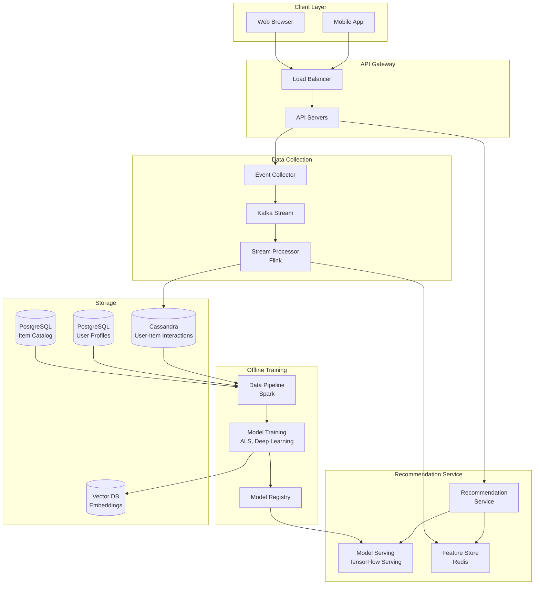
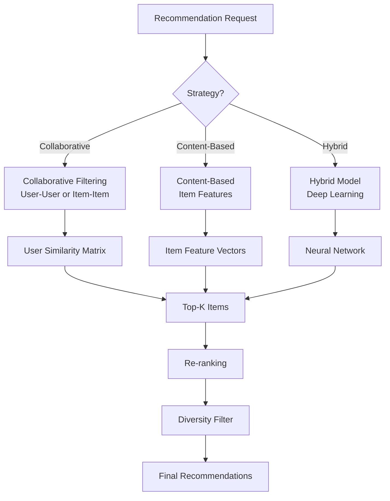

# Recommendation Engine System

[← Back to Topics](../topics.md#recommendation-engine-system)

## Problem Statement

Design a recommendation engine that provides personalized content suggestions (products, videos, articles) for millions of users with <100ms latency, supporting multiple recommendation strategies.

---

## Requirements

### Functional Requirements
1. **Personalized Recommendations**: User-specific suggestions
2. **Multiple Strategies**: Collaborative filtering, content-based, hybrid
3. **Real-time**: Incorporate recent interactions
4. **A/B Testing**: Test different algorithms
5. **Cold Start**: Handle new users/items
6. **Diversity**: Avoid filter bubbles
7. **Explain ability**: Show why recommended
8. **Batch & Real-time**: Offline training, online serving

### Non-Functional Requirements
1. **Scale**: 100M users, 10M items
2. **Latency**: <100ms p99
3. **Throughput**: 10K requests/second
4. **Model Training**: Daily batch updates
5. **Accuracy**: CTR >5%
6. **Availability**: 99.99% uptime
7. **Storage**: 1 TB of interaction data

### Scale Estimates
- **Users**: 100 million
- **Items**: 10 million
- **Daily interactions**: 1 billion
- **Recommendation requests**: 10K/sec
- **Model size**: 10 GB
- **Feature vectors**: 100M × 100 dimensions

---

## High-Level Architecture



---

## Detailed Design

### 1. Recommendation Strategies



---

### 2. Recommendation Service

```java
import java.util.*;
import java.util.stream.Collectors;

/**
 * Recommendation service
 * Provides personalized recommendations
 */
public class RecommendationService {
    
    private final ModelServingClient modelClient;
    private final FeatureStore featureStore;
    private final UserProfileService userProfileService;
    private final ItemCatalogService itemCatalogService;
    
    private static final int DEFAULT_REC_COUNT = 10;
    
    public RecommendationService(
        ModelServingClient modelClient,
        FeatureStore featureStore,
        UserProfileService userProfileService,
        ItemCatalogService itemCatalogService
    ) {
        this.modelClient = modelClient;
        this.featureStore = featureStore;
        this.userProfileService = userProfileService;
        this.itemCatalogService = itemCatalogService;
    }
    
    /**
     * Get personalized recommendations
     */
    public List<RecommendedItem> getRecommendations(
        String userId,
        RecommendationRequest request
    ) {
        
        // 1. Get user features
        UserFeatures userFeatures = featureStore.getUserFeatures(userId);
        
        if (userFeatures == null) {
            // Cold start: return trending items
            return getTrendingItems(request.getCount());
        }
        
        // 2. Get candidate items
        List<String> candidates = getCandidateItems(userId, request);
        
        // 3. Score candidates using ML model
        Map<String, Double> scores = scoreItems(userId, candidates, userFeatures);
        
        // 4. Rank by score
        List<ScoredItem> ranked = scores.entrySet().stream()
            .map(e -> new ScoredItem(e.getKey(), e.getValue()))
            .sorted((a, b) -> Double.compare(b.getScore(), a.getScore()))
            .collect(Collectors.toList());
        
        // 5. Re-rank for diversity
        List<ScoredItem> diversified = applyDiversityFilter(ranked, userFeatures);
        
        // 6. Filter already seen items
        List<ScoredItem> filtered = filterSeenItems(userId, diversified);
        
        // 7. Get top K
        List<String> topItems = filtered.stream()
            .limit(request.getCount())
            .map(ScoredItem::getItemId)
            .collect(Collectors.toList());
        
        // 8. Fetch item details
        List<RecommendedItem> recommendations = getItemDetails(topItems, scores);
        
        return recommendations;
    }
    
    /**
     * Get candidate items for recommendation
     */
    private List<String> getCandidateItems(
        String userId,
        RecommendationRequest request
    ) {
        
        List<String> candidates = new ArrayList<>();
        
        // Strategy 1: Collaborative filtering candidates
        List<String> cfCandidates = getCollaborativeFilteringCandidates(userId, 100);
        candidates.addAll(cfCandidates);
        
        // Strategy 2: Content-based candidates
        List<String> cbCandidates = getContentBasedCandidates(userId, 100);
        candidates.addAll(cbCandidates);
        
        // Strategy 3: Trending items
        List<String> trending = featureStore.getTrendingItems(50);
        candidates.addAll(trending);
        
        // Deduplicate
        return candidates.stream().distinct().collect(Collectors.toList());
    }
    
    /**
     * Collaborative filtering candidates
     * Find items liked by similar users
     */
    private List<String> getCollaborativeFilteringCandidates(
        String userId,
        int count
    ) {
        
        // Get similar users
        List<String> similarUsers = featureStore.getSimilarUsers(userId, 20);
        
        // Get items liked by similar users
        List<String> items = new ArrayList<>();
        
        for (String similarUser : similarUsers) {
            List<String> likedItems = featureStore.getUserLikedItems(similarUser, 10);
            items.addAll(likedItems);
        }
        
        // Return top items by frequency
        return items.stream()
            .collect(Collectors.groupingBy(item -> item, Collectors.counting()))
            .entrySet().stream()
            .sorted((a, b) -> Long.compare(b.getValue(), a.getValue()))
            .limit(count)
            .map(Map.Entry::getKey)
            .collect(Collectors.toList());
    }
    
    /**
     * Content-based candidates
     * Find items similar to what user liked
     */
    private List<String> getContentBasedCandidates(
        String userId,
        int count
    ) {
        
        // Get user's liked items
        List<String> likedItems = featureStore.getUserLikedItems(userId, 10);
        
        if (likedItems.isEmpty()) {
            return Collections.emptyList();
        }
        
        // Find similar items
        List<String> similar = new ArrayList<>();
        
        for (String itemId : likedItems) {
            List<String> similarItems = featureStore.getSimilarItems(itemId, 10);
            similar.addAll(similarItems);
        }
        
        return similar.stream().distinct().limit(count).collect(Collectors.toList());
    }
    
    /**
     * Score items using ML model
     */
    private Map<String, Double> scoreItems(
        String userId,
        List<String> itemIds,
        UserFeatures userFeatures
    ) {
        
        Map<String, Double> scores = new HashMap<>();
        
        for (String itemId : itemIds) {
            
            // Get item features
            ItemFeatures itemFeatures = featureStore.getItemFeatures(itemId);
            
            if (itemFeatures == null) {
                continue;
            }
            
            // Build feature vector
            double[] features = buildFeatureVector(userFeatures, itemFeatures);
            
            // Call ML model for scoring
            double score = modelClient.predict(features);
            
            scores.put(itemId, score);
        }
        
        return scores;
    }
    
    /**
     * Build feature vector for ML model
     */
    private double[] buildFeatureVector(
        UserFeatures userFeatures,
        ItemFeatures itemFeatures
    ) {
        
        // Combine user and item features
        List<Double> features = new ArrayList<>();
        
        // User features
        features.addAll(Arrays.asList(userFeatures.getEmbedding()));
        
        // Item features
        features.addAll(Arrays.asList(itemFeatures.getEmbedding()));
        
        // Interaction features
        features.add((double) userFeatures.getActivityLevel());
        features.add((double) itemFeatures.getPopularity());
        
        return features.stream().mapToDouble(Double::doubleValue).toArray();
    }
    
    /**
     * Apply diversity filter
     * Avoid showing too many similar items
     */
    private List<ScoredItem> applyDiversityFilter(
        List<ScoredItem> items,
        UserFeatures userFeatures
    ) {
        
        List<ScoredItem> diversified = new ArrayList<>();
        Set<String> seenCategories = new HashSet<>();
        
        for (ScoredItem item : items) {
            
            ItemFeatures features = featureStore.getItemFeatures(item.getItemId());
            
            if (features == null) {
                continue;
            }
            
            String category = features.getCategory();
            
            // Limit items per category
            if (seenCategories.contains(category) && seenCategories.size() > 3) {
                // Skip if we already have 3+ items from this category
                continue;
            }
            
            diversified.add(item);
            seenCategories.add(category);
            
            if (diversified.size() >= items.size()) {
                break;
            }
        }
        
        return diversified;
    }
    
    /**
     * Filter items already seen by user
     */
    private List<ScoredItem> filterSeenItems(
        String userId,
        List<ScoredItem> items
    ) {
        
        Set<String> seenItems = featureStore.getUserSeenItems(userId);
        
        return items.stream()
            .filter(item -> !seenItems.contains(item.getItemId()))
            .collect(Collectors.toList());
    }
    
    /**
     * Get item details
     */
    private List<RecommendedItem> getItemDetails(
        List<String> itemIds,
        Map<String, Double> scores
    ) {
        
        return itemIds.stream()
            .map(itemId -> {
                ItemDetails details = itemCatalogService.getItem(itemId);
                double score = scores.getOrDefault(itemId, 0.0);
                return new RecommendedItem(itemId, details, score);
            })
            .collect(Collectors.toList());
    }
    
    /**
     * Cold start: get trending items
     */
    private List<RecommendedItem> getTrendingItems(int count) {
        
        List<String> trending = featureStore.getTrendingItems(count);
        
        return trending.stream()
            .map(itemId -> {
                ItemDetails details = itemCatalogService.getItem(itemId);
                return new RecommendedItem(itemId, details, 0.0);
            })
            .collect(Collectors.toList());
    }
}

/**
 * Scored item
 */
class ScoredItem {
    private final String itemId;
    private final double score;
    
    public ScoredItem(String itemId, double score) {
        this.itemId = itemId;
        this.score = score;
    }
    
    public String getItemId() { return itemId; }
    public double getScore() { return score; }
}

/**
 * Recommended item
 */
class RecommendedItem {
    private final String itemId;
    private final ItemDetails details;
    private final double score;
    
    public RecommendedItem(String itemId, ItemDetails details, double score) {
        this.itemId = itemId;
        this.details = details;
        this.score = score;
    }
    
    public String getItemId() { return itemId; }
    public ItemDetails getDetails() { return details; }
    public double getScore() { return score; }
}

/**
 * Recommendation request
 */
class RecommendationRequest {
    private int count = 10;
    private String context;  // e.g., "homepage", "product_page"
    
    public int getCount() { return count; }
    public void setCount(int count) { this.count = count; }
    
    public String getContext() { return context; }
    public void setContext(String context) { this.context = context; }
}
```

---

### 3. Feature Store

```java
import redis.clients.jedis.*;
import java.util.*;

/**
 * Feature store
 * Caches user and item features for fast lookup
 */
public class FeatureStore {
    
    private final JedisPool jedisPool;
    
    public FeatureStore(JedisPool jedisPool) {
        this.jedisPool = jedisPool;
    }
    
    /**
     * Get user features
     */
    public UserFeatures getUserFeatures(String userId) {
        
        try (Jedis jedis = jedisPool.getResource()) {
            
            String key = "user:" + userId;
            Map<String, String> data = jedis.hgetAll(key);
            
            if (data.isEmpty()) {
                return null;
            }
            
            return UserFeatures.fromMap(data);
        }
    }
    
    /**
     * Get item features
     */
    public ItemFeatures getItemFeatures(String itemId) {
        
        try (Jedis jedis = jedisPool.getResource()) {
            
            String key = "item:" + itemId;
            Map<String, String> data = jedis.hgetAll(key);
            
            if (data.isEmpty()) {
                return null;
            }
            
            return ItemFeatures.fromMap(data);
        }
    }
    
    /**
     * Get similar users
     */
    public List<String> getSimilarUsers(String userId, int count) {
        
        try (Jedis jedis = jedisPool.getResource()) {
            
            String key = "similar_users:" + userId;
            return jedis.lrange(key, 0, count - 1);
        }
    }
    
    /**
     * Get similar items
     */
    public List<String> getSimilarItems(String itemId, int count) {
        
        try (Jedis jedis = jedisPool.getResource()) {
            
            String key = "similar_items:" + itemId;
            return jedis.lrange(key, 0, count - 1);
        }
    }
    
    /**
     * Get user's liked items
     */
    public List<String> getUserLikedItems(String userId, int count) {
        
        try (Jedis jedis = jedisPool.getResource()) {
            
            String key = "user_likes:" + userId;
            return jedis.lrange(key, 0, count - 1);
        }
    }
    
    /**
     * Get user's seen items
     */
    public Set<String> getUserSeenItems(String userId) {
        
        try (Jedis jedis = jedisPool.getResource()) {
            
            String key = "user_seen:" + userId;
            return jedis.smembers(key);
        }
    }
    
    /**
     * Get trending items
     */
    public List<String> getTrendingItems(int count) {
        
        try (Jedis jedis = jedisPool.getResource()) {
            
            String key = "trending_items";
            return jedis.lrange(key, 0, count - 1);
        }
    }
}

/**
 * User features
 */
class UserFeatures {
    private String userId;
    private Double[] embedding;  // 100-dim vector
    private int activityLevel;
    private List<String> preferredCategories;
    
    public static UserFeatures fromMap(Map<String, String> data) {
        UserFeatures features = new UserFeatures();
        features.userId = data.get("user_id");
        // Parse embedding, activity level, etc.
        return features;
    }
    
    public String getUserId() { return userId; }
    public Double[] getEmbedding() { return embedding; }
    public int getActivityLevel() { return activityLevel; }
    public List<String> getPreferredCategories() { return preferredCategories; }
}

/**
 * Item features
 */
class ItemFeatures {
    private String itemId;
    private Double[] embedding;  // 100-dim vector
    private String category;
    private int popularity;
    private double avgRating;
    
    public static ItemFeatures fromMap(Map<String, String> data) {
        ItemFeatures features = new ItemFeatures();
        features.itemId = data.get("item_id");
        // Parse embedding, category, etc.
        return features;
    }
    
    public String getItemId() { return itemId; }
    public Double[] getEmbedding() { return embedding; }
    public String getCategory() { return category; }
    public int getPopularity() { return popularity; }
    public double getAvgRating() { return avgRating; }
}

/**
 * Item details
 */
class ItemDetails {
    private String title;
    private String description;
    private String imageUrl;
    private double price;
    
    // Getters
    public String getTitle() { return title; }
    public String getDescription() { return description; }
    public String getImageUrl() { return imageUrl; }
    public double getPrice() { return price; }
}

/**
 * Model serving client
 */
interface ModelServingClient {
    double predict(double[] features);
}

/**
 * User profile service
 */
interface UserProfileService {
    UserProfile getProfile(String userId);
}

/**
 * Item catalog service
 */
interface ItemCatalogService {
    ItemDetails getItem(String itemId);
}

/**
 * User profile
 */
class UserProfile {
    private String userId;
    private String name;
    // Other profile fields
}
```

---

## Technology Stack

| Component | Technology | Justification |
|-----------|------------|---------------|
| **ML Model** | TensorFlow/PyTorch | Deep learning |
| **Model Serving** | TensorFlow Serving | Low-latency inference |
| **Feature Store** | Redis | Fast feature lookup |
| **Batch Processing** | Apache Spark | Large-scale training |
| **Vector Search** | Faiss/Milvus | Similarity search |
| **Interaction DB** | Cassandra | High write throughput |
| **Streaming** | Kafka + Flink | Real-time processing |

---

## Performance Characteristics

### Recommendation Performance
```
Latency: <100ms p99
Throughput: 10K requests/sec
Model size: 10 GB
Feature lookup: <10ms
```

### Training Performance
```
Training frequency: Daily
Training time: 2-4 hours
Data volume: 1B interactions
Model accuracy: CTR 5-10%
```

---

## Trade-offs

### 1. Algorithm Choice
- **Collaborative filtering**: Good for engagement, cold start problem
- **Content-based**: No cold start, filter bubble
- **Hybrid**: Best accuracy, complex

### 2. Real-time vs Batch
- **Real-time**: Fresh, expensive
- **Batch**: Stale, cost-effective

### 3. Diversity vs Relevance
- **High diversity**: Exploration, lower CTR
- **High relevance**: Filter bubble, higher CTR

---

## Summary

This design provides:
- ✅ **<100ms p99** recommendation latency
- ✅ **10K requests/sec** throughput
- ✅ **Hybrid** recommendation strategies
- ✅ **Real-time** feature updates
- ✅ **Cold start** handling
- ✅ **Diversity** filtering

**Key Features:**
1. Hybrid recommendation (CF + CB + DL)
2. Feature store for fast lookup
3. ML model serving (TensorFlow)
4. Diversity and re-ranking
5. A/B testing support
6. Cold start handling

[← Back to Topics](../topics.md#recommendation-engine-system)
