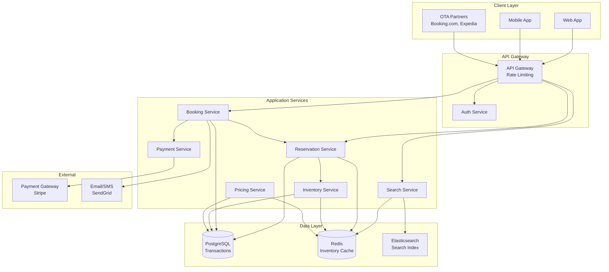

# Hotel Booking System with Availability, Reservation and Booking

## Requirements

### Functional Requirements
1. **Property Management**: Hotels can list rooms with types, amenities, photos, pricing
2. **Search & Discovery**: Search by location, dates, price, amenities with filters
3. **Real-Time Availability**: Show accurate room availability across all booking channels
4. **Reservations**: Hold rooms for limited time before payment
5. **Booking Confirmation**: Process payments and confirm bookings instantly
6. **Cancellation**: Support cancellation policies (free, partial refund, non-refundable)
7. **Overbooking Prevention**: Avoid double-booking while handling concurrent requests
8. **Pricing**: Dynamic pricing, seasonal rates, discounts
9. **Reviews & Ratings**: Guest reviews with verification
10. **Multi-Channel**: Integrate with OTAs (Booking.com, Expedia), direct bookings

### Non-Functional Requirements
1. **Availability**: 99.99% uptime (booking is critical revenue path)
2. **Consistency**: Strong consistency for inventory to prevent overbooking
3. **Latency**: <300ms for search, <1s for booking confirmation
4. **Scale**: 100K properties, 10M rooms, 1M bookings/day
5. **Concurrency**: Handle 10K simultaneous booking attempts
6. **Data Integrity**: ACID transactions for bookings and payments

## Scale Estimates

- **Properties**: 100K hotels/vacation rentals
- **Rooms**: Average 100 rooms per property = 10M total rooms
- **Bookings**: 1M bookings/day (~12 bookings/sec average, 200/sec peak)
- **Searches**: 100M searches/day (~1200/sec average, 10K/sec peak)
- **Reservations**: 5M reservations/day (many converted to bookings or expired)
- **Hold Period**: 15 minutes average reservation hold time
- **Read:Write Ratio**: 100:1 (searches >> bookings)
- **Storage**:
  - Room inventory: 10M × 2KB = 20GB
  - Bookings: 365M/year × 5KB = 1.8TB/year
  - Reviews: 100M × 1KB = 100GB

## High-Level Design



## Detailed Design

### 1. Database Schema (PostgreSQL)

```sql
CREATE TABLE properties (
    property_id UUID PRIMARY KEY,
    owner_id UUID NOT NULL,
    name VARCHAR(500) NOT NULL,
    description TEXT,
    address TEXT NOT NULL,
    city VARCHAR(100) NOT NULL,
    country VARCHAR(100) NOT NULL,
    latitude DECIMAL(10, 8),
    longitude DECIMAL(11, 8),
    star_rating DECIMAL(2, 1),
    check_in_time TIME,
    check_out_time TIME,
    cancellation_policy VARCHAR(50),  -- flexible, moderate, strict
    created_at TIMESTAMPTZ NOT NULL,
    INDEX idx_location (city, country),
    INDEX idx_geo (latitude, longitude)
);

CREATE TABLE room_types (
    room_type_id UUID PRIMARY KEY,
    property_id UUID NOT NULL,
    name VARCHAR(255) NOT NULL,
    description TEXT,
    max_occupancy INT NOT NULL,
    bed_type VARCHAR(50),
    size_sqm INT,
    amenities JSONB,  -- ['wifi', 'tv', 'minibar']
    photos JSONB,
    base_price DECIMAL(10, 2) NOT NULL,
    currency VARCHAR(3) DEFAULT 'USD',
    FOREIGN KEY (property_id) REFERENCES properties(property_id)
);

CREATE TABLE room_inventory (
    inventory_id UUID PRIMARY KEY,
    room_type_id UUID NOT NULL,
    date DATE NOT NULL,
    total_rooms INT NOT NULL,
    available_rooms INT NOT NULL,
    price DECIMAL(10, 2) NOT NULL,
    version INT NOT NULL DEFAULT 1,  -- For optimistic locking
    updated_at TIMESTAMPTZ NOT NULL,
    UNIQUE(room_type_id, date),
    FOREIGN KEY (room_type_id) REFERENCES room_types(room_type_id),
    INDEX idx_room_date (room_type_id, date),
    CHECK (available_rooms >= 0),
    CHECK (available_rooms <= total_rooms)
);

CREATE TABLE reservations (
    reservation_id UUID PRIMARY KEY,
    user_id UUID NOT NULL,
    room_type_id UUID NOT NULL,
    check_in_date DATE NOT NULL,
    check_out_date DATE NOT NULL,
    num_rooms INT NOT NULL DEFAULT 1,
    num_guests INT NOT NULL,
    status VARCHAR(20) NOT NULL,  -- pending, confirmed, cancelled, expired
    total_price DECIMAL(10, 2) NOT NULL,
    hold_expires_at TIMESTAMPTZ,
    created_at TIMESTAMPTZ NOT NULL,
    updated_at TIMESTAMPTZ NOT NULL,
    INDEX idx_user_reservations (user_id, created_at DESC),
    INDEX idx_status_expiry (status, hold_expires_at),
    FOREIGN KEY (room_type_id) REFERENCES room_types(room_type_id)
);

CREATE TABLE bookings (
    booking_id UUID PRIMARY KEY,
    reservation_id UUID NOT NULL,
    user_id UUID NOT NULL,
    property_id UUID NOT NULL,
    room_type_id UUID NOT NULL,
    check_in_date DATE NOT NULL,
    check_out_date DATE NOT NULL,
    num_rooms INT NOT NULL,
    num_guests INT NOT NULL,
    guest_name VARCHAR(255) NOT NULL,
    guest_email VARCHAR(255) NOT NULL,
    guest_phone VARCHAR(50),
    total_price DECIMAL(10, 2) NOT NULL,
    payment_id UUID,
    status VARCHAR(20) NOT NULL,  -- confirmed, checked_in, checked_out, cancelled
    booking_date TIMESTAMPTZ NOT NULL,
    cancellation_date TIMESTAMPTZ,
    refund_amount DECIMAL(10, 2),
    created_at TIMESTAMPTZ NOT NULL,
    updated_at TIMESTAMPTZ NOT NULL,
    INDEX idx_user_bookings (user_id, booking_date DESC),
    INDEX idx_property_checkin (property_id, check_in_date),
    FOREIGN KEY (reservation_id) REFERENCES reservations(reservation_id),
    FOREIGN KEY (property_id) REFERENCES properties(property_id)
);

CREATE TABLE payments (
    payment_id UUID PRIMARY KEY,
    booking_id UUID NOT NULL,
    amount DECIMAL(10, 2) NOT NULL,
    currency VARCHAR(3) NOT NULL,
    payment_method VARCHAR(50) NOT NULL,
    payment_provider VARCHAR(50) NOT NULL,
    transaction_id VARCHAR(255),  -- External provider transaction ID
    status VARCHAR(20) NOT NULL,  -- pending, completed, failed, refunded
    created_at TIMESTAMPTZ NOT NULL,
    FOREIGN KEY (booking_id) REFERENCES bookings(booking_id)
);
```

### 2. Inventory Service (Java)

Manages room availability with optimistic locking to prevent overbooking:

```java
@Service
public class InventoryService {
    private final RoomInventoryRepository inventoryRepository;
    private final RedisTemplate<String, Integer> redisTemplate;
    private final int MAX_RETRY_ATTEMPTS = 3;
    
    /**
     * Checks if rooms are available for the date range.
     * Uses Redis cache for fast reads (99% of requests).
     */
    public boolean isAvailable(UUID roomTypeId, LocalDate checkIn, LocalDate checkOut, int numRooms) {
        List<LocalDate> dates = getDatesInRange(checkIn, checkOut);
        
        for (LocalDate date : dates) {
            String cacheKey = String.format("inventory:%s:%s", roomTypeId, date);
            
            Integer available = redisTemplate.opsForValue().get(cacheKey);
            
            if (available == null) {
                // Cache miss - load from database
                RoomInventory inventory = inventoryRepository.findByRoomTypeAndDate(roomTypeId, date)
                    .orElseThrow(() -> new NotFoundException("Inventory not found"));
                
                available = inventory.getAvailableRooms();
                
                // Cache for 5 minutes
                redisTemplate.opsForValue().set(cacheKey, available, Duration.ofMinutes(5));
            }
            
            if (available < numRooms) {
                return false;  // Not enough rooms on this date
            }
        }
        
        return true;
    }
    
    /**
     * Reserves rooms using optimistic locking with retries.
     * This is the critical section that prevents double-booking.
     */
    @Transactional
    public void reserveRooms(UUID roomTypeId, LocalDate checkIn, LocalDate checkOut, int numRooms) {
        List<LocalDate> dates = getDatesInRange(checkIn, checkOut);
        List<RoomInventory> inventories = new ArrayList<>();
        
        // Load all inventory records with FOR UPDATE lock
        for (LocalDate date : dates) {
            RoomInventory inventory = inventoryRepository.findByRoomTypeAndDateForUpdate(roomTypeId, date)
                .orElseThrow(() -> new NotFoundException("Inventory not found for " + date));
            
            // Check availability
            if (inventory.getAvailableRooms() < numRooms) {
                throw new InsufficientInventoryException(
                    String.format("Only %d rooms available on %s", inventory.getAvailableRooms(), date)
                );
            }
            
            inventories.add(inventory);
        }
        
        // Decrement all inventory records
        for (RoomInventory inventory : inventories) {
            inventory.setAvailableRooms(inventory.getAvailableRooms() - numRooms);
            inventory.setVersion(inventory.getVersion() + 1);
            inventory.setUpdatedAt(Instant.now());
            
            inventoryRepository.save(inventory);
            
            // Invalidate cache
            String cacheKey = String.format("inventory:%s:%s", roomTypeId, inventory.getDate());
            redisTemplate.delete(cacheKey);
        }
    }
    
    /**
     * Releases reserved rooms (when reservation expires or is cancelled).
     */
    @Transactional
    public void releaseRooms(UUID roomTypeId, LocalDate checkIn, LocalDate checkOut, int numRooms) {
        List<LocalDate> dates = getDatesInRange(checkIn, checkOut);
        
        for (LocalDate date : dates) {
            RoomInventory inventory = inventoryRepository.findByRoomTypeAndDateForUpdate(roomTypeId, date)
                .orElseThrow(() -> new NotFoundException("Inventory not found"));
            
            inventory.setAvailableRooms(inventory.getAvailableRooms() + numRooms);
            inventory.setVersion(inventory.getVersion() + 1);
            inventory.setUpdatedAt(Instant.now());
            
            inventoryRepository.save(inventory);
            
            // Invalidate cache
            String cacheKey = String.format("inventory:%s:%s", roomTypeId, date);
            redisTemplate.delete(cacheKey);
        }
    }
    
    private List<LocalDate> getDatesInRange(LocalDate start, LocalDate end) {
        List<LocalDate> dates = new ArrayList<>();
        LocalDate current = start;
        
        // Note: We reserve all nights except checkout day
        while (current.isBefore(end)) {
            dates.add(current);
            current = current.plusDays(1);
        }
        
        return dates;
    }
}
```

### 3. Reservation Service (Java)

Handles temporary holds on rooms before payment:

```java
@Service
public class ReservationService {
    private final ReservationRepository reservationRepository;
    private final InventoryService inventoryService;
    private final PricingService pricingService;
    private final ScheduledExecutorService scheduler;
    
    private static final int HOLD_DURATION_MINUTES = 15;
    
    @PostConstruct
    public void init() {
        // Clean up expired reservations every minute
        scheduler.scheduleAtFixedRate(
            this::expireReservations,
            0,
            1,
            TimeUnit.MINUTES
        );
    }
    
    /**
     * Creates a reservation that holds rooms for 15 minutes.
     * Uses distributed lock to prevent race conditions.
     */
    @Transactional
    public ReservationResponse createReservation(CreateReservationRequest request, String userId) {
        // Validate dates
        if (!request.getCheckInDate().isBefore(request.getCheckOutDate())) {
            throw new ValidationException("Check-out must be after check-in");
        }
        
        // Calculate price
        BigDecimal totalPrice = pricingService.calculatePrice(
            request.getRoomTypeId(),
            request.getCheckInDate(),
            request.getCheckOutDate(),
            request.getNumRooms()
        );
        
        try {
            // Reserve inventory (with pessimistic locking)
            inventoryService.reserveRooms(
                request.getRoomTypeId(),
                request.getCheckInDate(),
                request.getCheckOutDate(),
                request.getNumRooms()
            );
            
            // Create reservation record
            Reservation reservation = Reservation.builder()
                .reservationId(UUID.randomUUID())
                .userId(userId)
                .roomTypeId(request.getRoomTypeId())
                .checkInDate(request.getCheckInDate())
                .checkOutDate(request.getCheckOutDate())
                .numRooms(request.getNumRooms())
                .numGuests(request.getNumGuests())
                .status("pending")
                .totalPrice(totalPrice)
                .holdExpiresAt(Instant.now().plus(Duration.ofMinutes(HOLD_DURATION_MINUTES)))
                .createdAt(Instant.now())
                .updatedAt(Instant.now())
                .build();
            
            reservation = reservationRepository.save(reservation);
            
            return toReservationResponse(reservation);
            
        } catch (InsufficientInventoryException e) {
            throw new BookingException("Rooms no longer available", e);
        }
    }
    
    /**
     * Expires reservations that have exceeded hold time.
     * Releases inventory back to available pool.
     */
    private void expireReservations() {
        Instant now = Instant.now();
        
        // Find all pending reservations that have expired
        List<Reservation> expired = reservationRepository.findExpiredReservations(now);
        
        for (Reservation reservation : expired) {
            try {
                // Release inventory
                inventoryService.releaseRooms(
                    reservation.getRoomTypeId(),
                    reservation.getCheckInDate(),
                    reservation.getCheckOutDate(),
                    reservation.getNumRooms()
                );
                
                // Update status
                reservation.setStatus("expired");
                reservation.setUpdatedAt(now);
                reservationRepository.save(reservation);
                
            } catch (Exception e) {
                // Log error but continue processing other expirations
                logger.error("Failed to expire reservation: " + reservation.getReservationId(), e);
            }
        }
    }
    
    /**
     * Cancels a reservation and releases inventory.
     */
    @Transactional
    public void cancelReservation(UUID reservationId, String userId) {
        Reservation reservation = reservationRepository.findById(reservationId)
            .orElseThrow(() -> new NotFoundException("Reservation not found"));
        
        // Verify ownership
        if (!reservation.getUserId().equals(userId)) {
            throw new UnauthorizedException("Cannot cancel another user's reservation");
        }
        
        // Can only cancel pending reservations
        if (!reservation.getStatus().equals("pending")) {
            throw new InvalidStateException("Can only cancel pending reservations");
        }
        
        // Release inventory
        inventoryService.releaseRooms(
            reservation.getRoomTypeId(),
            reservation.getCheckInDate(),
            reservation.getCheckOutDate(),
            reservation.getNumRooms()
        );
        
        // Update status
        reservation.setStatus("cancelled");
        reservation.setUpdatedAt(Instant.now());
        reservationRepository.save(reservation);
    }
}
```

### 4. Booking Service (Java)

Converts reservations to confirmed bookings after payment:

```java
@Service
public class BookingService {
    private final BookingRepository bookingRepository;
    private final ReservationRepository reservationRepository;
    private final PaymentService paymentService;
    private final NotificationService notificationService;
    
    /**
     * Confirms booking after successful payment.
     * Uses idempotency key to prevent duplicate bookings.
     */
    @Transactional
    public BookingResponse confirmBooking(ConfirmBookingRequest request, String userId) {
        // Check idempotency - prevent duplicate submissions
        Booking existing = bookingRepository.findByIdempotencyKey(request.getIdempotencyKey());
        if (existing != null) {
            return toBookingResponse(existing);  // Return existing booking
        }
        
        // Load reservation
        Reservation reservation = reservationRepository.findById(request.getReservationId())
            .orElseThrow(() -> new NotFoundException("Reservation not found"));
        
        // Verify ownership
        if (!reservation.getUserId().equals(userId)) {
            throw new UnauthorizedException("Cannot book another user's reservation");
        }
        
        // Check reservation status
        if (!reservation.getStatus().equals("pending")) {
            throw new InvalidStateException("Reservation is not pending");
        }
        
        // Check if reservation has expired
        if (reservation.getHoldExpiresAt().isBefore(Instant.now())) {
            throw new ReservationExpiredException("Reservation has expired");
        }
        
        try {
            // Process payment (with idempotency)
            PaymentResponse payment = paymentService.processPayment(
                PaymentRequest.builder()
                    .amount(reservation.getTotalPrice())
                    .currency("USD")
                    .paymentMethod(request.getPaymentMethod())
                    .idempotencyKey(request.getIdempotencyKey())
                    .build()
            );
            
            if (!payment.getStatus().equals("completed")) {
                throw new PaymentFailedException("Payment failed: " + payment.getErrorMessage());
            }
            
            // Create booking
            Booking booking = Booking.builder()
                .bookingId(UUID.randomUUID())
                .reservationId(reservation.getReservationId())
                .userId(userId)
                .propertyId(request.getPropertyId())
                .roomTypeId(reservation.getRoomTypeId())
                .checkInDate(reservation.getCheckInDate())
                .checkOutDate(reservation.getCheckOutDate())
                .numRooms(reservation.getNumRooms())
                .numGuests(reservation.getNumGuests())
                .guestName(request.getGuestName())
                .guestEmail(request.getGuestEmail())
                .guestPhone(request.getGuestPhone())
                .totalPrice(reservation.getTotalPrice())
                .paymentId(payment.getPaymentId())
                .status("confirmed")
                .bookingDate(Instant.now())
                .createdAt(Instant.now())
                .updatedAt(Instant.now())
                .build();
            
            booking = bookingRepository.save(booking);
            
            // Update reservation status
            reservation.setStatus("confirmed");
            reservation.setUpdatedAt(Instant.now());
            reservationRepository.save(reservation);
            
            // Send confirmation email
            sendBookingConfirmation(booking);
            
            return toBookingResponse(booking);
            
        } catch (PaymentFailedException e) {
            // Payment failed - reservation remains in pending state
            throw e;
        }
    }
    
    /**
     * Cancels a confirmed booking with refund based on policy.
     */
    @Transactional
    public CancellationResponse cancelBooking(UUID bookingId, String userId) {
        Booking booking = bookingRepository.findById(bookingId)
            .orElseThrow(() -> new NotFoundException("Booking not found"));
        
        // Verify ownership
        if (!booking.getUserId().equals(userId)) {
            throw new UnauthorizedException("Cannot cancel another user's booking");
        }
        
        // Cannot cancel if already checked in or checked out
        if (booking.getStatus().equals("checked_in") || booking.getStatus().equals("checked_out")) {
            throw new InvalidStateException("Cannot cancel after check-in");
        }
        
        // Load property cancellation policy
        Property property = propertyRepository.findById(booking.getPropertyId())
            .orElseThrow(() -> new NotFoundException("Property not found"));
        
        // Calculate refund amount
        BigDecimal refundAmount = calculateRefund(
            booking.getTotalPrice(),
            booking.getCheckInDate(),
            property.getCancellationPolicy()
        );
        
        // Process refund if applicable
        if (refundAmount.compareTo(BigDecimal.ZERO) > 0) {
            paymentService.processRefund(booking.getPaymentId(), refundAmount);
        }
        
        // Release inventory back to available pool
        inventoryService.releaseRooms(
            booking.getRoomTypeId(),
            booking.getCheckInDate(),
            booking.getCheckOutDate(),
            booking.getNumRooms()
        );
        
        // Update booking status
        booking.setStatus("cancelled");
        booking.setCancellationDate(Instant.now());
        booking.setRefundAmount(refundAmount);
        booking.setUpdatedAt(Instant.now());
        bookingRepository.save(booking);
        
        // Send cancellation confirmation
        sendCancellationConfirmation(booking, refundAmount);
        
        return CancellationResponse.builder()
            .bookingId(bookingId)
            .status("cancelled")
            .refundAmount(refundAmount)
            .build();
    }
    
    private BigDecimal calculateRefund(BigDecimal totalPrice, LocalDate checkInDate, String policy) {
        long daysUntilCheckIn = ChronoUnit.DAYS.between(LocalDate.now(), checkInDate);
        
        switch (policy) {
            case "flexible":
                // Full refund if cancelled 24 hours before check-in
                return daysUntilCheckIn >= 1 ? totalPrice : BigDecimal.ZERO;
                
            case "moderate":
                // Full refund if cancelled 5 days before, 50% if 2-5 days, none if <2 days
                if (daysUntilCheckIn >= 5) {
                    return totalPrice;
                } else if (daysUntilCheckIn >= 2) {
                    return totalPrice.multiply(new BigDecimal("0.5"));
                } else {
                    return BigDecimal.ZERO;
                }
                
            case "strict":
                // Full refund if cancelled 30 days before, 50% if 14-30 days, none if <14 days
                if (daysUntilCheckIn >= 30) {
                    return totalPrice;
                } else if (daysUntilCheckIn >= 14) {
                    return totalPrice.multiply(new BigDecimal("0.5"));
                } else {
                    return BigDecimal.ZERO;
                }
                
            default:
                return BigDecimal.ZERO;
        }
    }
}
```

### 5. Search Service (Java)

Elasticsearch-based search with filtering:

```java
@Service
public class SearchService {
    private final ElasticsearchTemplate elasticsearchTemplate;
    private final RedisTemplate<String, SearchResult> redisTemplate;
    
    public SearchResponse searchProperties(SearchRequest request) {
        // Check cache first (5-minute TTL)
        String cacheKey = generateCacheKey(request);
        SearchResult cached = redisTemplate.opsForValue().get(cacheKey);
        if (cached != null) {
            return cached.toResponse();
        }
        
        // Build Elasticsearch query
        BoolQueryBuilder query = QueryBuilders.boolQuery();
        
        // Location filter (city or coordinates)
        if (request.getCity() != null) {
            query.must(QueryBuilders.termQuery("city", request.getCity().toLowerCase()));
        }
        
        if (request.getLatitude() != null && request.getLongitude() != null) {
            // Find properties within radius
            query.filter(QueryBuilders.geoDistanceQuery("location")
                .point(request.getLatitude(), request.getLongitude())
                .distance(request.getRadiusKm(), DistanceUnit.KILOMETERS));
        }
        
        // Date availability filter (requires inventory check)
        if (request.getCheckInDate() != null && request.getCheckOutDate() != null) {
            // This requires a join with inventory - can be expensive
            // Option 1: Post-filter results from cache
            // Option 2: Maintain availability bitmap in Elasticsearch
            query.must(QueryBuilders.rangeQuery("available_dates")
                .gte(request.getCheckInDate())
                .lte(request.getCheckOutDate()));
        }
        
        // Price range filter
        if (request.getMinPrice() != null || request.getMaxPrice() != null) {
            RangeQueryBuilder priceQuery = QueryBuilders.rangeQuery("base_price");
            if (request.getMinPrice() != null) {
                priceQuery.gte(request.getMinPrice());
            }
            if (request.getMaxPrice() != null) {
                priceQuery.lte(request.getMaxPrice());
            }
            query.filter(priceQuery);
        }
        
        // Amenities filter
        if (request.getAmenities() != null && !request.getAmenities().isEmpty()) {
            for (String amenity : request.getAmenities()) {
                query.filter(QueryBuilders.termQuery("amenities", amenity));
            }
        }
        
        // Star rating filter
        if (request.getMinRating() != null) {
            query.filter(QueryBuilders.rangeQuery("star_rating")
                .gte(request.getMinRating()));
        }
        
        // Build search request
        NativeSearchQuery searchQuery = new NativeSearchQueryBuilder()
            .withQuery(query)
            .withPageable(PageRequest.of(
                request.getPage(),
                request.getPageSize(),
                Sort.by(request.getSortBy()).descending()
            ))
            .build();
        
        // Execute search
        SearchHits<PropertyDocument> hits = elasticsearchTemplate.search(
            searchQuery,
            PropertyDocument.class
        );
        
        List<PropertySummary> results = hits.stream()
            .map(hit -> toPropertySummary(hit.getContent()))
            .collect(Collectors.toList());
        
        SearchResult result = SearchResult.builder()
            .results(results)
            .totalResults(hits.getTotalHits())
            .page(request.getPage())
            .build();
        
        // Cache for 5 minutes
        redisTemplate.opsForValue().set(cacheKey, result, Duration.ofMinutes(5));
        
        return result.toResponse();
    }
}
```

## Technology Stack

| Component | Technology | Justification |
|-----------|-----------|---------------|
| **API Layer** | Spring Boot, REST | Enterprise-grade framework with transaction support |
| **Primary Database** | PostgreSQL | ACID transactions critical for preventing double-booking, pessimistic locking support |
| **Caching** | Redis | Fast inventory checks, distributed locks |
| **Search** | Elasticsearch | Geospatial queries, faceted search, full-text |
| **Payment** | Stripe | PCI-compliant payment processing |
| **Messaging** | Kafka | Event sourcing for audit trails |
| **Notifications** | SendGrid, Twilio | Email and SMS confirmations |

## Performance Optimizations

1. **Inventory Caching**: Cache availability with 5-minute TTL, invalidate on reservations
2. **Optimistic Locking**: Use version numbers to detect concurrent modifications
3. **Pessimistic Locking**: Use SELECT FOR UPDATE during reservation to guarantee consistency
4. **Search Caching**: Cache popular searches for 5 minutes
5. **Database Indexing**: B-tree on (room_type_id, date), covering index for availability checks
6. **Connection Pooling**: HikariCP with 50 connections per instance

## Trade-offs & Considerations

1. **Strong Consistency**:
   - **Chosen**: Pessimistic locking with SELECT FOR UPDATE
   - Trade-off: Higher latency vs guaranteed no overbooking
   
2. **Reservation Hold Time**:
   - **Chosen**: 15 minutes
   - Trade-off: Too short frustrates users, too long blocks inventory
   
3. **Overbooking Strategy**:
   - **Chosen**: Zero tolerance (strict consistency)
   - Trade-off: Lost revenue from last-minute cancellations vs customer trust
   - Alternative: Allow 5% overbooking (hotels do this)
   
4. **Cancellation Refunds**:
   - **Chosen**: Policy-based (flexible/moderate/strict)
   - Trade-off: Flexible policies encourage bookings but increase cancellation rate

## Summary

This hotel booking system handles 1M bookings/day with strong consistency guarantees to prevent double-booking. Key features:

1. **Pessimistic Locking**: SELECT FOR UPDATE prevents race conditions during concurrent bookings
2. **Reservation System**: 15-minute holds with automatic expiration and inventory release
3. **Idempotency**: Duplicate submissions return existing booking
4. **Cancellation Policies**: Flexible refund calculation based on property policy
5. **Real-Time Search**: Elasticsearch with geospatial and faceted filtering
6. **Event Sourcing**: Complete audit trail for compliance

The system scales horizontally with stateless API servers and achieves sub-second booking confirmation through Redis caching and efficient database indexing.
