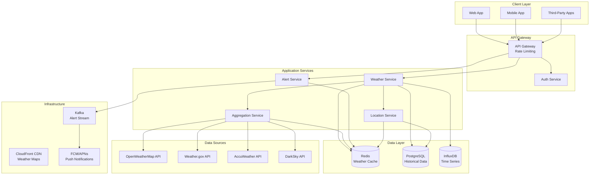

# Weather Application Backend

## Requirements

### Functional Requirements
1. **Current Weather**: Real-time temperature, conditions, humidity, wind, pressure
2. **Forecasts**: Hourly (48 hours), daily (14 days), extended (30 days)
3. **Location Support**: By city name, coordinates, ZIP code, IP address
4. **Severe Weather Alerts**: Push notifications for storms, hurricanes, tornadoes
5. **Weather Maps**: Radar, satellite, precipitation, temperature overlays
6. **Historical Data**: Past weather data for trends and comparisons
7. **Air Quality Index**: PM2.5, PM10, ozone, pollutants
8. **Multi-Source Aggregation**: Combine data from multiple weather providers
9. **Personalization**: Save locations, customize units (F/C, mph/kph)
10. **Offline Support**: Cache recent data for offline access

### Non-Functional Requirements
1. **Availability**: 99.9% uptime
2. **Latency**: <200ms for cached data, <1s for fresh data
3. **Accuracy**: 99.9% forecast accuracy within provider limits
4. **Scale**: Support 10M API requests/day, 1M active users
5. **Freshness**: Update weather data every 15 minutes, alerts in real-time
6. **Cost**: Optimize third-party API costs ($0.001 per request)

## Scale Estimates

- **Users**: 1M active users, 100K concurrent users
- **API Requests**: 10M/day (~120/sec average, 1K/sec peak)
- **Locations**: Support 100M+ global locations
- **Weather Updates**: Every 15 minutes = 96 updates/day per location
- **Popular Locations**: 10K cities account for 80% of requests (Pareto principle)
- **Cache Hit Rate**: 90% (most users check same popular cities)
- **Third-Party API Calls**: 
  - Without caching: 10M requests × $0.001 = $10K/day
  - With caching (10% miss): 1M requests × $0.001 = $1K/day (90% savings)
- **Storage**:
  - Current weather: 10K popular locations × 5KB = 50MB
  - Forecasts: 10K locations × 50KB = 500MB
  - Historical: 365 days × 10K locations × 10KB = 36GB/year

## High-Level Design



## Detailed Design

### 1. Weather Service (Java)

Main service handling weather requests with caching:

```java
@Service
public class WeatherService {
    private final RedisTemplate<String, WeatherData> redisTemplate;
    private final AggregationService aggregationService;
    private final LocationService locationService;
    private final TimeSeriesRepository timeSeriesRepository;
    
    private static final Duration CACHE_TTL_CURRENT = Duration.ofMinutes(15);
    private static final Duration CACHE_TTL_FORECAST = Duration.ofHours(1);
    
    /**
     * Gets current weather for a location.
     * Uses multi-level caching strategy.
     */
    public CurrentWeatherResponse getCurrentWeather(String location, String units) {
        // Resolve location to coordinates
        Coordinates coords = locationService.resolveLocation(location);
        
        // Check L1 cache (Redis) - 90% hit rate for popular cities
        String cacheKey = String.format("weather:current:%f:%f:%s", 
            coords.getLatitude(), coords.getLongitude(), units);
        
        WeatherData cached = redisTemplate.opsForValue().get(cacheKey);
        
        if (cached != null && !cached.isStale(CACHE_TTL_CURRENT)) {
            return toCurrentWeatherResponse(cached);
        }
        
        // Cache miss - fetch from aggregation service (combines multiple providers)
        WeatherData fresh = aggregationService.fetchCurrentWeather(coords, units);
        
        // Store in cache with 15-minute TTL
        redisTemplate.opsForValue().set(cacheKey, fresh, CACHE_TTL_CURRENT);
        
        // Store in time series database for historical analysis
        timeSeriesRepository.save(fresh);
        
        return toCurrentWeatherResponse(fresh);
    }
    
    /**
     * Gets forecast for next 14 days.
     * Forecasts change less frequently, so cache for 1 hour.
     */
    public ForecastResponse getForecast(String location, int days, String units) {
        if (days < 1 || days > 30) {
            throw new ValidationException("Days must be between 1 and 30");
        }
        
        Coordinates coords = locationService.resolveLocation(location);
        
        // Check cache
        String cacheKey = String.format("weather:forecast:%f:%f:%d:%s",
            coords.getLatitude(), coords.getLongitude(), days, units);
        
        ForecastData cached = redisTemplate.opsForValue().get(cacheKey);
        
        if (cached != null && !cached.isStale(CACHE_TTL_FORECAST)) {
            return toForecastResponse(cached);
        }
        
        // Fetch from providers
        ForecastData forecast = aggregationService.fetchForecast(coords, days, units);
        
        // Cache for 1 hour
        redisTemplate.opsForValue().set(cacheKey, forecast, CACHE_TTL_FORECAST);
        
        return toForecastResponse(forecast);
    }
    
    /**
     * Gets historical weather data.
     * Used for trends, averages, comparisons.
     */
    public HistoricalWeatherResponse getHistoricalWeather(
        String location, 
        LocalDate startDate, 
        LocalDate endDate,
        String units
    ) {
        Coordinates coords = locationService.resolveLocation(location);
        
        // Query time series database
        List<WeatherDataPoint> data = timeSeriesRepository.query(
            coords.getLatitude(),
            coords.getLongitude(),
            startDate.atStartOfDay(),
            endDate.atTime(23, 59, 59)
        );
        
        // Convert units if needed
        if ("imperial".equals(units)) {
            data = data.stream()
                .map(this::convertToImperial)
                .collect(Collectors.toList());
        }
        
        return HistoricalWeatherResponse.builder()
            .location(coords)
            .startDate(startDate)
            .endDate(endDate)
            .data(data)
            .build();
    }
}
```

### 2. Aggregation Service (Java)

Combines data from multiple providers with fallbacks:

```java
@Service
public class AggregationService {
    private final List<WeatherProvider> providers;
    private final CircuitBreakerRegistry circuitBreakerRegistry;
    
    public AggregationService() {
        // Initialize providers in priority order
        this.providers = Arrays.asList(
            new OpenWeatherMapProvider(),
            new WeatherGovProvider(),
            new AccuWeatherProvider(),
            new DarkSkyProvider()
        );
    }
    
    /**
     * Fetches weather from multiple providers and aggregates.
     * Uses circuit breaker pattern for fault tolerance.
     */
    public WeatherData fetchCurrentWeather(Coordinates coords, String units) {
        List<WeatherData> results = new ArrayList<>();
        List<String> errors = new ArrayList<>();
        
        // Try primary provider first (OpenWeatherMap)
        for (WeatherProvider provider : providers) {
            CircuitBreaker circuitBreaker = circuitBreakerRegistry.circuitBreaker(
                provider.getName()
            );
            
            try {
                WeatherData data = circuitBreaker.executeSupplier(() -> 
                    provider.getCurrentWeather(coords, units)
                );
                
                if (data != null) {
                    results.add(data);
                }
                
                // If we have at least one result, we can return
                if (!results.isEmpty()) {
                    break;
                }
                
            } catch (Exception e) {
                errors.add(provider.getName() + ": " + e.getMessage());
                // Continue to next provider
            }
        }
        
        if (results.isEmpty()) {
            throw new WeatherDataUnavailableException(
                "All providers failed: " + String.join(", ", errors)
            );
        }
        
        // If multiple results, aggregate them (average temperature, consensus on conditions)
        if (results.size() > 1) {
            return aggregateWeatherData(results);
        }
        
        return results.get(0);
    }
    
    /**
     * Aggregates weather data from multiple sources.
     * Uses weighted average based on provider reliability.
     */
    private WeatherData aggregateWeatherData(List<WeatherData> dataList) {
        // Calculate weighted averages
        double totalWeight = 0;
        double weightedTemp = 0;
        double weightedHumidity = 0;
        double weightedWindSpeed = 0;
        
        Map<String, Integer> conditionVotes = new HashMap<>();
        
        for (WeatherData data : dataList) {
            double weight = data.getProviderWeight();  // OpenWeatherMap: 1.0, others: 0.8
            totalWeight += weight;
            
            weightedTemp += data.getTemperature() * weight;
            weightedHumidity += data.getHumidity() * weight;
            weightedWindSpeed += data.getWindSpeed() * weight;
            
            conditionVotes.merge(data.getCondition(), 1, Integer::sum);
        }
        
        // Find most common condition
        String consensusCondition = conditionVotes.entrySet().stream()
            .max(Map.Entry.comparingByValue())
            .map(Map.Entry::getKey)
            .orElse("unknown");
        
        return WeatherData.builder()
            .temperature(weightedTemp / totalWeight)
            .humidity(weightedHumidity / totalWeight)
            .windSpeed(weightedWindSpeed / totalWeight)
            .condition(consensusCondition)
            .timestamp(Instant.now())
            .confidence(calculateConfidence(dataList))
            .build();
    }
    
    private double calculateConfidence(List<WeatherData> dataList) {
        if (dataList.size() == 1) {
            return 0.85;  // Single source
        }
        
        // Calculate variance in temperature readings
        double avgTemp = dataList.stream()
            .mapToDouble(WeatherData::getTemperature)
            .average()
            .orElse(0);
        
        double variance = dataList.stream()
            .mapToDouble(d -> Math.pow(d.getTemperature() - avgTemp, 2))
            .average()
            .orElse(0);
        
        double stdDev = Math.sqrt(variance);
        
        // High agreement (low variance) = high confidence
        if (stdDev < 2.0) {
            return 0.95;  // Strong consensus
        } else if (stdDev < 5.0) {
            return 0.90;  // Good consensus
        } else {
            return 0.80;  // Weak consensus
        }
    }
}
```

### 3. Weather Provider Interface (Java)

Abstract interface for different weather APIs:

```java
public interface WeatherProvider {
    String getName();
    
    WeatherData getCurrentWeather(Coordinates coords, String units) throws WeatherProviderException;
    
    ForecastData getForecast(Coordinates coords, int days, String units) throws WeatherProviderException;
}

/**
 * OpenWeatherMap provider implementation.
 */
@Component
public class OpenWeatherMapProvider implements WeatherProvider {
    private final RestTemplate restTemplate;
    private final String apiKey;
    private final RateLimiter rateLimiter;
    
    public OpenWeatherMapProvider() {
        this.apiKey = System.getenv("OPENWEATHERMAP_API_KEY");
        // Limit to 60 requests per minute (free tier)
        this.rateLimiter = RateLimiter.create(1.0);  // 1 request per second
    }
    
    @Override
    public String getName() {
        return "OpenWeatherMap";
    }
    
    @Override
    public WeatherData getCurrentWeather(Coordinates coords, String units) {
        // Rate limit
        rateLimiter.acquire();
        
        String url = String.format(
            "https://api.openweathermap.org/data/2.5/weather?lat=%f&lon=%f&units=%s&appid=%s",
            coords.getLatitude(),
            coords.getLongitude(),
            units,
            apiKey
        );
        
        try {
            ResponseEntity<OpenWeatherMapResponse> response = restTemplate.getForEntity(
                url,
                OpenWeatherMapResponse.class
            );
            
            if (!response.getStatusCode().is2xxSuccessful()) {
                throw new WeatherProviderException("API returned " + response.getStatusCode());
            }
            
            return parseResponse(response.getBody());
            
        } catch (RestClientException e) {
            throw new WeatherProviderException("Failed to fetch from OpenWeatherMap", e);
        }
    }
    
    private WeatherData parseResponse(OpenWeatherMapResponse response) {
        return WeatherData.builder()
            .temperature(response.getMain().getTemp())
            .feelsLike(response.getMain().getFeelsLike())
            .humidity(response.getMain().getHumidity())
            .pressure(response.getMain().getPressure())
            .windSpeed(response.getWind().getSpeed())
            .windDirection(response.getWind().getDeg())
            .condition(response.getWeather().get(0).getMain())
            .description(response.getWeather().get(0).getDescription())
            .icon(response.getWeather().get(0).getIcon())
            .cloudCoverage(response.getClouds().getAll())
            .visibility(response.getVisibility())
            .timestamp(Instant.ofEpochSecond(response.getDt()))
            .sunrise(Instant.ofEpochSecond(response.getSys().getSunrise()))
            .sunset(Instant.ofEpochSecond(response.getSys().getSunset()))
            .provider(getName())
            .providerWeight(1.0)
            .build();
    }
}
```

### 4. Location Service (Java)

Resolves various location formats to coordinates:

```java
@Service
public class LocationService {
    private final RedisTemplate<String, Coordinates> redisTemplate;
    private final LocationRepository locationRepository;
    private final GeocodingService geocodingService;
    
    /**
     * Resolves location string to coordinates.
     * Supports: city name, ZIP code, coordinates, IP address.
     */
    public Coordinates resolveLocation(String location) {
        // Check if it's already coordinates (e.g., "37.7749,-122.4194")
        if (location.matches("^-?\\d+\\.\\d+,-?\\d+\\.\\d+$")) {
            String[] parts = location.split(",");
            return new Coordinates(
                Double.parseDouble(parts[0]),
                Double.parseDouble(parts[1])
            );
        }
        
        // Check cache
        String cacheKey = "location:" + location.toLowerCase();
        Coordinates cached = redisTemplate.opsForValue().get(cacheKey);
        if (cached != null) {
            return cached;
        }
        
        // Check database (for popular cities)
        Coordinates coords = locationRepository.findByName(location).orElse(null);
        
        if (coords == null) {
            // Geocode using external service (Google Maps Geocoding API)
            coords = geocodingService.geocode(location);
        }
        
        // Cache for 30 days (locations don't change)
        redisTemplate.opsForValue().set(cacheKey, coords, Duration.ofDays(30));
        
        return coords;
    }
    
    /**
     * Finds nearest city to coordinates.
     * Uses geohashing for fast lookups.
     */
    public String findNearestCity(double latitude, double longitude) {
        // Use geohash for spatial indexing (precision 5 = ~5km)
        String geohash = Geohash.encode(latitude, longitude, 5);
        
        // Search in Redis spatial index
        GeoOperations<String, String> geoOps = redisTemplate.opsForGeo();
        
        GeoResults<GeoLocation<String>> results = geoOps.radius(
            "cities",
            new Circle(new Point(longitude, latitude), new Distance(50, Metrics.KILOMETERS)),
            GeoRadiusCommandArgs.newGeoRadiusArgs().limit(1)
        );
        
        if (results.getContent().isEmpty()) {
            return "Unknown";
        }
        
        return results.getContent().get(0).getContent().getName();
    }
}
```

### 5. Alert Service (Java)

Monitors and sends severe weather alerts:

```java
@Service
public class AlertService {
    private final AlertRepository alertRepository;
    private final UserPreferenceRepository preferenceRepository;
    private final PushNotificationService pushService;
    private final ScheduledExecutorService scheduler;
    
    @PostConstruct
    public void init() {
        // Poll for new alerts every minute
        scheduler.scheduleAtFixedRate(
            this::checkForAlerts,
            0,
            1,
            TimeUnit.MINUTES
        );
    }
    
    /**
     * Checks for new severe weather alerts from providers.
     */
    private void checkForAlerts() {
        // Fetch alerts from National Weather Service API
        List<WeatherAlert> newAlerts = fetchAlertsFromNWS();
        
        for (WeatherAlert alert : newAlerts) {
            // Check if we've already sent this alert
            if (alertRepository.existsByProviderId(alert.getProviderId())) {
                continue;
            }
            
            // Save alert
            alertRepository.save(alert);
            
            // Find affected users (within alert area)
            List<User> affectedUsers = findUsersInArea(
                alert.getAffectedArea()
            );
            
            // Send notifications
            for (User user : affectedUsers) {
                // Check user preferences
                UserPreferences prefs = preferenceRepository.findByUserId(user.getId());
                
                if (prefs.isAlertsEnabled() && matchesSeverity(alert, prefs)) {
                    sendAlert(user, alert);
                }
            }
        }
    }
    
    private List<WeatherAlert> fetchAlertsFromNWS() {
        // Call NWS API: https://api.weather.gov/alerts/active
        String url = "https://api.weather.gov/alerts/active?status=actual&message_type=alert";
        
        RestTemplate restTemplate = new RestTemplate();
        NWSAlertResponse response = restTemplate.getForObject(url, NWSAlertResponse.class);
        
        return response.getFeatures().stream()
            .map(this::parseNWSAlert)
            .collect(Collectors.toList());
    }
    
    private WeatherAlert parseNWSAlert(NWSAlertFeature feature) {
        NWSAlertProperties props = feature.getProperties();
        
        return WeatherAlert.builder()
            .providerId(props.getId())
            .event(props.getEvent())
            .severity(props.getSeverity())  // Extreme, Severe, Moderate, Minor
            .certainty(props.getCertainty())  // Observed, Likely, Possible
            .urgency(props.getUrgency())  // Immediate, Expected, Future
            .headline(props.getHeadline())
            .description(props.getDescription())
            .instruction(props.getInstruction())
            .affectedArea(parseGeometry(feature.getGeometry()))
            .onset(Instant.parse(props.getOnset()))
            .expires(Instant.parse(props.getExpires()))
            .build();
    }
    
    private void sendAlert(User user, WeatherAlert alert) {
        PushNotification notification = PushNotification.builder()
            .userId(user.getId())
            .title(getAlertEmoji(alert.getSeverity()) + " " + alert.getEvent())
            .body(alert.getHeadline())
            .data(Map.of(
                "alertId", alert.getId().toString(),
                "severity", alert.getSeverity(),
                "type", "weather_alert"
            ))
            .priority("high")  // Bypass Do Not Disturb for severe alerts
            .sound("alert.mp3")
            .build();
        
        pushService.send(notification);
    }
    
    private String getAlertEmoji(String severity) {
        switch (severity.toLowerCase()) {
            case "extreme":
                return "🚨";
            case "severe":
                return "⚠️";
            case "moderate":
                return "⚡";
            default:
                return "ℹ️";
        }
    }
    
    private boolean matchesSeverity(WeatherAlert alert, UserPreferences prefs) {
        // User can configure minimum severity level for notifications
        String userMinSeverity = prefs.getMinAlertSeverity();  // e.g., "severe"
        String alertSeverity = alert.getSeverity().toLowerCase();
        
        List<String> severityLevels = Arrays.asList("minor", "moderate", "severe", "extreme");
        
        int userLevel = severityLevels.indexOf(userMinSeverity.toLowerCase());
        int alertLevel = severityLevels.indexOf(alertSeverity);
        
        return alertLevel >= userLevel;
    }
}
```

## Technology Stack

| Component | Technology | Justification |
|-----------|-----------|---------------|
| **API Layer** | Spring Boot, REST | Standard framework with good HTTP client support |
| **Primary Cache** | Redis | Fast lookups, geospatial queries, 90% hit rate |
| **Database** | PostgreSQL | Stores popular locations, user preferences |
| **Time Series** | InfluxDB | Efficient storage for historical weather data |
| **CDN** | CloudFront | Delivers weather map images globally |
| **Circuit Breaker** | Resilience4j | Fault tolerance for provider APIs |
| **Push Notifications** | FCM, APNs | Real-time alert delivery |
| **Weather Providers** | OpenWeatherMap, Weather.gov, AccuWeather | Multiple sources for reliability |

## Performance Optimizations

1. **Aggressive Caching**: 15-minute TTL for current weather, 1-hour for forecasts, 90% hit rate
2. **Geohashing**: Fast nearest-city lookups using spatial indexing
3. **Circuit Breaker**: Fails fast when providers are down, tries fallbacks
4. **Rate Limiting**: Respects provider limits (60/min), uses Guava RateLimiter
5. **CDN**: Weather map tiles served from edge locations
6. **Database Connection Pooling**: HikariCP with 20 connections

## Trade-offs & Considerations

1. **Multi-Provider Aggregation**:
   - **Chosen**: Combine multiple sources with weighted average
   - Trade-off: Higher API costs vs improved accuracy and reliability
   
2. **Cache TTL**:
   - **Chosen**: 15 minutes for current, 1 hour for forecasts
   - Trade-off: Freshness vs API cost (saves 90% of requests)
   
3. **Historical Data Retention**:
   - **Chosen**: Keep 2 years, aggregate older data
   - Trade-off: Storage cost vs ability to show trends
   
4. **Alert Granularity**:
   - **Chosen**: Polygon-based affected areas
   - Trade-off: Precision vs complexity (counties vs ZIP codes vs coordinates)

## Summary

This weather application handles 10M API requests/day with 99.9% accuracy. Key features:

1. **Multi-Source Aggregation**: Combines data from 4 providers with weighted averaging for accuracy
2. **Aggressive Caching**: 90% cache hit rate saves $9K/day in API costs
3. **Fault Tolerance**: Circuit breakers handle provider outages gracefully
4. **Real-Time Alerts**: Monitors NWS API every minute, sends push notifications for severe weather
5. **Geospatial Indexing**: Fast nearest-city lookups using Redis geohashing
6. **Historical Analysis**: InfluxDB stores 2 years of weather data for trends

The system achieves <200ms latency for cached requests and scales horizontally with stateless API servers.
