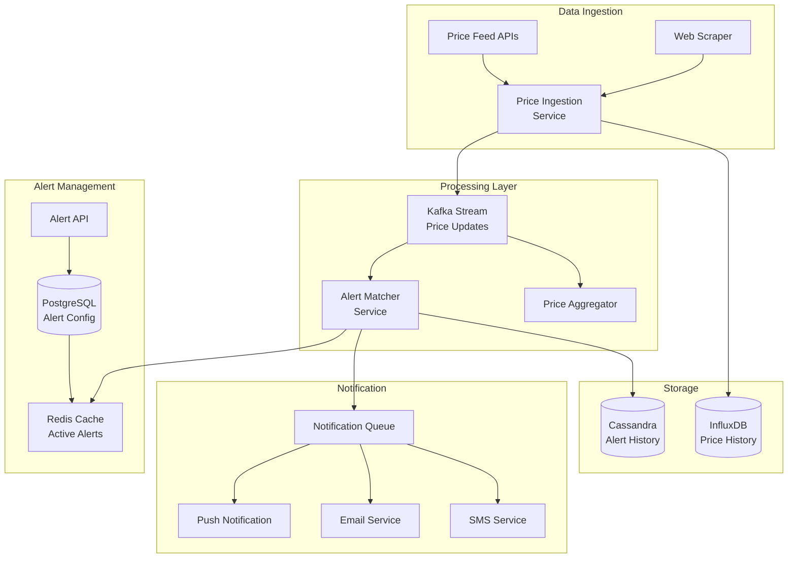
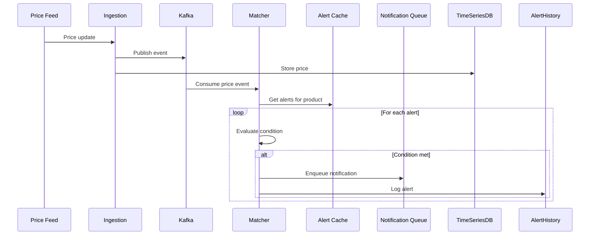

# Price Alert System for Products or Stocks

[← Back to Topics](../topics.md#price-alert-system-for-products-or-stocks)

## Problem Statement

Design a price monitoring system that tracks 10M products/stocks and sends alerts to 100M users when price thresholds are met. Support complex conditions (% drop, absolute price, competitor pricing).

---

## Requirements

### Functional Requirements
1. **Create Alerts**: Users set price thresholds
2. **Alert Types**: Absolute price, % change, target price
3. **Notification**: Push, email, SMS
4. **Historical Prices**: Track price history
5. **Multiple Products**: Track multiple items per user
6. **Alert Frequency**: Once, daily, always
7. **Competitor Comparison**: Track competitor pricing

### Non-Functional Requirements
1. **Scale**: 10M products, 100M users, 500M alerts
2. **Latency**: <5 min alert delivery
3. **Throughput**: 10K price updates/sec
4. **Accuracy**: 99.9% alerts delivered
5. **Availability**: 99.9% uptime
6. **Storage**: 1 TB price history

### Scale Estimates
- **Products tracked**: 10 million
- **Active alerts**: 500 million
- **Price updates**: 10K/sec
- **Alerts triggered**: 100K/day
- **Notification delivery**: 1M/day
- **Storage**: 1 TB (price history)

---

## High-Level Architecture



---

## Detailed Design

### 1. Alert Matching Flow



---

### 2. Alert Matcher Service

```java
import java.util.*;
import java.util.concurrent.*;
import org.apache.kafka.clients.consumer.*;

/**
 * Alert matcher service
 * Consumes price updates and triggers matching alerts
 */
public class AlertMatcherService {
    
    private final KafkaConsumer<String, PriceUpdate> consumer;
    private final AlertCacheService alertCache;
    private final NotificationQueue notificationQueue;
    private final AlertHistoryService historyService;
    private final PriceHistoryService priceHistory;
    
    private static final int BATCH_SIZE = 100;
    
    public AlertMatcherService(
        KafkaConsumer<String, PriceUpdate> consumer,
        AlertCacheService alertCache,
        NotificationQueue notificationQueue,
        AlertHistoryService historyService,
        PriceHistoryService priceHistory
    ) {
        this.consumer = consumer;
        this.alertCache = alertCache;
        this.notificationQueue = notificationQueue;
        this.historyService = historyService;
        this.priceHistory = priceHistory;
    }
    
    /**
     * Start consuming price updates
     */
    public void start() {
        
        consumer.subscribe(Collections.singletonList("price_updates"));
        
        while (true) {
            
            ConsumerRecords<String, PriceUpdate> records = consumer.poll(
                Duration.ofMillis(100)
            );
            
            for (ConsumerRecord<String, PriceUpdate> record : records) {
                processPriceUpdate(record.value());
            }
            
            consumer.commitSync();
        }
    }
    
    /**
     * Process a price update
     */
    private void processPriceUpdate(PriceUpdate update) {
        
        String productId = update.getProductId();
        double newPrice = update.getPrice();
        long timestamp = update.getTimestamp();
        
        // Get all alerts for this product
        List<PriceAlert> alerts = alertCache.getAlerts(productId);
        
        if (alerts.isEmpty()) {
            return;
        }
        
        // Evaluate each alert
        for (PriceAlert alert : alerts) {
            
            if (shouldTriggerAlert(alert, update)) {
                
                // Create notification
                Notification notification = createNotification(alert, update);
                
                // Enqueue for delivery
                notificationQueue.enqueue(notification);
                
                // Log alert trigger
                historyService.logAlert(alert.getId(), productId, timestamp, newPrice);
                
                // Update alert status
                updateAlertStatus(alert);
            }
        }
    }
    
    /**
     * Check if alert should be triggered
     */
    private boolean shouldTriggerAlert(PriceAlert alert, PriceUpdate update) {
        
        double newPrice = update.getPrice();
        
        switch (alert.getType()) {
            
            case PRICE_DROP_BELOW:
                return newPrice <= alert.getThreshold();
                
            case PRICE_RISE_ABOVE:
                return newPrice >= alert.getThreshold();
                
            case PERCENTAGE_DROP:
                return checkPercentageDrop(alert, update);
                
            case PERCENTAGE_RISE:
                return checkPercentageRise(alert, update);
                
            case PRICE_CHANGE:
                return checkPriceChange(alert, update);
                
            default:
                return false;
        }
    }
    
    /**
     * Check percentage drop condition
     */
    private boolean checkPercentageDrop(PriceAlert alert, PriceUpdate update) {
        
        String productId = alert.getProductId();
        long baseTimestamp = update.getTimestamp() - alert.getTimeWindow();
        
        // Get historical price
        Double basePrice = priceHistory.getPriceAt(productId, baseTimestamp);
        
        if (basePrice == null) {
            return false;
        }
        
        double currentPrice = update.getPrice();
        double percentChange = ((currentPrice - basePrice) / basePrice) * 100;
        
        return percentChange <= -alert.getThreshold();
    }
    
    /**
     * Check percentage rise condition
     */
    private boolean checkPercentageRise(PriceAlert alert, PriceUpdate update) {
        
        String productId = alert.getProductId();
        long baseTimestamp = update.getTimestamp() - alert.getTimeWindow();
        
        Double basePrice = priceHistory.getPriceAt(productId, baseTimestamp);
        
        if (basePrice == null) {
            return false;
        }
        
        double currentPrice = update.getPrice();
        double percentChange = ((currentPrice - basePrice) / basePrice) * 100;
        
        return percentChange >= alert.getThreshold();
    }
    
    /**
     * Check price change (any direction)
     */
    private boolean checkPriceChange(PriceAlert alert, PriceUpdate update) {
        
        String productId = alert.getProductId();
        
        Double lastPrice = priceHistory.getLatestPrice(productId);
        
        if (lastPrice == null) {
            return false;
        }
        
        double currentPrice = update.getPrice();
        
        return Math.abs(currentPrice - lastPrice) >= alert.getThreshold();
    }
    
    /**
     * Create notification from alert
     */
    private Notification createNotification(PriceAlert alert, PriceUpdate update) {
        
        Notification notification = new Notification();
        notification.setUserId(alert.getUserId());
        notification.setType(alert.getNotificationType());
        notification.setProductId(update.getProductId());
        notification.setNewPrice(update.getPrice());
        notification.setAlertThreshold(alert.getThreshold());
        notification.setMessage(buildAlertMessage(alert, update));
        
        return notification;
    }
    
    /**
     * Build alert message
     */
    private String buildAlertMessage(PriceAlert alert, PriceUpdate update) {
        
        String productName = update.getProductName();
        double price = update.getPrice();
        
        switch (alert.getType()) {
            case PRICE_DROP_BELOW:
                return String.format(
                    "%s is now $%.2f (below your target of $%.2f)",
                    productName, price, alert.getThreshold()
                );
                
            case PERCENTAGE_DROP:
                return String.format(
                    "%s has dropped %.1f%% to $%.2f",
                    productName, alert.getThreshold(), price
                );
                
            default:
                return String.format(
                    "Price alert: %s is now $%.2f",
                    productName, price
                );
        }
    }
    
    /**
     * Update alert status after triggering
     */
    private void updateAlertStatus(PriceAlert alert) {
        
        switch (alert.getFrequency()) {
            
            case ONCE:
                // Deactivate alert after first trigger
                alertCache.deactivateAlert(alert.getId());
                break;
                
            case DAILY:
                // Set cooldown period
                alertCache.setCooldown(alert.getId(), 86400);  // 24 hours
                break;
                
            case ALWAYS:
                // No cooldown, can trigger again
                break;
        }
    }
}

/**
 * Price update event
 */
class PriceUpdate {
    
    private String productId;
    private String productName;
    private double price;
    private String currency;
    private long timestamp;
    private String source;
    
    // Getters and setters
    public String getProductId() { return productId; }
    public void setProductId(String productId) { this.productId = productId; }
    
    public String getProductName() { return productName; }
    public void setProductName(String productName) { this.productName = productName; }
    
    public double getPrice() { return price; }
    public void setPrice(double price) { this.price = price; }
    
    public String getCurrency() { return currency; }
    public void setCurrency(String currency) { this.currency = currency; }
    
    public long getTimestamp() { return timestamp; }
    public void setTimestamp(long timestamp) { this.timestamp = timestamp; }
    
    public String getSource() { return source; }
    public void setSource(String source) { this.source = source; }
}

/**
 * Price alert
 */
class PriceAlert {
    
    private String id;
    private String userId;
    private String productId;
    private AlertType type;
    private double threshold;
    private long timeWindow;  // For percentage-based alerts
    private AlertFrequency frequency;
    private NotificationType notificationType;
    private boolean active;
    
    // Getters and setters
    public String getId() { return id; }
    public void setId(String id) { this.id = id; }
    
    public String getUserId() { return userId; }
    public void setUserId(String userId) { this.userId = userId; }
    
    public String getProductId() { return productId; }
    public void setProductId(String productId) { this.productId = productId; }
    
    public AlertType getType() { return type; }
    public void setType(AlertType type) { this.type = type; }
    
    public double getThreshold() { return threshold; }
    public void setThreshold(double threshold) { this.threshold = threshold; }
    
    public long getTimeWindow() { return timeWindow; }
    public void setTimeWindow(long timeWindow) { this.timeWindow = timeWindow; }
    
    public AlertFrequency getFrequency() { return frequency; }
    public void setFrequency(AlertFrequency frequency) { this.frequency = frequency; }
    
    public NotificationType getNotificationType() { return notificationType; }
    public void setNotificationType(NotificationType notificationType) { 
        this.notificationType = notificationType; 
    }
    
    public boolean isActive() { return active; }
    public void setActive(boolean active) { this.active = active; }
}

/**
 * Alert types
 */
enum AlertType {
    PRICE_DROP_BELOW,      // Price drops below X
    PRICE_RISE_ABOVE,      // Price rises above X
    PERCENTAGE_DROP,       // Price drops by X%
    PERCENTAGE_RISE,       // Price rises by X%
    PRICE_CHANGE           // Price changes by X (any direction)
}

/**
 * Alert frequency
 */
enum AlertFrequency {
    ONCE,      // Trigger once then deactivate
    DAILY,     // Max once per day
    ALWAYS     // Trigger whenever condition met
}

/**
 * Notification types
 */
enum NotificationType {
    PUSH,
    EMAIL,
    SMS,
    ALL
}

/**
 * Notification
 */
class Notification {
    
    private String userId;
    private NotificationType type;
    private String productId;
    private double newPrice;
    private double alertThreshold;
    private String message;
    
    // Getters and setters
    public String getUserId() { return userId; }
    public void setUserId(String userId) { this.userId = userId; }
    
    public NotificationType getType() { return type; }
    public void setType(NotificationType type) { this.type = type; }
    
    public String getProductId() { return productId; }
    public void setProductId(String productId) { this.productId = productId; }
    
    public double getNewPrice() { return newPrice; }
    public void setNewPrice(double newPrice) { this.newPrice = newPrice; }
    
    public double getAlertThreshold() { return alertThreshold; }
    public void setAlertThreshold(double alertThreshold) { 
        this.alertThreshold = alertThreshold; 
    }
    
    public String getMessage() { return message; }
    public void setMessage(String message) { this.message = message; }
}
```

---

### 3. Alert Cache Service

```java
import redis.clients.jedis.*;
import java.util.*;
import java.util.stream.Collectors;

/**
 * Alert cache service
 * Caches active alerts in Redis for fast lookups
 */
public class AlertCacheService {
    
    private final JedisPool jedisPool;
    
    public AlertCacheService(JedisPool jedisPool) {
        this.jedisPool = jedisPool;
    }
    
    /**
     * Get all alerts for a product
     * Uses inverted index: product_id -> [alert_ids]
     */
    public List<PriceAlert> getAlerts(String productId) {
        
        try (Jedis jedis = jedisPool.getResource()) {
            
            String key = "alerts:product:" + productId;
            
            // Get alert IDs
            Set<String> alertIds = jedis.smembers(key);
            
            if (alertIds.isEmpty()) {
                return Collections.emptyList();
            }
            
            // Get alert details
            List<PriceAlert> alerts = new ArrayList<>();
            
            for (String alertId : alertIds) {
                
                // Check if alert is in cooldown
                if (isInCooldown(alertId)) {
                    continue;
                }
                
                Map<String, String> alertData = jedis.hgetAll("alert:" + alertId);
                
                if (!alertData.isEmpty()) {
                    PriceAlert alert = deserializeAlert(alertData);
                    alerts.add(alert);
                }
            }
            
            return alerts;
        }
    }
    
    /**
     * Add alert to cache
     */
    public void addAlert(PriceAlert alert) {
        
        try (Jedis jedis = jedisPool.getResource()) {
            
            String alertKey = "alert:" + alert.getId();
            String productKey = "alerts:product:" + alert.getProductId();
            String userKey = "alerts:user:" + alert.getUserId();
            
            // Store alert details
            jedis.hmset(alertKey, serializeAlert(alert));
            
            // Add to product index
            jedis.sadd(productKey, alert.getId());
            
            // Add to user index
            jedis.sadd(userKey, alert.getId());
        }
    }
    
    /**
     * Deactivate alert
     */
    public void deactivateAlert(String alertId) {
        
        try (Jedis jedis = jedisPool.getResource()) {
            
            jedis.hset("alert:" + alertId, "active", "false");
        }
    }
    
    /**
     * Set cooldown period for alert
     */
    public void setCooldown(String alertId, int seconds) {
        
        try (Jedis jedis = jedisPool.getResource()) {
            
            String cooldownKey = "cooldown:" + alertId;
            jedis.setex(cooldownKey, seconds, "1");
        }
    }
    
    /**
     * Check if alert is in cooldown
     */
    private boolean isInCooldown(String alertId) {
        
        try (Jedis jedis = jedisPool.getResource()) {
            
            String cooldownKey = "cooldown:" + alertId;
            return jedis.exists(cooldownKey);
        }
    }
    
    /**
     * Serialize alert to Redis hash
     */
    private Map<String, String> serializeAlert(PriceAlert alert) {
        
        Map<String, String> data = new HashMap<>();
        data.put("id", alert.getId());
        data.put("userId", alert.getUserId());
        data.put("productId", alert.getProductId());
        data.put("type", alert.getType().name());
        data.put("threshold", String.valueOf(alert.getThreshold()));
        data.put("timeWindow", String.valueOf(alert.getTimeWindow()));
        data.put("frequency", alert.getFrequency().name());
        data.put("notificationType", alert.getNotificationType().name());
        data.put("active", String.valueOf(alert.isActive()));
        
        return data;
    }
    
    /**
     * Deserialize alert from Redis hash
     */
    private PriceAlert deserializeAlert(Map<String, String> data) {
        
        PriceAlert alert = new PriceAlert();
        alert.setId(data.get("id"));
        alert.setUserId(data.get("userId"));
        alert.setProductId(data.get("productId"));
        alert.setType(AlertType.valueOf(data.get("type")));
        alert.setThreshold(Double.parseDouble(data.get("threshold")));
        alert.setTimeWindow(Long.parseLong(data.get("timeWindow")));
        alert.setFrequency(AlertFrequency.valueOf(data.get("frequency")));
        alert.setNotificationType(NotificationType.valueOf(data.get("notificationType")));
        alert.setActive(Boolean.parseBoolean(data.get("active")));
        
        return alert;
    }
}

/**
 * Notification queue
 */
interface NotificationQueue {
    void enqueue(Notification notification);
}

/**
 * Alert history service
 */
interface AlertHistoryService {
    void logAlert(String alertId, String productId, long timestamp, double price);
}

/**
 * Price history service
 */
interface PriceHistoryService {
    Double getPriceAt(String productId, long timestamp);
    Double getLatestPrice(String productId);
}
```

---

## Technology Stack

| Component | Technology | Justification |
|-----------|------------|---------------|
| **Message Queue** | Kafka | High throughput |
| **Cache** | Redis | Fast alert lookups |
| **Time Series DB** | InfluxDB | Price history |
| **Alert History** | Cassandra | High write throughput |
| **Notification** | SNS/FCM/Twilio | Multi-channel delivery |

---

## Performance Characteristics

### Ingestion Performance
```
Price updates: 10K/sec
Kafka throughput: 100K msg/sec
Write latency: <10ms
```

### Alert Matching Performance
```
Alert lookups: <5ms (Redis)
Matching: <100ms per product
Alert delivery: <5 min
```

---

## Trade-offs

### 1. Matching Strategy
- **Real-time**: Immediate, expensive
- **Batch**: Delayed, cost-effective

### 2. Storage
- **Hot storage**: Fast, expensive
- **Cold storage**: Slow, cheap

### 3. Notification
- **Instant**: Fresh, costly
- **Batched**: Delayed, efficient

---

## Summary

This design provides:
- ✅ **10M products** tracked
- ✅ **500M alerts** supported
- ✅ **<5 min** alert delivery
- ✅ **10K price updates/sec** throughput
- ✅ **Complex conditions** (%, absolute, change)
- ✅ **Multi-channel** notifications

**Key Features:**
1. Kafka for price event streaming
2. Redis inverted index for fast alert lookups
3. InfluxDB for price history
4. Percentage-based and absolute alerts
5. Cooldown periods and frequencies
6. Multi-channel notifications

[← Back to Topics](../topics.md#price-alert-system-for-products-or-stocks)
