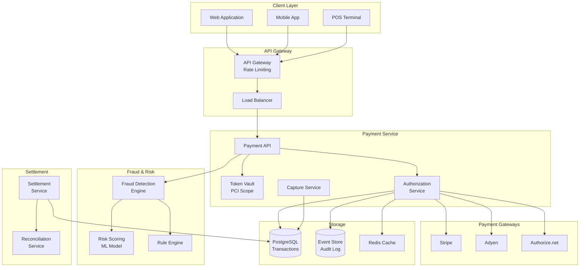
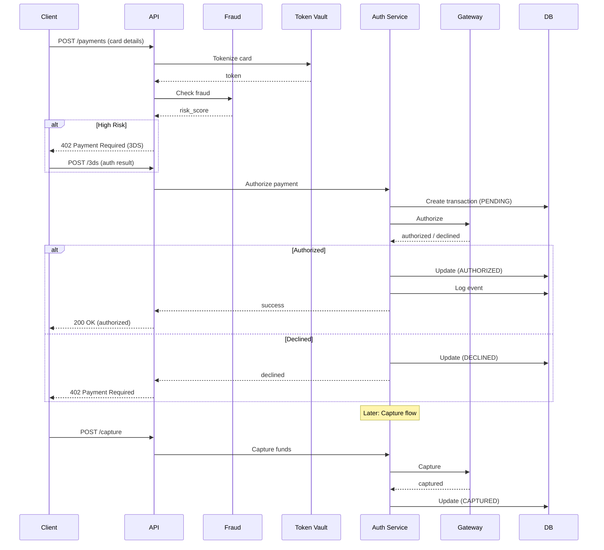

# Credit Card Processing Engine

[← Back to Topics](../topics.md#credit-card-processing-engine)

## Problem Statement

Design a payment processing system that handles credit card transactions with fraud detection, 3D Secure, PCI DSS compliance, and settlement. Process 10K TPS with 99.999% availability.

---

## Requirements

### Functional Requirements
1. **Authorization**: Validate and authorize transactions
2. **Capture**: Capture authorized funds
3. **Refunds**: Process refunds and reversals
4. **3D Secure**: Support 3DS authentication
5. **Fraud Detection**: Real-time fraud checks
6. **Tokenization**: Secure card storage
7. **Settlement**: Daily settlement with banks
8. **Webhooks**: Notify merchants of events

### Non-Functional Requirements
1. **Throughput**: 10K TPS
2. **Availability**: 99.999% (5 min/year downtime)
3. **Latency**: <500ms authorization
4. **Security**: PCI DSS Level 1 compliance
5. **Idempotency**: Exactly-once processing
6. **Audit**: Complete transaction audit trail

### Scale Estimates
- **Transactions per day**: 864 million
- **Transactions per second**: 10,000 avg, 50K peak
- **Payment gateways**: 5+ providers
- **Merchants**: 100,000
- **Storage**: 10 TB transaction data
- **Settlement files**: 1GB/day

---

## High-Level Architecture



---

## Detailed Design

### 1. Payment Flow



---

### 2. Payment Service

```java
import java.util.*;
import java.util.concurrent.*;

/**
 * Payment processing service
 * Handles authorization, capture, refunds
 */
public class PaymentService {
    
    private final TokenVaultService tokenVault;
    private final FraudDetectionService fraudDetection;
    private final AuthorizationService authService;
    private final TransactionRepository txnRepository;
    private final EventStore eventStore;
    private final IdempotencyService idempotency;
    
    public PaymentService(
        TokenVaultService tokenVault,
        FraudDetectionService fraudDetection,
        AuthorizationService authService,
        TransactionRepository txnRepository,
        EventStore eventStore,
        IdempotencyService idempotency
    ) {
        this.tokenVault = tokenVault;
        this.fraudDetection = fraudDetection;
        this.authService = authService;
        this.txnRepository = txnRepository;
        this.eventStore = eventStore;
        this.idempotency = idempotency;
    }
    
    /**
     * Process payment authorization
     */
    public PaymentResult authorizePayment(PaymentRequest request) {
        
        // Check idempotency
        String idempotencyKey = request.getIdempotencyKey();
        
        if (idempotencyKey != null) {
            PaymentResult cached = idempotency.get(idempotencyKey);
            if (cached != null) {
                return cached;
            }
        }
        
        // Validate request
        validatePaymentRequest(request);
        
        // Tokenize card
        String token = tokenVault.tokenize(request.getCardDetails());
        
        // Create transaction record
        Transaction txn = createTransaction(request, token);
        txnRepository.save(txn);
        
        // Fraud check
        FraudCheckResult fraudCheck = fraudDetection.checkTransaction(txn);
        
        if (fraudCheck.getRiskLevel() == RiskLevel.HIGH) {
            
            // Require 3D Secure
            if (!request.isThreeDSecureCompleted()) {
                return PaymentResult.requires3DS(
                    txn.getId(),
                    fraudCheck.getThreeDSUrl()
                );
            }
        }
        
        if (fraudCheck.getRiskLevel() == RiskLevel.BLOCK) {
            
            // Block transaction
            txn.setStatus(TransactionStatus.DECLINED);
            txn.setDeclineReason("Fraud detected");
            txnRepository.update(txn);
            
            eventStore.log(new TransactionDeclinedEvent(txn.getId(), "fraud"));
            
            return PaymentResult.declined("Fraud detected");
        }
        
        // Authorize with payment gateway
        AuthorizationResult authResult = authService.authorize(txn, token);
        
        if (authResult.isApproved()) {
            
            txn.setStatus(TransactionStatus.AUTHORIZED);
            txn.setAuthorizationCode(authResult.getAuthCode());
            txn.setGatewayTransactionId(authResult.getGatewayTxnId());
            txnRepository.update(txn);
            
            eventStore.log(new TransactionAuthorizedEvent(txn.getId()));
            
            PaymentResult result = PaymentResult.success(txn.getId());
            
            // Cache for idempotency
            if (idempotencyKey != null) {
                idempotency.put(idempotencyKey, result, 86400);  // 24 hours
            }
            
            return result;
            
        } else {
            
            txn.setStatus(TransactionStatus.DECLINED);
            txn.setDeclineReason(authResult.getDeclineReason());
            txnRepository.update(txn);
            
            eventStore.log(new TransactionDeclinedEvent(
                txn.getId(),
                authResult.getDeclineReason()
            ));
            
            return PaymentResult.declined(authResult.getDeclineReason());
        }
    }
    
    /**
     * Capture authorized payment
     */
    public PaymentResult capturePayment(String transactionId, CaptureRequest request) {
        
        // Load transaction
        Transaction txn = txnRepository.findById(transactionId);
        
        if (txn == null) {
            throw new PaymentException("Transaction not found");
        }
        
        if (txn.getStatus() != TransactionStatus.AUTHORIZED) {
            throw new PaymentException("Transaction not in AUTHORIZED state");
        }
        
        // Capture with gateway
        CaptureResult captureResult = authService.capture(
            txn,
            request.getAmount()
        );
        
        if (captureResult.isSuccess()) {
            
            txn.setStatus(TransactionStatus.CAPTURED);
            txn.setCapturedAmount(request.getAmount());
            txn.setCapturedAt(System.currentTimeMillis());
            txnRepository.update(txn);
            
            eventStore.log(new TransactionCapturedEvent(
                txn.getId(),
                request.getAmount()
            ));
            
            return PaymentResult.success(txn.getId());
            
        } else {
            
            return PaymentResult.failed(captureResult.getErrorMessage());
        }
    }
    
    /**
     * Refund payment
     */
    public PaymentResult refundPayment(String transactionId, RefundRequest request) {
        
        // Load transaction
        Transaction txn = txnRepository.findById(transactionId);
        
        if (txn == null) {
            throw new PaymentException("Transaction not found");
        }
        
        if (txn.getStatus() != TransactionStatus.CAPTURED) {
            throw new PaymentException("Transaction not captured");
        }
        
        // Check refund amount
        double refundableAmount = txn.getCapturedAmount() - txn.getRefundedAmount();
        
        if (request.getAmount() > refundableAmount) {
            throw new PaymentException("Refund amount exceeds captured amount");
        }
        
        // Process refund with gateway
        RefundResult refundResult = authService.refund(txn, request.getAmount());
        
        if (refundResult.isSuccess()) {
            
            double newRefundedAmount = txn.getRefundedAmount() + request.getAmount();
            txn.setRefundedAmount(newRefundedAmount);
            
            if (newRefundedAmount >= txn.getCapturedAmount()) {
                txn.setStatus(TransactionStatus.REFUNDED);
            } else {
                txn.setStatus(TransactionStatus.PARTIALLY_REFUNDED);
            }
            
            txnRepository.update(txn);
            
            eventStore.log(new TransactionRefundedEvent(
                txn.getId(),
                request.getAmount()
            ));
            
            return PaymentResult.success(txn.getId());
            
        } else {
            
            return PaymentResult.failed(refundResult.getErrorMessage());
        }
    }
    
    /**
     * Create transaction record
     */
    private Transaction createTransaction(PaymentRequest request, String token) {
        
        Transaction txn = new Transaction();
        txn.setId(UUID.randomUUID().toString());
        txn.setMerchantId(request.getMerchantId());
        txn.setAmount(request.getAmount());
        txn.setCurrency(request.getCurrency());
        txn.setCardToken(token);
        txn.setStatus(TransactionStatus.PENDING);
        txn.setCreatedAt(System.currentTimeMillis());
        txn.setDescription(request.getDescription());
        txn.setCustomerEmail(request.getCustomerEmail());
        
        return txn;
    }
    
    /**
     * Validate payment request
     */
    private void validatePaymentRequest(PaymentRequest request) {
        
        if (request.getAmount() <= 0) {
            throw new PaymentException("Amount must be positive");
        }
        
        if (request.getCurrency() == null) {
            throw new PaymentException("Currency is required");
        }
        
        if (request.getCardDetails() == null) {
            throw new PaymentException("Card details are required");
        }
    }
}

/**
 * Transaction
 */
class Transaction {
    
    private String id;
    private String merchantId;
    private double amount;
    private String currency;
    private String cardToken;
    private TransactionStatus status;
    private long createdAt;
    private String authorizationCode;
    private String gatewayTransactionId;
    private String declineReason;
    private double capturedAmount;
    private long capturedAt;
    private double refundedAmount;
    private String description;
    private String customerEmail;
    
    // Getters and setters
    public String getId() { return id; }
    public void setId(String id) { this.id = id; }
    
    public String getMerchantId() { return merchantId; }
    public void setMerchantId(String merchantId) { this.merchantId = merchantId; }
    
    public double getAmount() { return amount; }
    public void setAmount(double amount) { this.amount = amount; }
    
    public String getCurrency() { return currency; }
    public void setCurrency(String currency) { this.currency = currency; }
    
    public String getCardToken() { return cardToken; }
    public void setCardToken(String cardToken) { this.cardToken = cardToken; }
    
    public TransactionStatus getStatus() { return status; }
    public void setStatus(TransactionStatus status) { this.status = status; }
    
    public long getCreatedAt() { return createdAt; }
    public void setCreatedAt(long createdAt) { this.createdAt = createdAt; }
    
    public String getAuthorizationCode() { return authorizationCode; }
    public void setAuthorizationCode(String authorizationCode) { 
        this.authorizationCode = authorizationCode; 
    }
    
    public String getGatewayTransactionId() { return gatewayTransactionId; }
    public void setGatewayTransactionId(String gatewayTransactionId) { 
        this.gatewayTransactionId = gatewayTransactionId; 
    }
    
    public String getDeclineReason() { return declineReason; }
    public void setDeclineReason(String declineReason) { 
        this.declineReason = declineReason; 
    }
    
    public double getCapturedAmount() { return capturedAmount; }
    public void setCapturedAmount(double capturedAmount) { 
        this.capturedAmount = capturedAmount; 
    }
    
    public long getCapturedAt() { return capturedAt; }
    public void setCapturedAt(long capturedAt) { this.capturedAt = capturedAt; }
    
    public double getRefundedAmount() { return refundedAmount; }
    public void setRefundedAmount(double refundedAmount) { 
        this.refundedAmount = refundedAmount; 
    }
    
    public String getDescription() { return description; }
    public void setDescription(String description) { this.description = description; }
    
    public String getCustomerEmail() { return customerEmail; }
    public void setCustomerEmail(String customerEmail) { 
        this.customerEmail = customerEmail; 
    }
}

/**
 * Transaction status
 */
enum TransactionStatus {
    PENDING,
    AUTHORIZED,
    CAPTURED,
    PARTIALLY_REFUNDED,
    REFUNDED,
    DECLINED,
    FAILED
}

/**
 * Payment request
 */
class PaymentRequest {
    private String merchantId;
    private double amount;
    private String currency;
    private CardDetails cardDetails;
    private String idempotencyKey;
    private boolean threeDSecureCompleted;
    private String description;
    private String customerEmail;
    
    // Getters
    public String getMerchantId() { return merchantId; }
    public double getAmount() { return amount; }
    public String getCurrency() { return currency; }
    public CardDetails getCardDetails() { return cardDetails; }
    public String getIdempotencyKey() { return idempotencyKey; }
    public boolean isThreeDSecureCompleted() { return threeDSecureCompleted; }
    public String getDescription() { return description; }
    public String getCustomerEmail() { return customerEmail; }
}

/**
 * Card details (PCI scope)
 */
class CardDetails {
    private String number;
    private String cvv;
    private String expiryMonth;
    private String expiryYear;
    private String holderName;
}

/**
 * Payment result
 */
class PaymentResult {
    private boolean success;
    private String transactionId;
    private boolean requires3DS;
    private String threeDSUrl;
    private String declineReason;
    private String errorMessage;
    
    public static PaymentResult success(String transactionId) {
        PaymentResult result = new PaymentResult();
        result.success = true;
        result.transactionId = transactionId;
        return result;
    }
    
    public static PaymentResult requires3DS(String transactionId, String threeDSUrl) {
        PaymentResult result = new PaymentResult();
        result.requires3DS = true;
        result.transactionId = transactionId;
        result.threeDSUrl = threeDSUrl;
        return result;
    }
    
    public static PaymentResult declined(String reason) {
        PaymentResult result = new PaymentResult();
        result.success = false;
        result.declineReason = reason;
        return result;
    }
    
    public static PaymentResult failed(String errorMessage) {
        PaymentResult result = new PaymentResult();
        result.success = false;
        result.errorMessage = errorMessage;
        return result;
    }
    
    public boolean isSuccess() { return success; }
    public String getTransactionId() { return transactionId; }
    public boolean requiresThreeDS() { return requires3DS; }
    public String getThreeDSUrl() { return threeDSUrl; }
    public String getDeclineReason() { return declineReason; }
}

// Placeholder classes and interfaces
class CaptureRequest {
    private double amount;
    public double getAmount() { return amount; }
}

class RefundRequest {
    private double amount;
    public double getAmount() { return amount; }
}

class PaymentException extends RuntimeException {
    public PaymentException(String message) { super(message); }
}

interface TokenVaultService {
    String tokenize(CardDetails cardDetails);
}

interface FraudDetectionService {
    FraudCheckResult checkTransaction(Transaction txn);
}

class FraudCheckResult {
    private RiskLevel riskLevel;
    private String threeDSUrl;
    
    public RiskLevel getRiskLevel() { return riskLevel; }
    public String getThreeDSUrl() { return threeDSUrl; }
}

enum RiskLevel {
    LOW, MEDIUM, HIGH, BLOCK
}

interface AuthorizationService {
    AuthorizationResult authorize(Transaction txn, String token);
    CaptureResult capture(Transaction txn, double amount);
    RefundResult refund(Transaction txn, double amount);
}

class AuthorizationResult {
    private boolean approved;
    private String authCode;
    private String gatewayTxnId;
    private String declineReason;
    
    public boolean isApproved() { return approved; }
    public String getAuthCode() { return authCode; }
    public String getGatewayTxnId() { return gatewayTxnId; }
    public String getDeclineReason() { return declineReason; }
}

class CaptureResult {
    private boolean success;
    private String errorMessage;
    
    public boolean isSuccess() { return success; }
    public String getErrorMessage() { return errorMessage; }
}

class RefundResult {
    private boolean success;
    private String errorMessage;
    
    public boolean isSuccess() { return success; }
    public String getErrorMessage() { return errorMessage; }
}

interface TransactionRepository {
    void save(Transaction txn);
    void update(Transaction txn);
    Transaction findById(String id);
}

interface EventStore {
    void log(Object event);
}

interface IdempotencyService {
    PaymentResult get(String key);
    void put(String key, PaymentResult result, int ttlSeconds);
}

class TransactionAuthorizedEvent {
    private String transactionId;
    public TransactionAuthorizedEvent(String transactionId) {
        this.transactionId = transactionId;
    }
}

class TransactionDeclinedEvent {
    private String transactionId;
    private String reason;
    public TransactionDeclinedEvent(String transactionId, String reason) {
        this.transactionId = transactionId;
        this.reason = reason;
    }
}

class TransactionCapturedEvent {
    private String transactionId;
    private double amount;
    public TransactionCapturedEvent(String transactionId, double amount) {
        this.transactionId = transactionId;
        this.amount = amount;
    }
}

class TransactionRefundedEvent {
    private String transactionId;
    private double amount;
    public TransactionRefundedEvent(String transactionId, double amount) {
        this.transactionId = transactionId;
        this.amount = amount;
    }
}
```

---

## Technology Stack

| Component | Technology | Justification |
|-----------|------------|---------------|
| **Transaction DB** | PostgreSQL | ACID transactions |
| **Event Store** | EventStoreDB | Audit trail |
| **Cache** | Redis | Idempotency, sessions |
| **Gateway** | Stripe/Adyen | PCI compliant |
| **Fraud Detection** | Sift/Forter | ML-based fraud |
| **Encryption** | AES-256, RSA | PCI DSS |

---

## Performance Characteristics

### Transaction Processing
```
Authorization: <500ms p99
Capture: <200ms p99
Throughput: 10K TPS
Peak capacity: 50K TPS
```

### Availability
```
Uptime: 99.999% (5 min/year)
Failover: <30s
Data durability: 99.999999999%
```

---

## Trade-offs

### 1. Authorization vs Capture
- **Immediate capture**: Fast, no cancellations
- **Delayed capture**: Flexible, auth expiry risk

### 2. Gateway Strategy
- **Single gateway**: Simple, single point of failure
- **Multiple gateways**: Redundant, complex routing

### 3. Fraud Detection
- **Strict**: Low fraud, high false positives
- **Lenient**: High acceptance, more fraud

---

## Summary

This design provides:
- ✅ **10K TPS** transaction processing
- ✅ **99.999%** availability
- ✅ **<500ms** authorization latency
- ✅ **PCI DSS** compliance
- ✅ **Exactly-once** processing (idempotency)
- ✅ **Complete audit** trail

**Key Features:**
1. PCI-compliant tokenization
2. Fraud detection with 3D Secure
3. Idempotency for retry safety
4. Event sourcing for audit
5. Multi-gateway support
6. Auth/Capture/Refund flows

[← Back to Topics](../topics.md#credit-card-processing-engine)
