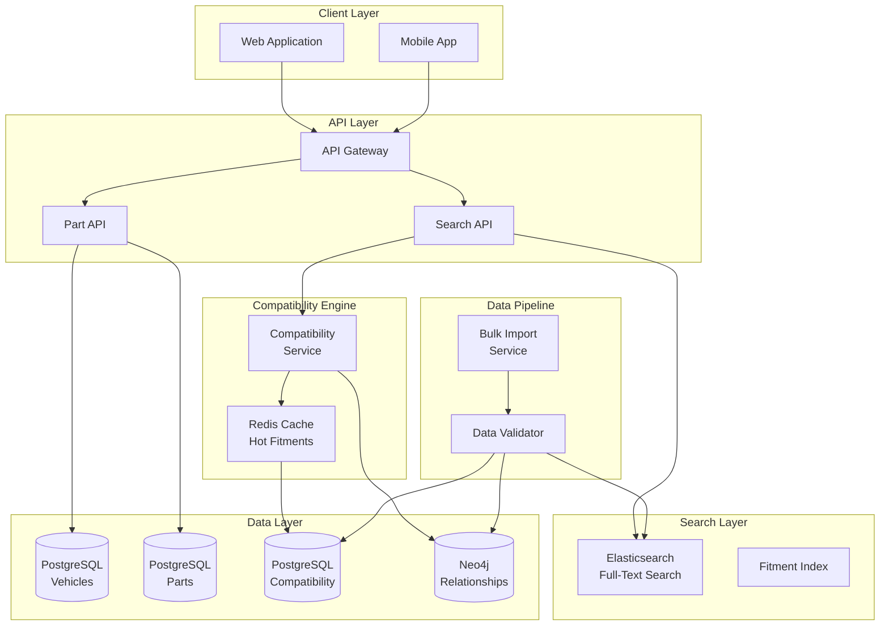
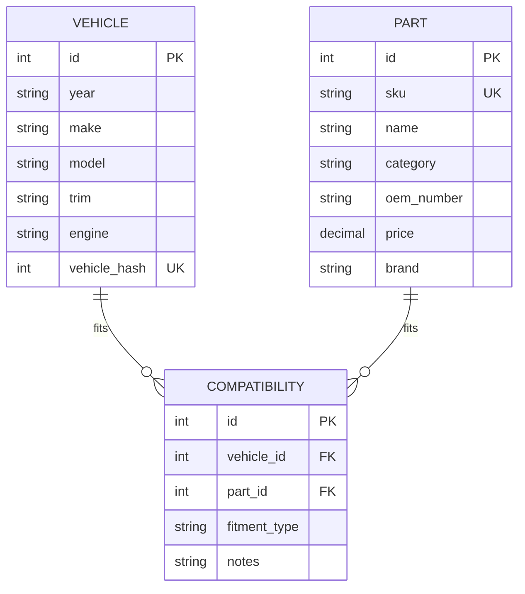

# Parts Compatibility System for E-commerce

[← Back to Topics](../topics.md#parts-compatibility-system-for-an-e-commerce-site-like-auto-parts)

## Problem Statement

Design a product compatibility matching system for automotive parts supporting year/make/model/trim lookup, cross-reference tables, and fitment data. Handle 100M compatibility records with sub-second search.

---

## Requirements

### Functional Requirements
1. **Fitment Search**: Find parts by vehicle (year/make/model/trim)
2. **Part Search**: Find vehicles for a given part
3. **Cross-Reference**: OEM to aftermarket mapping
4. **Universal Parts**: Parts that fit all vehicles
5. **Bulk Import**: Import compatibility data
6. **Search Filters**: Filter by category, price, brand

### Non-Functional Requirements
1. **Scale**: 100M compatibility records
2. **Latency**: <500ms search response
3. **Accuracy**: 99.9% correct fitments
4. **Throughput**: 10K searches/sec
5. **Availability**: 99.9% uptime
6. **Cache Hit Rate**: >80%

### Scale Estimates
- **Parts catalog**: 10 million parts
- **Vehicles**: 100K (year/make/model/trim combinations)
- **Compatibility records**: 100 million
- **Searches per day**: 10 million
- **Storage**: 500 GB
- **Cache**: 50 GB hot data

---

## High-Level Architecture



---

## Detailed Design

### 1. Data Model



---

### 2. Compatibility Service

```java
import java.util.*;
import java.util.stream.Collectors;
import redis.clients.jedis.*;

/**
 * Compatibility service
 * Matches parts to vehicles and vice versa
 */
public class CompatibilityService {
    
    private final VehicleRepository vehicleRepository;
    private final PartRepository partRepository;
    private final CompatibilityRepository compatRepository;
    private final JedisPool jedisPool;
    private final ElasticsearchClient elasticsearchClient;
    
    private static final int CACHE_TTL_SECONDS = 3600;
    
    public CompatibilityService(
        VehicleRepository vehicleRepository,
        PartRepository partRepository,
        CompatibilityRepository compatRepository,
        JedisPool jedisPool,
        ElasticsearchClient elasticsearchClient
    ) {
        this.vehicleRepository = vehicleRepository;
        this.partRepository = partRepository;
        this.compatRepository = compatRepository;
        this.jedisPool = jedisPool;
        this.elasticsearchClient = elasticsearchClient;
    }
    
    /**
     * Find parts that fit a vehicle
     */
    public List<Part> findPartsForVehicle(VehicleQuery query) {
        
        // Build vehicle identifier
        Vehicle vehicle = findOrCreateVehicle(query);
        
        if (vehicle == null) {
            return Collections.emptyList();
        }
        
        // Check cache
        String cacheKey = "vehicle_parts:" + vehicle.getId();
        
        try (Jedis jedis = jedisPool.getResource()) {
            
            String cached = jedis.get(cacheKey);
            
            if (cached != null) {
                List<Integer> partIds = deserializePartIds(cached);
                return partRepository.findByIds(partIds);
            }
        }
        
        // Query database
        List<Integer> partIds = compatRepository.findPartsForVehicle(vehicle.getId());
        
        // Cache result
        try (Jedis jedis = jedisPool.getResource()) {
            jedis.setex(cacheKey, CACHE_TTL_SECONDS, serializePartIds(partIds));
        }
        
        return partRepository.findByIds(partIds);
    }
    
    /**
     * Find vehicles that a part fits
     */
    public List<Vehicle> findVehiclesForPart(String partSku) {
        
        // Find part
        Part part = partRepository.findBySku(partSku);
        
        if (part == null) {
            return Collections.emptyList();
        }
        
        // Check cache
        String cacheKey = "part_vehicles:" + part.getId();
        
        try (Jedis jedis = jedisPool.getResource()) {
            
            String cached = jedis.get(cacheKey);
            
            if (cached != null) {
                List<Integer> vehicleIds = deserializeVehicleIds(cached);
                return vehicleRepository.findByIds(vehicleIds);
            }
        }
        
        // Query database
        List<Integer> vehicleIds = compatRepository.findVehiclesForPart(part.getId());
        
        // Cache result
        try (Jedis jedis = jedisPool.getResource()) {
            jedis.setex(cacheKey, CACHE_TTL_SECONDS, serializeVehicleIds(vehicleIds));
        }
        
        return vehicleRepository.findByIds(vehicleIds);
    }
    
    /**
     * Search parts with filters
     */
    public SearchResult searchParts(PartSearchQuery query) {
        
        // Build Elasticsearch query
        String esQuery = buildElasticsearchQuery(query);
        
        // Execute search
        ElasticsearchResponse response = elasticsearchClient.search(esQuery);
        
        // Parse results
        List<Part> parts = response.getHits().stream()
            .map(hit -> partRepository.findById(hit.getId()))
            .collect(Collectors.toList());
        
        return new SearchResult(parts, response.getTotal());
    }
    
    /**
     * Find or create vehicle
     */
    private Vehicle findOrCreateVehicle(VehicleQuery query) {
        
        // Calculate vehicle hash for quick lookup
        int vehicleHash = calculateVehicleHash(
            query.getYear(),
            query.getMake(),
            query.getModel(),
            query.getTrim()
        );
        
        // Try to find existing vehicle
        Vehicle vehicle = vehicleRepository.findByHash(vehicleHash);
        
        if (vehicle != null) {
            return vehicle;
        }
        
        // Create new vehicle entry
        vehicle = new Vehicle();
        vehicle.setYear(query.getYear());
        vehicle.setMake(query.getMake());
        vehicle.setModel(query.getModel());
        vehicle.setTrim(query.getTrim());
        vehicle.setVehicleHash(vehicleHash);
        
        vehicleRepository.save(vehicle);
        
        return vehicle;
    }
    
    /**
     * Calculate vehicle hash for deduplication
     */
    private int calculateVehicleHash(String year, String make, String model, String trim) {
        
        String normalized = String.format("%s|%s|%s|%s",
            year.toLowerCase(),
            make.toLowerCase(),
            model.toLowerCase(),
            trim != null ? trim.toLowerCase() : ""
        );
        
        return normalized.hashCode();
    }
    
    /**
     * Build Elasticsearch query
     */
    private String buildElasticsearchQuery(PartSearchQuery query) {
        
        StringBuilder esQuery = new StringBuilder("{\"query\":{\"bool\":{\"must\":[");
        
        // Vehicle compatibility
        if (query.getVehicleId() != null) {
            esQuery.append("{\"term\":{\"vehicle_ids\":").append(query.getVehicleId()).append("}},");
        }
        
        // Category filter
        if (query.getCategory() != null) {
            esQuery.append("{\"term\":{\"category\":\"").append(query.getCategory()).append("\"}},");
        }
        
        // Brand filter
        if (query.getBrand() != null) {
            esQuery.append("{\"term\":{\"brand\":\"").append(query.getBrand()).append("\"}},");
        }
        
        // Keyword search
        if (query.getKeyword() != null) {
            esQuery.append("{\"multi_match\":{\"query\":\"").append(query.getKeyword())
                .append("\",\"fields\":[\"name\",\"description\",\"sku\"]}},");
        }
        
        // Remove trailing comma
        if (esQuery.charAt(esQuery.length() - 1) == ',') {
            esQuery.setLength(esQuery.length() - 1);
        }
        
        esQuery.append("]}}");
        
        // Price range
        if (query.getMinPrice() != null || query.getMaxPrice() != null) {
            esQuery.insert(esQuery.length() - 2, ",\"filter\":{\"range\":{\"price\":{");
            
            if (query.getMinPrice() != null) {
                esQuery.insert(esQuery.length() - 2, "\"gte\":" + query.getMinPrice() + ",");
            }
            
            if (query.getMaxPrice() != null) {
                esQuery.insert(esQuery.length() - 2, "\"lte\":" + query.getMaxPrice());
            }
            
            esQuery.insert(esQuery.length() - 2, "}}}");
        }
        
        // Pagination
        esQuery.append(",\"from\":").append(query.getOffset());
        esQuery.append(",\"size\":").append(query.getLimit());
        esQuery.append("}");
        
        return esQuery.toString();
    }
    
    /**
     * Check if part fits vehicle
     */
    public boolean checkCompatibility(String partSku, int vehicleId) {
        
        Part part = partRepository.findBySku(partSku);
        
        if (part == null) {
            return false;
        }
        
        // Check cache
        String cacheKey = "compat:" + part.getId() + ":" + vehicleId;
        
        try (Jedis jedis = jedisPool.getResource()) {
            
            String cached = jedis.get(cacheKey);
            
            if (cached != null) {
                return Boolean.parseBoolean(cached);
            }
        }
        
        // Query database
        boolean compatible = compatRepository.isCompatible(part.getId(), vehicleId);
        
        // Cache result
        try (Jedis jedis = jedisPool.getResource()) {
            jedis.setex(cacheKey, CACHE_TTL_SECONDS, String.valueOf(compatible));
        }
        
        return compatible;
    }
    
    // Serialization helpers
    private String serializePartIds(List<Integer> ids) {
        return ids.stream().map(String::valueOf).collect(Collectors.joining(","));
    }
    
    private List<Integer> deserializePartIds(String data) {
        return Arrays.stream(data.split(","))
            .map(Integer::parseInt)
            .collect(Collectors.toList());
    }
    
    private String serializeVehicleIds(List<Integer> ids) {
        return ids.stream().map(String::valueOf).collect(Collectors.joining(","));
    }
    
    private List<Integer> deserializeVehicleIds(String data) {
        return Arrays.stream(data.split(","))
            .map(Integer::parseInt)
            .collect(Collectors.toList());
    }
}

/**
 * Vehicle
 */
class Vehicle {
    
    private int id;
    private String year;
    private String make;
    private String model;
    private String trim;
    private String engine;
    private int vehicleHash;
    
    // Getters and setters
    public int getId() { return id; }
    public void setId(int id) { this.id = id; }
    
    public String getYear() { return year; }
    public void setYear(String year) { this.year = year; }
    
    public String getMake() { return make; }
    public void setMake(String make) { this.make = make; }
    
    public String getModel() { return model; }
    public void setModel(String model) { this.model = model; }
    
    public String getTrim() { return trim; }
    public void setTrim(String trim) { this.trim = trim; }
    
    public String getEngine() { return engine; }
    public void setEngine(String engine) { this.engine = engine; }
    
    public int getVehicleHash() { return vehicleHash; }
    public void setVehicleHash(int vehicleHash) { this.vehicleHash = vehicleHash; }
}

/**
 * Part
 */
class Part {
    
    private int id;
    private String sku;
    private String name;
    private String description;
    private String category;
    private String oemNumber;
    private double price;
    private String brand;
    
    // Getters and setters
    public int getId() { return id; }
    public void setId(int id) { this.id = id; }
    
    public String getSku() { return sku; }
    public void setSku(String sku) { this.sku = sku; }
    
    public String getName() { return name; }
    public void setName(String name) { this.name = name; }
    
    public String getDescription() { return description; }
    public void setDescription(String description) { this.description = description; }
    
    public String getCategory() { return category; }
    public void setCategory(String category) { this.category = category; }
    
    public String getOemNumber() { return oemNumber; }
    public void setOemNumber(String oemNumber) { this.oemNumber = oemNumber; }
    
    public double getPrice() { return price; }
    public void setPrice(double price) { this.price = price; }
    
    public String getBrand() { return brand; }
    public void setBrand(String brand) { this.brand = brand; }
}

/**
 * Vehicle query
 */
class VehicleQuery {
    private String year;
    private String make;
    private String model;
    private String trim;
    
    public String getYear() { return year; }
    public String getMake() { return make; }
    public String getModel() { return model; }
    public String getTrim() { return trim; }
}

/**
 * Part search query
 */
class PartSearchQuery {
    private Integer vehicleId;
    private String category;
    private String brand;
    private String keyword;
    private Double minPrice;
    private Double maxPrice;
    private int offset = 0;
    private int limit = 20;
    
    public Integer getVehicleId() { return vehicleId; }
    public String getCategory() { return category; }
    public String getBrand() { return brand; }
    public String getKeyword() { return keyword; }
    public Double getMinPrice() { return minPrice; }
    public Double getMaxPrice() { return maxPrice; }
    public int getOffset() { return offset; }
    public int getLimit() { return limit; }
}

/**
 * Search result
 */
class SearchResult {
    private List<Part> parts;
    private long total;
    
    public SearchResult(List<Part> parts, long total) {
        this.parts = parts;
        this.total = total;
    }
    
    public List<Part> getParts() { return parts; }
    public long getTotal() { return total; }
}

// Repository interfaces
interface VehicleRepository {
    Vehicle findByHash(int hash);
    Vehicle findById(int id);
    List<Vehicle> findByIds(List<Integer> ids);
    void save(Vehicle vehicle);
}

interface PartRepository {
    Part findBySku(String sku);
    Part findById(int id);
    List<Part> findByIds(List<Integer> ids);
}

interface CompatibilityRepository {
    List<Integer> findPartsForVehicle(int vehicleId);
    List<Integer> findVehiclesForPart(int partId);
    boolean isCompatible(int partId, int vehicleId);
}

// Elasticsearch interfaces
interface ElasticsearchClient {
    ElasticsearchResponse search(String query);
}

class ElasticsearchResponse {
    private List<SearchHit> hits;
    private long total;
    
    public List<SearchHit> getHits() { return hits; }
    public long getTotal() { return total; }
}

class SearchHit {
    private int id;
    public int getId() { return id; }
}
```

---

## Technology Stack

| Component | Technology | Justification |
|-----------|------------|---------------|
| **Search** | Elasticsearch | Full-text search, filters |
| **Cache** | Redis | Fast lookups |
| **Graph DB** | Neo4j | Relationship queries |
| **Primary DB** | PostgreSQL | Structured data |
| **CDN** | CloudFront | Static content |

---

## Performance Characteristics

### Search Performance
```
Search latency: <500ms p99
Cache hit rate: 80%+
Elasticsearch query: <200ms
Throughput: 10K searches/sec
```

### Storage
```
Parts: 10M records
Vehicles: 100K records
Compatibility: 100M records
Total storage: 500 GB
```

---

## Trade-offs

### 1. Relational vs Graph
- **Relational**: Mature, complex queries slow
- **Graph**: Fast traversals, less mature

### 2. Caching Strategy
- **Aggressive**: Fast, stale data
- **Conservative**: Fresh, slower

### 3. Search Engine
- **Elasticsearch**: Feature-rich, resource-intensive
- **Database**: Simple, limited search

---

## Summary

This design provides:
- ✅ **<500ms** search latency
- ✅ **100M** compatibility records
- ✅ **10K searches/sec** throughput
- ✅ **80%+** cache hit rate
- ✅ **Multi-level** filtering
- ✅ **Cross-reference** OEM/aftermarket

**Key Features:**
1. Elasticsearch for full-text search
2. Redis caching for hot data
3. Vehicle hash for deduplication
4. Faceted search with filters
5. OEM to aftermarket mapping
6. Bulk import pipeline

[← Back to Topics](../topics.md#parts-compatibility-system-for-an-e-commerce-site-like-auto-parts)
