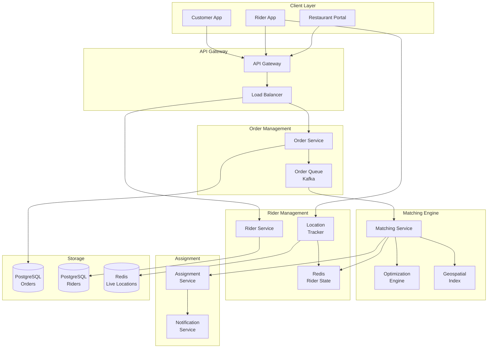
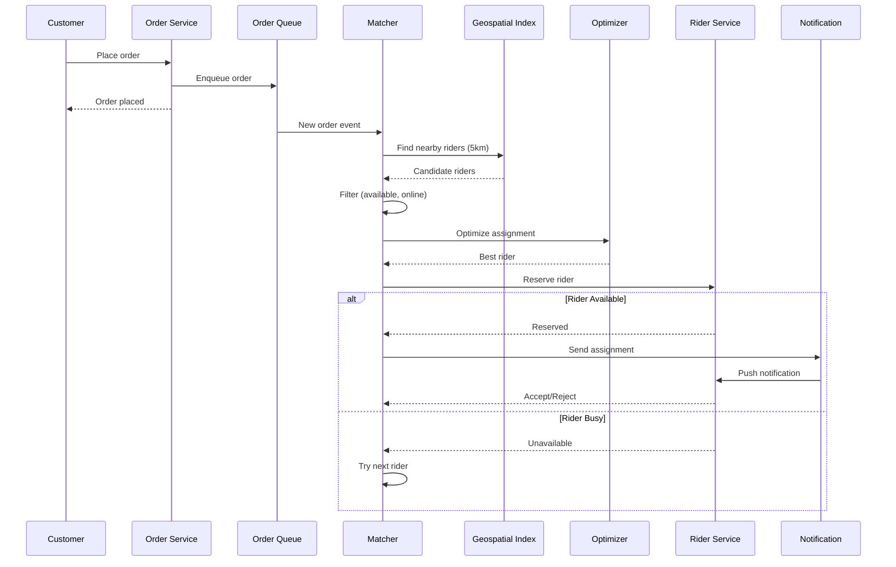

# Rider Matching for Ride Hailing or Food Delivery

[← Back to Topics](../topics.md#rider-matching-for-ride-hailing-or-food-delivery-app)

## Problem Statement

Design a rider/driver matching system that assigns orders to delivery partners in real-time optimizing for delivery time, driver utilization, and customer satisfaction. Handle 100K concurrent assignments.

---

## Requirements

### Functional Requirements
1. **Order Assignment**: Match orders to riders
2. **Real-Time Matching**: <5s assignment time
3. **Multi-Objective**: Optimize time, distance, fairness
4. **Batch Matching**: Batch multiple orders
5. **Re-Assignment**: Handle cancellations, reassign
6. **Rider Preferences**: Consider rider zones, shifts
7. **Order Prioritization**: VIP customers, time-sensitive

### Non-Functional Requirements
1. **Scale**: 100K concurrent orders
2. **Latency**: <5s matching
3. **Throughput**: 10K assignments/min
4. **Availability**: 99.99% uptime
5. **Fairness**: Balanced assignments
6. **Optimization**: Minimize delivery time

### Scale Estimates
- **Active riders**: 100,000
- **Orders per minute**: 10,000
- **Average delivery time**: 30 minutes
- **Concurrent orders**: 100,000
- **Geohash precision**: 6 characters (≈1.2km)
- **Assignment decisions**: 600K/hour

---

## High-Level Architecture



---

## Detailed Design

### 1. Matching Flow



---

### 2. Matching Service

```java
import java.util.*;
import java.util.stream.Collectors;
import redis.clients.jedis.*;

/**
 * Matching service
 * Assigns orders to riders in real-time
 */
public class MatchingService {
    
    private final GeospatialIndex geospatialIndex;
    private final RiderStateService riderState;
    private final OptimizationEngine optimizer;
    private final AssignmentService assignmentService;
    private final JedisPool jedisPool;
    
    private static final double SEARCH_RADIUS_KM = 5.0;
    private static final int MAX_CANDIDATES = 50;
    private static final int ASSIGNMENT_TIMEOUT_SECONDS = 30;
    
    public MatchingService(
        GeospatialIndex geospatialIndex,
        RiderStateService riderState,
        OptimizationEngine optimizer,
        AssignmentService assignmentService,
        JedisPool jedisPool
    ) {
        this.geospatialIndex = geospatialIndex;
        this.riderState = riderState;
        this.optimizer = optimizer;
        this.assignmentService = assignmentService;
        this.jedisPool = jedisPool;
    }
    
    /**
     * Match order to rider
     */
    public MatchingResult matchOrder(Order order) {
        
        // Find candidate riders
        List<Rider> candidates = findCandidateRiders(order);
        
        if (candidates.isEmpty()) {
            return MatchingResult.noRidersAvailable();
        }
        
        // Score and rank candidates
        List<ScoredRider> scoredRiders = optimizer.scoreRiders(order, candidates);
        
        // Try to assign to best rider
        for (ScoredRider scored : scoredRiders) {
            
            Rider rider = scored.getRider();
            
            // Try to reserve rider
            boolean reserved = tryReserveRider(rider.getId(), order.getId());
            
            if (reserved) {
                
                // Send assignment notification
                boolean accepted = assignmentService.assignOrder(rider.getId(), order.getId());
                
                if (accepted) {
                    
                    // Update rider state
                    riderState.markBusy(rider.getId(), order.getId());
                    
                    return MatchingResult.success(rider.getId(), scored.getScore());
                    
                } else {
                    
                    // Rider rejected, try next
                    releaseRider(rider.getId());
                    continue;
                }
            }
        }
        
        // No rider accepted
        return MatchingResult.noRiderAccepted();
    }
    
    /**
     * Find candidate riders
     */
    private List<Rider> findCandidateRiders(Order order) {
        
        Location pickupLocation = order.getPickupLocation();
        
        // Find nearby riders using geospatial index
        List<String> nearbyRiderIds = geospatialIndex.findNearby(
            pickupLocation.getLatitude(),
            pickupLocation.getLongitude(),
            SEARCH_RADIUS_KM,
            MAX_CANDIDATES
        );
        
        // Filter riders by availability
        List<Rider> candidates = new ArrayList<>();
        
        for (String riderId : nearbyRiderIds) {
            
            RiderState state = riderState.getState(riderId);
            
            // Check if rider is available
            if (state != null && state.isAvailable()) {
                
                Rider rider = new Rider();
                rider.setId(riderId);
                rider.setLocation(state.getLocation());
                rider.setVehicleType(state.getVehicleType());
                rider.setRating(state.getRating());
                rider.setCompletedOrders(state.getCompletedOrders());
                
                candidates.add(rider);
            }
        }
        
        return candidates;
    }
    
    /**
     * Try to reserve rider for order assignment
     */
    private boolean tryReserveRider(String riderId, String orderId) {
        
        try (Jedis jedis = jedisPool.getResource()) {
            
            String reservationKey = "reservation:" + riderId;
            
            // Try to set reservation with NX (only if not exists)
            String result = jedis.set(
                reservationKey,
                orderId,
                "NX",  // Only set if not exists
                "EX",  // Set expiry
                ASSIGNMENT_TIMEOUT_SECONDS
            );
            
            return "OK".equals(result);
        }
    }
    
    /**
     * Release rider reservation
     */
    private void releaseRider(String riderId) {
        
        try (Jedis jedis = jedisPool.getResource()) {
            
            String reservationKey = "reservation:" + riderId;
            jedis.del(reservationKey);
        }
    }
}

/**
 * Optimization engine
 * Scores and ranks riders for orders
 */
class OptimizationEngine {
    
    private final DistanceCalculator distanceCalc;
    
    public OptimizationEngine(DistanceCalculator distanceCalc) {
        this.distanceCalc = distanceCalc;
    }
    
    /**
     * Score riders for an order
     */
    public List<ScoredRider> scoreRiders(Order order, List<Rider> riders) {
        
        List<ScoredRider> scored = new ArrayList<>();
        
        for (Rider rider : riders) {
            
            double score = calculateScore(order, rider);
            scored.add(new ScoredRider(rider, score));
        }
        
        // Sort by score (higher is better)
        scored.sort((a, b) -> Double.compare(b.getScore(), a.getScore()));
        
        return scored;
    }
    
    /**
     * Calculate score for rider-order pair
     * Higher score = better match
     */
    private double calculateScore(Order order, Rider rider) {
        
        double score = 0;
        
        // 1. Distance score (closer is better)
        double distanceKm = distanceCalc.calculate(
            order.getPickupLocation(),
            rider.getLocation()
        );
        
        double distanceScore = Math.max(0, 100 - (distanceKm * 10));  // Penalty for distance
        score += distanceScore * 0.4;  // 40% weight
        
        // 2. ETA score (faster is better)
        double etaMinutes = distanceKm / 0.5;  // Assume 30 km/h average speed
        double etaScore = Math.max(0, 100 - (etaMinutes * 5));
        score += etaScore * 0.3;  // 30% weight
        
        // 3. Rating score
        double ratingScore = rider.getRating() * 20;  // Convert 0-5 to 0-100
        score += ratingScore * 0.2;  // 20% weight
        
        // 4. Fairness score (riders with fewer orders get higher score)
        int completedOrders = rider.getCompletedOrders();
        double fairnessScore = Math.max(0, 100 - (completedOrders * 0.1));
        score += fairnessScore * 0.1;  // 10% weight
        
        // 5. Vehicle type match
        if (order.getRequiredVehicleType() != null) {
            if (order.getRequiredVehicleType().equals(rider.getVehicleType())) {
                score += 10;  // Bonus for matching vehicle
            } else {
                return 0;  // Incompatible vehicle type
            }
        }
        
        return score;
    }
}

/**
 * Geospatial index
 * Indexes rider locations for fast proximity search
 */
class GeospatialIndex {
    
    private final JedisPool jedisPool;
    
    private static final String GEO_KEY = "rider_locations";
    
    public GeospatialIndex(JedisPool jedisPool) {
        this.jedisPool = jedisPool;
    }
    
    /**
     * Update rider location
     */
    public void updateLocation(String riderId, double latitude, double longitude) {
        
        try (Jedis jedis = jedisPool.getResource()) {
            
            // Add to Redis geospatial index
            jedis.geoadd(GEO_KEY, longitude, latitude, riderId);
        }
    }
    
    /**
     * Find riders near a location
     */
    public List<String> findNearby(
        double latitude,
        double longitude,
        double radiusKm,
        int limit
    ) {
        
        try (Jedis jedis = jedisPool.getResource()) {
            
            // Query Redis geospatial index
            List<GeoRadiusResponse> results = jedis.georadius(
                GEO_KEY,
                longitude,
                latitude,
                radiusKm,
                GeoUnit.KM
            );
            
            return results.stream()
                .limit(limit)
                .map(GeoRadiusResponse::getMemberByString)
                .collect(Collectors.toList());
        }
    }
    
    /**
     * Remove rider from index
     */
    public void removeRider(String riderId) {
        
        try (Jedis jedis = jedisPool.getResource()) {
            jedis.zrem(GEO_KEY, riderId);
        }
    }
}

/**
 * Order
 */
class Order {
    
    private String id;
    private Location pickupLocation;
    private Location deliveryLocation;
    private String requiredVehicleType;
    private boolean isVIP;
    private long createdAt;
    
    // Getters and setters
    public String getId() { return id; }
    public void setId(String id) { this.id = id; }
    
    public Location getPickupLocation() { return pickupLocation; }
    public void setPickupLocation(Location location) { this.pickupLocation = location; }
    
    public Location getDeliveryLocation() { return deliveryLocation; }
    public void setDeliveryLocation(Location location) { this.deliveryLocation = location; }
    
    public String getRequiredVehicleType() { return requiredVehicleType; }
    public void setRequiredVehicleType(String type) { this.requiredVehicleType = type; }
    
    public boolean isVIP() { return isVIP; }
    public void setVIP(boolean VIP) { isVIP = VIP; }
    
    public long getCreatedAt() { return createdAt; }
    public void setCreatedAt(long createdAt) { this.createdAt = createdAt; }
}

/**
 * Rider
 */
class Rider {
    
    private String id;
    private Location location;
    private String vehicleType;
    private double rating;
    private int completedOrders;
    
    // Getters and setters
    public String getId() { return id; }
    public void setId(String id) { this.id = id; }
    
    public Location getLocation() { return location; }
    public void setLocation(Location location) { this.location = location; }
    
    public String getVehicleType() { return vehicleType; }
    public void setVehicleType(String vehicleType) { this.vehicleType = vehicleType; }
    
    public double getRating() { return rating; }
    public void setRating(double rating) { this.rating = rating; }
    
    public int getCompletedOrders() { return completedOrders; }
    public void setCompletedOrders(int completedOrders) { 
        this.completedOrders = completedOrders; 
    }
}

/**
 * Location
 */
class Location {
    private double latitude;
    private double longitude;
    
    public double getLatitude() { return latitude; }
    public void setLatitude(double latitude) { this.latitude = latitude; }
    
    public double getLongitude() { return longitude; }
    public void setLongitude(double longitude) { this.longitude = longitude; }
}

/**
 * Rider state
 */
class RiderState {
    
    private String riderId;
    private RiderStatus status;
    private Location location;
    private String vehicleType;
    private double rating;
    private int completedOrders;
    
    public boolean isAvailable() {
        return status == RiderStatus.AVAILABLE;
    }
    
    // Getters
    public String getRiderId() { return riderId; }
    public RiderStatus getStatus() { return status; }
    public Location getLocation() { return location; }
    public String getVehicleType() { return vehicleType; }
    public double getRating() { return rating; }
    public int getCompletedOrders() { return completedOrders; }
}

/**
 * Rider status
 */
enum RiderStatus {
    AVAILABLE,
    BUSY,
    OFFLINE
}

/**
 * Scored rider
 */
class ScoredRider {
    
    private final Rider rider;
    private final double score;
    
    public ScoredRider(Rider rider, double score) {
        this.rider = rider;
        this.score = score;
    }
    
    public Rider getRider() { return rider; }
    public double getScore() { return score; }
}

/**
 * Matching result
 */
class MatchingResult {
    
    private boolean success;
    private String riderId;
    private double score;
    private String failureReason;
    
    public static MatchingResult success(String riderId, double score) {
        MatchingResult result = new MatchingResult();
        result.success = true;
        result.riderId = riderId;
        result.score = score;
        return result;
    }
    
    public static MatchingResult noRidersAvailable() {
        MatchingResult result = new MatchingResult();
        result.success = false;
        result.failureReason = "No riders available nearby";
        return result;
    }
    
    public static MatchingResult noRiderAccepted() {
        MatchingResult result = new MatchingResult();
        result.success = false;
        result.failureReason = "No rider accepted the order";
        return result;
    }
    
    public boolean isSuccess() { return success; }
    public String getRiderId() { return riderId; }
}

// Service interfaces
interface RiderStateService {
    RiderState getState(String riderId);
    void markBusy(String riderId, String orderId);
}

interface AssignmentService {
    boolean assignOrder(String riderId, String orderId);
}

interface DistanceCalculator {
    double calculate(Location from, Location to);
}
```

---

## Technology Stack

| Component | Technology | Justification |
|-----------|------------|---------------|
| **Geospatial** | Redis Geospatial | Fast proximity search |
| **Message Queue** | Kafka | Order streaming |
| **Cache** | Redis | Rider state |
| **Database** | PostgreSQL | Orders, riders |
| **Notifications** | FCM/APNs | Push notifications |

---

## Performance Characteristics

### Matching Performance
```
Matching latency: <5s p99
Candidate search: <100ms
Optimization: <500ms
Assignment: <2s
```

### Scale
```
Concurrent orders: 100K
Active riders: 100K
Assignments/min: 10K
Geospatial queries/sec: 50K
```

---

## Trade-offs

### 1. Batch vs Real-Time
- **Batch**: Better optimization, delay
- **Real-time**: Fast, suboptimal

### 2. Optimization Objective
- **Minimize ETA**: Fast delivery, rider idle time
- **Maximize utilization**: Efficient, longer wait

### 3. Fairness vs Efficiency
- **Fair distribution**: Balanced, slower
- **Best match only**: Fast, unbalanced

---

## Summary

This design provides:
- ✅ **<5s** matching latency
- ✅ **100K** concurrent orders
- ✅ **Multi-objective** optimization
- ✅ **Real-time** assignments
- ✅ **Fair** distribution
- ✅ **Geospatial** indexing

**Key Features:**
1. Redis geospatial for proximity search
2. Multi-factor scoring (distance, ETA, rating, fairness)
3. Reservation system to prevent double-assignment
4. Real-time rider location tracking
5. Weighted scoring algorithm
6. Automatic re-assignment on rejection

[← Back to Topics](../topics.md#rider-matching-for-ride-hailing-or-food-delivery-app)
